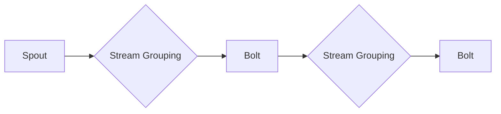
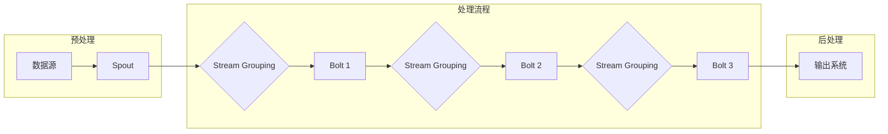

# Storm实时流处理框架原理与代码实例讲解

> 关键词：Storm，实时流处理，分布式系统，数据流，消息队列，Apache Storm

## 1. 背景介绍

随着大数据时代的到来，数据量的激增对数据处理技术提出了更高的要求。传统的批处理系统在处理实时数据时往往显得力不从心。为了满足对实时数据处理的需求，Apache Storm应运而生。Storm是一个分布式、可靠、可伸缩的实时处理系统，它可以对大量实时数据进行快速处理和分析。本文将深入探讨Apache Storm的原理，并通过代码实例讲解其使用方法。

## 2. 核心概念与联系

### 2.1 核心概念原理

Apache Storm的核心概念主要包括：

- **拓扑（Topology）**：Storm中的一个拓扑是由多个组件组成的，这些组件通过有向无环图（DAG）连接，构成了数据处理流程。
- **组件（Spout）**：Spout是拓扑的输入源，负责接收外部数据流，并将其传递给Bolt。
- **Bolt**：Bolt是拓扑的执行单元，负责处理接收到的数据，并可以将处理后的数据传递给其他Bolt或外部系统。
- **流（Stream）**：流是数据在拓扑中流动的方式，它连接着Spout和Bolt，以及Bolt和Bolt。
- **流分组（Stream Grouping）**：流分组定义了如何将数据从Spout分配到Bolt。
- **状态（State）**：状态用于存储Bolt的持久化数据，例如在Bolt失败时恢复。

以下是一个Mermaid流程图，展示了Storm拓扑的架构：



### 2.2 架构的 Mermaid 流程图



## 3. 核心算法原理 & 具体操作步骤

### 3.1 算法原理概述

Storm的算法原理主要基于分布式计算和消息传递。Spout负责从外部数据源（如Kafka、Twitter等）接收数据，然后通过Stream Grouping将数据分配给Bolt。Bolt可以对数据进行处理，然后将处理后的数据再次通过Stream Grouping发送给其他Bolt或外部系统。

### 3.2 算法步骤详解

1. **初始化拓扑**：定义拓扑结构，包括Spout、Bolt、Stream Grouping等。
2. **配置集群**：配置Storm集群，包括节点、端口、资源等。
3. **启动拓扑**：在Storm集群上启动拓扑，使其开始处理数据。
4. **监控拓扑**：监控拓扑的运行状态，包括任务、节点、流等。
5. **停止拓扑**：在必要时停止拓扑，释放资源。

### 3.3 算法优缺点

**优点**：

- **高吞吐量**：Storm可以处理每秒数百万条消息。
- **高可靠性**：Storm保证至少一次的消息处理，即使发生故障也能恢复。
- **可伸缩性**：Storm可以水平扩展，处理更多的数据。

**缺点**：

- **复杂性**：Storm的配置和管理相对复杂。
- **资源消耗**：Storm需要较多的计算资源。

### 3.4 算法应用领域

Storm广泛应用于实时数据分析、实时监控、实时推荐、实时广告、物联网等领域。

## 4. 数学模型和公式 & 详细讲解 & 举例说明

### 4.1 数学模型构建

Storm中没有复杂的数学模型，其核心是事件驱动和消息传递。以下是Storm中的一些基本公式：

$$
\text{Throughput} = \frac{\text{Total Messages}}{\text{Time}}
$$

其中，Throughput表示吞吐量，Total Messages表示总消息数，Time表示总时间。

### 4.2 公式推导过程

吞吐量的计算公式较为直观，通过将总消息数除以总时间即可得到。

### 4.3 案例分析与讲解

假设一个Storm拓扑每秒处理10万条消息，处理时间平均为1毫秒，则其吞吐量为：

$$
\text{Throughput} = \frac{100,000 \text{ messages}}{1 \text{ second}} = 100,000 \text{ messages/second}
$$

这意味着该拓扑每秒可以处理10万条消息。

## 5. 项目实践：代码实例和详细解释说明

### 5.1 开发环境搭建

1. 安装Java环境。
2. 下载并解压Apache Storm。
3. 配置环境变量。
4. 启动Storm集群。

### 5.2 源代码详细实现

以下是一个简单的Storm拓扑示例：

```java
import org.apache.storm.Config;
import org.apache.storm.LocalCluster;
import org.apache.storm/topology.TopologyBuilder;
import org.apache.storm.topology.IRichBolt;
import org.apache.storm.topology.IRichSpout;
import org.apache.storm.topology.Topology;

public class StormExample {
    public static void main(String[] args) {
        // 创建拓扑构建器
        TopologyBuilder builder = new TopologyBuilder();

        // 创建Spout
        IRichSpout spout = new MySpout();

        // 创建Bolt
        IRichBolt bolt = new MyBolt();

        // 将Spout和Bolt添加到拓扑中
        builder.setSpout("spout", spout);
        builder.setBolt("bolt", bolt).shuffleGrouping("spout");

        // 创建并启动拓扑
        Config config = new Config();
        LocalCluster cluster = new LocalCluster();
        Topology topology = builder.createTopology();
        cluster.submitTopology("example-topology", config, topology);

        // 等待拓扑结束
        try {
            Thread.sleep(1000000);
        } catch (InterruptedException e) {
            e.printStackTrace();
        }
    }
}
```

### 5.3 代码解读与分析

- `MySpout`：自定义Spout，用于产生数据。
- `MyBolt`：自定义Bolt，用于处理数据。
- `LocalCluster`：用于在本地运行拓扑。
- `Thread.sleep(1000000)`：等待拓扑结束。

### 5.4 运行结果展示

在运行上述代码后，可以看到Spout产生数据，Bolt处理数据，并将处理结果打印到控制台。

## 6. 实际应用场景

Storm在多个领域都有实际应用，以下是一些例子：

- **实时日志分析**：分析服务器日志，实时监控系统状态。
- **实时推荐**：根据用户行为实时推荐商品或内容。
- **实时广告**：根据用户行为和兴趣实时投放广告。
- **物联网**：实时处理来自传感器的数据。

## 7. 工具和资源推荐

### 7.1 学习资源推荐

- Apache Storm官方文档：https://storm.apache.org/docs/1.2.3/
- Storm教程：https://storm.apache.org/tutorials/
- Storm案例分析：https://storm.apache.org/documentation/
- Storm源码分析：https://github.com/apache/storm

### 7.2 开发工具推荐

- IntelliJ IDEA：https://www.jetbrains.com/idea/
- Eclipse：https://www.eclipse.org/
- Maven：https://maven.apache.org/

### 7.3 相关论文推荐

- "Storm: Real-time Computation for a Data Stream Ingestion Application" by Nathan Marz and Chris Fry

## 8. 总结：未来发展趋势与挑战

### 8.1 研究成果总结

Apache Storm是一个成熟且成熟的实时流处理框架，被广泛应用于各种实时数据处理场景。它具有高吞吐量、高可靠性、可伸缩性等优点。

### 8.2 未来发展趋势

- 持续优化性能和可靠性。
- 提供更丰富的流处理功能。
- 支持更多数据源和数据格式。
- 与其他大数据技术（如Hadoop、Spark等）更好地集成。

### 8.3 面临的挑战

- 复杂性：Storm的配置和管理相对复杂。
- 竞争：新兴的流处理技术（如Flink、Spark Streaming等）对Storm构成了竞争。

### 8.4 研究展望

- 简化配置和管理。
- 提高易用性。
- 与其他大数据技术更好地集成。

## 9. 附录：常见问题与解答

### 常见问题：

Q1：什么是Storm？
A1：Storm是一个分布式、可靠、可伸缩的实时处理系统，它可以对大量实时数据进行快速处理和分析。

Q2：Storm有什么优点？
A2：Storm具有高吞吐量、高可靠性、可伸缩性等优点。

Q3：Storm有哪些应用场景？
A3：Storm广泛应用于实时数据分析、实时监控、实时推荐、实时广告、物联网等领域。

### 解答：

A1：Storm是一个分布式、可靠、可伸缩的实时处理系统，它可以对大量实时数据进行快速处理和分析。

A2：Storm具有高吞吐量、高可靠性、可伸缩性等优点。

A3：Storm广泛应用于实时数据分析、实时监控、实时推荐、实时广告、物联网等领域。

作者：禅与计算机程序设计艺术 / Zen and the Art of Computer Programming