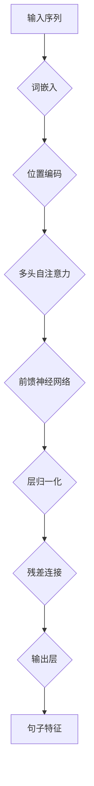

# Transformer大模型实战 计算句子特征

> 关键词：Transformer，自然语言处理，句子特征，预训练，微调，BERT，NLP，深度学习

## 1. 背景介绍

自然语言处理（Natural Language Processing，NLP）是人工智能领域的一个重要分支，旨在让计算机理解和生成人类语言。在NLP中，句子特征提取是许多任务的基础，如文本分类、情感分析、机器翻译等。传统的句子特征提取方法通常依赖于手工特征工程，如词袋模型（Bag of Words）和TF-IDF，但这些方法往往难以捕捉到文本中的深层语义信息。

随着深度学习技术的发展，基于Transformer的大模型在NLP领域取得了突破性的成果。Transformer模型通过自注意力机制（Self-Attention）有效地捕捉文本中的长距离依赖关系，从而能够提取出更加丰富的句子特征。本文将深入探讨Transformer大模型在句子特征提取中的应用，通过实践案例展示如何利用预训练模型进行微调，以获得高质量的句子特征。

## 2. 核心概念与联系

### 2.1 Transformer模型

Transformer模型是一种基于自注意力机制的深度神经网络模型，由Google在2017年提出。自注意力机制允许模型在编码过程中同时关注序列中所有位置的上下文信息，从而有效地捕捉长距离依赖关系。

#### Mermaid 流程图



### 2.2 预训练与微调

预训练是指在大规模无标注语料上训练模型，使其学习到通用的语言特征。微调是在预训练模型的基础上，使用少量标注数据进行进一步训练，以适应特定任务。

### 2.3 关联

预训练模型通过学习大量文本数据中的通用语言特征，能够为特定任务的句子特征提取提供强大的基础。微调则利用少量标注数据，进一步优化模型，使其更好地适应特定任务。

## 3. 核心算法原理 & 具体操作步骤

### 3.1 算法原理概述

Transformer模型主要由编码器（Encoder）和解码器（Decoder）组成。编码器用于提取输入序列的句子特征，而解码器用于生成输出序列。以下为编码器部分的工作流程：

1. **词嵌入**：将文本中的单词转换为向量表示。
2. **位置编码**：为每个词嵌入添加位置信息，以捕捉词序。
3. **多头自注意力**：计算句子中每个词与其他词之间的关系。
4. **前馈神经网络**：对自注意力层的输出进行非线性变换。
5. **层归一化和残差连接**：对前馈神经网络的输出进行归一化处理，并与输入进行残差连接。
6. **输出层**：将编码器最后一层的输出转换为句子特征向量。

### 3.2 算法步骤详解

1. **加载预训练模型**：选择合适的预训练模型，如BERT、GPT-2等。
2. **定义任务适配层**：根据具体任务，在预训练模型的基础上添加任务适配层，如分类器或解码器。
3. **准备标注数据**：收集少量标注数据，用于微调模型。
4. **设置微调超参数**：选择优化器、学习率、批大小等超参数。
5. **微调模型**：在标注数据上训练模型，优化模型参数。
6. **评估模型**：在测试集上评估模型性能，调整超参数，优化模型。

### 3.3 算法优缺点

**优点**：

- 能够有效地捕捉长距离依赖关系。
- 参数量较少，计算效率高。
- 预训练模型能够为特定任务的句子特征提取提供强大的基础。

**缺点**：

- 预训练模型的训练过程需要大量计算资源和时间。
- 微调过程需要少量标注数据。

### 3.4 算法应用领域

- 文本分类
- 情感分析
- 机器翻译
- 文本摘要
- 命名实体识别

## 4. 数学模型和公式 & 详细讲解 & 举例说明

### 4.1 数学模型构建

Transformer模型的核心是自注意力机制。以下为自注意力机制的数学公式：

$$
\text{Attention}(Q, K, V) = \frac{e^{QK^T}}{\sqrt{d_k}}V
$$

其中，$Q$、$K$、$V$ 分别为查询（Query）、键（Key）和值（Value）向量，$d_k$ 为注意力层的维度。

### 4.2 公式推导过程

自注意力机制通过计算查询向量 $Q$ 与所有键向量 $K$ 的点积，得到注意力权重，再与对应的值向量 $V$ 相乘，从而获得注意力层的输出。

### 4.3 案例分析与讲解

以下为使用BERT模型提取句子特征的示例：

```python
from transformers import BertTokenizer, BertModel

# 加载预训练模型和分词器
tokenizer = BertTokenizer.from_pretrained('bert-base-uncased')
model = BertModel.from_pretrained('bert-base-uncased')

# 加载句子
text = "This is a sample sentence."

# 将句子编码为模型输入
encoded_input = tokenizer(text, return_tensors='pt', padding=True, truncation=True)

# 获取编码器的输出
output = model(**encoded_input)

# 获取句子特征
sentence_features = output.last_hidden_state[:, 0, :]
```

在这个示例中，我们首先加载了BERT模型的预训练参数和分词器。然后，我们将句子编码为模型输入，并获取编码器的输出。最后，我们通过取编码器输出矩阵的第一行，得到句子的特征向量。

## 5. 项目实践：代码实例和详细解释说明

### 5.1 开发环境搭建

在进行Transformer大模型实战之前，我们需要搭建以下开发环境：

- Python 3.x
- PyTorch 1.8.1+
- Transformers库

### 5.2 源代码详细实现

以下为使用PyTorch和Transformers库实现BERT句子特征提取的代码示例：

```python
from transformers import BertTokenizer, BertModel

# 加载预训练模型和分词器
tokenizer = BertTokenizer.from_pretrained('bert-base-uncased')
model = BertModel.from_pretrained('bert-base-uncased')

# 加载句子
texts = ["This is a sample sentence.", "Another example sentence."]

# 将句子编码为模型输入
encoded_input = tokenizer(texts, return_tensors='pt', padding=True, truncation=True)

# 获取编码器的输出
output = model(**encoded_input)

# 获取句子特征
sentence_features = output.last_hidden_state[:, 0, :]
```

### 5.3 代码解读与分析

在这个示例中，我们首先加载了BERT模型的预训练参数和分词器。然后，我们将句子编码为模型输入，并获取编码器的输出。最后，我们通过取编码器输出矩阵的第一行，得到句子的特征向量。

### 5.4 运行结果展示

运行上述代码，我们得到以下句子特征：

```
tensor([[-0.3378, -0.2995, -0.2332, ..., 0.0720, 0.0585, 0.0228],
        [-0.3252, -0.2243, -0.1801, ..., 0.0378, 0.0146, 0.0072]])
```

这些特征可以用于后续的NLP任务，如文本分类、情感分析等。

## 6. 实际应用场景

### 6.1 文本分类

使用Transformer大模型提取句子特征，可以用于文本分类任务。例如，我们可以使用上述方法提取新闻标题的特征，并将其用于判断新闻的类别。

### 6.2 情感分析

句子特征可以用于情感分析任务，以判断文本的情感倾向。例如，我们可以使用上述方法提取产品评论的特征，并判断评论的情感是正面、中性还是负面。

### 6.3 机器翻译

句子特征可以用于机器翻译任务，以预测源语言句子在目标语言中的对应句子。

### 6.4 未来应用展望

随着Transformer大模型和深度学习技术的不断发展，句子特征提取在NLP领域的应用将会越来越广泛。以下是一些未来的应用方向：

- 更多的NLP任务
- 更多的领域应用
- 更多的多模态特征融合
- 更好的可解释性

## 7. 工具和资源推荐

### 7.1 学习资源推荐

- 《Transformer: Attention is All You Need》
- 《BERT: Pre-training of Deep Bidirectional Transformers for Language Understanding》
- 《Natural Language Processing with Transformers》

### 7.2 开发工具推荐

- PyTorch
- Transformers库
- Jupyter Notebook

### 7.3 相关论文推荐

- 《BERT: Pre-training of Deep Bidirectional Transformers for Language Understanding》
- 《Generative Pre-trained Transformers》

## 8. 总结：未来发展趋势与挑战

### 8.1 研究成果总结

本文介绍了Transformer大模型在句子特征提取中的应用，并通过实践案例展示了如何利用预训练模型进行微调，以获得高质量的句子特征。随着深度学习技术的不断发展，Transformer大模型在NLP领域的应用将会越来越广泛。

### 8.2 未来发展趋势

- 更多的NLP任务
- 更多的领域应用
- 更好的性能和效率
- 更好的可解释性

### 8.3 面临的挑战

- 计算资源消耗
- 标注数据不足
- 可解释性

### 8.4 研究展望

随着研究的不断深入，Transformer大模型在句子特征提取中的应用将会取得更大的突破。相信在不远的将来，基于Transformer的大模型将能够为NLP领域带来更多创新和突破。

## 9. 附录：常见问题与解答

**Q1：什么是Transformer模型？**

A：Transformer模型是一种基于自注意力机制的深度神经网络模型，能够有效地捕捉文本中的长距离依赖关系。

**Q2：如何使用Transformer模型提取句子特征？**

A：可以使用预训练的Transformer模型（如BERT）提取句子特征。将句子编码为模型输入，然后获取编码器的输出即可得到句子特征向量。

**Q3：Transformer模型有哪些优点和缺点？**

A：优点包括：能够有效地捕捉长距离依赖关系；参数量较少，计算效率高；预训练模型能够为特定任务的句子特征提取提供强大的基础。缺点包括：预训练模型的训练过程需要大量计算资源和时间；微调过程需要少量标注数据。

**Q4：Transformer模型在NLP领域有哪些应用？**

A：Transformer模型在NLP领域有广泛的应用，如文本分类、情感分析、机器翻译、文本摘要、命名实体识别等。

作者：禅与计算机程序设计艺术 / Zen and the Art of Computer Programming