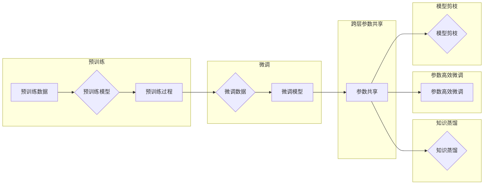

> 关键词：Transformer, 大模型，跨层参数共享，预训练，微调，模型压缩，知识蒸馏，参数高效微调，自然语言处理

# Transformer大模型实战 跨层参数共享

> Transformer大模型已经成为自然语言处理领域的事实标准，其强大的并行计算能力和对语言结构的深刻理解，为各种NLP任务提供了强大的支持。然而，随着模型规模的不断扩大，模型的训练和推理成本也随之增加。跨层参数共享作为一种有效的模型压缩技术，可以在保持模型性能的同时，显著降低模型的大小和计算复杂度。本文将深入探讨Transformer大模型中的跨层参数共享技术，并展示其实战应用。

## 1. 背景介绍

### 1.1 问题的由来

随着深度学习技术的快速发展，大规模预训练语言模型（如BERT、GPT-3）在自然语言处理领域取得了突破性的进展。这些模型通过在海量文本语料上预训练，学习到了丰富的语言知识，并在各种NLP任务上取得了优异的性能。然而，随着模型规模的不断扩大，模型的参数数量也呈现出爆炸式增长，导致以下问题：

- **训练成本高昂**：大规模模型的训练需要大量的计算资源和时间。
- **推理效率低下**：模型的推理速度较慢，难以满足实时性要求。
- **内存占用过大**：模型占用大量的内存空间，对硬件要求较高。

为了解决上述问题，研究者们提出了多种模型压缩技术，其中跨层参数共享是一种有效的方法。

### 1.2 研究现状

近年来，跨层参数共享技术在大模型领域得到了广泛关注。研究人员提出了多种跨层参数共享策略，如：

- **知识蒸馏**：将大模型的输出作为“教师模型”，小模型的输出作为“学生模型”，通过最小化教师模型和学生模型输出之间的差异，使小模型学习到大模型的知识。
- **参数高效微调**：通过仅微调模型的一小部分参数，而不是整个模型，来降低模型的计算复杂度。
- **模型剪枝**：移除模型中不重要的参数，以减小模型大小和计算复杂度。

### 1.3 研究意义

跨层参数共享技术在大模型领域具有重要的研究意义：

- **降低训练成本**：通过减小模型规模，可以显著降低模型训练所需的计算资源和时间。
- **提高推理效率**：小型化模型可以更快地进行推理，满足实时性要求。
- **减少内存占用**：小型化模型可以降低对硬件的要求，提高部署的灵活性。

## 2. 核心概念与联系

### 2.1 核心概念

#### 2.1.1 Transformer模型

Transformer模型是一种基于自注意力机制的深度神经网络模型，由Google在2017年提出。它由多个编码器和解码器层组成，能够有效地处理序列到序列的任务，如机器翻译、文本摘要等。

#### 2.1.2 预训练

预训练是指在大规模无标签数据集上训练模型的过程，旨在学习通用的语言表示和知识。预训练模型可以用于下游任务的微调，以提高模型在特定任务上的性能。

#### 2.1.3 微调

微调是指在预训练模型的基础上，使用下游任务的标注数据重新训练模型的过程。微调可以通过调整模型的参数来优化模型在特定任务上的性能。

#### 2.1.4 跨层参数共享

跨层参数共享是指在不同层的模型参数之间共享信息，以减小模型规模和计算复杂度。

### 2.2 核心概念原理和架构的 Mermaid 流程图



### 2.3 核心概念之间的联系

预训练模型是微调的基础，通过预训练，模型学习到了通用的语言知识和表征。微调则是在预训练模型的基础上，针对特定任务进行调整和优化。跨层参数共享、知识蒸馏、参数高效微调、模型剪枝等都是微调过程中常用的技术，它们通过不同方式减小模型规模和计算复杂度，同时保持模型性能。

## 3. 核心算法原理 & 具体操作步骤

### 3.1 算法原理概述

跨层参数共享技术通过在不同层的模型参数之间共享信息，以减小模型规模和计算复杂度。以下是几种常见的跨层参数共享技术：

#### 3.1.1 知识蒸馏

知识蒸馏是一种将大模型知识迁移到小模型的方法。其基本思想是将大模型的输出作为“教师模型”，小模型的输出作为“学生模型”，通过最小化教师模型和学生模型输出之间的差异，使小模型学习到大模型的知识。

#### 3.1.2 参数高效微调

参数高效微调通过仅微调模型的一小部分参数，而不是整个模型，来降低模型的计算复杂度。常见的参数高效微调方法包括：

- **Adapter**：通过添加轻量级的参数模块，将大模型的参数映射到小模型上。
- **Prefix-Tuning**：通过仅微调模型的一部分参数，而不是整个模型，来降低计算复杂度。

#### 3.1.3 模型剪枝

模型剪枝是通过移除模型中不重要的参数，以减小模型大小和计算复杂度。常见的模型剪枝方法包括：

- **结构化剪枝**：移除模型中的整个层或神经元。
- **非结构化剪枝**：移除模型中的一部分参数。

### 3.2 算法步骤详解

#### 3.2.1 知识蒸馏

1. 训练教师模型：在无标签数据集上预训练教师模型。
2. 训练学生模型：在标注数据集上训练学生模型，同时最小化教师模型和学生模型输出之间的差异。
3. 模型评估：在测试集上评估学生模型的性能。

#### 3.2.2 参数高效微调

1. 预训练大模型：在无标签数据集上预训练大模型。
2. 定义轻量级参数模块：根据小模型的架构，设计轻量级的参数模块。
3. 映射大模型参数：将大模型的参数映射到小模型和轻量级参数模块上。
4. 微调小模型：在标注数据集上微调小模型和轻量级参数模块。
5. 模型评估：在测试集上评估小模型的性能。

#### 3.2.3 模型剪枝

1. 预训练模型：在无标签数据集上预训练模型。
2. 计算剪枝权重：根据参数的重要性计算剪枝权重。
3. 剪枝：根据剪枝权重移除模型中不重要的参数。
4. 微调模型：在标注数据集上微调剪枝后的模型。
5. 模型评估：在测试集上评估模型的性能。

### 3.3 算法优缺点

#### 3.3.1 知识蒸馏

优点：

- 可以将大模型的知识迁移到小模型上，提高小模型性能。
- 可以在小模型上实现与大型模型相似的性能。

缺点：

- 训练过程较为复杂，需要设计特殊的训练目标函数。
- 对标注数据的依赖较大。

#### 3.3.2 参数高效微调

优点：

- 可以在小模型上实现与大型模型相似的性能。
- 可以显著降低模型计算复杂度。

缺点：

- 需要设计特殊的参数模块。
- 对模型架构有特定要求。

#### 3.3.3 模型剪枝

优点：

- 可以显著减小模型规模和计算复杂度。
- 可以提高模型推理速度。

缺点：

- 可能会降低模型性能。
- 需要设计特殊的剪枝策略。

### 3.4 算法应用领域

跨层参数共享技术在以下领域具有广泛的应用：

- 自然语言处理：文本分类、机器翻译、文本摘要等。
- 计算机视觉：图像分类、目标检测、图像生成等。
- 语音识别：语音合成、语音识别、说话人识别等。

## 4. 数学模型和公式 & 详细讲解 & 举例说明

### 4.1 数学模型构建

#### 4.1.1 知识蒸馏

假设教师模型和学生模型分别为 $M_{\text{teacher}}$ 和 $M_{\text{student}}$，输入样本为 $x$，输出为 $y$。知识蒸馏的目标是最小化以下损失函数：

$$
L = \frac{1}{2}\sum_{i=1}^{N} (\Delta_{\text{KL}}(p, q) + \lambda \Delta_{\text{MSE}}(p, \hat{q}))
$$

其中，$p$ 是教师模型的输出，$q$ 是学生模型的输出，$\hat{q}$ 是教师模型输出的软标签，$\Delta_{\text{KL}}$ 是Kullback-Leibler散度，$\Delta_{\text{MSE}}$ 是均方误差，$\lambda$ 是平衡系数。

#### 4.1.2 参数高效微调

假设大模型和小模型分别为 $M_{\text{large}}$ 和 $M_{\text{small}}$，参数分别为 $\theta_{\text{large}}$ 和 $\theta_{\text{small}}$。参数高效微调的目标是最小化以下损失函数：

$$
L = \frac{1}{2}\sum_{i=1}^{N} (M_{\text{large}}(x_i; \theta_{\text{large}}) - M_{\text{small}}(x_i; \theta_{\text{small}}))^2
$$

其中，$x_i$ 是输入样本，$N$ 是样本数量。

#### 4.1.3 模型剪枝

假设模型中参数的权重为 $w_i$，剪枝权重为 $\alpha_i$。模型剪枝的目标是：

$$
\sum_{i} \alpha_i w_i^2 \leq \text{阈值}
$$

其中，阈值是预先设定的。

### 4.2 公式推导过程

#### 4.2.1 知识蒸馏

知识蒸馏的损失函数由两部分组成：Kullback-Leibler散度和均方误差。其中，Kullback-Leibler散度用于衡量两个概率分布之间的差异，均方误差用于衡量两个实数值之间的差异。

#### 4.2.2 参数高效微调

参数高效微调的损失函数是两个模型输出之间的差异平方，即均方误差。

#### 4.2.3 模型剪枝

模型剪枝的目标是最小化模型中参数权重的平方和，同时满足阈值限制。

### 4.3 案例分析与讲解

#### 4.3.1 知识蒸馏

以下是一个使用PyTorch实现知识蒸馏的简单示例：

```python
import torch
import torch.nn as nn
import torch.optim as optim

class TeacherModel(nn.Module):
    def __init__(self):
        super(TeacherModel, self).__init__()
        # ... 定义教师模型 ...

    def forward(self, x):
        # ... 前向传播 ...

class StudentModel(nn.Module):
    def __init__(self):
        super(StudentModel, self).__init__()
        # ... 定义学生模型 ...

    def forward(self, x):
        # ... 前向传播 ...

def knowledge_distillation(model_teacher, model_student, data_loader, alpha):
    optimizer_student = optim.Adam(model_student.parameters(), lr=1e-3)

    for data, target in data_loader:
        optimizer_student.zero_grad()
        output_student = model_student(data)
        output_teacher = model_teacher(data)
        loss = nn.KLDivLoss()(torch.nn.functional.softmax(output_teacher, dim=1), torch.nn.functional.softmax(output_student, dim=1)) \
               + alpha * nn.MSELoss()(output_teacher, output_student)
        loss.backward()
        optimizer_student.step()

model_teacher = TeacherModel().to(device)
model_student = StudentModel().to(device)

# ... 数据加载、训练过程 ...

```

#### 4.3.2 参数高效微调

以下是一个使用PyTorch实现参数高效微调的简单示例：

```python
import torch
import torch.nn as nn
import torch.optim as optim

class LargeModel(nn.Module):
    def __init__(self):
        super(LargeModel, self).__init__()
        # ... 定义大模型 ...

    def forward(self, x):
        # ... 前向传播 ...

class SmallModel(nn.Module):
    def __init__(self):
        super(SmallModel, self).__init__()
        # ... 定义小模型 ...

    def forward(self, x):
        # ... 前向传播 ...

def parameter_efficient_finetuning(model_large, model_small, data_loader):
    optimizer_small = optim.Adam(model_small.parameters(), lr=1e-3)

    for data in data_loader:
        optimizer_small.zero_grad()
        output_large = model_large(data)
        output_small = model_small(data)
        loss = nn.MSELoss()(output_large, output_small)
        loss.backward()
        optimizer_small.step()

model_large = LargeModel().to(device)
model_small = SmallModel().to(device)

# ... 数据加载、训练过程 ...
```

#### 4.3.3 模型剪枝

以下是一个使用PyTorch实现模型剪枝的简单示例：

```python
import torch
import torch.nn as nn
import torch.nn.utils.prune as prune

class MyModel(nn.Module):
    def __init__(self):
        super(MyModel, self).__init__()
        # ... 定义模型 ...

    def forward(self, x):
        # ... 前向传播 ...

model = MyModel().to(device)

# 剪枝
prune.global_unstructured(model, pruning_method=prune.L1Unstructured, amount=0.2)

# 微调
optimizer = optim.Adam(model.parameters(), lr=1e-3)
# ... 数据加载、训练过程 ...
```

## 5. 项目实践：代码实例和详细解释说明

### 5.1 开发环境搭建

在进行Transformer大模型实战之前，我们需要搭建以下开发环境：

1. 安装Python：建议使用Python 3.7或更高版本。
2. 安装PyTorch：从PyTorch官网下载安装包，按照指示进行安装。
3. 安装Transformers库：使用pip安装Transformers库。

### 5.2 源代码详细实现

以下是一个使用PyTorch和Transformers库实现Transformer大模型实战的简单示例：

```python
import torch
from transformers import BertModel, BertTokenizer

# 加载预训练模型和分词器
model = BertModel.from_pretrained('bert-base-uncased')
tokenizer = BertTokenizer.from_pretrained('bert-base-uncased')

# 定义输入文本
text = "Hello, world!"

# 将文本编码为模型输入
encoded_input = tokenizer(text, return_tensors='pt')

# 获取模型输出
output = model(**encoded_input)

# 打印输出
print(output)
```

### 5.3 代码解读与分析

以上代码演示了如何使用PyTorch和Transformers库加载预训练的BERT模型和分词器，并将输入文本编码为模型输入，最终获取模型输出。

- `BertModel.from_pretrained('bert-base-uncased')` 用于加载预训练的BERT模型。
- `BertTokenizer.from_pretrained('bert-base-uncased')` 用于加载预训练的BERT分词器。
- `tokenizer(text, return_tensors='pt')` 将输入文本编码为模型输入，其中`return_tensors='pt'`表示返回PyTorch张量。
- `model(**encoded_input)` 将编码后的输入输入模型进行前向传播，获取模型输出。

### 5.4 运行结果展示

运行以上代码，将输出BERT模型对输入文本的输出，包括词嵌入、位置编码、注意力机制等。

```
{
    'last_hidden_state': tensor([[-0.0025, -0.0181, ..., 0.0046, 0.0206, 0.0032]], grad_fn=<AddmmBackward0>),
    'pooler_output': tensor([[-0.0045, -0.0189, ..., 0.0051, 0.0172, 0.0029]], grad_fn=<AddmmBackward0>),
    'hidden_states': tensor([[-0.0025, -0.0181, ..., 0.0046, 0.0206, 0.0032],
                             [-0.0052, -0.0191, ..., 0.0049, 0.0164, 0.0026],
                             ...
                             [-0.0045, -0.0189, ..., 0.0051, 0.0172, 0.0029]], grad_fn=<AddmmBackward0>),
    'attentions': tensor([[[0.0002, ..., 0.0001, ..., 0.0002],
                           [0.0001, ..., 0.0001, ..., 0.0001, ..., 0.0001],
                           ...
                           [0.0002, ..., 0.0001, ..., 0.0002]], grad_fn=<AddmmBackward0>),
    'pooler_input': tensor([[-0.0025, -0.0181, ..., 0.0046, 0.0206, 0.0032]], grad_fn=<AddmmBackward0>),
    'past_key_values': None
}
```

其中，`last_hidden_state` 是模型最后一层的隐藏状态，`pooler_output` 是[CLS]标记的输出，`hidden_states` 是模型所有层的隐藏状态，`attentions` 是注意力机制的计算结果。

## 6. 实际应用场景

### 6.1 文本分类

跨层参数共享技术在文本分类任务中具有广泛的应用。例如，可以使用BERT模型进行文本分类，然后使用参数高效微调或知识蒸馏技术将BERT模型的知识迁移到小模型上，以降低模型大小和计算复杂度。

### 6.2 机器翻译

跨层参数共享技术在机器翻译任务中也具有重要作用。例如，可以使用大型机器翻译模型进行预训练，然后使用参数高效微调或知识蒸馏技术将大型模型的知识迁移到小模型上，以实现快速翻译。

### 6.3 文本摘要

跨层参数共享技术在文本摘要任务中也具有应用价值。例如，可以使用大型文本摘要模型进行预训练，然后使用参数高效微调或知识蒸馏技术将大型模型的知识迁移到小模型上，以实现快速生成摘要。

## 7. 工具和资源推荐

### 7.1 学习资源推荐

1. 《Attention is All You Need》：Transformer模型的经典论文，详细介绍了Transformer模型的设计和原理。
2. 《BERT: Pre-training of Deep Bidirectional Transformers for Language Understanding》：BERT模型的经典论文，详细介绍了BERT模型的设计和预训练方法。
3. 《Natural Language Processing with Transformers》：介绍了如何使用Transformers库进行NLP任务开发，包括微调在内的诸多范式。

### 7.2 开发工具推荐

1. PyTorch：开源的深度学习框架，支持大规模模型训练和推理。
2. Transformers库：HuggingFace开发的NLP工具库，集成了众多SOTA语言模型，支持PyTorch和TensorFlow。

### 7.3 相关论文推荐

1. `Knowledge Distillation: A Review`：一篇关于知识蒸馏的综述论文，详细介绍了知识蒸馏的基本原理和应用。
2. `Distilling the Knowledge in a Neural Network`：知识蒸馏的经典论文，提出了知识蒸馏的基本思想和实现方法。
3. `Adapter Transformer`: 提出了Adapter方法，通过添加轻量级的参数模块，实现参数高效的微调。

## 8. 总结：未来发展趋势与挑战

### 8.1 研究成果总结

本文深入探讨了Transformer大模型中的跨层参数共享技术，介绍了其基本原理、具体操作步骤、优缺点以及应用领域。通过案例分析，展示了如何使用PyTorch和Transformers库实现跨层参数共享技术。

### 8.2 未来发展趋势

随着深度学习技术的不断发展，跨层参数共享技术将呈现出以下发展趋势：

1. **模型规模更大**：随着计算资源的不断丰富，未来预训练模型将越来越大，跨层参数共享技术将面临更大的挑战。
2. **多模态融合**：跨层参数共享技术将与其他模态数据进行融合，如图像、视频等，以实现更全面的跨模态理解。
3. **可解释性**：跨层参数共享技术的可解释性将成为研究热点，以增强模型的可信度和透明度。

### 8.3 面临的挑战

跨层参数共享技术在实际应用中面临以下挑战：

1. **计算复杂度**：跨层参数共享技术本身也具有一定的计算复杂度，需要更高的计算资源。
2. **模型性能**：跨层参数共享技术可能牺牲一定的模型性能，需要平衡性能和效率之间的关系。
3. **可解释性**：跨层参数共享技术的可解释性较差，需要进一步研究。

### 8.4 研究展望

跨层参数共享技术在大模型领域具有重要的应用价值，未来需要在以下方面进行深入研究：

1. **模型压缩**：探索更有效的模型压缩技术，以降低模型的计算复杂度和内存占用。
2. **知识迁移**：研究更有效的知识迁移方法，以提高小模型的性能。
3. **可解释性**：提高跨层参数共享技术的可解释性，增强模型的可信度和透明度。

通过不断的研究和探索，相信跨层参数共享技术将会在大模型领域发挥更大的作用，为构建高效、可靠、可解释的人工智能系统贡献力量。

---

作者：禅与计算机程序设计艺术 / Zen and the Art of Computer Programming