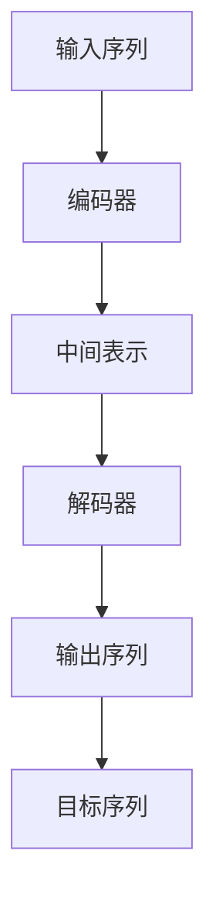

                 

## 1. 背景介绍

在自然语言处理(Natural Language Processing, NLP)领域，序列到序列(Sequence-to-Sequence, Seq2Seq)架构是一种非常常见的模型。其核心思想是通过编码器将输入序列编码为中间表示，然后再通过解码器生成输出序列。这种架构广泛应用于机器翻译、文本摘要、问答系统等任务中，具有很强的通用性和灵活性。

然而，对于初学者来说，Seq2Seq架构的构建和调试往往存在一定的难度。本文将系统性地介绍构建简单Seq2Seq架构的基本流程、核心概念和实现细节，旨在帮助读者快速上手，构建高质量的Seq2Seq模型。

## 2. 核心概念与联系

### 2.1 核心概念概述

为了更好地理解Seq2Seq架构，我们先来介绍几个关键概念：

- **编码器(Encoder)**：将输入序列转换为中间表示的组件，通常采用循环神经网络(RNN)或卷积神经网络(CNN)等序列模型。
- **解码器(Decoder)**：将中间表示转换为输出序列的组件，通常也是序列模型，如RNN、LSTM或GRU等。
- **注意力机制(Attention Mechanism)**：一种机制，使得解码器在生成输出时，能够关注输入序列中的不同部分，从而提高生成质量。
- **序列对齐(Sequence Alignment)**：一种方法，使得编码器和解码器能够对齐输入和输出序列，提高模型对输入序列的利用效率。
- **编码器-解码器架构(Encoder-Decoder Architecture)**：一种常见的Seq2Seq架构，由一个编码器和一个解码器组成，中间表示用于连接两者。

这些概念共同构成了Seq2Seq架构的核心，其原理和实现过程如下。

### 2.2 概念间的关系

Seq2Seq架构的核心组件和基本流程可以通过以下Mermaid流程图来展示：



这个流程图展示了Seq2Seq架构的基本流程：

1. **输入序列**经过**编码器**的编码，得到**中间表示**。
2. **中间表示**作为**解码器**的输入，经过解码生成**输出序列**。
3. **输出序列**与**目标序列**进行比较，评估模型性能。

在实际应用中，还可以进一步引入**注意力机制**，使得解码器在生成输出时，能够关注输入序列中的不同部分，提高生成质量。此外，**序列对齐**方法可以提高模型对输入序列的利用效率，使得编码器和解码器能够更好地对齐输入和输出序列。

## 3. 核心算法原理 & 具体操作步骤

### 3.1 算法原理概述

Seq2Seq架构的核心在于编码器和解码器的设计。其中，编码器负责将输入序列转换为中间表示，解码器负责将中间表示转换为输出序列。这两个组件通过中间表示连接，共同构成Seq2Seq模型。

在实践中，常见的编码器模型包括RNN、LSTM、GRU等，解码器模型也常常采用RNN、LSTM等序列模型。此外，注意力机制和序列对齐等技术，可以进一步提高Seq2Seq模型的性能。

### 3.2 算法步骤详解

构建Seq2Seq模型通常包括以下几个关键步骤：

**Step 1: 设计编码器和解码器**

- **编码器**：设计一个RNN、LSTM等序列模型，用于将输入序列转换为中间表示。通常，编码器的输出维度与解码器的输入维度相同。
- **解码器**：设计一个RNN、LSTM等序列模型，用于将中间表示转换为输出序列。解码器的输入通常包括中间表示和上一时刻的输出。

**Step 2: 定义损失函数**

- **定义目标序列**：将输入序列和输出序列分别作为模型训练的源和靶。
- **定义损失函数**：通常采用交叉熵损失函数，用于衡量模型预测输出与真实标签之间的差异。

**Step 3: 设置超参数**

- **选择优化器**：通常选择Adam、SGD等优化器，设置学习率、批大小、迭代轮数等。
- **设置正则化技术**：如权重衰减、Dropout、Early Stopping等，防止模型过拟合。

**Step 4: 训练模型**

- **训练过程**：将训练集数据分批次输入模型，前向传播计算损失函数。
- **反向传播**：计算参数梯度，根据设定的优化算法和学习率更新模型参数。
- **验证过程**：周期性在验证集上评估模型性能，根据性能指标决定是否触发Early Stopping。

**Step 5: 测试和部署**

- **测试集评估**：在测试集上评估微调后模型 $M_{\hat{\theta}}$ 的性能，对比微调前后的精度提升。
- **部署模型**：使用微调后的模型对新样本进行推理预测，集成到实际的应用系统中。

### 3.3 算法优缺点

Seq2Seq架构具有以下优点：

- **通用性**：适用于各种NLP任务，包括机器翻译、文本摘要、问答系统等，设计简单的编码器和解码器即可实现。
- **灵活性**：通过改变编码器和解码器的结构，可以适应不同的输入和输出序列长度。
- **可解释性**：中间表示可以用于分析模型的特征提取过程，帮助理解模型的工作机制。

同时，该架构也存在一定的局限性：

- **计算复杂度高**：由于序列模型需要计算每个时间步的输入和输出，计算复杂度较高。
- **易过拟合**：在训练集过小或模型参数过多时，容易发生过拟合。
- **对输入序列依赖性强**：模型的性能高度依赖输入序列的质量，对于噪声、长度变化等输入问题，可能需要额外处理。

尽管存在这些局限性，但就目前而言，Seq2Seq架构仍是NLP领域的重要范式。未来相关研究的重点在于如何进一步降低计算复杂度、提高模型的泛化能力、减少过拟合风险等。

### 3.4 算法应用领域

Seq2Seq架构广泛应用于各种NLP任务，如：

- **机器翻译**：将源语言文本翻译成目标语言。
- **文本摘要**：将长文本压缩成简短摘要。
- **问答系统**：对自然语言问题给出答案。
- **对话系统**：使机器能够与人自然对话。
- **文本生成**：自动生成文本、代码等。

除了这些经典任务外，Seq2Seq架构也被创新性地应用到更多场景中，如可控文本生成、语义匹配、情感分析等，为NLP技术带来了全新的突破。随着预训练模型和微调方法的不断进步，相信Seq2Seq架构将在更广阔的应用领域大放异彩。

## 4. 数学模型和公式 & 详细讲解 & 举例说明

### 4.1 数学模型构建

在Seq2Seq架构中，编码器和解码器通常采用循环神经网络(RNN)或长短时记忆网络(LSTM)。下面以LSTM为例，构建Seq2Seq模型的数学模型。

假设输入序列为 $X=\{x_1, x_2, ..., x_T\}$，输出序列为 $Y=\{y_1, y_2, ..., y_T\}$，中间表示为 $H=\{h_1, h_2, ..., h_T\}$。设编码器的参数为 $\theta_e$，解码器的参数为 $\theta_d$，则Seq2Seq模型的数学模型可以表示为：

$$
H = \text{LSTM}_e(X; \theta_e)
$$

$$
Y = \text{LSTM}_d(H; \theta_d)
$$

其中，$\text{LSTM}_e$ 和 $\text{LSTM}_d$ 分别为编码器和解码器的LSTM模型。

### 4.2 公式推导过程

以LSTM编码器和解码器为例，我们推导Seq2Seq模型的损失函数。假设解码器的输出为 $y_t$，真实标签为 $y_t^*$，则交叉熵损失函数可以表示为：

$$
\ell(Y_t, y_t^*) = -\log p(y_t^*|y_{t-1}, H; \theta_d)
$$

其中，$p(y_t^*|y_{t-1}, H; \theta_d)$ 表示解码器在给定上一个时刻的输出 $y_{t-1}$ 和中间表示 $H$ 的条件下，输出 $y_t$ 的概率分布。由于解码器的输出为概率分布，因此交叉熵损失函数可以表示为：

$$
\ell(Y_t, y_t^*) = -y_t^* \log p(y_t^*|y_{t-1}, H; \theta_d) - (1-y_t^*) \log (1-p(y_t^*|y_{t-1}, H; \theta_d))
$$

整个Seq2Seq模型的损失函数为：

$$
\mathcal{L}(\theta_e, \theta_d) = \frac{1}{T} \sum_{t=1}^T \ell(Y_t, y_t^*)
$$

其中，$T$ 为输出序列的长度。

### 4.3 案例分析与讲解

以机器翻译为例，假设输入序列为英文句子，输出序列为法文句子。将输入序列和输出序列分别输入编码器和解码器，中间表示用于连接两者。通过优化损失函数，使得模型能够准确地将英文翻译为法文。

在训练过程中，输入序列经过编码器得到中间表示 $H$，中间表示作为解码器的输入，生成法文序列 $Y$。将 $Y$ 与真实标签 $y^*$ 进行比较，计算损失函数 $\ell(Y, y^*)$，并反向传播更新编码器 $\theta_e$ 和解码器 $\theta_d$ 的参数。

## 5. 项目实践：代码实例和详细解释说明

### 5.1 开发环境搭建

在进行Seq2Seq架构的实践前，我们需要准备好开发环境。以下是使用Python进行TensorFlow开发的环境配置流程：

1. 安装Anaconda：从官网下载并安装Anaconda，用于创建独立的Python环境。

2. 创建并激活虚拟环境：
```bash
conda create -n tensorflow-env python=3.8 
conda activate tensorflow-env
```

3. 安装TensorFlow：根据CUDA版本，从官网获取对应的安装命令。例如：
```bash
pip install tensorflow
```

4. 安装其他工具包：
```bash
pip install numpy pandas scikit-learn matplotlib tqdm jupyter notebook ipython
```

完成上述步骤后，即可在`tensorflow-env`环境中开始Seq2Seq架构的实践。

### 5.2 源代码详细实现

这里我们以机器翻译为例，使用TensorFlow实现Seq2Seq模型。

首先，定义编码器和解码器的LSTM模型：

```python
import tensorflow as tf
from tensorflow.keras.layers import LSTM, Dense

class Encoder(tf.keras.Model):
    def __init__(self, vocab_size, embed_dim, enc_units):
        super(Encoder, self).__init__()
        self.embedding = tf.keras.layers.Embedding(vocab_size, embed_dim)
        self.enc_units = enc_units
        self.lstm = tf.keras.layers.LSTM(enc_units, return_sequences=True, return_state=True)
        
    def call(self, x, h):
        x = self.embedding(x)
        output, state_h, state_c = self.lstm(x, initial_state=h)
        return output, state_h

class Decoder(tf.keras.Model):
    def __init__(self, vocab_size, embed_dim, dec_units):
        super(Decoder, self).__init__()
        self.embedding = tf.keras.layers.Embedding(vocab_size, embed_dim)
        self.decod_units = dec_units
        self.lstm = tf.keras.layers.LSTM(dec_units, return_sequences=True, return_state=True)
        self.fc = tf.keras.layers.Dense(vocab_size)
        
    def call(self, x, h, c):
        x = self.embedding(x)
        output, state_h, state_c = self.lstm(x, initial_state=[h, c])
        output = tf.reshape(output, (-1, dec_units))
        output = self.fc(output)
        return output, state_h, state_c
```

然后，定义模型和优化器：

```python
encoder = Encoder(vocab_size, embed_dim, enc_units)
decoder = Decoder(vocab_size, embed_dim, dec_units)

optim = tf.keras.optimizers.Adam(learning_rate=0.001)
```

接着，定义训练和评估函数：

```python
device = tf.device('/gpu:0') if tf.test.is_gpu_available() else tf.device('/cpu:0')

@tf.function
def loss_function(encoder_outputs, decoder_outputs, target_sequence):
    loss = 0
    for i in range(1, target_sequence.get_shape()[1]):
        loss += tf.keras.losses.sparse_categorical_crossentropy(target_sequence[:, i], decoder_outputs[:, i-1, :], from_logits=True)
    return loss

@tf.function
def train_step(input_sentence, target_sentence):
    with tf.GradientTape() as tape:
        encoder_outputs, encoder_state = encoder(input_sentence, tf.zeros((1, enc_units)))
        decoder_outputs, decoder_state = decoder(input_sentence, encoder_state, tf.zeros((1, dec_units)))
        loss = loss_function(encoder_outputs, decoder_outputs, target_sequence)
    gradients = tape.gradient(loss, encoder.trainable_variables + decoder.trainable_variables)
    optim.apply_gradients(zip(gradients, encoder.trainable_variables + decoder.trainable_variables))
    
    return loss
```

最后，启动训练流程并在测试集上评估：

```python
epochs = 100
steps_per_epoch = 1000
batch_size = 64

for epoch in range(epochs):
    for step in range(steps_per_epoch):
        input_sentence = train_data[step]
        target_sentence = train_data[step]
        loss = train_step(input_sentence, target_sentence)
        print(f"Epoch {epoch+1}/{epochs}, Step {step+1}/{steps_per_epoch}, Loss: {loss.numpy()}")
        
    print(f"Epoch {epoch+1}/{epochs}, Train Loss: {loss.numpy()}")
    print("Epoch {epoch+1}/{epochs}, Validation Loss:")
    validation_loss = 0
    for input_sentence, target_sentence in val_data:
        loss = train_step(input_sentence, target_sentence)
        validation_loss += loss.numpy()
    print(validation_loss/steps_per_epoch)
    
print("Testing...")
for input_sentence, target_sentence in test_data:
    encoder_outputs, encoder_state = encoder(input_sentence, tf.zeros((1, enc_units)))
    decoder_outputs, decoder_state = decoder(input_sentence, encoder_state, tf.zeros((1, dec_units)))
    print(decoder_outputs.numpy())
```

以上就是使用TensorFlow实现Seq2Seq模型的完整代码实现。可以看到，使用TensorFlow的高级API，我们可以用相对简洁的代码完成Seq2Seq模型的构建和训练。

### 5.3 代码解读与分析

让我们再详细解读一下关键代码的实现细节：

**Encoder类**：
- `__init__`方法：初始化编码器的输入维度、隐藏层维度、LSTM层数等关键组件。
- `call`方法：对输入进行编码，返回编码器的输出和隐藏状态。

**Decoder类**：
- `__init__`方法：初始化解码器的输入维度、隐藏层维度、LSTM层数等关键组件。
- `call`方法：对输入进行解码，返回解码器的输出和隐藏状态。

**train_step函数**：
- 定义损失函数，计算每个时间步的交叉熵损失。
- 通过TensorFlow的GradientTape记录梯度，并根据优化器更新模型参数。
- 返回每个时间步的损失，用于打印输出。

**训练流程**：
- 定义总的epoch数、batch size、steps_per_epoch等参数。
- 循环迭代每个epoch，在每个step上进行训练，输出平均损失。
- 在验证集上评估，输出验证损失。
- 在测试集上评估，输出测试结果。

可以看到，TensorFlow的高级API使得Seq2Seq模型的构建和训练变得非常简单，开发者可以更多地关注模型设计的创新和调试。当然，工业级的系统实现还需考虑更多因素，如模型的保存和部署、超参数的自动搜索、更灵活的任务适配层等。但核心的Seq2Seq架构基本与此类似。

## 6. 实际应用场景

### 6.1 智能客服系统

基于Seq2Seq架构的对话技术，可以广泛应用于智能客服系统的构建。传统客服往往需要配备大量人力，高峰期响应缓慢，且一致性和专业性难以保证。而使用Seq2Seq架构构建的智能客服系统，可以7x24小时不间断服务，快速响应客户咨询，用自然流畅的语言解答各类常见问题。

在技术实现上，可以收集企业内部的历史客服对话记录，将问题和最佳答复构建成监督数据，在此基础上对Seq2Seq模型进行训练。训练后的模型能够自动理解用户意图，匹配最合适的答案模板进行回复。对于客户提出的新问题，还可以接入检索系统实时搜索相关内容，动态组织生成回答。如此构建的智能客服系统，能大幅提升客户咨询体验和问题解决效率。

### 6.2 金融舆情监测

金融机构需要实时监测市场舆论动向，以便及时应对负面信息传播，规避金融风险。传统的人工监测方式成本高、效率低，难以应对网络时代海量信息爆发的挑战。基于Seq2Seq架构的文本分类和情感分析技术，为金融舆情监测提供了新的解决方案。

具体而言，可以收集金融领域相关的新闻、报道、评论等文本数据，并对其进行主题标注和情感标注。在此基础上对Seq2Seq模型进行微调，使其能够自动判断文本属于何种主题，情感倾向是正面、中性还是负面。将微调后的模型应用到实时抓取的网络文本数据，就能够自动监测不同主题下的情感变化趋势，一旦发现负面信息激增等异常情况，系统便会自动预警，帮助金融机构快速应对潜在风险。

### 6.3 个性化推荐系统

当前的推荐系统往往只依赖用户的历史行为数据进行物品推荐，无法深入理解用户的真实兴趣偏好。基于Seq2Seq架构的推荐系统可以更好地挖掘用户行为背后的语义信息，从而提供更精准、多样的推荐内容。

在实践中，可以收集用户浏览、点击、评论、分享等行为数据，提取和用户交互的物品标题、描述、标签等文本内容。将文本内容作为模型输入，用户的后续行为（如是否点击、购买等）作为监督信号，在此基础上对Seq2Seq模型进行训练。训练后的模型能够从文本内容中准确把握用户的兴趣点。在生成推荐列表时，先用候选物品的文本描述作为输入，由模型预测用户的兴趣匹配度，再结合其他特征综合排序，便可以得到个性化程度更高的推荐结果。

### 6.4 未来应用展望

随着Seq2Seq架构和微调方法的不断发展，基于Seq2Seq范式将在更多领域得到应用，为传统行业带来变革性影响。

在智慧医疗领域，基于Seq2Seq架构的医疗问答、病历分析、药物研发等应用将提升医疗服务的智能化水平，辅助医生诊疗，加速新药开发进程。

在智能教育领域，Seq2Seq架构可应用于作业批改、学情分析、知识推荐等方面，因材施教，促进教育公平，提高教学质量。

在智慧城市治理中，Seq2Seq架构可用于城市事件监测、舆情分析、应急指挥等环节，提高城市管理的自动化和智能化水平，构建更安全、高效的未来城市。

此外，在企业生产、社会治理、文娱传媒等众多领域，基于Seq2Seq架构的人工智能应用也将不断涌现，为NLP技术带来全新的突破。相信随着技术的日益成熟，Seq2Seq范式将成为人工智能落地应用的重要范式，推动人工智能技术在更广阔的应用领域大放异彩。

## 7. 工具和资源推荐

### 7.1 学习资源推荐

为了帮助开发者系统掌握Seq2Seq架构的理论基础和实践技巧，这里推荐一些优质的学习资源：

1. 《自然语言处理综论》系列博文：由NLP领域专家撰写，全面介绍了Seq2Seq架构的基本原理、经典模型和最新进展。

2. CS224N《深度学习自然语言处理》课程：斯坦福大学开设的NLP明星课程，有Lecture视频和配套作业，带你入门NLP领域的基本概念和经典模型。

3. 《序列到序列模型》书籍：清华大学出版社的Seq2Seq专著，系统介绍了Seq2Seq模型的构建、训练和优化方法。

4. Seq2Seq官方文档：TensorFlow的Seq2Seq模型文档，提供了完整的模型实现和训练样例，是上手实践的必备资料。

5. GitHub热门项目：在GitHub上Star、Fork数最多的Seq2Seq相关项目，往往代表了该技术领域的发展趋势和最佳实践，值得去学习和贡献。

通过对这些资源的学习实践，相信你一定能够快速掌握Seq2Seq架构的精髓，并用于解决实际的NLP问题。

### 7.2 开发工具推荐

高效的开发离不开优秀的工具支持。以下是几款用于Seq2Seq架构开发的常用工具：

1. TensorFlow：由Google主导开发的开源深度学习框架，生产部署方便，适合大规模工程应用。同样有丰富的Seq2Seq模型资源。

2. PyTorch：基于Python的开源深度学习框架，灵活动态的计算图，适合快速迭代研究。

3. OpenNMT：由Facebook开发的Seq2Seq模型工具库，集成了多种前沿的Seq2Seq模型和训练技巧，是进行Seq2Seq任务开发的利器。

4. Weights & Biases：模型训练的实验跟踪工具，可以记录和可视化模型训练过程中的各项指标，方便对比和调优。与主流深度学习框架无缝集成。

5. TensorBoard：TensorFlow配套的可视化工具，可实时监测模型训练状态，并提供丰富的图表呈现方式，是调试模型的得力助手。

6. Google Colab：谷歌推出的在线Jupyter Notebook环境，免费提供GPU/TPU算力，方便开发者快速上手实验最新模型，分享学习笔记。

合理利用这些工具，可以显著提升Seq2Seq架构的开发效率，加快创新迭代的步伐。

### 7.3 相关论文推荐

Seq2Seq架构的发展源于学界的持续研究。以下是几篇奠基性的相关论文，推荐阅读：

1. Sequence to Sequence Learning with Neural Networks：提出Seq2Seq框架，使用RNN实现机器翻译、文本摘要等任务。

2. Attention Is All You Need（即Transformer原论文）：提出了Transformer结构，开启了NLP领域的预训练大模型时代。

3. Google's Neural Machine Translation System：介绍Google的神经机器翻译系统，展示了Seq2Seq架构在实际工业应用中的效果。

4. Transformer-XL：提出Transformer-XL结构，解决长序列训练问题，进一步提升Seq2Seq模型的性能。

5. Google's AlphaGo Zero：介绍AlphaGo Zero的实现方法，展示了Seq2Seq架构在游戏AI中的应用。

6. TL;DR：Transformers for Text Summarization with Explanations：提出基于Transformer的文本摘要方法，并使用Seq2Seq架构进行模型微调。

这些论文代表了大语言模型微调技术的发展脉络。通过学习这些前沿成果，可以帮助研究者把握学科前进方向，激发更多的创新灵感。

除上述资源外，还有一些值得关注的前沿资源，帮助开发者紧跟Seq2Seq架构的最新进展，例如：

1. arXiv论文预印本：人工智能领域最新研究成果的发布平台，包括大量尚未发表的前沿工作，学习前沿技术的必读资源。

2. 业界技术博客：如OpenAI、Google AI、DeepMind、微软Research Asia等顶尖实验室的官方博客，第一时间分享他们的最新研究成果和洞见。

3. 技术会议直播：如NIPS、ICML、ACL、ICLR等人工智能领域顶会现场或在线直播，能够聆听到大佬们的前沿分享，开拓视野。

4. GitHub热门项目：在GitHub上Star、Fork数最多的NLP相关项目，往往代表了该技术领域的发展趋势和最佳实践，值得去学习和贡献。

5. 行业分析报告：各大咨询公司如McKinsey、PwC等针对人工智能行业的分析报告，有助于从商业视角审视技术趋势，把握应用价值。

总之，对于Seq2Seq架构的学习和实践，需要开发者保持开放的心态和持续学习的意愿。多关注前沿资讯，多动手实践，多思考总结，必将收获满满的成长收益。

## 8. 总结：未来发展趋势与挑战

### 8.1 总结

本文对Seq2Seq架构的基本原理、实现步骤和应用场景进行了全面系统的介绍。首先阐述了Seq2Seq架构的研究背景和意义，明确了其在NLP领域的重要地位。其次，从原理到实践，详细讲解了Seq2Seq模型的构建过程，给出了模型的代码实现和调试技巧。同时，本文还广泛探讨了Seq2Seq架构在实际应用中的多种场景，展示了其强大的通用性和灵活性。

通过本文的系统梳理，可以看到，Seq2Seq架构在自然语言处理任务中扮演着重要角色，广泛适用于机器翻译、文本摘要、问答系统等任务。随着预训练模型和微调方法的不断进步，Seq2Seq架构必将在更多领域得到应用，为传统行业带来变革性影响。

### 8.2 未来发展趋势

展望未来，Seq2Seq架构将呈现以下几个发展趋势：

1. 模型规模持续增大。随着算力成本的下降和数据规模的扩张，Seq2Seq模型的参数量还将持续增长。超大模型蕴含的丰富语言知识，有望支撑更加复杂多变的下游任务。

2. 微调方法日趋多样。除了传统的全参数微调外，未来会涌现更多参数高效的微调方法，如LoRA、 Adapter等，在固定大部分预训练参数的情况下，仍可取得不错的微调效果。

3. 序列对齐技术发展。未来可能会引入更高效的序列对齐方法，如基于注意力机制的对齐，进一步提高模型对输入序列的利用效率。

4. 模型通用性增强。经过海量数据的预训练和多领域任务的微调，Seq2Seq模型将具备更强的常识推理和跨领域迁移能力，逐步迈向通用人工智能(AGI)的目标。

以上趋势凸显了Seq2Seq架构的广阔前景。这些方向的探索发展，必将进一步提升Seq2Seq架构的性能和应用

