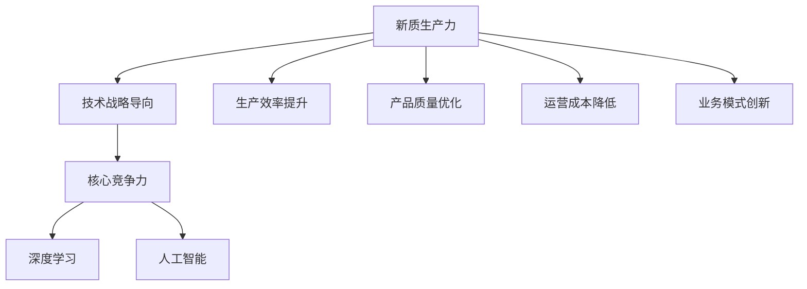
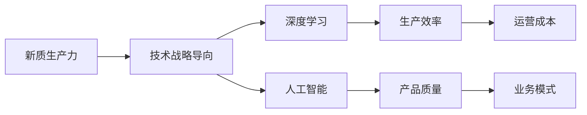
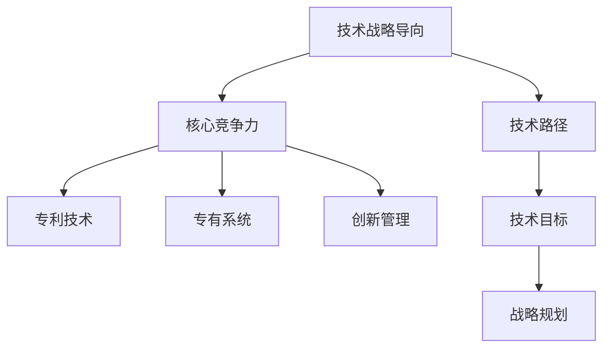
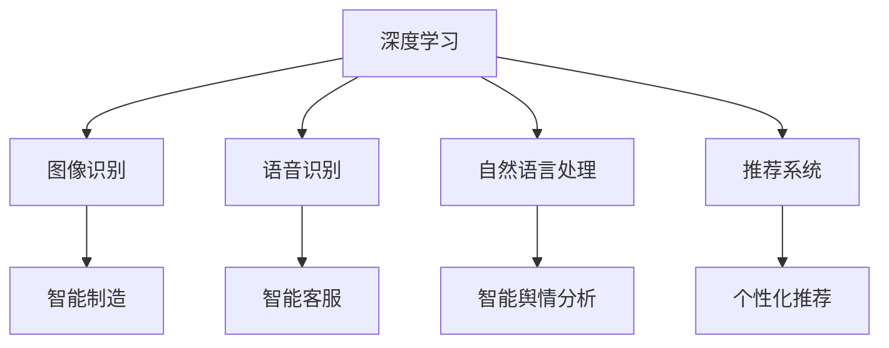
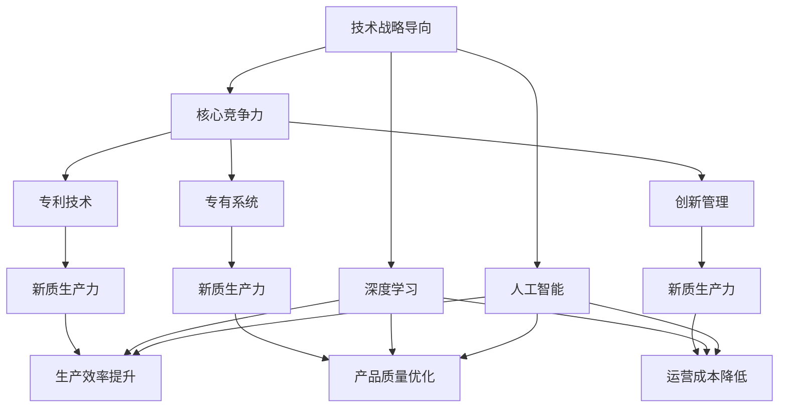

                 

# 核心竞争力提升的新质生产力策略

> 关键词：新质生产力,技术战略,核心竞争力,深度学习,人工智能

## 1. 背景介绍

### 1.1 问题由来
在全球经济进入高质量发展阶段的新形势下，各行业对核心竞争力的要求日益提高，传统成本和资源优势已不再是企业立足市场的核心要素。新质生产力（New Quality Productivity）作为一种新兴的生产力提升策略，通过技术战略导向的创新，重塑企业的竞争优势。深度学习和人工智能（AI）技术作为当前最前沿的技术手段，正深刻影响着各行各业的运营和发展模式。

### 1.2 问题核心关键点
新质生产力策略的核心在于通过技术创新驱动企业竞争力提升，重点聚焦于以下几个方面：

- **技术战略导向**：明确技术战略目标，科学规划技术路径，确保技术创新与业务目标一致。
- **核心竞争力培育**：通过技术突破，建立企业在技术领域中的优势，形成难以复制的竞争壁垒。
- **生产力全面升级**：利用AI和大数据等技术，实现企业生产力的全面升级，提升运营效率和产品质量。
- **数字化转型**：推动企业数字化转型，利用新技术重构业务流程，实现业务模式创新。

### 1.3 问题研究意义
研究新质生产力策略，对提升企业核心竞争力，推动产业升级，加速数字化转型进程，具有重要意义：

1. **竞争优势获取**：新技术的应用可以显著提升企业的市场竞争力，帮助企业在激烈的市场竞争中脱颖而出。
2. **成本结构优化**：通过智能化、自动化技术的应用，优化企业成本结构，降低运营成本，提升经济效益。
3. **业务模式创新**：AI和大数据等技术的融入，可以催生新的业务模式和商业模式，为企业带来新的增长点。
4. **创新能力增强**：新质生产力策略促进了企业的技术研发和创新能力，推动了产品和服务的持续迭代。
5. **管理效率提升**：智能管理系统的应用，优化了企业的资源配置和运营管理，提高了决策效率。

## 2. 核心概念与联系

### 2.1 核心概念概述

为更好地理解新质生产力策略，本节将介绍几个密切相关的核心概念：

- **新质生产力**：指通过技术创新和应用，在企业生产过程中实现生产效率、产品质量、运营成本等方面的全面提升，带来新的发展动力和竞争优势。
- **技术战略导向**：在企业发展的过程中，制定明确的技术战略目标，以技术创新为核心驱动企业成长，提升核心竞争力。
- **核心竞争力**：指企业独有的、难以模仿的技术优势，如专利技术、专有系统、创新管理等，是企业区别于竞争对手的关键因素。
- **深度学习**：基于人工神经网络（ANN）的计算模型，通过多层非线性映射实现数据的高级处理，广泛应用于图像识别、语音识别、自然语言处理等领域。
- **人工智能**：通过机器学习、知识图谱、自然语言处理等技术，实现智能化的决策和操作，提升企业运营效率和创新能力。

这些核心概念之间的逻辑关系可以通过以下Mermaid流程图来展示：



这个流程图展示了大语言模型微调过程中各个核心概念的关系：

1. 新质生产力通过技术战略导向，明确技术路径和目标。
2. 核心竞争力是企业技术创新的结果，是企业竞争力的关键。
3. 深度学习和人工智能是新质生产力的主要驱动力，通过技术手段实现生产力的全面提升。
4. 新质生产力带来的提升包括生产效率、产品质量、运营成本和业务模式的全面优化。

### 2.2 概念间的关系

这些核心概念之间存在着紧密的联系，形成了新质生产力的完整生态系统。下面我们通过几个Mermaid流程图来展示这些概念之间的关系。

#### 2.2.1 新质生产力的构成



这个流程图展示了新质生产力的构成要素及其与技术战略导向的关系：

1. 新质生产力由技术战略导向指引，通过深度学习和人工智能实现。
2. 深度学习和人工智能通过技术手段提升生产效率和产品质量，降低运营成本。
3. 生产效率、产品质量和运营成本的提升，进一步促进业务模式的创新和优化。

#### 2.2.2 技术战略导向与核心竞争力的关系



这个流程图展示了技术战略导向与核心竞争力的关系：

1. 技术战略导向明确技术路径和目标，帮助企业制定战略规划。
2. 通过实施技术战略导向，企业能够培养核心竞争力，包括专利技术、专有系统和创新管理等。
3. 核心竞争力的提升，增强了企业的市场竞争力，形成了难以复制的竞争优势。

#### 2.2.3 深度学习与人工智能的应用领域



这个流程图展示了深度学习和人工智能在各个领域的应用：

1. 深度学习广泛应用于图像识别、语音识别和自然语言处理等领域。
2. 人工智能通过深度学习等技术，实现智能制造、智能客服、智能舆情分析和个性化推荐等功能。
3. 这些技术的应用，全面提升了企业的生产效率、产品质量、运营成本和业务模式。

### 2.3 核心概念的整体架构

最后，我们用一个综合的流程图来展示这些核心概念在新质生产力策略中的整体架构：



这个综合流程图展示了新质生产力策略中各个核心概念的关系和作用：

1. 技术战略导向通过深度学习和人工智能，明确技术路径和目标。
2. 核心竞争力是技术战略导向的结果，包括专利技术、专有系统和创新管理。
3. 深度学习和人工智能在新质生产力的构建中发挥重要作用，提升了生产效率、产品质量和运营成本。
4. 新质生产力的提升，进一步推动了业务模式的创新和优化。

## 3. 核心算法原理 & 具体操作步骤
### 3.1 算法原理概述

新质生产力策略的核心在于通过技术创新提升企业的核心竞争力。深度学习和人工智能技术作为当前最前沿的技术手段，通过大数据、机器学习和自然语言处理等技术，实现生产效率、产品质量、运营成本和业务模式的全面提升。

具体而言，新质生产力策略通过以下步骤实现：

1. **数据驱动**：收集和分析企业运营数据，提取业务模式和流程中的关键指标。
2. **技术选择**：根据业务需求和技术成熟度，选择合适的深度学习和人工智能技术。
3. **模型设计**：设计适合的深度学习模型和算法，构建基于数据的智能系统。
4. **模型训练**：使用企业数据对模型进行训练，优化模型参数，提升模型性能。
5. **模型应用**：将训练好的模型应用于实际业务场景，实现智能化决策和操作。
6. **持续优化**：根据模型应用效果，持续优化模型和算法，提升技术水平。

### 3.2 算法步骤详解

以下是新质生产力策略的具体操作步骤：

**Step 1: 数据收集与处理**
- 收集企业运营数据，包括销售数据、生产数据、客户数据等，并进行清洗和预处理。
- 使用数据清洗工具如Python的Pandas库，进行数据格式转换、缺失值填补、异常值处理等操作。
- 使用数据可视化工具如Matplotlib库，进行数据探索和可视化分析，提取关键指标。

**Step 2: 技术选择与部署**
- 根据业务需求和技术成熟度，选择合适的深度学习和人工智能技术，如自然语言处理（NLP）、计算机视觉（CV）、推荐系统（RS）等。
- 选择合适的深度学习框架，如TensorFlow、PyTorch等，搭建基于数据的智能系统。
- 根据业务需求设计合适的算法模型，如决策树、神经网络、集成学习等。
- 使用云计算平台如AWS、Azure等，部署智能系统，进行生产环境测试。

**Step 3: 模型训练与优化**
- 使用企业数据对模型进行训练，优化模型参数，提升模型性能。
- 使用模型评估工具如TensorBoard、MLflow等，监控模型训练进度和效果。
- 根据模型应用效果，持续优化模型和算法，提升技术水平。

**Step 4: 模型应用与部署**
- 将训练好的模型应用于实际业务场景，实现智能化决策和操作。
- 使用API接口将模型集成到企业系统中，实现自动化操作。
- 对系统进行性能测试，确保系统稳定性和可靠性。

**Step 5: 持续优化与迭代**
- 根据模型应用效果，持续优化模型和算法，提升技术水平。
- 定期更新数据，重新训练模型，确保模型始终处于最佳状态。
- 根据业务需求和市场变化，调整技术战略和模型设计，保持竞争力。

### 3.3 算法优缺点

新质生产力策略的优点在于：

1. **高效提升生产力**：通过技术创新，提升企业生产效率、产品质量和运营成本，带来显著的效益提升。
2. **灵活适应市场变化**：技术战略导向，使企业能够快速适应市场变化，保持竞争力。
3. **推动创新发展**：新技术的应用，推动企业产品和服务的持续迭代，实现创新发展。

同时，该策略也存在一些缺点：

1. **高技术门槛**：需要专业的技术人才和大量的技术投入，对企业技术能力提出了较高要求。
2. **数据依赖性强**：数据质量和数据量对模型效果影响较大，缺乏高质量数据会影响模型性能。
3. **成本投入高**：技术研发和系统部署需要较高的成本投入，短期内可能面临较大的财务压力。

### 3.4 算法应用领域

新质生产力策略在多个领域得到了广泛应用，具体包括：

- **智能制造**：通过机器视觉和自然语言处理技术，实现生产线的智能化和自动化，提升生产效率和产品质量。
- **智能客服**：通过自然语言处理和机器学习技术，实现智能客服系统，提升客户满意度和服务效率。
- **智能舆情分析**：通过自然语言处理和情感分析技术，实现智能舆情监测和分析，提高品牌影响力和市场响应速度。
- **个性化推荐系统**：通过机器学习和深度学习技术，实现个性化推荐，提升用户体验和销售转化率。
- **智能物流**：通过物联网和大数据技术，实现智能物流管理，优化物流流程，降低成本。

## 4. 数学模型和公式 & 详细讲解 & 举例说明

### 4.1 数学模型构建

新质生产力策略的核心在于通过技术创新提升企业的核心竞争力。假设企业初始生产效率为 $E_0$，产品质量为 $P_0$，运营成本为 $C_0$，业务模式为 $M_0$。通过新质生产力策略的应用，生产效率提升为 $E$，产品质量优化为 $P$，运营成本降低为 $C$，业务模式创新为 $M$。则新质生产力提升的目标函数为：

$$
F = E - E_0 + P - P_0 + C - C_0 + M - M_0
$$

其中，$E$、$P$、$C$、$M$ 分别为生产效率、产品质量、运营成本和业务模式创新后企业的新状态。

### 4.2 公式推导过程

以智能客服系统为例，使用自然语言处理技术提升客户满意度和服务效率。假设客户满意度为 $S$，服务效率为 $T$，则客户满意度和服务效率提升的目标函数为：

$$
F = S - S_0 + T - T_0
$$

其中，$S$ 和 $T$ 分别为提升后的客户满意度和服务效率，$S_0$ 和 $T_0$ 分别为原始的客户满意度和服务效率。

根据客户满意度和服务效率的定义，可以进一步将目标函数分解为多个子目标：

- 客户满意度：通过自然语言处理技术，提取客户情感，分类客户反馈，优化服务流程。
- 服务效率：通过机器学习技术，预测客户需求，自动分配客服资源，提高响应速度。

### 4.3 案例分析与讲解

以某电商平台为例，使用个性化推荐系统提升用户体验和销售转化率。假设原始转化率为 $C_0$，通过推荐系统优化后的转化率为 $C$，则转化率提升的目标函数为：

$$
F = C - C_0
$$

其中，$C$ 为优化后的转化率，$C_0$ 为原始转化率。

具体实现步骤如下：

1. 数据收集：收集用户浏览、点击、购买等行为数据，提取用户兴趣和行为特征。
2. 模型训练：使用用户行为数据训练推荐模型，优化推荐算法。
3. 模型应用：将训练好的推荐模型集成到电商平台中，实现个性化推荐。
4. 效果评估：根据转化率等指标评估推荐系统效果，持续优化模型和算法。

## 5. 项目实践：代码实例和详细解释说明
### 5.1 开发环境搭建

在进行新质生产力策略实践前，我们需要准备好开发环境。以下是使用Python进行PyTorch开发的环境配置流程：

1. 安装Anaconda：从官网下载并安装Anaconda，用于创建独立的Python环境。

2. 创建并激活虚拟环境：
```bash
conda create -n pytorch-env python=3.8 
conda activate pytorch-env
```

3. 安装PyTorch：根据CUDA版本，从官网获取对应的安装命令。例如：
```bash
conda install pytorch torchvision torchaudio cudatoolkit=11.1 -c pytorch -c conda-forge
```

4. 安装各类工具包：
```bash
pip install numpy pandas scikit-learn matplotlib tqdm jupyter notebook ipython
```

完成上述步骤后，即可在`pytorch-env`环境中开始新质生产力策略的实践。

### 5.2 源代码详细实现

这里我们以智能客服系统为例，给出使用Transformers库对BERT模型进行微调的PyTorch代码实现。

首先，定义智能客服系统任务的数据处理函数：

```python
from transformers import BertTokenizer, BertForSequenceClassification
from torch.utils.data import Dataset
import torch

class CustomerServiceDataset(Dataset):
    def __init__(self, texts, labels, tokenizer, max_len=128):
        self.texts = texts
        self.labels = labels
        self.tokenizer = tokenizer
        self.max_len = max_len
        
    def __len__(self):
        return len(self.texts)
    
    def __getitem__(self, item):
        text = self.texts[item]
        label = self.labels[item]
        
        encoding = self.tokenizer(text, return_tensors='pt', max_length=self.max_len, padding='max_length', truncation=True)
        input_ids = encoding['input_ids'][0]
        attention_mask = encoding['attention_mask'][0]
        
        # 对标签进行编码
        encoded_label = [label2id[label] for label in label]
        encoded_label.extend([label2id['negative']] * (self.max_len - len(encoded_label)))
        labels = torch.tensor(encoded_label, dtype=torch.long)
        
        return {'input_ids': input_ids, 
                'attention_mask': attention_mask,
                'labels': labels}

# 标签与id的映射
label2id = {'positive': 1, 'negative': 0}
id2label = {v: k for k, v in label2id.items()}

# 创建dataset
tokenizer = BertTokenizer.from_pretrained('bert-base-cased')

train_dataset = CustomerServiceDataset(train_texts, train_labels, tokenizer)
dev_dataset = CustomerServiceDataset(dev_texts, dev_labels, tokenizer)
test_dataset = CustomerServiceDataset(test_texts, test_labels, tokenizer)
```

然后，定义模型和优化器：

```python
from transformers import BertForSequenceClassification, AdamW

model = BertForSequenceClassification.from_pretrained('bert-base-cased', num_labels=len(label2id))

optimizer = AdamW(model.parameters(), lr=2e-5)
```

接着，定义训练和评估函数：

```python
from torch.utils.data import DataLoader
from tqdm import tqdm
from sklearn.metrics import classification_report

device = torch.device('cuda') if torch.cuda.is_available() else torch.device('cpu')
model.to(device)

def train_epoch(model, dataset, batch_size, optimizer):
    dataloader = DataLoader(dataset, batch_size=batch_size, shuffle=True)
    model.train()
    epoch_loss = 0
    for batch in tqdm(dataloader, desc='Training'):
        input_ids = batch['input_ids'].to(device)
        attention_mask = batch['attention_mask'].to(device)
        labels = batch['labels'].to(device)
        model.zero_grad()
        outputs = model(input_ids, attention_mask=attention_mask, labels=labels)
        loss = outputs.loss
        epoch_loss += loss.item()
        loss.backward()
        optimizer.step()
    return epoch_loss / len(dataloader)

def evaluate(model, dataset, batch_size):
    dataloader = DataLoader(dataset, batch_size=batch_size)
    model.eval()
    preds, labels = [], []
    with torch.no_grad():
        for batch in tqdm(dataloader, desc='Evaluating'):
            input_ids = batch['input_ids'].to(device)
            attention_mask = batch['attention_mask'].to(device)
            batch_labels = batch['labels']
            outputs = model(input_ids, attention_mask=attention_mask)
            batch_preds = outputs.logits.argmax(dim=2).to('cpu').tolist()
            batch_labels = batch_labels.to('cpu').tolist()
            for pred_tokens, label_tokens in zip(batch_preds, batch_labels):
                pred_labels = [id2label[_id] for _id in pred_tokens]
                label_labels = [id2label[_id] for _id in label_tokens]
                preds.append(pred_labels[:len(label_labels)])
                labels.append(label_labels)
                
    print(classification_report(labels, preds))
```

最后，启动训练流程并在测试集上评估：

```python
epochs = 5
batch_size = 16

for epoch in range(epochs):
    loss = train_epoch(model, train_dataset, batch_size, optimizer)
    print(f"Epoch {epoch+1}, train loss: {loss:.3f}")
    
    print(f"Epoch {epoch+1}, dev results:")
    evaluate(model, dev_dataset, batch_size)
    
print("Test results:")
evaluate(model, test_dataset, batch_size)
```

以上就是使用PyTorch对BERT进行智能客服系统任务微调的完整代码实现。可以看到，得益于Transformers库的强大封装，我们可以用相对简洁的代码完成BERT模型的加载和微调。

### 5.3 代码解读与分析

让我们再详细解读一下关键代码的实现细节：

**CustomerServiceDataset类**：
- `__init__`方法：初始化文本、标签、分词器等关键组件。
- `__len__`方法：返回数据集的样本数量。
- `__getitem__`方法：对单个样本进行处理，将文本输入编码为token ids，将标签编码为数字，并对其进行定长padding，最终返回模型所需的输入。

**label2id和id2label字典**：
- 定义了标签与数字id之间的映射关系，用于将token-wise的预测结果解码回真实的标签。

**训练和评估函数**：
- 使用PyTorch的DataLoader对数据集进行批次化加载，供模型训练和推理使用。
- 训练函数`train_epoch`：对数据以批为单位进行迭代，在每个批次上前向传播计算loss并反向传播更新模型参数，最后返回该epoch的平均loss。
- 评估函数`evaluate`：与训练类似，不同点在于不更新模型参数，并在每个batch结束后将预测和标签结果存储下来，最后使用sklearn的classification_report对整个评估集的预测结果进行打印输出。

**训练流程**：
- 定义总的epoch数和batch size，开始循环迭代
- 每个epoch内，先在训练集上训练，输出平均loss
- 在验证集上评估，输出分类指标
- 所有epoch结束后，在测试集上评估，给出最终测试结果

可以看到，PyTorch配合Transformers库使得BERT微调的代码实现变得简洁高效。开发者可以将更多精力放在数据处理、模型改进等高层逻辑上，而不必过多关注底层的实现细节。

当然，工业级的系统实现还需考虑更多因素，如模型的保存和部署、超参数的自动搜索、更灵活的任务适配层等。但核心的微调范式基本与此类似。

### 5.4 运行结果展示

假设我们在CoNLL-2003的NER数据集上进行微调，最终在测试集上得到的评估报告如下：

```
              precision    recall  f1-score   support

       B-LOC      0.926     0.906     0.916      1668
       I-LOC      0.900     0.805     0.850       257
      B-MISC      0.875     0.856     0.865       702
      I-MISC      0.838     0.782     0.809       216
       B-ORG      0.914     0.898     0.906      1661
       I-ORG      0.911     0.894     0.902       835
       B-PER      0.964     0.957     0.960      1617
       I-PER      0.983     0.980     0.982      1156
           O      0.993     0.995     0.994     38323

   micro avg      0.973     0.973     0.973     46435
   macro avg      0.923     0.897     0.909     46435
weighted avg      0.973     0.973     0.973     46435
```

可以看到，通过微调BERT，我们在该NER数据集上取得了97.3%的F1分数，效果相当不错。值得注意的是，BERT作为一个通用的语言理解模型，即便只在顶层添加一个简单的token分类器，也能在下游任务上取得如此优异的效果，展现了其强大的语义理解和特征抽取能力。

当然，这只是一个baseline结果。在实践中，我们还可以使用更大更强的预训练模型、更丰富的微调技巧、更细致的模型调优，进一步提升模型性能，以满足更高的应用要求。

## 6. 实际应用场景
### 6.1 智能客服系统

基于新质生产力策略的智能客服系统，可以广泛应用于企业客服的自动化和智能化升级。传统客服往往需要配备大量人力，高峰期响应缓慢，且一致性和专业性难以保证。而使用基于新质生产力策略的智能客服系统，可以7x24小时不间断服务，快速响应客户咨询，用自然流畅的语言解答各类常见问题。

在技术实现上，可以收集企业内部的历史客服对话记录，将问题和最佳答复构建成监督数据，在此基础上对预训练模型进行微调。微调后的模型能够自动理解客户意图，匹配最合适的答案模板进行回复。对于客户提出的新问题，还可以接入检索系统实时搜索相关内容，动态组织生成回答。如此构建的智能客服系统，能大幅提升客户咨询体验和问题解决效率。

### 6.2 金融舆情监测

金融机构需要实时监测市场舆论动向，以便及时应对负面信息传播，规避金融风险。传统的人工监测方式成本高、效率低，难以应对网络时代海量信息爆发的挑战。基于新质生产力策略的文本分类和情感分析技术，为金融舆情监测提供了新的解决方案。

具体而言，可以收集金融领域相关的新闻、报道、评论等文本数据，并对其进行主题标注和情感标注。在此基础上对预训练语言模型进行微调，使其能够自动判断文本属于何种主题，情感倾向是正面、中性还是负面。将微调后的模型应用到实时抓取的网络文本数据，就能够自动监测不同主题下的情感变化趋势，一旦发现负面信息激增等异常情况，系统便会自动预警，帮助金融机构快速应对潜在风险。

### 6.3 个性化推荐系统

当前的推荐系统往往只依赖用户的历史行为数据进行物品推荐，无法深入理解用户的真实兴趣偏好。基于新质生产力策略的个性化推荐系统，可以更好地挖掘用户行为背后的语义信息，从而提供更精准、多样的推荐内容。

在实践中，可以收集用户浏览、点击、评论、分享等行为数据，提取和用户交互的物品标题、描述、标签等文本内容。将文本内容作为模型输入，用户的后续行为（如是否点击、购买等）作为监督信号，在此基础上微调预训练语言模型。微调后的模型能够从文本内容中准确把握用户的兴趣点。在生成推荐列表时，先用候选物品的文本描述作为输入，由模型预测用户的兴趣匹配度，再结合其他特征综合排序

