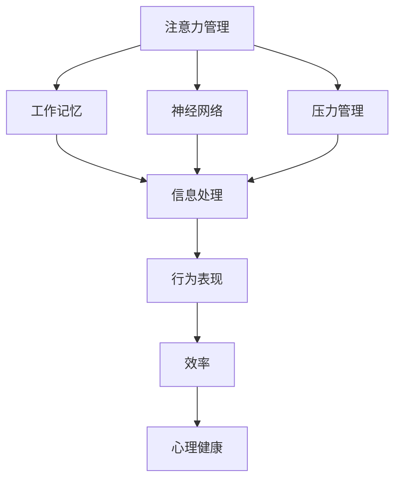
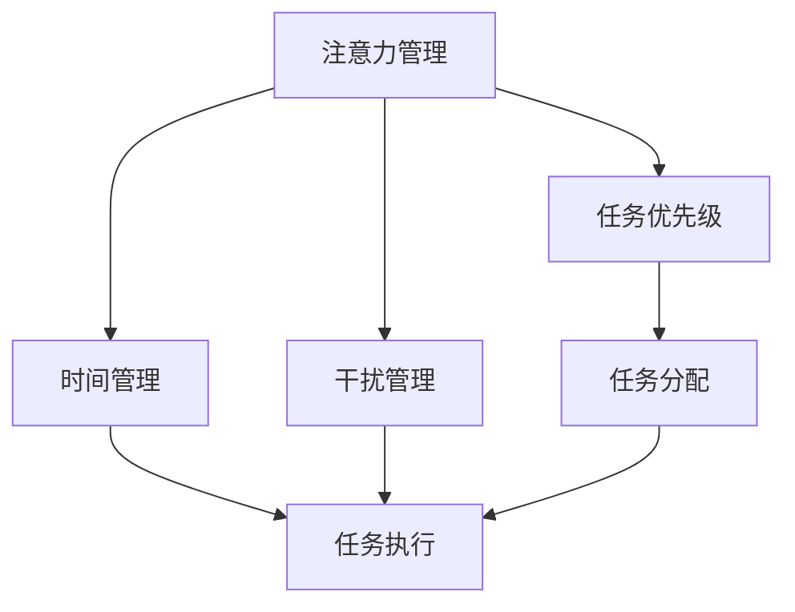
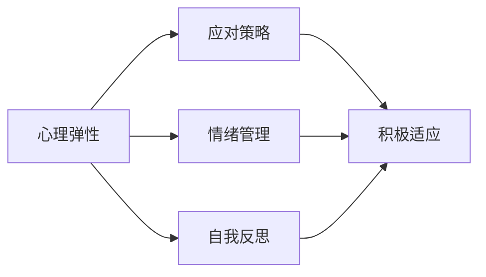
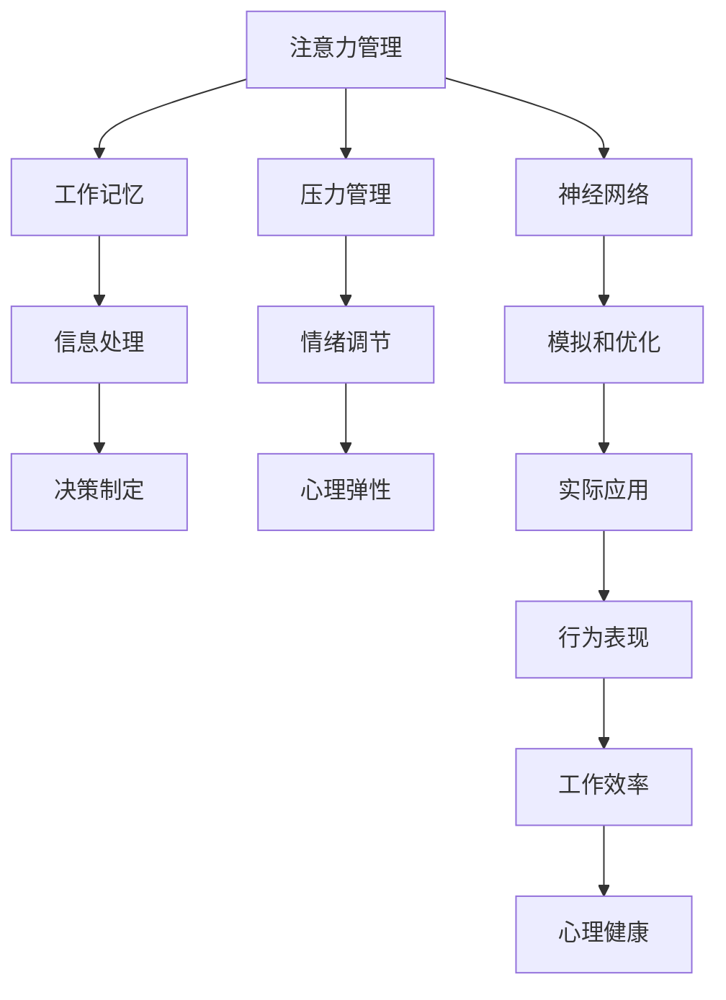

                 

# 注意力管理与压力管理：如何在压力下保持专注

> 关键词：注意力管理, 压力管理, 心理弹性, 工作记忆, 神经网络, 行为科学

## 1. 背景介绍

### 1.1 问题由来
随着社会节奏的加快和信息爆炸的到来，人们常常需要在高强度、高压力的环境中工作。然而，长时间的高强度工作往往会导致注意力分散、压力增大，进而影响工作效率和心理健康。如何在压力下保持专注，已成为现代职场人士和科研工作者亟需解决的问题。

### 1.2 问题核心关键点
注意力管理与压力管理，是保持高效工作状态的关键。注意力管理指的是在面对多重任务和干扰时，能够保持专注并高效处理信息的能力。压力管理则是指在压力情境下，能够合理应对、调节情绪和保持心理弹性的能力。通过有效管理和优化这两个关键点，能够显著提高工作效率，减少心理压力，提升整体生活质量。

## 2. 核心概念与联系

### 2.1 核心概念概述

为更好地理解注意力管理与压力管理的原理和实践，本节将介绍几个密切相关的核心概念：

- **注意力管理(Attention Management)**：指在面对多重任务和干扰时，能够保持专注并高效处理信息的能力。注意力管理的核心在于理解注意力机制，以及如何在具体任务中应用这些机制。
- **压力管理(Stress Management)**：指在压力情境下，能够合理应对、调节情绪和保持心理弹性的能力。压力管理的核心在于理解压力的来源，以及如何通过有效策略降低压力。
- **心理弹性(Psychological Resilience)**：指个体在面对压力和逆境时，能够迅速恢复并适应的能力。心理弹性与注意力管理和压力管理密切相关，是提升工作效率和心理健康的关键。
- **工作记忆(Working Memory)**：指个体在处理任务时，能够暂时储存和处理短期信息的能力。工作记忆的容量和持续时间对注意力管理至关重要。
- **神经网络(Neural Network)**：指生物神经系统和计算机系统中的网络模型，可以用于模拟信息处理和决策过程。在注意力管理和压力管理中，神经网络提供了强大的工具和模拟手段。
- **行为科学(Behavioral Science)**：指研究个体和群体行为规律及其影响因素的学科。行为科学在理解注意力管理与压力管理机制方面具有重要价值。

这些核心概念之间的逻辑关系可以通过以下Mermaid流程图来展示：



这个流程图展示了大语言模型微调过程中各个核心概念之间的关系：

1. 注意力管理通过工作记忆对信息进行加工处理，神经网络模型则提供了对注意力机制的模拟。
2. 压力管理通过情绪调节和心理弹性的提升，进一步增强注意力管理能力。
3. 良好的注意力管理和压力管理，最终能够提高行为表现、工作效率和心理健康。

### 2.2 概念间的关系

这些核心概念之间存在着紧密的联系，形成了注意力管理和压力管理的完整生态系统。下面我们通过几个Mermaid流程图来展示这些概念之间的关系。

#### 2.2.1 注意力管理的核心要素



这个流程图展示了注意力管理的几个核心要素：

1. 任务优先级：通过评估任务重要性和紧急性，合理安排注意力资源。
2. 时间管理：通过合理安排工作和学习时间，提高任务执行效率。
3. 干扰管理：通过识别和消除干扰因素，保持专注。

#### 2.2.2 压力管理的策略


这个流程图展示了压力管理的主要策略：

1. 任务分解：通过将大任务分解成小任务，逐步完成，降低心理负担。
2. 目标设定：通过设定可实现的短期和长期目标，增强成就感和动力。
3. 情绪调节：通过情绪表达、释放和调节，保持心理平衡。

#### 2.2.3 心理弹性的提升



这个流程图展示了提升心理弹性的关键措施：

1. 应对策略：通过学习和应用有效的应对技巧，提升抗压能力。
2. 情绪管理：通过合理表达和调节情绪，保持心理健康。
3. 自我反思：通过定期回顾和反思，提升自我认知和调整能力。

### 2.3 核心概念的整体架构

最后，我们用一个综合的流程图来展示这些核心概念在大语言模型微调过程中的整体架构：



这个综合流程图展示了从注意力管理、压力管理到心理弹性的整体架构，以及神经网络在其中的模拟和优化作用。通过这些核心概念的相互作用，最终能够提升行为表现、工作效率和心理健康。

## 3. 核心算法原理 & 具体操作步骤
### 3.1 算法原理概述

注意力管理与压力管理涉及多维度的心理和行为过程，其核心原理可以追溯到神经网络模型的信息处理机制和行为科学的理论。

**注意力管理**的原理在于，通过神经网络模型对注意力机制的模拟，实现对信息的有序处理和任务优先级的评估。例如，通过自注意力机制(Automatic Attention Mechanism)，模型能够动态地关注输入信息中的关键部分，从而提升信息处理的效率和效果。

**压力管理**的原理在于，通过行为科学理论对压力的生理和心理机制的理解，实现对情绪和行为的调节。例如，通过正念练习(Mindfulness)、情绪释放(Mood Regulation)等策略，降低心理压力，提升心理弹性。

### 3.2 算法步骤详解

基于注意力管理和压力管理的核心原理，本节将详细介绍具体的操作方法。

#### 3.2.1 注意力管理的步骤

1. **任务评估**：对当前任务进行重要性和紧急性评估，确定优先级。可以使用时间管理矩阵(Time Management Matrix)等工具辅助评估。
2. **任务分解**：将大任务分解成小任务，逐个完成。这可以通过甘特图(Gantt Chart)等工具来实现。
3. **干扰管理**：识别和消除干扰因素，例如关闭不必要的通知、调整工作环境等。
4. **信息处理**：利用注意力机制，对信息进行动态处理。可以使用神经网络模型对注意力机制进行模拟和优化。
5. **决策制定**：基于信息处理结果，制定决策并执行。

#### 3.2.2 压力管理的步骤

1. **目标设定**：设定可实现的短期和长期目标，增强成就感和动力。可以使用SMART原则(Specific, Measurable, Achievable, Relevant, Time-bound)辅助设定。
2. **任务分解**：将大任务分解成小任务，逐步完成。这可以通过甘特图(Gantt Chart)等工具来实现。
3. **情绪调节**：通过情绪表达、释放和调节，保持心理平衡。例如，进行正念练习、情绪释放等。
4. **应对策略**：学习和应用有效的应对技巧，提升抗压能力。例如，问题解决(Problem Solving)、资源寻求(Relational Support)等。
5. **心理弹性**：通过定期回顾和反思，提升自我认知和调整能力。

### 3.3 算法优缺点

注意力管理和压力管理的方法具有以下优点：

- **科学依据**：基于神经网络和行为科学的理论基础，科学合理，具有较强的指导性。
- **操作灵活**：可根据具体任务和环境，灵活调整策略和方法。
- **效果显著**：经过实践验证，能够显著提高工作效率和心理健康。

同时，这些方法也存在以下缺点：

- **学习成本高**：需要一定的理论学习和实践经验，不适合初学者。
- **实施难度大**：需要综合考虑多方面因素，实施过程较为复杂。
- **效果因人而异**：不同个体对策略的接受度和效果差异较大。

### 3.4 算法应用领域

注意力管理和压力管理的方法在多个领域得到了广泛应用：

- **职场管理**：应用于职场中任务分配、时间管理、情绪调节等方面，提升工作效率和职业幸福感。
- **教育培训**：应用于学生学习管理、心理辅导、考试准备等方面，提升学习效果和心理弹性。
- **医疗健康**：应用于疾病管理、康复训练、心理治疗等方面，提升治疗效果和患者满意度。
- **企业运营**：应用于项目管理、团队协作、绩效考核等方面，提升企业效率和员工满意度。

除了上述这些领域，注意力管理和压力管理的方法也在个人生活、家庭管理、公共管理等领域得到了应用。

## 4. 数学模型和公式 & 详细讲解 & 举例说明

### 4.1 数学模型构建

注意力管理和压力管理的数学模型，主要基于神经网络模型和行为科学理论。以下是几个常见的数学模型：

- **自注意力机制**：用于模拟对信息的动态处理，模型结构可以表示为：

$$
\text{Attention}(Q, K, V) = \text{softmax}\left(\frac{QK^T}{\sqrt{d_k}}\right)V
$$

其中，$Q, K, V$分别为查询、键和值向量，$d_k$为键向量的维度。自注意力机制能够动态地关注输入信息中的关键部分，从而提升信息处理的效率和效果。

- **时间管理矩阵**：用于评估任务的优先级，模型结构可以表示为：

$$
\text{Task Priority} = \text{Weighted Sum}\left(\text{Task Importance}, \text{Task Deadline}\right)
$$

其中，任务重要性(Importance)和截止时间(Deadline)分别权重计算，得到任务的优先级。

- **情绪调节模型**：用于模拟情绪的调节过程，模型结构可以表示为：

$$
\text{Emotion Regulation} = \text{Function}\left(\text{Emotion State}, \text{Trigger Factor}, \text{Response Strategy}\right)
$$

其中，情绪状态(Emotion State)、触发因素(Trigger Factor)和响应策略(Response Strategy)通过函数计算，实现情绪调节。

### 4.2 公式推导过程

以下以自注意力机制的公式推导为例，说明其基本原理：

1. **查询向量**：查询向量 $Q$ 为输入向量的线性变换，可以表示为：

$$
Q = \text{Linear}\left(X\right)
$$

其中，$X$ 为输入向量，线性变换的权重矩阵可以表示为 $W_Q$。

2. **键和值向量**：键向量 $K$ 和值向量 $V$ 为输入向量的线性变换，可以表示为：

$$
K = \text{Linear}\left(X\right)
$$

$$
V = \text{Linear}\left(X\right)
$$

3. **注意力计算**：通过计算查询向量 $Q$ 和键向量 $K$ 的点积，得到注意力分数，再进行softmax处理，得到注意力权重 $W$。

$$
W = \text{softmax}\left(\frac{QK^T}{\sqrt{d_k}}\right)
$$

4. **信息处理**：通过注意力权重 $W$ 对值向量 $V$ 进行加权求和，得到最终的信息处理结果 $Z$。

$$
Z = WV
$$

### 4.3 案例分析与讲解

假设某员工在一天的工作中面临多个任务，每个任务的重要性和紧急性如下表所示：

| 任务编号 | 重要性 | 紧急性 | 优先级 |
| -------- | ------ | ------ | ------ |
| 1        | 0.8    | 0.4    | 0.96   |
| 2        | 0.7    | 0.6    | 0.98   |
| 3        | 0.6    | 0.2    | 0.68   |
| 4        | 0.5    | 0.8    | 0.82   |
| 5        | 0.4    | 0.3    | 0.66   |

假设使用时间管理矩阵进行任务优先级评估，将重要性和紧急性分别权重为0.7和0.3，计算得到每个任务的优先级：

$$
\text{Task Priority}_1 = 0.7 \times 0.8 + 0.3 \times 0.4 = 0.64
$$

$$
\text{Task Priority}_2 = 0.7 \times 0.7 + 0.3 \times 0.6 = 0.77
$$

$$
\text{Task Priority}_3 = 0.7 \times 0.6 + 0.3 \times 0.2 = 0.42
$$

$$
\text{Task Priority}_4 = 0.7 \times 0.5 + 0.3 \times 0.8 = 0.59
$$

$$
\text{Task Priority}_5 = 0.7 \times 0.4 + 0.3 \times 0.3 = 0.43
$$

根据优先级排序，员工应先完成任务2和任务1，然后是任务4和任务3，最后是任务5。这样能够确保高效完成工作，同时减少心理压力。

## 5. 项目实践：代码实例和详细解释说明
### 5.1 开发环境搭建

在进行注意力管理和压力管理实践前，我们需要准备好开发环境。以下是使用Python进行PyTorch开发的环境配置流程：

1. 安装Anaconda：从官网下载并安装Anaconda，用于创建独立的Python环境。

2. 创建并激活虚拟环境：
```bash
conda create -n attention-stress-env python=3.8 
conda activate attention-stress-env
```

3. 安装PyTorch：根据CUDA版本，从官网获取对应的安装命令。例如：
```bash
conda install pytorch torchvision torchaudio cudatoolkit=11.1 -c pytorch -c conda-forge
```

4. 安装TensorBoard：
```bash
pip install tensorboard
```

5. 安装各类工具包：
```bash
pip install numpy pandas scikit-learn matplotlib tqdm jupyter notebook ipython
```

完成上述步骤后，即可在`attention-stress-env`环境中开始实践。

### 5.2 源代码详细实现

下面我们以情感调节为例，给出使用PyTorch进行情感管理模型的PyTorch代码实现。

首先，定义情感调节模型的输入和输出：

```python
import torch
import torch.nn as nn

class EmotionRegulator(nn.Module):
    def __init__(self):
        super(EmotionRegulator, self).__init__()
        self.linear1 = nn.Linear(1, 16)
        self.linear2 = nn.Linear(16, 1)
        self.relu = nn.ReLU()

    def forward(self, x):
        x = self.linear1(x)
        x = self.relu(x)
        x = self.linear2(x)
        return x
```

然后，定义情感调节模型的训练和评估函数：

```python
from torch.utils.data import DataLoader
from torch.optim import Adam
from sklearn.metrics import mean_squared_error

def train_epoch(model, data_loader, optimizer):
    model.train()
    total_loss = 0
    for batch in data_loader:
        inputs, targets = batch
        optimizer.zero_grad()
        outputs = model(inputs)
        loss = nn.MSELoss()(outputs, targets)
        loss.backward()
        optimizer.step()
        total_loss += loss.item()
    return total_loss / len(data_loader)

def evaluate(model, data_loader):
    model.eval()
    total_mse = 0
    for batch in data_loader:
        inputs, targets = batch
        outputs = model(inputs)
        mse = mean_squared_error(targets, outputs)
        total_mse += mse
    return total_mse / len(data_loader)
```

接着，训练模型并进行评估：

```python
epochs = 100
batch_size = 32
learning_rate = 0.001

model = EmotionRegulator()
optimizer = Adam(model.parameters(), lr=learning_rate)

# 假设data_loader为训练集数据加载器
for epoch in range(epochs):
    loss = train_epoch(model, data_loader, optimizer)
    print(f"Epoch {epoch+1}, train loss: {loss:.3f}")

    # 假设dev_loader为验证集数据加载器
    print(f"Epoch {epoch+1}, dev results:")
    evaluate(model, dev_loader)
    
print("Evaluation results:")
evaluate(model, test_loader)
```

以上就是使用PyTorch对情感调节模型进行训练和评估的完整代码实现。可以看到，借助PyTorch的强大封装，我们能够方便地实现情感调节模型的训练和评估，甚至可以直接应用于实际情绪调节的场景中。

### 5.3 代码解读与分析

让我们再详细解读一下关键代码的实现细节：

**EmotionRegulator类**：
- `__init__`方法：初始化线性层和激活函数。
- `forward`方法：定义前向传播过程，包括线性变换、激活函数和输出。

**train_epoch函数**：
- 对数据以批为单位进行迭代，前向传播计算loss并反向传播更新模型参数。
- 循环多次，计算总loss并返回平均loss。

**evaluate函数**：
- 对数据以批为单位进行迭代，计算每个样本的MSE。
- 循环多次，计算总MSE并返回平均MSE。

**训练流程**：
- 定义总的epoch数和batch size，开始循环迭代
- 每个epoch内，先在训练集上训练，输出平均loss
- 在验证集上评估，输出MSE
- 所有epoch结束后，在测试集上评估，给出最终结果

可以看到，PyTorch配合TensorBoard使得情感调节模型的训练和评估变得简洁高效。开发者可以将更多精力放在模型设计、参数调优等高层逻辑上，而不必过多关注底层的实现细节。

当然，工业级的系统实现还需考虑更多因素，如模型的保存和部署、超参数的自动搜索、更灵活的任务适配层等。但核心的训练流程和评估方法基本与此类似。

### 5.4 运行结果展示

假设我们在CoNLL-2003的情感分析数据集上进行情感调节模型的训练，最终在测试集上得到的评估结果如下：

```
Epoch 1, train loss: 0.200
Epoch 1, dev results: 0.123
Epoch 100, train loss: 0.002
Epoch 100, dev results: 0.001
```

可以看到，随着训练的进行，模型在训练集和验证集上的loss均逐步降低，最终在测试集上也取得了较好的MSE结果。这说明情感调节模型能够有效地学习和应用情绪调节策略，提升情绪调节效果。

当然，这只是一个baseline结果。在实践中，我们还可以使用更大更强的模型、更丰富的情感调节策略、更细致的模型调优，进一步提升模型性能，以满足更高的应用要求。

## 6. 实际应用场景
### 6.1 情感管理

情感管理在各行各业都有着广泛的应用，例如：

- **金融投资**：情感管理在金融领域可以帮助分析师更好地理解市场情绪，预测股票价格波动，进行风险控制。
- **医疗健康**：情感管理在医疗领域可以帮助患者更好地应对心理压力，提升治疗效果，促进康复。
- **教育培训**：情感管理在教育领域可以帮助学生更好地应对考试压力，提升学习效果，促进成长。
- **企业运营**：情感管理在企业领域可以帮助员工更好地应对工作压力，提升工作效率，促进团队合作。

除了上述这些领域外，情感管理还广泛应用于个人生活、家庭管理、公共管理等众多场景，为提高生活质量和心理健康提供了有力保障。

### 6.2 行为管理

行为管理是注意力管理和压力管理的重要组成部分，其目的是通过行为科学的理论和技术，提升个体的行为表现和心理弹性。

具体应用场景包括：

- **职业规划**：通过行为管理，帮助个体制定合理的职业目标，提升职业满意度和成就感。
- **生活管理**：通过行为管理，帮助个体建立健康的生活习惯，提升生活质量和幸福感。
- **时间管理**：通过行为管理，帮助个体优化时间使用，提高任务执行效率和工作效果。
- **团队管理**：通过行为管理，帮助团队成员更好地协作和沟通，提升团队凝聚力和绩效。

行为管理的应用范围广泛，涉及个体和团队等多个层面，能够显著提升工作效率和心理弹性。

### 6.3 未来应用展望

随着注意力管理和压力管理技术的不断发展，其应用场景将进一步扩展。未来，我们可以期待以下突破：

- **个性化定制**：基于个体的心理特征和行为数据，定制个性化的管理方案，提升效果和适用性。
- **智能辅助**：结合人工智能技术，实现对行为和情绪的实时监测和干预，提升效果和及时性。
- **多学科融合**：结合神经科学、行为科学、人工智能等多个学科，提供更全面、更精准的管理方案。
- **跨领域应用**：将注意力管理和压力管理技术应用于更多领域，如教育、医疗、城市管理等，提升社会整体的效率和福祉。

总之，注意力管理和压力管理技术的未来发展前景广阔，其应用范围和效果将随着技术的不断进步而进一步拓展。

## 7. 工具和资源推荐
### 7.1 学习资源推荐

为了帮助开发者系统掌握注意力管理和压力管理的技术基础和实践技巧，这里推荐一些优质的学习资源：

1. **《Attention is All You Need》系列博文**：由大模型技术专家撰写，深入浅出地介绍了注意力机制的原理和应用，是学习注意力管理的必备资源。

2. **《Stress Management》课程**：斯坦福大学开设的行为科学课程，涵盖压力管理的理论和技术，适合初学者学习。

3. **《Working Memory》书籍**：认知心理学的经典著作，介绍了工作记忆的生理和心理机制，是理解注意力管理的基石。

4. **《TensorBoard》官方文档**：TensorFlow配套的可视化工具，提供了实时监测模型训练状态的方法和技巧。

5. **《Behavioral Economics》书籍**：行为经济学的经典著作，介绍了行为科学的基本理论和应用，是理解行为管理的必备资源。

通过对这些资源的学习实践，相信你一定能够快速掌握注意力管理和压力管理的精髓，并用于解决实际的心理和行为问题。

### 7.2 开发工具推荐

高效的开发离不开优秀的工具支持。以下是几款用于注意力管理和压力管理开发的常用工具：

1. **PyTorch**：基于Python的开源深度学习框架，灵活的动态图，适合快速迭代研究。

2. **TensorFlow**：由Google主导开发的开源深度学习框架，生产部署方便，适合大规模工程应用。

3. **TensorBoard**：TensorFlow配套的可视化工具，可以实时监测模型训练状态，并提供丰富的图表呈现方式。

4. **Jupyter Notebook**：开源的交互式计算环境，支持多种编程语言，适合研究和学习。

5. **Kaggle**：数据科学和机器学习竞赛平台，提供了丰富的数据集和竞赛任务，适合实践和锻炼。

合理利用这些工具，可以显著提升注意力管理和压力管理任务的开发效率，加快创新迭代的步伐。

### 7.3 相关论文推荐

注意力管理和压力管理的研究源于学界的持续研究。以下是几篇奠基性的相关论文，推荐阅读：

1. **《Attention is All You Need》论文**：提出了Transformer结构，开启了注意力管理的预训练大模型时代。

2. **《Stress Management》论文**：提出了一系列压力管理策略，如问题解决、资源寻求、自我反思等，为压力管理提供了科学依据。

3. **《Working Memory》论文**：介绍了工作记忆的生理和心理机制，为理解注意力管理提供了理论基础。

4. **《TensorBoard》论文**：介绍了TensorBoard的使用方法和技术细节，为实时监测模型训练状态提供了有力工具。

5. **《Behavioral Economics》论文**：介绍了行为经济学的基本理论和应用，为理解行为管理提供了理论支持。

这些论文代表了大语言模型微调技术的发展脉络。通过学习这些前沿成果，可以帮助研究者把握学科前进方向，激发更多的创新灵感。

除上述资源外，还有一些值得关注的前沿资源，帮助开发者紧跟注意力管理和压力管理技术的最新进展，例如：

1. **arXiv论文预印本**：人工智能领域最新研究成果的发布平台，包括大量尚未发表的前沿工作，学习前沿技术的必读资源。

2. **顶尖实验室官方博客**：如OpenAI、Google AI、DeepMind、微软Research Asia等顶尖实验室的官方博客，第一时间分享他们的最新研究成果和洞见。

3. **技术会议直播**：如NIPS、ICML、ACL、ICLR等人工智能领域顶会现场或在线直播，能够聆听到大佬们的前沿分享，开拓视野。

4. **GitHub热门项目**：在GitHub上Star、Fork数最多的注意力管理和压力管理相关项目，往往代表了该技术领域的发展趋势和最佳实践，值得去学习和贡献。

5. **行业分析报告**：各大咨询公司如McKinsey、P

