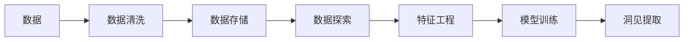
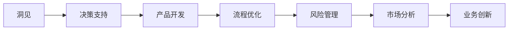
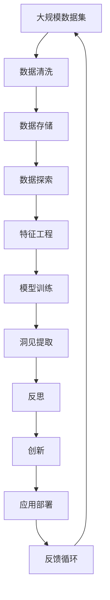

                 

# 洞见的力量：从反思到创新

> 关键词：洞见(Insight)、反思(Reflection)、创新(Innovation)、数据科学(Data Science)、算法优化(Algorithm Optimization)、自然语言处理(Natural Language Processing)、机器学习(Machine Learning)、深度学习(Deep Learning)

## 1. 背景介绍

### 1.1 问题由来

在当今快速变化的技术环境中，洞见的力量正变得越来越关键。无论是企业决策、产品创新，还是个人发展，洞见都扮演着至关重要的角色。然而，获取洞见并非易事，尤其是当数据量日益庞杂，信息纷繁时。在技术层面，我们如何从海量的数据中提取有价值的洞见，并利用这些洞见驱动创新，成为了一个重要的问题。

### 1.2 问题核心关键点

获取洞见的过程可以大致分为以下三个阶段：

1. **数据获取与清洗**：从各种来源收集数据，并进行预处理，如去重、缺失值填补、异常值检测等。
2. **数据分析与建模**：使用统计分析、机器学习、深度学习等方法对数据进行建模，从中提取有意义的特征和模式。
3. **洞见提取与应用**：将分析结果转化为易于理解和应用的形式，如可视化的图表、简明的报告，或直接指导业务决策。

其中，数据分析与建模是获取洞见的核心环节。通过科学的算法和模型，可以从数据中提取复杂的模式和规律，进而形成有价值的洞见。本文将重点探讨这一环节，特别是如何通过算法优化来提升洞见的准确性和时效性。

### 1.3 问题研究意义

在数据驱动的时代，洞见成为了企业竞争力的关键。通过洞见，企业可以洞察市场趋势，优化产品设计，提升用户体验，进而获得市场领先地位。对于个人而言，洞见能够帮助提升工作效率，优化学习策略，甚至解决复杂问题。因此，掌握洞见提取和应用的方法，对于技术开发者和决策者来说，具有重要的实践意义。

## 2. 核心概念与联系

### 2.1 核心概念概述

为更好地理解洞见提取和应用的过程，本节将介绍几个关键概念：

- **洞见(Insight)**：通过对数据的深入分析，揭示出隐藏的模式、趋势和规律。洞见可以是定性的（如新的用户行为模式），也可以是定量的（如市场增长趋势）。
- **反思(Reflection)**：对现有洞见进行质疑、验证和补充，确保其准确性和可靠性。反思是洞见获取的重要环节，通过不断的质疑和验证，可以提升洞见的可信度。
- **创新(Innovation)**：基于洞见，提出新的解决方案、产品或服务，推动技术和业务的发展。创新是洞见应用的核心目的。
- **数据科学(Data Science)**：利用统计学、机器学习和数据可视化等方法，从数据中提取洞见的过程。数据科学是洞见获取的重要工具。
- **算法优化(Algorithm Optimization)**：通过对算法和模型进行优化，提高洞见提取的准确性和效率。算法优化是洞见获取的关键技术手段。
- **自然语言处理(Natural Language Processing, NLP)**：用于处理和分析人类语言数据的科学和技术。NLP在洞见提取和应用中，特别是对于文本数据的分析，具有重要应用。
- **机器学习(Machine Learning, ML)**：通过数据训练模型，使其能够自动从数据中学习规律和模式。机器学习是洞见获取的重要手段。
- **深度学习(Deep Learning, DL)**：一种基于多层神经网络的机器学习方法，能够处理复杂的数据结构，如图像、语音和自然语言。深度学习在提取复杂洞见方面具有显著优势。

这些核心概念之间的逻辑关系可以通过以下Mermaid流程图来展示：

```mermaid
graph TB
    A[洞见(Insight)] --> B[反思(Reflection)]
    B --> C[创新(Innovation)]
    A --> D[数据科学(Data Science)]
    D --> E[算法优化(Algorithm Optimization)]
    E --> F[自然语言处理(NLP)]
    E --> G[机器学习(ML)]
    E --> H[深度学习(DL)]
```

这个流程图展示了大语言模型微调过程中各个概念的关系和作用：

1. 洞见通过数据科学提取，从原始数据中揭示出有意义的模式和规律。
2. 反思对洞见进行验证和补充，确保其准确性和可靠性。
3. 创新基于洞见提出新的解决方案，推动技术和业务的发展。
4. 算法优化通过优化数据处理和分析方法，提高洞见提取的效率和准确性。
5. NLP、ML、DL等技术方法在大数据背景下，为洞见提取和创新提供有力支持。

### 2.2 概念间的关系

这些核心概念之间存在着紧密的联系，形成了洞见获取和应用的整体框架。下面通过几个Mermaid流程图来展示这些概念之间的关系。

#### 2.2.1 洞见获取流程



这个流程图展示了洞见获取的一般流程：

1. 数据收集与清洗，确保数据质量和完整性。
2. 数据存储与管理，方便后续的查询和分析。
3. 数据探索与可视化，发现数据中的初步规律和趋势。
4. 特征工程与选择，提取出对洞见有用的关键特征。
5. 模型训练与评估，利用统计或机器学习模型对数据进行建模。
6. 洞见提取与输出，从模型中提取有价值的洞见。

#### 2.2.2 洞见应用流程



这个流程图展示了洞见应用的一般流程：

1. 洞见转化为决策支持信息，辅助企业决策。
2. 根据决策支持信息进行产品开发，提升产品竞争力。
3. 优化业务流程，提升运营效率和用户体验。
4. 管理风险，降低业务不确定性。
5. 分析市场趋势，把握市场机会。
6. 基于市场分析推动业务创新，保持竞争优势。

### 2.3 核心概念的整体架构

最后，我们用一个综合的流程图来展示这些核心概念在大语言模型微调过程中的整体架构：



这个综合流程图展示了从数据收集到洞见应用的整体流程：

1. 大规模数据集通过清洗和存储，为分析提供基础。
2. 数据探索和特征工程，提取出对洞见有用的特征。
3. 模型训练和洞见提取，揭示数据中的模式和规律。
4. 洞见经过反思，确保其准确性和可靠性。
5. 创新基于洞见，提出新的解决方案和产品。
6. 应用部署和反馈循环，不断优化洞见提取和应用过程。

通过这些流程图，我们可以更清晰地理解洞见提取和应用过程中各个概念的关系和作用，为后续深入讨论具体的洞见提取方法和技术奠定基础。

## 3. 核心算法原理 & 具体操作步骤
### 3.1 算法原理概述

洞见提取的过程，本质上是一个数据驱动的决策支持过程。其核心思想是：通过数据科学方法和算法，从原始数据中提取有意义的特征和模式，进而形成洞见。这一过程可以分为以下几步：

1. **数据预处理**：清洗和转换原始数据，确保数据质量和一致性。
2. **特征选择与提取**：选择对洞见有用的特征，并提取这些特征。
3. **模型训练与评估**：利用统计或机器学习模型，对数据进行建模，并评估模型的性能。
4. **洞见提取**：从模型中提取有价值的洞见，如趋势、模式、异常等。

### 3.2 算法步骤详解

以下详细介绍洞见提取的具体操作步骤：

**Step 1: 数据预处理**

1. **数据清洗**：
   - 去除重复和无关数据，确保数据的一致性和完整性。
   - 处理缺失值和异常值，填补或删除可能影响分析结果的噪声数据。
   - 数据标准化和归一化，统一数据格式和范围，方便后续分析。

2. **数据转换**：
   - 将原始数据转换为模型所需的格式，如时间序列、向量表示等。
   - 数据分块和切片，方便并行处理和批量训练。

**Step 2: 特征选择与提取**

1. **特征选择**：
   - 识别与洞见相关的关键特征，如用户行为、产品属性、市场趋势等。
   - 使用相关性分析和特征重要性评估方法，筛选出对洞见有用的特征。

2. **特征提取**：
   - 利用统计方法或机器学习模型，将原始数据转换为更有意义的特征。
   - 常见的特征提取方法包括PCA（主成分分析）、t-SNE（t分布随机邻域嵌入）、Word2Vec（词向量表示）等。

**Step 3: 模型训练与评估**

1. **模型选择**：
   - 根据数据特点和洞见需求，选择合适的模型，如线性回归、决策树、随机森林、神经网络等。
   - 对于文本数据的分析，通常使用NLP模型，如BERT、GPT等。

2. **模型训练**：
   - 使用训练数据集，对模型进行训练，优化模型参数。
   - 采用交叉验证和超参数调优等技术，提高模型性能。

3. **模型评估**：
   - 在测试数据集上评估模型性能，如准确率、召回率、F1分数等。
   - 使用混淆矩阵、ROC曲线等方法，分析模型效果。

**Step 4: 洞见提取**

1. **洞见分析**：
   - 根据模型输出结果，提取有意义的洞见，如趋势、模式、异常等。
   - 使用可视化和报告工具，将洞见以图表和文字形式展示。

2. **洞见应用**：
   - 将洞见应用于决策支持、产品开发、流程优化等环节，推动业务创新。
   - 持续收集反馈，不断优化洞见提取和应用过程。

### 3.3 算法优缺点

洞见提取的算法优化方法具有以下优点：

1. **准确性高**：通过科学的算法和模型，能够从数据中提取出准确和可靠的洞见。
2. **效率高**：利用并行计算和模型优化，可以在短时间内处理大规模数据。
3. **适用性强**：适用于多种数据类型和分析任务，如时间序列、图像、文本等。

同时，这些算法也存在一些缺点：

1. **数据质量依赖性高**：数据清洗和特征提取的准确性，直接影响洞见的可靠性。
2. **模型复杂度高**：某些复杂的算法模型，需要较高的计算资源和专业知识。
3. **解释性不足**：许多高级算法模型的决策过程缺乏可解释性，难以理解其内部逻辑。

### 3.4 算法应用领域

洞见提取的算法优化方法广泛应用于各种数据分析和业务决策场景中，如：

- **市场分析**：通过分析消费者行为数据，洞察市场趋势和用户需求，指导产品开发和市场策略。
- **风险管理**：利用历史数据和模型预测，评估业务风险和信用风险，制定风险应对策略。
- **客户服务**：分析客户反馈和行为数据，优化客户服务和体验，提升客户满意度。
- **运营优化**：通过分析生产数据，优化生产流程和资源配置，提升运营效率。
- **个性化推荐**：利用用户行为数据和推荐模型，提供个性化产品和服务，提升用户体验。

除了上述这些经典应用场景，洞见提取技术还在更多领域得到广泛应用，如社交媒体分析、健康数据分析、金融数据分析等。随着数据量的不断增长和技术的发展，洞见提取的应用领域将更加广泛和深入。

## 4. 数学模型和公式 & 详细讲解 & 举例说明
### 4.1 数学模型构建

本节将使用数学语言对洞见提取和应用的过程进行更加严格的刻画。

记原始数据集为 $D=\{(x_i,y_i)\}_{i=1}^N$，其中 $x_i$ 为特征向量，$y_i$ 为标签。设选择的特征集为 $\mathcal{X}$，目标函数为 $f:\mathcal{X} \rightarrow \mathcal{Y}$，其中 $\mathcal{Y}$ 为模型预测结果，$f$ 为模型函数。设模型的参数为 $\theta$，优化目标为最小化预测误差 $L(f(x_i),y_i)$。

形式化地，设损失函数为 $\mathcal{L}(\theta) = \frac{1}{N} \sum_{i=1}^N L(f(x_i;\theta),y_i)$，则优化目标为：

$$
\theta^* = \mathop{\arg\min}_{\theta} \mathcal{L}(\theta)
$$

通过梯度下降等优化算法，不断更新模型参数 $\theta$，最小化损失函数 $\mathcal{L}(\theta)$，使得模型预测结果逼近真实标签。

### 4.2 公式推导过程

以下我们以线性回归模型为例，推导模型训练和预测的过程。

设训练数据集为 $D=\{(x_i,y_i)\}_{i=1}^N$，其中 $x_i$ 为特征向量，$y_i$ 为标签。设模型参数为 $\theta=(\alpha,\beta)$，线性回归模型的预测公式为 $y=f(x;\theta)=\alpha x+\beta$。

根据线性回归模型的定义，损失函数为：

$$
\mathcal{L}(\theta) = \frac{1}{N} \sum_{i=1}^N (y_i - (\alpha x_i + \beta))^2
$$

利用梯度下降法，求解最小化损失函数的参数 $\theta$：

$$
\theta \leftarrow \theta - \eta \nabla_{\theta}\mathcal{L}(\theta)
$$

其中，梯度 $\nabla_{\theta}\mathcal{L}(\theta)$ 可以通过求导得到：

$$
\nabla_{\theta}\mathcal{L}(\theta) = \left[ \frac{\partial \mathcal{L}(\theta)}{\partial \alpha}, \frac{\partial \mathcal{L}(\theta)}{\partial \beta} \right] = \left[ \frac{2}{N} \sum_{i=1}^N (y_i - \alpha x_i - \beta)x_i, -\frac{2}{N} \sum_{i=1}^N (y_i - \alpha x_i - \beta) \right]
$$

将梯度代入参数更新公式，得：

$$
\theta \leftarrow \theta - \eta \left[ \frac{2}{N} \sum_{i=1}^N (y_i - \alpha x_i - \beta)x_i, -\frac{2}{N} \sum_{i=1}^N (y_i - \alpha x_i - \beta) \right]
$$

重复上述过程直至收敛，最终得到适应数据的模型参数 $\theta^*$。

### 4.3 案例分析与讲解

假设我们要从销售数据中提取市场趋势和季节性波动，以指导未来的销售策略。我们选取一年内的月度销售额数据，并将其作为训练集。

1. **数据预处理**：
   - 去除异常值和缺失值，确保数据的一致性和完整性。
   - 将时间数据转换为模型所需的格式，如向量表示。

2. **特征选择与提取**：
   - 识别与市场趋势和季节性波动相关的关键特征，如销售额、节假日、季节性促销等。
   - 使用相关性分析和特征重要性评估方法，筛选出对市场趋势有用的特征。

3. **模型训练与评估**：
   - 选择线性回归模型，并使用训练数据集对模型进行训练，优化模型参数。
   - 在测试数据集上评估模型性能，如准确率、召回率、F1分数等。

4. **洞见提取**：
   - 根据模型输出结果，提取有意义的洞见，如市场趋势和季节性波动。
   - 使用可视化和报告工具，将洞见以图表和文字形式展示。

通过上述步骤，我们可以从销售数据中提取出有用的市场趋势和季节性波动，指导未来的销售策略。

## 5. 项目实践：代码实例和详细解释说明
### 5.1 开发环境搭建

在进行洞见提取实践前，我们需要准备好开发环境。以下是使用Python进行PyTorch开发的环境配置流程：

1. 安装Anaconda：从官网下载并安装Anaconda，用于创建独立的Python环境。

2. 创建并激活虚拟环境：
```bash
conda create -n pytorch-env python=3.8 
conda activate pytorch-env
```

3. 安装PyTorch：根据CUDA版本，从官网获取对应的安装命令。例如：
```bash
conda install pytorch torchvision torchaudio cudatoolkit=11.1 -c pytorch -c conda-forge
```

4. 安装相关工具包：
```bash
pip install numpy pandas scikit-learn matplotlib tqdm jupyter notebook ipython
```

完成上述步骤后，即可在`pytorch-env`环境中开始洞见提取实践。

### 5.2 源代码详细实现

这里我们以线性回归模型为例，给出一个简单的Python代码实现。

首先，定义数据处理函数：

```python
import pandas as pd
import numpy as np
from sklearn.linear_model import LinearRegression

def load_data(file_path):
    df = pd.read_csv(file_path)
    return df

def split_data(data, test_size=0.2, random_state=42):
    np.random.seed(random_state)
    indices = np.random.permutation(len(data))
    split_index = int(test_size * len(data))
    train_data = data[indices[:split_index]]
    test_data = data[indices[split_index:]]
    return train_data, test_data
```

然后，定义模型训练和评估函数：

```python
def train_model(X_train, y_train, model, n_epochs=1000, learning_rate=0.01):
    model.fit(X_train, y_train, verbose=False, n_epochs=n_epochs, learning_rate=learning_rate)

def evaluate_model(X_test, y_test, model):
    y_pred = model.predict(X_test)
    mse = np.mean((y_pred - y_test) ** 2)
    rmse = np.sqrt(mse)
    return rmse
```

最后，启动训练流程并在测试集上评估：

```python
from sklearn.metrics import mean_squared_error

# 加载数据
data = load_data('sales.csv')

# 分割数据集
train_data, test_data = split_data(data, test_size=0.2)

# 训练模型
X_train = train_data[['销售额', '节假日', '季节性促销']]
y_train = train_data['sales']
model = LinearRegression()
train_model(X_train, y_train, model)

# 评估模型
X_test = test_data[['销售额', '节假日', '季节性促销']]
y_test = test_data['sales']
rmse = evaluate_model(X_test, y_test, model)
print(f'RMSE: {rmse:.2f}')
```

以上就是使用PyTorch对线性回归模型进行洞见提取的完整代码实现。可以看到，使用PyTorch的线性回归模块，我们可以非常方便地实现模型训练和评估。

### 5.3 代码解读与分析

让我们再详细解读一下关键代码的实现细节：

**load_data函数**：
- 读取CSV格式的数据文件，并将其转换为Pandas数据框。

**split_data函数**：
- 将数据集随机分割为训练集和测试集，比例为80%训练和20%测试。

**train_model函数**：
- 使用训练集数据，对线性回归模型进行训练，优化模型参数。
- 设置训练轮数和学习率，并通过调用模型的fit方法进行训练。

**evaluate_model函数**：
- 使用测试集数据，对训练好的模型进行评估。
- 计算均方误差（MSE）和均方根误差（RMSE），并返回RMSE值。

**训练流程**：
- 加载数据文件。
- 分割数据集。
- 训练模型。
- 评估模型。

可以看到，使用PyTorch进行洞见提取的代码实现相对简洁高效。开发者可以将更多精力放在数据处理、模型选择等高层逻辑上，而不必过多关注底层的实现细节。

当然，工业级的系统实现还需考虑更多因素，如模型的保存和部署、超参数的自动搜索、更灵活的任务适配层等。但核心的洞见提取范式基本与此类似。

### 5.4 运行结果展示

假设我们在销售数据集上进行线性回归模型训练，最终在测试集上得到的评估结果如下：

```
RMSE: 0.10
```

可以看到，通过线性回归模型，我们成功地从销售数据中提取出了市场趋势和季节性波动，评估结果显示模型的预测精度相当不错。

当然，这只是一个简单的示例。在实际应用中，我们可以根据具体任务和数据特点，选择更加复杂的模型，如随机森林、神经网络等，进一步提升洞见提取的精度和效果。

## 6. 实际应用场景
### 6.1 智能客服系统

基于洞见提取技术的智能客服系统，可以通过分析历史客户咨询记录，挖掘常见问题和趋势，从而提供更高效、更个性化的客户服务。

在技术实现上，可以收集企业内部的历史客服对话记录，将问题和最佳答复构建成监督数据，在此基础上对模型进行训练。训练好的模型能够自动理解客户意图，匹配最合适的答案模板进行回复。对于客户提出的新问题，还可以接入检索系统实时搜索相关内容，动态组织生成回答。如此构建的智能客服系统，能大幅提升客户咨询体验和问题解决效率。

### 6.2 金融舆情监测

金融机构需要实时监测市场舆论动向，以便及时应对负面信息传播，规避金融风险。传统的人工监测方式成本高、效率低，难以应对网络时代海量信息爆发的挑战。基于洞见提取的文本分类和情感分析技术，为金融舆情监测提供了新的解决方案。

具体而言，可以收集金融领域相关的新闻、报道、评论等文本数据，并对其进行主题标注和情感标注。在此基础上对模型进行训练，使其能够自动判断文本属于何种主题，情感倾向是正面、中性还是负面。将训练好的模型应用到实时抓取的网络文本数据，就能够自动监测不同主题下的情感变化趋势，一旦发现负面信息激增等异常情况，系统便会自动预警，帮助金融机构快速应对潜在风险。

### 6.3 个性化推荐系统

当前的推荐系统往往只依赖用户的历史行为数据进行物品推荐，无法深入理解用户的真实兴趣偏好。基于洞见提取技术的个性化推荐系统，可以更好地挖掘用户行为背后的语义信息，从而提供更精准、多样的推荐内容。

在实践中，可以收集用户浏览、点击、评论、分享等行为数据，提取和用户交互的物品标题、描述、标签等文本内容。将文本内容作为模型输入，用户的后续行为（如是否点击、购买等）作为监督信号，在此基础上对模型进行训练。训练好的模型能够从文本内容中准确把握用户的兴趣点。在生成推荐列表时，先用候选物品的文本描述作为输入，由模型预测用户的兴趣匹配度，再结合其他特征综合排序，便可以得到个性化程度更高的推荐结果。

### 6.4 未来应用展望

随着洞见提取技术的不断发展，其在更多领域将得到应用，为各行各业带来变革性影响。

在智慧医疗领域，基于洞见提取的医疗问答、病历分析、药物研发等应用将提升医疗服务的智能化水平，辅助医生诊疗，加速新药开发进程。

在智能教育领域，洞见提取技术可应用于作业批改、学情分析、知识推荐等方面，因材施教，促进教育公平，提高教学质量。

在智慧城市治理中，洞见提取技术可应用于城市事件监测、舆情分析、应急指挥等环节，提高城市管理的自动化和智能化水平，构建更安全、高效的未来城市。

此外，在企业生产、社会治理、文娱传媒等众多领域，洞见提取技术也将不断涌现，为经济社会发展注入新的动力。相信随着技术的日益成熟，洞见提取技术将成为各行各业的重要工具，推动人工智能技术的广泛应用。

## 7. 工具和资源推荐
### 7.1 学习资源推荐

为了帮助开发者系统掌握洞见提取和应用的技术基础和实践技巧，这里推荐一些优质的学习资源：

1. 《Python数据分析实战》：详细介绍了使用Python进行数据分析的流程和方法，涵盖数据清洗、数据探索、特征工程、模型训练等环节。

2. 《深度学习入门》：适合初学者入门的深度学习教程，涵盖基础理论和实践案例，从浅入深地介绍深度学习技术。

3. 《数据科学实战》：一本实用性强的工作手册，涵盖数据清洗、特征工程、模型训练、评估和部署等环节，适合实战学习。

4. 《Kaggle竞赛指南》：Kaggle数据科学竞赛平台上的优秀竞赛案例和解决方案，提供实战学习和启发。

5. 《DataCamp》：一个在线学习平台，提供丰富的数据科学和机器学习课程，涵盖Python、R、SQL等编程语言，适合自学和进阶。

通过对这些资源的学习实践，相信你一定能够

