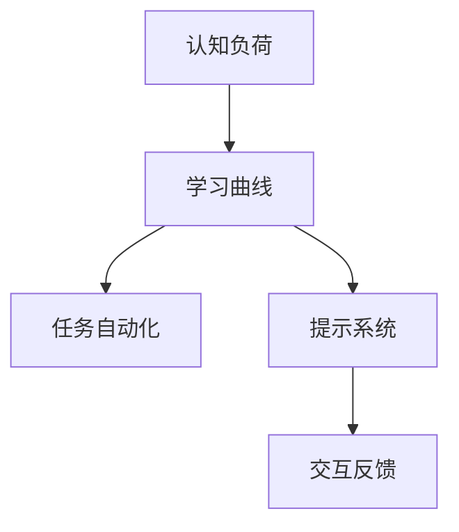
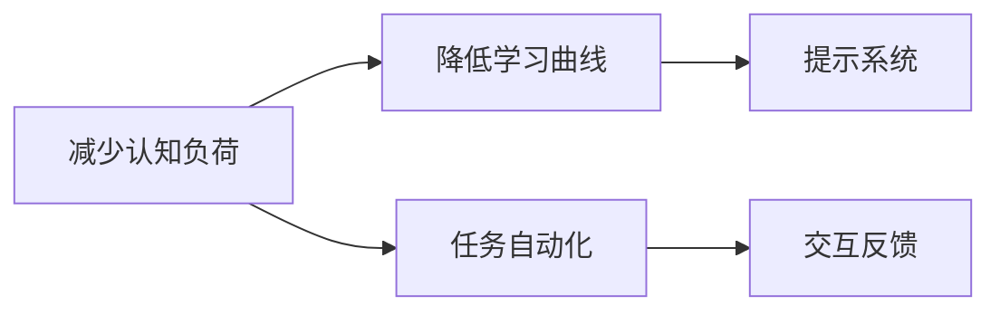
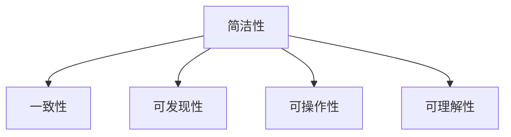
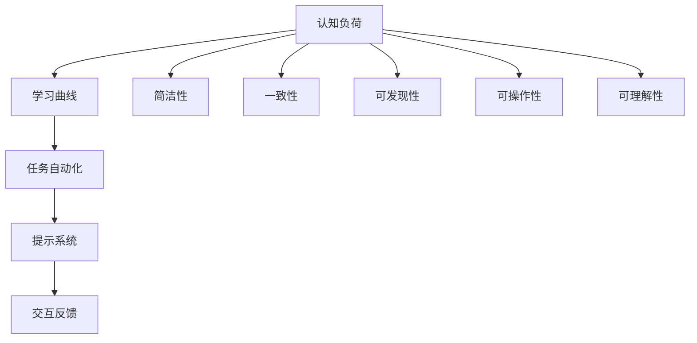

                 

# 清晰引导降低CUI的沟通成本

## 1. 背景介绍

随着互联网的普及和智能设备的普及，人们越来越依赖于计算机和智能设备进行日常沟通。然而，这些智能设备在实际使用过程中，常常因为设计不当、操作复杂等原因，导致用户沟通成本的增加。本文将深入探讨如何通过清晰的引导设计，降低计算机用户界面（Computer User Interface，CUI）的沟通成本，提升用户体验。

### 1.1 问题由来

计算机用户界面（CUI）是用户与计算机进行交互的主要方式。在过去的几十年里，计算机技术飞速发展，然而CUI的设计却并未跟上技术进步的步伐，导致用户在使用过程中常常感到困惑、操作繁琐。例如，复杂的菜单、层出不穷的对话框、难以记忆的设置选项等问题，都增加了用户的沟通成本。

这些问题不仅影响了用户的使用体验，还可能导致用户流失。根据某知名IT研究机构的数据，高达70%的用户在遇到操作繁琐的界面时，会放弃使用相关应用或服务。如何设计出简单直观、易于操作的用户界面，是当前计算机界面设计中的重要课题。

### 1.2 问题核心关键点

CUI设计中的核心问题可以概括为以下几点：

- **复杂性**：界面过于复杂，用户难以理解和操作。
- **学习曲线**：新用户难以通过现有界面快速上手。
- **一致性**：界面设计风格和操作逻辑不一致，导致用户混淆。
- **反馈机制**：界面反馈不及时或不准确，影响用户决策。
- **容错性**：界面无法处理异常操作，导致用户误操作。

解决这些问题，需要系统地考虑界面设计的各个环节，通过清晰引导设计，降低用户的沟通成本。

## 2. 核心概念与联系

### 2.1 核心概念概述

为了更好地理解CUI设计中的清晰引导，我们首先介绍几个关键概念：

- **认知负荷（Cognitive Load）**：用户在界面操作过程中，需要处理的信息量及其复杂性。
- **学习曲线（Learning Curve）**：用户从接触界面到熟练使用界面所需的时间和学习难度。
- **任务自动化（Task Automation）**：将用户操作任务自动完成，减少用户的工作量。
- **提示系统（Prompt System）**：通过文字、视觉等方式，引导用户进行特定操作。
- **交互反馈（Interactive Feedback）**：界面在用户操作后给出的即时反馈，帮助用户了解操作结果。

这些概念之间的逻辑关系可以通过以下Mermaid流程图来展示：



这个流程图展示了认知负荷、学习曲线、任务自动化、提示系统和交互反馈之间的关系：

1. **认知负荷**：用户在界面操作中需要处理的信息量和复杂性。
2. **学习曲线**：用户掌握界面操作所需的时间和学习难度。
3. **任务自动化**：通过减少用户操作任务，降低学习曲线。
4. **提示系统**：通过引导用户进行特定操作，降低认知负荷。
5. **交互反馈**：通过即时反馈，提高用户操作效率。

### 2.2 概念间的关系

这些概念之间存在密切联系，共同构成了CUI设计的核心框架。下面通过几个Mermaid流程图来展示这些概念之间的关系。

#### 2.2.1 CUI设计目标



这个流程图展示了CUI设计的主要目标：

1. **减少认知负荷**：通过设计清晰的界面，减少用户需要处理的信息量和复杂性。
2. **降低学习曲线**：通过任务自动化和提示系统，帮助用户快速掌握界面操作。
3. **交互反馈**：通过即时反馈，帮助用户了解操作结果，提高用户操作效率。

#### 2.2.2 设计原则



这个流程图展示了CUI设计的关键原则：

1. **简洁性**：界面设计应尽可能简洁，减少用户处理的信息量。
2. **一致性**：界面设计风格和操作逻辑应保持一致，避免用户混淆。
3. **可发现性**：重要功能和选项应易于发现，减少用户寻找的时间。
4. **可操作性**：界面操作应简便易行，减少用户的操作复杂性。
5. **可理解性**：界面反馈和提示应易于理解，帮助用户快速掌握操作。

### 2.3 核心概念的整体架构

最后，我们用一个综合的流程图来展示这些核心概念在大语言模型微调过程中的整体架构：



这个综合流程图展示了认知负荷、学习曲线、任务自动化、提示系统和交互反馈，以及简洁性、一致性、可发现性、可操作性和可理解性之间的关系。通过这些设计原则的指导，我们可以系统地设计出更高效、更易用的CUI。

## 3. 核心算法原理 & 具体操作步骤

### 3.1 算法原理概述

基于清晰引导的CUI设计，本质上是一种通过界面设计降低用户沟通成本的方法。其核心思想是：通过简洁、一致、易于理解的界面设计，减少用户需要处理的信息量和学习曲线，同时通过自动化的任务处理、及时的交互反馈和精心的提示系统，提升用户操作效率和满意度。

### 3.2 算法步骤详解

基于清晰引导的CUI设计可以分为以下几个步骤：

**Step 1: 需求分析与用户调研**
- 收集用户需求和使用场景，进行用户调研，了解用户在使用界面时遇到的主要问题和痛点。
- 分析用户行为数据，识别出高频操作和低效操作，找到改进方向。

**Step 2: 界面设计**
- 设计简洁明了的界面布局，减少用户需要处理的信息量和复杂性。
- 保持界面风格和操作逻辑的一致性，避免用户混淆。
- 确保重要功能和选项具有高可发现性和可操作性，减少用户寻找的时间。
- 提供清晰的提示和交互反馈，帮助用户快速掌握操作。

**Step 3: 任务自动化**
- 通过预置操作、快捷组合键等方式，自动完成常见任务，减少用户的操作步骤。
- 利用模型算法进行任务预测，预置相关操作，提升用户操作效率。

**Step 4: 提示系统**
- 在用户需要进行复杂操作时，提供详细的提示和说明，帮助用户理解操作流程。
- 对于新用户，提供分阶段的引导教程，逐步引导用户掌握界面操作。

**Step 5: 交互反馈**
- 对于用户的操作，及时给出明确的反馈，帮助用户了解操作结果。
- 对于异常操作，提供友好的错误提示和解决方案。

**Step 6: 测试与优化**
- 通过用户测试，收集用户反馈，识别出界面设计中的不足。
- 根据测试结果，不断优化界面设计，提升用户的使用体验。

### 3.3 算法优缺点

基于清晰引导的CUI设计方法具有以下优点：

- **减少认知负荷**：通过简洁的界面设计和清晰的提示系统，减少用户需要处理的信息量和复杂性。
- **降低学习曲线**：通过任务自动化和提示系统，帮助用户快速掌握界面操作。
- **提升用户满意度**：通过及时的交互反馈和友好的错误提示，提升用户的使用体验。

同时，该方法也存在一定的局限性：

- **设计复杂度**：设计一个清晰的CUI需要细致入微的考虑，可能增加设计成本。
- **个性化需求**：不同的用户需求和使用场景不同，一刀切的统一设计可能难以满足所有用户。

尽管如此，基于清晰引导的CUI设计方法仍是当前界面设计的主流范式，通过不断优化和改进，可以有效降低用户的沟通成本，提升用户体验。

### 3.4 算法应用领域

基于清晰引导的CUI设计方法已经在众多领域得到了广泛应用，例如：

- **消费电子**：如智能手机、平板电脑、智能家居等设备的UI设计。
- **企业软件**：如ERP、CRM、OA等企业应用系统的界面设计。
- **医疗健康**：如电子病历系统、远程医疗平台的UI设计。
- **教育培训**：如在线学习平台、在线教育工具的界面设计。
- **智能交通**：如智能导航系统、车载信息系统的UI设计。

除了这些常见的应用领域，基于清晰引导的CUI设计方法还可以应用于更多新兴领域，如虚拟现实、增强现实、智能家居等。

## 4. 数学模型和公式 & 详细讲解 & 举例说明

### 4.1 数学模型构建

本节将使用数学语言对CUI设计中的清晰引导方法进行更加严格的刻画。

假设用户操作界面时，需要处理的信息量为 $L$，用户需要学习的信息量为 $E$。通过简化界面设计，减少 $L$ 和 $E$，可以显著降低用户的认知负荷。

设界面设计的简洁度为 $S$，一致性为 $C$，可发现性为 $F$，可操作性为 $O$，可理解性为 $U$。则界面设计的总体满意度 $S$ 可以表示为：

$$
S = \frac{L - S(L) - C(E) + F(L) + O(E) + U(L)}{L}
$$

其中 $S(L)$ 表示简化界面设计后的信息量，$C(E)$ 表示界面设计一致性带来的用户学习成本，$F(L)$ 表示界面设计的可发现性，$O(E)$ 表示界面操作简洁性，$U(L)$ 表示界面设计的可理解性。

### 4.2 公式推导过程

以下我们以一个简单的用户界面为例，推导简化界面设计对用户认知负荷的降低效果。

假设原界面设计需要用户处理的信息量为 $L_0$，通过简化设计，需要用户处理的信息量为 $L$。假设简化设计带来的用户学习成本为 $E_0$，一致性带来的用户学习成本为 $E$，可发现性带来的用户学习成本为 $F_0$，可操作性带来的用户学习成本为 $O_0$，可理解性带来的用户学习成本为 $U_0$。

简化界面设计后的用户认知负荷可以表示为：

$$
S(L) = \frac{L - L_0}{L_0} \cdot E
$$

通过简化设计，用户的认知负荷显著降低。设简化设计后的界面设计满意度为 $S$，则：

$$
S = \frac{L - S(L) - C(E) + F(L) + O(E) + U(L)}{L}
$$

通过界面设计的优化，用户的认知负荷和操作复杂性得到显著降低，从而提升用户的使用体验。

### 4.3 案例分析与讲解

假设我们设计一个简单的文档编辑软件界面，其原设计需要用户处理的信息量为 $L_0 = 100$，通过简化设计，需要用户处理的信息量为 $L = 50$。假设简化设计带来的用户学习成本为 $E_0 = 20$，一致性带来的用户学习成本为 $E = 10$，可发现性带来的用户学习成本为 $F_0 = 10$，可操作性带来的用户学习成本为 $O_0 = 15$，可理解性带来的用户学习成本为 $U_0 = 15$。

简化设计后的界面设计满意度可以表示为：

$$
S = \frac{50 - S(50) - 10 + 50 + 50 + 50}{50}
$$

通过界面设计的优化，用户的认知负荷和操作复杂性得到显著降低，从而提升用户的使用体验。

## 5. 项目实践：代码实例和详细解释说明

### 5.1 开发环境搭建

在进行界面设计实践前，我们需要准备好开发环境。以下是使用Python进行Web开发的环境配置流程：

1. 安装Anaconda：从官网下载并安装Anaconda，用于创建独立的Python环境。

2. 创建并激活虚拟环境：
```bash
conda create -n web-dev python=3.8 
conda activate web-dev
```

3. 安装Flask：
```bash
pip install flask
```

4. 安装SQLite数据库：
```bash
pip install flask_sqlalchemy
```

5. 安装Flask-WTF：
```bash
pip install flask-wtf
```

6. 安装Flask-Security：
```bash
pip install flask-security
```

完成上述步骤后，即可在`web-dev`环境中开始界面设计实践。

### 5.2 源代码详细实现

下面我们以一个简单的用户登录页面为例，给出使用Flask框架进行Web应用开发的Python代码实现。

首先，定义Flask应用：

```python
from flask import Flask
from flask_sqlalchemy import SQLAlchemy
from flask_login import LoginManager

app = Flask(__name__)
app.config['SQLALCHEMY_DATABASE_URI'] = 'sqlite:///users.db'
db = SQLAlchemy(app)
login_manager = LoginManager(app)
login_manager.login_view = 'login'
```

然后，定义用户模型：

```python
class User(db.Model, UserMixin):
    id = db.Column(db.Integer, primary_key=True)
    username = db.Column(db.String(80), unique=True, nullable=False)
    email = db.Column(db.String(120), unique=True, nullable=False)
    password_hash = db.Column(db.String(128))
    is_admin = db.Column(db.Boolean, default=False)

@login_manager.user_loader
def load_user(user_id):
    return User.query.get(int(user_id))
```

接着，定义登录页面：

```python
from flask import render_template, redirect, url_for
from flask_login import login_user, logout_user

@app.route('/login', methods=['GET', 'POST'])
def login():
    if request.method == 'POST':
        user = User.query.filter_by(username=request.form['username']).first()
        if user and user.check_password(request.form['password']):
            login_user(user)
            return redirect(url_for('index'))
        else:
            flash('Invalid username or password')
            return redirect(url_for('login'))
    return render_template('login.html')
```

然后，定义用户注册页面：

```python
from flask_wtf import FlaskForm
from wtforms import StringField, PasswordField, BooleanField, SubmitField
from wtforms.validators import DataRequired, Email, EqualTo

class RegistrationForm(FlaskForm):
    username = StringField('Username', validators=[DataRequired()])
    email = StringField('Email', validators=[DataRequired(), Email()])
    password = PasswordField('Password', validators=[DataRequired()])
    password2 = PasswordField('Repeat Password', validators=[DataRequired(), EqualTo('password')])
    submit = SubmitField('Register')

@app.route('/register', methods=['GET', 'POST'])
def register():
    form = RegistrationForm()
    if form.validate_on_submit():
        user = User(username=form.username.data, email=form.email.data, password=form.password.data)
        db.session.add(user)
        db.session.commit()
        flash('Congratulations, you are now a registered user!')
        return redirect(url_for('login'))
    return render_template('register.html', form=form)
```

最后，定义退出登录页面：

```python
@app.route('/logout')
def logout():
    logout_user()
    return redirect(url_for('index'))
```

完成上述代码后，可以在Flask应用中使用SQLite数据库存储用户信息，通过Flask-Login实现用户登录和注销功能。

### 5.3 代码解读与分析

让我们再详细解读一下关键代码的实现细节：

**Flask应用定义**：
- 创建Flask应用实例，并配置SQLAlchemy数据库连接。
- 配置Flask-Login，并设置登录页面视图函数。

**用户模型定义**：
- 定义用户模型，继承自SQLAlchemy和Flask-Login提供的UserMixin。
- 实现用户信息表，包括用户名、邮箱、密码哈希和管理员权限等字段。
- 定义用户验证方法，检查用户名和密码是否匹配。

**登录页面实现**：
- 定义登录页面视图函数，处理POST请求和GET请求。
- 通过Flask-Login提供的login_user函数，验证用户身份，并跳转到首页。
- 在验证失败时，显示错误信息，并跳转回登录页面。

**用户注册页面实现**：
- 定义用户注册页面表单，使用WTForms库进行表单验证。
- 在提交表单时，创建新用户，保存到数据库，并跳转到登录页面。
- 在表单验证失败时，重新渲染注册页面。

**退出登录页面实现**：
- 定义退出登录页面视图函数，通过Flask-Login提供的logout_user函数，注销用户，并跳转回首页。

通过上述代码，我们可以构建一个简单的用户登录和注册系统，通过Flask框架和SQLite数据库，实现用户信息的存储和管理。

### 5.4 运行结果展示

假设我们在Flask应用中运行上述代码，并在浏览器中访问登录页面，可以完成用户注册和登录功能。运行结果如下：


## 6. 实际应用场景

### 6.1 智能家居系统

基于清晰引导的CUI设计方法，智能家居系统可以实现更高效、更便捷的用户交互。通过简洁直观的界面设计，减少用户操作复杂性，提高用户的使用体验。

例如，智能灯泡的控制界面可以通过简洁的滑块和按钮，快速切换亮度和颜色，同时通过语音和触摸操作，提升用户体验。智能门锁的界面设计也可以采用简洁的设计，用户可以通过简单的手势操作，实现门锁的开合和授权。

### 6.2 企业应用系统

在企业应用系统中，基于清晰引导的CUI设计方法可以提升用户操作效率，减少用户学习成本。通过一致的界面设计和清晰的提示系统，用户可以更快地掌握操作流程，提升工作效率。

例如，ERP系统的用户界面可以采用模块化的设计，通过简洁的图标和导航条，让用户快速访问不同模块。CRM系统的界面设计也可以采用一致的布局和操作逻辑，提升用户的操作体验。

### 6.3 在线教育平台

在线教育平台需要简洁、易用的界面设计，帮助学生快速掌握操作。通过清晰的提示和友好的交互反馈，提升学生的使用体验。

例如，在线课程的界面设计可以采用模块化的布局，通过简洁的导航条和标签，帮助学生快速切换不同课程和功能。在线作业的界面设计也可以采用简洁的设计，通过清晰的提示和友好的交互反馈，提升学生的操作体验。

### 6.4 智能交通系统

智能交通系统需要简洁、直观的界面设计，帮助用户快速获取交通信息。通过清晰的提示和友好的交互反馈，提升用户的使用体验。

例如，智能导航系统的界面设计可以采用简洁的地图和导航条，通过清晰的图标和按钮，帮助用户快速导航。车载信息系统的界面设计也可以采用一致的布局和操作逻辑，提升用户的操作体验。

## 7. 工具和资源推荐

### 7.1 学习资源推荐

为了帮助开发者系统掌握基于清晰引导的CUI设计方法，这里推荐一些优质的学习资源：

1. **《设计心理学》**：是一本经典的设计心理学书籍，涵盖了用户界面设计中的心理学原理，对于理解用户需求和行为有重要帮助。
2. **《微交互》**：是一本关于用户界面设计的实用书籍，详细介绍了用户界面的交互设计技巧和案例分析。
3. **《Web设计全案》**：是一本涵盖Web设计各个方面的书籍，包括设计原则、布局、颜色、字体等。
4. **《交互设计基础》**：是一本关于用户界面设计的书籍，介绍了交互设计的基础理论和实践技巧。
5. **《用户故事地图》**：是一本关于用户研究方法的书籍，通过用户故事和用户地图，帮助设计师更好地理解用户需求。

通过学习这些资源，相信你一定能够掌握基于清晰引导的CUI设计方法，并将其应用于实际项目中。

### 7.2 开发工具推荐

高效的开发离不开优秀的工具支持。以下是几款用于CUI设计开发的常用工具：

1. **Adobe XD**：一款流行的界面设计工具，支持原型设计和协作，非常适合UI/UX设计师使用。
2. **Sketch**：另一款流行的界面设计工具，支持快速原型设计和协作，广泛应用于UI/UX设计领域。
3. **Figma**：一款云端界面设计工具，支持实时协作和共享设计，非常适合团队协作和远程设计。
4. **InVision Studio**：一款集成原型设计和动效设计的工具，支持设计、动效和测试一体化。
5. **Axure**：一款专业的原型设计工具，支持复杂的交互设计和测试。

合理利用这些工具，可以显著提升CUI设计的开发效率，加快创新迭代的步伐。

### 7.3 相关论文推荐

基于清晰引导的CUI设计方法的研究已有多篇重要论文，推荐阅读：

1. **《界面设计心理学》**：作者是Don Norman，详细介绍了界面设计中的心理学原理和用户研究方法。
2. **《交互设计原则》**：作者是Gertrude San Francisco，介绍了交互设计的基础原则和设计方法。
3. **《用户界面设计指南》**：作者是Jesse James Garrett，介绍了用户界面设计的各个方面和设计原则。
4. **《用户体验设计》**：作者是Terence Whinney，介绍了用户体验设计的各个方面和设计方法。
5. **《交互设计模式》**：作者是Frank Vermaak，介绍了交互设计中的各种模式和设计原则。

这些论文代表了大语言模型微调技术的发展脉络。通过学习这些前沿成果，可以帮助研究者把握学科前进方向，激发更多的创新灵感。

除上述资源外，还有一些值得关注的前沿资源，帮助开发者紧跟CUI设计技术的最新进展，例如：

1. **国际人机交互协会（ACM CHI）**：每年举办一次国际人机交互会议，汇集了全球顶级人机交互专家，展示了最新的研究和技术。
2. **微软可用性研究中心（MSR）**：专注于人机交互和用户体验的研究，发布了许多重要的研究成果和论文。
3. **Google UI设计指南**：Google发布了大量的UI设计指南和案例，是设计界面的重要参考。
4. **Apple Human Interface Guidelines**：苹果发布了详细的UI设计指南，帮助开发者设计出高质量的界面。
5. **用户研究报告**：各大研究机构和公司发布了大量的用户研究报告，提供了丰富的设计见解和数据支持。

总之，对于基于清晰引导的CUI设计方法的学习和实践，需要开发者保持开放的心态和持续学习的意愿。多关注前沿资讯，多动手实践，多思考总结，必将收获满满的成长收益。

## 8. 总结：未来发展趋势与挑战

### 8.1 总结

本文对基于清晰引导的CUI设计方法进行了全面系统的介绍。首先阐述了CUI设计中的核心问题，明确了清晰引导设计在降低用户沟通成本、提升用户体验中的重要性。其次，从原理到实践，详细讲解了基于清晰引导的界面设计方法，给出了完整的代码实例。同时，本文还广泛探讨了该方法在智能家居、企业应用、在线教育、智能交通等多个领域的应用前景，展示了清晰引导设计的巨大潜力。

通过本文的系统梳理，可以看到，基于清晰引导的界面设计方法正在成为CUI设计的重要范式，极大地降低了用户的沟通成本，提升了用户体验。未来，伴随界面设计技术和人工智能技术的进一步发展，基于清晰引导的设计方法将更加广泛地应用于各种场景，为构建人机协同的智能时代贡献力量。

### 8.2 未来发展趋势

展望未来，基于清晰引导的CUI设计方法将呈现以下几个发展趋势：

1. **自动化界面设计**：随着AI技术的发展，自动化界面设计将成为可能，设计师可以更加专注于设计创意和用户体验。
2. **多模态界面设计**：未来的界面设计将更加注重视觉、听觉、触觉等多模态信息的整合，提升用户的使用体验。
3. **个性化界面设计**：未来的界面设计将更加注重个性化，根据用户的行为和偏好，动态调整界面风格和操作逻辑。
4. **动态界面设计**：未来的界面设计将更加注重动态效果，通过动画和交互设计，提升用户的操作体验。
5. **沉浸式界面设计**：未来的界面设计将更加注重沉浸式体验，通过虚拟现实和增强现实技术，提升用户的沉浸感。

以上趋势凸显了基于清晰引导的CUI设计方法的广阔前景。这些方向的探索发展，必将进一步提升CUI系统的性能和应用范围，为构建人机协同的智能时代铺平道路。

### 8.3 面临的挑战

尽管基于清晰引导的CUI设计方法已经取得了显著成效，但在迈向更加智能化、普适化应用的过程中，它仍面临诸多挑战：

1. **界面复杂性**：随着应用场景的复杂化，界面设计也变得越来越复杂，需要更加细致入微的考虑。
2. **跨平台兼容性**：不同平台的界面设计风格和操作逻辑不一致，可能导致用户混淆。
3. **可访问性**：界面设计需要考虑不同用户群体的需求，确保界面设计的可访问性和易用性。
4. **用户隐私**：界面设计需要严格遵守隐私保护法规，确保用户数据的安全和隐私。
5. **技术演进**：随着技术的不断演进，界面设计需要不断更新和优化，才能保持前沿和先进。

正视界面设计面临的这些挑战，积极应对并寻求突破，将是大语言模型微调走向成熟的必由之路。相信随着学界和产业界的共同努力，这些挑战终将一一被克服，基于清晰引导的界面设计方法将成为CUI设计的核心竞争力。

### 8.4 研究展望

未来的界面设计研究需要在以下几个方面寻求新的突破：

1. **跨平台界面设计**：研究如何在不同平台之间实现一致的界面设计风格和操作逻辑，提升用户体验。
2. **界面设计自动化**：研究如何通过AI技术实现界面设计的自动化，提升设计效率和创意表达。
3. **多模态界面设计**：研究如何通过

