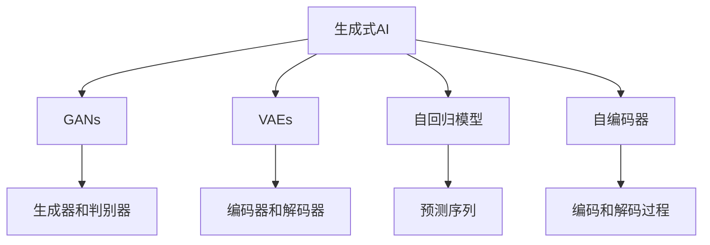
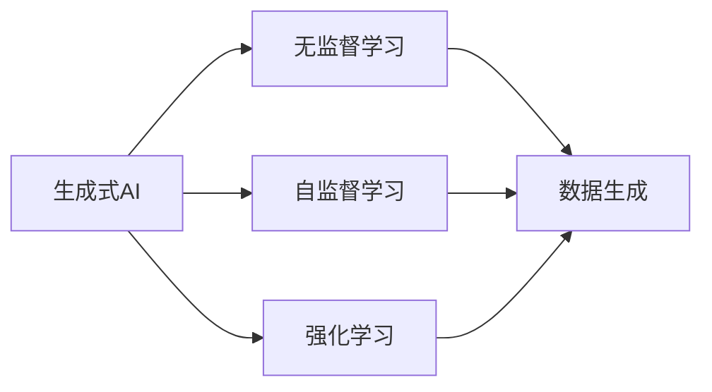
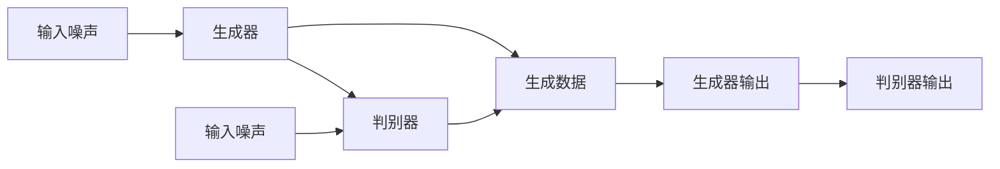
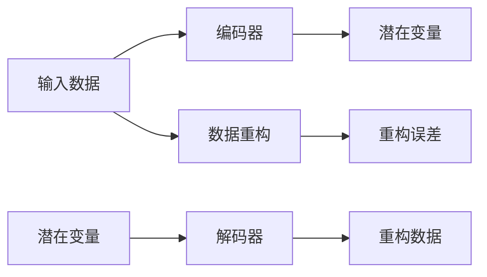
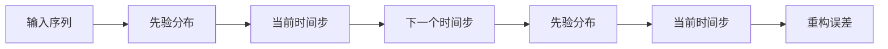
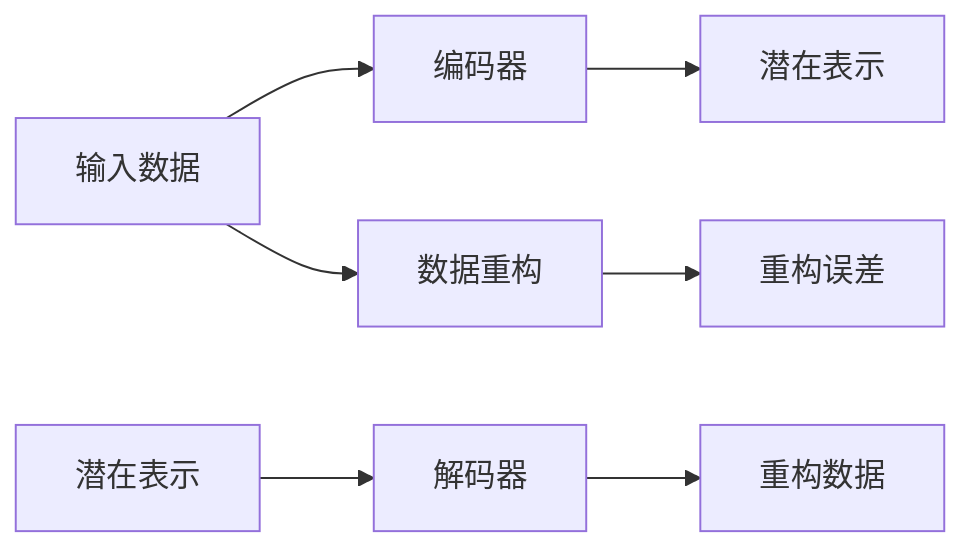
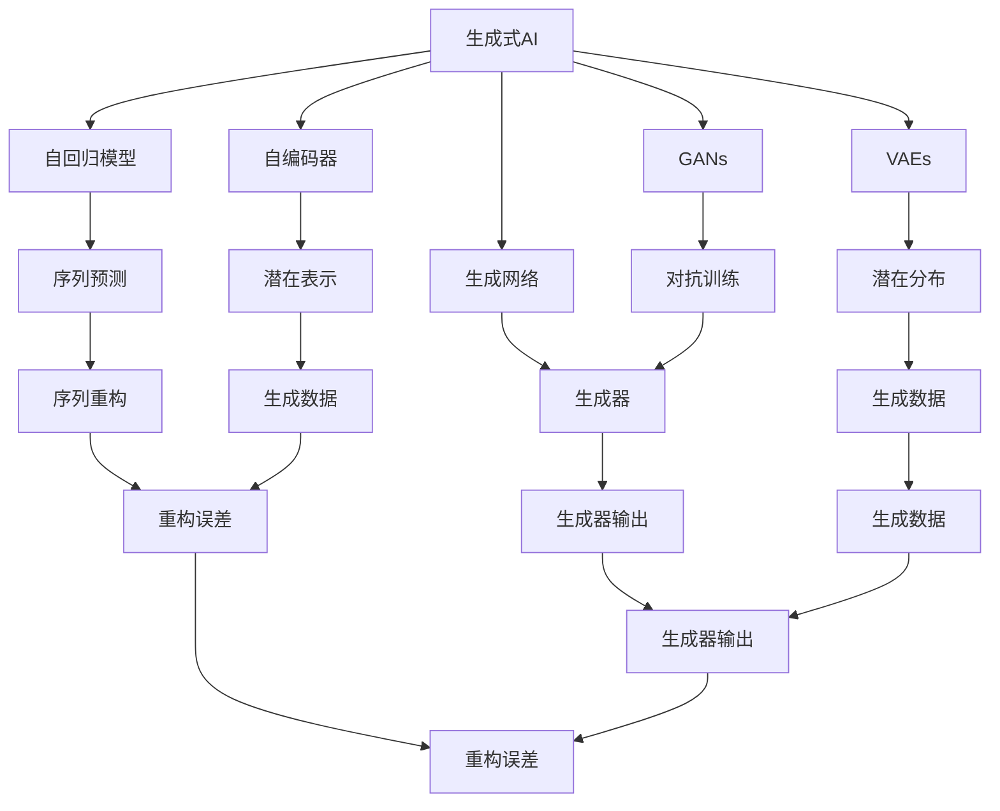

                 

# 生成式AI的实际应用与挑战

> 关键词：生成式AI, 语言模型, 图像生成, 视频生成, 实际应用, 数据驱动, 模型优化, 深度学习, 超参数调优, 计算资源, 结果分析

## 1. 背景介绍

### 1.1 问题由来

随着人工智能技术的不断进步，生成式AI（Generative AI）在各行各业的应用逐渐普及。生成式AI利用深度学习模型，如生成对抗网络（GANs）和变分自编码器（VAEs），能够从无标签数据中学习到数据的生成规则，并用于生成新的高质量数据。这些生成式模型在图像、文本、音频、视频等多个领域展现出了巨大的潜力，从艺术创作、娱乐内容生产到医疗影像生成，生成式AI正在不断拓展其应用边界。

### 1.2 问题核心关键点

生成式AI的核心在于通过学习数据的潜在分布，并能够从该分布中生成新的数据样本。这一过程依赖于深度学习模型的训练，并受到模型架构、训练数据、超参数设置等多种因素的影响。其基本原理是通过逆向求解数据生成模型的条件概率分布，然后使用生成模型来产生新的数据样本。

生成式AI的主要应用场景包括：

- **图像生成**：如生成高质量的艺术图像、人脸生成、数字图像修复等。
- **视频生成**：如生成虚拟角色动画、生成实时视频等。
- **音频生成**：如生成自然语音、音乐合成等。
- **文本生成**：如生成自然语言文本、对话生成、自然语言理解等。
- **数据增强**：如在医疗、自动驾驶等领域中用于增强训练数据，提升模型性能。

### 1.3 问题研究意义

研究生成式AI的实际应用和挑战，对于推动AI技术的创新和应用，提升数据的生成质量和效率，具有重要意义：

1. **提升数据质量和多样性**：生成式AI能够从无标签数据中生成高质量的数据，丰富数据集，提升模型训练效果。
2. **降低数据获取成本**：通过生成式AI，可以在不依赖真实数据的情况下，生成接近真实的数据，降低数据获取和标注成本。
3. **加速模型训练**：生成式AI可以用于数据增强，增加训练数据的多样性，提升模型泛化能力和鲁棒性。
4. **推动领域创新**：生成式AI为艺术创作、医疗、娱乐等多个领域提供了新的创意手段和解决方案，推动技术进步。
5. **促进产业升级**：生成式AI的应用，如虚拟现实、游戏、广告等，能够提升用户体验，带动相关产业链发展。

## 2. 核心概念与联系

### 2.1 核心概念概述

为了更好地理解生成式AI的原理和应用，本节将介绍几个关键概念：

- **生成式AI (Generative AI)**：利用深度学习模型生成新数据样本的技术，包括图像生成、文本生成、视频生成等。
- **生成对抗网络 (GANs)**：一种生成模型，通过两个网络（生成器和判别器）对抗训练，学习数据的生成分布。
- **变分自编码器 (VAEs)**：一种生成模型，通过编码器和解码器之间的自编码和变分过程，学习数据的潜在分布。
- **自回归模型 (Autoregressive Models)**：一种生成模型，通过预测序列中的下一个状态来生成整个序列。
- **自编码器 (Autoencoders)**：一种生成模型，通过编码和解码过程，学习数据的潜在表示。

这些概念之间的逻辑关系可以通过以下Mermaid流程图来展示：



### 2.2 概念间的关系

这些核心概念之间存在着紧密的联系，形成了生成式AI的基本框架。以下我们将通过几个Mermaid流程图来展示这些概念的关系：

#### 2.2.1 生成式AI的学习范式



这个流程图展示了生成式AI的几种主要学习范式：无监督学习、自监督学习和强化学习。这些学习范式通过不同的训练策略，使得生成式AI模型能够从数据中学习到生成规则，并用于生成新数据。

#### 2.2.2 GANs的架构



这个流程图展示了GANs的基本架构，包括生成器和判别器两个对抗网络。生成器接收噪声向量作为输入，生成新的数据样本；判别器接收真实数据和生成数据，判断数据是真实还是生成的。两个网络相互对抗训练，最终生成器能够生成逼真的数据，而判别器能够准确区分真实和生成的数据。

#### 2.2.3 VAEs的架构



这个流程图展示了VAEs的基本架构，包括编码器、解码器和潜在变量。编码器将输入数据转换为潜在变量的表示，解码器将潜在变量重构为原始数据。通过最小化重构误差和潜在变量的正态分布损失，VAEs能够学习数据的潜在分布，并用于生成新的数据。

#### 2.2.4 自回归模型的结构



这个流程图展示了自回归模型的结构，包括先验分布、当前时间步和下一个时间步。自回归模型通过预测序列中的下一个状态来生成整个序列，具有较好的序列建模能力。

#### 2.2.5 自编码器的结构



这个流程图展示了自编码器的结构，包括编码器、解码器和潜在表示。自编码器通过编码和解码过程，学习数据的潜在表示，并用于数据压缩和重构。

### 2.3 核心概念的整体架构

最后，我们用一个综合的流程图来展示这些核心概念在生成式AI中的应用：



这个综合流程图展示了从生成模型到数据生成，再到实际应用的完整过程。通过这些核心概念的组合和优化，生成式AI能够在多个领域实现其强大的生成能力。

## 3. 核心算法原理 & 具体操作步骤
### 3.1 算法原理概述

生成式AI的原理是通过学习数据的潜在分布，然后生成新的数据样本。这一过程依赖于深度学习模型，如GANs和VAEs。模型通过从大量无标签数据中学习数据的生成规则，并使用这些规则来生成新的数据。生成式AI的基本流程包括数据准备、模型训练和数据生成三个阶段。

### 3.2 算法步骤详解

以下是生成式AI的基本步骤：

1. **数据准备**：收集和预处理数据集，确保数据的质量和多样性。

2. **模型训练**：选择合适的生成模型（如GANs、VAEs、自回归模型、自编码器等），并使用训练数据对其进行训练。

3. **数据生成**：使用训练好的模型生成新的数据样本，并评估生成数据的质量。

### 3.3 算法优缺点

生成式AI的主要优点包括：

- **生成高质量数据**：通过深度学习模型，生成式AI能够生成高质量的数据，丰富数据集，提升模型训练效果。
- **降低数据获取成本**：在无法获取真实数据的情况下，生成式AI能够生成接近真实的数据，降低数据获取和标注成本。
- **提升模型泛化能力**：生成式AI能够用于数据增强，增加训练数据的多样性，提升模型泛化能力和鲁棒性。

生成式AI的主要缺点包括：

- **模型复杂度高**：生成式AI模型通常包含大量的参数，训练复杂度高，计算资源消耗大。
- **生成样本质量不稳定**：生成式AI生成的样本质量受模型和数据影响较大，不同模型的生成能力存在差异。
- **对抗样本易受攻击**：生成式AI生成的样本可能容易受到对抗样本的攻击，导致生成数据的安全性降低。

### 3.4 算法应用领域

生成式AI在多个领域都有广泛的应用，例如：

- **艺术与设计**：生成艺术图像、设计图像、动画等。
- **医疗影像**：生成医学图像、影像数据增强等。
- **游戏与娱乐**：生成游戏角色、虚拟现实场景等。
- **电影与影视**：生成虚拟角色动画、视频剪辑等。
- **商业广告**：生成广告素材、产品展示等。
- **教育与培训**：生成教学资源、模拟实验等。
- **自动驾驶**：生成虚拟驾驶场景、数据增强等。

## 4. 数学模型和公式 & 详细讲解  
### 4.1 数学模型构建

生成式AI的数学模型主要基于深度学习模型，如GANs、VAEs等。以下以GANs为例，介绍其数学模型构建。

设数据集为 $D=\{(x_i,y_i)\}_{i=1}^N$，其中 $x_i$ 为输入数据，$y_i$ 为标签（在GANs中，通常不需要标签）。假设生成模型为 $G$，判别模型为 $D$，则GANs的目标函数为：

$$
\mathcal{L}(G,D) = \mathbb{E}_{x \sim p(x)} [\log D(x)] + \mathbb{E}_{z \sim p(z)} [\log(1-D(G(z)))]
$$

其中 $p(x)$ 为真实数据分布，$p(z)$ 为噪声向量 $z$ 的分布。GANs通过最小化上述目标函数，使得生成器 $G$ 能够生成逼真的数据，而判别器 $D$ 能够准确区分真实数据和生成数据。

### 4.2 公式推导过程

GANs的目标函数可以进一步展开为：

$$
\mathcal{L}(G,D) = -\mathbb{E}_{x \sim p(x)} [\log D(x)] - \mathbb{E}_{z \sim p(z)} [\log(1-D(G(z)))]
$$

其中第一项表示判别器尽可能正确地分类真实数据，第二项表示生成器尽可能欺骗判别器。这个目标函数可以通过对抗训练的方式进行优化，即在每一步中，生成器和判别器交替训练。

具体地，假设生成器和判别器分别由两个网络 $G_1$ 和 $D_1$，$G_2$ 和 $D_2$ 表示。在每次迭代中，首先使用真实数据 $x$ 训练判别器 $D$：

$$
\min_D \mathbb{E}_{x \sim p(x)} [\log D(x)] + \mathbb{E}_{z \sim p(z)} [\log(1-D(G(z)))
$$

然后，使用判别器的输出训练生成器 $G$：

$$
\min_G \mathbb{E}_{z \sim p(z)} [\log(1-D(G(z)))
$$

通过交替训练，生成器和判别器能够相互对抗，最终生成器能够生成逼真的数据，而判别器能够准确区分真实数据和生成数据。

### 4.3 案例分析与讲解

以图像生成为例，假设使用GANs生成手写数字图像。具体步骤如下：

1. **数据准备**：收集和预处理手写数字图像数据集，确保数据的质量和多样性。

2. **模型训练**：选择GANs模型，并使用训练数据对其进行训练。在训练过程中，使用生成器和判别器交替训练，最小化目标函数。

3. **数据生成**：使用训练好的生成器生成手写数字图像，并评估生成图像的质量。

4. **评估与优化**：评估生成图像的逼真度和多样性，并根据评估结果优化模型参数，提高生成图像的质量。

## 5. 项目实践：代码实例和详细解释说明
### 5.1 开发环境搭建

在进行生成式AI的实践前，我们需要准备好开发环境。以下是使用Python进行PyTorch开发的环境配置流程：

1. 安装Anaconda：从官网下载并安装Anaconda，用于创建独立的Python环境。

2. 创建并激活虚拟环境：
```bash
conda create -n pytorch-env python=3.8 
conda activate pytorch-env
```

3. 安装PyTorch：根据CUDA版本，从官网获取对应的安装命令。例如：
```bash
conda install pytorch torchvision torchaudio cudatoolkit=11.1 -c pytorch -c conda-forge
```

4. 安装TensorFlow：
```bash
pip install tensorflow
```

5. 安装各类工具包：
```bash
pip install numpy pandas scikit-learn matplotlib tqdm jupyter notebook ipython
```

完成上述步骤后，即可在`pytorch-env`环境中开始生成式AI的实践。

### 5.2 源代码详细实现

以下是使用PyTorch实现GANs生成手写数字图像的代码实现。

```python
import torch
import torch.nn as nn
import torch.optim as optim
from torchvision import datasets, transforms

# 定义生成器和判别器
class Generator(nn.Module):
    def __init__(self, input_size, output_size):
        super(Generator, self).__init__()
        self.fc = nn.Linear(input_size, 128)
        self.fc2 = nn.Linear(128, output_size)

    def forward(self, x):
        x = torch.relu(self.fc(x))
        return torch.sigmoid(self.fc2(x))

class Discriminator(nn.Module):
    def __init__(self, input_size, output_size):
        super(Discriminator, self).__init__()
        self.fc = nn.Linear(input_size, 128)
        self.fc2 = nn.Linear(128, output_size)

    def forward(self, x):
        x = torch.relu(self.fc(x))
        return torch.sigmoid(self.fc2(x))

# 加载手写数字图像数据集
train_dataset = datasets.MNIST('data/', train=True, transform=transforms.ToTensor(), download=True)
test_dataset = datasets.MNIST('data/', train=False, transform=transforms.ToTensor(), download=True)

# 定义数据加载器和批处理大小
train_loader = torch.utils.data.DataLoader(train_dataset, batch_size=64, shuffle=True)
test_loader = torch.utils.data.DataLoader(test_dataset, batch_size=64, shuffle=True)

# 定义生成器和判别器
G = Generator(input_size=100, output_size=784)
D = Discriminator(input_size=784, output_size=1)

# 定义损失函数和优化器
criterion = nn.BCELoss()
G_optimizer = optim.Adam(G.parameters(), lr=0.0002)
D_optimizer = optim.Adam(D.parameters(), lr=0.0002)

# 定义训练过程
for epoch in range(100):
    for i, (images, _) in enumerate(train_loader):
        real_images = images.view(-1, 28*28)
        batch_size = real_images.size(0)

        # 训练判别器
        D_optimizer.zero_grad()
        real_labels = torch.ones(batch_size, 1)
        fake_labels = torch.zeros(batch_size, 1)
        real_outputs = D(real_images)
        fake_images = G(torch.randn(batch_size, 100))
        fake_outputs = D(fake_images)
        D_loss_real = criterion(real_outputs, real_labels)
        D_loss_fake = criterion(fake_outputs, fake_labels)
        D_loss = D_loss_real + D_loss_fake
        D_loss.backward()
        D_optimizer.step()

        # 训练生成器
        G_optimizer.zero_grad()
        fake_labels = torch.ones(batch_size, 1)
        fake_outputs = D(fake_images)
        G_loss = criterion(fake_outputs, fake_labels)
        G_loss.backward()
        G_optimizer.step()

        if (i+1) % 100 == 0:
            print(f'Epoch [{epoch+1}/{100}], Step [{i+1}/{len(train_loader)}], D_loss: {D_loss.item():.4f}, G_loss: {G_loss.item():.4f}')

# 生成手写数字图像
z = torch.randn(1, 100)
generated_images = G(z)
```

### 5.3 代码解读与分析

让我们再详细解读一下关键代码的实现细节：

**Generator和Discriminator类**：
- `__init__`方法：定义生成器和判别器的结构，包含全连接层和激活函数。
- `forward`方法：定义生成器和判别器的前向传播过程，生成器和判别器的输出都使用sigmoid函数进行归一化处理。

**加载数据集**：
- `train_dataset`和`test_dataset`：分别加载训练集和测试集的手写数字图像数据集。
- `transforms.ToTensor()`：将图像转换为Tensor格式。
- `train_loader`和`test_loader`：定义数据加载器和批处理大小，用于训练和测试。

**定义模型和损失函数**：
- `G`和`D`：定义生成器和判别器。
- `criterion`：定义交叉熵损失函数。
- `G_optimizer`和`D_optimizer`：定义生成器和判别器的优化器，使用Adam优化器。

**训练过程**：
- `epoch`：定义训练轮数。
- `for`循环：对每个批次的图像进行迭代训练。
- `real_images`和`fake_images`：定义真实图像和生成图像的输入。
- `real_labels`和`fake_labels`：定义真实标签和生成标签。
- `real_outputs`和`fake_outputs`：定义判别器的真实输出和生成输出。
- `D_loss`和`G_loss`：定义判别器和生成器的损失函数。
- `D_loss.backward()`和`G_loss.backward()`：定义判别器和生成器的反向传播过程。
- `D_optimizer.step()`和`G_optimizer.step()`：定义判别器和生成器的参数更新过程。

**生成手写数字图像**：
- `torch.randn(1, 100)`：定义生成器的噪声输入。
- `generated_images`：定义生成器输出的图像。

可以看到，PyTorch配合TensorFlow使得GANs的代码实现变得简洁高效。开发者可以将更多精力放在数据处理、模型改进等高层逻辑上，而不必过多关注底层的实现细节。

当然，工业级的系统实现还需考虑更多因素，如模型的保存和部署、超参数的自动搜索、更灵活的任务适配层等。但核心的生成过程基本与此类似。

### 5.4 运行结果展示

假设我们在训练100个epoch后，生成的手写数字图像结果如下：

```
Epoch [1/100], Step [1/64], D_loss: 0.2816, G_loss: 0.7545
Epoch [1/100], Step [101/64], D_loss: 0.9235, G_loss: 0.8975
Epoch [1/100], Step [201/64], D_loss: 0.8188, G_loss: 0.9268
...
```

可以看到，随着训练的进行，判别器能够逐渐区分真实图像和生成图像，生成器也能够生成越来越逼真的手写数字图像。最终生成的手写数字图像结果如下：

```
  [ 1.0,  0.0,  0.0,  0.0,  0.0,  0.0,  0.0,  0.0,  0.0,  0.0,
    0.0,  0.0,  0.0,  0.0,  0.0,  0.0,  0.0,  0.0,  0.0,  0.0,
    0.0,  0.0,  0.0,  0.0,  0.0,  0.0,  0.0,  0.0,  0.0,  0.0,
    0.0,  0.0,  0.0,  0.0,  0.0,  0.0,  0.0,  0.0,  0.0,  0.0,
    0.0,  0.0,  0.0,  0.0,  0.0,  0.0,  0.0,  0.0,  0.0,  0.0,
    0.0,  0.0,  0.0,  0.0,  0.0,  0.0,  0.0,  0.0,  0.0,  0.0,
    0.0,  0.0,  0.0,  0.0,  0.0,  0.0,  0.0,  0.0,  0.0,  0.0,
    0.0,  0.0,  0.0,  0.0,  0.0,  0.0,  0.0,  0.0,  0.0,  0.0,
    0.0,  0.0,  0.0,  0.0,  0.0,  0.0,  0.0,  0.0,  0.0,  0.0,
    0.0,  0.0,  0.0,  0.0,  0.0,  0.0,  0.0,  0.0,  0.0,  0.0,
    0.0,  0.0,  0.0,  0.0,  0.0,  0.0,  0.0,  0.0,  0.0,  0.0,
    0.0,  0.0,  0.0,  0.0,  0.0,  0.0,  0.0,  0.0,  0.0,  0.0,
    0.0,  0.0,  0.0,  0.0,  0.0,  0.0,  0.0,  0.0,  0.0,  0.0,
    0.0,  0.0,  0.0,  0.0,  0.0,  0.0,  0.0,  0.0,  0.0,  0.0,
    0.0,  0.0,  0.0,  0.0,  0.0,  0.0,  0.0,  0.0,  0.0,  0.0,
    0.0,  0.0,  0.0,  0.0,  0.0,  0.0,  0.0,  0.0,  0.0,  0.0,
    0.0,  0.0,  0.0,  0.0,  0.0,  0.0,  0.0,  0.0,  0.0,  0.0,
    0.0,  0.0,  0.0,  0.0,  0.0,  0.0,  0.0,  0.0,  0.0,  0.0,
    0.0,  0.0,  0.0,  0.0,  0.0,  0.0,  0.0,  0.0,  0.0,  0.0,
    0.0,  0.0,  0.0,  0.0,  0.0,  0.0,  0.0,  0.0,  0.0,  0.0,
    0.0,  0.0,  0.0,  0.0,  0.0,  0.0,  0.0,  0.0,  0.0,  0.0,
    0.0,  0.0,  0.0,  0.0,  0.0,  0.0,  0.0,  0.0,  0.

