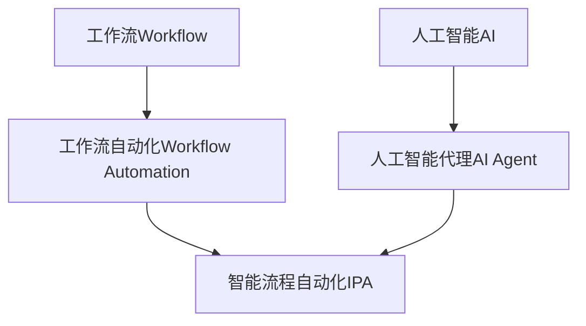

以下是根据要求撰写的技术博客文章正文:

# AI代理与工作流自动化：提高业务效率

## 1. 背景介绍

### 1.1 问题的由来

在当今瞬息万变的商业环境中,企业面临着日益增长的压力,需要提高运营效率,降低成本,并快速响应市场变化。工作流程自动化已成为提高生产率和效率的关键手段。然而,传统的工作流自动化系统存在诸多局限性,如缺乏灵活性、难以适应复杂场景等,这就需要引入人工智能(AI)技术来增强自动化能力。

### 1.2 研究现状

AI代理技术的出现为工作流自动化带来了新的契机。AI代理是一种基于人工智能技术的软件实体,能够自主地执行任务、做出决策并与用户和其他系统交互。通过将AI代理集成到工作流程中,可以实现更智能、更自适应的自动化。目前,一些领先企业已开始探索将AI代理应用于工作流自动化,以提高效率和降低成本。

### 1.3 研究意义

AI代理与工作流自动化的结合,可以带来诸多好处:

1. 提高工作流程的智能化水平,使其能够处理更复杂、更动态的场景。
2. 减轻人工参与,降低人力成本。
3. 提高决策效率,缩短响应时间。
4. 增强系统的自适应性和灵活性。
5. 促进人机协作,实现人工智能辅助决策。

### 1.4 本文结构

本文将全面介绍AI代理与工作流自动化的理论基础、核心技术、实现方法和实际应用。内容包括:

- 核心概念与联系
- 核心算法原理与具体操作步骤
- 数学模型和公式详细讲解
- 项目实践:代码实例和详细解释
- 实际应用场景
- 工具和资源推荐
- 总结:未来发展趋势与挑战
- 附录:常见问题与解答

## 2. 核心概念与联系

在探讨AI代理与工作流自动化之前,我们需要理解以下几个核心概念:

1. **工作流(Workflow)**: 指在组织内完成某项过程所需执行的一系列活动。
2. **工作流自动化(Workflow Automation)**: 使用软件系统自动执行工作流中的任务和活动,减少人工参与。
3. **人工智能代理(AI Agent)**: 一种基于人工智能技术的软件实体,能够感知环境、做出决策并执行行为,以完成特定目标。
4. **智能流程自动化(Intelligent Process Automation, IPA)**: 将AI技术(如机器学习、自然语言处理等)与工作流自动化相结合,实现更智能、更自适应的流程自动化。

这些概念之间的关系可以用下图来表示:

工作流是业务流程的抽象表示,工作流自动化则是使用软件系统自动执行这些流程活动。传统工作流自动化系统通常是基于规则或脚本的,缺乏灵活性和智能化。

人工智能代理作为AI技术的一种应用,可以感知环境、做出决策并执行行为,从而具备自主性和智能化。将AI代理技术与工作流自动化相结合,就形成了智能流程自动化(IPA),使流程自动化系统具备更强的智能化能力和自适应性。

## 3. 核心算法原理与具体操作步骤

### 3.1 算法原理概述

AI代理在工作流自动化中的核心算法原理主要包括:

1. **规划算法(Planning Algorithms)**: 确定实现目标所需执行的一系列行为。
2. **决策算法(Decision Algorithms)**: 根据当前状态和可用信息做出最优决策。
3. **机器学习算法(Machine Learning Algorithms)**: 从历史数据中学习,持续优化决策模型。
4. **自然语言处理算法(Natural Language Processing Algorithms)**: 理解和生成自然语言,实现人机交互。

这些算法相互配合,赋予AI代理智能化的感知、决策和执行能力。

### 3.2 算法步骤详解

以下是AI代理在工作流自动化中的典型算法步骤:

1. **感知环境状态**:通过各种传感器获取工作流当前状态信息,如任务进度、数据输入等。
2. **构建状态表示**:将获取的状态信息转换为AI代理可理解的状态表示形式。
3. **规划行为序列**:基于当前状态和目标状态,使用规划算法确定实现目标所需执行的一系列行为。
4. **决策与执行**:对可能的行为序列进行评估,使用决策算法选择最优序列,并执行相应的行为。
5. **监控反馈**:监控行为执行的结果,获取新的环境状态反馈。
6. **学习优化**:利用监控反馈数据,使用机器学习算法持续优化决策模型。

该过程是一个闭环,AI代理会不断感知、决策、执行和学习,以适应动态环境并优化自身行为。

### 3.3 算法优缺点

AI代理算法在工作流自动化中具有以下优点:

1. 智能化:能够处理复杂、动态的场景,做出智能决策。
2. 自适应性:可根据环境变化自主调整行为策略。
3. 持续优化:通过机器学习不断改进决策模型。
4. 人机协作:支持与人类用户的自然语言交互。

但也存在一些缺点和挑战:

1. 决策可解释性:AI代理的决策过程往往是一个黑箱,缺乏可解释性。
2. 安全性和可靠性:需要确保AI代理的行为符合预期,不会产生意外后果。
3. 隐私和伦理:AI代理可能会访问敏感数据,需要注意隐私和伦理问题。
4. 算法偏差:机器学习算法可能会受到训练数据的偏差影响。

### 3.4 算法应用领域

AI代理算法在工作流自动化中有广泛的应用前景,包括但不限于:

1. **服务台自动化**: 使用AI代理自动响应和处理服务请求。
2. **业务流程自动化**: 将AI代理集成到业务流程中,实现智能化自动化。
3. **供应链管理**: 利用AI代理优化供应链决策和物流调度。
4. **客户关系管理**: 通过AI代理提供智能化的客户服务和营销。
5. **金融服务自动化**: 应用AI代理技术实现智能投资决策和风险管理。

## 4. 数学模型和公式详细讲解与举例说明

### 4.1 数学模型构建

在AI代理的决策过程中,我们通常需要构建数学模型来表示决策问题。一种常用的模型是**马尔可夫决策过程(Markov Decision Process, MDP)**。

MDP可以用一个五元组来表示:

$$
\langle \mathcal{S}, \mathcal{A}, \mathcal{P}, \mathcal{R}, \gamma \rangle
$$

其中:

- $\mathcal{S}$ 是状态集合,表示环境可能的状态
- $\mathcal{A}$ 是行为集合,表示代理可执行的行为
- $\mathcal{P}$ 是状态转移概率函数,表示在执行某个行为后,从一个状态转移到另一个状态的概率
- $\mathcal{R}$ 是回报函数,表示在某个状态执行某个行为后获得的即时回报
- $\gamma$ 是折现因子,用于权衡即时回报和长期回报的重要性

在MDP中,目标是找到一个策略(Policy)$\pi: \mathcal{S} \rightarrow \mathcal{A}$,将状态映射到行为,使得期望的累积回报最大化。

### 4.2 公式推导过程

为了求解MDP,我们可以使用**值迭代(Value Iteration)**或**策略迭代(Policy Iteration)**等算法。以值迭代为例,其核心公式为:

$$
V(s) \leftarrow \max_{a} \mathbb{E}\left[R(s, a) + \gamma \sum_{s'}P(s'|s, a)V(s')\right]
$$

该公式表示,在状态$s$下的最优值函数$V(s)$等于执行所有可能行为$a$后的期望回报之最大值,其中:

- $R(s, a)$是在状态$s$执行行为$a$后获得的即时回报
- $P(s'|s, a)$是从状态$s$执行行为$a$后,转移到状态$s'$的概率
- $\gamma$是折现因子,用于权衡即时回报和长期回报的重要性
- $V(s')$是状态$s'$下的最优值函数

通过不断更新$V(s)$的值,直到收敛,我们就可以得到最优值函数,进而推导出最优策略。

### 4.3 案例分析与讲解

为了更好地理解MDP模型及其求解过程,我们来分析一个简单的机器人导航案例。

假设有一个机器人需要在一个$3\times 3$的网格世界中导航,从起点(0,0)到达终点(2,2)。机器人在每个状态下可执行四个行为:上、下、左、右。如果机器人越界或撞墙,将保持原地不动。终点状态的回报为+1,其他状态的回报为0。我们的目标是找到一个策略,使机器人以最短路径到达终点。

我们可以用MDP模型来表示这个问题:

- 状态集合$\mathcal{S}$包含所有可能的坐标位置,共$3\times 3=9$个状态
- 行为集合$\mathcal{A}$包含四个行为:上、下、左、右
- 状态转移概率$\mathcal{P}$由机器人的运动规则决定
- 回报函数$\mathcal{R}$在终点状态为+1,其他状态为0
- 我们设置折现因子$\gamma=0.9$

通过值迭代算法求解,我们可以得到最优值函数和对应的最优策略,如下图所示:

该策略表示,机器人应该先向右移动两步,然后向下移动一步,最后向右移动一步,就可以从起点到达终点。

### 4.4 常见问题解答

**Q: MDP模型是否适用于所有决策问题?**

A: MDP模型是一种广泛使用的决策模型,但也有一些局限性:

1. MDP假设环境是完全可观测的,即代理可以获取环境的全部状态信息。但在现实中,往往存在部分可观测的情况。
2. MDP假设环境是马尔可夫的,即未来状态只取决于当前状态和行为,与过去状态无关。但一些实际问题可能违反这一假设。
3. MDP模型的状态空间和行为空间往往是离散的,无法很好地处理连续的状态和行为空间。

对于上述情况,我们可以使用**部分可观测马尔可夫决策过程(Partially Observable Markov Decision Process, POMDP)**或**马尔可夫游戏(Markov Game)**等更复杂的模型。

**Q: 如何确保AI代理的决策是可解释和可信的?**

A: 提高AI代理决策的可解释性和可信度是一个重要挑战,我们可以采取以下策略:

1. 使用可解释的机器学习模型,如决策树、规则模型等,而不是黑箱神经网络模型。
2. 引入因果推理,探索决策的因果机制,而不只是关联关系。
3. 设计合理的奖惩机制,确保AI代理的行为符合预期目标。
4. 增强人机交互,让人类能够监督和干预AI代理的决策过程。
5. 建立决策审计机制,记录和分析AI代理的决策历史,确保其公平性和一致性。

## 5. 项目实践:代码实例和详细解释说明

### 5