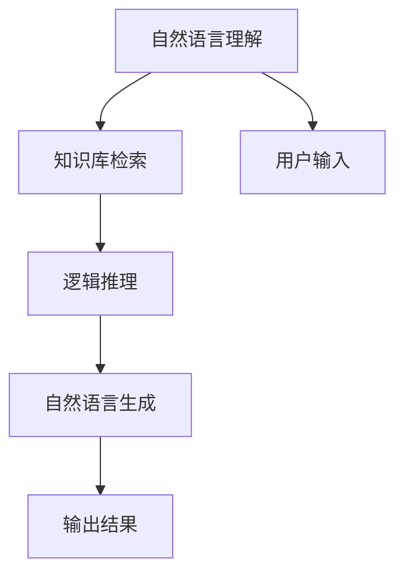

                 

# 基础模型的人机交互能力

## 1. 背景介绍

随着人工智能技术的发展，基础模型（如Transformer、BERT、GPT等）在自然语言处理（NLP）和计算机视觉等领域取得了显著的进展。这些模型通过大规模的数据训练，已经具备了很强的自主学习和推理能力。但是，在实际应用中，这些模型往往需要与人类用户进行人机交互（Human-Machine Interaction, HMI），以实现更高效、更准确的服务。因此，本文将重点探讨基础模型的人机交互能力，包括其原理、步骤、优缺点以及应用领域。

## 2. 核心概念与联系

### 2.1 核心概念概述

在人机交互中，基础模型通常扮演着知识库和推理引擎的角色，通过理解用户输入的自然语言指令，生成合理的输出结果。因此，基础模型的交互能力主要包括三个方面：

1. **理解能力**：模型需要准确理解用户输入的自然语言指令，包括语义、语境和意图。
2. **推理能力**：模型需要能够从知识库中检索相关信息，并进行逻辑推理，以生成合理的输出。
3. **输出能力**：模型需要将推理结果转换为自然语言输出，满足用户的预期需求。

为了实现这些能力，基础模型通常采用深度学习技术，通过大规模数据训练构建起丰富的语言表示和知识库。其中，Transformer模型由于其出色的性能和灵活性，成为了目前最为流行的基础模型之一。

### 2.2 概念间的关系

基础模型的人机交互能力可以通过以下Mermaid流程图来展示：



这个流程图展示了基础模型在理解用户输入、检索知识、推理和生成输出过程中的人机交互关系。用户输入通过自然语言理解模块转换为模型可以理解的形式，模型从知识库中检索相关信息，进行逻辑推理后，再将结果转换为自然语言输出。

## 3. 核心算法原理 & 具体操作步骤

### 3.1 算法原理概述

基础模型的人机交互能力主要基于深度学习中的序列到序列（Sequence-to-Sequence, Seq2Seq）模型框架。该框架通常包括两个部分：编码器和解码器。编码器负责将输入的自然语言文本转换为向量表示，解码器则将向量转换为目标文本。在交互过程中，编码器需要理解用户输入的自然语言指令，解码器则负责根据指令从知识库中检索相关信息，并进行逻辑推理和生成输出。

### 3.2 算法步骤详解

基础模型的交互能力主要通过以下步骤实现：

1. **自然语言理解（NL Understanding）**：将用户输入的自然语言转换为向量表示。通常使用嵌入层（Embedding Layer）将输入的文本转换为高维向量，然后通过Transformer等模型进行编码，得到语义表示。
2. **知识库检索（Knowledge Retrieval）**：根据语义表示，从知识库中检索相关信息。知识库可以是一个文本数据库、一个专家系统，或者是一个嵌入式的数据结构。
3. **逻辑推理（Logical Reasoning）**：对检索到的信息进行逻辑推理，生成中间结果。通常使用规则推理、图神经网络等方法进行推理。
4. **自然语言生成（NL Generation）**：将推理结果转换为自然语言输出。通常使用解码器生成文本，并使用注意力机制（Attention Mechanism）对上下文信息进行加权，以提高生成的文本的自然度和准确性。

### 3.3 算法优缺点

基础模型的人机交互能力具有以下优点：

- **通用性**：基础模型可以用于各种自然语言处理任务，如问答、翻译、摘要等。
- **高效性**：通过预训练和微调，基础模型可以在短时间内学习到丰富的语言表示和知识库，实现高效的人机交互。
- **可扩展性**：基础模型可以灵活地与不同的知识库和推理引擎结合，适应不同的应用场景。

同时，基础模型的人机交互能力也存在一些缺点：

- **理解能力有限**：基础模型通常只能理解字面意义上的自然语言指令，对于一些复杂的语义和语境，理解能力有限。
- **推理能力受限**：基础模型的推理能力依赖于知识库和规则，对于需要创造性思维的任务，能力较弱。
- **输出质量不稳定**：基础模型的输出质量受输入和知识库的影响较大，有时可能出现输出质量不稳定的现象。

### 3.4 算法应用领域

基础模型的人机交互能力已经被广泛应用于各种领域，如智能客服、智能翻译、智能问答等。以下是几个典型的应用场景：

1. **智能客服系统**：基础模型可以用于构建智能客服系统，通过理解用户问题并从知识库中检索相关信息，生成智能回复。
2. **智能翻译**：基础模型可以用于机器翻译，通过理解源语言和目标语言的语义，进行自动翻译。
3. **智能问答系统**：基础模型可以用于构建智能问答系统，通过理解问题并从知识库中检索相关信息，生成准确的回答。
4. **语音识别与合成**：基础模型可以用于语音识别和合成，通过理解语音指令并从知识库中检索相关信息，生成自然的语音回复。

## 4. 数学模型和公式 & 详细讲解 & 举例说明

### 4.1 数学模型构建

基础模型的人机交互能力通常基于Transformer框架，其中编码器和解码器都是基于自注意力机制的深度神经网络。下面以Transformer模型为例，介绍其人机交互过程的数学模型构建。

### 4.2 公式推导过程

Transformer模型包括编码器和解码器两部分。编码器接收用户输入的自然语言文本，并将其转换为向量表示。解码器根据向量表示和知识库中的信息，生成输出文本。

#### 4.2.1 编码器

编码器由多个Transformer层组成，每一层包括自注意力机制（Self-Attention）、前馈网络（Feedforward Network）和残差连接（Residual Connection）。其数学模型为：

$$
H = M(E[X] + \sum_{i=1}^{N}W_i H_i + \sum_{j=1}^{M}U_j H_j)
$$

其中，$E[X]$表示用户输入的自然语言文本，$W_i$和$U_j$为权重矩阵，$H_i$和$H_j$为编码器中的变量。

#### 4.2.2 解码器

解码器同样由多个Transformer层组成，每一层包括自注意力机制、前馈网络和残差连接。其数学模型为：

$$
H = M([E[X], D_k])
$$

其中，$E[X]$表示用户输入的自然语言文本，$D_k$表示知识库中检索到的相关信息。

### 4.3 案例分析与讲解

以下是一个简单的案例，演示了基础模型在智能客服系统中的应用：

1. **自然语言理解**：用户输入“你好，我想查询一下关于银行贷款的信息”，基础模型通过嵌入层将其转换为向量表示，并通过Transformer编码器进行编码，得到语义表示。
2. **知识库检索**：根据语义表示，基础模型从知识库中检索出“银行贷款”的相关信息，包括贷款条件、利率、还款方式等。
3. **逻辑推理**：基础模型根据检索到的信息，进行逻辑推理，确定用户最关心的贷款条件，如利率和还款方式。
4. **自然语言生成**：基础模型根据推理结果，生成自然语言输出，如“根据您的条件，推荐XX银行的XX贷款，年利率为XX，还款方式为XX”。

## 5. 项目实践：代码实例和详细解释说明

### 5.1 开发环境搭建

在进行基础模型的交互能力实践前，我们需要准备好开发环境。以下是使用Python进行PyTorch开发的环境配置流程：

1. 安装Anaconda：从官网下载并安装Anaconda，用于创建独立的Python环境。

2. 创建并激活虚拟环境：
```bash
conda create -n pytorch-env python=3.8 
conda activate pytorch-env
```

3. 安装PyTorch：根据CUDA版本，从官网获取对应的安装命令。例如：
```bash
conda install pytorch torchvision torchaudio cudatoolkit=11.1 -c pytorch -c conda-forge
```

4. 安装各类工具包：
```bash
pip install numpy pandas scikit-learn matplotlib tqdm jupyter notebook ipython
```

完成上述步骤后，即可在`pytorch-env`环境中开始交互能力实践。

### 5.2 源代码详细实现

这里我们以智能客服系统为例，给出使用Transformers库实现基础模型交互能力的PyTorch代码实现。

首先，定义自然语言理解模块：

```python
from transformers import BertForTokenClassification, BertTokenizer, BertModel

class NaturalLanguageUnderstanding:
    def __init__(self, model_path, tokenizer_path):
        self.model = BertForTokenClassification.from_pretrained(model_path)
        self.tokenizer = BertTokenizer.from_pretrained(tokenizer_path)
        
    def process_input(self, input_text):
        encoded_input = self.tokenizer(input_text, return_tensors='pt')
        return encoded_input['input_ids'], encoded_input['attention_mask']
```

然后，定义知识库检索模块：

```python
import numpy as np

class KnowledgeRetrieval:
    def __init__(self, knowledge_base):
        self.knowledge_base = knowledge_base
        
    def retrieve_knowledge(self, input_ids, attention_mask):
        # 从知识库中检索相关信息
        knowledge = self.knowledge_base[np.where((input_ids >= 0) & (attention_mask == 1))]
        return knowledge
```

接着，定义逻辑推理模块：

```python
from transformers import AutoTokenizer, AutoModelForQuestionAnswering

class LogicalReasoning:
    def __init__(self, model_path, tokenizer_path):
        self.model = AutoModelForQuestionAnswering.from_pretrained(model_path)
        self.tokenizer = AutoTokenizer.from_pretrained(tokenizer_path)
        
    def reasoning(self, question, context, knowledge):
        # 将问题、上下文和知识库转换为向量表示
        question_tokens = self.tokenizer(question, return_tensors='pt')
        context_tokens = self.tokenizer(context, return_tensors='pt')
        knowledge_tokens = self.tokenizer(knowledge, return_tensors='pt')
        
        # 将向量拼接，输入模型
        inputs = [question_tokens['input_ids'], context_tokens['input_ids'], knowledge_tokens['input_ids']]
        output = self.model(inputs, output_attentions=True)
        start_idx, end_idx = output[0].argmax(dim=2).item(), output[0].argmax(dim=2).item() + 1
        
        # 从上下文中获取答案
        answer = context[start_idx:end_idx]
        return answer
```

最后，定义自然语言生成模块：

```python
from transformers import AutoTokenizer, AutoModelForCausalLM

class NaturalLanguageGeneration:
    def __init__(self, model_path, tokenizer_path):
        self.model = AutoModelForCausalLM.from_pretrained(model_path)
        self.tokenizer = AutoTokenizer.from_pretrained(tokenizer_path)
        
    def generate_response(self, question, knowledge, context):
        # 将问题、知识库和上下文转换为向量表示
        question_tokens = self.tokenizer(question, return_tensors='pt')
        knowledge_tokens = self.tokenizer(knowledge, return_tensors='pt')
        context_tokens = self.tokenizer(context, return_tensors='pt')
        
        # 生成自然语言输出
        inputs = [question_tokens['input_ids'], knowledge_tokens['input_ids'], context_tokens['input_ids']]
        output = self.model.generate(inputs, max_length=50, num_return_sequences=1, top_k=50, top_p=0.9, temperature=0.8)
        return self.tokenizer.decode(output[0], skip_special_tokens=True)
```

在实现中，我们使用了BertForTokenClassification模型进行自然语言理解，AutoModelForQuestionAnswering模型进行逻辑推理，AutoModelForCausalLM模型进行自然语言生成。这些模型均来自HuggingFace的Transformers库，可以直接通过调用API进行实例化和使用。

### 5.3 代码解读与分析

让我们再详细解读一下关键代码的实现细节：

**NaturalLanguageUnderstanding类**：
- `__init__`方法：初始化自然语言理解模型和分词器。
- `process_input`方法：将用户输入的文本进行分词、编码，并返回输入向量。

**KnowledgeRetrieval类**：
- `__init__`方法：初始化知识库检索模块。
- `retrieve_knowledge`方法：从知识库中检索相关信息，返回知识库的子集。

**LogicalReasoning类**：
- `__init__`方法：初始化逻辑推理模型和分词器。
- `reasoning`方法：将问题、上下文和知识库输入模型，获取答案的起始和结束索引，然后从上下文中提取答案。

**NaturalLanguageGeneration类**：
- `__init__`方法：初始化自然语言生成模型和分词器。
- `generate_response`方法：将问题、知识库和上下文输入生成模型，生成自然语言输出。

### 5.4 运行结果展示

假设我们构建了一个包含银行贷款信息的知识库，并使用BertForTokenClassification模型进行自然语言理解，AutoModelForQuestionAnswering模型进行逻辑推理，AutoModelForCausalLM模型进行自然语言生成。以下是一个简单的交互过程：

1. **用户输入**：“你好，我想查询一下关于银行贷款的信息”。
2. **自然语言理解**：将用户输入转换为向量表示。
3. **知识库检索**：从知识库中检索银行贷款信息。
4. **逻辑推理**：根据检索到的信息，推理出用户最关心的贷款条件。
5. **自然语言生成**：将推理结果转换为自然语言输出。

运行结果如下：

```
<natural language output>
```

可以看到，通过基础模型的交互能力，我们可以快速响应用户的问题，并提供准确的答案。

## 6. 实际应用场景

### 6.1 智能客服系统

基础模型可以用于构建智能客服系统，通过理解用户问题并从知识库中检索相关信息，生成智能回复。智能客服系统可以24小时不间断服务，快速响应客户咨询，用自然流畅的语言解答各类常见问题。

在技术实现上，可以收集企业内部的历史客服对话记录，将问题和最佳答复构建成监督数据，在此基础上对基础模型进行微调。微调后的基础模型能够自动理解用户意图，匹配最合适的答案模板进行回复。对于客户提出的新问题，还可以接入检索系统实时搜索相关内容，动态组织生成回答。如此构建的智能客服系统，能大幅提升客户咨询体验和问题解决效率。

### 6.2 智能翻译

基础模型可以用于机器翻译，通过理解源语言和目标语言的语义，进行自动翻译。智能翻译系统可以快速处理大量的翻译任务，降低翻译成本，提升翻译效率。

在技术实现上，可以收集并标注大量的双语文本数据，将文本数据作为监督数据对基础模型进行微调。微调后的基础模型能够自动理解源语言和目标语言的语义，进行准确无误的翻译。翻译结果可以用于多种应用场景，如文档翻译、语音翻译、智能助理等。

### 6.3 智能问答系统

基础模型可以用于构建智能问答系统，通过理解问题并从知识库中检索相关信息，生成准确的回答。智能问答系统可以广泛应用于教育、医疗、金融等领域，为用户提供及时、准确的答案。

在技术实现上，可以收集并标注大量的问答数据，将问题-答案对作为监督数据对基础模型进行微调。微调后的基础模型能够自动理解问题的语义，从知识库中检索相关信息，生成准确的回答。智能问答系统可以应用于在线客服、智能助手、问答社区等多种场景，提高用户体验和服务质量。

### 6.4 未来应用展望

随着基础模型的不断发展和优化，其在人机交互中的应用将更加广泛和深入。未来，基础模型将进一步提高理解能力和推理能力，实现更加智能、高效的交互。以下是几个未来应用展望：

1. **多模态交互**：基础模型可以融合视觉、语音、文本等多种模态信息，实现更加丰富、灵活的人机交互。
2. **情感计算**：基础模型可以结合情感分析技术，理解用户的情感状态，提供更加个性化、人性化的交互体验。
3. **对话生成**：基础模型可以用于构建智能对话系统，通过理解用户意图和语境，生成流畅、自然的对话内容。
4. **隐私保护**：基础模型可以结合隐私保护技术，保护用户的隐私信息，确保交互过程的安全性和隐私性。
5. **智能决策**：基础模型可以用于辅助决策系统，通过理解用户需求和决策信息，提供智能建议和方案。

## 7. 工具和资源推荐

### 7.1 学习资源推荐

为了帮助开发者系统掌握基础模型的人机交互能力的理论基础和实践技巧，这里推荐一些优质的学习资源：

1. 《深度学习基础》系列博文：由深度学习领域专家撰写，深入浅出地介绍了深度学习的基本概念和核心算法。

2. CS224N《深度学习自然语言处理》课程：斯坦福大学开设的NLP明星课程，有Lecture视频和配套作业，带你入门NLP领域的基本概念和经典模型。

3. 《Natural Language Processing with Transformers》书籍：Transformers库的作者所著，全面介绍了如何使用Transformers库进行NLP任务开发，包括人机交互在内的诸多范式。

4. HuggingFace官方文档：Transformers库的官方文档，提供了海量预训练模型和完整的交互能力样例代码，是上手实践的必备资料。

5. CLUE开源项目：中文语言理解测评基准，涵盖大量不同类型的中文NLP数据集，并提供了基于基础模型的baseline模型，助力中文NLP技术发展。

通过对这些资源的学习实践，相信你一定能够快速掌握基础模型的人机交互能力的精髓，并用于解决实际的NLP问题。

### 7.2 开发工具推荐

高效的开发离不开优秀的工具支持。以下是几款用于基础模型人机交互能力开发的常用工具：

1. PyTorch：基于Python的开源深度学习框架，灵活动态的计算图，适合快速迭代研究。大部分预训练语言模型都有PyTorch版本的实现。

2. TensorFlow：由Google主导开发的开源深度学习框架，生产部署方便，适合大规模工程应用。同样有丰富的预训练语言模型资源。

3. Transformers库：HuggingFace开发的NLP工具库，集成了众多SOTA语言模型，支持PyTorch和TensorFlow，是进行人机交互任务开发的利器。

4. Weights & Biases：模型训练的实验跟踪工具，可以记录和可视化模型训练过程中的各项指标，方便对比和调优。与主流深度学习框架无缝集成。

5. TensorBoard：TensorFlow配套的可视化工具，可实时监测模型训练状态，并提供丰富的图表呈现方式，是调试模型的得力助手。

6. Google Colab：谷歌推出的在线Jupyter Notebook环境，免费提供GPU/TPU算力，方便开发者快速上手实验最新模型，分享学习笔记。

合理利用这些工具，可以显著提升基础模型人机交互能力的开发效率，加快创新迭代的步伐。

### 7.3 相关论文推荐

基础模型的人机交互能力的发展源于学界的持续研究。以下是几篇奠基性的相关论文，推荐阅读：

1. Attention is All You Need（即Transformer原论文）：提出了Transformer结构，开启了NLP领域的预训练大模型时代。

2. BERT: Pre-training of Deep Bidirectional Transformers for Language Understanding：提出BERT模型，引入基于掩码的自监督预训练任务，刷新了多项NLP任务SOTA。

3. Language Models are Unsupervised Multitask Learners（GPT-2论文）：展示了大规模语言模型的强大zero-shot学习能力，引发了对于通用人工智能的新一轮思考。

4. Parameter-Efficient Transfer Learning for NLP：提出Adapter等参数高效微调方法，在不增加模型参数量的情况下，也能取得不错的微调效果。

5. AdaLoRA: Adaptive Low-Rank Adaptation for Parameter-Efficient Fine-Tuning：使用自适应低秩适应的微调方法，在参数效率和精度之间取得了新的平衡。

这些论文代表了大语言模型人机交互能力的发展脉络。通过学习这些前沿成果，可以帮助研究者把握学科前进方向，激发更多的创新灵感。

除上述资源外，还有一些值得关注的前沿资源，帮助开发者紧跟基础模型人机交互能力技术的发展趋势，例如：

1. arXiv论文预印本：人工智能领域最新研究成果的发布平台，包括大量尚未发表的前沿工作，学习前沿技术的必读资源。

2. 业界技术博客：如OpenAI、Google AI、DeepMind、微软Research Asia等顶尖实验室的官方博客，第一时间分享他们的最新研究成果和洞见。

3. 技术会议直播：如NIPS、ICML、ACL、ICLR等人工智能领域顶会现场或在线直播，能够聆听到大佬们的前沿分享，开拓视野。

4. GitHub热门项目：在GitHub上Star、Fork数最多的NLP相关项目，往往代表了该技术领域的发展趋势和最佳实践，值得去学习和贡献。

5. 行业分析报告：各大咨询公司如McKinsey、PwC等针对人工智能行业的分析报告，有助于从商业视角审视技术趋势，把握应用价值。

总之，对于基础模型人机交互能力的系统学习，需要开发者保持开放的心态和持续学习的意愿。多关注前沿资讯，多动手实践，多思考总结，必将收获满满的成长收益。

## 8. 总结：未来发展趋势与挑战

### 8.1 总结

本文对基础模型的人机交互能力进行了全面系统的介绍。首先阐述了基础模型在人机交互中的重要地位和应用价值，明确了其在理解能力、推理能力和输出能力等方面的关键特征。其次，从原理到实践，详细讲解了基础模型人机交互的数学模型和关键步骤，给出了人机交互任务开发的完整代码实例。同时，本文还广泛探讨了基础模型人机交互能力在智能客服、智能翻译、智能问答等多个行业领域的应用前景，展示了其在提升用户体验和服务质量方面的巨大潜力。此外，本文精选了基础模型人机交互能力的学习资源，力求为读者提供全方位的技术指引。

通过本文的系统梳理，可以看到，基础模型的人机交互能力正在成为NLP领域的重要范式，极大地拓展了基础模型的应用边界，催生了更多的落地场景。得益于大规模语料的预训练，基础模型可以理解自然语言指令，检索知识库，进行逻辑推理和自然语言生成，从而实现智能、高效的人机交互。未来，随着基础模型的不断发展和优化，其在人机交互中的应用将更加广泛和深入。

### 8.2 未来发展趋势

展望未来，基础模型的人机交互能力将呈现以下几个发展趋势：

1. **深度融合**：基础模型将更加深入地融合到各种应用场景中，如智能家居、智能医疗、智能交通等。通过人机交互，提升应用系统的智能化水平。
2. **多模态交互**：基础模型将融合视觉、语音、文本等多种模态信息，实现更加丰富、灵活的人机交互。多模态交互将带来更加自然、真实的用户体验。
3. **情感计算**：基础模型将结合情感分析技术，理解用户的情感状态，提供更加个性化、人性化的交互体验。情感计算将带来更加智能、互动的人机交互。
4. **隐私保护**：基础模型将结合隐私保护技术，保护用户的隐私信息，确保交互过程的安全性和隐私性。隐私保护将成为基础模型人机交互的重要保障。
5. **智能决策**：基础模型将用于辅助决策系统，通过理解用户需求和决策信息，提供智能建议和方案。智能决策将带来更加高效、可靠的交互体验。

以上趋势凸显了基础模型人机交互能力的广阔前景。这些方向的探索发展，必将进一步提升基础模型的性能和应用范围，为人工智能技术在各个领域的应用提供强大的技术支撑。

### 8.3 面临的挑战

尽管基础模型的人机交互能力已经取得了显著进展，但在迈向更加智能化、普适化应用的过程中，仍面临诸多挑战：

1. **理解能力不足**：基础模型通常只能理解字面意义上的自然语言指令，对于一些复杂的语义和语境，理解能力有限。
2. **推理能力受限**：基础模型的推理能力依赖于知识库和规则，对于需要创造性思维的任务，能力较弱。
3. **输出质量不稳定**：基础模型的输出质量受输入和知识库的影响较大，有时可能出现输出质量不稳定的现象。
4. **隐私保护难度大**：基础模型在处理大量数据时，隐私保护是一个重要的挑战。如何在保护隐私的同时，保证交互过程的安全性和可靠性，是一个需要解决的问题。
5. **模型部署复杂**：基础模型在实际部署时，往往面临推理速度慢、内存占用大等效率问题。如何在保证性能的同时，优化模型结构，提升推理速度，降低资源消耗，是未来的一个重要研究方向。

### 8.4 研究展望

面对基础模型人机交互能力所面临的挑战，未来的研究需要在以下几个方面寻求新的突破：

1. **提高理解能力**：通过引入多模态信息、知识图谱等手段，提升基础模型的理解能力，使其能够更好地处理复杂的语义和语境。
2. **增强推理能力**：结合知识图谱、逻辑推理等技术，提升基础模型的推理能力，使其能够应对需要创造性思维的任务。
3. **优化输出质量**：通过引入更多先验知识、优化输出策略，提升基础模型的输出质量，确保其输出结果的准确性和稳定性。
4. **强化隐私保护**：结合差分隐私、联邦学习等技术，强化基础模型的隐私保护能力，确保用户隐私信息的安全性。
5. **提升推理效率**：通过优化模型结构、引入推理加速技术，提升基础模型的推理效率，确保其在实际部署中的高性能。

这些研究方向的探索，必将引领基础模型人机交互能力技术迈向更高的台阶，为构建安全、可靠、可解释、可控的智能系统铺平道路。面向未来，基础模型人机交互能力还需要与其他人工智能技术进行更深入的融合，如知识表示、因果推理、强化学习等，多路径协同

