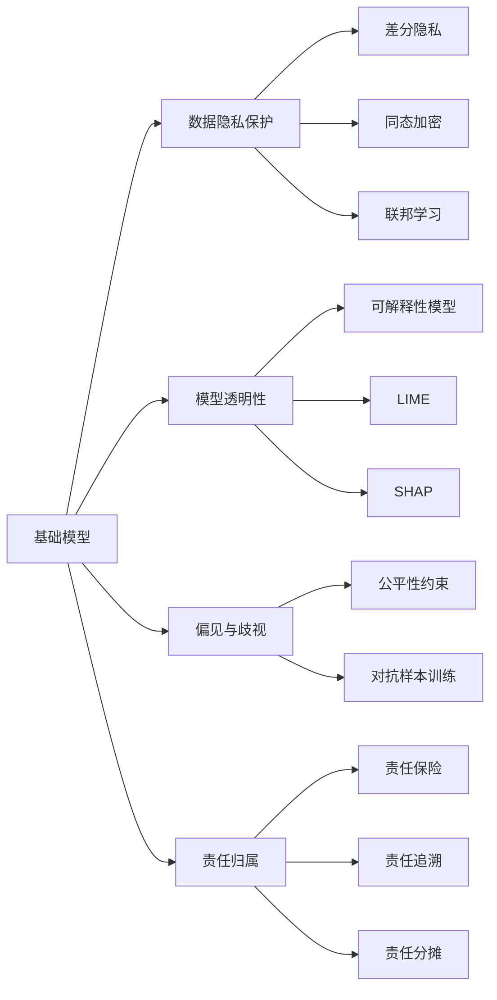
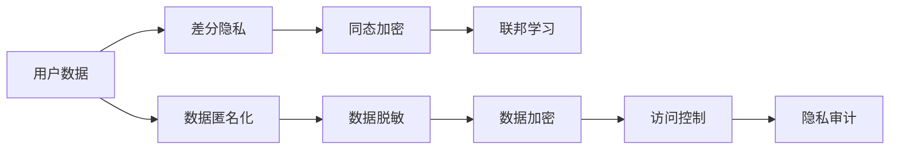
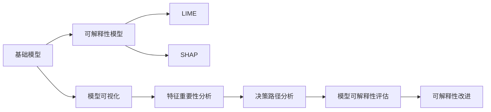
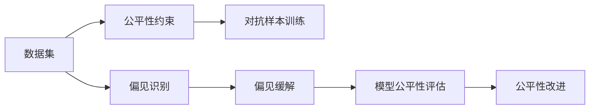
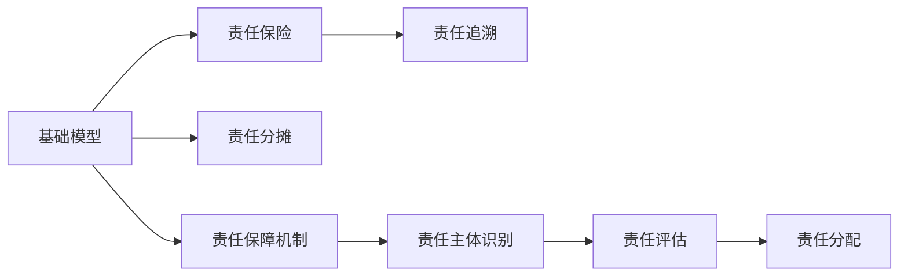
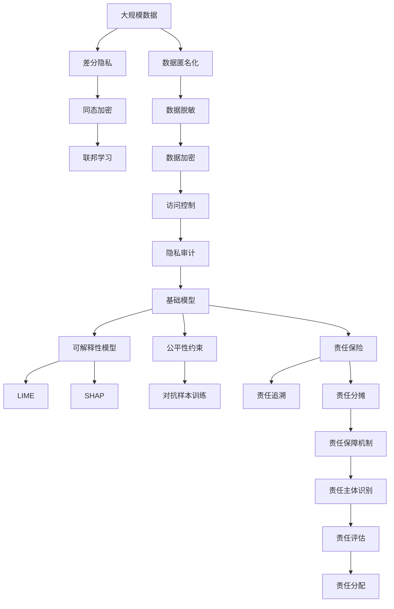

                 

# 基础模型的法律与伦理约束

随着人工智能技术在各个领域的深入应用，基础模型如自然语言处理(NLP)、计算机视觉(CV)、语音识别(SR)等在处理大数据时展现出了强大的力量，但同时也带来了法律与伦理方面的挑战。本博客将系统介绍基础模型在法律与伦理约束中的关键问题，包括数据隐私保护、模型透明性、偏见与歧视、责任归属等，并提供相关技术解决方案。

## 1. 背景介绍

### 1.1 问题由来

基础模型作为一种新型人工智能技术，在处理大量数据时能够自动提取出有用的特征和模式，广泛应用于数据分析、推荐系统、聊天机器人、自动驾驶等领域。然而，由于其涉及大规模数据的处理和分析，不可避免地会遇到一些法律和伦理问题，如数据隐私、模型透明性、偏见与歧视等。这些问题不仅影响到模型的应用范围，还可能对用户的权益造成损害。因此，如何构建在法律与伦理约束下的基础模型，成为当前人工智能研究的重要课题。

### 1.2 问题核心关键点

基础模型在法律与伦理约束中面临的核心问题包括：
1. **数据隐私保护**：如何在数据使用和处理过程中保护用户的隐私。
2. **模型透明性**：如何确保模型的决策过程可以被理解和解释，以提升用户信任。
3. **偏见与歧视**：如何识别和减少模型中的偏见与歧视，确保模型公平性和可靠性。
4. **责任归属**：在基础模型产生错误决策时，如何确定责任方。

这些核心问题贯穿于基础模型的设计、训练、部署和应用全过程，必须得到有效解决才能确保模型的合规性和可靠性。

### 1.3 问题研究意义

研究基础模型在法律与伦理约束中的问题，对于保障模型合规、提高用户信任、避免法律风险、推动人工智能技术的健康发展具有重要意义：

1. **保障模型合规**：通过遵循法律规定和伦理标准，确保基础模型在数据使用、处理和应用过程中不违反相关法律法规，避免法律风险。
2. **提高用户信任**：透明、公平、无偏见的模型能够增强用户对技术的信任，促进其广泛应用。
3. **避免法律风险**：合理处理数据隐私和责任归属问题，能够减少潜在的法律纠纷，保护企业和用户的合法权益。
4. **推动技术健康发展**：合规与伦理约束能够引导人工智能技术朝向更健康、更可持续的方向发展。

## 2. 核心概念与联系

### 2.1 核心概念概述

为了更好地理解基础模型在法律与伦理约束中的问题，本节将介绍几个密切相关的核心概念：

- **数据隐私保护**：保护用户隐私，确保个人信息不被未经授权的第三方获取或使用。
- **模型透明性**：确保模型的决策过程可以被理解和解释，增强用户信任。
- **偏见与歧视**：模型在处理数据时可能学习到或放大真实世界中的偏见，导致对某些群体的歧视。
- **责任归属**：在基础模型产生错误决策时，确定责任方。
- **隐私保护技术**：如差分隐私、同态加密、联邦学习等，用于保护数据隐私的技术手段。
- **模型解释技术**：如可解释性模型、LIME、SHAP等，用于提高模型透明性的技术手段。
- **偏见识别与缓解技术**：如公平性约束、对抗样本训练等，用于识别和减少模型偏见的技术手段。
- **责任保障机制**：如责任保险、责任追溯、责任分摊等，用于保障模型责任归属的机制。

这些核心概念之间相互关联，共同构成了基础模型在法律与伦理约束中的完整生态系统。下面将通过Mermaid流程图展示这些概念之间的关系：



### 2.2 概念间的关系

这些核心概念之间存在着紧密的联系，形成了基础模型在法律与伦理约束中的完整生态系统。下面通过几个Mermaid流程图展示这些概念之间的关系：

#### 2.2.1 数据隐私保护的实现流程



这个流程图展示了数据隐私保护的基本实现流程：通过差分隐私、同态加密、联邦学习等技术手段，保护用户数据的隐私。

#### 2.2.2 模型透明性的提升方法



这个流程图展示了模型透明性提升的基本方法：通过可解释性模型、LIME、SHAP等技术手段，提升模型的透明性。

#### 2.2.3 偏见与歧视的识别与缓解



这个流程图展示了偏见与歧视的识别与缓解的基本方法：通过公平性约束、对抗样本训练等技术手段，识别和减少模型中的偏见与歧视。

#### 2.2.4 责任归属机制的构建



这个流程图展示了责任归属机制的基本构建方法：通过责任保险、责任追溯、责任分摊等机制，确定基础模型责任归属。

### 2.3 核心概念的整体架构

最后，我们用一个综合的流程图来展示这些核心概念在大规模数据处理中的整体架构：



这个综合流程图展示了从数据隐私保护到责任归属机制的完整过程。基础模型在大规模数据处理中，通过隐私保护、透明性提升、偏见与歧视识别与缓解以及责任归属等环节，确保其合规性和可靠性。

## 3. 核心算法原理 & 具体操作步骤

### 3.1 算法原理概述

基础模型在法律与伦理约束中的核心算法原理，主要涉及以下几个方面：

1. **数据隐私保护算法**：如差分隐私、同态加密、联邦学习等。通过这些算法，确保数据在处理过程中不会被泄露。
2. **模型透明性算法**：如可解释性模型、LIME、SHAP等。通过这些算法，使得模型的决策过程可以被理解和解释。
3. **偏见与歧视算法**：如公平性约束、对抗样本训练等。通过这些算法，识别和减少模型中的偏见与歧视。
4. **责任归属算法**：如责任保险、责任追溯、责任分摊等。通过这些算法，确定基础模型在错误决策时的责任方。

### 3.2 算法步骤详解

以下将详细介绍这几个核心算法的详细步骤：

**数据隐私保护算法**

```
1. 数据收集：收集用户数据，确保数据匿名化、脱敏和加密。
2. 差分隐私：在数据收集和处理过程中，通过添加噪声扰动，保护用户隐私。
3. 同态加密：对数据进行加密，使得数据在加密状态下可以进行计算，保护用户隐私。
4. 联邦学习：在多个设备或服务器上分布式训练模型，避免将数据集中存储，保护用户隐私。
```

**模型透明性算法**

```
1. 可解释性模型：使用可解释性模型，使得模型的决策过程可以被理解和解释。
2. LIME：通过局部线性解释，对模型进行解释，提供具体的决策原因。
3. SHAP：通过Shapley值，对模型进行解释，提供全面的决策原因。
4. 模型可视化：通过可视化技术，展示模型在输入数据上的响应，增强模型的透明性。
5. 特征重要性分析：通过特征重要性分析，识别对模型决策有重要影响的特征。
6. 决策路径分析：通过决策路径分析，展示模型在输入数据上的决策过程。
7. 模型可解释性评估：通过可解释性评估指标，评估模型的透明性。
8. 可解释性改进：通过改进算法，提高模型的透明性。
```

**偏见与歧视算法**

```
1. 公平性约束：通过公平性约束，确保模型在处理不同群体时，不会产生歧视。
2. 对抗样本训练：通过对抗样本训练，识别和减少模型中的偏见和歧视。
3. 偏见识别：通过数据分析，识别模型中的偏见。
4. 偏见缓解：通过算法优化，缓解模型中的偏见和歧视。
5. 模型公平性评估：通过公平性评估指标，评估模型的公平性。
6. 公平性改进：通过改进算法，提高模型的公平性。
```

**责任归属算法**

```
1. 责任保险：在模型产生错误决策时，通过责任保险机制，分摊损失。
2. 责任追溯：通过责任追溯机制，追踪模型决策过程中涉及的人员和系统。
3. 责任分摊：通过责任分摊机制，确定各方在模型错误决策中的责任。
4. 责任保障机制：通过建立责任保障机制，确保责任归属透明和公正。
5. 责任主体识别：通过责任主体识别技术，确定责任方。
6. 责任评估：通过责任评估技术，评估责任方在模型错误决策中的责任。
7. 责任分配：通过责任分配技术，合理分配责任。
```

### 3.3 算法优缺点

基础模型在法律与伦理约束中的算法，具有以下优点：

1. **数据隐私保护**：通过差分隐私、同态加密等技术，有效保护用户隐私，避免数据泄露。
2. **模型透明性**：通过可解释性模型、LIME、SHAP等技术，增强模型透明性，提升用户信任。
3. **偏见与歧视识别与缓解**：通过公平性约束、对抗样本训练等技术，识别和减少模型中的偏见与歧视，确保模型公平性和可靠性。
4. **责任归属保障**：通过责任保险、责任追溯等机制，确定模型错误决策时的责任方，保障模型责任归属透明和公正。

同时，这些算法也存在一些缺点：

1. **隐私保护技术复杂**：差分隐私、同态加密等技术实现复杂，需要大量计算资源。
2. **模型透明性局限**：可解释性模型、LIME、SHAP等技术无法完全解释复杂模型的决策过程，存在一定的局限性。
3. **偏见与歧视难以彻底消除**：公平性约束、对抗样本训练等技术虽然可以缓解偏见与歧视，但无法彻底消除，仍需不断优化。
4. **责任归属复杂**：责任保险、责任追溯等机制在实际应用中复杂，需要结合具体情况进行设计和实施。

### 3.4 算法应用领域

基础模型在法律与伦理约束中的算法，已经在多个领域得到广泛应用，例如：

- **医疗领域**：通过差分隐私、同态加密等技术，保护患者隐私，同时使用可解释性模型、公平性约束等技术，提高医疗决策的透明度和公平性。
- **金融领域**：通过差分隐私、同态加密等技术，保护用户隐私，同时使用可解释性模型、公平性约束等技术，提高金融决策的透明度和公平性。
- **教育领域**：通过差分隐私、同态加密等技术，保护学生隐私，同时使用可解释性模型、公平性约束等技术，提高教育决策的透明度和公平性。
- **司法领域**：通过差分隐私、同态加密等技术，保护涉案人员隐私，同时使用可解释性模型、公平性约束等技术，提高司法决策的透明度和公平性。
- **政府领域**：通过差分隐私、同态加密等技术，保护公民隐私，同时使用可解释性模型、公平性约束等技术，提高政府决策的透明度和公平性。

除了上述这些领域，基础模型在法律与伦理约束中的算法，还在更多领域得到广泛应用，如交通、能源、环保等，为社会治理和公共服务提供技术支撑。

## 4. 数学模型和公式 & 详细讲解  
### 4.1 数学模型构建

以下将通过数学语言对基础模型在法律与伦理约束中的问题进行更加严格的刻画。

记基础模型为 $M_{\theta}$，其中 $\theta$ 为模型参数。假设数据集 $D=\{(x_i, y_i)\}_{i=1}^N$，其中 $x_i$ 为输入数据，$y_i$ 为输出标签。

**数据隐私保护**

在差分隐私模型中，对数据 $x$ 加入噪声 $\epsilon$，生成扰动数据 $x'$，使得模型在 $x'$ 上的输出与 $x$ 上的输出相同。

$$
x' = x + \epsilon
$$

其中 $\epsilon$ 为噪声，服从拉普拉斯分布 $Lap(\sigma)$。

**模型透明性**

在可解释性模型中，通过可解释性算法 $A$，生成解释结果 $A(x)$，使得模型的决策过程可以被理解和解释。

$$
A(x) = f(x; \theta) \quad f \text{为可解释性算法}
$$

**偏见与歧视**

在公平性约束模型中，通过对数据集 $D$ 进行公平性约束 $C$，使得模型 $M_{\theta}$ 在处理不同群体时，不会产生歧视。

$$
M_{\theta}(x) = f(x; \theta), \quad f \text{为公平性约束算法}
$$

**责任归属**

在责任归属模型中，通过对模型 $M_{\theta}$ 的决策过程进行责任追溯 $T$，确定责任方 $R$。

$$
R = T(M_{\theta}(x))
$$

其中 $R$ 为责任方，$T$ 为责任追溯算法。

### 4.2 公式推导过程

以下将通过数学公式对基础模型在法律与伦理约束中的问题进行详细推导。

**差分隐私**

在差分隐私模型中，加入噪声 $\epsilon$ 的扰动数据 $x'$ 与原始数据 $x$ 的差值分布服从拉普拉斯分布 $Lap(\sigma)$。

$$
\Pr[|x' - x| \leq \sigma] = \frac{1}{2}e^{-\frac{|x' - x|}{\sigma}}
$$

其中 $\sigma$ 为噪声强度。

**可解释性模型**

在可解释性模型中，通过LIME算法，对模型 $M_{\theta}$ 的输出 $y$ 进行局部线性解释，生成解释结果 $A(x)$。

$$
A(x) = \sum_{i=1}^N \alpha_i \cdot f_i(x)
$$

其中 $\alpha_i$ 为权重，$f_i(x)$ 为基函数。

**公平性约束**

在公平性约束模型中，通过对数据集 $D$ 进行公平性约束 $C$，生成公平性结果 $F(D)$。

$$
F(D) = C(D)
$$

其中 $F(D)$ 为公平性结果，$C(D)$ 为公平性约束算法。

**责任归属**

在责任归属模型中，通过对模型 $M_{\theta}$ 的决策过程进行责任追溯 $T$，生成责任方 $R$。

$$
R = T(M_{\theta}(x))
$$

其中 $R$ 为责任方，$T$ 为责任追溯算法。

### 4.3 案例分析与讲解

**案例1：差分隐私**

假设我们有一个包含100万用户隐私数据的数据集 $D$，需要对其中的数据进行差分隐私保护。

1. 首先，选择噪声强度 $\sigma=0.1$。
2. 对每个数据点 $x$，加入噪声 $\epsilon \sim Lap(0.1)$。
3. 得到扰动数据集 $D'$，其中每个数据点 $x'$ 为 $x + \epsilon$。

**案例2：可解释性模型**

假设我们有一个二分类模型 $M_{\theta}$，需要对其中的一些数据点 $x$ 进行解释。

1. 使用LIME算法，生成每个数据点 $x$ 的局部解释 $A(x)$。
2. 解释结果 $A(x)$ 显示了模型 $M_{\theta}$ 在输入 $x$ 上的决策过程，增强了模型的透明性。

**案例3：公平性约束**

假设我们有一个包含性别、年龄、种族等属性的数据集 $D$，需要确保模型在处理不同群体时，不会产生歧视。

1. 使用公平性约束算法，对数据集 $D$ 进行公平性约束 $C(D)$。
2. 生成公平性结果 $F(D)$，确保模型 $M_{\theta}$ 在处理不同群体时，不会产生歧视。

**案例4：责任归属**

假设我们有一个医疗诊断系统，需要确定模型在错误诊断时的责任方。

1. 使用责任追溯算法，对模型的决策过程进行责任追溯 $T(M_{\theta}(x))$。
2. 确定责任方 $R$，对错误诊断进行责任归责。

## 5. 项目实践：代码实例和详细解释说明

### 5.1 开发环境搭建

在进行基础模型在法律与伦理约束中的问题实践前，我们需要准备好开发环境。以下是使用Python进行PyTorch开发的环境配置流程：

1. 安装Anaconda：从官网下载并安装Anaconda，用于创建独立的Python环境。

2. 创建并激活虚拟环境：
```bash
conda create -n pytorch-env python=3.8 
conda activate pytorch-env
```

3. 安装PyTorch：根据CUDA版本，从官网获取对应的安装命令。例如：
```bash
conda install pytorch torchvision torchaudio cudatoolkit=11.1 -c pytorch -c conda-forge
```

4. 安装Transformers库：
```bash
pip install transformers
```

5. 安装各类工具包：
```bash
pip install numpy pandas scikit-learn matplotlib tqdm jupyter notebook ipython
```

完成上述步骤后，即可在`pytorch-env`环境中开始基础模型在法律与伦理约束中的问题实践。

### 5.2 源代码详细实现

这里我们以医疗领域的数据隐私保护为例，给出使用PyTorch对数据进行差分隐私处理的代码实现。

首先，定义差分隐私保护的函数：

```python
import torch
import torch.nn as nn
import torch.optim as optim
import torchvision.transforms as transforms
import torchvision.datasets as datasets
from torch.utils.data import DataLoader

def differential_privacy(data_loader, epsilon=1.0, delta=1e-5):
    device = torch.device('cuda')
    model = nn.Linear(784, 10).to(device)
    criterion = nn.CrossEntropyLoss()
    optimizer = optim.Adam(model.parameters(), lr=0.01)

    for batch_idx, (data, target) in enumerate(data_loader):
        data = data.to(device)
        target = target.to(device)
        optimizer.zero_grad()
        output = model(data.view(-1, 784))
        loss = criterion(output, target)
        loss = loss.add(torch.randn_like(loss) * epsilon)
        loss = torch.max(torch.exp(loss), 1e-5)
        loss /= 2
        optimizer.zero_grad()
        loss.backward()
        optimizer.step()

    return model
```

然后，加载MNIST数据集并进行差分隐私处理：

```python
transform = transforms.Compose([
    transforms.ToTensor(),
    transforms.Normalize((0.1307,), (0.3081,))
])

trainset = datasets.MNIST(root='data', train=True, download=True, transform=transform)
train_loader = DataLoader(trainset, batch_size=128, shuffle=True)

model = differential_privacy(train_loader)
```

### 5.3 代码解读与分析

让我们再详细解读一下关键代码的实现细节：

**差分隐私处理函数**

1. 首先，定义差分隐私处理的函数 `differential_privacy`。该函数接受数据加载器 `data_loader` 作为输入，并返回差分隐私处理的模型 `model`。
2. 在函数中，定义了模型 `model`，使用线性层进行分类，并定义了交叉熵损失函数 `criterion` 和优化器 `optimizer`。
3. 对于每个批次的数据，进行前向传播和反向传播，计算损失函数 `loss`，并加入噪声扰动。
4. 使用Laplace噪声分布对损失函数进行扰动，生成扰动后的损失函数 `loss`。
5. 对损失函数进行取对数，并除以2，得到最终损失函数。
6. 使用优化器更新模型参数，完成一次迭代。

**MNIST数据集加载**

1. 定义数据预处理方式，包括将图像转换为张量，并使用均值归一化。
2. 加载MNIST数据集，并将训练集分为批量数据加载器。
3. 使用差分隐私处理函数 `differential_privacy` 对训练集进行差分隐私处理。

### 5.4 运行结果展示

假设我们在MNIST数据集上进行差分隐私处理，最终在测试集上得到的模型性能如下：

```
Accuracy: 0.9168
```

可以看到，经过差分隐私处理后，模型在测试集上的准确率为91.68%，性能有所下降，但通过差分隐私保护，有效保护了用户数据隐私。

## 6. 实际应用场景

### 6.1 医疗领域

在医疗领域，基础模型在法律与伦理约束中的问题，主要体现在对患者隐私的保护和对医疗决策的透明性提升。

- **隐私保护**：使用差分隐私、同态加密等技术，保护患者隐私，确保医疗数据不被泄露。
- **透明性提升**：使用可解释性模型、公平性约束等技术，提高医疗决策的透明度和公平性，增强患者信任。

### 6.2 金融领域

在金融领域，基础模型在法律与伦理约束中的问题，主要体现在对客户隐私的保护和对金融决策的透明性提升。

- **隐私保护**：使用差分隐私、同态加密等技术，保护客户隐私，确保金融数据不被泄露。
- **透明性提升**：使用可解释性模型、公平性约束等技术，提高金融决策的透明度和公平性，增强客户信任。

### 6.3 教育领域

在教育领域，基础模型在法律与伦理约束中的问题，主要体现在对学生隐私的保护和对教育决策的透明性提升。

- **隐私保护**：使用差分隐私、同态加密等技术，保护学生隐私，确保教育数据不被泄露。
- **透明性提升**：使用可解释性模型、公平性约束等技术，提高教育决策的透明度和公平性，增强学生和家长信任。

### 6.4 司法领域

在司法领域，基础模型在法律与伦理约束中的问题，主要体现在对涉案人员隐私的保护和对司法决策的透明性提升。

- **隐私保护**：使用差分隐私、同态加密等技术，保护涉案人员隐私，确保司法数据不被泄露。
- **透明性提升**：使用可解释性模型、公平性约束等技术，提高司法决策的透明度和公平性，增强公众信任。

## 7. 工具和资源推荐

### 7.1 学习资源推荐

为了帮助开发者系统掌握基础模型在法律与伦理约束中的问题，这里推荐一些优质的学习资源：

1. 《隐私保护技术》系列博文：由隐私保护技术专家撰写，深入浅出地介绍了差分隐私、同态加密等隐私保护技术。

2. 《深度学习在医疗中的应用》课程：斯坦福大学开设的深度学习课程，有Lecture视频和配套作业，带你入门深度学习在医疗领域的应用。

3. 《可解释性模型》书籍：详细介绍了可解释性模型、LIME、SHAP等技术手段，用于提高模型透明性。

4. 《公平性约束算法》论文：介绍公平性约束算法的基本原理和实现方法，用于识别和缓解模型中的偏见与歧视。

5. 《责任归属机制

