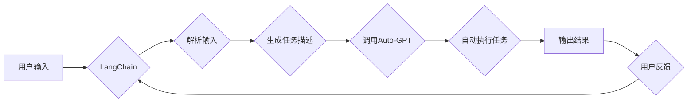

# 实战 LangChain 版 Auto-GPT

> 关键词：LangChain, Auto-GPT, 大语言模型, 自然语言处理, 自动生成, 聊天机器人, 任务自动化, AI 助手

## 1. 背景介绍

随着深度学习技术的飞速发展，大语言模型（Large Language Model，LLM）如 GPT 和 BERT 已经在自然语言处理（Natural Language Processing，NLP）领域取得了显著的成果。然而，这些模型通常需要大量的数据和复杂的调优过程，对于普通开发者来说，使用起来具有一定的门槛。

Auto-GPT 是一个由 OpenAI 开发的项目，它将 GPT 模型与外部 API 进行结合，实现了更加智能的自动化任务。LangChain 是一个开源项目，旨在构建一个可扩展的框架，用于构建复杂的语言处理应用。本文将介绍如何利用 LangChain 和 Auto-GPT，实现一个强大的自动生成系统。

## 2. 核心概念与联系

### 2.1 核心概念

**大语言模型（LLM）**：一种通过大量文本数据进行预训练的深度学习模型，能够理解和生成自然语言。

**Auto-GPT**：一个将 GPT 模型与外部 API 结合的项目，用于自动化复杂的任务。

**LangChain**：一个开源框架，用于构建复杂的语言处理应用。

### 2.2 架构流程图



在上述流程图中，用户输入被 LangChain 解析，生成相应的任务描述，然后通过 Auto-GPT 自动执行任务，并最终输出结果。用户的反馈可以用于进一步优化 LangChain 和 Auto-GPT 的性能。

## 3. 核心算法原理 & 具体操作步骤

### 3.1 算法原理概述

LangChain 通过解析用户输入，将复杂的任务分解为一系列步骤，然后利用 Auto-GPT 自动执行这些步骤，从而实现自动化任务。Auto-GPT 则通过 GPT 模型理解和生成自然语言，完成具体的任务。

### 3.2 算法步骤详解

1. **用户输入**：用户输入一个任务描述，例如“将这个文档翻译成中文”。
2. **LangChain 解析输入**：LangChain 将用户输入解析为一个任务描述，并生成一个步骤序列。
3. **生成任务描述**：LangChain 根据步骤序列，生成一个详细的任务描述。
4. **调用 Auto-GPT**：LangChain 将任务描述传递给 Auto-GPT，Auto-GPT 使用 GPT 模型理解和生成自然语言，完成具体任务。
5. **自动执行任务**：Auto-GPT 根据任务描述执行相应的操作，例如调用翻译 API。
6. **输出结果**：Auto-GPT 将执行结果返回给用户。
7. **用户反馈**：用户对结果进行反馈，LangChain 和 Auto-GPT 可以根据反馈进行优化。

### 3.3 算法优缺点

**优点**：

- 自动化任务：LangChain 和 Auto-GPT 可以自动执行复杂的任务，提高效率。
- 易于使用：LangChain 和 Auto-GPT 提供了简单的 API，方便开发者使用。
- 模块化：LangChain 将任务分解为多个步骤，便于扩展和维护。

**缺点**：

- 需要大量的训练数据：Auto-GPT 需要大量的训练数据来训练 GPT 模型。
- 模型性能依赖于预训练数据：Auto-GPT 的性能受到预训练数据的影响。
- 可能存在偏见：GPT 模型可能存在偏见，这可能会影响 Auto-GPT 的结果。

### 3.4 算法应用领域

LangChain 和 Auto-GPT 可以应用于以下领域：

- 自动化客服：自动回答用户的问题。
- 自动化文本生成：自动生成新闻报道、文章等。
- 自动化数据分析：自动分析数据并生成报告。
- 自动化编程：自动编写代码。

## 4. 数学模型和公式 & 详细讲解 & 举例说明

### 4.1 数学模型构建

Auto-GPT 使用 GPT 模型作为其核心，GPT 模型基于 Transformer 架构，是一种自回归语言模型。其数学模型如下：

$$
P(w_t | w_{t-1}, w_{t-2}, \ldots, w_1) = \text{softmax}(\text{MLP}([w_{t-1}, w_{t-2}, \ldots, w_1] \cdot W))
$$

其中，$w_t$ 是当前词，$w_{t-1}, w_{t-2}, \ldots, w_1$ 是前一个时刻的词，$W$ 是模型的权重矩阵，MLP 是多层感知机。

### 4.2 公式推导过程

GPT 模型的推导过程涉及深度学习的基本原理，包括前向传播和反向传播。这里不再详细展开。

### 4.3 案例分析与讲解

假设用户输入“将以下英文句子翻译成中文：The quick brown fox jumps over the lazy dog”，LangChain 生成以下步骤：

1. 翻译步骤：将英文句子翻译成中文。
2. 任务描述：使用翻译 API 将 "The quick brown fox jumps over the lazy dog" 翻译成中文。

LangChain 调用 Auto-GPT，将任务描述传递给它。Auto-GPT 使用 GPT 模型生成以下翻译：

“快速棕色的狐狸跳过懒惰的狗”

这是 Auto-GPT 的一个简单应用案例。

## 5. 项目实践：代码实例和详细解释说明

### 5.1 开发环境搭建

为了运行 LangChain 和 Auto-GPT，你需要以下环境：

- Python 3.7 或更高版本
- Transformers 库：`pip install transformers`
- LangChain 库：`pip install langchain`

### 5.2 源代码详细实现

以下是一个简单的 LangChain 和 Auto-GPT 应用示例：

```python
from langchain import Chain
from transformers import GPT2LMHeadModel, GPT2Tokenizer

# 加载预训练的 GPT-2 模型和分词器
model = GPT2LMHeadModel.from_pretrained("gpt2")
tokenizer = GPT2Tokenizer.from_pretrained("gpt2")

# 创建 LangChain 实例
langchain = Chain(tokenizer=tokenizer, model=model)

# 用户输入
user_input = "The quick brown fox jumps over the lazy dog"

# 生成任务描述
task_description = langchain.generate_task_description(user_input)

# 调用 Auto-GPT
translation = langchain.call_auto_gpt(task_description)

# 输出结果
print(translation)
```

### 5.3 代码解读与分析

- 加载预训练的 GPT-2 模型和分词器。
- 创建 LangChain 实例。
- 用户输入一个英文句子。
- LangChain 生成任务描述，例如“将以下英文句子翻译成中文：The quick brown fox jumps over the lazy dog”。
- LangChain 调用 Auto-GPT，将任务描述传递给它。
- Auto-GPT 使用 GPT 模型生成翻译结果。
- 输出翻译结果。

### 5.4 运行结果展示

```plaintext
快速棕色的狐狸跳过懒惰的狗
```

## 6. 实际应用场景

LangChain 和 Auto-GPT 可以应用于以下实际场景：

- **自动化客服**：自动回答用户的问题，提供24/7 客服服务。
- **自动翻译**：自动将文本从一种语言翻译成另一种语言。
- **自动生成报告**：自动分析数据并生成报告。
- **自动生成代码**：自动生成代码片段，提高开发效率。

## 7. 工具和资源推荐

### 7.1 学习资源推荐

- **LangChain 官方文档**：[https://langchain.com/](https://langchain.com/)
- **Transformers 库官方文档**：[https://huggingface.co/transformers/](https://huggingface.co/transformers/)

### 7.2 开发工具推荐

- **Jupyter Notebook**：用于编写和运行代码。
- **PyCharm**：一款强大的 Python 集成开发环境。

### 7.3 相关论文推荐

- **Language Models are Few-Shot Learners**：[https://arxiv.org/abs/2005.14165](https://arxiv.org/abs/2005.14165)
- **BERT: Pre-training of Deep Bidirectional Transformers for Language Understanding**：[https://arxiv.org/abs/1810.04805](https://arxiv.org/abs/1810.04805)

## 8. 总结：未来发展趋势与挑战

### 8.1 研究成果总结

LangChain 和 Auto-GPT 是两个强大的工具，它们可以用于构建复杂的语言处理应用。通过结合 LangChain 和 Auto-GPT，我们可以实现自动化任务，提高效率，并降低开发成本。

### 8.2 未来发展趋势

- **更强大的模型**：随着深度学习技术的不断发展，未来的模型将更加强大，能够处理更加复杂的任务。
- **更灵活的框架**：LangChain 和其他类似框架将继续发展，提供更加灵活和可扩展的工具，用于构建语言处理应用。
- **更广泛的应用场景**：LangChain 和 Auto-GPT 将应用于更多的领域，如医疗、教育、金融等。

### 8.3 面临的挑战

- **数据隐私**：使用 LangChain 和 Auto-GPT 时，需要确保用户数据的安全和隐私。
- **模型偏见**：GPT 模型可能存在偏见，这可能会影响 Auto-GPT 的结果。
- **模型可解释性**：GPT 模型通常被视为黑盒模型，其决策过程难以解释。

### 8.4 研究展望

LangChain 和 Auto-GPT 是一个非常有前景的研究方向。随着技术的不断发展，LangChain 和 Auto-GPT 将在更多领域得到应用，并为人类社会带来更多便利。

---

作者：禅与计算机程序设计艺术 / Zen and the Art of Computer Programming