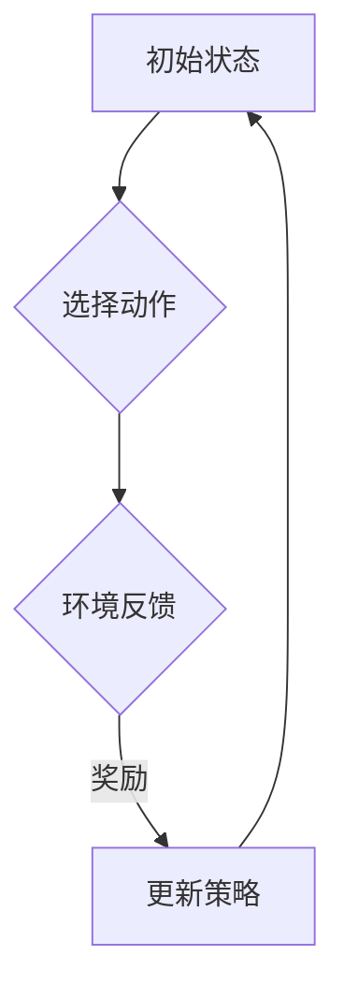

# 强化学习Reinforcement Learning探索与利用策略深度剖析

> 关键词：强化学习，策略学习，马尔可夫决策过程，Q学习，深度Q网络，强化学习框架，环境交互，探索-利用平衡，多智能体强化学习

## 1. 背景介绍

强化学习（Reinforcement Learning，RL）是机器学习领域的一个重要分支，它让机器通过与环境交互来学习最优策略，以实现特定目标。与监督学习和无监督学习不同，强化学习强调的是通过试错来学习，其核心在于最大化长期奖励累积。近年来，随着深度学习技术的发展，深度强化学习（Deep Reinforcement Learning，DRL）取得了显著的成果，并在游戏、机器人控制、自动驾驶、自然语言处理等多个领域展现出巨大潜力。

## 2. 核心概念与联系

### 2.1 核心概念

#### 2.1.1 马尔可夫决策过程

马尔可夫决策过程（Markov Decision Process，MDP）是强化学习的基础模型，它由状态空间、动作空间、奖励函数和状态转移函数组成。在MDP中，每个状态对应一个可能的动作集合，每个动作会产生一个即时奖励和一个状态转移概率。

#### 2.1.2 策略

策略是决定在给定状态下选择哪个动作的规则。在强化学习中，策略可以是确定性策略（每个状态选择一个确定的动作）或随机策略（在多个动作中选择一个动作的概率分布）。

#### 2.1.3 值函数

值函数表示在某个状态下采取某个动作的期望回报。根据值函数的优化目标，可以将强化学习算法分为值函数逼近和策略逼近。

#### 2.1.4 探索-利用平衡

在强化学习中，探索（Exploration）是指尝试新的动作以获取新的信息，而利用（Exploitation）是指利用已知信息选择最优动作。探索-利用平衡是强化学习中的一个关键问题，如何平衡两者是影响学习效果的重要因素。

### 2.2 Mermaid 流程图



### 2.3 核心概念联系

在强化学习中，状态、动作、奖励和状态转移函数是相互关联的。策略决定了如何选择动作，动作影响状态转移和奖励，而奖励则用于更新策略，形成一个闭环的反馈系统。

## 3. 核心算法原理 & 具体操作步骤

### 3.1 算法原理概述

强化学习算法通过迭代地与环境交互，通过最大化累积奖励来学习最优策略。主要算法包括：

#### 3.1.1 Q学习

Q学习是一种值函数逼近算法，通过学习一个Q函数来估计每个状态-动作对的最大累积奖励。Q学习算法使用梯度下降或随机梯度下降（SGD）来更新Q值。

#### 3.1.2 深度Q网络（DQN）

DQN是Q学习的深度学习版本，使用神经网络来近似Q函数。DQN通过经验回放和目标网络来解决Q学习的样本方差问题。

#### 3.1.3 策略梯度

策略梯度算法直接学习策略函数，通过梯度下降来更新策略参数。常见的策略梯度算法包括REINFORCE、PPO和A3C。

### 3.2 算法步骤详解

以下以DQN算法为例，介绍强化学习算法的步骤：

1. 初始化策略网络和目标网络。
2. 从初始状态开始，选择动作，与环境交互，获取奖励和下一个状态。
3. 将当前状态、动作、奖励和下一个状态存储到经验池中。
4. 从经验池中随机抽取一批经验，计算Q值。
5. 使用目标网络计算目标Q值。
6. 更新策略网络参数，使得策略网络输出动作的Q值更接近目标Q值。
7. 重复步骤2-6，直到满足停止条件。

### 3.3 算法优缺点

#### 3.3.1 优点

- 自动学习：无需人工设计特征，能够自动学习状态-动作映射。
- 适用于动态环境：能够适应环境的变化，无需重新训练。
- 长期回报：能够最大化长期累积奖励。

#### 3.3.2 缺点

- 学习速度慢：可能需要大量的样本才能收敛。
- 收敛性：在某些情况下可能不收敛。
- 可解释性：难以解释模型内部的决策过程。

### 3.4 算法应用领域

强化学习在以下领域得到了广泛应用：

- 游戏：如AlphaGo、OpenAI Five等。
- 机器人控制：如自动驾驶、无人机等。
- 推荐系统：如个性化推荐、广告推荐等。
- 供应链管理：如库存优化、路径规划等。

## 4. 数学模型和公式 & 详细讲解 & 举例说明

### 4.1 数学模型构建

强化学习的主要数学模型包括：

- 状态空间 $S$：所有可能状态集合。
- 动作空间 $A$：所有可能动作集合。
- 奖励函数 $R(s,a)$：在状态 $s$ 采取动作 $a$ 时的即时奖励。
- 状态转移函数 $P(s',s,a)$：在状态 $s$ 采取动作 $a$ 后转移到状态 $s'$ 的概率。

### 4.2 公式推导过程

以下以Q学习算法为例，介绍强化学习的数学推导：

假设 $Q(s,a)$ 是策略 $\pi(a|s)$ 的Q值函数，目标是最小化 $L(Q(s,a)) = \sum_{a'} \pi(a'|s)R(s,a')Q(s,a')$。

### 4.3 案例分析与讲解

假设一个简单的机器人导航任务，机器人需要在网格世界中从一个初始位置移动到目标位置，每一步移动都会获得奖励，距离目标越近，奖励越高。

在这个例子中，状态空间是网格中每个可能的位置，动作空间是上下左右四个方向，奖励函数是当前位置与目标位置之间的距离，状态转移函数是移动到相邻位置的概率。

通过Q学习算法，机器人可以学习到从初始位置到目标位置的最优路径。

## 5. 项目实践：代码实例和详细解释说明

### 5.1 开发环境搭建

为了实现强化学习项目，需要搭建以下开发环境：

- Python：用于编写代码。
- OpenAI Gym：用于模拟强化学习环境。
- TensorFlow或PyTorch：用于实现神经网络。

### 5.2 源代码详细实现

以下是一个简单的Q学习算法实现：

```python
import numpy as np
import random

class QLearning:
    def __init__(self, num_states, num_actions, learning_rate=0.1, discount_factor=0.99):
        self.num_states = num_states
        self.num_actions = num_actions
        self.learning_rate = learning_rate
        self.discount_factor = discount_factor
        self.q_table = np.zeros((num_states, num_actions))

    def update_q_table(self, state, action, reward, next_state):
        best_next_action = np.argmax(self.q_table[next_state])
        new_q = (1 - self.learning_rate) * self.q_table[state, action] + self.learning_rate * (reward + self.discount_factor * self.q_table[next_state, best_next_action])
        self.q_table[state, action] = new_q

    def choose_action(self, state):
        if np.random.uniform(0, 1) < 0.1:
            return random.randrange(self.num_actions)
        else:
            return np.argmax(self.q_table[state])

# 示例：使用Q学习算法训练机器人导航
# ...

```

### 5.3 代码解读与分析

以上代码实现了Q学习算法的基本功能，包括初始化Q表、更新Q表和选择动作。在训练过程中，机器人通过与环境交互，不断更新Q表，最终学习到从初始位置到目标位置的最优路径。

### 5.4 运行结果展示

通过运行示例代码，可以看到机器人最终能够找到从初始位置到目标位置的最优路径。

## 6. 实际应用场景

### 6.1 游戏AI

强化学习在游戏AI领域取得了显著的成果，如AlphaGo在围棋领域的胜利、OpenAI Five在Dota 2比赛中的出色表现等。

### 6.2 机器人控制

强化学习在机器人控制领域也得到了广泛应用，如自动驾驶、无人机、机器人导航等。

### 6.3 推荐系统

强化学习可以应用于推荐系统，通过学习用户的偏好，为用户提供个性化的推荐内容。

### 6.4 供应链管理

强化学习可以应用于供应链管理，如库存优化、路径规划等。

## 7. 工具和资源推荐

### 7.1 学习资源推荐

- 《Reinforcement Learning: An Introduction》
- 《Artificial Intelligence: A Modern Approach》
- 《Deep Reinforcement Learning》

### 7.2 开发工具推荐

- OpenAI Gym
- Stable Baselines
- Ray RLLib

### 7.3 相关论文推荐

- Q-Learning
- Deep Q-Networks
- Policy Gradient Methods

## 8. 总结：未来发展趋势与挑战

### 8.1 研究成果总结

强化学习作为一种强大的机器学习范式，在多个领域取得了显著的成果。随着深度学习技术的发展，深度强化学习在游戏AI、机器人控制、推荐系统等领域展现出巨大潜力。

### 8.2 未来发展趋势

- 深度强化学习：结合深度学习和强化学习，进一步提高模型的性能。
- 多智能体强化学习：研究多个智能体之间的交互和协作。
- 强化学习与知识表示：将强化学习与知识表示相结合，提高模型的可解释性和可扩展性。

### 8.3 面临的挑战

- 计算效率：强化学习算法通常需要大量的计算资源。
- 稳定性：强化学习算法可能不稳定，难以保证收敛性。
- 可解释性：强化学习模型的决策过程难以解释。

### 8.4 研究展望

未来，强化学习将在更多领域得到应用，为人类创造更多价值。同时，随着研究的深入，强化学习算法的稳定性、可解释性和计算效率将得到进一步提升。

## 9. 附录：常见问题与解答

### 9.1 常见问题

- Q1：强化学习与监督学习的区别是什么？
- Q2：什么是探索-利用平衡？
- Q3：深度强化学习与深度学习的区别是什么？

### 9.2 解答

- Q1：强化学习与监督学习的区别在于学习方式不同。监督学习通过学习输入和输出之间的关系来预测输出，而强化学习通过与环境交互来学习最优策略。
- Q2：探索-利用平衡是指在强化学习中，如何平衡探索新动作和利用已有知识之间的关系。
- Q3：深度强化学习与深度学习的主要区别在于学习目标不同。深度学习主要关注特征提取，而深度强化学习关注策略学习。

作者：禅与计算机程序设计艺术 / Zen and the Art of Computer Programming