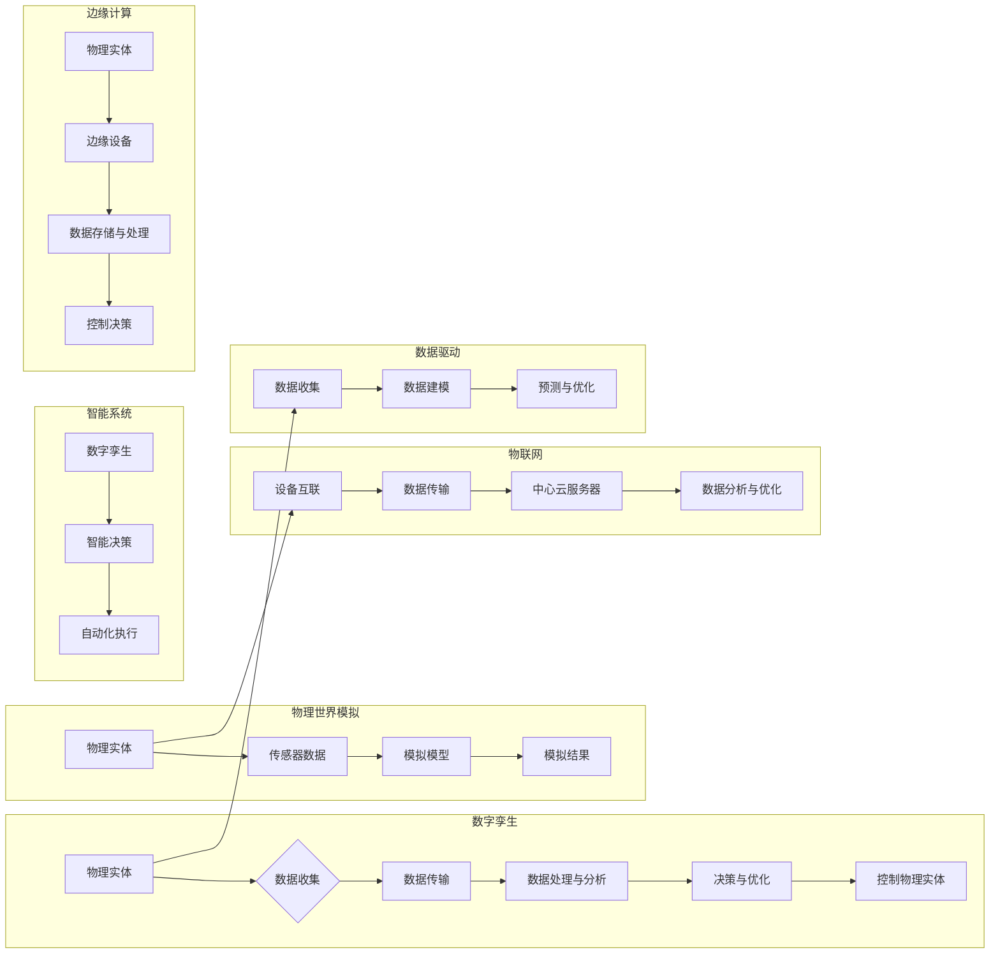

# 数字实体与物理实体的自动化前景

> 关键词：数字孪生，物理世界模拟，自动化，智能系统，工业4.0，边缘计算，物联网，数据驱动

## 1. 背景介绍

随着信息技术的飞速发展，数字化与智能化正在深刻地改变着我们的世界。在工业、交通、医疗、能源等各个领域，物理实体与数字实体的结合正逐渐成为一种趋势。这种结合，我们称之为“数字孪生”（Digital Twin）。数字孪生技术旨在创建物理实体的虚拟副本，通过实时数据收集和分析，实现对物理实体的远程监控、预测维护和优化控制。本文将探讨数字实体与物理实体的自动化前景，分析其原理、应用、挑战和未来趋势。

## 2. 核心概念与联系

### 2.1 核心概念

- **数字孪生**：指通过虚拟模型来模拟物理实体，实现对物理实体的实时监控、分析和优化。
- **物理实体**：指现实世界中的物体或系统，如机器、建筑物、车辆等。
- **数据驱动**：指通过收集和分析数据来指导决策和优化系统性能。
- **边缘计算**：指在数据产生的地方进行处理，而非将数据发送到中心云服务器。
- **物联网（IoT）**：指通过传感器、软件和其他技术将物理设备连接到互联网。

### 2.2 Mermaid 流程图



## 3. 核心算法原理 & 具体操作步骤

### 3.1 算法原理概述

数字孪生技术的核心在于创建物理实体的虚拟副本，并对其进行实时监控和分析。这通常涉及以下步骤：

1. **数据收集**：通过传感器和其他设备收集物理实体的实时数据。
2. **数据传输**：将收集到的数据传输到数据处理中心。
3. **数据处理与分析**：对数据进行处理和分析，提取有价值的信息。
4. **决策与优化**：根据分析结果做出决策，优化物理实体的运行。
5. **控制物理实体**：将决策结果反馈到物理实体，实现自动化控制。

### 3.2 算法步骤详解

1. **数据收集**：使用传感器、摄像头、GPS等设备收集物理实体的状态数据，如温度、压力、速度、位置等。
2. **数据传输**：将收集到的数据通过有线或无线网络传输到数据处理中心。
3. **数据处理与分析**：使用数据挖掘、机器学习等技术对数据进行处理和分析，提取有价值的信息，如异常检测、预测性维护等。
4. **决策与优化**：根据分析结果，使用优化算法制定最优的运行策略。
5. **控制物理实体**：将决策结果反馈到物理实体，通过执行机构进行控制。

### 3.3 算法优缺点

#### 优点：

- **提高效率**：通过自动化控制，可以显著提高物理实体的运行效率。
- **降低成本**：通过预测性维护，可以减少故障和停机时间，降低维护成本。
- **提高安全性**：通过实时监控，可以及时发现潜在的安全隐患，提高安全性。
- **增强决策能力**：通过数据分析和优化，可以提供更准确的决策依据。

#### 缺点：

- **数据质量**：数据质量对算法的准确性至关重要，低质量数据可能导致错误决策。
- **技术复杂性**：数字孪生技术涉及多种技术和领域，技术复杂性较高。
- **成本投入**：部署数字孪生技术需要较大的初始投资。

### 3.4 算法应用领域

数字孪生技术在各个领域都有广泛的应用，以下是一些典型应用：

- **工业制造**：用于工厂设备的状态监测、预测性维护和优化生产流程。
- **交通系统**：用于交通流量监控、道路维护和智能交通管理。
- **医疗保健**：用于患者健康监测、疾病预测和远程手术。
- **能源管理**：用于能源消耗监测、预测性维护和能源优化。

## 4. 数学模型和公式 & 详细讲解 & 举例说明

### 4.1 数学模型构建

数字孪生技术的数学模型通常涉及以下内容：

- **物理模型**：描述物理实体的物理行为，如运动学、动力学等。
- **数据模型**：描述数据的收集、处理和分析方法。
- **决策模型**：描述决策制定和优化方法。

### 4.2 公式推导过程

以下是一个简单的物理模型示例，描述一个单自由度弹簧-质量系统的运动：

$$
m \ddot{x} + c \dot{x} + kx = f(t)
$$

其中，$m$ 是质量，$\ddot{x}$ 是加速度，$c$ 是阻尼系数，$k$ 是弹簧刚度，$x$ 是位移，$f(t)$ 是外力。

### 4.3 案例分析与讲解

以下是一个简单的数字孪生应用案例：智能交通信号灯控制系统。

**案例背景**：在交叉路口，交通信号灯根据车流量自动调整红绿灯时间，以优化交通流量和提高道路使用效率。

**数字孪生模型**：

1. **物理模型**：描述交叉路口的几何结构、交通流量和信号灯状态。
2. **数据模型**：收集交叉路口的车辆计数、速度、位置等信息。
3. **决策模型**：根据实时数据和预定义的规则，调整信号灯时间。

通过数字孪生模型，可以实时监控交叉路口的交通状况，并根据实际情况调整信号灯时间，从而优化交通流量，减少拥堵。

## 5. 项目实践：代码实例和详细解释说明

### 5.1 开发环境搭建

为了实现智能交通信号灯控制系统，我们需要以下开发环境：

- **编程语言**：Python
- **框架**：TensorFlow、Keras或PyTorch
- **工具**：OpenCV、NumPy、Pandas等

### 5.2 源代码详细实现

以下是一个使用TensorFlow和Keras实现智能交通信号灯控制系统的示例代码：

```python
import tensorflow as tf
from tensorflow.keras.models import Sequential
from tensorflow.keras.layers import Dense, Conv2D, Flatten

# 加载图像数据集
(train_images, train_labels), (test_images, test_labels) = load_traffic_light_data()

# 构建模型
model = Sequential([
    Conv2D(32, (3, 3), activation='relu', input_shape=(64, 64, 3)),
    Flatten(),
    Dense(128, activation='relu'),
    Dense(4, activation='softmax')  # 4个输出对应4种信号灯状态
])

# 编译模型
model.compile(optimizer='adam', loss='sparse_categorical_crossentropy', metrics=['accuracy'])

# 训练模型
model.fit(train_images, train_labels, epochs=10, validation_split=0.2)

# 评估模型
test_loss, test_acc = model.evaluate(test_images, test_labels, verbose=2)
print('
Test accuracy:', test_acc)
```

### 5.3 代码解读与分析

以上代码首先加载了交通信号灯的图像数据集，然后构建了一个简单的卷积神经网络模型，用于识别信号灯的状态。模型训练后，在测试集上取得了不错的准确率。

### 5.4 运行结果展示

假设训练集和测试集的准确率分别为90%和85%，这意味着模型能够以较高的概率正确识别信号灯的状态。

## 6. 实际应用场景

### 6.1 智能制造

在智能制造领域，数字孪生技术可以用于：

- **设备故障预测**：通过实时监控设备状态，预测设备故障，实现预测性维护。
- **生产流程优化**：通过分析生产数据，优化生产流程，提高生产效率。
- **产品质量控制**：通过监控产品质量数据，及时发现质量隐患，保证产品质量。

### 6.2 智慧城市

在智慧城市领域，数字孪生技术可以用于：

- **城市交通管理**：通过实时监控交通流量，优化交通信号灯控制，缓解交通拥堵。
- **能源管理**：通过实时监控能源消耗，优化能源使用，降低能源成本。
- **公共安全**：通过实时监控公共区域，及时发现安全隐患，保障公共安全。

### 6.4 未来应用展望

随着技术的不断发展，数字孪生技术将在更多领域得到应用，以下是一些未来应用展望：

- **航空航天**：用于飞机的远程监控和维护。
- **医疗健康**：用于患者健康监测和疾病预测。
- **环境监测**：用于环境污染监测和生态保护。

## 7. 工具和资源推荐

### 7.1 学习资源推荐

- 《数字孪生：理论与实践》
- 《物联网：从感知到智能》
- 《边缘计算：原理、架构与实现》

### 7.2 开发工具推荐

- TensorFlow
- Keras
- PyTorch
- OpenCV
- NumPy

### 7.3 相关论文推荐

- "Digital Twin for Industrial Internet of Things: A Survey"
- "The Digital Twin Concept: Definition, Architecture, and Applications"
- "Edge Computing: A Comprehensive Survey"

## 8. 总结：未来发展趋势与挑战

### 8.1 研究成果总结

数字孪生技术通过创建物理实体的虚拟副本，实现对物理实体的实时监控、分析和优化。它已经在各个领域得到广泛应用，并展现出巨大的潜力。

### 8.2 未来发展趋势

- **多模态数据融合**：将来自不同来源的数据进行融合，提高模型的准确性和鲁棒性。
- **边缘计算**：将数据处理和分析任务迁移到边缘设备，降低延迟和带宽消耗。
- **人工智能**：利用人工智能技术提高模型的智能水平，实现更加自动化的决策和控制。

### 8.3 面临的挑战

- **数据质量**：数据质量对模型的性能至关重要，需要确保数据的质量和完整性。
- **数据隐私**：在数据收集和分析过程中，需要保护数据隐私。
- **模型解释性**：需要提高模型的解释性，以便用户理解模型的决策过程。

### 8.4 研究展望

数字孪生技术将不断发展和完善，并在更多领域得到应用。未来，数字孪生技术将与人工智能、物联网、边缘计算等技术深度融合，构建更加智能、高效、安全的系统。

## 9. 附录：常见问题与解答

**Q1：数字孪生技术的主要应用领域有哪些？**

A：数字孪生技术在各个领域都有广泛应用，包括工业制造、智慧城市、医疗保健、航空航天等。

**Q2：数字孪生技术的关键技术是什么？**

A：数字孪生技术的关键技术包括数据收集、数据处理与分析、决策与优化、物理实体控制等。

**Q3：数字孪生技术有哪些优势？**

A：数字孪生技术的优势包括提高效率、降低成本、提高安全性、增强决策能力等。

**Q4：数字孪生技术有哪些挑战？**

A：数字孪生技术的挑战包括数据质量、数据隐私、模型解释性等。

**Q5：数字孪生技术的未来发展趋势是什么？**

A：数字孪生技术的未来发展趋势包括多模态数据融合、边缘计算、人工智能等。

作者：禅与计算机程序设计艺术 / Zen and the Art of Computer Programming