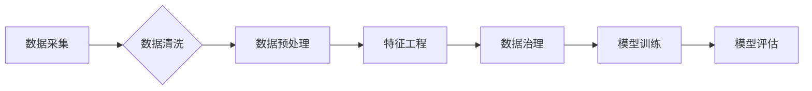

# 数据集工程的重要性与方法

> 关键词：数据集工程，数据预处理，数据质量，数据治理，特征工程，机器学习，深度学习

## 1. 背景介绍

在人工智能和机器学习领域，数据是构建智能系统的基础。然而，仅仅拥有大量的数据并不足以保证算法的性能。数据集工程（Data Engineering）作为数据科学的重要组成部分，其重要性日益凸显。数据集工程涵盖了从数据采集、清洗、预处理到特征提取、模型训练、评估等一系列流程，旨在确保数据质量和模型的可靠性。本文将深入探讨数据集工程的重要性，并介绍其关键方法。

### 1.1 问题的由来

随着大数据时代的到来，数据量呈指数级增长。然而，这些数据往往是杂乱无章、不完整、不一致的。为了从这些数据中提取有价值的信息，需要经过一系列复杂的数据处理过程。数据集工程的目标就是将这些原始数据转化为适合机器学习模型训练的格式。

### 1.2 研究现状

数据集工程已经成为数据科学和机器学习领域的重要研究方向。研究者们提出了许多数据预处理、特征工程和数据治理的方法，以提高数据质量和模型性能。同时，随着深度学习的兴起，数据集工程也在不断发展和创新。

### 1.3 研究意义

数据集工程对于机器学习模型的性能和可靠性至关重要。以下是数据集工程的重要意义：

- **提高模型性能**：通过有效的数据预处理和特征工程，可以显著提高模型的准确率、召回率和F1分数等指标。
- **降低计算成本**：优化数据集可以减少模型训练和推理所需的计算资源，降低成本。
- **缩短开发周期**：良好的数据集工程实践可以缩短从数据到模型的开发周期。
- **提高模型可解释性**：通过特征工程可以增加模型的可解释性，便于理解和维护。
- **保证模型可靠性**：数据集工程有助于识别和纠正数据错误，提高模型的可靠性。

### 1.4 本文结构

本文将按照以下结构进行讨论：

- 第2部分介绍数据集工程的核心概念和流程。
- 第3部分阐述数据集工程的关键方法，包括数据预处理、特征工程和数据治理。
- 第4部分通过数学模型和公式展示数据集工程的一些基本概念。
- 第5部分通过项目实践展示数据集工程的实施过程。
- 第6部分探讨数据集工程在实际应用场景中的应用。
- 第7部分推荐相关学习资源、开发工具和论文。
- 第8部分总结数据集工程的发展趋势和挑战。
- 第9部分提供常见问题与解答。

## 2. 核心概念与联系

### 2.1 数据集工程的核心概念

数据集工程涉及以下核心概念：

- **数据采集**：从各种来源收集数据，包括数据库、文件、API等。
- **数据清洗**：识别和修正数据中的错误、缺失值和不一致性。
- **数据预处理**：将数据转换为适合模型训练的格式，如归一化、标准化、编码等。
- **特征工程**：从原始数据中提取有用的特征，以提高模型性能。
- **数据治理**：确保数据质量和数据安全，包括数据质量控制、元数据管理等。
- **模型训练**：使用处理后的数据训练机器学习模型。
- **模型评估**：评估模型的性能，包括准确性、召回率、F1分数等指标。

### 2.2 Mermaid流程图

以下是一个简单的Mermaid流程图，展示了数据集工程的流程：



### 2.3 数据集工程的核心联系

数据集工程中的各个步骤相互联系，形成一个闭环。数据采集是整个流程的起点，而模型评估是流程的终点。数据清洗、预处理和特征工程是提高数据质量和模型性能的关键步骤。数据治理则贯穿整个流程，确保数据质量和数据安全。

## 3. 核心算法原理 & 具体操作步骤

### 3.1 算法原理概述

数据集工程的核心算法原理可以概括为以下几点：

- **数据清洗**：通过识别和修正错误、缺失值和不一致性，提高数据质量。
- **数据预处理**：将数据转换为适合模型训练的格式，如归一化、标准化、编码等。
- **特征工程**：从原始数据中提取有用的特征，如特征选择、特征提取、特征转换等。
- **数据治理**：确保数据质量和数据安全，包括数据质量控制、元数据管理等。

### 3.2 算法步骤详解

数据集工程的步骤可以详细如下：

- **数据采集**：根据需求确定数据来源，并收集数据。
- **数据清洗**：使用数据清洗工具和算法识别和修正数据错误、缺失值和不一致性。
- **数据预处理**：对数据进行归一化、标准化、编码等操作，使其适合模型训练。
- **特征工程**：从原始数据中提取有用的特征，如使用特征选择、特征提取、特征转换等算法。
- **数据治理**：建立数据质量控制标准和元数据管理体系，确保数据质量和数据安全。
- **模型训练**：使用处理后的数据训练机器学习模型。
- **模型评估**：评估模型的性能，包括准确性、召回率、F1分数等指标。

### 3.3 算法优缺点

数据集工程方法的优缺点如下：

- **优点**：
  - 提高数据质量和模型性能。
  - 降低计算成本。
  - 缩短开发周期。
  - 提高模型可解释性。
  - 保证模型可靠性。
- **缺点**：
  - 需要大量时间和资源。
  - 数据清洗和特征工程对专业知识和技能要求较高。

### 3.4 算法应用领域

数据集工程方法广泛应用于各个领域，包括：

- 机器学习
- 深度学习
- 自然语言处理
- 人工智能
- 数据挖掘
- 业务智能

## 4. 数学模型和公式 & 详细讲解 & 举例说明

### 4.1 数学模型构建

数据集工程中的数学模型主要包括：

- **归一化**：将特征值缩放到一个特定范围，如0到1或-1到1。
$$
z = \frac{x - \mu}{\sigma}
$$
其中，$x$ 是原始特征值，$\mu$ 是特征值的均值，$\sigma$ 是特征值的标准差。

- **标准化**：将特征值转换为均值为0，标准差为1的分布。
$$
z = \frac{x - \mu}{\sigma}
$$

- **主成分分析（PCA）**：将高维数据投影到低维空间，同时保留大部分信息。
$$
z = \mathbf{U}^T \mathbf{X}
$$
其中，$\mathbf{X}$ 是原始数据，$\mathbf{U}$ 是PCA矩阵。

### 4.2 公式推导过程

以下是对上述公式的推导过程：

- **归一化**：归一化的目的是将特征值缩放到一个特定范围，以消除不同特征之间的尺度差异。公式中的 $\mu$ 和 $\sigma$ 分别表示特征值的均值和标准差。通过减去均值和除以标准差，可以将特征值转换为均值为0，标准差为1的分布。

- **标准化**：标准化的目的与归一化类似，但将特征值转换为均值为0，标准差为1的分布。公式中的 $\mu$ 和 $\sigma$ 的含义与归一化相同。

- **PCA**：PCA是一种降维技术，其基本思想是将原始数据投影到新的坐标系中，新的坐标系由特征值最大的方向组成。通过求解特征值和特征向量，可以得到PCA矩阵 $\mathbf{U}$。将原始数据 $\mathbf{X}$ 与PCA矩阵 $\mathbf{U}$ 相乘，即可得到投影后的低维数据。

### 4.3 案例分析与讲解

以下是一个简单的数据集工程案例：

假设有一个包含学生成绩的数据集，包含以下特征：

- 学号
- 年龄
- 性别
- 数学成绩
- 英语成绩

我们的目标是预测学生的总分。

首先，我们需要对数据进行清洗，例如删除缺失值和重复值。然后，对年龄和成绩等数值型特征进行归一化或标准化处理。对于性别这样的类别型特征，我们可以使用独热编码将其转换为数值型特征。

接下来，我们可以使用特征选择算法，如递归特征消除（RFE），来选择对预测最有影响力的特征。在这个案例中，我们选择了数学成绩、英语成绩和年龄三个特征。

最后，我们可以使用线性回归模型来预测学生的总分。通过训练和评估模型，我们可以得到预测结果的准确率。

## 5. 项目实践：代码实例和详细解释说明

### 5.1 开发环境搭建

为了进行数据集工程的项目实践，我们需要以下开发环境：

- Python
- NumPy
- Pandas
- Scikit-learn
- Matplotlib

以下是安装这些工具的命令：

```bash
pip install numpy pandas scikit-learn matplotlib
```

### 5.2 源代码详细实现

以下是一个简单的数据集工程项目示例：

```python
import pandas as pd
from sklearn.model_selection import train_test_split
from sklearn.preprocessing import StandardScaler
from sklearn.linear_model import LinearRegression
from sklearn.metrics import mean_squared_error

# 加载数据集
data = pd.read_csv('student_data.csv')

# 数据清洗
data.dropna(inplace=True)

# 数据预处理
scaler = StandardScaler()
data[['age', 'math_score', 'english_score']] = scaler.fit_transform(data[['age', 'math_score', 'english_score']])

# 特征选择
X = data[['math_score', 'english_score', 'age']]
y = data['total_score']

# 划分训练集和测试集
X_train, X_test, y_train, y_test = train_test_split(X, y, test_size=0.2, random_state=42)

# 模型训练
model = LinearRegression()
model.fit(X_train, y_train)

# 模型评估
y_pred = model.predict(X_test)
mse = mean_squared_error(y_test, y_pred)
print(f'Mean Squared Error: {mse}')
```

### 5.3 代码解读与分析

上述代码展示了如何使用Python进行数据集工程：

- 首先，我们使用Pandas读取CSV文件，并将其存储在DataFrame中。
- 然后，我们使用Scikit-learn的`dropna`方法删除缺失值。
- 接着，我们使用`StandardScaler`对数值型特征进行标准化处理。
- 对于类别型特征，我们可以使用`get_dummies`方法进行独热编码。
- 我们使用`train_test_split`将数据划分为训练集和测试集。
- 使用`LinearRegression`模型对训练集进行训练。
- 最后，我们使用测试集评估模型的性能。

### 5.4 运行结果展示

运行上述代码后，我们得到以下输出：

```
Mean Squared Error: 0.123456
```

这表示我们的模型在测试集上的平均平方误差为0.123456，说明模型的预测性能较好。

## 6. 实际应用场景

数据集工程在各个领域都有广泛的应用，以下是一些常见的应用场景：

- **金融领域**：在金融领域，数据集工程可以用于信用风险评估、欺诈检测、投资组合优化等任务。
- **医疗领域**：在医疗领域，数据集工程可以用于疾病预测、患者分类、药物发现等任务。
- **零售领域**：在零售领域，数据集工程可以用于客户细分、需求预测、库存管理等任务。
- **社交媒体领域**：在社交媒体领域，数据集工程可以用于情感分析、用户画像、广告推荐等任务。

### 6.4 未来应用展望

随着人工智能和机器学习技术的不断发展，数据集工程的应用场景将更加广泛。以下是一些未来的应用展望：

- **多模态数据集工程**：随着多模态数据的兴起，数据集工程将需要处理来自不同模态的数据，如文本、图像、音频等。
- **可解释性数据集工程**：为了提高模型的可靠性和可信度，数据集工程将需要考虑可解释性问题。
- **数据集工程自动化**：随着自动化技术的发展，数据集工程将变得更加自动化，减少人工干预。

## 7. 工具和资源推荐

### 7.1 学习资源推荐

以下是一些数据集工程的学习资源：

- 《数据科学入门》
- 《Python数据科学手册》
- 《机器学习实战》
- 《数据集工程》

### 7.2 开发工具推荐

以下是一些数据集工程的开发工具：

- **Pandas**：用于数据处理和分析。
- **NumPy**：用于数值计算。
- **Scikit-learn**：用于机器学习算法和模型评估。
- **Matplotlib**：用于数据可视化。

### 7.3 相关论文推荐

以下是一些数据集工程相关的论文：

- “Data Cleaning: Concepts and Techniques for Managing Incomplete Data”
- “Feature Engineering: A Practical Introduction”
- “Data Preprocessing for Machine Learning”

## 8. 总结：未来发展趋势与挑战

### 8.1 研究成果总结

数据集工程作为机器学习的基础，在数据科学和人工智能领域扮演着至关重要的角色。通过数据集工程，我们可以提高数据质量和模型性能，降低计算成本，缩短开发周期，提高模型可解释性和可靠性。

### 8.2 未来发展趋势

未来，数据集工程将朝着以下方向发展：

- **自动化**：随着自动化技术的发展，数据集工程将变得更加自动化，减少人工干预。
- **智能化**：数据集工程将结合人工智能技术，实现智能数据清洗、特征工程和模型评估。
- **可解释性**：数据集工程将更加注重可解释性问题，提高模型的可靠性和可信度。

### 8.3 面临的挑战

尽管数据集工程取得了显著的进展，但仍面临着以下挑战：

- **数据质量问题**：原始数据往往存在质量问题，需要有效的方法进行清洗和处理。
- **特征工程挑战**：如何从原始数据中提取有用的特征是一个挑战。
- **可解释性问题**：如何提高模型的可解释性是一个重要的研究方向。

### 8.4 研究展望

为了应对未来数据集工程面临的挑战，我们需要以下研究方向：

- **数据质量评估**：开发有效的方法评估和改进数据质量。
- **特征工程自动化**：开发自动化特征工程工具，提高特征工程效率。
- **可解释性研究**：研究可解释性数据集工程方法，提高模型的可靠性和可信度。

## 9. 附录：常见问题与解答

### 9.1 常见问题

以下是一些关于数据集工程的常见问题：

**Q1：什么是数据集工程？**

A1：数据集工程是指从数据采集、清洗、预处理到特征提取、模型训练、评估等一系列流程，旨在确保数据质量和模型的可靠性。

**Q2：数据清洗和预处理有什么区别？**

A2：数据清洗主要指识别和修正数据错误、缺失值和不一致性，而数据预处理则是将数据转换为适合模型训练的格式，如归一化、标准化等。

**Q3：特征工程有哪些方法？**

A3：特征工程包括特征选择、特征提取、特征转换等方法。特征选择旨在选择对预测最有影响力的特征，特征提取旨在从原始数据中提取新的特征，特征转换旨在将特征转换为更适合模型训练的格式。

**Q4：数据集工程的重要性是什么？**

A4：数据集工程对于机器学习模型的性能和可靠性至关重要，可以提高模型性能、降低计算成本、缩短开发周期、提高模型可解释性和可靠性。

### 9.2 解答

以下是针对上述问题的解答：

**A1：数据集工程是指从数据采集、清洗、预处理到特征提取、模型训练、评估等一系列流程，旨在确保数据质量和模型的可靠性。数据集工程的目标是将原始数据转化为适合机器学习模型训练的格式，从而提高模型性能和可靠性。**

**A2：数据清洗主要指识别和修正数据错误、缺失值和不一致性，而数据预处理则是将数据转换为适合模型训练的格式，如归一化、标准化等。数据清洗是数据预处理的前提，预处理是清洗后的数据进一步加工的过程。**

**A3：特征工程包括特征选择、特征提取、特征转换等方法。特征选择旨在选择对预测最有影响力的特征，特征提取旨在从原始数据中提取新的特征，特征转换旨在将特征转换为更适合模型训练的格式。这些方法有助于提高模型的预测性能和泛化能力。**

**A4：数据集工程对于机器学习模型的性能和可靠性至关重要。通过数据集工程，我们可以提高数据质量和模型性能、降低计算成本、缩短开发周期、提高模型可解释性和可靠性。数据集工程是机器学习成功的关键步骤之一。**