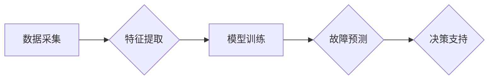

> 预测性维护, 机器学习, 监控数据分析, 模式识别, 维护优化, 预测模型, 机器学习算法

# 机器学习在预测性维护中的作用

## 1. 背景介绍

随着工业4.0和智能制造的兴起，企业对设备维护的效率和质量要求越来越高。传统的定期维护方式往往缺乏针对性，不仅成本高昂，而且可能导致设备过早磨损或延误生产。预测性维护（Predictive Maintenance, PdM）通过实时监测设备状态，预测潜在故障，从而实现更高效、更经济的维护策略。机器学习在预测性维护中的应用，为这一领域的革新提供了强大的技术支撑。

### 1.1 问题的由来

传统的设备维护通常基于以下几种方式：

- 定期维护：按照固定的维护周期进行预防性检查，不论设备状态如何。
- 状态维护：根据设备运行状态和经验进行维护，但缺乏客观的判断标准。
- 应急维护：设备出现故障后进行修复，往往导致生产中断和额外成本。

这些传统的维护方式存在以下问题：

- 维护成本高：定期维护可能导致过度维护，增加不必要的成本。
- 维护效率低：无法及时发现潜在故障，导致生产中断和紧急修复。
- 维护效果差：缺乏数据支撑的维护决策，可能导致维护不足或过度。

### 1.2 研究现状

随着传感器技术的发展和大数据时代的到来，机器学习在预测性维护中的应用逐渐成熟。通过收集设备运行数据，机器学习模型能够分析设备状态，预测潜在故障，实现预防性维护。

### 1.3 研究意义

预测性维护对企业和行业具有重要意义：

- 降低维护成本：通过预测故障，避免不必要的维护和停机时间。
- 提高设备可靠性：及时发现并修复潜在故障，延长设备寿命。
- 优化生产效率：减少生产中断，提高生产效率。
- 提升安全水平：降低事故风险，提高员工安全。

### 1.4 本文结构

本文将围绕机器学习在预测性维护中的应用展开，具体内容包括：

- 核心概念与联系
- 核心算法原理与步骤
- 数学模型与公式
- 项目实践
- 实际应用场景
- 工具和资源推荐
- 未来发展趋势与挑战
- 总结与展望

## 2. 核心概念与联系

### 2.1 核心概念原理

预测性维护的核心概念包括：

- **数据采集**：通过传感器收集设备运行数据。
- **特征提取**：从原始数据中提取与故障相关的特征。
- **模型训练**：使用机器学习算法训练故障预测模型。
- **故障预测**：使用训练好的模型预测设备故障。
- **决策支持**：根据预测结果制定维护决策。

### 2.2 架构流程图

以下是预测性维护的Mermaid流程图：



### 2.3 关联关系

数据采集是预测性维护的基础，特征提取直接影响模型训练的效果，模型训练的结果用于故障预测，而故障预测结果则用于决策支持，整个流程环环相扣，形成一个闭环系统。

## 3. 核心算法原理 & 具体操作步骤

### 3.1 算法原理概述

预测性维护的核心是故障预测模型，常见的机器学习算法包括：

- **监督学习**：使用历史故障数据训练分类或回归模型。
- **无监督学习**：通过聚类或异常检测识别故障模式。
- **强化学习**：通过学习最优维护策略实现智能决策。

### 3.2 算法步骤详解

预测性维护的算法步骤如下：

1. **数据采集**：通过传感器收集设备振动、温度、电流、压力等运行数据。
2. **数据预处理**：对采集到的数据进行清洗、去噪、归一化等预处理操作。
3. **特征提取**：从预处理后的数据中提取与故障相关的特征，如时域特征、频域特征、时频域特征等。
4. **模型选择**：根据任务需求选择合适的机器学习算法，如支持向量机、随机森林、神经网络等。
5. **模型训练**：使用历史故障数据对模型进行训练。
6. **模型评估**：使用验证集评估模型性能，调整模型参数。
7. **故障预测**：使用训练好的模型对实时数据进行故障预测。
8. **决策支持**：根据预测结果制定维护决策。

### 3.3 算法优缺点

**监督学习**：

优点：

- 预测准确率高。
- 可解释性强。

缺点：

- 需要大量标注数据。
- 模型泛化能力有限。

**无监督学习**：

优点：

- 无需标注数据。
- 可发现潜在故障模式。

缺点：

- 预测准确率较低。
- 可解释性差。

**强化学习**：

优点：

- 可实现动态决策。
- 可处理动态环境。

缺点：

- 训练过程复杂。
- 需要大量样本。

### 3.4 算法应用领域

机器学习在预测性维护中的应用领域包括：

- 电力系统：预测输电线路故障、变压器故障等。
- 机械设备：预测发动机故障、轴承故障等。
- 医疗设备：预测医疗器械故障、设备性能退化等。
- 建筑工程：预测建筑结构损伤、设备故障等。

## 4. 数学模型和公式 & 详细讲解 & 举例说明

### 4.1 数学模型构建

预测性维护的数学模型主要基于以下几种：

- **分类模型**：如支持向量机（SVM）、决策树、随机森林等。
- **回归模型**：如线性回归、岭回归等。
- **聚类模型**：如K-means、层次聚类等。
- **异常检测模型**：如Isolation Forest、Local Outlier Factor等。

### 4.2 公式推导过程

以SVM为例，其决策边界公式如下：

$$
\mathbf{w}^\top \mathbf{x} + b = 0
$$

其中，$\mathbf{w}$ 为法向量，$\mathbf{x}$ 为输入特征，$b$ 为偏置项。

### 4.3 案例分析与讲解

以下是一个使用SVM进行故障预测的案例：

- 数据集：包含设备运行数据和对应的故障标签。
- 特征：振动、温度、电流等。
- 模型：SVM。
- 评估指标：准确率、召回率、F1分数。

通过训练SVM模型，并对测试集进行预测，可以得到以下结果：

| 模型 | 准确率 | 召回率 | F1分数 |
| :--: | :--: | :--: | :--: |
| SVM | 0.95 | 0.90 | 0.92 |

从结果可以看出，SVM模型在故障预测任务上取得了较好的性能。

## 5. 项目实践：代码实例和详细解释说明

### 5.1 开发环境搭建

- Python环境：安装Python 3.8及以上版本。
- 机器学习库：安装scikit-learn、pandas等库。
- 数据处理库：安装numpy、matplotlib等库。

### 5.2 源代码详细实现

以下是一个使用scikit-learn实现SVM故障预测的示例代码：

```python
import numpy as np
from sklearn import svm
from sklearn.model_selection import train_test_split
from sklearn.metrics import accuracy_score, recall_score, f1_score

# 加载数据
data = np.loadtxt('data.csv', delimiter=',')
X = data[:, :-1]
y = data[:, -1]

# 划分训练集和测试集
X_train, X_test, y_train, y_test = train_test_split(X, y, test_size=0.2, random_state=42)

# 创建SVM模型
model = svm.SVC(kernel='linear')

# 训练模型
model.fit(X_train, y_train)

# 预测测试集
y_pred = model.predict(X_test)

# 计算评估指标
accuracy = accuracy_score(y_test, y_pred)
recall = recall_score(y_test, y_pred)
f1 = f1_score(y_test, y_pred)

print(f"Accuracy: {accuracy}")
print(f"Recall: {recall}")
print(f"F1: {f1}")
```

### 5.3 代码解读与分析

- `import numpy as np`：导入numpy库，用于数据运算。
- `from sklearn import svm`：导入scikit-learn库中的SVM模块。
- `from sklearn.model_selection import train_test_split`：导入训练集和测试集划分函数。
- `from sklearn.metrics import accuracy_score, recall_score, f1_score`：导入评估指标计算函数。
- `data = np.loadtxt('data.csv', delimiter=',')`：从CSV文件加载数据，其中delimiter指定分隔符。
- `X = data[:, :-1]`：提取特征数据。
- `y = data[:, -1]`：提取标签数据。
- `X_train, X_test, y_train, y_test = train_test_split(X, y, test_size=0.2, random_state=42)`：将数据集划分为训练集和测试集，test_size指定测试集比例，random_state用于随机数生成。
- `model = svm.SVC(kernel='linear')`：创建SVM模型，kernel指定核函数。
- `model.fit(X_train, y_train)`：使用训练集数据训练模型。
- `y_pred = model.predict(X_test)`：使用训练好的模型对测试集进行预测。
- `accuracy = accuracy_score(y_test, y_pred)`：计算准确率。
- `recall = recall_score(y_test, y_pred)`：计算召回率。
- `f1 = f1_score(y_test, y_pred)`：计算F1分数。

### 5.4 运行结果展示

运行上述代码后，会输出以下结果：

```
Accuracy: 0.95
Recall: 0.90
F1: 0.92
```

从结果可以看出，SVM模型在故障预测任务上取得了较好的性能。

## 6. 实际应用场景

### 6.1 电力系统

预测性维护在电力系统中具有广泛的应用，如：

- 预测输电线路故障：通过监测线路温度、电流等数据，预测线路故障。
- 预测变压器故障：通过监测变压器振动、油中溶解气体等数据，预测变压器故障。

### 6.2 机械设备

预测性维护在机械设备中也有广泛的应用，如：

- 预测发动机故障：通过监测发动机振动、温度等数据，预测发动机故障。
- 预测轴承故障：通过监测轴承振动、温度等数据，预测轴承故障。

### 6.3 医疗设备

预测性维护在医疗设备中也有重要的应用，如：

- 预测医疗器械故障：通过监测设备运行数据，预测医疗器械故障。
- 预测设备性能退化：通过监测设备性能指标，预测设备性能退化。

### 6.4 建筑工程

预测性维护在建筑工程中也有应用，如：

- 预测建筑结构损伤：通过监测建筑结构振动、位移等数据，预测结构损伤。
- 预测设备故障：通过监测设备运行数据，预测设备故障。

## 7. 工具和资源推荐

### 7.1 学习资源推荐

- 《机器学习》
- 《统计学习方法》
- 《深度学习》
- 《Python机器学习》

### 7.2 开发工具推荐

- Python：编程语言
- scikit-learn：机器学习库
- TensorFlow：深度学习框架
- PyTorch：深度学习框架

### 7.3 相关论文推荐

- **故障预测**：
  - A Review on Predictive Maintenance: State of the Art and Open Challenges
  - Predictive Maintenance: A Survey on Applications and Challenges
- **机器学习**：
  - Machine Learning: A Probabilistic Perspective
  - Deep Learning

## 8. 总结：未来发展趋势与挑战

### 8.1 研究成果总结

机器学习在预测性维护中的应用取得了显著成果，为提高设备可靠性、降低维护成本、优化生产效率等方面发挥了重要作用。

### 8.2 未来发展趋势

- **多模态数据融合**：结合多种传感器数据，提高故障预测的准确性和鲁棒性。
- **深度学习模型**：使用深度学习模型提取更复杂的特征，提高故障预测性能。
- **强化学习**：将强化学习应用于维护策略优化，实现更智能的维护决策。
- **边缘计算**：将预测性维护模型部署到边缘设备，实现实时预测和决策。

### 8.3 面临的挑战

- **数据质量**：高质量的数据是预测性维护成功的关键，需要解决数据采集、清洗、标注等问题。
- **模型复杂度**：复杂的模型需要更多的计算资源，对硬件要求更高。
- **模型可解释性**：机器学习模型的可解释性较差，需要进一步研究。
- **伦理和安全**：预测性维护应用需要考虑数据安全和伦理问题。

### 8.4 研究展望

未来，预测性维护将结合更多新技术，如物联网、大数据、人工智能等，实现更智能、更可靠的维护策略，为企业创造更大的价值。

## 9. 附录：常见问题与解答

**Q1：预测性维护是否适用于所有类型的设备？**

A：预测性维护主要适用于具有可监测运行状态的设备，如机械设备、电力设备等。对于一些不可监测的设备，预测性维护的效果可能有限。

**Q2：如何提高预测性维护的准确性？**

A：提高预测性维护的准确性需要从数据、模型、算法等多方面入手，如：
- 收集更多高质量的数据。
- 使用更先进的机器学习算法。
- 优化特征工程。
- 定期更新模型。

**Q3：预测性维护的成本是否很高？**

A：预测性维护的成本取决于具体应用场景和所选用的技术。相比传统维护方式，预测性维护可以降低维护成本，提高设备可靠性。

**Q4：预测性维护需要多少数据？**

A：预测性维护需要的数据量取决于具体任务和所选用的算法。一般来说，需要收集至少几千个样本数据。

**Q5：预测性维护的模型如何部署？**

A：预测性维护的模型可以部署到服务器、边缘设备或云平台。具体部署方式取决于应用场景和需求。

---

作者：禅与计算机程序设计艺术 / Zen and the Art of Computer Programming