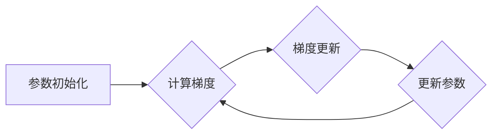

# 梯度下降Gradient Descent原理与代码实例讲解

> 关键词：梯度下降，优化算法，机器学习，深度学习，神经网络，成本函数，反向传播，动量，自适应学习率

## 1. 背景介绍

梯度下降（Gradient Descent）是机器学习和深度学习中最基本的优化算法之一。它用于最小化成本函数，从而找到使模型预测误差最小的参数。梯度下降算法的原理简单，但在实际应用中具有极高的效率，是许多机器学习模型的核心组成部分。

### 1.1 问题的由来

在机器学习领域，我们通常希望找到一个模型，它能够对给定的输入数据做出准确的预测。为了实现这一目标，我们需要确定一组参数，这些参数决定了模型的行为。然而，如何找到这些参数呢？这就是梯度下降算法要解决的问题。

### 1.2 研究现状

梯度下降算法有多种变体，包括批量梯度下降、随机梯度下降、小批量梯度下降等。每种变体都有其适用的场景和优缺点。随着深度学习的发展，梯度下降算法也得到了进一步的扩展，例如自适应学习率、动量等技术。

### 1.3 研究意义

理解梯度下降算法对于机器学习和深度学习至关重要。它不仅帮助我们理解模型的优化过程，还能让我们根据不同的任务和数据集选择合适的优化策略。

## 2. 核心概念与联系

### 2.1 核心概念原理和架构的 Mermaid 流程图



### 2.2 核心概念

- **成本函数**：衡量模型预测结果与真实值之间差异的函数。
- **梯度**：成本函数关于模型参数的偏导数，指示了成本函数在当前参数下的上升或下降方向。
- **参数更新**：根据梯度调整模型参数，以降低成本函数的值。

## 3. 核心算法原理 & 具体操作步骤

### 3.1 算法原理概述

梯度下降算法的基本思想是：在参数空间中沿着成本函数的负梯度方向进行搜索，直到找到最小化成本函数的参数值。

### 3.2 算法步骤详解

1. **初始化参数**：随机选择一组参数值作为起点。
2. **计算梯度**：计算成本函数关于当前参数的梯度。
3. **梯度更新**：根据梯度更新参数，通常使用以下公式：
   $$
 \theta = \theta - \alpha \cdot \nabla_{\theta}J(\theta) 
$$
   其中，$\theta$ 是参数，$\alpha$ 是学习率，$J(\theta)$ 是成本函数。
4. **更新参数**：使用更新后的参数进行下一次迭代。
5. **重复步骤 2-4**，直到满足停止条件（例如，梯度足够小或迭代次数达到上限）。

### 3.3 算法优缺点

#### 优点

- 原理简单，易于实现。
- 广泛适用于各种优化问题。
- 能够找到成本函数的局部最小值。

#### 缺点

- 学习率的选择对收敛速度和结果影响很大。
- 可能陷入局部最小值。
- 对于非凸问题，可能收敛到鞍点。

### 3.4 算法应用领域

- 逻辑回归
- 线性回归
- 神经网络
- 决策树
- 支持向量机

## 4. 数学模型和公式 & 详细讲解 & 举例说明

### 4.1 数学模型构建

假设我们有一个成本函数 $J(\theta)$，其中 $\theta$ 是模型参数。梯度下降算法的目标是最小化这个函数。

### 4.2 公式推导过程

对于简单的线性回归问题，成本函数可以表示为：

$$
 J(\theta) = \frac{1}{2m} \sum_{i=1}^{m}(h_\theta(x^{(i)}) - y^{(i)})^2 
$$

其中，$m$ 是样本数量，$x^{(i)}$ 是第 $i$ 个样本的特征，$y^{(i)}$ 是对应的真实值，$h_\theta(x)$ 是模型预测值。

### 4.3 案例分析与讲解

以下是一个简单的线性回归问题的梯度下降代码实例：

```python
import numpy as np

# 定义成本函数
def compute_cost(X, y, theta):
    m = len(y)
    predictions = X.dot(theta)
    errors = predictions - y
    cost = (1/(2*m)) * errors.dot(errors)
    return cost

# 定义梯度函数
def compute_gradient(X, y, theta):
    m = len(y)
    predictions = X.dot(theta)
    errors = predictions - y
    gradient = (1/m) * X.T.dot(errors)
    return gradient

# 初始化参数
theta = np.zeros(X.shape[1])

# 设置学习率
alpha = 0.01

# 设置迭代次数
iterations = 1000

# 梯度下降
for iteration in range(iterations):
    gradient = compute_gradient(X, y, theta)
    theta = theta - alpha * gradient
```

## 5. 项目实践：代码实例和详细解释说明

### 5.1 开发环境搭建

- Python 3.x
- NumPy
- Matplotlib

### 5.2 源代码详细实现

以下是一个简单的线性回归问题的梯度下降代码实例：

```python
import numpy as np
import matplotlib.pyplot as plt

# 创建数据
X = 2 * np.random.rand(100, 1)
y = 4 + 3 * X + np.random.randn(100, 1)

# 定义成本函数
def compute_cost(X, y, theta):
    m = len(y)
    predictions = X.dot(theta)
    errors = predictions - y
    cost = (1/(2*m)) * errors.dot(errors)
    return cost

# 定义梯度函数
def compute_gradient(X, y, theta):
    m = len(y)
    predictions = X.dot(theta)
    errors = predictions - y
    gradient = (1/m) * X.T.dot(errors)
    return gradient

# 初始化参数
theta = np.zeros(X.shape[1])

# 设置学习率
alpha = 0.01

# 设置迭代次数
iterations = 1000

# 梯度下降
for iteration in range(iterations):
    gradient = compute_gradient(X, y, theta)
    theta = theta - alpha * gradient

# 绘制结果
plt.scatter(X, y, color='red')
plt.plot(X, X.dot(theta), color='blue')
plt.show()
```

### 5.3 代码解读与分析

- 首先，我们创建了模拟的线性回归数据。
- 然后，我们定义了成本函数和梯度函数，用于计算成本和梯度。
- 接着，我们初始化了参数和学习率，并设置了迭代次数。
- 在梯度下降循环中，我们计算梯度并更新参数。
- 最后，我们绘制了原始数据点和拟合的直线。

### 5.4 运行结果展示

运行上述代码后，我们将看到原始数据点和拟合的直线。这表明梯度下降算法能够找到最佳参数，以最小化成本函数。

## 6. 实际应用场景

梯度下降算法在许多机器学习和深度学习任务中都有广泛的应用，以下是一些常见的应用场景：

- 线性回归
- 逻辑回归
- 朴素贝叶斯
- 决策树
- 神经网络

## 7. 工具和资源推荐

### 7.1 学习资源推荐

- 《Python机器学习》
- 《深度学习》
- Coursera上的机器学习和深度学习课程

### 7.2 开发工具推荐

- NumPy
- SciPy
- scikit-learn
- TensorFlow
- PyTorch

### 7.3 相关论文推荐

- "On the Convergence of the EM Algorithm for Gaussian Mixture Models" by David J. C. MacKay
- "Stochastic Gradient Descent" by S. Sra, S. Nowozin, S. J. Wright

## 8. 总结：未来发展趋势与挑战

### 8.1 研究成果总结

梯度下降算法是机器学习和深度学习中最基本的优化算法之一。它通过迭代更新参数，以最小化成本函数，从而找到最佳模型。梯度下降算法具有原理简单、易于实现等优点，但也存在学习率选择困难、可能陷入局部最小值等缺点。

### 8.2 未来发展趋势

随着机器学习和深度学习的发展，梯度下降算法也在不断进化。以下是一些未来的发展趋势：

- 自适应学习率
- 多智能体梯度下降
- 梯度下降与强化学习结合
- 梯度下降在量子计算中的应用

### 8.3 面临的挑战

梯度下降算法在应用中面临着以下挑战：

- 学习率选择
- 局部最小值
- 计算复杂度
- 并行化
- 可解释性

### 8.4 研究展望

未来，梯度下降算法的研究将重点关注以下方向：

- 设计更高效的优化算法
- 提高算法的鲁棒性和可解释性
- 将梯度下降算法与其他机器学习技术结合
- 在更多领域应用梯度下降算法

## 9. 附录：常见问题与解答

**Q1：什么是学习率？**

A：学习率是梯度下降算法中的一个参数，它决定了每次迭代中参数更新的幅度。选择合适的学习率对于算法的收敛速度和最终结果至关重要。

**Q2：什么是梯度？**

A：梯度是成本函数关于参数的偏导数，指示了成本函数在当前参数下的上升或下降方向。梯度下降算法通过沿着负梯度方向更新参数，以最小化成本函数。

**Q3：梯度下降算法为什么可能陷入局部最小值？**

A：梯度下降算法可能陷入局部最小值，因为它是单峰搜索过程。在复杂的多峰函数中，梯度下降算法可能会沿着鞍点或非凸区域的边界移动，最终收敛到局部最小值。

**Q4：什么是批量梯度下降、随机梯度下降和小批量梯度下降？**

A：批量梯度下降、随机梯度下降和小批量梯度下降是梯度下降算法的几种变体。批量梯度下降在每个迭代步骤中使用全部数据计算梯度，随机梯度下降在每个迭代步骤中使用单个数据点计算梯度，小批量梯度下降在每个迭代步骤中使用一小部分数据计算梯度。

**Q5：梯度下降算法在深度学习中的应用有哪些？**

A：梯度下降算法在深度学习中被广泛应用于各种任务，包括图像识别、自然语言处理、语音识别等。

---

作者：禅与计算机程序设计艺术 / Zen and the Art of Computer Programming