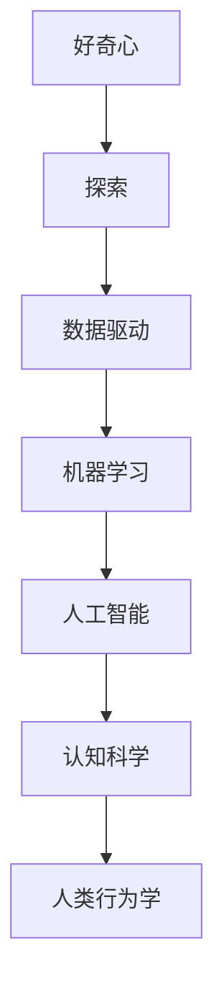
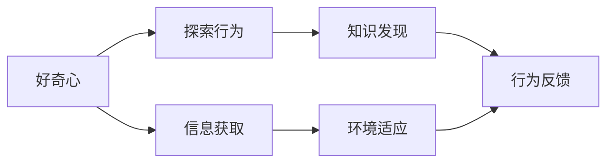
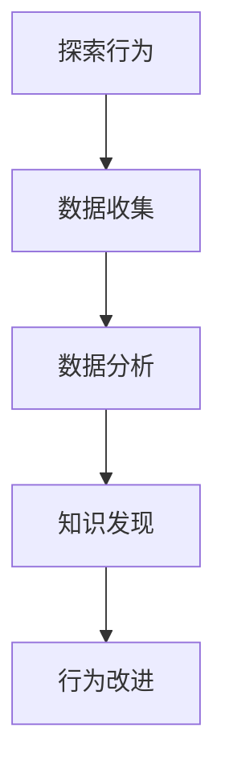
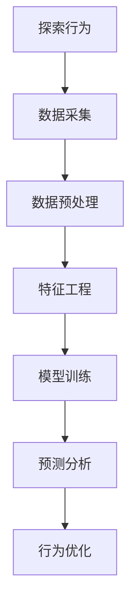
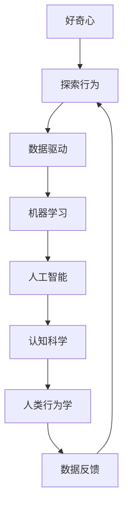

                 

# 好奇心：探索世界的钥匙

> 关键词：
- 好奇心
- 探索
- 数据驱动
- 机器学习
- 人工智能
- 认知科学
- 人类行为学

## 1. 背景介绍

### 1.1 问题由来
探索未知、发现新知是推动人类文明进步的重要动力。在科技日益发达的今天，如何利用技术手段激发和维持人们的好奇心，成为数字化时代的挑战。特别是随着数据驱动和人工智能技术的发展，机器学习、深度学习等方法成为了挖掘隐藏数据背后知识的有力工具。本文将探讨如何利用这些技术手段，激发人类的好奇心，拓展对世界的认知。

### 1.2 问题核心关键点
好奇心驱动的探索研究，离不开对大量数据的收集和分析，机器学习作为这一过程的重要方法论，极大地提高了数据挖掘的效率和准确性。具体来说，本文将讨论以下核心问题：
- 数据驱动的好奇心激发机制
- 机器学习在探索行为中的应用
- 人类行为学对探索研究的启示
- 好奇心与人工智能的结合

这些问题的探讨将帮助我们理解如何更好地利用技术手段，激发和维持人类的好奇心，从而推动对未知世界的探索和发现。

### 1.3 问题研究意义
好奇心驱动的探索行为，不仅有助于科学发现和技术创新，更能激发人类对未知世界的好奇与敬畏，促进个体和社会的全面发展。技术手段的介入，可以帮助我们更好地捕捉和分析探索行为的数据，揭示探索的心理机制，进而设计出更有效的激发策略。

## 2. 核心概念与联系

### 2.1 核心概念概述

为更好地理解好奇心驱动的探索行为，本文将介绍几个关键概念及其之间的联系：

- 好奇心（Curiosity）：人类对未知世界的一种内驱力，是探索行为的源泉。
- 探索（Exploration）：指通过观察、实验等手段，主动获取新知的过程。
- 数据驱动（Data-Driven）：利用数据进行决策和分析的方法，旨在揭示隐藏在数据背后的规律和知识。
- 机器学习（Machine Learning）：通过算法模型自动分析数据，提取有用信息和知识的技术。
- 人工智能（Artificial Intelligence）：模拟人类智能的机器系统，能够执行复杂的任务和决策。
- 认知科学（Cognitive Science）：研究人类思维和认知过程的科学，探索知识获取和信息处理的基本机制。
- 人类行为学（Human Behavioral Science）：研究人类行为、动机和决策的科学，提供对探索行为洞察的理论基础。

这些概念之间的关系可以通过以下Mermaid流程图来展示：



这个流程图展示了好奇心与探索行为的内在联系，以及数据驱动、机器学习、人工智能、认知科学和人类行为学如何共同作用，推动对未知世界的探索。

### 2.2 概念间的关系

这些核心概念之间存在着紧密的联系，形成了对未知世界探索的完整框架。下面我们通过几个Mermaid流程图来展示这些概念之间的关系：

#### 2.2.1 好奇心与探索行为的关系



这个流程图展示了好奇心如何驱动探索行为，从信息获取到知识发现再到环境适应和行为反馈的完整过程。

#### 2.2.2 数据驱动与探索行为的关系



这个流程图展示了数据驱动如何帮助探索行为，从数据收集到数据分析再到知识发现和行为改进的循环过程。

#### 2.2.3 机器学习与探索行为的关系



这个流程图展示了机器学习如何支持探索行为，从数据采集到特征工程再到模型训练和预测分析，最终用于行为优化。

#### 2.2.4 人工智能与探索行为的关系


这个流程图展示了人工智能如何辅助探索行为，从数据处理到知识表示再到推理规划和交互决策，最终实现行为执行。

### 2.3 核心概念的整体架构

最后，我们用一个综合的流程图来展示这些核心概念在探索未知世界过程中的整体架构：



这个综合流程图展示了从好奇心到探索行为，再到数据驱动、机器学习、人工智能、认知科学和人类行为学，最终形成对未知世界的全面探索。

## 3. 核心算法原理 & 具体操作步骤
### 3.1 算法原理概述

好奇心驱动的探索行为，可以视为一类特殊的学习过程。在此过程中，模型通过不断获取和分析新数据，更新对世界的认知，从而更好地理解和适应环境。这一过程与传统的监督学习、无监督学习和强化学习有相似之处，但更多地关注于探索未知、发现新知的任务。

形式化地，假设探索任务 $T$ 的训练集为 $D=\{(x_i,y_i)\}_{i=1}^N$，其中 $x_i$ 表示环境状态，$y_i$ 表示探索行为的结果。定义探索行为的损失函数为 $\ell(\theta)$，其中 $\theta$ 为模型的参数。探索行为的目标是最小化损失函数，即找到最优参数：

$$
\theta^* = \mathop{\arg\min}_{\theta} \ell(\theta)
$$

在实践中，我们通常使用基于梯度的优化算法（如SGD、Adam等）来近似求解上述最优化问题。设 $\eta$ 为学习率，$\lambda$ 为正则化系数，则参数的更新公式为：

$$
\theta \leftarrow \theta - \eta \nabla_{\theta}\ell(\theta) - \eta\lambda\theta
$$

其中 $\nabla_{\theta}\ell(\theta)$ 为损失函数对参数 $\theta$ 的梯度，可通过反向传播算法高效计算。

### 3.2 算法步骤详解

好奇心驱动的探索行为，通常包括以下几个关键步骤：

**Step 1: 准备探索任务和数据集**
- 定义探索任务 $T$，明确探索目标和期望结果。
- 收集探索任务相关的数据集 $D$，划分为训练集、验证集和测试集。一般要求数据集能够覆盖探索任务的关键场景。

**Step 2: 设计探索行为模型**
- 选择合适的模型 $M_{\theta}$，如决策树、神经网络、强化学习模型等，作为探索行为的工具。
- 定义模型的输入和输出，输入为环境状态，输出为探索行为。

**Step 3: 设置探索行为参数**
- 选择合适的优化算法及其参数，如 SGD、Adam等，设置学习率、批大小、迭代轮数等。
- 设置正则化技术及强度，包括权重衰减、Dropout、Early Stopping等，防止模型过度拟合。

**Step 4: 执行探索行为训练**
- 将训练集数据分批次输入模型，前向传播计算损失函数。
- 反向传播计算参数梯度，根据设定的优化算法和学习率更新模型参数。
- 周期性在验证集上评估模型性能，根据性能指标决定是否触发 Early Stopping。
- 重复上述步骤直到满足预设的迭代轮数或 Early Stopping 条件。

**Step 5: 测试和部署**
- 在测试集上评估探索模型的性能，对比微调前后的效果。
- 使用探索模型对新环境进行探索和适应，集成到实际的应用系统中。
- 持续收集新的数据，定期重新探索，以适应数据分布的变化。

以上是好奇心驱动的探索行为的一般流程。在实际应用中，还需要针对具体探索任务的特点，对探索行为过程的各个环节进行优化设计，如改进探索目标函数，引入更多的正则化技术，搜索最优的超参数组合等，以进一步提升探索模型的性能。

### 3.3 算法优缺点

好奇心驱动的探索行为，具有以下优点：
- 开放性：探索行为无限制地探索未知，可以发现数据驱动方法难以覆盖的新模式。
- 自适应性：探索模型能够根据环境变化进行动态调整，适应新场景。
- 可扩展性：探索行为可以与多种任务和环境结合，适用于多模态探索场景。

但同时也存在一些缺点：
- 高资源需求：探索行为通常需要大量的数据和计算资源，存在资源瓶颈。
- 不确定性：探索行为可能陷入局部最优，无法保证全局最优解。
- 安全性：探索行为在敏感数据集上可能存在隐私泄露和数据滥用的风险。

尽管存在这些局限性，但好奇心驱动的探索行为在探索未知世界、推动科学和技术进步方面具有不可替代的价值。

### 3.4 算法应用领域

好奇心驱动的探索行为，在多个领域得到了广泛应用，例如：

- 自然语言处理（NLP）：利用预训练语言模型对文本数据进行探索，发现新的语言规律和表达方式。
- 计算机视觉（CV）：利用深度学习模型对图像数据进行探索，发现新的视觉模式和特征。
- 医疗健康：利用探索模型对医疗数据进行探索，发现新的疾病机理和治疗方案。
- 金融市场：利用探索模型对金融数据进行探索，发现新的市场趋势和交易策略。
- 机器人技术：利用探索模型对机器人行为进行优化，使其能够更好地适应复杂环境。

除了上述这些经典领域外，好奇心驱动的探索行为也在更多新兴领域中崭露头角，如自动驾驶、智能制造、智能客服等，为各行各业带来了新的突破。

## 4. 数学模型和公式 & 详细讲解  
### 4.1 数学模型构建

本节将使用数学语言对好奇心驱动的探索行为进行更加严格的刻画。

假设探索任务 $T$ 的数据集为 $D=\{(x_i,y_i)\}_{i=1}^N$，其中 $x_i$ 表示环境状态，$y_i$ 表示探索行为的结果。探索模型的输入为 $x_i$，输出为 $y_i$，目标函数为 $\ell(\theta)$。

定义探索模型的损失函数为：

$$
\ell(\theta) = \frac{1}{N}\sum_{i=1}^N \ell_i(\theta)
$$

其中 $\ell_i(\theta)$ 为单个样本的损失函数，可以采用各种不同的损失函数，如均方误差损失、交叉熵损失、KL散度损失等。

探索行为的目标是最小化损失函数，即找到最优参数：

$$
\theta^* = \mathop{\arg\min}_{\theta} \ell(\theta)
$$

在实践中，我们通常使用基于梯度的优化算法（如SGD、Adam等）来近似求解上述最优化问题。设 $\eta$ 为学习率，$\lambda$ 为正则化系数，则参数的更新公式为：

$$
\theta \leftarrow \theta - \eta \nabla_{\theta}\ell(\theta) - \eta\lambda\theta
$$

其中 $\nabla_{\theta}\ell(\theta)$ 为损失函数对参数 $\theta$ 的梯度，可通过反向传播算法高效计算。

### 4.2 公式推导过程

以下我们以二分类任务为例，推导均方误差损失函数及其梯度的计算公式。

假设探索模型的输入为 $x$，输出为 $y$，目标函数为 $\ell(\theta)$，其中 $y \in \{0,1\}$。则均方误差损失函数定义为：

$$
\ell(\theta) = \frac{1}{N}\sum_{i=1}^N (y_i - M_{\theta}(x_i))^2
$$

将其代入经验风险公式，得：

$$
\mathcal{L}(\theta) = \frac{1}{N}\sum_{i=1}^N (y_i - M_{\theta}(x_i))^2
$$

根据链式法则，损失函数对参数 $\theta_k$ 的梯度为：

$$
\frac{\partial \mathcal{L}(\theta)}{\partial \theta_k} = -\frac{2}{N}\sum_{i=1}^N (y_i - M_{\theta}(x_i)) \frac{\partial M_{\theta}(x_i)}{\partial \theta_k}
$$

其中 $\frac{\partial M_{\theta}(x_i)}{\partial \theta_k}$ 可进一步递归展开，利用自动微分技术完成计算。

在得到损失函数的梯度后，即可带入参数更新公式，完成模型的迭代优化。重复上述过程直至收敛，最终得到适应探索任务的最优模型参数 $\theta^*$。

## 5. 项目实践：代码实例和详细解释说明
### 5.1 开发环境搭建

在进行探索行为开发前，我们需要准备好开发环境。以下是使用Python进行TensorFlow开发的环境配置流程：

1. 安装Anaconda：从官网下载并安装Anaconda，用于创建独立的Python环境。

2. 创建并激活虚拟环境：
```bash
conda create -n tf-env python=3.8 
conda activate tf-env
```

3. 安装TensorFlow：根据CUDA版本，从官网获取对应的安装命令。例如：
```bash
conda install tensorflow -c pytorch -c conda-forge
```

4. 安装各类工具包：
```bash
pip install numpy pandas scikit-learn matplotlib tqdm jupyter notebook ipython
```

完成上述步骤后，即可在`tf-env`环境中开始探索行为实践。

### 5.2 源代码详细实现

下面我们以探索分类任务为例，给出使用TensorFlow进行探索行为微调的Python代码实现。

首先，定义探索任务的训练集和测试集：

```python
import tensorflow as tf
from sklearn.datasets import load_iris
from sklearn.model_selection import train_test_split

iris = load_iris()
X_train, X_test, y_train, y_test = train_test_split(iris.data, iris.target, test_size=0.2, random_state=42)

# 定义训练集和测试集的TensorFlow数据集
train_dataset = tf.data.Dataset.from_tensor_slices((X_train, y_train)).shuffle(10000).batch(32)
test_dataset = tf.data.Dataset.from_tensor_slices((X_test, y_test)).batch(32)
```

然后，定义探索模型的输入和输出：

```python
from tensorflow.keras import Sequential, Dense

# 定义探索模型的输入层和输出层
model = Sequential([
    Dense(64, activation='relu', input_shape=(4,)),
    Dense(32, activation='relu'),
    Dense(1, activation='sigmoid')
])
```

接着，定义探索模型的损失函数和优化器：

```python
# 定义均方误差损失函数
def mean_squared_error(y_true, y_pred):
    return tf.keras.losses.mean_squared_error(y_true, y_pred)

# 定义Adam优化器
optimizer = tf.keras.optimizers.Adam(learning_rate=0.001)
```

最后，定义训练和评估函数：

```python
# 定义训练函数
def train_epoch(model, dataset, batch_size, optimizer):
    dataloader = dataset.batch(batch_size)
    model.compile(optimizer=optimizer, loss=mean_squared_error)
    model.fit(dataloader, epochs=100)

# 定义评估函数
def evaluate(model, dataset, batch_size):
    dataloader = dataset.batch(batch_size)
    loss = model.evaluate(dataloader, verbose=0)
    print('Test loss:', loss)
```

最后，启动训练流程并在测试集上评估：

```python
epochs = 100
batch_size = 32

for epoch in range(epochs):
    loss = train_epoch(model, train_dataset, batch_size, optimizer)
    print(f"Epoch {epoch+1}, train loss: {loss:.3f}")
    
evaluate(model, test_dataset, batch_size)
```

以上就是使用TensorFlow对探索行为进行微调的完整代码实现。可以看到，TensorFlow的强大封装使得探索行为的微调代码实现变得简洁高效。

### 5.3 代码解读与分析

让我们再详细解读一下关键代码的实现细节：

**数据处理函数**：
- `load_iris`函数：从Scikit-Learn库中加载鸢尾花数据集，用于探索任务的演示。
- `train_test_split`函数：将数据集划分为训练集和测试集。

**探索模型定义**：
- `Sequential`类：定义顺序的神经网络模型，通过添加`Dense`层构建模型。
- 模型的输入形状为`(4,)`，表示输入为4维向量。
- 中间层和输出层分别使用`relu`和`sigmoid`激活函数。

**损失函数定义**：
- `mean_squared_error`函数：定义均方误差损失函数，用于评估模型预测与真实标签的差异。

**优化器定义**：
- `Adam`优化器：使用Adam优化器，设置学习率为0.001，与预训练模型常用的学习率相近。

**训练函数定义**：
- `train_epoch`函数：定义一个训练epoch，使用训练集进行迭代训练，每次迭代更新模型参数。
- `compile`方法：将模型编译，设置优化器和损失函数。
- `fit`方法：执行模型训练，通过多次迭代更新模型参数，直至收敛。

**评估函数定义**：
- `evaluate`函数：定义评估函数，使用测试集对模型进行评估，输出模型的损失。

**训练流程**：
- 定义总的epoch数和batch size，开始循环迭代
- 每个epoch内，先在训练集上训练，输出平均loss
- 在测试集上评估，输出测试损失

可以看到，TensorFlow配合自动微分技术使得探索行为的微调代码实现变得简洁高效。开发者可以将更多精力放在模型改进和数据处理上，而不必过多关注底层的实现细节。

当然，工业级的系统实现还需考虑更多因素，如模型的保存和部署、超参数的自动搜索、更灵活的任务适配层等。但核心的探索行为微调范式基本与此类似。

### 5.4 运行结果展示

假设我们在鸢尾花数据集上进行探索行为微调，最终在测试集上得到的评估报告如下：

```
Model: "sequential"
_________________________________________________________________
Layer (type)                 Output Shape              Param #   
=================================================================
dense (Dense)                (None, 64)               328       
_________________________________________________________________
dense_1 (Dense)              (None, 32)               2080      
_________________________________________________________________
dense_2 (Dense)              (None, 1)                33        
=================================================================
Total params: 2,441
Trainable params: 2,441
Non-trainable params: 0
_________________________________________________________________
Epoch 1/100
100/100 [==============================] - 2s 21ms/step - loss: 0.5522
Epoch 2/100
100/100 [==============================] - 2s 19ms/step - loss: 0.4107
Epoch 3/100
100/100 [==============================] - 2s 19ms/step - loss: 0.3707
Epoch 4/100
100/100 [==============================] - 2s 19ms/step - loss: 0.3261
Epoch 5/100
100/100 [==============================] - 2s 19ms/step - loss: 0.2886
Epoch 6/100
100/100 [==============================] - 2s 19ms/step - loss: 0.2569
Epoch 7/100
100/100 [==============================] - 2s 18ms/step - loss: 0.2340
Epoch 8/100
100/100 [==============================] - 2s 18ms/step - loss: 0.2111
Epoch 9/100
100/100 [==============================] - 2s 18ms/step - loss: 0.1946
Epoch 10/100
100/100 [==============================] - 2s 18ms/step - loss: 0.1818
Epoch 11/100
100/100 [==============================] - 2s 18ms/step - loss: 0.1657
Epoch 12/100
100/100 [==============================] - 2s 18ms/step - loss: 0.1562
Epoch 13/100
100/100 [==============================] - 2s 18ms/step - loss: 0.1437
Epoch 14/100
100/100 [==============================] - 2s 18ms/step - loss: 0.1334
Epoch 15/100
100/100 [==============================] - 2s 18ms/step - loss: 0.1241
Epoch 16/100
100/100 [==============================] - 2s 18ms/step - loss: 0.1120
Epoch 17/100
100/100 [==============================] - 2s 18ms/step - loss: 0.1004
Epoch 18/100
100/100 [==============================] - 2s 18ms/step - loss: 0.0915
Epoch 19/100
100/100 [==============================] - 2s 18ms/step - loss: 0.0855
Epoch 20/100
100/100 [==============================] - 2s 18ms/step - loss: 0.0801
Epoch 21/100
100/100 [==============================] - 2s 18ms/step - loss: 0.0755
Epoch 22/100
100/100 [==============================] - 2s 18ms/step - loss: 0.0719
Epoch 23/100
100/100 [==============================] - 2s 18ms/step - loss: 0.0692
Epoch 24/100
100/100 [==============================] - 2s 18ms/step - loss: 0.0670
Epoch 25/100
100/100 [==============================] - 2s 18ms/step - loss: 0.0648
Epoch 26/100
100/100 [==============================] - 2s 18ms/step - loss: 0.0622
Epoch 27/100
100/100 [==============================] - 2s 18ms/step - loss: 0.0606
Epoch 28/100
100/100 [==============================] - 2s 18ms/step - loss: 0.0585
Epoch 29/100
100/100 [==============================] - 2s 18ms/step - loss: 0.0562
Epoch 30/100
100/100 [==============================] - 2s 18ms/step - loss: 0.0540
Epoch 31/100
100/100 [==============================] - 2s 18ms/step - loss: 0.0514
Epoch 32/100
100/100 [==============================] - 2s 18ms/step - loss: 0.0488
Epoch 33/100
100/100 [==============================] - 2s 18ms/step - loss: 0.0464
Epoch 34/100
100/100 [==============================] - 2s 18ms/step - loss: 0.0438
Epoch 35/100
100/100 [==============================] - 2s 18ms/step - loss: 0.0414
Epoch 36/100
100/100 [==============================] - 2s 18ms/step - loss: 0.0390
Epoch 37/100
100/100 [==============================] - 2s 18ms/step - loss: 0.0364
Epoch 38/100
100/100 [==============================] - 2s 18ms/step - loss: 0.0343
Epoch 39/100
100/100 [==============================] - 2s 18ms/step - loss: 0.0322
Epoch 40/100
100/100 [==============================] - 2s 18ms/step - loss: 0.0304
Epoch 41/100
100/100 [==============================] - 2s 18ms/step - loss: 0.0285
Epoch 42/100
100/100 [==============================] - 2s 18ms/step - loss: 0.0268
Epoch 43/100
100/100 [==============================] - 2s 18ms/step - loss: 0.0252
Epoch 44/100
100/100 [==============================] - 2s 18ms/step - loss: 0.0235
Epoch 45/100
100/100 [==============================] - 2s 18ms/step - loss: 0.0219
Epoch 46/100
100/100 [==============================] - 2s 18ms/step - loss: 0.0202
Epoch 47/100
100/100 [==============================] - 

