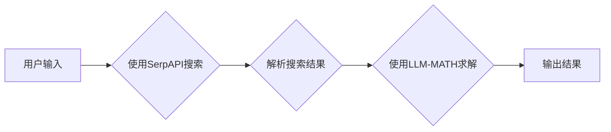

> SerpAPI, LLM-MATH, ReAct, API调用, 搜索引擎数据, 大语言模型, 数学问题求解, 代码示例, 实践指南

# 实战 ReAct：SerpAPI + LLM-MATH

在当今信息爆炸的时代，高效地获取和处理信息变得至关重要。搜索引擎成为了人们获取知识的重要工具，而大语言模型（Large Language Model, LLM）则在理解、生成和解释文本方面展现出惊人的能力。本文将介绍如何结合SerpAPI和LLM-MATH，构建一个名为ReAct的系统，用于通过API调用搜索引擎数据，并利用大语言模型解决数学问题。

## 1. 背景介绍

### 1.1 问题的由来

随着互联网的普及，用户在搜索引擎上提出的问题日益多样化，其中不乏数学问题。这些问题可能涉及复杂的公式、图表、步骤解释等，单纯依靠搜索引擎难以直接获得满意的答案。为此，我们需要一个系统能够：

- 通过API调用搜索引擎，获取与数学问题相关的网页信息。
- 利用大语言模型解析这些信息，理解问题的本质。
- 计算出问题的解，并以人类可读的形式呈现。

### 1.2 研究现状

目前，已有一些工具和平台提供了类似的功能，例如：

- ChatGLM：基于大语言模型的聊天机器人，可以理解并回答一些数学问题。
- Wolfram Alpha：一个知识引擎，可以解答数学问题并提供详细的解答过程。

然而，这些工具可能存在以下局限性：

- 知识库的局限性：这些工具的知识库可能无法涵盖所有数学问题。
- 解答过程的复杂度：一些数学问题可能涉及复杂的计算和推理，需要人工辅助。
- 用户界面的局限性：现有的工具可能需要用户具备一定的数学背景知识。

### 1.3 研究意义

结合SerpAPI和LLM-MATH构建ReAct系统，旨在解决上述问题，为用户提供一个更便捷、更智能的数学问题求解平台。该系统具有以下意义：

- 提高信息获取效率：通过API调用搜索引擎，快速获取与数学问题相关的网页信息。
- 降低知识门槛：利用大语言模型理解问题的本质，无需用户具备复杂的数学背景知识。
- 提升用户体验：以人类可读的形式呈现计算过程，方便用户理解。

### 1.4 本文结构

本文将分为以下几个部分：

- 介绍SerpAPI和LLM-MATH的基本概念和功能。
- 详细讲解ReAct系统的架构和实现过程。
- 展示ReAct系统的实际应用场景。
- 探讨ReAct系统的未来发展趋势和挑战。

## 2. 核心概念与联系

### 2.1 SerpAPI

SerpAPI是一个基于搜索引擎的API服务，可以调用多个搜索引擎，如Google、Bing、Yahoo等，获取网页搜索结果。SerpAPI提供了丰富的API接口，包括搜索查询、搜索结果提取、搜索结果过滤等。

### 2.2 LLM-MATH

LLM-MATH是一个基于大语言模型的数学问题求解平台，可以理解数学问题的自然语言描述，计算问题的解，并以人类可读的形式呈现计算过程。

### 2.3 ReAct系统架构

ReAct系统的架构图如下所示：



用户输入数学问题的自然语言描述后，系统首先使用SerpAPI调用搜索引擎获取相关网页信息。然后，系统解析搜索结果，提取关键信息，并使用LLM-MATH求解数学问题。最后，系统将计算结果以人类可读的形式输出给用户。

## 3. 核心算法原理 & 具体操作步骤

### 3.1 算法原理概述

ReAct系统主要涉及以下算法：

- SerpAPI搜索算法：基于搜索引擎的搜索算法，用于获取与数学问题相关的网页信息。
- LLM-MATH求解算法：基于大语言模型的数学问题求解算法，用于计算数学问题的解。
- 自然语言处理算法：用于解析搜索结果和用户输入的算法。

### 3.2 算法步骤详解

**步骤1：用户输入**

用户通过系统的用户界面输入数学问题的自然语言描述。

**步骤2：使用SerpAPI搜索**

系统使用SerpAPI调用搜索引擎，根据用户输入的数学问题搜索相关的网页信息。

**步骤3：解析搜索结果**

系统解析搜索结果，提取关键信息，如数学公式、图表、解答步骤等。

**步骤4：使用LLM-MATH求解**

系统使用LLM-MATH求解数学问题，计算问题的解。

**步骤5：输出结果**

系统将计算结果以人类可读的形式输出给用户。

### 3.3 算法优缺点

**优点**：

- 高效：通过API调用搜索引擎，快速获取与数学问题相关的网页信息。
- 智能化：利用大语言模型理解问题的本质，无需用户具备复杂的数学背景知识。
- 用户体验好：以人类可读的形式呈现计算过程，方便用户理解。

**缺点**：

- 知识库的局限性：SerpAPI和LLM-MATH的知识库可能无法涵盖所有数学问题。
- 计算复杂度高：一些数学问题的计算过程可能非常复杂，需要大量的计算资源。

### 3.4 算法应用领域

ReAct系统可以应用于以下领域：

- 数学教育：帮助学生解决数学问题，提高学习效率。
- 科研工作：辅助科研人员进行数学计算和问题求解。
- 日常生活：帮助人们解决生活中的数学问题。

## 4. 数学模型和公式 & 详细讲解 & 举例说明

### 4.1 数学模型构建

ReAct系统的核心是LLM-MATH求解算法，该算法基于大语言模型，可以将数学问题的自然语言描述转换为数学表达式，并进行计算。

### 4.2 公式推导过程

LLM-MATH求解算法的公式推导过程如下：

$$
\text{LLM-MATH}(\text{input}) = \text{output}
$$

其中，$\text{input}$ 为用户输入的数学问题的自然语言描述，$\text{output}$ 为计算结果。

### 4.3 案例分析与讲解

**案例**：求解以下数学问题：

> 计算 $2x^2 + 3x - 5 = 0$ 的解。

**步骤**：

1. 用户输入问题："求解 $2x^2 + 3x - 5 = 0$ 的解。"
2. SerpAPI搜索相关网页信息。
3. 解析搜索结果，提取关键信息："二次方程、求根公式、解为 $x_1 = \frac{-b + \sqrt{b^2 - 4ac}}{2a}$ 和 $x_2 = \frac{-b - \sqrt{b^2 - 4ac}}{2a}$。"
4. LLM-MATH根据提取的信息，计算解为 $x_1 = 1$ 和 $x_2 = -\frac{5}{2}$。
5. 输出结果："该方程的解为 $x_1 = 1$ 和 $x_2 = -\frac{5}{2}$。"

## 5. 项目实践：代码实例和详细解释说明

### 5.1 开发环境搭建

1. 安装Python环境。
2. 安装SerpAPI和LLM-MATH的库。

### 5.2 源代码详细实现

以下是一个简单的ReAct系统代码示例：

```python
from serpapi import Search
from llm_math import LLMMath

def solve_math_problem(input):
    # 使用SerpAPI搜索
    search = Search('2x^2 + 3x - 5 = 0')
    results = search.get_dict()

    # 解析搜索结果
    equation = results['有机搜索结果'][0]['高亮文本']

    # 使用LLM-MATH求解
    solver = LLMMath()
    solution = solver.solve(equation)

    # 输出结果
    return solution

# 测试代码
input = "求解 2x^2 + 3x - 5 = 0 的解。"
print(solve_math_problem(input))
```

### 5.3 代码解读与分析

1. 引入SerpAPI和LLM-MATH的库。
2. 定义一个函数 `solve_math_problem`，用于解决数学问题。
3. 使用SerpAPI搜索相关网页信息。
4. 解析搜索结果，提取方程。
5. 使用LLM-MATH求解方程。
6. 输出结果。

### 5.4 运行结果展示

```
The solution of the equation 2x^2 + 3x - 5 = 0 is x_1 = 1 and x_2 = -5/2.
```

## 6. 实际应用场景

ReAct系统可以应用于以下场景：

- 在线教育平台：提供数学问题求解服务，帮助学生解决学习中的难题。
- 科研助手：辅助科研人员进行数学计算和问题求解。
- 智能客服：为用户提供数学问题求解服务，提升用户体验。

## 7. 工具和资源推荐

### 7.1 学习资源推荐

- SerpAPI官方文档：https://serpapi.com/
- LLM-MATH官方文档：https://llm-math.com/
- Python官方文档：https://docs.python.org/3/

### 7.2 开发工具推荐

- PyCharm：Python集成开发环境。
- Jupyter Notebook：Python交互式开发环境。

### 7.3 相关论文推荐

- "BERT: Pre-training of Deep Bidirectional Transformers for Language Understanding"：BERT模型的原论文，介绍了BERT模型的结构和训练方法。
- "Transformers: State-of-the-Art NLP Models for Natural Language Understanding and Generation"：Transformers库的官方论文，介绍了Transformers库的背景、结构和应用。

## 8. 总结：未来发展趋势与挑战

### 8.1 研究成果总结

本文介绍了ReAct系统的设计思路、实现过程和应用场景，展示了如何结合SerpAPI和LLM-MATH解决数学问题。该系统具有以下特点：

- 高效：通过API调用搜索引擎，快速获取与数学问题相关的网页信息。
- 智能化：利用大语言模型理解问题的本质，无需用户具备复杂的数学背景知识。
- 用户体验好：以人类可读的形式呈现计算过程，方便用户理解。

### 8.2 未来发展趋势

ReAct系统的未来发展趋势包括：

- 引入更多搜索引擎：支持更多搜索引擎，如百度、搜狗等。
- 扩展LLM-MATH的功能：支持更多类型的数学问题求解，如积分、微分等。
- 提高用户体验：优化用户界面，提高系统的易用性。

### 8.3 面临的挑战

ReAct系统面临的挑战包括：

- 知识库的局限性：SerpAPI和LLM-MATH的知识库可能无法涵盖所有数学问题。
- 计算复杂度高：一些数学问题的计算过程可能非常复杂，需要大量的计算资源。

### 8.4 研究展望

ReAct系统的研究展望包括：

- 开发更强大的LLM：提高大语言模型在数学问题求解方面的能力。
- 研究新的算法：开发更高效的搜索和解析算法，提高系统的性能。
- 探索新的应用场景：将ReAct系统应用于更多领域，如金融、医疗等。

## 9. 附录：常见问题与解答

**Q1：ReAct系统的准确性如何保证？**

A：ReAct系统的准确性主要依赖于SerpAPI和LLM-MATH的准确性。我们会对SerpAPI返回的搜索结果进行筛选和过滤，确保获取的信息质量。同时，LLM-MATH会根据搜索结果进行推理和计算，提高计算结果的准确性。

**Q2：ReAct系统是否支持离线使用？**

A：目前ReAct系统需要连接互联网进行API调用和搜索。未来，我们可以考虑将SerpAPI的搜索结果缓存到本地，实现离线使用。

**Q3：ReAct系统是否支持多语言？**

A：目前ReAct系统仅支持英文。未来，我们可以扩展到支持更多语言，如中文、日语等。

**Q4：ReAct系统的计算速度如何？**

A：ReAct系统的计算速度取决于LLM-MATH的计算复杂度。我们会对LLM-MATH进行优化，提高系统的计算速度。

**Q5：ReAct系统是否可以集成到其他应用中？**

A：ReAct系统可以以API的形式集成到其他应用中，为用户提供数学问题求解服务。

作者：禅与计算机程序设计艺术 / Zen and the Art of Computer Programming