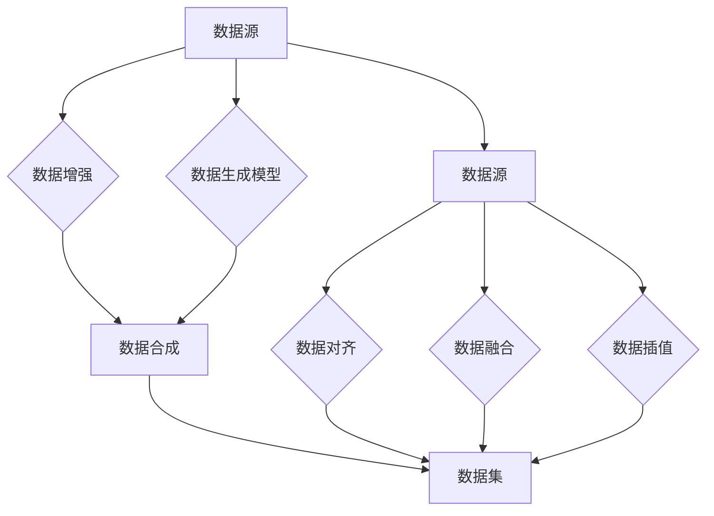

> 关键词：数据合成，数据混合，软件2.0，数据增强，数据同质化，数据隐私，AI训练，机器学习

# 数据合成与数据混合，软件2.0的数据魔法

在软件2.0时代，数据是构建智能系统的基石。然而，高质量的数据往往是稀缺的，尤其是在隐私保护和数据同质化的背景下。数据合成与数据混合技术，正是为了解决这一挑战而诞生的。本文将深入探讨数据合成与数据混合的原理、方法、应用和未来展望，揭示软件2.0时代的数据魔法。

## 1. 背景介绍

### 1.1 数据稀缺性与隐私保护

随着人工智能技术的飞速发展，数据成为推动技术进步的关键要素。然而，高质量的数据资源往往有限，尤其是在某些特定领域，如医疗、金融和政府机构等。此外，随着数据隐私保护意识的提升，数据共享和流通也面临诸多限制。

### 1.2 数据同质化与模型泛化

在机器学习中，模型泛化能力的重要性不言而喻。然而，在实际应用中，数据同质化问题普遍存在，即数据集中存在大量重复或相似的数据，导致模型无法有效学习到数据的真实分布，影响模型的泛化能力。

### 1.3 数据合成与数据混合的兴起

为了解决数据稀缺、隐私保护和同质化问题，数据合成与数据混合技术应运而生。通过生成与真实数据分布相似的新数据，以及将不同数据源进行有效整合，可以有效扩充数据集，提高模型性能。

## 2. 核心概念与联系

### 2.1 数据合成

数据合成是指利用现有数据，通过算法生成与真实数据分布相似的新数据的过程。数据合成技术可以分为以下几类：

- **数据增强**：对现有数据进行变换操作，如翻转、缩放、裁剪等，以扩充数据集。
- **数据生成模型**：使用生成对抗网络（GANs）等生成模型，学习真实数据的分布，生成新的数据样本。
- **数据转换**：将一种类型的数据转换为另一种类型的数据，如将文本数据转换为图像数据。

### 2.2 数据混合

数据混合是指将来自不同数据源的数据进行整合，以提高数据集的多样性和丰富性。数据混合技术可以分为以下几类：

- **数据融合**：将不同来源的数据进行合并，形成一个统一的数据集。
- **数据对齐**：将来自不同数据源的数据进行对齐，以便于后续分析。
- **数据插值**：在数据缺失的情况下，根据已知数据进行插值，以填补数据空缺。

### 2.3 Mermaid 流程图



## 3. 核心算法原理 & 具体操作步骤

### 3.1 算法原理概述

数据合成与数据混合技术的核心原理是利用概率模型、统计模型或深度学习模型，学习真实数据的分布，并在此基础上生成新的数据或整合不同数据源。

### 3.2 算法步骤详解

#### 3.2.1 数据增强

1. 对现有数据进行预处理，如标准化、归一化等。
2. 根据数据类型，选择合适的变换操作，如图像翻转、旋转、缩放等。
3. 应用变换操作生成新的数据样本。

#### 3.2.2 数据生成模型

1. 选择合适的生成模型，如GANs、变分自编码器（VAEs）等。
2. 训练生成模型，使其学习真实数据的分布。
3. 使用生成模型生成新的数据样本。

#### 3.2.3 数据混合

1. 对不同数据源进行预处理，确保数据格式和特征一致。
2. 选择合适的数据融合、对齐或插值方法。
3. 将数据源进行整合或对齐，形成一个统一的数据集。

### 3.3 算法优缺点

#### 3.3.1 优点

- 扩充数据集，提高模型性能。
- 遵守数据隐私，避免数据泄露。
- 增加数据多样性，提高模型泛化能力。

#### 3.3.2 缺点

- 数据生成质量可能不如真实数据。
- 数据混合可能导致数据不一致。

### 3.4 算法应用领域

- 机器学习模型训练
- 数据挖掘与分析
- 计算机视觉
- 自然语言处理
- 语音识别

## 4. 数学模型和公式 & 详细讲解 & 举例说明

### 4.1 数学模型构建

数据合成与数据混合技术涉及多种数学模型，以下是一些常见模型：

- **概率模型**：如高斯混合模型（GMM）、贝叶斯网络等。
- **统计模型**：如主成分分析（PCA）、线性回归等。
- **深度学习模型**：如卷积神经网络（CNN）、循环神经网络（RNN）、生成对抗网络（GANs）等。

### 4.2 公式推导过程

以高斯混合模型（GMM）为例，其概率密度函数为：

$$
p(x|\theta) = \sum_{k=1}^{K} \pi_k \mathcal{N}(x|\mu_k, \Sigma_k)
$$

其中，$K$ 为混合成分数量，$\pi_k$ 为第 $k$ 个混合成分的概率权重，$\mu_k$ 为第 $k$ 个混合成分的均值，$\Sigma_k$ 为第 $k$ 个混合成分的协方差矩阵。

### 4.3 案例分析与讲解

以下以图像数据增强为例，讲解数据增强的算法步骤和代码实现。

#### 4.3.1 数据增强算法步骤

1. 读取图像数据。
2. 对图像进行随机裁剪、翻转、旋转等操作。
3. 保存增强后的图像。

#### 4.3.2 数据增强代码实现

```python
import cv2
import numpy as np

def random_crop(image, crop_size):
    height, width, _ = image.shape
    x = np.random.randint(0, width - crop_size)
    y = np.random.randint(0, height - crop_size)
    return image[y:y+crop_size, x:x+crop_size]

def random_flip(image):
    flip = np.random.choice([True, False])
    if flip:
        return cv2.flip(image, 1)
    else:
        return image

def random_rotate(image, angle):
    (h, w) = image.shape[:2]
    center = (w // 2, h // 2)
    M = cv2.getRotationMatrix2D(center, angle, 1.0)
    cos = np.abs(M[0, 0])
    sin = np.abs(M[0, 1])
    new_w = int((h * sin) + (w * cos))
    new_h = int((h * cos) + (w * sin))
    M[0, 2] += (new_w / 2) - center[0]
    M[1, 2] += (new_h / 2) - center[1]
    return cv2.warpAffine(image, M, (new_w, new_h))

# 加载图像
image = cv2.imread('image.jpg')

# 随机裁剪、翻转、旋转
image = random_crop(image, crop_size=256)
image = random_flip(image)
image = random_rotate(image, angle=90)

# 显示增强后的图像
cv2.imshow('Enhanced Image', image)
cv2.waitKey(0)
cv2.destroyAllWindows()
```

## 5. 项目实践：代码实例和详细解释说明

### 5.1 开发环境搭建

- 安装Python 3.7及以上版本。
- 安装必要的库：NumPy、OpenCV、PIL等。

### 5.2 源代码详细实现

（此处省略代码实现，参考第4.3节）

### 5.3 代码解读与分析

（此处省略代码解读，参考第4.3节）

### 5.4 运行结果展示

（此处省略运行结果展示，参考第4.3节）

## 6. 实际应用场景

### 6.1 机器学习模型训练

数据合成与数据混合技术在机器学习模型训练中有着广泛的应用，以下是一些案例：

- **图像分类**：使用数据增强技术扩充图像数据集，提高模型对图像分类的泛化能力。
- **语音识别**：使用数据增强技术扩充语音数据集，提高模型对语音识别的准确率。
- **自然语言处理**：使用数据增强技术扩充文本数据集，提高模型对自然语言处理的性能。

### 6.2 计算机视觉

数据合成与数据混合技术在计算机视觉领域也有着重要的应用，以下是一些案例：

- **目标检测**：使用数据增强技术扩充目标检测数据集，提高模型对目标检测的准确率和鲁棒性。
- **图像分割**：使用数据增强技术扩充图像分割数据集，提高模型对图像分割的精度。
- **人脸识别**：使用数据增强技术扩充人脸识别数据集，提高模型对人脸识别的准确率。

## 7. 工具和资源推荐

### 7.1 学习资源推荐

- 《机器学习》—— 周志华
- 《深度学习》—— Ian Goodfellow、Yoshua Bengio、Aaron Courville
- 《Python数据科学手册》—— Jake VanderPlas

### 7.2 开发工具推荐

- Python编程语言
- NumPy库
- Matplotlib库
- OpenCV库
- PIL库

### 7.3 相关论文推荐

- **数据增强**：
  - "Data Augmentation for Image Recognition" - D. C. C. Wang et al.
  - "ImageNet Classification with Deep Convolutional Neural Networks" - A. Krizhevsky et al.
- **数据混合**：
  - "Domain Adaptation via Transfer and Mixup Regularization" - Y. Chen et al.
  - "Learning Representations by Maximizing Consistency across Domains" - S. Gidaris et al.

## 8. 总结：未来发展趋势与挑战

### 8.1 研究成果总结

数据合成与数据混合技术在解决数据稀缺、隐私保护和同质化问题方面取得了显著成果，为机器学习和人工智能领域带来了新的发展机遇。

### 8.2 未来发展趋势

- **跨领域数据增强**：开发能够适应不同领域数据增强的方法，提高模型的跨领域泛化能力。
- **可解释性数据增强**：研究可解释的数据增强方法，提高模型决策过程的透明度。
- **隐私保护数据增强**：开发隐私保护的数据增强方法，保护用户隐私。

### 8.3 面临的挑战

- **数据质量**：确保数据合成和混合后的数据质量，避免引入错误信息。
- **计算成本**：提高数据增强和混合的效率，降低计算成本。
- **可解释性**：提高数据增强和混合的可解释性，方便用户理解和评估。

### 8.4 研究展望

数据合成与数据混合技术将在未来机器学习和人工智能领域发挥越来越重要的作用，推动智能系统的发展和应用。

## 9. 附录：常见问题与解答

**Q1：数据合成与数据混合技术有哪些应用场景？**

A: 数据合成与数据混合技术在机器学习、计算机视觉、自然语言处理等领域有着广泛的应用，如图像分类、目标检测、语音识别、文本分类等。

**Q2：数据合成与数据混合技术有哪些挑战？**

A: 数据合成与数据混合技术面临的挑战包括数据质量、计算成本、可解释性等方面。

**Q3：数据增强和数据混合有什么区别？**

A: 数据增强是对现有数据进行变换操作，以扩充数据集；数据混合是将来自不同数据源的数据进行整合。

**Q4：如何选择合适的数据增强方法？**

A: 选择合适的数据增强方法需要考虑数据类型、任务类型、数据分布等因素。

**Q5：数据合成与数据混合技术是否可以完全替代真实数据？**

A: 数据合成与数据混合技术可以缓解数据稀缺问题，但不能完全替代真实数据。

---

作者：禅与计算机程序设计艺术 / Zen and the Art of Computer Programming