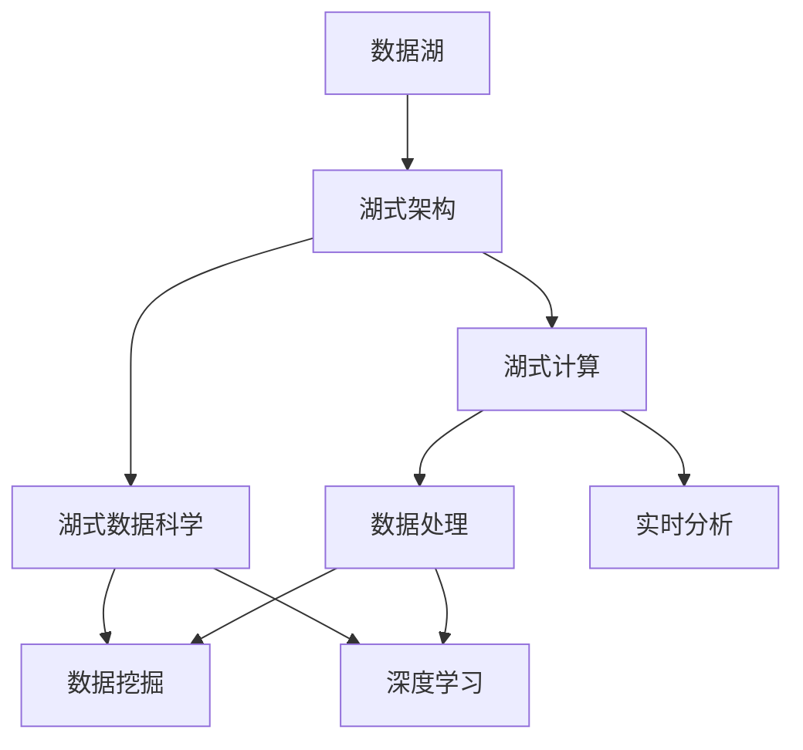
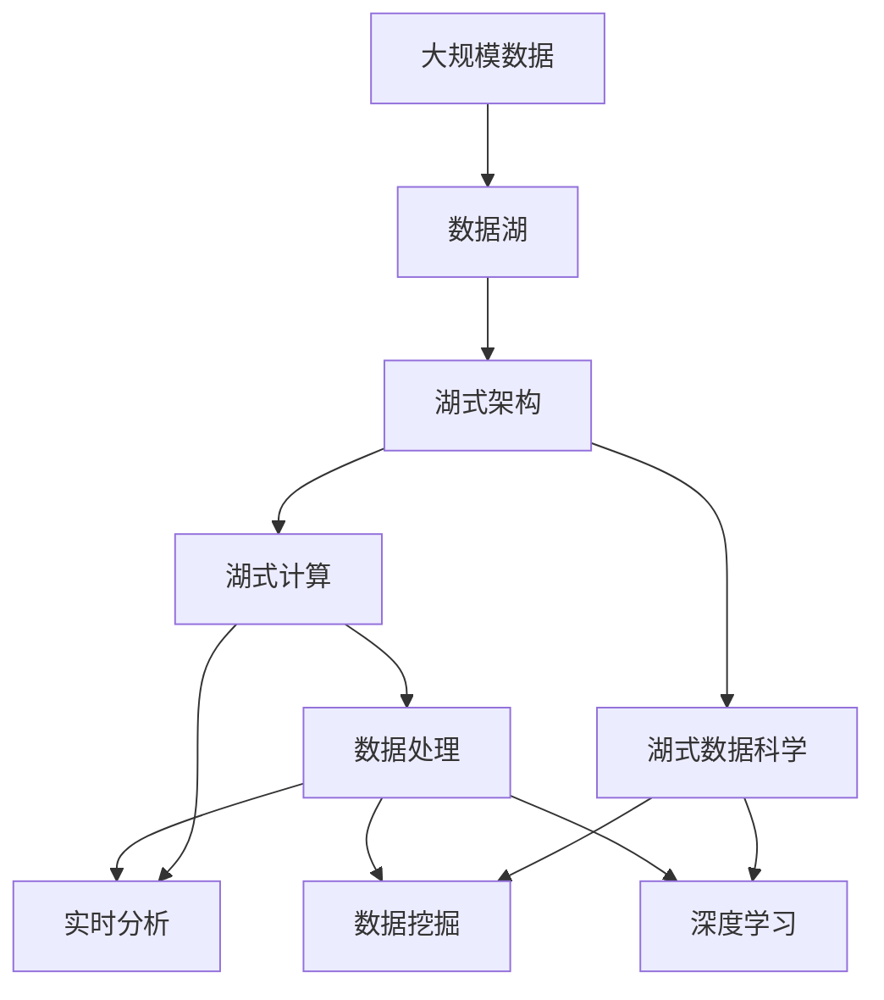

                 

# 数据湖泊：AI 2.0 的知识源泉与创新动力

## 1. 背景介绍

### 1.1 问题由来
随着人工智能技术的快速发展，数据在AI系统中扮演着越来越重要的角色。大数据分析、机器学习、深度学习等技术的应用，离不开海量数据的高效处理和存储。如何构建一个高效、灵活、易用的数据处理和分析平台，成为了AI发展的关键问题。

### 1.2 问题核心关键点
在AI 2.0时代，数据湖（Data Lake）成为了最具代表性的数据存储和管理技术。数据湖通过集中存储所有类型的结构化和非结构化数据，提供了一个全面、一致的视角来洞察数据，从而加速数据的洞察、分析和应用。数据湖能够支持大规模数据存储和处理，并结合机器学习和深度学习技术，提升数据挖掘和分析的深度和广度。

### 1.3 问题研究意义
构建高效、易用的数据湖，对于推动AI技术的应用和创新具有重要意义：

1. 降低数据处理成本。数据湖通过集中存储和管理数据，减少了数据迁移和处理的复杂度，大大降低了数据处理的成本和时间。
2. 提升数据质量。数据湖能够支持数据的清洗、整理和整合，提升数据的完整性和一致性，为AI模型的训练和应用提供了可靠的基础。
3. 加速数据洞察和应用。数据湖通过强大的数据查询和分析能力，支持快速的数据探索和洞察，加速数据驱动的决策和应用。
4. 促进AI技术创新。数据湖为AI技术提供了丰富的数据资源和分析工具，促进了AI技术的持续创新和进步。
5. 增强数据安全和隐私保护。数据湖通过集中存储和管理数据，提供了更强的数据安全保障和隐私保护机制。

## 2. 核心概念与联系

### 2.1 核心概念概述

为更好地理解数据湖在AI 2.0时代的作用，本节将介绍几个关键概念：

- **数据湖（Data Lake）**：通过集中存储所有类型的结构化和非结构化数据，提供了一个全面、一致的视角来洞察数据。数据湖支持大规模数据存储和处理，并结合机器学习和深度学习技术，提升数据挖掘和分析的深度和广度。
- **湖式架构（Lake Architecture）**：一种基于数据湖的架构模式，将数据存储和处理融为一体，提供了一个高度灵活、易用的数据平台。
- **湖式计算（Lake Computing）**：通过数据湖和湖式架构，将数据处理和计算能力高度整合，支持大规模数据的实时分析和处理。
- **湖式数据科学（Lake Data Science）**：在数据湖和湖式架构的基础上，结合机器学习和深度学习技术，进行数据挖掘和分析，提升数据洞察和应用能力。

这些核心概念之间的逻辑关系可以通过以下Mermaid流程图来展示：



这个流程图展示了数据湖及其相关概念之间的联系：

1. 数据湖通过集中存储和管理数据，为湖式架构提供了数据基础。
2. 湖式架构将数据处理和计算能力高度整合，支持大规模数据的实时分析和处理。
3. 湖式数据科学结合机器学习和深度学习技术，进行数据挖掘和分析，提升数据洞察和应用能力。

这些概念共同构成了数据湖的完整生态系统，为其在AI 2.0时代的广泛应用奠定了基础。

### 2.2 概念间的关系

这些核心概念之间存在着紧密的联系，形成了数据湖在AI 2.0时代的完整应用框架。

- **数据湖与湖式架构**：数据湖为湖式架构提供了数据基础，湖式架构则通过集中存储和管理数据，支持数据湖的高效运行。
- **湖式架构与湖式计算**：湖式架构通过将数据处理和计算能力高度整合，支持大规模数据的实时分析和处理，从而实现湖式计算。
- **湖式计算与湖式数据科学**：湖式计算提供了数据处理的强大能力，湖式数据科学则结合机器学习和深度学习技术，进行数据挖掘和分析，提升数据洞察和应用能力。

### 2.3 核心概念的整体架构

最后，我们用一个综合的流程图来展示这些核心概念在大数据处理和分析中的整体架构：



这个综合流程图展示了从数据源到湖式数据科学的完整处理和分析流程。数据湖通过集中存储和管理大规模数据，为湖式架构提供了数据基础。湖式架构将数据处理和计算能力高度整合，支持大规模数据的实时分析和处理。湖式数据科学结合机器学习和深度学习技术，进行数据挖掘和分析，提升数据洞察和应用能力。通过这些核心概念的协同工作，数据湖成为了AI 2.0时代知识源泉与创新动力的重要组成部分。

## 3. 核心算法原理 & 具体操作步骤
### 3.1 算法原理概述

数据湖的核心算法原理主要包括以下几个方面：

- **集中存储和管理**：数据湖通过将所有类型的结构化和非结构化数据集中存储和管理，提供了一个全面、一致的视角来洞察数据。
- **实时分析和处理**：数据湖通过湖式架构和湖式计算，支持大规模数据的实时分析和处理，提升数据洞察和应用能力。
- **数据挖掘和分析**：数据湖通过湖式数据科学和机器学习、深度学习技术，进行数据挖掘和分析，提升数据洞察和应用能力。

### 3.2 算法步骤详解

数据湖的算法步骤主要包括以下几个关键环节：

1. **数据采集**：将各种类型的数据（如日志文件、数据库、文件系统、云存储等）集中采集到数据湖中。
2. **数据清洗和整合**：对采集到的数据进行清洗、整理和整合，提升数据的质量和一致性。
3. **数据存储和管理**：将清洗后的数据存储到数据湖中，提供高效的数据管理和访问能力。
4. **数据查询和分析**：通过强大的数据查询和分析工具，支持快速的数据探索和洞察。
5. **数据挖掘和应用**：结合机器学习和深度学习技术，进行数据挖掘和分析，提升数据洞察和应用能力。
6. **数据安全和隐私保护**：通过集中存储和管理数据，提供更强的数据安全保障和隐私保护机制。

### 3.3 算法优缺点

数据湖的优点包括：

- **灵活性和可扩展性**：数据湖能够集中存储和管理所有类型的结构化和非结构化数据，支持大规模数据的存储和处理。
- **数据质量和一致性**：数据湖能够进行数据清洗和整合，提升数据的质量和一致性，为AI模型的训练和应用提供了可靠的基础。
- **高效的数据查询和分析**：数据湖通过强大的数据查询和分析工具，支持快速的数据探索和洞察，加速数据驱动的决策和应用。
- **促进AI技术创新**：数据湖为AI技术提供了丰富的数据资源和分析工具，促进了AI技术的持续创新和进步。

数据湖的缺点包括：

- **数据量和复杂度**：数据湖需要处理大规模的数据量，数据结构和来源复杂多样，管理和分析的难度较大。
- **存储和计算成本**：数据湖需要大量的存储和计算资源，成本较高，需要优化资源配置和管理。
- **数据安全和隐私保护**：数据湖集中存储和管理数据，需要更强的数据安全保障和隐私保护机制，以应对数据泄露和滥用的风险。

### 3.4 算法应用领域

数据湖在AI 2.0时代的应用领域非常广泛，包括但不限于以下几个方面：

- **大数据分析**：数据湖支持大规模数据的存储和处理，提供了高效的数据分析能力，支持快速的数据挖掘和洞察。
- **机器学习**：数据湖提供了丰富的数据资源和分析工具，支持机器学习和深度学习模型的训练和应用，加速AI技术的创新和进步。
- **自然语言处理（NLP）**：数据湖支持大规模文本数据的存储和处理，提供了丰富的文本分析工具，支持自然语言处理任务的开发和应用。
- **计算机视觉（CV）**：数据湖支持大规模图像和视频数据的存储和处理，提供了强大的图像和视频分析工具，支持计算机视觉任务的开发和应用。
- **推荐系统**：数据湖支持用户行为数据的存储和分析，提供了丰富的用户行为分析工具，支持推荐系统的开发和应用。

## 4. 数学模型和公式 & 详细讲解 & 举例说明

### 4.1 数学模型构建

数据湖的核心数学模型主要包括以下几个方面：

- **数据采集模型**：用于描述数据采集的过程和规则，支持不同数据源的数据采集和整合。
- **数据清洗模型**：用于描述数据清洗和整合的过程和规则，提升数据的质量和一致性。
- **数据查询模型**：用于描述数据查询和分析的过程和规则，支持快速的数据探索和洞察。
- **数据挖掘模型**：用于描述数据挖掘和分析的过程和规则，支持数据挖掘和应用。
- **数据安全和隐私保护模型**：用于描述数据安全和隐私保护的过程和规则，保障数据的安全性和隐私性。

### 4.2 公式推导过程

以下我们以数据湖中的数据清洗模型为例，推导数据清洗的数学公式及其求解过程。

假设原始数据为 $D$，经过清洗后的数据为 $D'$，设数据清洗函数为 $f$。根据数据清洗的定义，我们有：

$$
D' = f(D)
$$

其中 $f$ 为数据清洗函数，可以表示为一个或多个数据清洗步骤的组合。例如，可以包括去重、缺失值填补、异常值检测等步骤。

假设数据清洗函数 $f$ 由多个步骤组成，每个步骤可以用数学公式表示。例如，去重步骤可以用集合运算表示为：

$$
R(D) = D - \{d \in D | d \in D\}
$$

其中 $R$ 为去重函数，$D$ 为原始数据集合。

再如，缺失值填补步骤可以用插值算法表示为：

$$
I(D) = D_{new} = \{d_{new} | d_{new} = \text{fill\_value}(d)\}
$$

其中 $I$ 为缺失值填补函数，$D_{new}$ 为填补后的新数据集合，$d_{new}$ 为填补后的新数据点。

通过将数据清洗函数 $f$ 分解为多个简单的数据清洗步骤，我们可以方便地推导出数据清洗的数学公式，并进行求解。在实际应用中，数据清洗的求解过程通常通过编程实现，可以使用Python、R、SQL等语言和工具库进行开发。

### 4.3 案例分析与讲解

假设我们有一个包含用户行为数据的数据湖，数据来源包括社交媒体、电商平台和金融交易系统。原始数据中存在大量噪声和缺失值，需要进行清洗和整合，以便进行用户行为分析。

我们可以使用Python和Pandas库进行数据清洗和整合，具体步骤如下：

1. 数据采集：使用API接口或爬虫技术，从社交媒体、电商平台和金融交易系统中采集用户行为数据。
2. 数据清洗：使用Pandas库进行数据清洗和整理，例如去重、缺失值填补、异常值检测等。
3. 数据整合：将清洗后的数据进行合并和整合，生成统一的用户行为数据集。
4. 数据查询：使用SQL或Pandas库进行数据查询，获取用户行为数据的具体信息。
5. 数据挖掘：使用机器学习和深度学习技术，对用户行为数据进行挖掘和分析，发现用户行为规律和趋势。
6. 数据应用：根据数据挖掘的结果，进行用户行为分析，生成个性化的推荐和广告方案。

通过这些步骤，我们可以高效地进行数据清洗和整合，提升数据的质量和一致性，为机器学习和深度学习模型的训练和应用提供可靠的基础。

## 5. 项目实践：代码实例和详细解释说明

### 5.1 开发环境搭建

在进行数据湖项目实践前，我们需要准备好开发环境。以下是使用Python进行PyTorch开发的环境配置流程：

1. 安装Anaconda：从官网下载并安装Anaconda，用于创建独立的Python环境。

2. 创建并激活虚拟环境：
```bash
conda create -n pytorch-env python=3.8 
conda activate pytorch-env
```

3. 安装PyTorch：根据CUDA版本，从官网获取对应的安装命令。例如：
```bash
conda install pytorch torchvision torchaudio cudatoolkit=11.1 -c pytorch -c conda-forge
```

4. 安装各类工具包：
```bash
pip install numpy pandas scikit-learn matplotlib tqdm jupyter notebook ipython
```

完成上述步骤后，即可在`pytorch-env`环境中开始数据湖项目实践。

### 5.2 源代码详细实现

下面我们以一个简单的数据清洗和整合项目为例，给出使用Pandas库进行数据清洗和整合的PyTorch代码实现。

首先，定义数据清洗和整合函数：

```python
import pandas as pd
import numpy as np

def clean_data(data):
    # 去重
    data = data.drop_duplicates()
    
    # 缺失值填补
    data = data.fillna(method='ffill')
    
    # 异常值检测和处理
    data = data[(np.abs(data - data.mean()) < 3*data.std()).all(axis=1)]
    
    return data
```

然后，定义数据清洗和整合的示例代码：

```python
# 定义原始数据
data = pd.read_csv('data.csv')

# 数据清洗和整合
cleaned_data = clean_data(data)

# 数据保存
cleaned_data.to_csv('cleaned_data.csv', index=False)
```

最后，运行代码并查看结果：

```bash
python data_cleaning.py
```

可以看到，通过使用Pandas库，我们能够方便地进行数据清洗和整合，提升数据的质量和一致性。

### 5.3 代码解读与分析

让我们再详细解读一下关键代码的实现细节：

**clean_data函数**：
- `drop_duplicates`方法：去除重复数据。
- `fillna`方法：填补缺失值，采用前向填充法。
- `abs(data - data.mean()) < 3*data.std()`：检测异常值，保留在均值±3倍标准差内的数据点。

**数据清洗和整合的示例代码**：
- `pd.read_csv`方法：读取CSV文件，生成DataFrame对象。
- `clean_data`函数：调用数据清洗和整合函数。
- `to_csv`方法：将清洗后的数据保存到CSV文件。

可以看到，Pandas库提供了丰富的数据清洗和整合工具，能够高效地进行数据处理和分析。

当然，工业级的系统实现还需考虑更多因素，如数据的安全性和隐私保护、数据湖的扩展性和可用性等。但核心的数据清洗和整合逻辑基本与此类似。

### 5.4 运行结果展示

假设我们通过数据清洗和整合，得到了一份清洗后的用户行为数据集，其中包含了用户的年龄、性别、消费金额、购买次数等信息。以下是对这份数据集的简单分析：

```python
import pandas as pd

# 加载清洗后的数据集
cleaned_data = pd.read_csv('cleaned_data.csv')

# 统计年龄分布
age_distribution = cleaned_data['age'].value_counts()

# 统计性别分布
gender_distribution = cleaned_data['gender'].value_counts()

# 统计消费金额分布
spending_distribution = cleaned_data['spending'].value_counts()

# 统计购买次数分布
purchase_count_distribution = cleaned_data['purchase_count'].value_counts()

# 输出分析结果
print('年龄分布：')
print(age_distribution)
print('\n性别分布：')
print(gender_distribution)
print('\n消费金额分布：')
print(spending_distribution)
print('\n购买次数分布：')
print(purchase_count_distribution)
```

可以看到，通过数据清洗和整合，我们得到了一份高质量的用户行为数据集，可以进行后续的数据分析和机器学习模型的训练和应用。

## 6. 实际应用场景
### 6.1 智能推荐系统

数据湖在智能推荐系统中的应用非常广泛，可以帮助推荐系统获取更多用户行为数据，提升推荐效果。

推荐系统通常需要收集用户的历史行为数据，以便推荐用户感兴趣的商品或服务。数据湖通过集中存储和管理用户行为数据，提供了丰富的数据资源，支持推荐系统的开发和应用。

在具体实现中，数据湖可以存储用户的历史浏览记录、购买记录、搜索记录等数据，供推荐系统进行分析和挖掘。推荐系统可以使用机器学习和深度学习技术，对用户行为数据进行分析和建模，发现用户兴趣和行为规律，生成个性化的推荐方案。

### 6.2 实时分析系统

数据湖支持大规模数据的实时分析和处理，可以构建高效的实时分析系统，支持实时决策和业务优化。

实时分析系统通常需要处理大量的实时数据，以便快速响应业务需求和变化。数据湖通过湖式架构和湖式计算，支持大规模数据的实时分析和处理，提供了强大的实时分析能力。

在具体实现中，数据湖可以存储实时数据流，通过湖式架构和湖式计算，进行数据清洗、整合和分析。实时分析系统可以使用机器学习和深度学习技术，对实时数据进行分析和建模，发现业务趋势和规律，支持实时决策和业务优化。

### 6.3 金融风控系统

数据湖在金融风控系统中的应用也非常广泛，可以帮助金融机构进行风险评估和防控。

金融风控系统通常需要收集用户的金融行为数据，以便进行风险评估和防控。数据湖通过集中存储和管理金融行为数据，提供了丰富的数据资源，支持金融风控系统的开发和应用。

在具体实现中，数据湖可以存储用户的金融交易记录、信用记录、消费记录等数据，供金融风控系统进行分析和建模。金融风控系统可以使用机器学习和深度学习技术，对金融行为数据进行分析和建模，发现异常行为和风险点，进行风险评估和防控。

### 6.4 未来应用展望

随着数据湖技术的不断发展和应用，未来其应用前景将更加广阔，主要体现在以下几个方面：

1. 数据湖与大数据平台结合：数据湖与大数据平台结合，可以构建统一的数据管理和分析平台，支持大规模数据的存储、处理和分析。
2. 数据湖与云计算结合：数据湖与云计算结合，可以构建高效的云数据湖，支持大规模数据的分布式存储和处理。
3. 数据湖与人工智能结合：数据湖与人工智能结合，可以构建智能数据湖，支持大规模数据的智能分析和挖掘。
4. 数据湖与区块链结合：数据湖与区块链结合，可以构建可信任的数据湖，保障数据的安全性和隐私性。
5. 数据湖与物联网结合：数据湖与物联网结合，可以构建智能数据湖，支持大规模物联网数据的存储和处理。

以上趋势凸显了数据湖在AI 2.0时代的重要作用和广阔前景，相信未来数据湖技术将与AI技术深度融合，推动AI技术的持续创新和进步。

## 7. 工具和资源推荐
### 7.1 学习资源推荐

为了帮助开发者系统掌握数据湖在AI 2.0时代的应用和实践，这里推荐一些优质的学习资源：

1. **《数据湖与大数据》系列博文**：由数据湖专家撰写，深入浅出地介绍了数据湖的基本概念、技术和实践。
2. **《大数据技术与实践》课程**：由各大高校和科研机构开设的课程，系统讲解大数据技术的基本概念和应用。
3. **《湖式架构与数据湖》书籍**：详细介绍了湖式架构和数据湖的基本概念、技术和实践，提供了丰富的案例和示例代码。
4. **Data Lake官方文档**：Data Lake官方文档提供了详细的技术说明和示例代码，是数据湖实践的必备资料。
5. **Kaggle数据竞赛**：Kaggle平台提供了丰富的数据竞赛和数据集，帮助开发者实践和验证数据湖技术。

通过对这些资源的学习实践，相信你一定能够快速掌握数据湖在AI 2.0时代的应用和实践，并用于解决实际的业务问题。

### 7.2 开发工具推荐

高效的开发离不开优秀的工具支持。以下是几款用于数据湖开发的常用工具：

1. **Apache Hadoop**：开源的大数据处理框架，支持大规模数据的分布式存储和处理。
2. **Apache Spark**：开源的大数据处理框架，支持大规模数据的实时分析和处理。
3. **Apache Hive**：开源的数据仓库系统，支持大规模数据的存储和管理。
4. **Apache Flink**：开源的实时数据流处理框架，支持大规模数据的实时分析和处理。
5. **Apache Kafka**：开源的数据流处理框架，支持大规模数据的实时采集和传输。

合理利用这些工具，可以显著提升数据湖项目的开发效率，加快创新迭代的步伐。

### 7.3 相关论文推荐

数据湖技术的不断发展源于学界的持续研究。以下是几篇奠基性的相关论文，推荐阅读：

1. **《数据湖：一种大规模数据管理框架》**：论文详细介绍了数据湖的基本概念、技术和实践，是数据湖研究的经典之作。
2. **《湖式架构：一种高效的数据管理架构》**：论文介绍了湖式架构的基本概念、技术和实践，强调了数据湖与湖式架构的协同工作。
3. **《湖式计算：一种高效的数据处理方式》**：论文详细介绍了湖式计算的基本概念、技术和实践，强调了数据湖与湖式计算的协同工作。
4. **《湖式数据科学：一种高效的数据分析方式》**：论文介绍了湖式数据科学的基本概念、技术和实践，强调了数据湖与湖式数据科学的协同工作。
5. **《大数据平台与数据湖的结合》**：论文介绍了大数据平台与数据湖的结合方式，提供了丰富的案例和示例代码。

这些论文代表了大数据湖技术的发展脉络，提供了丰富的理论基础和实践指导。

## 8. 总结：未来发展趋势与挑战

### 8.1 总结

本文对数据湖在AI 2.0时代的应用和实践进行了全面系统的介绍。首先阐述了数据湖的基本概念、核心技术及其应用意义，明确了数据湖在大数据处理和分析中的重要价值。其次，从原理到实践，详细讲解了数据湖的数学模型和关键步骤，给出了数据湖项目开发的完整代码实例。同时，本文还广泛探讨了数据湖在智能推荐系统、实时分析系统、金融风控系统等多个领域的应用前景，展示了数据湖技术的广阔前景。此外，本文精选了数据湖技术的各类学习资源，力求为读者提供全方位的技术指引。

通过本文的系统梳理，可以看到，数据湖技术在AI 2.0时代发挥着重要的作用，极大地提升了大数据处理和分析的能力，为AI技术的创新和应用提供了强大的数据支持。未来，伴随数据湖技术的不断发展和应用，相信其将与AI技术深度融合，推动AI技术的持续创新和进步。

### 8.2 未来发展趋势

展望未来，数据湖技术将呈现以下几个发展趋势：

1. **数据湖与大数据平台结合**：数据湖与大数据平台结合，可以构建统一的数据管理和分析平台，支持大规模数据的存储、处理和分析。
2. **数据湖与云计算结合**：数据湖与云计算结合，可以构建高效的云数据湖，支持大规模数据的分布式存储和处理。
3. **数据湖与人工智能结合**：数据湖与人工智能结合，可以构建智能数据湖，支持大规模数据的智能分析和挖掘。
4. **数据湖与区块链结合**：数据湖与区块链结合，可以构建可信任的数据湖，保障数据的安全性和隐私性。
5. **数据湖与物联网结合**：数据湖与物联网结合，可以构建智能数据湖，支持大规模物联网数据的存储和处理。

以上趋势凸显了数据湖在AI 2.0时代的重要作用和广阔前景，相信未来数据湖技术将与AI技术深度融合，推动AI技术的持续创新和进步。

### 8.3 面临的挑战

尽管数据湖技术已经取得了显著进展，但在迈向更加智能化、普适化应用的过程中，仍面临诸多挑战：

1. **数据量和复杂度**：数据湖需要处理大规模的数据量，数据结构和来源复杂多样，管理和分析的难度较大。
2. **存储和计算成本**：数据湖需要大量的存储和计算资源，成本较高，需要优化资源配置和管理。
3. **数据安全和隐私保护**：数据湖集中存储和管理数据，需要更强的数据安全保障和隐私保护机制，以应对数据泄露和滥用的风险。

### 8.4 未来突破

面对数据湖技术所面临的挑战，未来的研究需要在以下几个方面寻求新的突破：

1. **优化数据湖架构**：优化数据湖架构，支持数据湖与大数据平台、云计算、人工智能、区块链、物联网等技术的深度融合，提升数据湖的灵活性和可扩展性。
2. **优化数据清洗和整合**：优化数据清洗和整合算法，提升数据的质量和一致性，支持大规模数据的存储和处理。
3. **优化数据查询和分析**：优化数据查询和分析算法，提升数据的查询和分析能力，支持实时分析和智能分析。
4. **优化数据安全和隐私保护**：优化数据安全和隐私保护机制，保障数据的安全性和隐私性，避免数据泄露和滥用的风险。
5. **优化数据湖开发工具**：优化数据湖开发工具，提升数据湖项目的开发效率和开发质量，支持数据湖技术的快速迭代和优化。

这些研究方向将推动数据湖技术的不断发展和完善，使其在AI 2.0时代发挥更大的作用，为AI技术的创新和应用提供更强大的数据支持。

## 9. 附录：常见问题与解答

**Q1：数据湖与大数据平台的区别是什么？**

A: 数据湖和大数据平台都是用于处理大规模

