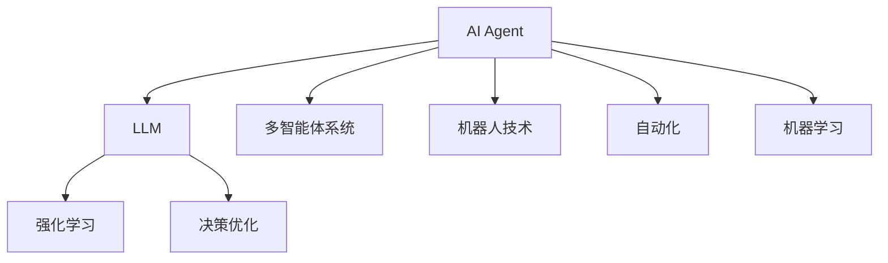
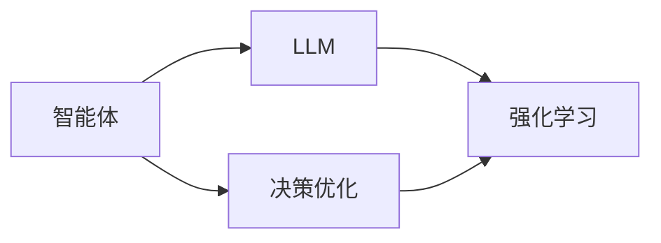
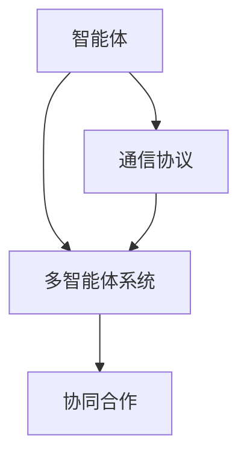
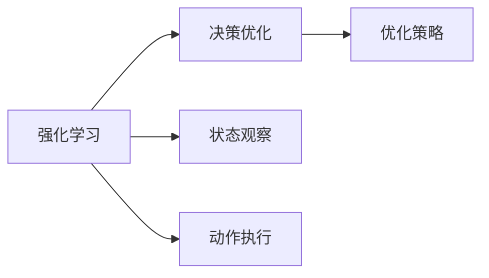
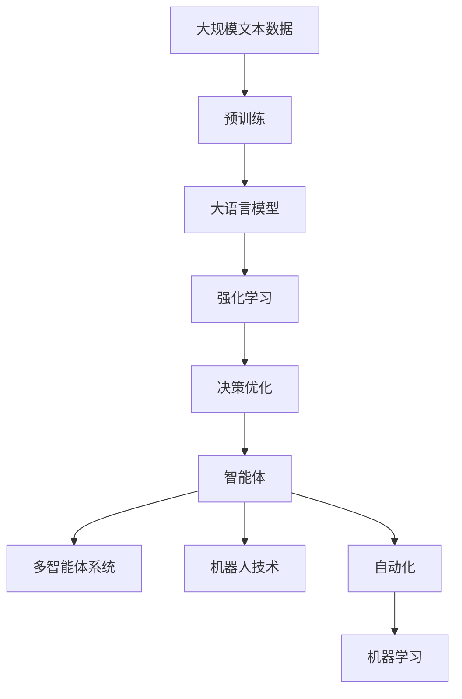

                 

# AI Agent: AI的下一个风口 智能体与LLM的关系

> 关键词：AI Agent, AI智能体,LLM,大语言模型,强化学习,决策优化,多智能体系统,机器人技术,自动化,机器学习

## 1. 背景介绍

### 1.1 问题由来
当前，人工智能(AI)正处于快速发展阶段，各大AI技术逐渐从实验室走向应用，进入了产业化的加速期。在这一过程中，AI Agent，即智能体，作为AI技术的重要组成部分，正逐渐成为AI应用的风口。AI Agent是指通过自主学习与决策，能够在复杂环境中完成特定任务的智能系统，如机器人、自动化控制、自动驾驶等。

与此同时，大语言模型(LLM)作为AI领域的一项重要进展，正在展现出强大的语言理解和生成能力。LLM通过大规模预训练学习到丰富的语言知识，可以完成自然语言处理(NLP)、文本生成、语音识别等多种任务。随着LLM技术的不断进步，其在决策支持、人机交互、智能搜索等领域的应用也在不断拓展。

智能体与大语言模型二者相辅相成，LLM可以提供语义理解和生成能力，而智能体则可以依据语义信息进行决策与行动，构建出更具实用价值的人工智能应用。因此，深入探索智能体与LLM的结合方式，对于推动AI技术的发展与应用具有重要意义。

### 1.2 问题核心关键点
智能体与LLM的结合，本质上是将LLM的知识能力与智能体的决策执行能力有机结合，构建出能够在复杂环境中自主完成任务的智能系统。这一结合的关键点在于：

- 如何高效利用LLM的知识库，构建智能体所需的语义理解和生成能力。
- 如何设计合理的智能体决策与行动策略，使其能够基于LLM的语义信息，灵活应对各种环境变化。
- 如何处理智能体与环境、智能体与智能体之间的交互，实现多智能体的协同合作。

### 1.3 问题研究意义
研究智能体与LLM的结合，对于推动AI技术的实际应用具有重要意义：

- 提升AI系统性能。通过智能体与LLM的结合，可以构建出具备更强大语义理解和生成能力的AI系统，从而提升任务执行的准确性与效率。
- 拓展AI应用场景。智能体与LLM的结合，可以在更多复杂场景下发挥作用，如机器人操作、自动驾驶、医疗诊断等。
- 促进人机交互。LLM可以处理自然语言输入，智能体可以根据语义信息进行决策和行动，从而实现更加自然和智能的人机交互。
- 推动AI技术落地。智能体与LLM的结合，为AI技术的大规模应用提供了新的可能性，有助于加速AI技术的产业化进程。

## 2. 核心概念与联系

### 2.1 核心概念概述

为更好地理解智能体与LLM的结合方式，本节将介绍几个密切相关的核心概念：

- AI Agent：通过自主学习与决策，能够在复杂环境中完成特定任务的智能系统。
- 大语言模型(LLM)：通过大规模预训练学习到丰富的语言知识，能够完成自然语言处理(NLP)、文本生成、语音识别等多种任务。
- 强化学习(Reinforcement Learning, RL)：通过与环境交互，智能体通过试错学习，逐步优化决策策略。
- 决策优化(Decision Optimization)：通过数学模型和优化算法，找到最佳决策方案。
- 多智能体系统(Multi-Agent System)：由多个智能体协同合作，共同完成复杂任务的系统。
- 机器人技术(Robotics)：将AI Agent应用于机器人领域，实现自主决策与行动的机器人系统。
- 自动化(Automation)：通过AI Agent自动执行任务，提高生产效率和质量。
- 机器学习(Machine Learning)：智能体与LLM结合的基础，通过学习积累经验，提高系统性能。

这些核心概念之间的逻辑关系可以通过以下Mermaid流程图来展示：



这个流程图展示了大语言模型与智能体的核心概念及其之间的关系：

1. 大语言模型通过大规模预训练学习到丰富的语言知识，作为智能体的知识来源。
2. 智能体通过强化学习、决策优化等方法，在复杂环境中自主决策和行动。
3. 多智能体系统可以通过协同合作，实现更复杂的任务。
4. 机器人技术与自动化应用可以结合智能体与LLM，实现自动化的决策与行动。
5. 机器学习为智能体与LLM的结合提供了算法基础。

### 2.2 概念间的关系

这些核心概念之间存在着紧密的联系，形成了智能体与大语言模型结合的完整生态系统。下面我们通过几个Mermaid流程图来展示这些概念之间的关系。

#### 2.2.1 智能体与LLM的结合



这个流程图展示了智能体与大语言模型的结合过程：

1. 智能体通过与LLM的交互，获取语义理解和生成能力。
2. 智能体根据获取的语义信息，使用决策优化算法进行决策优化。
3. 智能体在实际环境中通过强化学习不断调整策略，提升决策效果。

#### 2.2.2 智能体与多智能体的结合



这个流程图展示了智能体与多智能体的结合过程：

1. 多个智能体通过通信协议进行信息交互。
2. 智能体在多智能体系统中进行协同合作，共同完成复杂任务。

#### 2.2.3 强化学习与决策优化



这个流程图展示了强化学习与决策优化的关系：

1. 强化学习通过与环境交互，获取状态观察和动作执行的信息。
2. 决策优化通过数学模型和优化算法，找到最佳决策策略。

### 2.3 核心概念的整体架构

最后，我们用一个综合的流程图来展示这些核心概念在大语言模型与智能体结合过程中的整体架构：



这个综合流程图展示了从预训练到智能体结合的完整过程。大语言模型首先在大规模文本数据上进行预训练，然后通过强化学习与决策优化，构建出智能体。智能体可以在多智能体系统中进行协同合作，或应用于机器人技术、自动化等领域，形成具备实际应用价值的AI系统。

## 3. 核心算法原理 & 具体操作步骤
### 3.1 算法原理概述

智能体与大语言模型结合的算法，通常采用强化学习与决策优化的方式，通过与环境交互，不断优化决策策略，实现复杂任务的自主完成。

形式化地，设智能体在环境 $E$ 中的状态为 $s$，动作为 $a$，状态转移为 $s'=\delta(a,s)$，奖励为 $r(a,s)$，智能体的目标是通过学习找到最优的决策策略 $\pi$，使得累计奖励 $\sum_{t=0}^{\infty} \gamma^t r(a_t,s_t)$ 最大化。其中 $\gamma$ 为折扣因子。

在实际应用中，为了提升模型性能，通常会采用基于模型的强化学习方法，如策略梯度、Q-learning等，通过优化模型参数，找到最优的策略。

### 3.2 算法步骤详解

智能体与大语言模型结合的算法步骤如下：

**Step 1: 准备预训练模型和数据集**
- 选择合适的预训练语言模型 $M_{\theta}$ 作为初始化参数，如 GPT、BERT 等。
- 准备环境 $E$ 和目标任务 $T$ 的数据集 $D=\{(s_i,a_i,r_i,s'_i)\}_{i=1}^N$，其中 $s_i$ 为状态，$a_i$ 为动作，$r_i$ 为奖励，$s'_i$ 为状态转移。

**Step 2: 设计决策策略**
- 定义智能体的决策策略 $\pi(a|s)$，通常为概率分布。
- 通过优化算法，如梯度下降，不断更新模型参数，最小化累积奖励。

**Step 3: 执行强化学习训练**
- 在环境 $E$ 中，智能体通过观察状态 $s$，选择动作 $a$，获得奖励 $r$ 并转移到状态 $s'$。
- 根据状态转移和奖励，使用强化学习算法更新模型参数，优化策略 $\pi(a|s)$。
- 重复上述过程直至收敛。

**Step 4: 应用决策优化**
- 在实际任务 $T$ 中，智能体通过观察当前状态 $s$，选择最优动作 $a$，执行动作并观察结果。
- 通过决策优化算法，如线性规划、整数规划等，找到最优动作策略。

**Step 5: 实现多智能体协同**
- 在多智能体系统中，智能体通过通信协议进行信息交互。
- 通过协同优化算法，如分布式优化、群智能等，实现多智能体的协同合作。

### 3.3 算法优缺点

智能体与大语言模型结合的算法具有以下优点：

- 灵活适应性强。智能体可以根据实际环境动态调整策略，适应复杂变化。
- 可解释性好。智能体的决策过程可以逐步优化，易于理解和解释。
- 鲁棒性好。通过多智能体协同，提升系统整体的鲁棒性和稳定性。

同时，该算法也存在一些缺点：

- 学习过程复杂。智能体需要不断与环境交互，学习策略，可能面临高时间复杂度。
- 数据需求量大。智能体需要大量环境数据进行训练，获取状态和动作的信息。
- 模型复杂度高。智能体与大语言模型的结合，可能导致模型复杂度高，训练难度大。

### 3.4 算法应用领域

智能体与大语言模型结合的算法在以下领域得到了广泛应用：

- 智能机器人：通过智能体与大语言模型的结合，实现自主导航、避障、交互等功能。
- 自动化控制：应用于自动化生产线、无人驾驶等领域，实现自主决策与控制。
- 医疗诊断：通过智能体与大语言模型的结合，辅助医生进行疾病诊断和个性化治疗。
- 金融分析：应用于金融市场预测、交易策略优化等领域，实现自主决策和分析。
- 物流管理：应用于仓储自动化、配送路径优化等领域，实现高效物流管理。
- 工业检测：应用于工业设备故障检测、维护策略优化等领域，实现智能检测与维护。

## 4. 数学模型和公式 & 详细讲解 & 举例说明

### 4.1 数学模型构建

本节将使用数学语言对智能体与大语言模型结合的决策优化过程进行更加严格的刻画。

设智能体在环境 $E$ 中的状态为 $s=(x_1,x_2,...,x_n)$，动作为 $a=(a_1,a_2,...,a_n)$，状态转移为 $s'=\delta(a,s)$，奖励为 $r(a,s)=r_1(a_1,s_1)+r_2(a_2,s_2)+...+r_n(a_n,s_n)$。

定义智能体的决策策略 $\pi(a|s)$ 为概率分布，其中 $a$ 为动作，$s$ 为状态。智能体的目标是通过学习找到最优的决策策略 $\pi^*$，使得累计奖励 $\sum_{t=0}^{\infty} \gamma^t r(a_t,s_t)$ 最大化。

### 4.2 公式推导过程

以下我们以二分类任务为例，推导强化学习算法的基本步骤。

设智能体在环境 $E$ 中的状态 $s$ 为文本描述，动作 $a$ 为是否分类为正类，奖励 $r$ 为分类结果的正确性。则二分类问题的强化学习算法如下：

1. 初始化模型参数 $\theta$，设定学习率 $\alpha$ 和迭代次数 $K$。
2. 随机抽取样本 $(s_i,a_i)$，计算状态转移 $s'_i$ 和奖励 $r_i$。
3. 根据状态转移和奖励，计算目标动作 $a_i^*$ 和目标状态 $s'_i^*$。
4. 根据当前策略 $\pi(a|s)$ 计算动作 $a_i$，更新模型参数 $\theta$。
5. 重复步骤2-4，直到满足迭代次数 $K$。

在强化学习中，智能体通过不断试错，学习最优决策策略 $\pi^*$。其数学推导如下：

设智能体在状态 $s$ 时，采取动作 $a$ 的策略为 $\pi(a|s)$，状态转移为 $s'$，奖励为 $r$。则智能体的期望奖励为：

$$
J(\pi) = \mathbb{E}_{(s,a,s',r)\sim D} \left[\sum_{t=0}^{\infty} \gamma^t r(a_t,s_t)\right]
$$

定义状态价值函数 $V(s)$ 和动作价值函数 $Q(s,a)$：

$$
V(s) = \mathbb{E}_{a\sim\pi} \left[\sum_{t=0}^{\infty} \gamma^t r(a_t,s_t)\right]
$$

$$
Q(s,a) = \mathbb{E}_{s'\sim\delta(s,a)} \left[r(a,s')+ \gamma \max_a Q(s',a)\right]
$$

通过策略梯度算法，更新模型参数 $\theta$：

$$
\theta \leftarrow \theta - \alpha \nabla_{\theta} J(\pi)
$$

其中 $\nabla_{\theta} J(\pi)$ 为策略梯度，可以使用蒙特卡罗方法或时序差分方法计算。

### 4.3 案例分析与讲解

**案例1: 智能机器人导航**

假设我们有一个智能机器人，需要在大厅中导航到目标位置。可以定义大厅中的每个位置为状态 $s$，机器人的移动方向为动作 $a$，状态转移为机器人移动后到达的位置 $s'$，奖励为机器人到达目标位置的情况。

在强化学习中，机器人通过不断移动，学习最优的移动策略，实现高效导航。例如，可以使用Q-learning算法，根据当前位置和动作，更新状态价值函数 $V(s)$ 和动作价值函数 $Q(s,a)$，从而找到最优移动策略。

**案例2: 金融市场预测**

假设我们需要对金融市场的未来走势进行预测。可以定义每个股票的价格为状态 $s$，买卖股票为动作 $a$，状态转移为股票价格的变化 $s'$，奖励为股票价格的变化情况。

在强化学习中，通过对股票价格的学习，智能体可以预测未来的市场走势，并做出最优的买卖决策。例如，可以使用深度Q网络(DQN)算法，通过神经网络逼近动作价值函数 $Q(s,a)$，从而实现高效的市场预测和决策。

## 5. 项目实践：代码实例和详细解释说明

### 5.1 开发环境搭建

在进行智能体与大语言模型结合的开发前，我们需要准备好开发环境。以下是使用Python进行Reinforcement Learning和Transformer模型开发的环境配置流程：

1. 安装Anaconda：从官网下载并安装Anaconda，用于创建独立的Python环境。

2. 创建并激活虚拟环境：
```bash
conda create -n reinforcement-env python=3.8 
conda activate reinforcement-env
```

3. 安装Reinforcement Learning相关库：
```bash
pip install gym reinforcement
```

4. 安装Transformers库：
```bash
pip install transformers
```

5. 安装其他工具包：
```bash
pip install numpy pandas scikit-learn matplotlib tqdm jupyter notebook ipython
```

完成上述步骤后，即可在`reinforcement-env`环境中开始项目开发。

### 5.2 源代码详细实现

下面我们以智能机器人导航为例，给出使用Reinforcement Learning和Transformer模型对机器人进行导航的PyTorch代码实现。

首先，定义环境：

```python
import gym
from gym.envs.registration import register_env

register_env('RobotNavigation-v0', RobotNavigation)
```

然后，定义导航环境类：

```python
import gym
import numpy as np

class RobotNavigation(gym.Env):
    def __init__(self, size=5, goal=[0, size-1], reward=-1, done_threshold=5):
        self.size = size
        self.goal = goal
        self.reward = reward
        self.done_threshold = done_threshold
        self.state = np.zeros(size)
        self.action_space = gym.spaces.Discrete(4)
        self.observation_space = gym.spaces.Box(low=0, high=1, shape=(size, ), dtype=np.float32)
    
    def step(self, action):
        if action == 0:  # 向上移动
            self.state = np.maximum(np.maximum(self.state-1, 0), 0)
        elif action == 1:  # 向下移动
            self.state = np.minimum(np.minimum(self.state+1, self.size-1), self.size-1)
        elif action == 2:  # 向左移动
            self.state = np.minimum(np.minimum(self.state-1, 0), 0)
        elif action == 3:  # 向右移动
            self.state = np.maximum(np.maximum(self.state+1, 0), self.size-1)
        
        if (self.state == self.goal).all():
            done = True
        else:
            done = False
        
        reward = -1 if done else self.reward
        
        return self.state, reward, done, {}
    
    def reset(self):
        self.state = np.zeros(self.size)
        return self.state, self.reward, False, {}
```

接着，定义决策策略：

```python
import torch
import torch.nn as nn
import torch.optim as optim

class DQN(nn.Module):
    def __init__(self, input_size, output_size, hidden_size=64, num_layers=1, learning_rate=0.001):
        super(DQN, self).__init__()
        self.hidden_layers = nn.ModuleList([nn.Linear(input_size, hidden_size) for _ in range(num_layers)])
        self.output_layer = nn.Linear(hidden_size, output_size)
        self.learning_rate = learning_rate
        self.optimizer = optim.Adam(self.parameters(), lr=self.learning_rate)
    
    def forward(self, x):
        x = x.reshape(-1, 1)
        for layer in self.hidden_layers:
            x = nn.functional.relu(layer(x))
        x = self.output_layer(x)
        return x
    
    def get_action(self, state):
        with torch.no_grad():
            q_values = self.forward(torch.tensor(state, dtype=torch.float32)).item()
            action = np.argmax(q_values)
        return action
    
    def update(self, state, action, reward, next_state, done):
        q_values = self.forward(torch.tensor(state, dtype=torch.float32))
        q_values = q_values.detach().clone()
        if not done:
            q_values_next = self.forward(torch.tensor(next_state, dtype=torch.float32))
            max_q_value = q_values_next.max().item()
            q_values[0][action] = reward + self.learning_rate * max_q_value
        else:
            q_values[0][action] = reward
        self.optimizer.zero_grad()
        q_values.sum().backward()
        self.optimizer.step()
```

然后，训练强化学习模型：

```python
import random
import torch.nn.functional as F

model = DQN(input_size=5, output_size=4)
optimizer = optim.Adam(model.parameters(), lr=0.001)
state = np.zeros(5)
reward = -1
done = False
total_reward = 0

for episode in range(1000):
    state = np.zeros(5)
    for step in range(100):
        action = random.randint(0, 3)
        state, reward, done, _ = env.step(action)
        model.update(state, action, reward, state, done)
        total_reward += reward
    print(f"Episode {episode+1}, Reward: {total_reward}")
    state = np.zeros(5)
    reward = -1
    done = False
    total_reward = 0
```

最后，实现多智能体协同：

```python
import gym
import numpy as np
import torch
import torch.nn as nn
import torch.optim as optim
import random

class RobotNavigation(gym.Env):
    def __init__(self, size=5, goal=[0, size-1], reward=-1, done_threshold=5):
        self.size = size
        self.goal = goal
        self.reward = reward
        self.done_threshold = done_threshold
        self.state = np.zeros(size)
        self.action_space = gym.spaces.Discrete(4)
        self.observation_space = gym.spaces.Box(low=0, high=1, shape=(size, ), dtype=np.float32)
    
    def step(self, action):
        if action == 0:  # 向上移动
            self.state = np.maximum(np.maximum(self.state-1, 0), 0)
        elif action == 1:  # 向下移动
            self.state = np.minimum(np.minimum(self.state+1, self.size-1), self.size-1)
        elif action == 2:  # 向左移动
            self.state = np.minimum(np.minimum(self.state-1, 0), 0)
        elif action == 3:  # 向右移动
            self.state = np.maximum(np.maximum(self.state+1, 0), self.size-1)
        
        if (self.state == self.goal).all():
            done = True
        else:
            done = False
        
        reward = -1 if done else self.reward
        
        return self.state, reward, done, {}
    
    def reset(self):
        self.state = np.zeros(self.size)
        return self.state, self.reward, False, {}

class MultiRobotNavigation(gym.Wrapper):
    def __init__(self, env):
        super(MultiRobotNavigation, self).__init__(env)
        self.num_robots = 2
        self.robots = []
    
    def step(self, actions):
        results = []
        for i in range(self.num_robots):
            self.robots[i].step(actions[i])
            results.append(self.robots[i].state)
        return tuple(results), self.robots[0].reward, self.robots[0].done, self.robots[0].info
    
    def reset(self, **kwargs):
        self.robots = []
        for i in range(self.num_robots):
            self.robots.append(self.env.reset(**kwargs))
        return tuple(self.robots), self.robots[0].reward, self.robots[0].done, self.robots[0].info
    
    def render(self, mode='human'):
        self.env.render(mode=mode)
```

接着，定义多智能体模型：

```python
import torch
import torch.nn as nn
import torch.optim as optim

class DQN(nn.Module):
    def __init__(self, input_size, output_size, hidden_size=64, num_layers=1, learning_rate=0.001):
        super(DQN, self).__init__()
        self.hidden_layers = nn.ModuleList([nn.Linear(input_size, hidden_size) for _ in range(num_layers)])
        self.output_layer = nn.Linear(hidden_size, output_size)
        self.learning_rate = learning_rate
        self.optimizer = optim.Adam(self.parameters(), lr=self.learning_rate)
    
    def forward(self, x):
        x = x.reshape(-1, 1)
        for layer in self.hidden_layers:
            x = nn.functional.relu(layer(x))
        x = self.output_layer(x)
        return x
    
    def get_action(self, state):
        with torch.no_grad():
            q_values = self.forward(torch.tensor(state, dtype=torch.float32)).item()
            action = np.argmax(q_values)
        return action
    
    def update(self, state, action, reward, next_state, done):
        q_values = self.forward(torch.tensor(state, dtype=torch.float32))
        q_values = q_values.detach().clone()
        if not done:
            q_values_next = self.forward(torch.tensor(next_state, dtype=torch.float32))
            max_q_value = q_values_next.max().item()
            q_values[0][action] = reward + self.learning_rate * max_q_value
        else:
            q_values[0][action] = reward
        self.optimizer.zero_grad()
        q_values.sum().backward()
        self.optimizer.step()
```

然后，训练多智能体模型：

```python
import gym
import numpy as np
import torch.nn.functional as F

model = DQN(input_size=5, output_size=4)
optimizer = optim.Adam(model.parameters(), lr=0.001)
state = np.zeros(5)
reward = -1
done = False
total_reward = 0

for episode in range(1000):
    state = np.zeros(5)
    for step in range(100):
        actions = [random.randint(0, 3) for _ in range(num_robots)]
        state, reward, done, _ = env.step(actions)
        for i in range(num_robots

