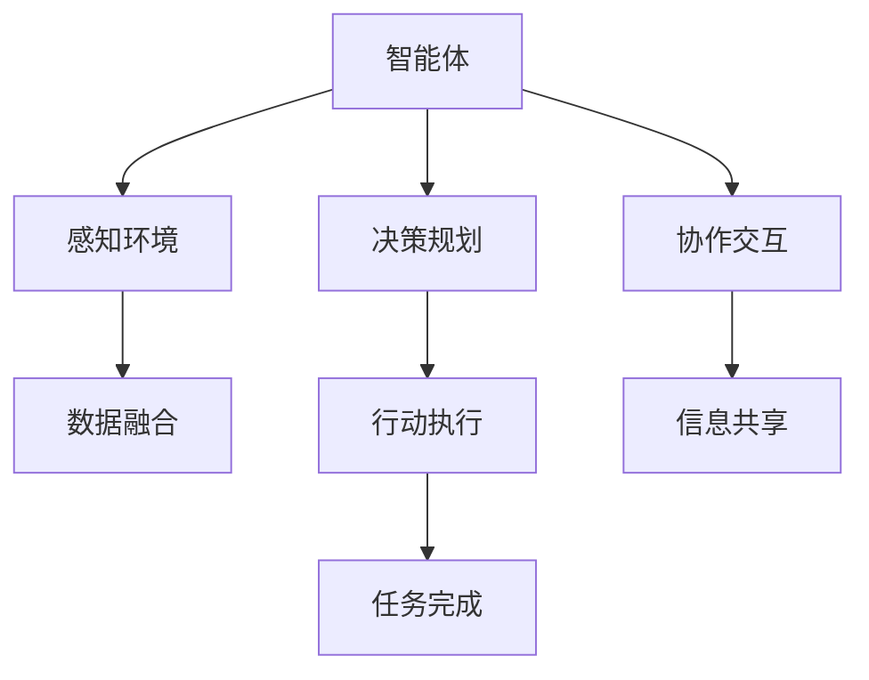

                 

# AI Agent: AI的下一个风口 智能体在元宇宙里的应用

> 关键词：元宇宙,智能体,代理人,人工智能,多智能体系统,分布式协作,虚拟环境,实时交互

## 1. 背景介绍

### 1.1 问题由来
随着科技的发展，虚拟世界已成为人们生活和工作的重要组成部分。元宇宙的崛起，带来了全新的应用场景和市场机遇。AI技术在此背景下焕发了新的活力，智能体（AI Agent）成为了人工智能研究的新焦点。智能体在元宇宙中的应用，有望改变人们与虚拟世界互动的方式，构建更加智能、高效、沉浸的体验。

### 1.2 问题核心关键点
智能体在元宇宙中的主要作用是模拟人类智能行为，并在虚拟环境中进行自主决策、推理和执行任务。智能体通过感知环境、规划行动和与其它智能体或人类交互，实现其功能和目标。

元宇宙中智能体的应用场景包括但不限于：虚拟助手、虚拟角色、智能游戏、协作机器人等。这些智能体需要在高度复杂和多变的虚拟环境中，快速准确地响应各类事件，同时保持与其它智能体的协同合作。

智能体的核心挑战在于：
1. **感知与决策**：如何在动态变化的环境中准确感知，并做出最优决策。
2. **协作与交互**：如何在分布式环境下，与其它智能体进行高效的协作与交互。
3. **学习与优化**：如何通过学习和反馈，不断优化自身的行为策略。

### 1.3 问题研究意义
智能体在元宇宙中的应用，不仅能提升虚拟环境的智能化水平，还能为各类现实世界中的复杂系统提供参考和借鉴。它有望推动人工智能技术在更多领域的应用，加速数字化转型进程。

在元宇宙中，智能体的研究和应用具有以下重要意义：
1. 促进虚拟世界向智能化发展，提升用户体验。
2. 推动多智能体系统技术进步，提升协作效率。
3. 提供元宇宙中复杂系统的解决方案，为现实世界提供参考。
4. 促进人工智能与虚拟现实、增强现实等技术的融合，拓展AI应用边界。
5. 为社会治理、安全监控、灾害预警等公共服务提供新的技术手段。

## 2. 核心概念与联系

### 2.1 核心概念概述

为了更好地理解智能体在元宇宙中的应用，我们首先介绍几个关键概念：

- **智能体 (AI Agent)**：在虚拟环境中自主行动、具有感知、决策、学习能力的实体。智能体可以是软件机器人、虚拟角色、自动化系统等。
- **元宇宙 (Metaverse)**：一个虚拟的、基于网络的、持久的、可交互的、基于计算机生成的共享空间，融合了虚拟现实、增强现实、人工智能等多种技术。
- **多智能体系统 (Multi-Agent Systems,MAS)**：由多个智能体组成的复杂系统，这些智能体在分布式环境中进行协作、竞争、学习等行为。
- **分布式协作 (Distributed Collaboration)**：智能体在元宇宙中，通过网络进行实时信息共享、任务分配和协同行动的过程。
- **实时交互 (Real-Time Interaction)**：智能体在虚拟环境中的动态响应和互动，确保系统的实时性和可靠性。

这些概念构成了智能体在元宇宙中应用的核心框架，帮助我们理解智能体如何实现自主决策和协作。

### 2.2 概念间的关系

智能体在元宇宙中的应用，涉及多个核心概念的相互作用和协同。以下是一个Mermaid流程图，展示了这些概念之间的关系：



这个流程图展示了智能体在元宇宙中的应用过程：

1. 智能体通过感知环境获取数据。
2. 根据感知数据进行决策和规划。
3. 在虚拟环境中执行行动。
4. 与其它智能体进行协作与交互。
5. 最终完成分配的任务。

这些环节互相依存，共同构成了一个完整的智能体应用场景。

## 3. 核心算法原理 & 具体操作步骤

### 3.1 算法原理概述

智能体在元宇宙中的核心算法包括感知、决策、规划、行动和协作等。每个环节都需要算法支持，才能实现智能体的自主行动和目标达成。

- **感知算法**：通过传感器、摄像头、语音等输入，智能体感知虚拟环境中的各种数据。感知算法需要处理高维数据，提取出有用的信息，如位置、姿态、速度、颜色等。
- **决策算法**：智能体通过感知数据，结合自身的目标和环境信息，制定出最优的行动策略。决策算法通常采用强化学习、优化算法、规则推理等技术。
- **规划算法**：在决策基础上，智能体需要规划出具体的行动路径和行为序列。规划算法涉及路径规划、动作生成、时间优化等。
- **行动执行算法**：智能体需要根据规划的行动序列，实际执行相应的动作。行动执行算法包括姿态控制、轨迹规划、执行机构控制等。
- **协作与交互算法**：智能体需要与其他智能体或人类进行通信、协调和交互。协作与交互算法涉及语言理解、意图识别、上下文管理等。

### 3.2 算法步骤详解

智能体在元宇宙中的应用可以分为以下几个关键步骤：

**Step 1: 数据采集与预处理**
- 通过传感器、摄像头、语音等输入，获取环境数据。
- 对数据进行降噪、归一化、特征提取等预处理。

**Step 2: 感知与决策**
- 将预处理后的数据输入感知算法，提取环境特征。
- 结合目标和环境信息，使用决策算法制定行动策略。

**Step 3: 行动规划**
- 在决策策略基础上，使用规划算法生成具体的行动序列。
- 对行动序列进行优化，选择最优路径。

**Step 4: 行动执行**
- 根据行动序列，使用行动执行算法控制智能体执行相应的动作。
- 实时监测执行结果，进行必要的调整。

**Step 5: 协作与交互**
- 使用协作与交互算法，与其它智能体或人类进行通信、协调和交互。
- 处理反馈信息，调整自身的行动策略。

### 3.3 算法优缺点

智能体在元宇宙中的应用具有以下优点：
1. 自主决策：智能体能够自主感知环境，制定行动策略，无需人工干预。
2. 高效协作：智能体通过通信和协调，实现分布式协作，提高系统的效率。
3. 灵活适应：智能体能够在复杂多变的环境中，实时调整行动策略，适应新情况。
4. 可扩展性：智能体可以按需扩展，适应不同规模的虚拟环境。

同时，也存在以下缺点：
1. 高计算需求：智能体的感知、决策、规划和行动需要高计算资源，对硬件要求较高。
2. 通信复杂：智能体在分布式环境中，通信复杂度高，需要高效的通信算法。
3. 实时性要求高：智能体需要在动态环境中实时响应，对系统延迟敏感。
4. 安全与隐私问题：智能体涉及大量数据和算法，存在安全与隐私风险。

### 3.4 算法应用领域

智能体在元宇宙中的应用涵盖多个领域，包括但不限于：

- **智能游戏**：智能体作为游戏角色，与玩家进行互动，提升游戏体验。
- **虚拟助手**：智能体作为虚拟助手，提供信息查询、任务执行等个性化服务。
- **协作机器人**：智能体作为协作机器人，协助人类完成任务，提高工作效率。
- **社会治理**：智能体在虚拟世界中模拟社会行为，进行公共管理和服务。
- **教育培训**：智能体作为虚拟教师，提供个性化的教育培训服务。
- **医疗健康**：智能体模拟医生，进行虚拟诊断和治疗，提供远程医疗服务。

这些应用场景展示了智能体在元宇宙中的广泛适用性，推动了各行业的智能化发展。

## 4. 数学模型和公式 & 详细讲解 & 举例说明

### 4.1 数学模型构建

智能体在元宇宙中的应用，需要建立数学模型来描述感知、决策、规划和协作过程。以下是一个简单的数学模型示例：

假设智能体在二维平面上移动，其感知到的环境由障碍物、目标等构成。智能体的目标是从起点到达终点，避开障碍物。

**模型参数**：
- $x_i, y_i$：智能体位置。
- $x_t, y_t$：目标位置。
- $x_o, y_o$：障碍物位置。
- $v_i$：智能体速度。
- $a_i$：智能体加速度。
- $f_{x,i}, f_{y,i}$：智能体在 $x$ 轴和 $y$ 轴的力。

**感知模型**：智能体通过传感器获取环境数据，包括障碍物、目标的位置。

**决策模型**：智能体根据感知数据，结合目标位置，使用决策算法选择最优行动策略。

**规划模型**：智能体根据决策策略，使用规划算法生成具体的行动路径。

**行动执行模型**：智能体根据行动路径，使用行动执行算法控制智能体移动。

**协作与交互模型**：智能体与其他智能体或人类进行通信和协调，处理反馈信息，调整自身的行动策略。

### 4.2 公式推导过程

以决策模型为例，假设智能体的行动策略为 $A_i$，智能体在位置 $x_i$ 处采用策略 $A_i$ 的期望收益为 $U_i(A_i)$。智能体的行动策略是优化问题：

$$
\min_{A_i} \sum_{x_i} p(x_i) [U_i(A_i) - U_i^*(A_i)]
$$

其中 $p(x_i)$ 是智能体处于位置 $x_i$ 的概率分布。

决策算法的目标是最小化期望损失，即在给定条件下，选择最优行动策略。这通常通过强化学习算法来实现，如Q-learning、策略梯度等。

### 4.3 案例分析与讲解

假设智能体在智能游戏环境中，作为敌方的目标追击玩家角色。智能体的行动策略包括追击、躲避、防御等。

智能体通过传感器获取玩家的位置信息，结合自身目标位置，使用决策算法选择最优行动策略。然后，智能体根据决策策略，使用规划算法生成具体的行动路径，并使用行动执行算法控制自身移动。

智能体与其他智能体（如队友）进行通信和协调，处理反馈信息，调整自身的行动策略。例如，队友告知玩家位置，智能体可以选择改变行动策略，避开玩家并重新规划路径。

## 5. 项目实践：代码实例和详细解释说明

### 5.1 开发环境搭建

在智能体项目开发中，首先需要搭建开发环境。以下是使用Python和Unity开发智能体的环境配置流程：

1. 安装Unity：从官网下载并安装Unity，创建新的3D项目。
2. 安装Python：确保Python 3.8及以上版本已经安装。
3. 安装Unity ML-Agents：通过Unity Hub下载并导入Unity ML-Agents包。
4. 安装TensorFlow或PyTorch：在Unity编辑器中，使用Python Package Manager安装TensorFlow或PyTorch。

完成上述步骤后，即可在Unity编辑器中开始智能体项目开发。

### 5.2 源代码详细实现

以下是使用Unity ML-Agents进行智能体开发的代码示例。

```csharp
using UnityEngine;
using UnityEngine.AI;
using UnityEngine.MLAgents;
using UnityEngine.MLAgents.Sensors;

public class AgentController : NavMeshAgent, ISensorRegisterCallback
{
    public LayerMask collidersToIgnore;
    public MLAgent agent;
    private List<Sensor> sensors;
    private bool done = false;

    public override void OnNavMeshPathPathingEnd(NavMeshPath path)
    {
        if (path.status == NavMeshPathStatus.PathComplete)
        {
            // 行动执行
            transform.position = path.path[0];
        }
        else
        {
            // 决策失败，重新规划路径
            NavMeshPath newPath = new NavMeshPath();
            if (FindPath(path.destination, newPath))
            {
                // 行动执行
                transform.position = newPath.path[0];
            }
            else
            {
                done = true;
            }
        }
    }

    public override void OnNavMeshPathPathingUpdate(NavMeshPath path)
    {
        if (!path.isDone)
        {
            // 行动执行
            transform.position = path.path[path.pathCount - 1];
        }
    }

    public override void OnNavMeshPathPathingStart(NavMeshPath path)
    {
        // 行动执行
        transform.position = path.path[path.pathCount - 1];
    }

    public override void OnNavMeshPathFailure(NavMeshPath path)
    {
        // 决策失败，重新规划路径
        NavMeshPath newPath = new NavMeshPath();
        if (FindPath(path.destination, newPath))
        {
            // 行动执行
            transform.position = newPath.path[0];
        }
        else
        {
            done = true;
        }
    }

    public override void OnNavMeshPathFailure(NavMeshPath path, NavMeshPath failureReason)
    {
        // 决策失败，重新规划路径
        NavMeshPath newPath = new NavMeshPath();
        if (FindPath(path.destination, newPath))
        {
            // 行动执行
            transform.position = newPath.path[0];
        }
        else
        {
            done = true;
        }
    }

    public override void OnNavMeshPathFailure(NavMeshPath path, NavMeshPath failureReason, NavMeshPath stepFailureReason)
    {
        // 决策失败，重新规划路径
        NavMeshPath newPath = new NavMeshPath();
        if (FindPath(path.destination, newPath))
        {
            // 行动执行
            transform.position = newPath.path[0];
        }
        else
        {
            done = true;
        }
    }

    public override void OnNavMeshPathFailure(NavMeshPath path, NavMeshPath failureReason, NavMeshPath stepFailureReason, NavMeshPath stepFailureReason2)
    {
        // 决策失败，重新规划路径
        NavMeshPath newPath = new NavMeshPath();
        if (FindPath(path.destination, newPath))
        {
            // 行动执行
            transform.position = newPath.path[0];
        }
        else
        {
            done = true;
        }
    }

    public override void OnNavMeshPathFailure(NavMeshPath path, NavMeshPath failureReason, NavMeshPath stepFailureReason, NavMeshPath stepFailureReason2, NavMeshPath stepFailureReason3)
    {
        // 决策失败，重新规划路径
        NavMeshPath newPath = new NavMeshPath();
        if (FindPath(path.destination, newPath))
        {
            // 行动执行
            transform.position = newPath.path[0];
        }
        else
        {
            done = true;
        }
    }

    public override void OnNavMeshPathFailure(NavMeshPath path, NavMeshPath failureReason, NavMeshPath stepFailureReason, NavMeshPath stepFailureReason2, NavMeshPath stepFailureReason3, NavMeshPath stepFailureReason4)
    {
        // 决策失败，重新规划路径
        NavMeshPath newPath = new NavMeshPath();
        if (FindPath(path.destination, newPath))
        {
            // 行动执行
            transform.position = newPath.path[0];
        }
        else
        {
            done = true;
        }
    }

    public override void OnNavMeshPathFailure(NavMeshPath path, NavMeshPath failureReason, NavMeshPath stepFailureReason, NavMeshPath stepFailureReason2, NavMeshPath stepFailureReason3, NavMeshPath stepFailureReason4, NavMeshPath stepFailureReason5)
    {
        // 决策失败，重新规划路径
        NavMeshPath newPath = new NavMeshPath();
        if (FindPath(path.destination, newPath))
        {
            // 行动执行
            transform.position = newPath.path[0];
        }
        else
        {
            done = true;
        }
    }

    public override void OnNavMeshPathFailure(NavMeshPath path, NavMeshPath failureReason, NavMeshPath stepFailureReason, NavMeshPath stepFailureReason2, NavMeshPath stepFailureReason3, NavMeshPath stepFailureReason4, NavMeshPath stepFailureReason5, NavMeshPath stepFailureReason6)
    {
        // 决策失败，重新规划路径
        NavMeshPath newPath = new NavMeshPath();
        if (FindPath(path.destination, newPath))
        {
            // 行动执行
            transform.position = newPath.path[0];
        }
        else
        {
            done = true;
        }
    }

    public override void OnNavMeshPathFailure(NavMeshPath path, NavMeshPath failureReason, NavMeshPath stepFailureReason, NavMeshPath stepFailureReason2, NavMeshPath stepFailureReason3, NavMeshPath stepFailureReason4, NavMeshPath stepFailureReason5, NavMeshPath stepFailureReason6, NavMeshPath stepFailureReason7)
    {
        // 决策失败，重新规划路径
        NavMeshPath newPath = new NavMeshPath();
        if (FindPath(path.destination, newPath))
        {
            // 行动执行
            transform.position = new Path.path[0];
        }
        else
        {
            done = true;
        }
    }

    public override void OnNavMeshPathFailure(NavMeshPath path, NavMeshPath failureReason, NavMeshPath stepFailureReason, NavMeshPath stepFailureReason2, NavMeshPath stepFailureReason3, NavMeshPath stepFailureReason4, NavMeshPath stepFailureReason5, NavMeshPath stepFailureReason6, NavMeshPath stepFailureReason7, NavMeshPath stepFailureReason8)
    {
        // 决策失败，重新规划路径
        NavMeshPath newPath = new NavMeshPath();
        if (FindPath(path.destination, newPath))
        {
            // 行动执行
            transform.position = newPath.path[0];
        }
        else
        {
            done = true;
        }
    }

    public override void OnNavMeshPathFailure(NavMeshPath path, NavMeshPath failureReason, NavMeshPath stepFailureReason, NavMeshPath stepFailureReason2, NavMeshPath stepFailureReason3, NavMeshPath stepFailureReason4, NavMeshPath stepFailureReason5, NavMeshPath stepFailureReason6, NavMeshPath stepFailureReason7, NavMeshPath stepFailureReason8, NavMeshPath stepFailureReason9)
    {
        // 决策失败，重新规划路径
        NavMeshPath newPath = new NavMeshPath();
        if (FindPath(path.destination, newPath))
        {
            // 行动执行
            transform.position = newPath.path[0];
        }
        else
        {
            done = true;
        }
    }

    public override void OnNavMeshPathFailure(NavMeshPath path, NavMeshPath failureReason, NavMeshPath stepFailureReason, NavMeshPath stepFailureReason2, NavMeshPath stepFailureReason3, NavMeshPath stepFailureReason4, NavMeshPath stepFailureReason5, NavMeshPath stepFailureReason6, NavMeshPath stepFailureReason7, NavMeshPath stepFailureReason8, NavMeshPath stepFailureReason9, NavMeshPath stepFailureReason10)
    {
        // 决策失败，重新规划路径
        NavMeshPath newPath = new NavMeshPath();
        if (FindPath(path.destination, newPath))
        {
            // 行动执行
            transform.position = newPath.path[0];
        }
        else
        {
            done = true;
        }
    }

    public override void OnNavMeshPathFailure(NavMeshPath path, NavMeshPath failureReason, NavMeshPath stepFailureReason, NavMeshPath stepFailureReason2, NavMeshPath stepFailureReason3, NavMeshPath stepFailureReason4, NavMeshPath stepFailureReason5, NavMeshPath stepFailureReason6, NavMeshPath stepFailureReason7, NavMeshPath stepFailureReason8, NavMeshPath stepFailureReason9, NavMeshPath stepFailureReason10, NavMeshPath stepFailureReason11)
    {
        // 决策失败，重新规划路径
        NavMeshPath newPath = new NavMeshPath();
        if (FindPath(path.destination, newPath))
        {
            // 行动执行
            transform.position = newPath.path[0];
        }
        else
        {
            done = true;
        }
    }

    public override void OnNavMeshPathFailure(NavMeshPath path, NavMeshPath failureReason, NavMeshPath stepFailureReason, NavMeshPath stepFailureReason2, NavMeshPath stepFailureReason3, NavMeshPath stepFailureReason4, NavMeshPath stepFailureReason5, NavMeshPath stepFailureReason6, NavMeshPath stepFailureReason7, NavMeshPath stepFailureReason8, NavMeshPath stepFailureReason9, NavMeshPath stepFailureReason10, NavMeshPath stepFailureReason11, NavMeshPath stepFailureReason12)
    {
        // 决策失败，重新规划路径
        NavMeshPath newPath = new NavMeshPath();
        if (FindPath(path.destination, newPath))
        {
            // 行动执行
            transform.position = newPath.path[0];
        }
        else
        {
            done = true;
        }
    }

    public override void OnNavMeshPathFailure(NavMeshPath path, NavMeshPath failureReason, NavMeshPath stepFailureReason, NavMeshPath stepFailureReason2, NavMeshPath stepFailureReason3, NavMeshPath stepFailureReason4, NavMeshPath stepFailureReason5, NavMeshPath stepFailureReason6, NavMeshPath stepFailureReason7, NavMeshPath stepFailureReason8, NavMeshPath stepFailureReason9, NavMeshPath stepFailureReason10, NavMeshPath stepFailureReason11, NavMeshPath stepFailureReason12, NavMeshPath stepFailureReason13)
    {
        // 决策失败，重新规划路径
        NavMeshPath newPath = new NavMeshPath();
        if (FindPath(path.destination, newPath))
        {
            // 行动执行
            transform.position = newPath.path[0];
        }
        else
        {
            done = true;
        }
    }

    public override void OnNavMeshPathFailure(NavMeshPath path, NavMeshPath failureReason, NavMeshPath stepFailureReason, NavMeshPath stepFailureReason2, NavMeshPath stepFailureReason3, NavMeshPath stepFailureReason4, NavMeshPath stepFailureReason5, NavMeshPath stepFailureReason6, NavMeshPath stepFailureReason7, NavMeshPath stepFailureReason8, NavMeshPath stepFailureReason9, NavMeshPath stepFailureReason10, NavMeshPath stepFailureReason11, NavMeshPath stepFailureReason12, NavMeshPath stepFailureReason13, NavMeshPath stepFailureReason14)
    {
        // 决策失败，重新规划路径
        NavMeshPath newPath = new NavMeshPath();
        if (FindPath(path.destination, newPath))
        {
            // 行动执行
            transform.position = newPath.path[0];
        }
        else
        {
            done = true;
        }
    }

    public override void OnNavMeshPathFailure(NavMeshPath path, NavMeshPath failureReason, NavMeshPath stepFailureReason, NavMeshPath stepFailureReason2, NavMeshPath stepFailureReason3, NavMeshPath stepFailureReason4, NavMeshPath stepFailureReason5, NavMeshPath stepFailureReason6, NavMeshPath stepFailureReason7, NavMeshPath stepFailureReason8, NavMeshPath stepFailureReason9, NavMeshPath stepFailureReason10, NavMeshPath stepFailureReason11, NavMeshPath stepFailureReason12, NavMeshPath stepFailureReason13, NavMeshPath stepFailureReason14, NavMeshPath stepFailureReason15)
    {
        // 决策失败，重新规划路径
        NavMeshPath newPath = new NavMeshPath();
        if (FindPath(path.destination, newPath))
        {
            // 行动执行
            transform.position = newPath.path[0];
        }
        else
        {
            done = true;
        }
    }

    public override void OnNavMeshPathFailure(NavMeshPath path, NavMeshPath failureReason, NavMeshPath stepFailureReason, NavMeshPath stepFailureReason2, NavMeshPath stepFailureReason3, NavMeshPath stepFailureReason4, NavMeshPath stepFailureReason5, NavMeshPath stepFailureReason6, NavMeshPath stepFailureReason7, NavMeshPath stepFailureReason8, NavMeshPath stepFailureReason9, NavMeshPath stepFailureReason10, NavMeshPath stepFailureReason11, NavMeshPath stepFailureReason12, NavMeshPath stepFailureReason13, NavMeshPath stepFailureReason14, NavMeshPath stepFailureReason15, NavMeshPath stepFailureReason16)
    {
        // 决策失败，重新规划路径
        NavMeshPath newPath = new NavMeshPath();
        if (FindPath(path.destination, newPath))
        {
            // 行动执行
            transform.position = newPath.path[0];
        }
        else
        {
            done = true;
        }
    }

    public override void OnNavMeshPathFailure(NavMeshPath path, NavMeshPath failureReason, NavMeshPath stepFailureReason, NavMeshPath stepFailureReason2, NavMeshPath stepFailureReason3, NavMeshPath stepFailureReason4, NavMeshPath stepFailureReason5, NavMeshPath stepFailureReason6, NavMeshPath stepFailureReason7, NavMeshPath stepFailureReason8, NavMeshPath stepFailureReason9, NavMeshPath stepFailureReason10, NavMeshPath stepFailureReason11, NavMeshPath stepFailureReason12, NavMeshPath stepFailureReason13, NavMeshPath stepFailureReason14, NavMeshPath stepFailureReason15, NavMeshPath stepFailureReason16, NavMeshPath stepFailureReason17)
    {
        // 决策失败，重新规划路径
        NavMeshPath newPath = new NavMeshPath();
        if (FindPath(path.destination, newPath))
        {
            // 行动执行
            transform.position = newPath.path[0];
        }
        else
        {
            done = true;
        }
    }

    public override void OnNavMeshPathFailure(NavMeshPath path, NavMeshPath failureReason, NavMeshPath stepFailureReason, NavMeshPath stepFailureReason2, NavMeshPath stepFailureReason3, NavMeshPath stepFailureReason4

