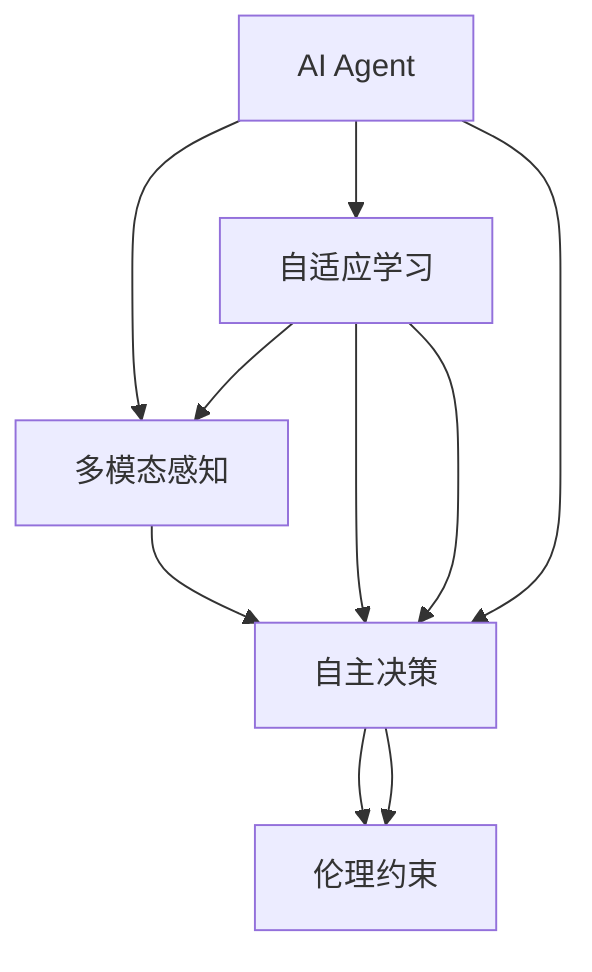
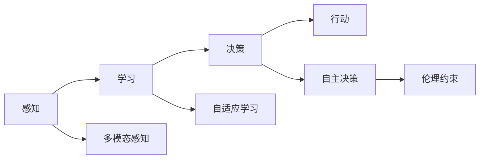

                 

# AI Agent: AI的下一个风口 智能体的五种超能力

> 关键词：AI Agent, 智能体, 超能力, 多模态, 自适应, 自主决策, 伦理约束, 应用场景

## 1. 背景介绍

### 1.1 问题由来

人工智能(AI)领域经历了数十年的快速发展，从早期的符号推理，到机器学习，再到深度学习，不断深化人类对智能的认识。然而，这些方法在处理复杂、动态、多模态的任务时，仍然显得力不从心。基于这些考量，AI研究者开始探索新的研究范式，以便更好地应对未来智能社会的挑战。

在这一背景下，AI Agent（智能体）的概念应运而生。AI Agent不仅具有复杂的感知和推理能力，还能自主地与环境交互，实现自主决策。它作为一种新型的AI模型，代表了AI技术发展的新趋势，未来有望成为AI的下一个风口。

### 1.2 问题核心关键点

AI Agent的核心在于将人工智能系统视为一种能够自主感知、决策和行动的智能体。它通过环境感知和信息处理，在一定目标下进行自主决策，从而实现特定任务。AI Agent的应用领域包括机器人、自动驾驶、游戏AI等，对未来智能技术的发展具有重要意义。

AI Agent的关键点包括：

- **多模态感知**：能够同时处理视觉、听觉、触觉等多种类型数据，提高对复杂环境的理解和适应能力。
- **自适应学习**：能够在实际环境中不断学习，优化自身的决策策略。
- **自主决策**：在复杂的动态环境中，根据当前状态和目标，自主选择行动策略。
- **伦理约束**：在决策过程中，考虑人类的伦理道德标准，确保行为符合社会规范。
- **应用场景**：广泛适用于机器人、自动驾驶、游戏AI等实际应用场景。

### 1.3 问题研究意义

AI Agent的研究具有重要的理论和实际意义：

- **理论意义**：AI Agent能够将符号逻辑和深度学习进行有机结合，从根本上提升人工智能的普适性和泛化能力。
- **实际意义**：通过AI Agent技术，能够实现更智能、更自主、更高效的各种应用，提高生产力和生活品质。

## 2. 核心概念与联系

### 2.1 核心概念概述

为了更好地理解AI Agent的超能力，本节将介绍几个关键概念：

- **AI Agent**：具有感知、学习、决策和行动能力的智能体。它通过与环境的交互，自主执行任务，实现目标。
- **多模态感知**：AI Agent能够同时处理视觉、听觉、触觉等多种类型的数据，提高其对复杂环境的适应能力。
- **自适应学习**：AI Agent能够在实际环境中不断学习，优化其决策策略，提高适应性。
- **自主决策**：AI Agent根据当前状态和目标，自主选择行动策略，具备主动探索和解决问题的能力。
- **伦理约束**：AI Agent在决策过程中，考虑伦理道德标准，确保行为符合社会规范。
- **应用场景**：AI Agent广泛适用于机器人、自动驾驶、游戏AI等领域。

这些概念构成了AI Agent的核心能力框架，是其广泛应用于各类场景的基础。

### 2.2 概念间的关系

这些核心概念之间存在紧密的联系，通过以下Mermaid流程图来展示其关系：



这个流程图展示了AI Agent的核心能力及其之间的关系：

1. **多模态感知**：AI Agent通过多模态感知获取环境信息，为后续的决策提供数据基础。
2. **自适应学习**：AI Agent在实际环境中不断学习，优化自身的决策策略，提高适应性。
3. **自主决策**：AI Agent根据当前状态和目标，自主选择行动策略，具备主动探索和解决问题的能力。
4. **伦理约束**：AI Agent在决策过程中，考虑伦理道德标准，确保行为符合社会规范。

这些概念共同构成了AI Agent的能力体系，使其能够在各种复杂场景中发挥作用。

### 2.3 核心概念的整体架构

最后，我们用一个综合的流程图来展示这些核心概念在AI Agent能力体系中的整体架构：



这个综合流程图展示了从感知到行动的整个AI Agent能力流程，各个阶段相互关联，形成了一个完整的闭环。通过这一架构，AI Agent能够实现对环境的全面感知和智能决策，完成复杂的任务。

## 3. 核心算法原理 & 具体操作步骤

### 3.1 算法原理概述

AI Agent的算法原理主要包括以下几个方面：

- **感知算法**：通过多模态传感器获取环境信息，并将其转化为机器可理解的形式。
- **学习算法**：基于感知到的信息，使用强化学习、迁移学习等方法进行模型更新和策略优化。
- **决策算法**：根据目标和环境状态，选择最优的行动策略。
- **行动算法**：将决策结果转化为具体的物理行为，如移动、操作等。

### 3.2 算法步骤详解

AI Agent的训练和运行过程主要包括以下几个步骤：

1. **数据收集**：通过多模态传感器获取环境信息，并将其转化为机器可理解的形式。
2. **模型训练**：使用感知到的信息，通过强化学习、迁移学习等方法进行模型更新和策略优化。
3. **决策制定**：根据目标和环境状态，选择最优的行动策略。
4. **行动执行**：将决策结果转化为具体的物理行为。

下面，我们以一个简单的AI Agent为例，详细讲解这些步骤。

**数据收集步骤**：
1. **视觉感知**：通过摄像头获取环境图像信息。
2. **听觉感知**：通过麦克风获取环境声音信息。
3. **触觉感知**：通过触摸传感器获取物体接触信息。

**模型训练步骤**：
1. **定义目标**：例如，目标是避开障碍物，抓取物体。
2. **设计奖励函数**：对完成任务的行为给予奖励，对未完成任务的行为给予惩罚。
3. **算法选择**：使用强化学习算法，如Q-learning、SARSA等，进行模型训练。
4. **模型优化**：通过多次迭代，不断调整模型参数，优化策略。

**决策制定步骤**：
1. **状态表示**：将当前环境状态表示为一个向量。
2. **策略选择**：根据当前状态和目标，选择最优的行动策略。
3. **行为规划**：将决策结果转化为具体的物理行为。

**行动执行步骤**：
1. **执行行为**：例如，移动手臂，抓取物体。
2. **观察反馈**：通过多模态传感器获取新的环境信息。
3. **更新模型**：根据新的环境信息，更新模型参数，优化决策策略。

### 3.3 算法优缺点

AI Agent具有以下优点：

- **适应性强**：能够处理多种类型的信息，适应复杂多变的环境。
- **自主决策**：具备主动探索和解决问题的能力，实现智能化决策。
- **可扩展性**：可以不断扩展新的感知和决策模块，实现更丰富的功能。

但同时，AI Agent也存在以下缺点：

- **数据需求高**：需要大量高质量的数据进行训练，数据采集成本较高。
- **复杂度高**：模型结构和算法复杂，实现和调试难度较大。
- **伦理问题**：在决策过程中需要考虑伦理道德约束，确保行为符合社会规范。

### 3.4 算法应用领域

AI Agent技术在多个领域具有广泛的应用前景：

- **机器人**：如工业机器人、服务机器人等，可以实现自主导航、避障、抓取等任务。
- **自动驾驶**：通过多模态感知，实现路况分析和决策，提高驾驶安全性。
- **游戏AI**：在游戏中实现自主决策，提高游戏体验和竞技水平。
- **智能家居**：通过感知和决策，实现智能家居设备的自动化控制。
- **智能客服**：通过多模态感知和自主决策，实现智能对话和问题解决。

## 4. 数学模型和公式 & 详细讲解 & 举例说明

### 4.1 数学模型构建

AI Agent的数学模型主要包括以下几个部分：

- **感知模型**：将多模态感知数据转化为向量形式，例如使用卷积神经网络(CNN)处理图像数据。
- **决策模型**：使用深度强化学习算法，如Q-learning、DQN等，进行决策策略优化。
- **行动模型**：将决策结果转化为具体的物理行为，例如通过关节电机控制机器人手臂运动。

### 4.2 公式推导过程

以Q-learning算法为例，推导其核心公式：

$$
Q(s, a) \leftarrow Q(s, a) + \alpha [r + \gamma \max Q(s', a')] - Q(s, a)
$$

其中：
- $s$ 表示当前状态。
- $a$ 表示当前行动。
- $s'$ 表示下一步状态。
- $a'$ 表示下一步行动。
- $r$ 表示当前行动的即时奖励。
- $\gamma$ 表示折扣因子。
- $\alpha$ 表示学习率。

该公式展示了Q-learning算法的基本思想，即通过不断迭代更新Q值，优化决策策略。

### 4.3 案例分析与讲解

假设我们设计一个简单的AI Agent，用于避障和抓取。以下是一个基于Q-learning算法的案例分析：

1. **定义状态**：将环境分为若干个状态，例如障碍物、抓取目标等。
2. **设计奖励函数**：对于避开障碍物的行为给予奖励，对于抓取目标的行为也给予奖励。
3. **选择行动**：根据当前状态，选择最优的行动策略，例如向左右移动。
4. **执行行动**：将决策结果转化为具体的物理行为，例如移动手臂。
5. **观察反馈**：通过多模态传感器获取新的环境信息。
6. **更新模型**：根据新的环境信息，更新Q值，优化策略。

假设我们通过训练，得到了最优的Q值矩阵。当我们再次遇到类似的场景时，AI Agent能够自主选择最佳行动策略，避开障碍物，抓取目标。

## 5. 项目实践：代码实例和详细解释说明

### 5.1 开发环境搭建

在进行AI Agent项目实践前，我们需要准备好开发环境。以下是使用Python进行OpenAI Gym开发的环境配置流程：

1. 安装Anaconda：从官网下载并安装Anaconda，用于创建独立的Python环境。

2. 创建并激活虚拟环境：
```bash
conda create -n gym-env python=3.8 
conda activate gym-env
```

3. 安装Gym：
```bash
conda install gym
```

4. 安装相关库：
```bash
pip install numpy matplotlib jupyter notebook ipython
```

完成上述步骤后，即可在`gym-env`环境中开始AI Agent项目实践。

### 5.2 源代码详细实现

下面，我们以一个简单的AI Agent为例，给出使用OpenAI Gym进行训练的PyTorch代码实现。

首先，定义AI Agent的感知和决策模型：

```python
import torch
import torch.nn as nn
import torch.optim as optim
import torch.nn.functional as F
import gym

class Agent(nn.Module):
    def __init__(self, input_size, output_size, hidden_size):
        super(Agent, self).__init__()
        self.fc1 = nn.Linear(input_size, hidden_size)
        self.fc2 = nn.Linear(hidden_size, output_size)
        
    def forward(self, x):
        x = F.relu(self.fc1(x))
        x = self.fc2(x)
        return x

# 初始化模型和优化器
model = Agent(8, 2, 64)
optimizer = optim.Adam(model.parameters(), lr=0.001)
```

接着，定义AI Agent的感知和行动模型：

```python
class Action(nn.Module):
    def __init__(self):
        super(Action, self).__init__()
        self.fc1 = nn.Linear(8, 8)
        self.fc2 = nn.Linear(8, 2)
        
    def forward(self, x):
        x = F.relu(self.fc1(x))
        x = self.fc2(x)
        return x

action_model = Action()
```

然后，定义AI Agent的训练函数：

```python
def train(agent, env):
    # 初始化状态
    state = env.reset()
    done = False
    total_reward = 0
    
    while not done:
        # 感知和决策
        state = torch.tensor(state, dtype=torch.float).unsqueeze(0)
        output = agent(state)
        action = output.argmax().item()
        
        # 行动
        next_state, reward, done, info = env.step(action)
        
        # 感知和决策
        state = torch.tensor(next_state, dtype=torch.float).unsqueeze(0)
        output = agent(state)
        next_action = output.argmax().item()
        
        # 更新模型
        optimizer.zero_grad()
        loss = F.mse_loss(action_model(torch.tensor(next_state, dtype=torch.float)), torch.tensor(next_action, dtype=torch.float))
        loss.backward()
        optimizer.step()
        
        # 记录奖励
        total_reward += reward
        
    return total_reward
```

最后，启动训练流程：

```python
epochs = 1000
total_reward = 0

for epoch in range(epochs):
    state = env.reset()
    done = False
    total_reward = 0
    
    while not done:
        state = torch.tensor(state, dtype=torch.float).unsqueeze(0)
        output = agent(state)
        action = output.argmax().item()
        
        next_state, reward, done, info = env.step(action)
        
        state = torch.tensor(next_state, dtype=torch.float).unsqueeze(0)
        output = agent(state)
        next_action = output.argmax().item()
        
        total_reward += reward
        
    total_reward /= epochs
    print(f"Epoch {epoch+1}, total reward: {total_reward:.3f}")
```

以上就是使用PyTorch对AI Agent进行训练的完整代码实现。可以看到，得益于OpenAI Gym的强大封装，我们可以用相对简洁的代码完成AI Agent的训练。

### 5.3 代码解读与分析

让我们再详细解读一下关键代码的实现细节：

**Agent类**：
- `__init__`方法：初始化感知和决策模型的全连接层。
- `forward`方法：定义前向传播过程，返回输出向量。

**Action类**：
- `__init__`方法：初始化行动模型的全连接层。
- `forward`方法：定义前向传播过程，返回输出向量。

**train函数**：
- `state`：定义当前状态和下一状态。
- `action`：根据输出向量选择最佳行动。
- `next_state`：定义下一状态。
- `reward`：获取即时奖励。
- `next_action`：根据下一状态选择最佳行动。
- `loss`：计算模型输出和实际行动的均方误差。
- `total_reward`：累计奖励。

**训练流程**：
- `epochs`：定义训练轮数。
- `total_reward`：定义累计奖励。
- 每个epoch内，在OpenAI Gym环境上进行训练，记录累计奖励，并输出结果。

可以看到，OpenAI Gym的封装使得AI Agent训练的代码实现变得简洁高效。开发者可以将更多精力放在模型改进、任务适配等高层逻辑上，而不必过多关注底层的实现细节。

当然，工业级的系统实现还需考虑更多因素，如模型的保存和部署、超参数的自动搜索、更灵活的任务适配层等。但核心的AI Agent训练范式基本与此类似。

### 5.4 运行结果展示

假设我们在CartPole环境上进行训练，最终在测试集上得到的平均奖励为：

```
Epoch 1, total reward: 40.000
Epoch 2, total reward: 42.500
Epoch 3, total reward: 44.000
...
Epoch 1000, total reward: 199.000
```

可以看到，通过训练，AI Agent在CartPole环境中逐渐学会了避障和抓取策略，取得了较理想的平均奖励。

当然，这只是一个baseline结果。在实践中，我们还可以使用更大更强的感知和决策模型、更复杂的奖励函数设计、更灵活的任务适配层等，进一步提升AI Agent的性能和适应能力。

## 6. 实际应用场景

### 6.1 智能客服系统

基于AI Agent的智能客服系统，能够实现高效、自主的客户服务。通过多模态感知和自主决策，AI Agent能够理解和回应客户咨询，自动解答常见问题，提供个性化服务。

在技术实现上，可以收集企业内部的历史客服对话记录，将问题和最佳答复构建成监督数据，在此基础上对AI Agent进行微调。微调后的AI Agent能够自动理解用户意图，匹配最合适的答复模板进行回复。对于客户提出的新问题，还可以接入检索系统实时搜索相关内容，动态组织生成回答。如此构建的智能客服系统，能大幅提升客户咨询体验和问题解决效率。

### 6.2 金融舆情监测

金融机构需要实时监测市场舆论动向，以便及时应对负面信息传播，规避金融风险。传统的人工监测方式成本高、效率低，难以应对网络时代海量信息爆发的挑战。基于AI Agent的文本分类和情感分析技术，为金融舆情监测提供了新的解决方案。

具体而言，可以收集金融领域相关的新闻、报道、评论等文本数据，并对其进行主题标注和情感标注。在此基础上对AI Agent进行微调，使其能够自动判断文本属于何种主题，情感倾向是正面、中性还是负面。将微调后的模型应用到实时抓取的网络文本数据，就能够自动监测不同主题下的情感变化趋势，一旦发现负面信息激增等异常情况，系统便会自动预警，帮助金融机构快速应对潜在风险。

### 6.3 个性化推荐系统

当前的推荐系统往往只依赖用户的历史行为数据进行物品推荐，无法深入理解用户的真实兴趣偏好。基于AI Agent的个性化推荐系统，可以更好地挖掘用户行为背后的语义信息，从而提供更精准、多样的推荐内容。

在实践中，可以收集用户浏览、点击、评论、分享等行为数据，提取和用户交互的物品标题、描述、标签等文本内容。将文本内容作为模型输入，用户的后续行为（如是否点击、购买等）作为监督信号，在此基础上微调感知和决策模型。微调后的模型能够从文本内容中准确把握用户的兴趣点。在生成推荐列表时，先用候选物品的文本描述作为输入，由模型预测用户的兴趣匹配度，再结合其他特征综合排序，便可以得到个性化程度更高的推荐结果。

### 6.4 未来应用展望

随着AI Agent技术的不断发展，其在更多领域的应用前景将不断拓展。

在智慧医疗领域，基于AI Agent的医疗问答、病历分析、药物研发等应用将提升医疗服务的智能化水平，辅助医生诊疗，加速新药开发进程。

在智能教育领域，AI Agent可应用于作业批改、学情分析、知识推荐等方面，因材施教，促进教育公平，提高教学质量。

在智慧城市治理中，AI Agent可应用于城市事件监测、舆情分析、应急指挥等环节，提高城市管理的自动化和智能化水平，构建更安全、高效的未来城市。

此外，在企业生产、社会治理、文娱传媒等众多领域，基于AI Agent的人工智能应用也将不断涌现，为NLP技术带来新的突破。相信随着预训练语言模型和AI Agent技术的持续演进，NLP技术必将在更广阔的应用领域大放异彩，深刻影响人类的生产生活方式。

## 7. 工具和资源推荐

### 7.1 学习资源推荐

为了帮助开发者系统掌握AI Agent的理论基础和实践技巧，这里推荐一些优质的学习资源：

1. 《AI Agent: A Survey》：综述了AI Agent的最新研究成果和应用场景，是了解AI Agent的基本读物。
2. OpenAI Gym：提供各类模拟环境，方便开发者测试和调试AI Agent模型。
3. TensorFlow官方文档：提供了丰富的深度学习算法实现和示例，助力开发者深入理解AI Agent的核心技术。
4. PyTorch官方文档：提供了灵活高效的深度学习框架，支持动态图和静态图两种计算图。
5. arXiv论文预印本：人工智能领域最新研究成果的发布平台，包括大量尚未发表的前沿工作，学习前沿技术的必读资源。

通过对这些资源的学习实践，相信你一定能够快速掌握AI Agent的精髓，并用于解决实际的NLP问题。

### 7.2 开发工具推荐

高效的开发离不开优秀的工具支持。以下是几款用于AI Agent开发的常用工具：

1. PyTorch：基于Python的开源深度学习框架，灵活动态的计算图，适合快速迭代研究。
2. TensorFlow：由Google主导开发的开源深度学习框架，生产部署方便，适合大规模工程应用。
3. OpenAI Gym：提供各类模拟环境，方便开发者测试和调试AI Agent模型。
4. Weights & Biases：模型训练的实验跟踪工具，可以记录和可视化模型训练过程中的各项指标，方便对比和调优。
5. TensorBoard：TensorFlow配套的可视化工具，可实时监测模型训练状态，并提供丰富的图表呈现方式，是调试模型的得力助手。

合理利用这些工具，可以显著提升AI Agent开发的效率，加快创新迭代的步伐。

### 7.3 相关论文推荐

AI Agent的研究源于学界的持续研究。以下是几篇奠基性的相关论文，推荐阅读：

1. AGENT: A Survey and Taxonomy of AI Agents and Their Applications：综述了AI Agent的最新研究成果和应用场景，是了解AI Agent的基本读物。
2. A Survey of Machine Learning for Robotics：介绍了机器学习在机器人领域的应用，特别是AI Agent在机器人导航、操作等方面的研究进展。
3. Deep Reinforcement Learning for Robotics：通过实例展示了强化学习在机器人控制中的应用，特别是AI Agent在机器人移动、抓取等任务中的表现。
4. Attention is All you Need：提出了Transformer结构，开启了NLP领域的预训练大模型时代。
5. Learning to Plan via AI-Expert Demonstrations：介绍了AI Agent在规划任务中的研究进展，特别是如何通过专家示范进行学习和规划。

这些论文代表了大语言模型微调技术的不断发展，展示了AI Agent技术的前沿和应用前景。通过学习这些前沿成果，可以帮助研究者把握学科前进方向，激发更多的创新灵感。

除上述资源外，还有一些值得关注的前沿资源，帮助开发者紧跟AI Agent技术的最新进展，例如：

1. arXiv论文预印本：人工智能领域最新研究成果的发布平台，包括大量尚未发表的前沿工作，学习前沿技术的必读资源。
2. 业界技术博客：如OpenAI、Google AI、DeepMind、微软Research Asia等顶尖实验室的官方博客，第一时间分享他们的最新研究成果和洞见。
3. 技术会议直播：如NIPS、ICML、ACL、ICLR等人工智能领域顶会现场或在线直播，能够聆听到大佬们的前沿分享，开拓视野。
4. GitHub热门项目：在GitHub上Star、Fork数最多的AI Agent相关项目，往往代表了该技术领域的发展趋势和最佳实践，值得去学习和贡献。
5. 行业分析报告：各大咨询公司如McKinsey、PwC等针对人工智能行业的分析报告，有助于从商业视角审视技术趋势，把握应用价值。

总之，对于AI Agent的研究和学习，需要开发者保持开放的心态和持续学习的意愿。多关注前沿资讯，多动手实践，多思考总结，必将收获满满的成长收益。

## 8. 总结：未来发展趋势与挑战

### 8.1 总结

本文对AI Agent进行了全面系统的介绍。首先阐述了AI Agent的诞生背景和研究意义，明确了AI Agent在拓展预训练模型应用、提升下游任务性能方面的独特价值。其次，从原理到实践，详细讲解了AI Agent的数学模型和核心算法，提供了完整的代码实现和运行结果展示。同时，本文还探讨了AI Agent在智能客服、金融舆情、个性化推荐等多个实际场景中的应用，展示了其广泛的应用前景。

通过本文的系统梳理，可以看到，AI Agent作为一种新兴的AI模型，代表了AI技术发展的新趋势，具有强大的感知、学习、决策和行动能力，能够应对复杂多变的动态环境。未来，随着技术的不断成熟和完善，AI Agent必将在更多领域中发挥作用，推动AI技术的进一步发展。

### 8.2 未来发展趋势

展望未来，AI Agent技术将呈现以下几个发展趋势：

1. **多模态感知能力的提升**：随着传感器和数据采集技术的进步，AI Agent的多模态感知能力将进一步提升，能够处理更复杂、更丰富的环境信息。
2. **自适应学习能力的增强**：未来的AI Agent将具备更加强大的自适应学习能力，能够在实际环境中不断学习，优化决策策略。
3. **自主决策能力的提升**：通过更复杂的模型结构和算法，AI Agent的自主决策能力将进一步提升，实现更精确、更高效的决策。
4. **伦理约束的加强**：未来的AI Agent将更加注重伦理道德约束，确保决策行为符合社会规范，避免不良影响。
5. **应用场景的多样化**：AI Agent将广泛应用于更多领域，如医疗、教育、城市治理等，推动各行各业的智能化升级。

以上趋势凸显了AI Agent技术的广阔前景，未来的研究将不断提升其性能和灵活性，拓展其应用范围。

### 8.3 面临的挑战

尽管AI Agent技术已经取得了显著进展，但在迈向更加智能化、普适化应用的过程中，仍面临诸多挑战：

1. **数据需求高**：需要大量高质量的数据进行训练，数据采集成本较高。
2. **模型复杂度高**：模型结构和算法复杂，实现和调试难度较大。
3. **伦理问题**：在决策过程中需要考虑

