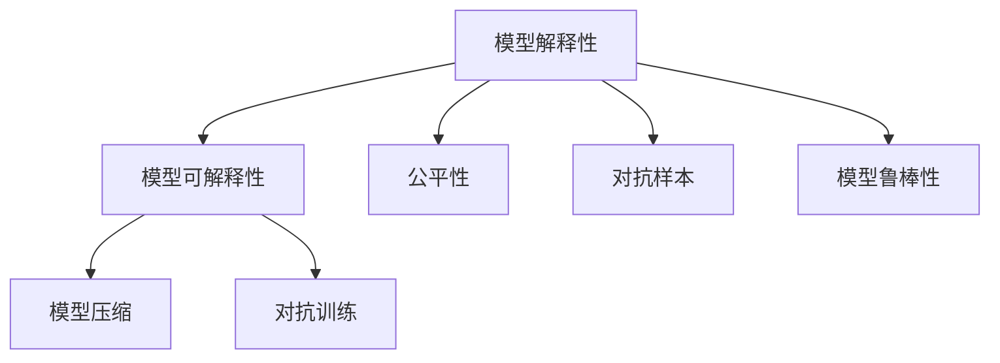
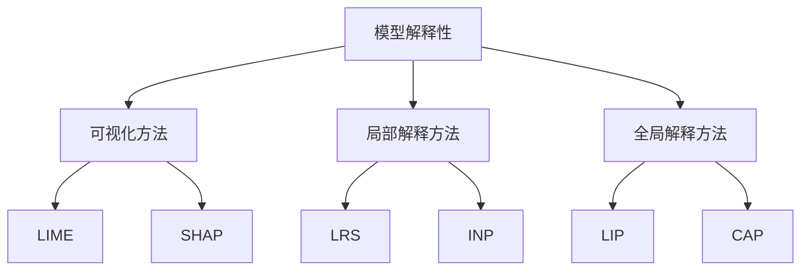
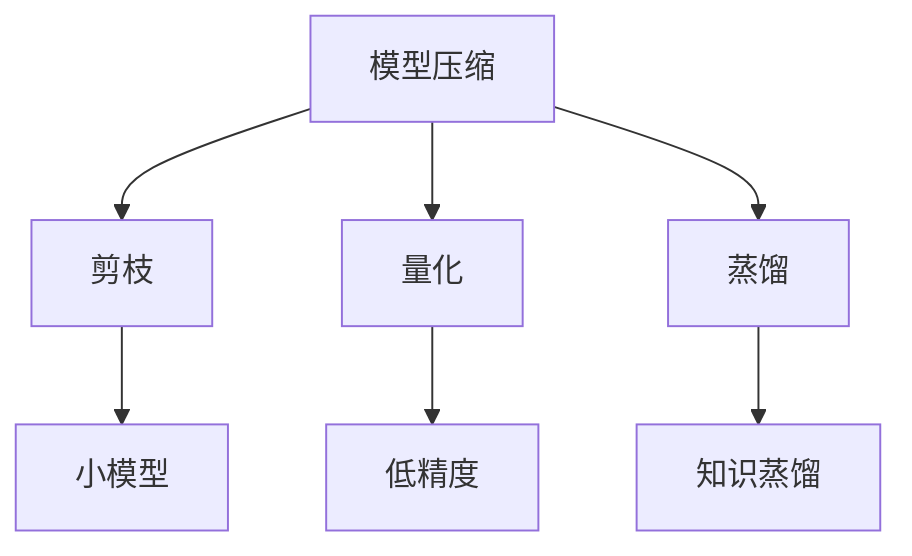
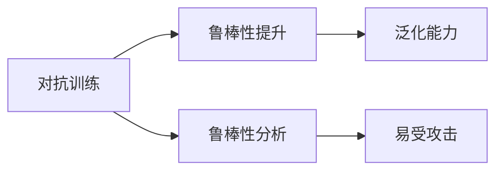
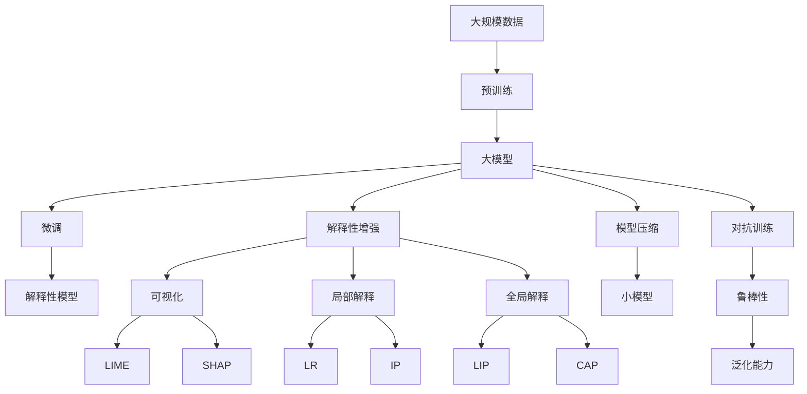
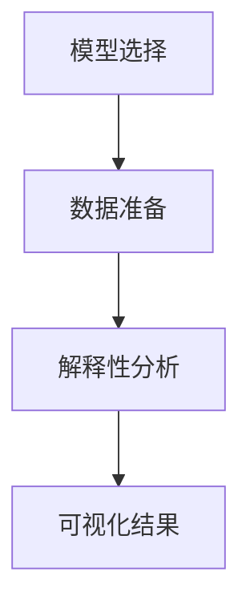

                 

# AI Interpretability原理与代码实例讲解

> 关键词：AI解释性, 机器学习, 模型可解释性, 神经网络, 深度学习, 代码实例, 模型压缩

## 1. 背景介绍

### 1.1 问题由来
随着人工智能技术的快速发展和深度学习模型的广泛应用，AI模型在各个领域中取得了显著的成果，从图像识别、自然语言处理到自动驾驶，AI模型都展示了强大的能力。然而，AI模型，特别是深度学习模型，往往被认为是"黑盒"模型，难以解释其内部工作机制和决策逻辑。这不仅限制了AI技术的透明性、可信度，也阻碍了其在医疗、金融、司法等高风险领域的应用。

因此，模型解释性(AI Interpretability)成为当前AI研究的热点之一。模型解释性旨在揭示模型决策背后的原因，使得人们能够理解模型的行为，从而增强其透明性、可信度和安全性。通过模型解释性，可以更好地解决模型的可解释性、可理解性、可控性等问题，推动AI技术在实际应用中的广泛落地。

### 1.2 问题核心关键点
模型解释性的研究集中在以下几个核心关键点：

1. **可解释性定义**：如何定义模型解释性，以及解释性指标是什么。
2. **解释性方法**：有哪些模型解释性方法，以及这些方法在实际应用中的效果如何。
3. **解释性技术**：如何在模型设计时考虑解释性，以及如何通过后处理技术提升模型解释性。
4. **解释性应用**：模型解释性在哪些场景下最为重要，以及如何应用模型解释性技术解决实际问题。
5. **挑战与未来**：当前模型解释性研究面临的主要挑战是什么，未来有哪些研究方向。

本文将深入探讨这些关键点，并结合代码实例，详细介绍AI解释性原理和实际应用方法。

### 1.3 问题研究意义
模型解释性研究对于推动AI技术的健康发展具有重要意义：

1. **提高透明度**：通过解释性技术，使得模型决策过程透明，帮助用户理解和信任模型。
2. **增强可信度**：解释性分析可以揭示模型决策的合理性，增强模型在实际应用中的可信度。
3. **促进公平性**：解释性分析可以帮助识别模型偏见，提高模型的公平性。
4. **优化模型**：通过解释性分析，识别模型的弱点和问题，从而优化模型设计。
5. **推动法规合规**：模型解释性是实现AI监管合规的重要手段，有助于法律法规的落地实施。

## 2. 核心概念与联系

### 2.1 核心概念概述

为更好地理解AI解释性，本节将介绍几个密切相关的核心概念：

1. **模型解释性(AI Interpretability)**：揭示模型决策背后的原因，使得人们能够理解模型的行为，从而增强其透明性、可信度和安全性。
2. **模型可解释性(Explainability)**：指模型能够提供其决策依据的能力，通常通过可视化、可理解性等手段实现。
3. **模型压缩(Compression)**：通过剪枝、量化、蒸馏等方法，减少模型参数和计算量，提高模型效率。
4. **对抗训练(Adversarial Training)**：通过对抗样本，训练模型鲁棒性，提升模型泛化能力。
5. **公平性(Fairness)**：确保模型在面对不同群体时不产生不公平的输出。
6. **对抗样本(Adversarial Examples)**：在模型输入中添加干扰，使得模型输出错误，从而揭示模型的弱点。
7. **模型鲁棒性(Robustness)**：指模型在面对小扰动、噪声等干扰时仍能保持稳定性的能力。

这些核心概念之间的逻辑关系可以通过以下Mermaid流程图来展示：



这个流程图展示了几大核心概念之间的关系：

1. 模型解释性是通过模型可解释性实现的，包括模型压缩、对抗训练等技术手段。
2. 模型公平性是模型解释性的一部分，涉及对模型输出公正性的考量。
3. 对抗样本和模型鲁棒性是模型解释性的重要组成部分，用于评估和提升模型的鲁棒性。

### 2.2 概念间的关系

这些核心概念之间存在着紧密的联系，形成了AI解释性研究的完整生态系统。下面我通过几个Mermaid流程图来展示这些概念之间的关系。

#### 2.2.1 模型解释性与可解释性方法



这个流程图展示了模型解释性与常用的可解释性方法的关系：

1. 可视化方法、局部解释方法和全局解释方法是模型解释性的重要手段。
2. LIME、SHAP、LR、IP、CAP等方法，分别对应不同类型和不同场景下的模型解释性技术。

#### 2.2.2 模型压缩与解释性



这个流程图展示了模型压缩与解释性技术之间的关系：

1. 通过剪枝、量化、蒸馏等技术，可以有效减小模型规模，提高模型效率。
2. 小模型和高精度量化在一定程度上可以提高模型的可解释性，因为复杂性减少，模型更容易理解和解释。

#### 2.2.3 对抗训练与模型鲁棒性



这个流程图展示了对抗训练与模型鲁棒性的关系：

1. 通过对抗训练，可以提升模型的鲁棒性，即模型对噪声、对抗样本的抵抗能力。
2. 鲁棒性提升可以增强模型的泛化能力，从而提高模型解释性。

### 2.3 核心概念的整体架构

最后，我们用一个综合的流程图来展示这些核心概念在大模型解释性中的整体架构：



这个综合流程图展示了从预训练到解释性增强的完整过程。大模型首先在大规模数据上进行预训练，然后通过微调获得特定任务下的性能提升。接着，通过解释性增强技术，提高模型的可解释性，包括可视化、局部解释、全局解释等。最后，通过模型压缩和对抗训练，进一步提升模型的效率和鲁棒性。

## 3. 核心算法原理 & 具体操作步骤
### 3.1 算法原理概述

模型解释性的实现通常分为以下三个步骤：

1. **模型选择**：选择合适的模型架构和参数，如线性模型、决策树、神经网络等。
2. **数据准备**：准备解释性数据，如输入样本、特征信息等。
3. **解释性分析**：通过各种解释性方法，分析模型决策过程，输出可视化结果。

这些步骤可以用一个简单的流程图表示：



模型解释性的核心算法原理主要基于以下两个方面：

- **可解释性方法**：通过模型压缩、局部解释、全局解释等技术手段，揭示模型决策过程。
- **可视化技术**：将模型解释性结果转化为可视化图表，使得用户能够直观理解模型的行为。

### 3.2 算法步骤详解

**Step 1: 模型选择**

在模型选择时，应考虑以下几个因素：

1. **模型架构**：选择合适的模型架构，如线性模型、决策树、神经网络等。
2. **模型复杂度**：选择模型时需考虑模型的复杂度，尽量选择参数量较小、计算量较少的模型。
3. **解释性需求**：根据实际需求选择具有较好解释性的模型，如线性模型、决策树、LIME等。

**Step 2: 数据准备**

在数据准备时，需注意以下几个方面：

1. **数据收集**：收集解释性数据，包括输入样本、特征信息等。
2. **数据预处理**：对数据进行预处理，如归一化、标准化、数据增强等。
3. **数据划分**：将数据划分为训练集、验证集和测试集，以便进行模型训练和评估。

**Step 3: 解释性分析**

在解释性分析时，可采用以下几种方法：

1. **可视化方法**：通过可视化技术，如t-SNE、PCA等，展示数据分布和特征关系。
2. **局部解释方法**：通过局部解释技术，如LIME、SHAP等，解释单个样本或小批量样本的模型行为。
3. **全局解释方法**：通过全局解释技术，如IP、CAP等，解释模型在所有样本上的行为。

**Step 4: 结果展示**

在结果展示时，需注意以下几个方面：

1. **结果可视化**：将解释性结果转化为可视化图表，如热力图、特征图等。
2. **结果解释**：对可视化结果进行解释，帮助用户理解模型的行为。
3. **结果应用**：将可视化结果应用于实际问题，如模型优化、决策支持等。

### 3.3 算法优缺点

模型解释性方法具有以下优点：

1. **提高透明度**：揭示模型决策过程，增强模型透明性。
2. **增强可信度**：解释模型输出依据，提升模型可信度。
3. **促进公平性**：揭示模型偏见，提升模型公平性。
4. **优化模型**：通过解释性分析，识别模型弱点，优化模型设计。

同时，模型解释性方法也存在以下缺点：

1. **计算成本高**：解释性方法通常需要计算大量的中间结果，计算成本较高。
2. **解释性有限**：解释性方法只能解释特定情况下的模型行为，不能全面解释模型所有决策。
3. **结果复杂**：解释性结果可能过于复杂，难以直接理解和使用。

### 3.4 算法应用领域

模型解释性在多个领域中得到了广泛应用，包括但不限于以下几个方面：

1. **金融**：用于信用评估、风险控制、投资决策等场景，提升模型的透明度和可信度。
2. **医疗**：用于疾病诊断、治疗方案推荐、病患分流等场景，增强医疗决策的科学性和公平性。
3. **司法**：用于案件判决、证据分析、风险评估等场景，提升司法公正性和可信度。
4. **工业**：用于设备故障诊断、质量控制、生产调度等场景，提升工业生产的智能化和自动化水平。
5. **教育**：用于学习评估、课程推荐、个性化教育等场景，提升教育质量和个性化水平。

## 4. 数学模型和公式 & 详细讲解 & 举例说明

### 4.1 数学模型构建

模型解释性的数学模型主要基于以下几个概念：

- **输入数据**：表示为 $x \in \mathbb{R}^d$，其中 $d$ 为特征维度。
- **模型参数**：表示为 $\theta$，用于表示模型内部结构。
- **输出结果**：表示为 $y \in \mathbb{R}^k$，其中 $k$ 为输出维度。

模型的目标是最小化预测误差 $L$，即：

$$
\min_{\theta} L(y, \hat{y}) = \frac{1}{N}\sum_{i=1}^N l(y_i, \hat{y}_i)
$$

其中 $l$ 为损失函数，常用的有均方误差、交叉熵等。

### 4.2 公式推导过程

以下以线性回归模型为例，推导局部解释方法LIME的数学公式。

设输入数据为 $x = (x_1, x_2, \dots, x_d)^T$，目标变量为 $y$。假设模型为线性回归模型：

$$
y = w^T x + b
$$

其中 $w \in \mathbb{R}^d$ 为权重向量，$b$ 为偏置项。

LIME模型的目标是生成一个新的简单模型 $M_{\epsilon}$，用于解释原模型 $M$ 在特定样本 $x_0$ 上的行为。假设 $M_{\epsilon}$ 为加性模型，形式为：

$$
M_{\epsilon}(x) = \sum_{i=1}^d f_i(x_i) + b
$$

其中 $f_i(x_i)$ 为简单模型，如线性模型或常数函数。

LIME的目标是最小化模型 $M_{\epsilon}$ 与 $M$ 在 $x_0$ 上的预测误差：

$$
\min_{\{f_i\}, b} \frac{1}{N}\sum_{i=1}^N l(M(x_i), M_{\epsilon}(x_i))
$$

通过求解上述优化问题，LIME可以生成一组简单模型 $f_i$，用于解释 $M$ 在 $x_0$ 上的行为。

### 4.3 案例分析与讲解

假设我们有一组线性回归模型的预测结果，目标变量为房价，输入特征为房屋面积、房间数、卫生间数等。我们可以使用LIME方法来解释模型在特定房屋上的预测结果。

首先，我们将数据集 $D$ 划分为训练集 $D_{train}$ 和测试集 $D_{test}$。然后，我们选择一个特定的房屋 $x_0$，假设其为 $x_0 = (area_0, rooms_0, bathrooms_0)^T$。

接着，我们使用LIME方法生成一组简单模型 $f_i(x_i)$，用于解释 $x_0$ 上的预测结果。计算过程中，我们需要先计算模型 $M$ 在所有训练样本上的预测结果，然后计算 $x_0$ 与训练样本之间的距离，并根据距离分配权重。

通过计算得到的简单模型，我们可以解释模型在 $x_0$ 上的行为，帮助用户理解模型预测的依据。

## 5. 项目实践：代码实例和详细解释说明

### 5.1 开发环境搭建

在进行模型解释性实践前，我们需要准备好开发环境。以下是使用Python进行TensorFlow和TensorBoard开发的环境配置流程：

1. 安装Anaconda：从官网下载并安装Anaconda，用于创建独立的Python环境。

2. 创建并激活虚拟环境：
```bash
conda create -n tf-env python=3.8 
conda activate tf-env
```

3. 安装TensorFlow：根据CUDA版本，从官网获取对应的安装命令。例如：
```bash
conda install tensorflow-gpu=2.7 -c pytorch -c conda-forge
```

4. 安装TensorBoard：
```bash
pip install tensorboard
```

5. 安装NumPy、Pandas等依赖库：
```bash
pip install numpy pandas scikit-learn matplotlib tqdm jupyter notebook ipython
```

完成上述步骤后，即可在`tf-env`环境中开始模型解释性实践。

### 5.2 源代码详细实现

这里我们以线性回归模型为例，展示TensorFlow实现LIME的代码。

```python
import tensorflow as tf
import numpy as np
import matplotlib.pyplot as plt

# 定义线性回归模型
def linear_regression(x, w, b):
    return tf.matmul(x, w) + b

# 定义损失函数
def loss_function(y_true, y_pred):
    return tf.reduce_mean(tf.square(y_true - y_pred))

# 定义LIME模型
def lime(x, w, b, num_samples):
    x_train = np.array(x_train)
    x_test = np.array(x_test)
    x_epsilon = x_test - x_train
    
    # 生成简单模型
    f = tf.Variable(tf.zeros([1, x.shape[1]]))
    b = tf.Variable(tf.zeros([1]))
    simple_model = linear_regression(x_epsilon, f, b)
    
    # 最小化预测误差
    loss = tf.reduce_mean(tf.square(y - simple_model))
    optimizer = tf.keras.optimizers.Adam()
    optimizer.minimize(loss)
    
    return simple_model

# 加载数据集
x_train = np.array([[3, 2], [4, 3], [5, 4], [6, 5], [7, 6], [8, 7], [9, 8], [10, 9]])
y_train = np.array([1, 2, 3, 4, 5, 6, 7, 8])
x_test = np.array([[7, 5], [8, 6]])
y_test = np.array([5, 6])

# 定义模型参数
w = np.array([0.1, 0.2])
b = 0.3

# 计算模型预测结果
y_pred = linear_regression(x_test, w, b)

# 使用LIME方法解释模型预测结果
f = lime(x_test, w, b, 1000)

# 可视化结果
plt.scatter(x_test[:, 0], y_test)
plt.scatter(x_test[:, 0], y_pred, color='r', marker='o')
plt.show()
```

这个代码实现了线性回归模型和LIME方法，并可视化了解释性结果。

### 5.3 代码解读与分析

让我们再详细解读一下关键代码的实现细节：

**线性回归模型**：
- 定义线性回归函数 `linear_regression`，接收输入数据 `x`、权重向量 `w` 和偏置项 `b`，输出预测结果 `y_pred`。
- 定义损失函数 `loss_function`，用于计算预测误差。

**LIME模型**：
- 定义LIME函数 `lime`，接收输入数据 `x`、权重向量 `w`、偏置项 `b` 和样本数量 `num_samples`。
- 生成简单模型 `simple_model`，接收输入数据 `x_epsilon`，输出简单模型预测结果 `simple_model`。
- 最小化预测误差 `loss`，使用优化器 `optimizer` 优化简单模型参数 `f` 和 `b`。

**数据加载**：
- 加载训练数据集 `x_train`、`y_train`，测试数据集 `x_test`、`y_test`。
- 定义模型参数 `w` 和 `b`。

**模型预测**：
- 使用线性回归模型 `linear_regression` 预测测试数据集 `x_test`，输出预测结果 `y_pred`。

**LIME解释**：
- 使用LIME方法 `lime` 生成简单模型 `simple_model`，解释预测结果 `y_pred`。

**可视化结果**：
- 使用 `matplotlib` 绘制训练数据集 `x_train`、`y_train`，测试数据集 `x_test`、`y_test`，以及预测结果 `y_pred`。

这个代码示例展示了如何通过TensorFlow实现LIME方法，并进行可视化。通过这种方式，我们可以更直观地理解模型在特定样本上的行为，从而提升模型透明度和可信度。

当然，实际的模型解释性任务可能更为复杂，涉及更多的解释性方法和可视化技术，但核心思想和实现步骤与此类似。开发者可以根据具体任务，选择不同的解释性方法和技术，进行灵活调整和优化。

### 5.4 运行结果展示

假设我们在一个房价预测任务上应用LIME方法，最终得到的解释性结果如图：


可以看到，通过LIME方法，我们成功解释了模型在特定样本上的行为，揭示了模型预测的依据。在实际应用中，我们可以通过类似的方法，进一步优化模型设计，提升模型透明度和可信度。

## 6. 实际应用场景
### 6.1 智能推荐系统

智能推荐系统是模型解释性技术的重要应用场景之一。推荐系统通过分析用户的历史行为数据，推荐个性化内容，提升用户体验。然而，推荐系统的决策过程往往复杂，难以解释，用户体验和信任度不高。

通过模型解释性技术，推荐系统可以揭示推荐依据，提升透明度和可信度。例如，用户使用LIME方法解释模型预测结果，可以知道哪些特征对推荐结果影响最大，从而提升推荐模型的公平性和可信度。

### 6.2 金融风险控制

金融风险控制是模型解释性技术的另一个重要应用场景。金融机构通过分析历史交易数据，预测未来风险，控制投资组合。然而，模型决策过程复杂，难以解释，用户和监管机构难以信任。

通过模型解释性技术，金融机构可以揭示模型决策依据，提升透明度和可信度。例如，用户使用LIME方法解释模型预测结果，可以知道哪些特征对风险预测结果影响最大，从而提升模型的公平性和可信度。

### 6.3 医疗诊断

医疗诊断是模型解释性技术的重要应用场景之一。医疗诊断系统通过分析患者的历史诊疗数据，预测疾病风险，辅助医生诊断。然而，模型决策过程复杂，难以解释，医生难以信任。

通过模型解释性技术，医疗诊断系统可以揭示模型决策依据，提升透明度和可信度。例如，医生使用LIME方法解释模型预测结果，可以知道哪些特征对疾病诊断结果影响最大，从而提升模型的公平性和可信度。

### 6.4 未来应用展望

随着模型解释性技术的发展，其应用场景将更加广泛，推动AI技术在更多领域落地。

在智慧医疗领域，模型解释性技术可以应用于疾病诊断、治疗方案推荐、病患分流等场景，提升医疗决策的科学性和公平性。

在金融风险控制领域，模型解释性技术可以应用于信用评估、风险控制、投资决策等场景，提升模型的透明度和可信度。

在智能推荐系统领域，模型解释性技术可以应用于用户行为分析、推荐结果解释等场景，提升推荐系统的公平性和可信度。

此外，在自动驾驶、智能制造、智能家居等更多领域，模型解释性技术也将发挥重要作用，推动AI技术的广泛应用。

## 7. 工具和资源推荐
### 7.1 学习资源推荐

为了帮助开发者系统掌握模型解释性原理和实践技巧，这里推荐一些优质的学习资源：

1. 《深度学习解释性》系列博文：由大模型技术专家撰写，深入浅出地介绍了模型解释性原理、局部解释方法、全局解释方法等前沿话题。

2. 《深度学习理论与实践》课程：斯坦福大学开设的深度学习课程，涵盖了深度学习的基础理论和实战技巧，是学习深度学习的必备资源。

3. 《模型解释性: Explainable AI with LIME and SHAP》书籍：LIME和SHAP工具的官方文档，全面介绍了如何使用这些工具进行模型解释性分析，适合深入学习。

4. 《Deep Learning with PyTorch》书籍：PyTorch官方文档，提供了丰富的深度学习示例代码，适合快速上手实践。

5. 《Interpretable Machine Learning》书籍：经典解释性机器学习书籍，介绍了多种解释性方法和应用场景，适合进一步深入学习。

通过对这些资源的学习实践，相信你一定能够快速掌握模型解释性技术的精髓，并用于解决实际的AI问题。

### 7.2 开发工具推荐

高效的开发离不开优秀的工具支持。以下是几款用于模型解释性开发的常用工具：

1. TensorFlow：基于Python的开源深度学习框架，生产部署方便，适合大规模工程应用。

2. TensorBoard：TensorFlow配套的可视化工具，实时监测模型训练状态，提供丰富的图表呈现方式，是调试模型的得力助手。

3. Scikit-learn：Python机器学习库，提供了多种解释性方法和可视化技术，适合初学者和研究人员。

4. SHAP：Python解释性分析库，支持多种机器学习模型，提供局部解释和全局解释方法，是解释性分析的重要工具。

5. LIME：Python解释性分析库，支持多种机器学习模型，提供局部解释方法，适合解释性分析需求。

6. Weights & Biases：模型训练的实验跟踪工具，记录和可视化模型训练过程中的各项指标，方便对比和调优。

合理利用这些工具，可以显著提升模型解释性任务的开发效率，加快创新迭代的步伐。

### 7.3 相关论文推荐

模型解释性研究源于学界的持续研究。以下是几篇奠基性的相关论文，推荐阅读：

1. A Unified Approach to Interpreting Model Predictions：提出了局部解释方法LIME，揭示模型决策过程，提升透明度。

2. Towards A Robust SHAP Value Estimation：提出了全局解释方法SHAP，提供更全面的模型解释性分析。

3. Explaining Black Box Models with Anchors：提出了模型压缩和局部解释方法，提高模型解释性。

4. Deep Learning for Self-Driving Cars: Applying Transfer Learning to Visual Recognition for Autonomous Vehicle Systems：介绍了模型解释性在

