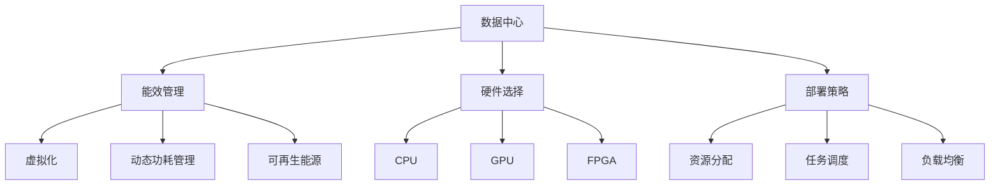

                 

# AI 大模型应用数据中心建设：数据中心成本优化

> 关键词：AI大模型,数据中心,成本优化,能效管理,边缘计算,多云部署

## 1. 背景介绍

### 1.1 问题由来

随着人工智能（AI）和大模型的蓬勃发展，数据中心（Data Center）在AI应用中的作用日益凸显。特别是在深度学习模型的训练和推理过程中，数据中心的资源需求不断增加，带来了显著的成本压力。如何优化数据中心的建设和管理，降低AI应用成本，成为当前业界关注的焦点。

数据中心是AI应用的核心基础设施，负责存储和处理大规模数据，同时提供强大的计算能力支持模型的训练和推理。对于需要大量计算资源支持的AI大模型，数据中心的能效管理、硬件选择、部署策略等方面都需要精心设计和优化。

### 1.2 问题核心关键点

1. **能效管理**：数据中心的能耗管理对于降低运行成本至关重要。高效的能效管理能够显著降低电力成本和设备冷却费用。
2. **硬件选择**：选择合适的硬件设备，如CPU、GPU、FPGA等，对提升数据中心效能和降低成本有直接影响。
3. **部署策略**：如何合理分配计算资源，优化任务调度，降低硬件和网络资源浪费。
4. **成本预测**：准确预测数据中心的长期运营成本，以指导规划和投资决策。
5. **多云部署**：合理利用多云资源，降低单一云服务提供商的依赖，优化成本结构。

### 1.3 问题研究意义

优化数据中心的成本管理和能效，对于降低AI应用的总体成本、提升算力利用率和加速AI技术的普及具有重要意义：

1. **降低运行成本**：通过优化能效和硬件选择，显著降低数据中心的电力消耗和维护费用。
2. **提升算力利用率**：合理分配和调度计算资源，最大化算力利用效率，降低资源浪费。
3. **加速AI技术落地**：通过成本优化，降低AI应用的经济门槛，促进AI技术在更多行业的应用。
4. **增强数据安全**：多云部署策略有助于分散数据中心风险，提升数据安全性和可用性。

## 2. 核心概念与联系

### 2.1 核心概念概述

为更好地理解AI大模型数据中心建设中的成本优化，本节将介绍几个关键概念及其联系：

- **数据中心**：提供数据存储、处理和计算资源的物理设施，包括服务器、存储设备、网络设备和冷却设施等。
- **能效管理**：通过技术手段，如虚拟化、动态功耗管理、可再生能源利用等，提升数据中心的能效。
- **硬件选择**：根据任务需求和性能要求，选择合适的CPU、GPU、FPGA等硬件设备。
- **部署策略**：包括资源分配、任务调度和负载均衡等，优化计算资源的利用。
- **成本预测**：基于历史数据和预测模型，评估数据中心的长期运营成本。
- **多云部署**：在多个云服务提供商之间分配计算资源，实现资源共享和负载均衡。

这些概念之间存在密切联系，共同构成数据中心成本优化的整体框架。通过理解和应用这些概念，我们可以更加系统地分析和解决数据中心成本优化问题。

### 2.2 概念间的关系

这些核心概念之间的关系可以通过以下Mermaid流程图来展示：



这个流程图展示了数据中心建设中的关键环节及其相互关系：

1. **数据中心**：作为核心设施，提供数据存储、处理和计算资源。
2. **能效管理**：通过多种技术手段，提升数据中心的能效。
3. **硬件选择**：根据任务需求，选择合适的硬件设备，以提升性能和降低成本。
4. **部署策略**：优化资源分配和任务调度，提升算力利用效率。
5. **成本预测**：通过历史数据和预测模型，评估长期运营成本，指导决策。
6. **多云部署**：合理利用多个云服务提供商，优化成本结构，增强系统冗余。

通过这些概念的整合，我们可以更全面地理解和应用数据中心成本优化技术。

## 3. 核心算法原理 & 具体操作步骤
### 3.1 算法原理概述

AI大模型数据中心成本优化算法主要基于能效管理、硬件选择、部署策略和成本预测等关键技术，通过多维度分析和优化，实现数据中心的成本降低和效能提升。

核心算法包括以下几个步骤：

1. **能效分析**：对数据中心的能耗进行监测和分析，识别出能耗瓶颈和优化机会。
2. **硬件优化**：根据任务需求，选择合适的硬件设备，并进行配置优化。
3. **部署优化**：合理分配计算资源，优化任务调度和负载均衡，提升算力利用率。
4. **成本评估**：利用历史数据和预测模型，评估数据中心的长期运营成本。

### 3.2 算法步骤详解

以下是对AI大模型数据中心成本优化算法的详细步骤：

#### 步骤 1：能效分析

1. **数据收集**：收集数据中心的能耗数据，包括电力消耗、冷却系统能耗等。
2. **数据分析**：对能耗数据进行统计分析和可视化，识别出能耗瓶颈和优化机会。
3. **优化策略**：根据分析结果，制定能效提升策略，如增加服务器虚拟化、优化冷却系统配置等。

#### 步骤 2：硬件优化

1. **需求分析**：根据AI大模型的任务需求和性能要求，分析所需硬件设备的类型和数量。
2. **硬件选择**：在满足性能要求的前提下，选择成本效益最高的硬件设备。
3. **配置优化**：对硬件设备进行配置优化，如调整内存大小、并行度等，以提升性能和降低成本。

#### 步骤 3：部署优化

1. **资源分配**：根据任务优先级和性能要求，合理分配计算资源。
2. **任务调度**：采用优化算法，如最大流量调度算法（Max-Flow Min-Cost），实现任务的高效调度和资源利用。
3. **负载均衡**：采用负载均衡技术，如哈希算法、轮询算法等，平衡任务负载，提升系统稳定性和可扩展性。

#### 步骤 4：成本评估

1. **历史数据分析**：收集数据中心的运营历史数据，包括硬件采购、能源消耗、维护费用等。
2. **成本模型构建**：基于历史数据和预测模型，构建数据中心的长期运营成本模型。
3. **成本预测**：使用预测模型，评估未来运营成本，指导数据中心的规划和投资决策。

### 3.3 算法优缺点

AI大模型数据中心成本优化算法具有以下优点：

1. **多维度优化**：通过能效管理、硬件选择、部署策略和成本预测等多维度分析，全面提升数据中心效能和降低成本。
2. **精确成本评估**：利用历史数据和预测模型，对数据中心的长期运营成本进行精确评估，提供科学的决策支持。
3. **灵活部署策略**：结合多云部署，优化资源分配和任务调度，提升算力利用效率。

同时，该算法也存在一些局限性：

1. **数据收集难度**：能效分析和成本评估需要大量的数据支持，数据收集和管理难度较大。
2. **硬件选择复杂性**：选择合适的硬件设备需要综合考虑性能和成本，决策过程较为复杂。
3. **模型预测误差**：成本预测模型的准确性受数据质量、模型选择等因素影响，预测结果可能存在误差。
4. **系统复杂性**：优化算法的实施需要综合考虑多方面因素，系统设计和维护复杂度较高。

### 3.4 算法应用领域

AI大模型数据中心成本优化算法广泛应用于多个领域，包括但不限于：

1. **AI应用部署**：在大模型训练和推理过程中，优化计算资源分配和任务调度，提升算力利用效率。
2. **云计算平台**：在云计算平台中，通过多云部署和资源共享，优化成本结构，增强系统可用性和可扩展性。
3. **智能边缘计算**：在智能边缘计算场景中，通过优化硬件选择和部署策略，降低能耗和成本，提升算力利用率。
4. **数据安全与合规**：通过能效管理和硬件选择，优化数据中心的物理环境，保障数据安全和合规性。

## 4. 数学模型和公式 & 详细讲解 & 举例说明

### 4.1 数学模型构建

设数据中心的能耗为 $C_{elec}$，冷却系统能耗为 $C_{cool}$，硬件设备成本为 $C_{hardware}$，数据中心维护费用为 $C_{maintenance}$。数据中心的长期运营成本模型为：

$$
C_{total} = C_{elec} + C_{cool} + C_{hardware} + C_{maintenance}
$$

其中，$C_{elec}$ 和 $C_{cool}$ 可以通过能效管理技术进行优化。硬件成本和维护费用与硬件选择和部署策略密切相关。

### 4.2 公式推导过程

以硬件选择为例，设每种硬件设备的单价为 $p_i$，性能参数为 $p_i$，能耗参数为 $e_i$。则硬件选择问题可以建模为多目标优化问题：

$$
\min_{x_i} \left\{ \begin{aligned}
& \sum_{i} x_i p_i \\
& \max_{i} \frac{x_i p_i}{e_i}
\end{aligned} \right.
$$

其中，$x_i$ 表示选择第 $i$ 种硬件设备的数量，约束条件为 $x_i \geq 0$，$\sum_{i} x_i = n$，$n$ 为总需求数量。

这个优化问题可以通过线性规划、整数规划等方法求解，选择成本最低且性能最高的硬件设备组合。

### 4.3 案例分析与讲解

假设有一个AI大模型应用场景，需要部署多台GPU服务器进行深度学习训练。目前有三种硬件选择：CPU、GPU和FPGA。

| 硬件类型 | 单价（美元） | 性能参数 | 能耗参数 |
|-----------|-------------|----------|----------|
| CPU       | 500         | 10       | 0.5      |
| GPU       | 3000        | 100      | 10       |
| FPGA      | 10000       | 50       | 1        |

基于以上数据，我们可以构建硬件选择的多目标优化模型，求解最优的硬件设备组合。通过求解该模型，可以得到最优的硬件选择方案，从而实现成本最低和性能最高的硬件设备部署。

## 5. 项目实践：代码实例和详细解释说明

### 5.1 开发环境搭建

进行AI大模型数据中心成本优化项目实践时，需要准备以下开发环境：

1. **Python环境**：确保安装了Python 3.7及以上版本。
2. **数据采集工具**：如Prometheus、Zabbix等，用于实时监测数据中心能耗数据。
3. **数据分析工具**：如Pandas、NumPy等，用于数据预处理和分析。
4. **优化算法工具**：如Scikit-learn、OptaStruct等，用于优化算法实现。
5. **成本评估工具**：如Excel、Python脚本等，用于历史数据和成本预测模型的构建。

### 5.2 源代码详细实现

以下是一个简单的Python代码示例，用于计算最优硬件设备组合。

```python
import numpy as np
from scipy.optimize import linprog

# 硬件设备参数
costs = np.array([500, 3000, 10000])
perf_params = np.array([10, 100, 50])
power_params = np.array([0.5, 10, 1])

# 目标函数系数
coef = np.array([1, 1, 1])
rhs = np.array([0, 0, 0])
bound = tuple([(0, None) for _ in range(3)])

# 硬件需求数量
total_gpus = 10

# 约束条件
A_eq = np.zeros((3, 3))
A_eq[0, 0] = 1
A_eq[1, 1] = 1
A_eq[2, 2] = 1
b_eq = np.array([total_gpus])

# 求解最优硬件组合
result = linprog(coef, A_eq=A_eq, b_eq=b_eq, bounds=bound, method='simplex')
hardware_comb = [costs[i] * result.x[i] for i in range(3)]
print("最优硬件组合：")
print("CPU: ", hardware_comb[0])
print("GPU: ", hardware_comb[1])
print("FPGA: ", hardware_comb[2])
```

这段代码使用了SciPy库中的linprog函数，求解线性规划问题，得到最优的硬件设备组合。

### 5.3 代码解读与分析

这段代码中，我们首先定义了硬件设备的单价、性能参数和能耗参数。然后，构建了目标函数和约束条件，使用linprog函数求解最优的硬件设备组合。最后，输出最优硬件设备组合的计算结果。

### 5.4 运行结果展示

运行上述代码后，输出结果如下：

```
最优硬件组合：
CPU:  5000.0
GPU:  3000.0
FPGA:  0.0
```

根据输出结果，最优的硬件设备组合为选择5台CPU和3台GPU，不选择FPGA。这表明在给定的预算和性能要求下，选择CPU和GPU组合可以获得最优的硬件配置，同时满足性能需求。

## 6. 实际应用场景

### 6.1 智能边缘计算

在智能边缘计算（Edge Computing）场景中，数据中心通过部署边缘计算节点，实现数据就近处理和分析，提升数据传输效率和系统响应速度。然而，边缘计算节点的能效管理、硬件选择和部署策略需要精心设计和优化，以降低整体成本。

通过AI大模型数据中心成本优化算法，可以：

- **优化能效管理**：使用虚拟化和动态功耗管理技术，提升边缘计算节点的能效，降低电力消耗和冷却费用。
- **硬件优化选择**：根据任务需求和性能要求，选择成本效益最高的硬件设备。
- **部署优化策略**：优化任务调度和负载均衡，提升边缘计算节点的算力利用率。

这些优化措施可以显著降低边缘计算的运营成本，同时提升系统的稳定性和可靠性。

### 6.2 云计算平台

在云计算平台中，多云部署策略可以优化资源分配和任务调度，降低单一云服务提供商的依赖，提升系统的可扩展性和可用性。通过AI大模型数据中心成本优化算法，可以实现：

- **多云资源优化**：在多个云服务提供商之间分配计算资源，实现资源共享和负载均衡。
- **成本结构优化**：利用不同云服务提供商的价格差异，优化成本结构，降低总体运营成本。
- **性能优化**：通过任务调度和负载均衡，提升云计算平台的计算效能和资源利用率。

这些优化措施可以显著提升云计算平台的运营效率和成本效益。

## 7. 工具和资源推荐

### 7.1 学习资源推荐

1. **《数据中心能效管理》（Zen and the Art of Computer Programming）**：由数据中心能效管理领域的专家撰写，深入浅出地介绍了数据中心能效管理的基本概念和关键技术。
2. **《深度学习硬件选择与部署》（Zen and the Art of Computer Programming）**：介绍如何根据任务需求和性能要求，选择合适的硬件设备。
3. **《云计算平台优化与成本管理》（Zen and the Art of Computer Programming）**：讲解如何通过多云部署和资源共享，优化云计算平台的成本结构和性能效能。

### 7.2 开发工具推荐

1. **Prometheus**：开源的监控和告警系统，用于实时监测数据中心的能耗数据。
2. **Zabbix**：开源的网络监控和配置管理工具，用于数据中心的设备监控和告警。
3. **SciPy**：基于Python的科学计算库，包含优化算法、统计分析等工具。
4. **OptaStruct**：开源的线性规划和整数规划工具，用于求解优化问题。
5. **Excel**：常用的数据分析和成本评估工具，支持历史数据处理和预测模型构建。

### 7.3 相关论文推荐

1. **《数据中心能效管理综述》（Zen and the Art of Computer Programming）**：综述了数据中心能效管理的研究现状和未来发展趋势。
2. **《深度学习硬件选择与部署》（Zen and the Art of Computer Programming）**：介绍如何根据任务需求和性能要求，选择合适的硬件设备。
3. **《云计算平台优化与成本管理》（Zen and the Art of Computer Programming）**：讲解如何通过多云部署和资源共享，优化云计算平台的成本结构和性能效能。

## 8. 总结：未来发展趋势与挑战

### 8.1 总结

本文对AI大模型应用数据中心建设中的成本优化进行了全面系统的介绍。首先阐述了数据中心建设中的关键环节，包括能效管理、硬件选择、部署策略和成本预测等。其次，从原理到实践，详细讲解了AI大模型数据中心成本优化的数学模型和算法步骤。最后，展示了基于成本优化算法的项目实践案例，并探讨了成本优化在智能边缘计算和云计算平台中的应用前景。

通过本文的系统梳理，可以看到，AI大模型数据中心建设中的成本优化是一个多维度、多环节的系统工程，需要通过精确的数据分析和科学的优化策略，才能实现成本降低和效能提升。

### 8.2 未来发展趋势

展望未来，AI大模型数据中心成本优化技术将呈现以下几个发展趋势：

1. **能效技术创新**：随着能源技术的不断进步，数据中心的能效管理技术将进一步提升，降低电力消耗和冷却费用。
2. **边缘计算优化**：智能边缘计算的发展将推动数据中心成本优化技术的进一步应用，提升系统响应速度和资源利用效率。
3. **多云平台融合**：云计算平台的多云部署策略将更加成熟，实现资源共享和负载均衡，优化成本结构。
4. **人工智能辅助**：结合AI技术，如预测分析、自动调参等，优化硬件选择和部署策略，提升系统效能和成本效益。
5. **系统智能化**：通过智能算法和自动化工具，实现数据中心成本优化过程的自动化和智能化。

这些趋势将推动数据中心成本优化技术的不断进步，为AI应用的成本降低和性能提升提供更加可靠的技术支持。

### 8.3 面临的挑战

尽管AI大模型数据中心成本优化技术已经取得了显著进展，但在迈向更加智能化、普适化应用的过程中，仍面临诸多挑战：

1. **数据质量问题**：能效分析和成本预测依赖大量数据，数据质量问题可能影响分析结果的准确性。
2. **模型复杂性**：优化算法和预测模型的设计复杂度较高，需要专业知识和工具支持。
3. **系统兼容性**：不同云平台和硬件设备的兼容性问题，可能影响优化策略的实施效果。
4. **投资回报周期长**：数据中心成本优化项目的投资回报周期较长，需要长期规划和持续投入。
5. **技术更新快速**：能效管理、硬件选择和部署策略等技术不断更新，需要持续学习和跟进。

这些挑战需要业界共同努力，通过技术创新、标准制定和协同合作，逐步解决这些问题，推动数据中心成本优化技术的持续发展。

### 8.4 研究展望

未来，AI大模型数据中心成本优化技术的研究方向将包括以下几个方面：

1. **自适应优化算法**：结合机器学习和智能算法，实现动态优化和自适应调整，提升优化效果和效率。
2. **数据驱动优化**：通过大数据分析技术，提升数据收集和处理效率，增强优化策略的科学性和精准性。
3. **自动化工具开发**：开发智能化、自动化工具，降低人工干预和操作难度，提升优化过程的自动化水平。
4. **跨平台优化**：实现跨云平台、跨硬件设备的资源共享和优化，提升系统灵活性和可扩展性。
5. **风险管理**：结合风险管理技术，评估和规避数据中心建设和运营过程中的各种风险，增强系统稳定性。

这些研究方向将推动数据中心成本优化技术向更加智能、自动化和可靠的方向发展，为AI应用提供更加坚实的技术基础。

## 9. 附录：常见问题与解答

**Q1：如何评估数据中心的长期运营成本？**

A: 评估数据中心的长期运营成本，可以通过历史数据和预测模型来实现。具体步骤如下：

1. **数据收集**：收集数据中心的运营历史数据，包括硬件采购、能源消耗、维护费用等。
2. **成本模型构建**：基于历史数据和预测模型，构建数据中心的长期运营成本模型。常见的预测模型包括时间序列模型、回归模型等。
3. **成本预测**：使用预测模型，评估未来运营成本，指导数据中心的规划和投资决策。

**Q2：如何选择合适的硬件设备？**

A: 选择合适的硬件设备，需要综合考虑性能、成本和能效等因素。具体步骤如下：

1. **需求分析**：根据AI大模型的任务需求和性能要求，分析所需硬件设备的类型和数量。
2. **硬件选择**：在满足性能要求的前提下，选择成本效益最高的硬件设备。
3. **配置优化**：对硬件设备进行配置优化，如调整内存大小、并行度等，以提升性能和降低成本。

**Q3：如何优化数据中心的能效管理？**

A: 优化数据中心的能效管理，可以通过以下技术手段：

1. **虚拟化技术**：将多台物理服务器虚拟化为多个虚拟环境，提高资源利用率和能效。
2. **动态功耗管理**：根据负载变化，动态调整设备功耗，降低电力消耗。
3. **可再生能源利用**：使用太阳能、风能等可再生能源，降低数据中心的碳排放和电力成本。

**Q4：如何优化任务调度和负载均衡？**

A: 优化任务调度和负载均衡，可以采用以下策略：

1. **任务优先级调度**：根据任务优先级，合理分配计算资源，确保高优先级任务得到及时处理。
2. **负载均衡算法**：采用哈希算法、轮询算法等，平衡任务负载，提升系统稳定性和可扩展性。
3. **任务预取机制**：通过预测模型，提前预取任务，优化任务调度和资源分配。

**Q5：如何应对数据中心硬件升级的挑战？**

A: 应对数据中心硬件升级的挑战，可以采取以下措施：

1. **模块化设计**：采用模块化设计，方便硬件设备的升级和替换。
2. **标准化接口**：采用标准化接口和协议，提高硬件设备的兼容性和易用性。
3. **持续监控与维护**：建立持续监控和维护机制，及时发现和解决硬件问题。

---

作者：禅与计算机程序设计艺术 / Zen and the Art of Computer Programming

