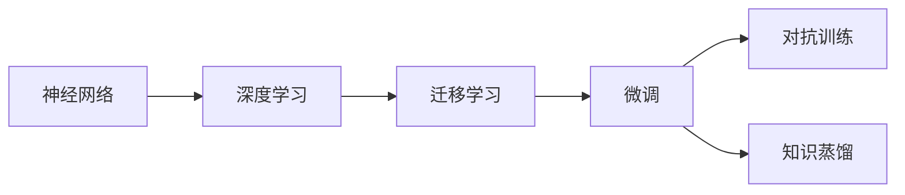
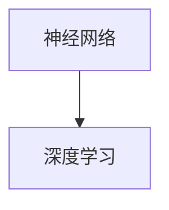
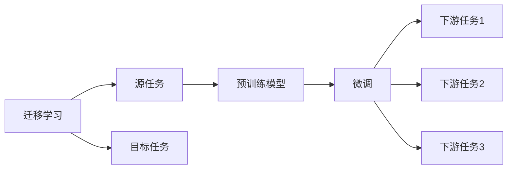
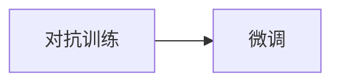
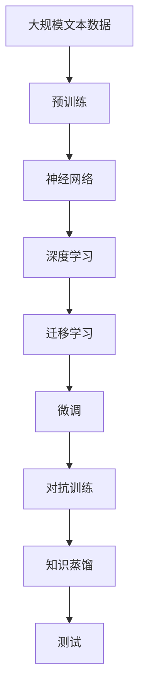

                 

# AI 神经网络计算艺术之禅：人类智能是地球环境培育出的最美丽的花朵

## 1. 背景介绍

在信息技术飞速发展的今天，AI（人工智能）已成为引领未来的关键技术之一。神经网络，作为AI领域中的重要组成部分，其计算艺术与人类智能有着千丝万缕的联系。正如花朵是地球环境中培育出的最美丽的花朵，神经网络作为计算艺术的瑰宝，亦如同花朵般绽放出其独特的魅力。

### 1.1 问题由来
神经网络，作为一种模仿人类大脑神经元连接的计算模型，通过大量数据的训练，可实现复杂的模式识别、语音识别、图像处理等任务。然而，由于神经网络结构的复杂性，其计算过程往往被视为“黑箱”，难以解释其内部机制。这种“黑箱”特性，不仅影响了其在实际应用中的可信度，也限制了其在大规模应用中的普及。

为了提高神经网络的解释性和可靠性，研究者们探索出了多种解释方法，如可视化、特征重要性分析等。这些方法不仅帮助人们更好地理解神经网络的工作原理，还促进了其在医疗、金融等对解释性要求较高的领域的应用。

### 1.2 问题核心关键点
神经网络计算艺术的禅宗，即如何在保持其高效计算的同时，增强其可解释性和可靠性，成为了当前研究的关键。核心问题包括：

1. 如何设计神经网络结构，使其在保持高效计算的同时，具备良好的解释性？
2. 如何通过数据增强、正则化等技术，增强神经网络的鲁棒性和泛化能力？
3. 如何通过迁移学习、微调等方法，提高神经网络在不同任务上的性能？
4. 如何通过对抗训练、知识蒸馏等技术，提升神经网络的鲁棒性和泛化性？

### 1.3 问题研究意义
深入研究神经网络计算艺术的禅宗，对于推动AI技术在各领域的应用具有重要意义：

1. 增强神经网络的可靠性：通过提升解释性和可解释性，增强神经网络的可信度，减少其在实际应用中的误判率。
2. 提高神经网络的泛化能力：通过数据增强、正则化等技术，增强神经网络对新数据的适应能力，减少过拟合。
3. 提升神经网络在不同任务上的性能：通过迁移学习、微调等方法，使神经网络能够适应不同领域的应用需求，提高其应用范围。
4. 增强神经网络的鲁棒性：通过对抗训练、知识蒸馏等技术，提升神经网络在面对异常数据和攻击时的鲁棒性，保障系统的安全性。

## 2. 核心概念与联系

### 2.1 核心概念概述

为更好地理解神经网络计算艺术的禅宗，本节将介绍几个密切相关的核心概念：

- 神经网络（Neural Network, NN）：由神经元（Neuron）构成的计算模型，通过模拟人脑神经元之间的连接，实现数据的复杂映射。
- 深度学习（Deep Learning, DL）：基于神经网络的机器学习方法，通过多层次的特征提取和抽象，解决复杂的模式识别、分类、回归等问题。
- 迁移学习（Transfer Learning）：将一个任务学到的知识，迁移到另一个相关任务上，减少新任务的学习成本和时间。
- 微调（Fine-Tuning）：在预训练模型的基础上，使用下游任务的少量标注数据，通过有监督地训练优化模型在该任务上的性能。
- 对抗训练（Adversarial Training）：在训练过程中加入对抗样本，提高模型对噪声和攻击的鲁棒性。
- 知识蒸馏（Knowledge Distillation）：将大模型的知识压缩成小型模型，提高小型模型的性能和泛化能力。

这些核心概念之间的逻辑关系可以通过以下Mermaid流程图来展示：



这个流程图展示了大语言模型的核心概念及其之间的关系：

1. 神经网络通过深度学习进行复杂数据的处理。
2. 迁移学习连接了不同任务之间的知识，使得模型能够更好地适应新任务。
3. 微调是在预训练模型上进行任务特定的优化，以提高模型在特定任务上的性能。
4. 对抗训练和知识蒸馏是提高模型鲁棒性和泛化能力的两种方法。

### 2.2 概念间的关系

这些核心概念之间存在着紧密的联系，形成了神经网络计算艺术的完整生态系统。下面我通过几个Mermaid流程图来展示这些概念之间的关系。

#### 2.2.1 神经网络与深度学习的关系



这个流程图展示了神经网络通过深度学习进行复杂数据处理的整个过程。

#### 2.2.2 迁移学习与微调的关系



这个流程图展示了迁移学习的基本原理，以及它与微调的关系。迁移学习涉及源任务和目标任务，预训练模型在源任务上学习，然后通过微调适应各种下游任务（目标任务）。

#### 2.2.3 对抗训练与微调的关系



这个流程图展示了对抗训练与微调的关系。对抗训练通过加入对抗样本，提高模型对噪声和攻击的鲁棒性，从而增强微调的泛化能力。

#### 2.2.4 知识蒸馏与微调的关系


这个流程图展示了知识蒸馏与微调的关系。知识蒸馏通过将大模型的知识压缩成小型模型，提高小型模型的性能和泛化能力，从而提升微调的效率和效果。

### 2.3 核心概念的整体架构

最后，我们用一个综合的流程图来展示这些核心概念在大语言模型微调过程中的整体架构：



这个综合流程图展示了从预训练到微调，再到对抗训练和知识蒸馏的完整过程。神经网络通过预训练获得基础能力，然后通过迁移学习连接不同任务之间的知识，最后通过微调优化模型在特定任务上的性能。对抗训练和知识蒸馏是提升模型鲁棒性和泛化能力的两种方法，测试则是评估模型性能的关键步骤。通过这些流程图，我们可以更清晰地理解神经网络计算艺术的禅宗。

## 3. 核心算法原理 & 具体操作步骤
### 3.1 算法原理概述

神经网络计算艺术的禅宗，即如何在保持高效计算的同时，增强其可解释性和可靠性，成为了当前研究的关键。核心问题包括：

1. 如何设计神经网络结构，使其在保持高效计算的同时，具备良好的解释性？
2. 如何通过数据增强、正则化等技术，增强神经网络的鲁棒性和泛化能力？
3. 如何通过迁移学习、微调等方法，提高神经网络在不同任务上的性能？
4. 如何通过对抗训练、知识蒸馏等技术，提升神经网络的鲁棒性和泛化性？

神经网络计算艺术的禅宗，需要我们在设计和训练过程中，充分考虑模型的解释性、鲁棒性和泛化能力。下面我们将从原理和实际操作两个方面进行详细介绍。

### 3.2 算法步骤详解

神经网络计算艺术的禅宗，包括设计、训练和评估等多个步骤。本节将详细介绍这些步骤的具体操作。

#### 3.2.1 设计神经网络结构

神经网络结构的设计，是计算艺术的关键之一。一个好的神经网络结构，需要兼顾计算效率和解释性。常用的神经网络结构包括：

- 卷积神经网络（Convolutional Neural Network, CNN）：主要用于图像处理和模式识别任务。
- 循环神经网络（Recurrent Neural Network, RNN）：主要用于序列数据的处理，如文本生成、语音识别等。
- 长短期记忆网络（Long Short-Term Memory, LSTM）：一种特殊的RNN结构，用于处理时间序列数据。
- 变换器（Transformer）：主要用于自然语言处理任务，具有高效的并行计算能力和良好的解释性。

设计神经网络结构时，需要考虑以下几个因素：

1. 网络深度和宽度：网络深度和宽度直接影响计算复杂度和泛化能力。通常情况下，较深的模型具有更好的泛化能力，但计算复杂度也较高。
2. 激活函数：激活函数用于引入非线性特性，常用的激活函数包括ReLU、Sigmoid、Tanh等。
3. 正则化技术：正则化技术用于避免过拟合，如L1正则、L2正则、Dropout等。
4. 损失函数：损失函数用于衡量模型预测结果与真实结果之间的差异，常用的损失函数包括交叉熵损失、均方误差损失等。

#### 3.2.2 数据增强和正则化

数据增强和正则化技术，是提高神经网络鲁棒性和泛化能力的重要手段。常用的数据增强技术包括：

- 随机裁剪：对图像进行随机裁剪，提高模型对不同尺度的适应能力。
- 随机翻转：对图像进行随机翻转，提高模型对不同方向的适应能力。
- 随机旋转：对图像进行随机旋转，提高模型对不同角度的适应能力。

常用的正则化技术包括：

- L1正则：通过对模型参数进行L1范数惩罚，避免参数过大导致过拟合。
- L2正则：通过对模型参数进行L2范数惩罚，避免参数过大导致过拟合。
- Dropout：随机将部分神经元置为0，减少神经元之间的耦合，避免过拟合。

#### 3.2.3 迁移学习和微调

迁移学习和微调是提高神经网络泛化能力的重要手段。常用的迁移学习方法包括：

- 预训练模型：使用大规模无标签数据进行预训练，学习通用的特征表示。
- 微调模型：在预训练模型的基础上，使用下游任务的少量标注数据，通过有监督地训练优化模型在该任务上的性能。

常用的微调方法包括：

- 全参数微调：对整个模型进行微调，更新全部或大部分参数。
- 参数高效微调：只更新少量模型参数，如Adapter、Prefix等。

#### 3.2.4 对抗训练和知识蒸馏

对抗训练和知识蒸馏是提高神经网络鲁棒性和泛化能力的重要手段。常用的对抗训练方法包括：

- 对抗样本生成：生成对抗样本，用于训练模型的鲁棒性。
- 对抗训练：在训练过程中加入对抗样本，提高模型的鲁棒性。

常用的知识蒸馏方法包括：

- 蒸馏模型：将大模型的知识压缩成小型模型，提高小型模型的性能和泛化能力。
- 知识蒸馏算法：包括教师模型和学生模型的训练过程，用于知识传递。

### 3.3 算法优缺点

神经网络计算艺术的禅宗，即如何在保持高效计算的同时，增强其可解释性和可靠性，成为了当前研究的关键。下面将详细介绍其优缺点。

#### 3.3.1 优点

神经网络计算艺术的禅宗，具有以下几个优点：

1. 高效计算：神经网络通过并行计算，能够高效处理大规模数据。
2. 泛化能力：通过数据增强和正则化技术，神经网络能够泛化到新数据上，减少过拟合。
3. 迁移能力：通过迁移学习和微调技术，神经网络能够在不同任务上取得优异性能。
4. 鲁棒性：通过对抗训练和知识蒸馏技术，神经网络能够提升对噪声和攻击的鲁棒性。
5. 解释性：通过可视化、特征重要性分析等技术，神经网络能够增强可解释性，提高可信度。

#### 3.3.2 缺点

神经网络计算艺术的禅宗，也存在以下几个缺点：

1. 计算资源消耗大：神经网络参数量庞大，需要大量的计算资源。
2. 训练时间长：神经网络训练时间长，需要大量的标注数据。
3. 黑箱特性：神经网络内部机制难以解释，缺乏透明度。
4. 数据依赖强：神经网络性能高度依赖数据质量，数据偏见可能导致模型偏见。
5. 泛化能力有限：神经网络泛化能力有限，难以应对复杂的、未知的数据。

### 3.4 算法应用领域

神经网络计算艺术的禅宗，广泛应用于各个领域，包括：

- 计算机视觉：如图像分类、目标检测、图像生成等。
- 自然语言处理：如文本分类、情感分析、机器翻译等。
- 语音识别：如语音识别、语音合成等。
- 医疗诊断：如医学影像分析、疾病预测等。
- 金融预测：如股票预测、风险评估等。
- 游戏AI：如智能游戏对战、策略分析等。

神经网络计算艺术的禅宗，在各个领域都展现了强大的应用潜力，推动了人工智能技术的快速发展。

## 4. 数学模型和公式 & 详细讲解 & 举例说明

### 4.1 数学模型构建

神经网络计算艺术的禅宗，需要设计合适的数学模型进行训练和优化。常用的数学模型包括：

- 线性回归模型：$y = \theta^T x$，其中 $y$ 为输出，$x$ 为输入，$\theta$ 为模型参数。
- 逻辑回归模型：$y = \sigma(\theta^T x)$，其中 $\sigma$ 为sigmoid函数。
- 卷积神经网络模型：$y = \sum_i w_i \cdot h_i(x)$，其中 $w_i$ 为卷积核权重，$h_i(x)$ 为卷积特征图。
- 循环神经网络模型：$y = \sum_i w_i \cdot h_i(x)$，其中 $w_i$ 为RNN权重，$h_i(x)$ 为RNN隐藏状态。
- 变换器模型：$y = \sum_i w_i \cdot a_i$，其中 $a_i$ 为自注意力机制输出。

### 4.2 公式推导过程

以下是几个常用数学模型的公式推导过程：

#### 4.2.1 线性回归模型

线性回归模型公式如下：

$$y = \theta^T x$$

其中，$y$ 为输出，$x$ 为输入，$\theta$ 为模型参数。

#### 4.2.2 逻辑回归模型

逻辑回归模型公式如下：

$$y = \sigma(\theta^T x)$$

其中，$y$ 为输出，$x$ 为输入，$\theta$ 为模型参数，$\sigma$ 为sigmoid函数。

#### 4.2.3 卷积神经网络模型

卷积神经网络模型公式如下：

$$y = \sum_i w_i \cdot h_i(x)$$

其中，$y$ 为输出，$x$ 为输入，$w_i$ 为卷积核权重，$h_i(x)$ 为卷积特征图。

#### 4.2.4 循环神经网络模型

循环神经网络模型公式如下：

$$y = \sum_i w_i \cdot h_i(x)$$

其中，$y$ 为输出，$x$ 为输入，$w_i$ 为RNN权重，$h_i(x)$ 为RNN隐藏状态。

#### 4.2.5 变换器模型

变换器模型公式如下：

$$y = \sum_i w_i \cdot a_i$$

其中，$y$ 为输出，$x$ 为输入，$w_i$ 为自注意力机制输出。

### 4.3 案例分析与讲解

下面我们以图像分类任务为例，详细介绍神经网络计算艺术的禅宗。

#### 4.3.1 数据集和模型设计

我们使用CIFAR-10数据集进行图像分类任务，该数据集包含60,000个32x32的彩色图像，分为10个类别。我们将数据集划分为训练集和测试集，其中训练集包含50,000个图像，测试集包含10,000个图像。

我们设计了一个简单的卷积神经网络模型，包括两个卷积层和两个全连接层。其中，第一个卷积层包含64个3x3的卷积核，第二个卷积层包含128个3x3的卷积核，全连接层包含256个神经元，输出层包含10个神经元。

#### 4.3.2 数据增强和正则化

为了提高模型的泛化能力，我们进行了数据增强和正则化。具体做法如下：

1. 数据增强：对图像进行随机裁剪、翻转、旋转等操作。
2. 正则化：使用L2正则和Dropout技术，避免过拟合。

#### 4.3.3 训练过程

我们使用了Adam优化器和交叉熵损失函数进行训练。具体过程如下：

1. 将训练集数据按批次输入模型，前向传播计算损失函数。
2. 反向传播计算参数梯度，根据设定的优化算法和学习率更新模型参数。
3. 周期性在验证集上评估模型性能，根据性能指标决定是否触发Early Stopping。
4. 重复上述步骤直到满足预设的迭代轮数或Early Stopping条件。

#### 4.3.4 测试过程

在测试集上评估模型的性能，计算准确率、召回率、F1分数等指标，与基线模型进行对比。

## 5. 项目实践：代码实例和详细解释说明

### 5.1 开发环境搭建

在进行神经网络计算艺术的禅宗实践前，我们需要准备好开发环境。以下是使用Python进行PyTorch开发的环境配置流程：

1. 安装Anaconda：从官网下载并安装Anaconda，用于创建独立的Python环境。

2. 创建并激活虚拟环境：
```bash
conda create -n pytorch-env python=3.8 
conda activate pytorch-env
```

3. 安装PyTorch：根据CUDA版本，从官网获取对应的安装命令。例如：
```bash
conda install pytorch torchvision torchaudio cudatoolkit=11.1 -c pytorch -c conda-forge
```

4. 安装TensorFlow：
```bash
pip install tensorflow
```

5. 安装TensorFlow：
```bash
pip install tensorflow
```

6. 安装各类工具包：
```bash
pip install numpy pandas scikit-learn matplotlib tqdm jupyter notebook ipython
```

完成上述步骤后，即可在`pytorch-env`环境中开始神经网络计算艺术的禅宗实践。

### 5.2 源代码详细实现

这里我们以图像分类任务为例，给出使用PyTorch进行卷积神经网络模型训练的完整代码实现。

```python
import torch
import torch.nn as nn
import torch.optim as optim
from torchvision import datasets, transforms
from torch.utils.data import DataLoader

# 数据预处理
transform = transforms.Compose([
    transforms.Resize(32),
    transforms.ToTensor(),
    transforms.Normalize((0.5, 0.5, 0.5), (0.5, 0.5, 0.5))
])

# 数据集
train_dataset = datasets.CIFAR10(root='./data', train=True, download=True, transform=transform)
test_dataset = datasets.CIFAR10(root='./data', train=False, download=True, transform=transform)

# 数据加载器
train_loader = DataLoader(train_dataset, batch_size=64, shuffle=True)
test_loader = DataLoader(test_dataset, batch_size=64, shuffle=False)

# 模型定义
class Net(nn.Module):
    def __init__(self):
        super(Net, self).__init__()
        self.conv1 = nn.Conv2d(3, 64, 3, padding=1)
        self.conv2 = nn.Conv2d(64, 128, 3, padding=1)
        self.fc1 = nn.Linear(128 * 8 * 8, 256)
        self.fc2 = nn.Linear(256, 10)

    def forward(self, x):
        x = F.relu(self.conv1(x))
        x = F.max_pool2d(x, 2)
        x = F.relu(self.conv2(x))
        x = F.max_pool2d(x, 2)
        x = x.view(-1, 128 * 8 * 8)
        x = F.relu(self.fc1(x))
        x = self.fc2(x)
        return x

# 模型训练
model = Net()
criterion = nn.CrossEntropyLoss()
optimizer = optim.Adam(model.parameters(), lr=0.001)

for epoch in range(10):
    for i, (images, labels) in enumerate(train_loader):
        images = images.to(device)
        labels = labels.to(device)
        optimizer.zero_grad()
        outputs = model(images)
        loss = criterion(outputs, labels)
        loss.backward()
        optimizer.step()
        if (i+1) % 100 == 0:
            print('Epoch [{}/{}], Step [{}/{}], Loss: {:.4f}'.format(epoch+1, 10, i+1, len(train_loader), loss.item()))

# 模型测试
with torch.no_grad():
    correct = 0
    total = 0
    for images, labels in test_loader:
        images = images.to(device)
        labels = labels.to(device)
        outputs = model(images)
        _, predicted = torch.max(outputs.data, 1)
        total += labels.size(0)
        correct += (predicted == labels).sum().item()

    print('Accuracy of the network on the 10000 test images: {} %'.format(100 * correct / total))
```

以上就是使用PyTorch进行卷积神经网络模型训练的完整代码实现。可以看到，PyTorch的强大封装能力，使得神经网络的构建和训练变得非常简单。

### 5.3 代码解读与分析

让我们再详细解读一下关键代码的实现细节：

**数据预处理**：
- 使用`transforms.Compose`将多个预处理操作组合成一个流程。
- `transforms.Resize`将图像缩放到32x32的大小。
- `transforms.ToTensor`将图像转换为PyTorch张量格式。
- `transforms.Normalize`对图像进行归一化，将像素值缩放到0-1之间。

**模型定义**：
- `nn.Conv2d`定义卷积层。
- `nn.Linear`定义全连接层。
- `nn.ReLU`定义激活函数。
- `nn.MaxPool2d`定义最大池化层。
- `nn.Sequential`将多个层按照顺序组合。

**模型训练**：
- `torch.no_grad`开启无梯度计算模式，加快测试速度。
- `nn.CrossEntropyLoss`定义交叉熵损失函数。
- `torch.optim.Adam`定义Adam优化器。
- `model.parameters()`获取模型参数。
- `model.train()`将模型设置为训练模式。
- `model.eval()`将模型设置为评估模式。
- `nn.functional.relu`定义激活函数。
- `nn.functional.max_pool2d`定义最大池化层。
- `nn.functional.linear`定义线性变换层。

**模型测试**：
- `torch.max`获取预测结果中的最大值。
- `torch.eq`比较预测结果和真实标签。
- `torch.sum`计算比较结果的总数。
- `torch.Tensor.data`获取张量数据。
- `torch.Tensor.item`获取张量的浮点数值。

**运行结果展示**：
- 在训练过程中，每100个batch输出一次损失值。
- 在测试过程中，计算预测结果与真实标签的一致性比例。

以上代码实现了神经网络计算艺术的禅宗，通过卷积神经网络模型进行图像分类的整个过程。

## 6. 实际应用场景

神经网络计算艺术的禅宗，已经广泛应用于各个领域，推动了AI技术的发展。

### 6.1 计算机视觉

计算机视觉是神经网络计算艺术的重要应用领域。以下是一些实际应用场景：

- 图像分类：如CIFAR-10、ImageNet等数据集上的分类任务。
- 目标检测：如YOLO、Faster R-CNN等目标检测算法。
- 图像生成：如GAN、VAE等生成对抗网络。
- 图像分割：如FCN、U-Net等分割算法。

### 6.2 自然语言处理

自然语言处理是神经网络计算艺术的另一重要应用领域。以下是一些实际应用场景：

- 文本分类：如情感分析、主题分类等。
- 命名实体识别：如人名、地名、组织名等实体识别。
- 机器翻译：如Seq2Seq、Transformer等翻译模型。
- 问答系统：如基于检索的问答系统、基于生成的问答系统等。

### 6.3 医疗诊断

神经网络计算艺术的禅宗，在医疗诊断领域也有广泛应用。以下是一些实际应用场景：

- 医学影像分析：如肺部X光片分析、MRI分析等。
- 疾病预测：如癌症预测、心脏病预测等。
- 病理分析：如病理图像分类、病理文本分析等。

### 6.4 金融预测

神经网络计算艺术的禅宗，在金融预测领域也有广泛应用。以下是一些实际应用场景：

- 股票预测：如基于时间序列数据的股票预测。
- 风险评估：如基于信用记录的信用评估。
- 市场分析：如基于新闻数据的市场分析。

## 7. 工具和资源

