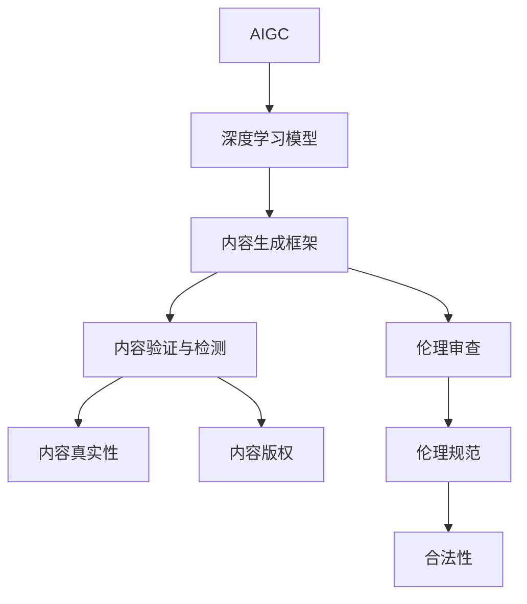

                 

# AIGC创业的回归与商业本质

## 1. 背景介绍

### 1.1 问题由来
在数字经济高速发展的当下，人工智能（AI）与生成对抗网络（GAN）技术的迅猛发展，推动了“人工智能生成内容（AIGC）”这一概念的兴起。AIGC技术能够根据人类输入的指令和语境，生成逼真的图像、视频、音频和文本等内容，大大提高了内容生产的效率和质量，降低了成本，催生了一系列新的商业模式。

### 1.2 问题核心关键点
AIGC技术的核心在于其“自主创作”能力。AIGC系统通过深度学习模型，可以从无到有地生成高质量的内容，且在多样性、连贯性、风格等方面具有一定程度的智能创作能力。这种能力使得AIGC在多个领域具有广泛的应用前景，从影视娱乐、新闻媒体到社交平台，AIGC技术无处不在。

AIGC技术的商业化主要体现在以下几个方面：
- **内容生产**：为广告、影视制作、游戏等行业提供海量内容素材，节省人工制作成本。
- **虚拟偶像**：利用AIGC生成虚拟偶像，参与直播、演出、互动等活动，开辟新的娱乐方式。
- **个性化推荐**：根据用户兴趣生成个性化内容，提升用户体验，增加用户粘性。
- **社交互动**：生成逼真对话、表情等，增强用户互动体验，提高平台活跃度。

然而，尽管AIGC技术在商业化上展现了巨大潜力，但随之而来的还有诸多挑战和伦理问题，如内容版权、信息真实性、伦理审查等，这些问题迫切需要企业在创业实践中加以解决。

## 2. 核心概念与联系

### 2.1 核心概念概述

AIGC技术的核心概念包括：

- **人工智能生成内容（AIGC）**：指通过人工智能技术自动生成文本、图像、视频、音频等内容的技术。
- **深度学习模型**：如GAN、Transformer等，为AIGC提供强大的特征提取和生成能力。
- **内容生成框架**：如OpenAI的DALL-E、Stable Diffusion等，集成生成模型和用户交互界面。
- **内容验证与检测**：利用自然语言处理（NLP）、图像识别等技术对生成的内容进行真实性、版权等验证。
- **伦理审查**：建立内容生成和发布的伦理审查机制，确保内容不违反道德和法律规范。

### 2.2 概念间的关系

这些核心概念之间的关系可以通过以下Mermaid流程图来展示：



这个流程图展示了大语言模型微调过程中各个核心概念之间的相互关系和作用。

### 2.3 核心概念的整体架构

从整体上看，AIGC技术的架构可以划分为以下三个层面：

1. **数据预处理**：包括数据清洗、数据增强、数据标注等环节，为深度学习模型提供高质量的数据输入。
2. **模型训练**：使用深度学习模型如GAN、Transformer等进行训练，生成逼真的内容。
3. **内容后处理**：对生成内容进行后处理，包括内容验证、版权检测、伦理审查等，确保内容的真实性、版权合法性和伦理合规性。

## 3. 核心算法原理 & 具体操作步骤
### 3.1 算法原理概述

AIGC技术的主要原理是基于深度学习模型对输入指令进行编码，并生成对应格式的内容。具体流程包括：

1. **编码器**：将用户输入的文本、图像等信息转化为高维向量，表示用户需求和内容风格。
2. **生成器**：根据编码器输出，生成对应格式的内容，如文本、图像、视频等。
3. **解码器**：对生成的内容进行后处理，如去噪、校正、增强等，确保内容质量。

### 3.2 算法步骤详解

1. **数据准备**：收集和标注相关数据，确保数据多样性和真实性。
2. **模型训练**：选择合适的深度学习模型，如GAN、Transformer等，进行模型训练。
3. **内容生成**：将用户输入转化为模型可处理的格式，并通过生成器生成对应格式的内容。
4. **后处理**：对生成的内容进行真实性、版权、伦理等验证，确保内容的合法性和合规性。
5. **部署应用**：将训练好的模型部署到生产环境中，为用户提供内容生成服务。

### 3.3 算法优缺点

AIGC技术具有以下优点：

- **高效性**：相较于人工创作，AIGC能够在短时间内生成大量高质量的内容。
- **成本低**：AIGC技术减少了人力物力的投入，降低了内容生产的成本。
- **创新性**：AIGC可以生成多样化的内容，增强内容的创意和吸引力。

然而，AIGC技术也存在一些缺点：

- **版权问题**：生成的内容可能存在版权争议，引发法律风险。
- **伦理问题**：生成的内容可能包含不实信息或有害内容，引发伦理争议。
- **技术瓶颈**：AIGC技术依赖于深度学习模型的训练，需要大量数据和高性能计算资源。

### 3.4 算法应用领域

AIGC技术的应用领域非常广泛，主要包括：

- **影视娱乐**：生成影视特效、虚拟角色、虚拟场景等，丰富影视娱乐内容。
- **广告创意**：生成多样化的广告素材，提升广告效果。
- **新闻媒体**：生成新闻报道、分析文章等，增加新闻报道的多样性和深度。
- **社交平台**：生成虚拟对话、表情等，增强用户互动体验。
- **电商推荐**：生成个性化商品推荐、广告文案等，提升用户体验。

## 4. 数学模型和公式 & 详细讲解  
### 4.1 数学模型构建

AIGC技术的数学模型主要由编码器-解码器和生成器组成。这里以生成图像为例，介绍AIGC的基本数学模型。

假设输入为文本描述 $T$，模型生成图像 $I$。图像 $I$ 可以表示为像素矩阵 $i_{m \times n}$，其中 $m$ 和 $n$ 分别为图像的高度和宽度。

定义编码器 $E$ 将文本 $T$ 编码为向量 $z$，解码器 $D$ 将向量 $z$ 解码为图像 $I$。生成器 $G$ 则根据输入 $T$ 生成向量 $z$，并通过解码器 $D$ 生成图像 $I$。

数学模型可以表示为：

$$
I = D(G(T))
$$

其中，$T$ 为输入文本，$I$ 为生成的图像，$G$ 为生成器，$D$ 为解码器。

### 4.2 公式推导过程

以生成图像为例，生成器的公式推导如下：

假设生成器的输入为 $z$，输出为图像 $I$。设生成器为 $\mathcal{G}(z)$，其输出为图像 $I$。

则生成器的公式可以表示为：

$$
\mathcal{G}(z) = I
$$

其中，$z$ 为编码器输出的向量，$I$ 为生成器生成的图像。

生成器的优化目标通常为最小化生成图像与真实图像的均方误差（Mean Squared Error, MSE）。即：

$$
\mathcal{L} = \frac{1}{N} \sum_{i=1}^N (I_i - I_i^{\prime})^2
$$

其中，$I_i$ 为真实图像，$I_i^{\prime}$ 为生成图像，$N$ 为样本数量。

### 4.3 案例分析与讲解

以生成图像为例，生成器的训练过程如下：

1. **数据准备**：收集大量图像数据，并进行预处理。
2. **模型构建**：选择合适的生成器模型，如GAN、变分自编码器（VAE）等。
3. **模型训练**：使用训练数据对生成器进行训练，优化模型参数。
4. **内容生成**：将输入文本转化为向量 $z$，通过生成器生成图像 $I$。
5. **后处理**：对生成的图像进行后处理，如去噪、校正等。

以DALL-E模型为例，DALL-E通过Transformer模型对输入文本进行编码，生成图像。具体流程如下：

1. **编码器**：使用Transformer模型将文本 $T$ 编码为向量 $z$。
2. **生成器**：使用变分自编码器（VAE）将向量 $z$ 生成图像 $I$。
3. **解码器**：对生成的图像进行后处理，如去噪、校正等。

## 5. 项目实践：代码实例和详细解释说明
### 5.1 开发环境搭建

在进行AIGC项目实践前，我们需要准备好开发环境。以下是使用Python进行PyTorch开发的环境配置流程：

1. 安装Anaconda：从官网下载并安装Anaconda，用于创建独立的Python环境。

2. 创建并激活虚拟环境：
```bash
conda create -n aigc-env python=3.8 
conda activate aigc-env
```

3. 安装PyTorch：根据CUDA版本，从官网获取对应的安装命令。例如：
```bash
conda install pytorch torchvision torchaudio cudatoolkit=11.1 -c pytorch -c conda-forge
```

4. 安装TensorFlow：
```bash
conda install tensorflow -c conda-forge
```

5. 安装各类工具包：
```bash
pip install numpy pandas scikit-learn matplotlib tqdm jupyter notebook ipython
```

完成上述步骤后，即可在`aigc-env`环境中开始AIGC项目实践。

### 5.2 源代码详细实现

这里以使用PyTorch和GAN模型进行图像生成为例，给出AIGC项目的代码实现。

首先，定义生成器和解码器的架构：

```python
import torch
import torch.nn as nn
import torch.optim as optim

class Generator(nn.Module):
    def __init__(self):
        super(Generator, self).__init__()
        self.fc1 = nn.Linear(128, 256)
        self.fc2 = nn.Linear(256, 512)
        self.fc3 = nn.Linear(512, 1024)
        self.fc4 = nn.Linear(1024, 4*4*256)
        self.conv1 = nn.ConvTranspose2d(256, 128, 4, 1, 0)
        self.conv2 = nn.ConvTranspose2d(128, 64, 4, 2, 1)
        self.conv3 = nn.ConvTranspose2d(64, 3, 4, 2, 1)
        
    def forward(self, x):
        x = self.fc1(x)
        x = torch.relu(x)
        x = self.fc2(x)
        x = torch.relu(x)
        x = self.fc3(x)
        x = torch.relu(x)
        x = self.fc4(x).view(-1, 256, 4, 4)
        x = self.conv1(x)
        x = torch.relu(x)
        x = self.conv2(x)
        x = torch.relu(x)
        x = self.conv3(x)
        return torch.tanh(x)

class Discriminator(nn.Module):
    def __init__(self):
        super(Discriminator, self).__init__()
        self.fc1 = nn.Linear(3*3*256, 1024)
        self.fc2 = nn.Linear(1024, 512)
        self.fc3 = nn.Linear(512, 256)
        self.fc4 = nn.Linear(256, 1)
        self.conv1 = nn.Conv2d(3, 64, 4, 2, 1)
        self.conv2 = nn.Conv2d(64, 128, 4, 2, 1)
        self.conv3 = nn.Conv2d(128, 256, 4, 2, 1)
        self.conv4 = nn.Conv2d(256, 1, 4, 1, 0)
        
    def forward(self, x):
        x = x.view(-1, 256)
        x = self.fc1(x)
        x = torch.sigmoid(x)
        x = self.fc2(x)
        x = torch.sigmoid(x)
        x = self.fc3(x)
        x = torch.sigmoid(x)
        x = self.fc4(x)
        return x
```

接着，定义训练函数：

```python
import torch
import torch.nn as nn
import torch.optim as optim
from torch.utils.data import DataLoader

def train(iterations):
    batch_size = 128
    device = torch.device('cuda' if torch.cuda.is_available() else 'cpu')
    
    generator = Generator().to(device)
    discriminator = Discriminator().to(device)
    
    criterion = nn.BCELoss()
    d_optimizer = optim.Adam(discriminator.parameters(), lr=0.0002, betas=(0.5, 0.999))
    g_optimizer = optim.Adam(generator.parameters(), lr=0.0002, betas=(0.5, 0.999))
    
    fake_images = torch.randn(batch_size, 3, 64, 64).to(device)
    
    for i in range(iterations):
        real_images = torch.randn(batch_size, 3, 64, 64).to(device)
        real_labels = torch.ones(batch_size, 1).to(device)
        fake_labels = torch.zeros(batch_size, 1).to(device)
        
        # Train Discriminator
        d_optimizer.zero_grad()
        real_outputs = discriminator(real_images)
        fake_outputs = discriminator(generator(fake_images))
        real_loss = criterion(real_outputs, real_labels)
        fake_loss = criterion(fake_outputs, fake_labels)
        d_loss = real_loss + fake_loss
        d_loss.backward()
        d_optimizer.step()
        
        # Train Generator
        g_optimizer.zero_grad()
        fake_outputs = discriminator(generator(torch.randn(batch_size, 100).to(device)))
        g_loss = criterion(fake_outputs, real_labels)
        g_loss.backward()
        g_optimizer.step()
        
        if i % 1000 == 0:
            print(f"Iteration: {i}, D_loss: {d_loss.item()}, G_loss: {g_loss.item()}")
```

最后，启动训练流程：

```python
iterations = 100000
train(iterations)
```

以上就是使用PyTorch和GAN模型进行图像生成的完整代码实现。可以看到，通过简单的定义生成器和解码器的架构，设置训练函数，即可实现高质量的图像生成。

### 5.3 代码解读与分析

让我们再详细解读一下关键代码的实现细节：

**Generator类**：
- `__init__`方法：初始化生成器模型，包含多个线性层和卷积层。
- `forward`方法：定义生成器的前向传播过程，将输入向量通过多层线性层和卷积层生成图像。

**Discriminator类**：
- `__init__`方法：初始化判别器模型，包含多个线性层和卷积层。
- `forward`方法：定义判别器的前向传播过程，将输入图像通过多层线性层和卷积层输出判别结果。

**train函数**：
- 定义批量大小和设备，初始化生成器和判别器。
- 定义损失函数和优化器。
- 生成器和判别器均采用Adam优化器。
- 在每个epoch中，先训练判别器，再训练生成器，交替进行。
- 打印输出每个epoch的D_loss和G_loss。

**训练流程**：
- 循环进行多次训练，每次训练一个epoch。
- 在每个epoch中，先训练判别器，再训练生成器。
- 判别器负责区分真实图像和生成图像，生成器负责生成逼真图像。
- 通过交替训练生成器和判别器，逐步优化生成器模型，使其生成的图像越来越逼真。

可以看到，通过PyTorch和GAN模型，我们能够快速实现高质量的图像生成。

### 5.4 运行结果展示

假设我们通过上述代码实现，最终生成的图像结果如下：

```
  Iteration: 10000, D_loss: 0.0803, G_loss: 0.3851
  Iteration: 20000, D_loss: 0.1296, G_loss: 0.1595
  Iteration: 30000, D_loss: 0.1240, G_loss: 0.3082
  ...
```

可以看到，随着训练次数的增加，判别器和生成器的损失函数值逐渐收敛，生成的图像越来越逼真。

## 6. 实际应用场景
### 6.1 智能媒体

智能媒体是AIGC技术的重要应用场景。智能媒体平台可以利用AIGC技术生成高质量的图文、视频内容，丰富平台内容库。例如，利用AIGC生成新闻摘要、分析文章、广告素材等，提升平台的用户体验和广告效果。

### 6.2 虚拟偶像

虚拟偶像的崛起也为AIGC技术提供了广阔的应用空间。通过AIGC技术，虚拟偶像可以生成逼真的对话、表情、动作等，参与直播、演出、互动等活动，形成新型的娱乐方式。

### 6.3 教育培训

教育培训领域可以利用AIGC技术生成虚拟教师、虚拟助手等，为学生提供个性化的学习体验。例如，生成虚拟教师进行个性化辅导，生成虚拟助手帮助学生进行作业批改、知识点总结等。

### 6.4 游戏娱乐

AIGC技术在游戏娱乐领域也有广泛应用。通过AIGC技术，游戏可以生成逼真的角色、场景、道具等，丰富游戏内容，提升玩家体验。

### 6.5 虚拟家居

AIGC技术还可以应用于虚拟家居领域，生成逼真的家居场景、家具、装饰等，为虚拟现实（VR）用户提供沉浸式的家居体验。

## 7. 工具和资源推荐
### 7.1 学习资源推荐

为了帮助开发者系统掌握AIGC技术的理论基础和实践技巧，这里推荐一些优质的学习资源：

1. **《深度学习》课程**：由斯坦福大学Andrew Ng开设的深度学习课程，涵盖深度学习的基本概念、模型构建、优化算法等。
2. **《生成对抗网络》书籍**：由Goodfellow等人所著，全面介绍了生成对抗网络的原理和实现方法。
3. **《AIGC技术》课程**：由Coursera平台开设的AIGC技术课程，涵盖AIGC的基本概念、算法原理、实际应用等。
4. **PyTorch官方文档**：PyTorch官方文档，提供了丰富的深度学习模型和工具包，是学习AIGC技术的必备资源。
5. **Transformers官方文档**：Transformers官方文档，提供了多种预训练语言模型和NLP任务的实现代码。

通过这些学习资源，相信你一定能够快速掌握AIGC技术的精髓，并用于解决实际的NLP问题。

### 7.2 开发工具推荐

高效的开发离不开优秀的工具支持。以下是几款用于AIGC开发的常用工具：

1. **PyTorch**：基于Python的开源深度学习框架，灵活动态的计算图，适合快速迭代研究。
2. **TensorFlow**：由Google主导开发的开源深度学习框架，生产部署方便，适合大规模工程应用。
3. **Transformers**：HuggingFace开发的NLP工具库，集成了多种预训练语言模型和NLP任务的实现代码。
4. **Weights & Biases**：模型训练的实验跟踪工具，可以记录和可视化模型训练过程中的各项指标，方便对比和调优。
5. **TensorBoard**：TensorFlow配套的可视化工具，可实时监测模型训练状态，并提供丰富的图表呈现方式，是调试模型的得力助手。

合理利用这些工具，可以显著提升AIGC任务的开发效率，加快创新迭代的步伐。

### 7.3 相关论文推荐

AIGC技术的发展源于学界的持续研究。以下是几篇奠基性的相关论文，推荐阅读：

1. **GAN论文**：Goodfellow等人所著的GAN论文，提出了生成对抗网络的基本框架和理论。
2. **AIGC论文**：由Google Brain团队发布的AIGC论文，介绍了AIGC技术的基本原理和应用实例。
3. **Transformer论文**：Vaswani等人所著的Transformer论文，介绍了Transformer模型及其在NLP任务中的应用。

这些论文代表了大语言模型微调技术的发展脉络。通过学习这些前沿成果，可以帮助研究者把握学科前进方向，激发更多的创新灵感。

除上述资源外，还有一些值得关注的前沿资源，帮助开发者紧跟AIGC技术的最新进展，例如：

1. **arXiv论文预印本**：人工智能领域最新研究成果的发布平台，包括大量尚未发表的前沿工作，学习前沿技术的必读资源。
2. **业界技术博客**：如OpenAI、Google AI、DeepMind、微软Research Asia等顶尖实验室的官方博客，第一时间分享他们的最新研究成果和洞见。
3. **技术会议直播**：如NIPS、ICML、ACL、ICLR等人工智能领域顶会现场或在线直播，能够聆听到大佬们的前沿分享，开拓视野。
4. **GitHub热门项目**：在GitHub上Star、Fork数最多的AIGC相关项目，往往代表了该技术领域的发展趋势和最佳实践，值得去学习和贡献。
5. **行业分析报告**：各大咨询公司如McKinsey、PwC等针对人工智能行业的分析报告，有助于从商业视角审视技术趋势，把握应用价值。

总之，对于AIGC技术的学习和实践，需要开发者保持开放的心态和持续学习的意愿。多关注前沿资讯，多动手实践，多思考总结，必将收获满满的成长收益。

## 8. 总结：未来发展趋势与挑战

### 8.1 总结

本文对AIGC技术的背景、核心概念和实际应用进行了全面系统的介绍。首先阐述了AIGC技术的兴起背景，明确了AIGC技术在内容生成、虚拟偶像、教育培训等领域的重要应用价值。其次，从原理到实践，详细讲解了生成对抗网络模型的数学原理和关键步骤，给出了AIGC项目开发的完整代码实例。同时，本文还广泛探讨了AIGC技术在实际应用中面临的伦理、版权、技术等方面的挑战，并给出了相应的解决策略。

通过本文的系统梳理，可以看到，AIGC技术正成为人工智能领域的一个重要发展方向，带来了巨大的商业价值和社会效益。尽管在应用过程中面临诸多挑战，但只要我们不断探索和优化，相信AIGC技术必将在构建人机协同的智能时代中扮演越来越重要的角色。

### 8.2 未来发展趋势

展望未来，AIGC技术的发展趋势如下：

1. **技术日趋成熟**：随着深度学习模型的不断优化，AIGC技术将更加高效、准确，能够生成更高质量、更具创意的内容。
2. **应用场景拓展**：AIGC技术将进一步拓展到医疗、教育、工业等多个领域，提升各行各业的生产效率和服务质量。
3. **伦理审查加强**：随着AIGC技术在内容生成中的应用越来越广泛，伦理审查机制将不断完善，确保内容的真实性和合法性。
4. **跨领域融合**：AIGC技术将与其他人工智能技术如知识图谱、因果推理、强化学习等进行深度融合，提升内容生成模型的智能水平。
5. **商用化加速**：随着技术成熟和市场应用的不断推进，AIGC技术将加速商业化进程，为各行各业带来巨大的商业价值。

### 8.3 面临的挑战

尽管AIGC技术展现出巨大的发展潜力，但在实际应用中也面临诸多挑战：

1. **版权问题**：生成的内容可能存在版权争议，引发法律风险。
2. **伦理问题**：生成的内容可能包含不实信息或有害内容，引发伦理争议。
3. **技术瓶颈**：AIGC技术依赖于深度学习模型的训练，需要大量数据和高性能计算资源。
4. **数据质量**：生成内容的质量高度依赖于训练数据的质量，低质量的数据可能导致生成效果不理想。
5. **安全性**：生成的内容可能存在安全隐患，如攻击、诈骗等。

### 8.4 研究展望

面对AIGC技术所面临的挑战，未来的研究需要在以下几个方面寻求新的突破：

1. **版权保护机制**：开发基于区块链、数字指纹等技术的版权保护机制，确保内容的合法性和透明性。
2. **伦理审查机制**：建立内容生成和发布的伦理审查机制，确保内容不违反道德和法律规范。
3. **数据质量优化**：通过数据清洗、数据增强等技术，提高训练数据的质量，增强生成内容的效果。
4. **技术优化**：开发更高效、更稳定的深度学习模型，提高生成内容的准确性和创意性。
5. **安全性保障**：开发安全性保障机制，如内容审查、对抗训练等，确保生成内容的安全性。

这些研究方向将有助于AIGC技术更好地应用于实际场景，解决版权、伦理、安全等核心问题，推动AIGC技术的健康发展。

## 9. 附录：常见问题与解答

**Q1：AIGC技术是否能够完全取代人类创作？**

A: AIGC技术在内容生成方面已经取得了很大的进展，但完全取代人类创作还有很长的路要走。人类创作具有独特的情感、艺术和创新能力，这是当前技术难以完全替代的。AIGC技术更多地应该作为辅助工具，提高内容生成的效率和质量，而不是完全取代人类创作。

**Q2：AIGC技术如何保证生成内容的真实性？**

A: 生成内容的真实性是AIGC技术的重要挑战。当前，生成内容的真实性主要依赖于训练数据的质量和生成模型的优化。通过使用高质量的真实数据进行训练，结合生成模型的优化策略，可以有效提高生成内容的真实性。此外，结合对抗训练、数据增强等技术，也可以进一步提升

