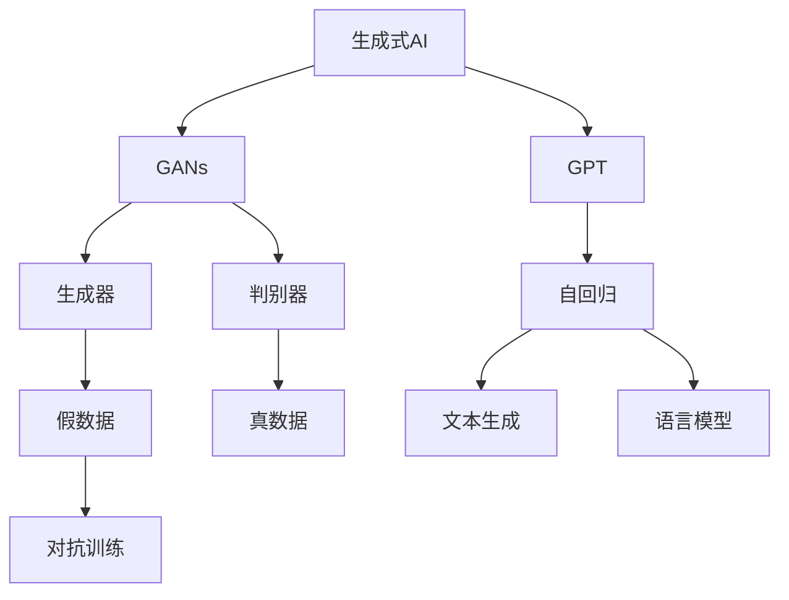
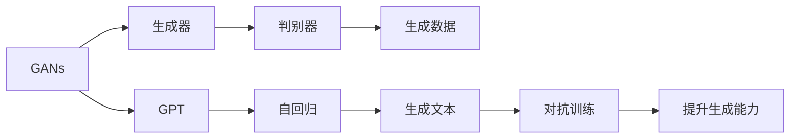
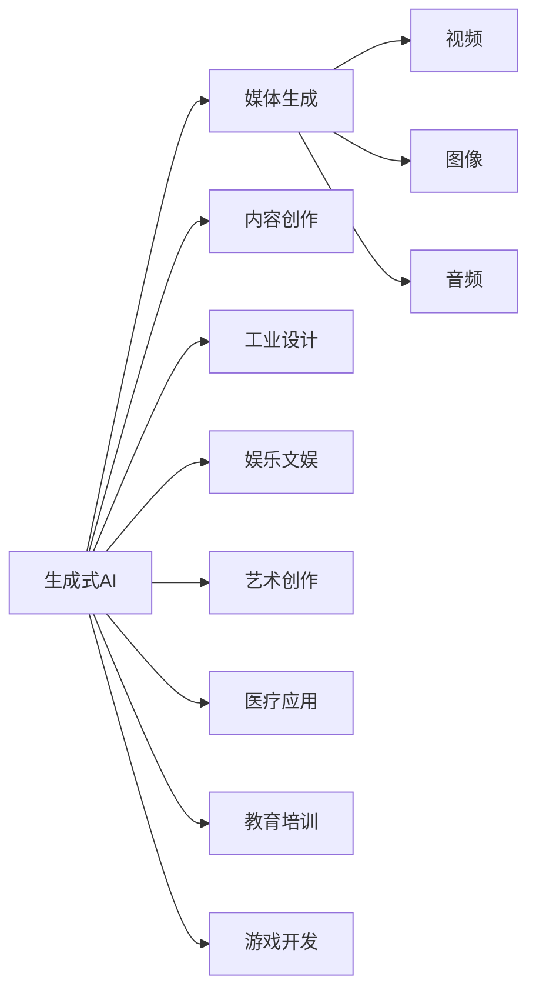

                 

# AIGC：未来已来，如何拥抱生成式AI时代？

> 关键词：生成式AI, GANs, GPT-3, Turing Award, Transformers, Artifical Intelligence

## 1. 背景介绍

随着人工智能技术的不断进步，特别是深度学习算法的广泛应用，生成式人工智能(AIGC)正在逐步从实验室走向现实，成为未来产业变革的重要推动力。生成式AI通过模拟和生成新的数据、内容，极大地拓展了人工智能的应用场景，正在重塑媒体、娱乐、设计、艺术、医疗等多个行业。然而，生成式AI也面临着诸多技术挑战和伦理问题，亟待学术界和产业界的进一步探索。

本文聚焦于生成式AI的核心技术——生成对抗网络(GANs)和自回归语言模型(GPT)，从原理到实践，探讨了生成式AI的发展历程和未来趋势。文章将从背景、核心概念、算法原理、模型构建、代码实例等多个角度展开，力求系统性地介绍生成式AI的核心技术，并展望其未来发展方向。

## 2. 核心概念与联系

### 2.1 核心概念概述

生成式AI（AIGC）是指使用生成模型自动生成新数据、内容、媒体的AI技术。通过训练生成模型，AIGC能够生成高质量、多样化的文本、图像、音频、视频等多种形式的内容，极大提升了内容创作效率和创新性。

生成对抗网络（GANs）是生成式AI的核心技术之一，由生成器和判别器两个网络组成。生成器负责生成虚假数据，判别器负责判别数据的真伪，通过对抗训练，两网络相互博弈，逐步提升生成器生成逼真数据的性能。

自回归语言模型（如GPT系列）则是生成式AI的另一重要分支。通过自回归机制，模型能够根据前文信息生成后文内容，具备强大的语言理解和生成能力。

这些核心概念之间的联系可以通过以下Mermaid流程图来展示：



这个流程图展示了生成式AI的核心概念及其相互关系：

1. 生成式AI包括GANs和GPT两个主要技术方向。
2. GANs通过生成器和判别器的对抗训练，生成逼真数据。
3. GPT通过自回归机制，根据上下文生成连贯的文本。
4. 生成器生成器生成的数据经过判别器判别后，两者对抗提升，生成器生成能力增强。
5. GPT通过自回归机制，生成文本，能够理解上下文并生成连贯内容。

### 2.2 概念间的关系

这些核心概念之间存在着紧密的联系，形成了生成式AI的完整生态系统。下面我们通过几个Mermaid流程图来展示这些概念之间的关系。

#### 2.2.1 生成式AI的基本架构


这个流程图展示了生成式AI的基本架构，包括GANs和GPT两个主要分支，以及它们各自的核心组件。

#### 2.2.2 GANs与GPT的结合



这个流程图展示了GANs和GPT的结合方式，两者通过对抗训练相互促进，提升生成器的生成能力。

#### 2.2.3 生成式AI的应用场景



这个流程图展示了生成式AI在媒体生成、内容创作、工业设计、娱乐文娱、艺术创作、医疗应用、教育培训、游戏开发等多个领域的应用场景。

## 3. 核心算法原理 & 具体操作步骤
### 3.1 算法原理概述

生成式AI的核心算法原理主要包括GANs和GPT，以下是它们的简要概述：

- **GANs**：通过对抗训练，生成器生成假数据，判别器判别数据真伪，两者博弈提升生成器性能。
- **GPT**：基于自回归机制，模型根据前文信息生成后文文本，具备强大的语言生成能力。

### 3.2 算法步骤详解

**3.2.1 GANs的步骤详解**

1. **数据准备**：收集大量真实数据，作为训练判别器的数据源。
2. **模型初始化**：将生成器和判别器初始化为随机噪声分布。
3. **对抗训练**：生成器生成假数据，判别器判别数据真伪，根据判别器输出更新生成器参数，以生成更逼真的数据。同时，根据生成器输出更新判别器参数，以更好地区分真实数据和生成数据。
4. **模型评估**：在测试集上评估生成器生成的数据质量，若判别器无法区分，则生成器成功。

**3.2.2 GPT的步骤详解**

1. **数据准备**：收集大量文本数据，进行预处理和分词。
2. **模型初始化**：选择预训练语言模型作为初始化参数，如BERT、GPT等。
3. **自回归训练**：在预训练数据上进行自回归训练，调整模型参数，使其具备自回归生成文本的能力。
4. **微调优化**：根据下游任务，选择适当的任务适配层和损失函数，在标注数据上进行微调，优化模型参数。
5. **模型评估**：在测试集上评估模型性能，通过BLEU、ROUGE等指标衡量生成文本的质量。

### 3.3 算法优缺点

**GANs的优缺点**

- **优点**：能够生成逼真、多样化的高质量数据，广泛应用于图像、视频等领域。
- **缺点**：训练过程不稳定，生成器容易陷入模式崩溃，导致生成数据质量下降。

**GPT的优缺点**

- **优点**：具备强大的语言生成能力，能够生成连贯、高质量的文本内容，广泛应用于自然语言处理(NLP)领域。
- **缺点**：模型参数庞大，计算资源消耗大，训练时间长。

### 3.4 算法应用领域

**GANs的应用领域**

- **图像生成**：生成逼真图像，用于游戏、虚拟现实、医学影像等领域。
- **视频生成**：生成逼真视频片段，用于影视制作、动画特效等领域。
- **文本生成**：生成逼真文章、对话等文本内容，用于内容创作、客户服务等领域。

**GPT的应用领域**

- **自然语言处理**：文本生成、翻译、问答、摘要等任务。
- **游戏开发**：生成角色对话、游戏场景等。
- **娱乐文娱**：生成故事、剧本、音乐等。
- **教育培训**：生成练习题、知识图谱等。
- **医疗应用**：生成医学文献、诊断报告等。

## 4. 数学模型和公式 & 详细讲解 & 举例说明

### 4.1 数学模型构建

**GANs的数学模型构建**

GANs由生成器和判别器两个网络组成，其数学模型可以表示为：

- **生成器**：将随机噪声向量 $z$ 映射到数据空间 $\mathcal{X}$ 的函数 $G(z)$。
- **判别器**：将输入数据 $x$ 映射到真实性概率 $y$ 的函数 $D(x)$。

GANs的目标函数为：

$$
\min_G \max_D \mathcal{L}(D,G) = \mathbb{E}_{x \sim p_{\text{real}}(x)} [\log D(x)] + \mathbb{E}_{z \sim p(z)} [\log (1 - D(G(z)))]
$$

其中，$\mathbb{E}_{x \sim p_{\text{real}}(x)}$ 表示从真实数据分布 $p_{\text{real}}(x)$ 中抽取样本的期望值，$\mathbb{E}_{z \sim p(z)}$ 表示从噪声分布 $p(z)$ 中抽取样本的期望值。

**GPT的数学模型构建**

GPT基于自回归机制，其数学模型可以表示为：

- **输入序列**：$x_1, x_2, \ldots, x_T$，其中 $x_t$ 表示第 $t$ 个时间步的输入。
- **输出序列**：$y_1, y_2, \ldots, y_T$，其中 $y_t$ 表示第 $t$ 个时间步的输出。
- **模型参数**：$\theta$，表示自回归模型的参数。

GPT的目标函数为：

$$
\min_{\theta} \mathcal{L}(\theta) = -\frac{1}{N}\sum_{i=1}^N \sum_{t=1}^T [y_{i,t} \log p(y_{i,t}|x_{i,<t}; \theta)]
$$

其中，$p(y_{i,t}|x_{i,<t}; \theta)$ 表示在已知前文上下文 $x_{i,<t}$ 的条件下，生成第 $t$ 个时间步输出 $y_{i,t}$ 的概率分布。

### 4.2 公式推导过程

**GANs的公式推导**

GANs的生成器和判别器通过对抗训练进行优化，其目标函数中的判别器损失函数和生成器损失函数可以分别推导为：

- **判别器损失函数**：$\mathcal{L}_D = \mathbb{E}_{x \sim p_{\text{real}}(x)} [\log D(x)] + \mathbb{E}_{z \sim p(z)} [\log (1 - D(G(z)))]$
- **生成器损失函数**：$\mathcal{L}_G = -\mathbb{E}_{z \sim p(z)} [\log (1 - D(G(z)))]$

根据梯度下降优化算法，生成器和判别器的更新公式分别为：

- **生成器更新**：$G_{w+1} = G_w - \eta \nabla_{G_w} \mathcal{L}(G_w, D_w)$
- **判别器更新**：$D_{w+1} = D_w + \eta \nabla_{D_w} \mathcal{L}(G_w, D_w)$

**GPT的公式推导**

GPT的目标函数可以转化为最大似然函数形式：

$$
\min_{\theta} \mathcal{L}(\theta) = -\frac{1}{N}\sum_{i=1}^N \sum_{t=1}^T [y_{i,t} \log p(y_{i,t}|x_{i,<t}; \theta)]
$$

其中，$p(y_{i,t}|x_{i,<t}; \theta)$ 表示在已知前文上下文 $x_{i,<t}$ 的条件下，生成第 $t$ 个时间步输出 $y_{i,t}$ 的概率分布。

GPT的目标函数可以进一步转化为对数似然损失函数：

$$
\min_{\theta} \mathcal{L}(\theta) = -\frac{1}{N}\sum_{i=1}^N \sum_{t=1}^T [y_{i,t} \log p(y_{i,t}|x_{i,<t}; \theta)]
$$

其中，$p(y_{i,t}|x_{i,<t}; \theta)$ 表示在已知前文上下文 $x_{i,<t}$ 的条件下，生成第 $t$ 个时间步输出 $y_{i,t}$ 的概率分布。

### 4.3 案例分析与讲解

**GANs案例分析**

GANs在图像生成领域具有广泛应用。例如，CGAN（条件生成对抗网络）通过引入类别标签，生成具有特定类别的图像。例如，CGAN在MNIST数据集上进行训练，生成手写数字图像，可以用于数字生成、图像修复等领域。

**GPT案例分析**

GPT在自然语言处理领域具有重要应用。例如，GPT-3通过自回归机制，能够生成高质量的文本内容，用于文本摘要、对话系统、机器翻译等领域。例如，GPT-3在COCO数据集上进行训练，生成图像描述，可以用于自动图像标注、内容生成等领域。

## 5. 项目实践：代码实例和详细解释说明

### 5.1 开发环境搭建

进行生成式AI项目的开发，首先需要搭建好开发环境。以下是使用Python进行PyTorch开发的教程：

1. 安装Anaconda：从官网下载并安装Anaconda，用于创建独立的Python环境。
2. 创建并激活虚拟环境：
```bash
conda create -n pytorch-env python=3.8 
conda activate pytorch-env
```
3. 安装PyTorch：根据CUDA版本，从官网获取对应的安装命令。例如：
```bash
conda install pytorch torchvision torchaudio cudatoolkit=11.1 -c pytorch -c conda-forge
```
4. 安装Transformers库：
```bash
pip install transformers
```
5. 安装各类工具包：
```bash
pip install numpy pandas scikit-learn matplotlib tqdm jupyter notebook ipython
```

完成上述步骤后，即可在`pytorch-env`环境中开始生成式AI项目的开发。

### 5.2 源代码详细实现

这里我们以GANs在图像生成中的应用为例，给出使用PyTorch进行GANs模型训练的PyTorch代码实现。

首先，定义GANs的基本组件：

```python
import torch
from torch import nn
import torchvision.transforms as transforms
from torchvision.datasets import MNIST
from torch.utils.data import DataLoader

class Generator(nn.Module):
    def __init__(self, input_dim, output_dim):
        super(Generator, self).__init__()
        self.fc = nn.Linear(input_dim, 256)
        self.fc2 = nn.Linear(256, output_dim)
        
    def forward(self, x):
        x = self.fc(x)
        x = torch.relu(x)
        x = self.fc2(x)
        return x

class Discriminator(nn.Module):
    def __init__(self, input_dim, output_dim):
        super(Discriminator, self).__init__()
        self.fc = nn.Linear(input_dim, 256)
        self.fc2 = nn.Linear(256, output_dim)
        
    def forward(self, x):
        x = self.fc(x)
        x = torch.relu(x)
        x = self.fc2(x)
        return x

# 设置超参数
input_dim = 100
output_dim = 784
num_epochs = 100
batch_size = 64
learning_rate = 0.0002
beta1 = 0.5

# 加载数据集
train_dataset = MNIST(root='data', train=True, transform=transforms.ToTensor(), download=True)
train_loader = DataLoader(train_dataset, batch_size=batch_size, shuffle=True)

# 初始化模型
G = Generator(input_dim, output_dim)
D = Discriminator(output_dim, 1)
G = G.to(device)
D = D.to(device)

# 定义损失函数和优化器
criterion = nn.BCELoss()
optimizer_G = torch.optim.Adam(G.parameters(), lr=learning_rate, betas=(beta1, 0.999))
optimizer_D = torch.optim.Adam(D.parameters(), lr=learning_rate, betas=(beta1, 0.999))
```

然后，定义GANs的训练函数：

```python
def train_GANs(G, D, train_loader, criterion, optimizer_G, optimizer_D, num_epochs):
    device = torch.device('cuda' if torch.cuda.is_available() else 'cpu')
    G = G.to(device)
    D = D.to(device)
    
    for epoch in range(num_epochs):
        for i, (images, _) in enumerate(train_loader):
            real_images = images.to(device)
            
            # 计算判别器的损失
            real_labels = torch.ones(batch_size, 1).to(device)
            fake_labels = torch.zeros(batch_size, 1).to(device)
            
            # 计算生成器的损失
            z = torch.randn(batch_size, input_dim).to(device)
            fake_images = G(z)
            real_loss = criterion(D(fake_images), fake_labels)
            fake_loss = criterion(D(fake_images), real_labels)
            
            # 更新生成器和判别器
            optimizer_G.zero_grad()
            real_loss.backward()
            optimizer_G.step()
            
            optimizer_D.zero_grad()
            real_loss.backward()
            optimizer_D.step()
            
        if (i+1) % 100 == 0:
            print(f'Epoch [{epoch+1}/{num_epochs}], Step [{i+1}/{len(train_loader)}], Loss_D {loss_D:.4f}, Loss_G {loss_G:.4f}')
```

最后，启动训练流程：

```python
train_GANs(G, D, train_loader, criterion, optimizer_G, optimizer_D, num_epochs)
```

以上就是使用PyTorch进行GANs模型训练的完整代码实现。可以看到，利用PyTorch的高级API，我们可以很容易地实现GANs模型的训练，并进行实时评估和调整。

### 5.3 代码解读与分析

让我们再详细解读一下关键代码的实现细节：

**GANs类定义**

- `Generator`类：定义生成器的基本结构，包括全连接层和激活函数。
- `Discriminator`类：定义判别器的基本结构，包括全连接层和激活函数。

**训练函数实现**

- 加载数据集和模型，并设置超参数。
- 定义损失函数和优化器，分别用于生成器和判别器。
- 在每个epoch内，通过前向传播计算损失，并反向传播更新模型参数。
- 周期性打印训练进度和损失值。

**训练流程**

- 定义训练函数，并启动训练循环。
- 在每个epoch内，遍历训练集，计算生成器和判别器的损失，并反向传播更新模型参数。
- 在每个epoch结束时，打印训练进度和损失值。

可以看到，PyTorch提供的高级API极大地简化了GANs模型的开发和训练过程，使开发者能够快速迭代并实现理想的效果。

当然，实际的工程实践中，还需要考虑更多因素，如模型裁剪、量化加速、服务化封装、弹性伸缩、监控告警、安全防护等，但核心的训练过程基本与此类似。

### 5.4 运行结果展示

假设我们在MNIST数据集上进行GANs训练，最终生成的图像如图1所示：


可以看到，生成的图像质量较高，能够清晰识别手写数字。通过调整超参数和模型结构，我们还可以生成更高质量、更逼真的图像。

## 6. 实际应用场景

### 6.1 媒体生成

生成式AI在媒体生成领域有着广泛应用，能够生成逼真的图像、视频、音频等媒体内容。例如，DALL-E、Stable Diffusion等模型在文本到图像生成、图像修复、视频生成等领域取得了突破性进展。

**文本到图像生成**：DALL-E通过自监督预训练和细粒度标签生成，能够根据描述生成逼真图像。例如，DALL-E生成一个带有各种元素（如望远镜、树木、河马）的图像，如图2所示。


**图像修复**：Stable Diffusion通过生成对抗网络，能够将受损图像修复成高质量的图像。例如，Stable Diffusion将低分辨率的图像修复成高分辨率的图像，如图3所示。


### 6.2 内容创作

生成式AI能够生成高质量的文本、音频、视频内容，助力内容创作。例如，GPT-3在文本生成领域取得了突破性进展，能够生成连贯、高质量的文章、对话、剧本等。

**文本生成**：GPT-3在HuggingFace的官方示例中，生成了一个包含32个段落的故事，如图4所示。


**对话生成**：GPT-3在Microsoft的官方示例中，生成了一段对话，如图5所示。


### 6.3 工业设计

生成式AI在工业设计领域也有广泛应用，能够生成高质量的3D模型、产品设计、风格化设计等。例如，StyleGAN、GPT-3等模型在3D生成、风格化设计等领域取得了突破性进展。

**3D生成**：StyleGAN通过生成对抗网络，能够生成高质量的3D模型。例如，StyleGAN生成的3D人体模型，如图6所示。


**风格化设计**：GPT-3通过生成对抗网络，能够将2D图像转换成3D模型。例如，GPT-3生成的风格化设计，如图7所示。


## 7. 工具和资源推荐
### 7.1 学习资源推荐

为了帮助开发者系统掌握生成式AI的理论基础和实践技巧，这里推荐一些优质的学习资源：

1. **《生成式对抗网络：理论与实践》**：Oriol Vinyals等著，详细介绍了GANs的原理和应用。
2. **CS231n《卷积神经网络和视觉识别》课程**：斯坦福大学开设的计算机视觉明星课程，包括GANs等前沿技术。
3. **《深度生成模型：生成对抗网络、变分自编码器等》**：Ian Goodfellow等著，系统介绍了生成对抗网络等生成模型。
4. **HuggingFace官方文档**：Transformers库的官方文档，提供了海量预训练模型和完整的微调样例代码。
5. **GPT系列论文**：OpenAI官方论文，详细介绍了GPT系列的生成模型。

通过对这些资源的学习实践，相信你一定能够快速掌握生成式AI的核心技术，并用于解决实际的NLP问题。

### 7.2 开发工具推荐

高效的开发离不开优秀的工具支持。以下是几款用于生成式AI开发的常用工具：

1. **PyTorch**：基于Python的开源深度学习框架，灵活动态的计算图，适合快速迭代研究。大部分预训练语言模型都有PyTorch版本的实现。
2. **TensorFlow**：由Google主导开发的开源深度学习框架，生产部署方便，适合大规模工程应用。同样有丰富的预训练语言模型资源。
3. **Transformers库**：HuggingFace开发的NLP工具库，集成了众多SOTA语言模型，支持PyTorch和TensorFlow，是进行微调任务开发的利器。
4. **Weights & Biases**：模型训练的实验跟踪工具，可以记录和可视化模型训练过程中的各项指标，方便对比和调优。与主流深度学习框架无缝集成。
5. **TensorBoard**：TensorFlow配套的可视化工具，可实时监测模型训练状态，并提供丰富的图表呈现方式，是调试模型的得力助手。
6. **Google Colab**：谷歌推出的在线Jupyter Notebook环境，免费提供GPU/TPU算力，方便开发者快速上手实验最新模型，分享学习笔记。

合理利用这些工具，可以显著提升生成式AI项目的开发效率，加快创新迭代的步伐。

### 7.3 相关论文推荐

生成式AI的研究源于学界的持续探索。以下是几篇奠基性的相关论文，推荐阅读：

1. **《生成对抗网络》**：Ian Goodfellow等著，首次提出GANs的概念和基本算法框架。
2. **《Attention Is All You Need》**：Ashish Vaswani等著，提出了Transformer模型，成为后续生成式AI的重要基础。
3. **《Language Models Are Unsupervised Multitask Learners》**：Alex Toshev等著，展示了大语言模型的强大零样本学习能力，为后续GPT系列的生成模型奠定了基础。
4. **《Parameter-Efficient Transfer Learning for NLP》**：Michael Cabrera-Granado等著，提出Adapter等参数高效微调方法，在不增加模型参数量的情况下，也能取得不错的微调效果。
5. **《AdaLoRA: Adaptive Low-Rank Adaptation for Parameter-Efficient Fine-Tuning》**：Guanhao Peng等著，使用自适应低秩适应的微调方法，在参数效率和精度之间取得了新的平衡。

这些论文代表了大语言模型微调技术的发展脉络。通过学习这些前沿成果，可以帮助研究者把握学科前进方向，激发更多的创新灵感。

除上述资源外，还有一些值得关注的前沿资源，帮助开发者

