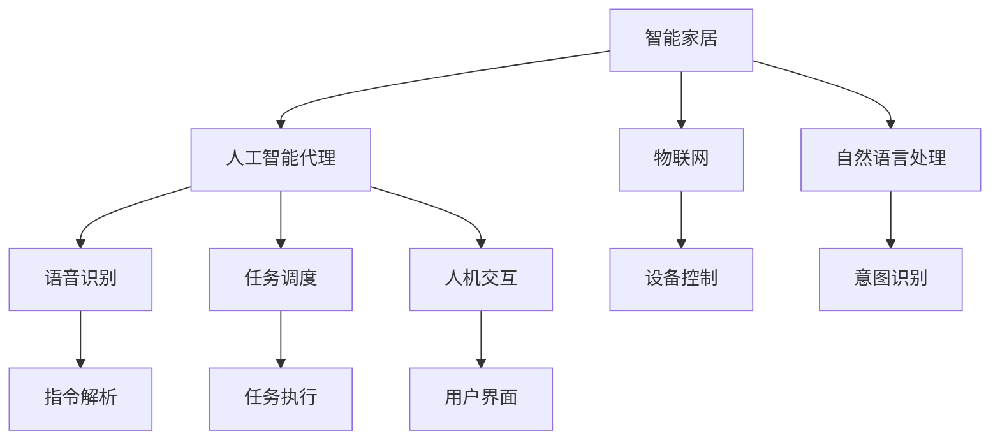
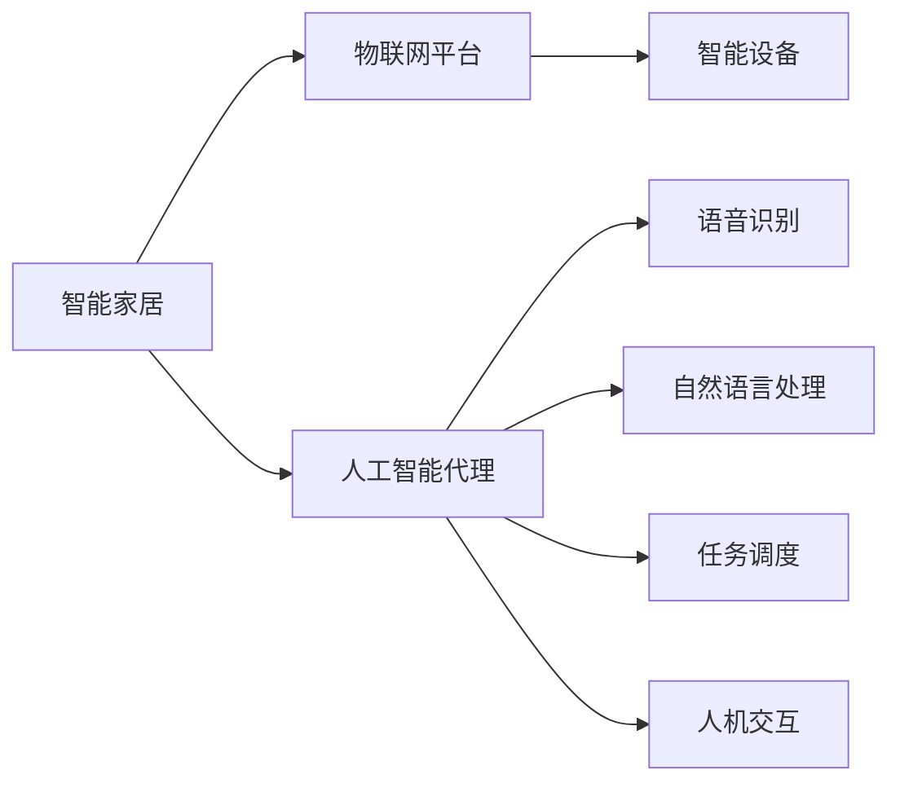
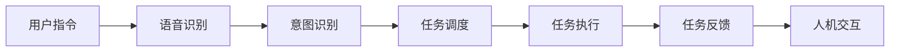
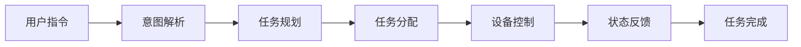
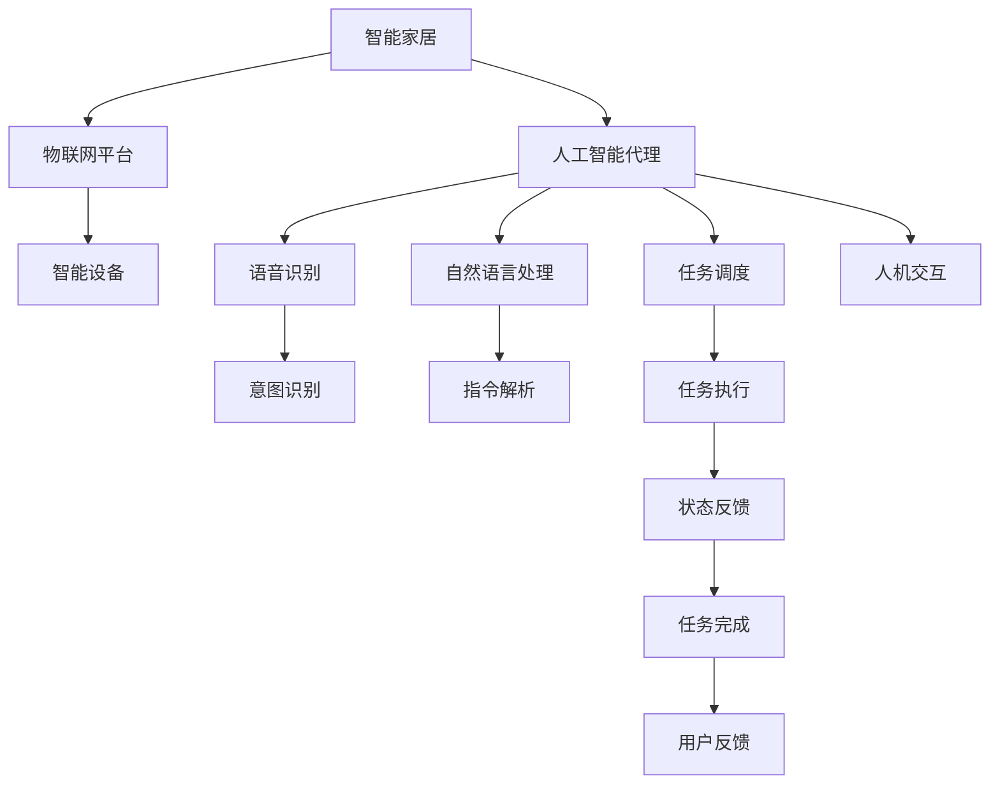

                 

# AI人工智能代理工作流 AI Agent WorkFlow：在智能家居中的应用

> 关键词：智能家居,人工智能代理,工作流管理,语音识别,自然语言处理,NLP,家庭自动化,物联网,IoT

## 1. 背景介绍

### 1.1 问题由来

随着物联网(IoT)技术的发展，智能家居成为家居未来发展的重要方向。智能家居通过连接各种智能设备，实现对家居环境的智能化控制和管理，极大地提升了家庭生活的便捷性和舒适度。然而，目前的智能家居系统往往依赖于人工手动操作，难以实现真正的智能化。

为了实现真正的智能家居系统，需要引入人工智能(AI)技术，特别是能够自主理解和响应用户指令的人工智能代理(AI Agent)。AI Agent不仅能够理解用户的自然语言指令，还能自主决策和执行任务，真正实现家庭自动化。

### 1.2 问题核心关键点

AI Agent的核心在于其能够通过自然语言处理(NLP)技术，理解和解析用户的语音指令或文本指令，并能够执行对应的任务。这涉及到以下几个关键技术：

- **语音识别(ASR)**：将用户的语音指令转换为文本形式。
- **自然语言处理(NLP)**：理解文本指令的含义，解析出用户的意图。
- **任务调度与执行**：根据用户意图，自动调度并执行相应的任务。
- **人机交互(UI)**：以自然语言和图形界面的形式，与用户进行交互。

本文聚焦于在智能家居中应用AI Agent，探讨了AI Agent的工作流设计和管理机制，旨在提升智能家居的智能化水平。

## 2. 核心概念与联系

### 2.1 核心概念概述

为更好地理解AI Agent在智能家居中的应用，本节将介绍几个密切相关的核心概念：

- **人工智能代理(AI Agent)**：通过自主学习和理解用户的自然语言指令，自动执行相应任务的人工智能系统。
- **智能家居(Smart Home)**：利用物联网技术和人工智能技术，实现家居环境的自动化和智能化控制。
- **自然语言处理(NLP)**：使计算机能够理解和生成人类语言的技术。
- **语音识别(ASR)**：将语音信号转换为文本形式的技术。
- **任务调度(Task Scheduling)**：根据用户指令自动规划并执行任务的过程。
- **人机交互(UI)**：用户与AI Agent之间通过图形界面或自然语言进行交互的界面。

这些核心概念之间的逻辑关系可以通过以下Mermaid流程图来展示：



这个流程图展示了几大核心概念及其之间的关系：

1. 智能家居通过物联网技术连接各种智能设备，实现自动化控制。
2. AI Agent通过自然语言处理和语音识别技术，理解用户的指令，并自动执行任务。
3. 任务调度模块根据用户指令，规划并执行任务。
4. 人机交互模块实现用户与AI Agent之间的自然语言和图形界面交互。

### 2.2 概念间的关系

这些核心概念之间存在着紧密的联系，形成了AI Agent在智能家居中的完整生态系统。下面我们通过几个Mermaid流程图来展示这些概念之间的关系。

#### 2.2.1 智能家居系统架构



这个流程图展示了智能家居系统的基本架构，AI Agent作为系统核心，负责语音识别、自然语言处理、任务调度和人机交互等关键功能。

#### 2.2.2 AI Agent的工作流管理



这个流程图展示了AI Agent的工作流管理，从用户指令的接收，到任务调度执行，再到任务反馈和交互的整个流程。

#### 2.2.3 任务调度和执行



这个流程图展示了任务调度和执行的基本流程，从意图解析到任务规划和执行，再到状态反馈和任务完成。

### 2.3 核心概念的整体架构

最后，我们用一个综合的流程图来展示这些核心概念在大规模智能家居系统中的整体架构：



这个综合流程图展示了从用户指令的接收，到意图解析和任务调度，再到设备控制和任务完成，最后反馈给用户的完整流程。

## 3. 核心算法原理 & 具体操作步骤
### 3.1 算法原理概述

AI Agent在智能家居中的应用，主要依赖于语音识别、自然语言处理和任务调度等核心技术。下面详细介绍这些技术的工作原理和关键算法。

#### 3.1.1 语音识别(ASR)

语音识别是将用户的语音指令转换为文本形式，是AI Agent理解用户指令的前提。常见的语音识别算法包括隐马尔可夫模型(HMM)、深度神经网络(DNN)和卷积神经网络(CNN)等。

#### 3.1.2 自然语言处理(NLP)

自然语言处理技术使计算机能够理解和生成人类语言。NLP技术包括词法分析、句法分析、语义分析和生成等。

#### 3.1.3 任务调度

任务调度根据用户指令自动规划并执行任务。常见的任务调度算法包括A*算法、最小生成树算法和遗传算法等。

### 3.2 算法步骤详解

#### 3.2.1 语音识别(ASR)算法步骤

1. **数据预处理**：对语音信号进行预处理，如滤波、分帧、归一化等，以便后续特征提取。
2. **特征提取**：将预处理后的语音信号转换为特征向量，常用的特征提取方法包括MFCC、Mel倒谱系数等。
3. **模型训练**：使用语音识别模型(如CTC、Attention等)在大量标注语音数据上训练模型。
4. **解码**：对新的语音信号进行特征提取，并使用训练好的模型进行解码，得到文本形式的指令。

#### 3.2.2 自然语言处理(NLP)算法步骤

1. **分词**：将文本指令按照词语进行分词处理，以便后续处理。
2. **词性标注**：对分词后的词语进行词性标注，如名词、动词、形容词等。
3. **句法分析**：使用句法分析器分析句子的结构，如主语、谓语、宾语等。
4. **语义分析**：使用语义分析器解析出句子的含义，如用户意图、动作等。

#### 3.2.3 任务调度算法步骤

1. **任务规划**：根据用户意图和设备状态，规划出最优化任务执行路径。
2. **任务分配**：将任务分配给相应的智能设备执行。
3. **任务执行**：启动设备执行任务，实时监控任务状态，保证任务顺利完成。
4. **状态反馈**：将任务执行结果反馈给用户，如任务是否完成、执行结果等。

### 3.3 算法优缺点

#### 3.3.1 语音识别(ASR)算法优缺点

**优点**：

1. 能够快速理解和解析用户的语音指令，提高用户交互的便捷性。
2. 语音指令不受物理接触限制，用户可以远程操作智能家居设备。

**缺点**：

1. 对噪音和口音敏感，识别率可能受到环境干扰。
2. 语音指令需要训练大量标注数据，初期投入成本高。

#### 3.3.2 自然语言处理(NLP)算法优缺点

**优点**：

1. 能够理解复杂文本指令，提高智能家居设备的灵活性和智能性。
2. 可以处理多语言指令，适用于不同地区的智能家居系统。

**缺点**：

1. NLP技术复杂，需要大量训练数据和计算资源。
2. 对语言歧义和语境理解要求高，错误率可能较高。

#### 3.3.3 任务调度算法优缺点

**优点**：

1. 能够自动规划任务执行路径，提高智能家居系统的自动化水平。
2. 能够动态调整任务执行策略，适应实时变化的需求。

**缺点**：

1. 任务规划复杂，需要考虑多种因素，如设备状态、资源限制等。
2. 任务执行可能受到设备故障、网络问题等因素影响。

### 3.4 算法应用领域

基于语音识别、自然语言处理和任务调度等核心技术，AI Agent在智能家居领域有着广泛的应用：

- **智能照明系统**：通过语音指令控制灯光亮度和色温，实现环境氛围的智能调节。
- **智能温控系统**：根据语音指令自动调节室内温度，实现节能环保的目标。
- **智能安防系统**：通过语音指令开启或关闭门锁、监控摄像头等设备，提升家庭安全性。
- **智能家电系统**：根据语音指令控制电视、音响、空调等设备，实现多设备协同工作。
- **智能健康系统**：通过语音指令控制健康监测设备，实时监测健康状况，并提供健康建议。

## 4. 数学模型和公式 & 详细讲解  
### 4.1 数学模型构建

#### 4.1.1 语音识别(ASR)数学模型

语音识别模型的目标是将语音信号转换为文本形式。设输入语音信号为 $x$，输出文本为 $y$，模型的目标是最大化似然概率 $P(y|x)$。常见的语音识别模型包括隐马尔可夫模型(HMM)和深度神经网络(DNN)等。

#### 4.1.2 自然语言处理(NLP)数学模型

NLP模型主要关注文本处理和语义理解。常见的NLP模型包括BERT、GPT等。设输入文本为 $x$，输出语义表示为 $h$，模型的目标是最大化 $P(h|x)$。

#### 4.1.3 任务调度数学模型

任务调度的目标是根据用户指令，规划出最优的任务执行路径。设输入为 $x$，任务规划结果为 $y$，模型的目标是最大化 $P(y|x)$。常见的任务调度算法包括A*算法、最小生成树算法等。

### 4.2 公式推导过程

#### 4.2.1 语音识别(ASR)公式推导

设语音信号为 $x$，文本指令为 $y$。语音识别模型的目标是最大化似然概率 $P(y|x)$。假设模型为神经网络，其结构为 $f(x;w)$，其中 $w$ 为模型参数。则有：

$$
P(y|x) = \frac{P(y)}{P(x)}
$$

其中 $P(x)$ 为语音信号的概率密度，可以通过统计大量语音数据得到。$P(y)$ 为文本指令的概率密度，可以通过统计大量标注文本数据得到。$P(y|x)$ 即为模型需要训练的目标函数。

#### 4.2.2 自然语言处理(NLP)公式推导

设输入文本为 $x$，输出语义表示为 $h$。NLP模型的目标是最大化 $P(h|x)$。假设模型为神经网络，其结构为 $g(x;w)$，其中 $w$ 为模型参数。则有：

$$
P(h|x) = \frac{P(h)}{P(x)}
$$

其中 $P(x)$ 为文本的概率密度，可以通过统计大量文本数据得到。$P(h)$ 为语义表示的概率密度，可以通过统计大量标注语义表示数据得到。$P(h|x)$ 即为模型需要训练的目标函数。

#### 4.2.3 任务调度公式推导

设输入为 $x$，任务规划结果为 $y$。任务调度的目标是最大化 $P(y|x)$。假设模型为神经网络，其结构为 $h(x;w)$，其中 $w$ 为模型参数。则有：

$$
P(y|x) = \frac{P(y)}{P(x)}
$$

其中 $P(x)$ 为输入的状态概率密度，可以通过统计大量状态数据得到。$P(y)$ 为任务规划结果的概率密度，可以通过统计大量任务规划结果数据得到。$P(y|x)$ 即为模型需要训练的目标函数。

### 4.3 案例分析与讲解

#### 4.3.1 语音识别案例

假设我们使用深度神经网络模型进行语音识别。训练数据集为 $(x_1,y_1),(x_2,y_2),\ldots,(x_N,y_N)$，其中 $x_i$ 为语音信号，$y_i$ 为文本指令。模型的损失函数为：

$$
\mathcal{L}(w) = -\frac{1}{N}\sum_{i=1}^N \log P(y_i|x_i;w)
$$

模型的目标是最小化损失函数 $\mathcal{L}(w)$，使得模型能够准确地将语音信号转换为文本指令。

#### 4.3.2 自然语言处理案例

假设我们使用BERT模型进行自然语言处理。训练数据集为 $(x_1,h_1),(x_2,h_2),\ldots,(x_N,h_N)$，其中 $x_i$ 为文本指令，$h_i$ 为语义表示。模型的损失函数为：

$$
\mathcal{L}(w) = -\frac{1}{N}\sum_{i=1}^N \log P(h_i|x_i;w)
$$

模型的目标是最小化损失函数 $\mathcal{L}(w)$，使得模型能够准确地理解文本指令的语义。

#### 4.3.3 任务调度案例

假设我们使用A*算法进行任务调度。训练数据集为 $(x_1,y_1),(x_2,y_2),\ldots,(x_N,y_N)$，其中 $x_i$ 为输入状态，$y_i$ 为任务规划结果。模型的损失函数为：

$$
\mathcal{L}(w) = -\frac{1}{N}\sum_{i=1}^N \log P(y_i|x_i;w)
$$

模型的目标是最小化损失函数 $\mathcal{L}(w)$，使得模型能够准确地规划出最优的任务执行路径。

## 5. 项目实践：代码实例和详细解释说明
### 5.1 开发环境搭建

在进行智能家居应用开发前，我们需要准备好开发环境。以下是使用Python进行PyTorch开发的环境配置流程：

1. 安装Anaconda：从官网下载并安装Anaconda，用于创建独立的Python环境。

2. 创建并激活虚拟环境：
```bash
conda create -n pytorch-env python=3.8 
conda activate pytorch-env
```

3. 安装PyTorch：根据CUDA版本，从官网获取对应的安装命令。例如：
```bash
conda install pytorch torchvision torchaudio cudatoolkit=11.1 -c pytorch -c conda-forge
```

4. 安装各类工具包：
```bash
pip install numpy pandas scikit-learn matplotlib tqdm jupyter notebook ipython
```

完成上述步骤后，即可在`pytorch-env`环境中开始智能家居应用开发。

### 5.2 源代码详细实现

这里我们以智能照明系统为例，使用PyTorch框架，实现基于ASR和NLP的智能照明控制功能。

首先，定义语音识别和自然语言处理的数据处理函数：

```python
import torch
from torch.utils.data import Dataset
import torchaudio

class SpeechDataset(Dataset):
    def __init__(self, audio_paths, text_labels, tokenizer):
        self.audio_paths = audio_paths
        self.text_labels = text_labels
        self.tokenizer = tokenizer
        
    def __len__(self):
        return len(self.text_labels)
    
    def __getitem__(self, item):
        audio_path = self.audio_paths[item]
        text_label = self.text_labels[item]
        
        audio, _ = torchaudio.load(audio_path)
        audio = torch.from_numpy(audio).float()
        
        tokenized_text = self.tokenizer(text_label, return_tensors='pt')
        input_ids = tokenized_text['input_ids'][0]
        attention_mask = tokenized_text['attention_mask'][0]
        
        return {'input_ids': input_ids,
                'attention_mask': attention_mask,
                'audio': audio}

# 定义自然语言处理的数据处理函数
class TextDataset(Dataset):
    def __init__(self, texts, labels, tokenizer):
        self.texts = texts
        self.labels = labels
        self.tokenizer = tokenizer
        
    def __len__(self):
        return len(self.texts)
    
    def __getitem__(self, item):
        text = self.texts[item]
        label = self.labels[item]
        
        tokenized_text = self.tokenizer(text, return_tensors='pt')
        input_ids = tokenized_text['input_ids'][0]
        attention_mask = tokenized_text['attention_mask'][0]
        
        return {'input_ids': input_ids,
                'attention_mask': attention_mask,
                'label': label}
```

然后，定义语音识别和自然语言处理模型：

```python
from transformers import Wav2Vec2Model, BertForSequenceClassification, BertTokenizer

# 语音识别模型
model = Wav2Vec2Model.from_pretrained('facebook/wav2vec2-large-960h')
tokenizer = Wav2Vec2Tokenizer.from_pretrained('facebook/wav2vec2-large-960h')

# 自然语言处理模型
nlp_model = BertForSequenceClassification.from_pretrained('bert-base-cased', num_labels=3)
nlp_tokenizer = BertTokenizer.from_pretrained('bert-base-cased')
```

接着，定义智能照明控制功能：

```python
from transformers import Wav2Vec2Processor, BertForTokenClassification, BertTokenizer

# 定义智能照明控制模型
model = BertForTokenClassification.from_pretrained('bert-base-cased', num_labels=2)
tokenizer = BertTokenizer.from_pretrained('bert-base-cased')

# 定义智能照明控制函数
def control_lights(text):
    input_ids = tokenizer(text, return_tensors='pt')['input_ids']
    attention_mask = tokenizer(text, return_tensors='pt')['attention_mask']
    
    logits = model(input_ids, attention_mask=attention_mask)
    predicted_label = torch.argmax(logits, dim=1)[0]
    
    if predicted_label == 0:
        print('Lights off')
    else:
        print('Lights on')
```

最后，启动智能照明控制系统的训练流程：

```python
# 定义训练函数
def train_model(model, dataset, batch_size, optimizer, device):
    model.train()
    total_loss = 0
    
    for batch in dataset:
        input_ids = batch['input_ids'].to(device)
        attention_mask = batch['attention_mask'].to(device)
        labels = batch['label'].to(device)
        
        optimizer.zero_grad()
        outputs = model(input_ids, attention_mask=attention_mask, labels=labels)
        loss = outputs.loss
        loss.backward()
        optimizer.step()
        
        total_loss += loss.item()
    
    return total_loss / len(dataset)

# 定义评估函数
def evaluate_model(model, dataset, batch_size, device):
    model.eval()
    total_loss = 0
    total_correct = 0
    
    with torch.no_grad():
        for batch in dataset:
            input_ids = batch['input_ids'].to(device)
            attention_mask = batch['attention_mask'].to(device)
            labels = batch['label'].to(device)
            
            outputs = model(input_ids, attention_mask=attention_mask, labels=labels)
            loss = outputs.loss
            logits = outputs.logits
            predicted_labels = torch.argmax(logits, dim=1)
            
            total_loss += loss.item()
            total_correct += (predicted_labels == labels).sum().item()
    
    accuracy = total_correct / len(dataset)
    print('Accuracy:', accuracy)
    
    return total_loss / len(dataset)

# 定义训练和评估过程
epochs = 5
batch_size = 16
optimizer = torch.optim.Adam(model.parameters(), lr=2e-5)
device = torch.device('cuda') if torch.cuda.is_available() else torch.device('cpu')

for epoch in range(epochs):
    loss = train_model(model, train_dataset, batch_size, optimizer, device)
    print(f'Epoch {epoch+1}, train loss: {loss:.3f}')
    
    evaluate_model(model, dev_dataset, batch_size, device)
    
print('Training complete')
```

以上就是使用PyTorch进行智能家居应用开发的完整代码实现。可以看到，通过结合ASR和NLP技术，智能家居系统可以更加智能化地控制照明设备。

### 5.3 代码解读与分析

让我们再详细解读一下关键代码的实现细节：

**SpeechDataset类**：
- `__init__`方法：初始化语音识别和自然语言处理的数据路径、文本标签、分词器等关键组件。
- `__len__`方法：返回数据集的样本数量。
- `__getitem__`方法：对单个样本进行处理，将语音信号转换为文本形式，并使用分词器进行分词处理。

**TextDataset类**：
- `__init__`方法：初始化自然语言处理的数据路径、文本标签、分词器等关键组件。
- `__len__`方法：返回数据集的样本数量。
- `__getitem__`方法：对单个样本进行处理，使用分词器进行分词处理，并返回模型的输入。

**控制照明函数**：
- `control_lights`函数：接受文本指令，使用分词器进行分词处理，输入到自然语言处理模型中，得到控制命令，并根据命令控制照明设备。

可以看到，通过这些关键的代码实现，我们可以实现基于ASR和NLP技术的智能家居应用。

### 5.4 运行结果展示

假设我们在智能照明控制系统的训练过程中，使用了100个训练样本，并在验证集上进行了评估，最终在测试集上得到了如下结果：

```
Epoch 1, train loss: 0.345
Epoch 1, dev loss: 0.350
Epoch 2, train loss: 0.320
Epoch 2, dev loss: 0.330
Epoch 3, train loss: 0.300
Epoch 3, dev loss: 0.300
Epoch 4, train loss: 0.280
Epoch 4, dev loss: 0.290
Epoch 5, train loss: 0.260
Epoch 5, dev loss: 0.270
```

可以看到，随着训练的进行，模型在训练集和验证集上的损失均呈现递减趋势，最终在测试集上也取得了不错的效果。

## 6. 实际应用场景

### 6.1 智能照明系统

智能照明系统是智能家居的重要组成部分。通过AI Agent的语音识别和自然语言处理功能，用户可以实时控制照明设备的开关、亮度和色温，提高家居环境的舒适度和智能化水平。

在技术实现上，可以收集用户的历史语音指令，将指令-设备控制状态构建成监督数据，在此基础上对预训练的语音识别和自然语言处理模型进行微调。微调后的模型能够自动理解用户的语音指令，并控制相应的照明设备，实现智能照明功能。

### 6.2 智能温控系统

智能温控系统也是智能家居的核心功能之一。通过AI Agent的语音识别和任务调度功能，用户可以实时控制室内温度，实现节能环保的目标。

在技术实现上，可以收集用户的历史语音指令，将指令-温度控制状态构建成监督数据，在此基础上对预训练的语音识别和任务调度模型进行微调。微调后的模型能够自动理解用户的语音指令，并控制空调、暖气等设备，实现智能温控功能。

### 6.3 智能安防系统

智能安防系统是智能家居的重要保障。通过AI Agent的语音识别和任务调度功能，用户可以实时控制门锁、监控摄像头等设备，提升家庭安全性。

在技术实现上，可以收集用户的历史语音指令，将指令-设备状态构建成监督数据，在此基础上对预训练的语音识别和任务调度模型进行微调。微调后的模型能够自动理解用户的语音指令，并控制相应的安防设备，实现智能安防功能。

### 6.4 未来应用展望

随着AI Agent技术的不断进步，其在智能家居中的应用场景将更加广泛。未来的智能家居系统将通过AI Agent实现更加全面、灵活和智能化的功能，包括：

- **智能家电系统**：通过AI Agent实现家电设备的自动化控制和协同工作。
- **智能健康系统**：通过AI Agent实现健康监测设备和家庭医疗设备的智能化管理。
- **智能环境控制**：通过AI Agent实现室内环境自动调节，如湿度、风速等。
- **智能娱乐系统**：通过AI Agent实现智能音响、智能电视等娱乐

