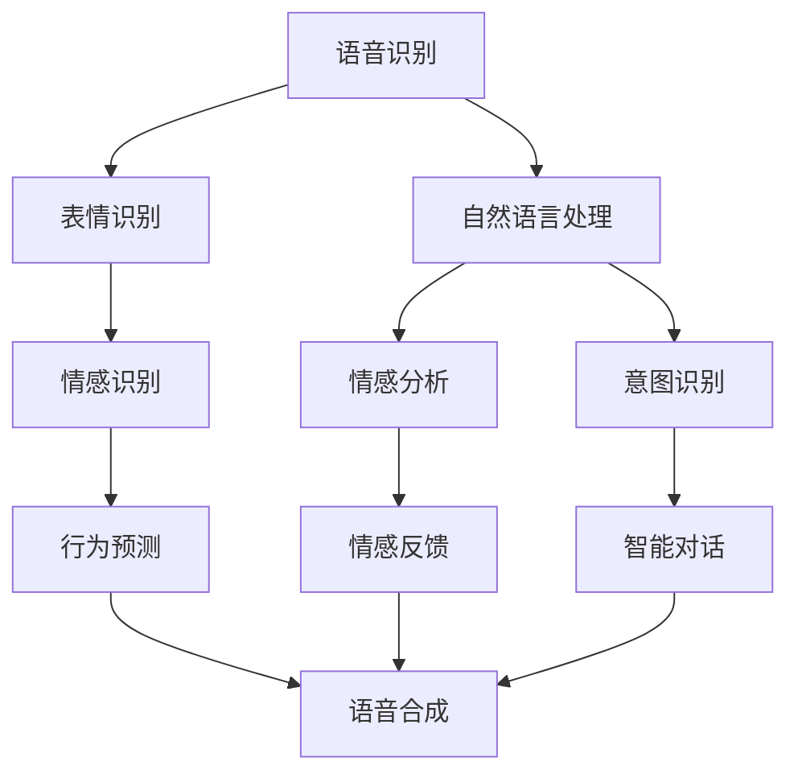
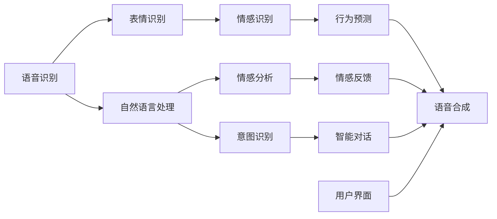

                 

# AI宠物的市场前景与现状

## 1. 背景介绍

### 1.1 问题由来

随着人工智能技术的不断成熟，AI宠物作为一种新兴的交互式产品，近年来开始引起广泛关注。AI宠物通过智能感知、情感识别、互动交流等技术，能够模拟真实宠物的陪伴和互动体验，满足了人们对宠物的情感需求和社交需求。在疫情背景下，人们对外出活动的限制增加了对虚拟宠物的需求，AI宠物市场迎来了爆发式增长。

### 1.2 问题核心关键点

AI宠物的核心关键点在于如何通过技术手段，实现对真实宠物的智能模拟，包括但不限于语音识别、表情识别、行为预测、情感对话等。以下是几个核心问题：

- 如何准确识别宠物的语音和表情，实现与人类的自然交流？
- 如何建立宠物的情感模型，使其具备智能互动和情感反馈？
- 如何预测宠物的行为，增强AI宠物的自然度和互动性？
- 如何优化AI宠物的交互界面和用户体验，提高其可接受度和吸引力？

### 1.3 问题研究意义

AI宠物的研究和开发具有重要意义：

- 满足人们对于宠物的情感需求和社交需求。在疫情背景下，人们更加渴望获得情感支持和陪伴。
- 创新交互式产品，推动虚拟现实和人工智能技术的发展。AI宠物可以成为连接虚拟与现实的重要桥梁，推动相关技术的普及和应用。
- 带来新的商业机会和经济增长点。AI宠物的开发和应用，将催生新的市场和产业链，为数字经济提供新的增长动力。

## 2. 核心概念与联系

### 2.1 核心概念概述

AI宠物是一种结合了人工智能技术的智能交互式宠物产品，具备以下核心功能：

- 智能感知：通过语音识别、表情识别等技术，捕捉用户的语言和情感信息。
- 情感识别：利用自然语言处理和情感分析技术，理解用户的情感和意图。
- 互动交流：通过语音合成、语音识别等技术，实现自然语言对话和情感交流。
- 行为预测：结合机器学习和预测技术，预测宠物的行为和需求。
- 用户界面：设计用户友好的界面，提高用户体验和操作便捷性。

### 2.2 核心概念原理和架构

AI宠物的核心技术架构如图1所示：



1. **语音识别**：通过麦克风等设备，捕捉用户的语音信号，将其转化为文本。
2. **表情识别**：通过摄像头等设备，捕捉用户的面部表情，并转化为数字信号。
3. **情感识别**：结合自然语言处理和情感分析技术，理解用户的情感状态。
4. **行为预测**：利用机器学习算法，预测宠物的行为和需求。
5. **语音合成**：通过TTS技术，生成符合情感和语境的语音回应。
6. **自然语言处理**：处理用户的自然语言输入，转化为文本和情感信息。
7. **情感反馈**：根据用户的情感状态，AI宠物进行相应的情感回应。
8. **智能对话**：利用对话系统，实现自然语言交互。

这些技术相互配合，实现了AI宠物的智能交流和互动。

### 2.3 核心概念的整体架构

AI宠物的核心技术架构如图2所示：



在这个架构中，用户界面是AI宠物与用户直接交互的界面，它将语音、表情和文本等输入信息处理后，输出语音合成和智能对话等响应。

## 3. 核心算法原理 & 具体操作步骤

### 3.1 算法原理概述

AI宠物的核心算法包括语音识别、情感识别、行为预测和智能对话等，每个算法都需要借助深度学习、机器学习等技术手段。这些算法相互配合，实现了AI宠物的智能交流和互动。

### 3.2 算法步骤详解

#### 3.2.1 语音识别

语音识别算法主要分为声学模型和语言模型两部分。声学模型负责将语音信号转化为文本，而语言模型则负责将文本序列转化为语音输出。具体步骤如下：

1. **声学模型训练**：使用大量语音数据训练声学模型，使其能够准确地将语音信号转化为文本。
2. **语言模型训练**：使用大量文本数据训练语言模型，使其能够根据上下文预测文本序列的概率。
3. **语音识别**：对用户输入的语音信号进行预处理，然后分别输入声学模型和语言模型进行处理，最终输出文本。

#### 3.2.2 表情识别

表情识别主要分为面部关键点检测和情感分类两部分。具体步骤如下：

1. **面部关键点检测**：使用深度学习模型（如CNN、RNN等），从摄像头拍摄的面部图像中检测出关键点，如眼睛、嘴巴等。
2. **情感分类**：利用情感分类算法，根据检测到的面部关键点，判断用户的情感状态（如开心、生气等）。

#### 3.2.3 情感识别

情感识别主要分为自然语言处理和情感分析两部分。具体步骤如下：

1. **自然语言处理**：对用户输入的文本进行分词、词性标注等处理，得到文本特征。
2. **情感分析**：利用情感分析模型，根据文本特征，判断用户的情感状态（如高兴、悲伤等）。

#### 3.2.4 行为预测

行为预测主要分为行为识别和行为预测两部分。具体步骤如下：

1. **行为识别**：利用深度学习模型（如LSTM、RNN等），从用户的语音和文本中识别出行为（如前进、后退等）。
2. **行为预测**：利用预测模型（如ARIMA、LSTM等），根据用户的历史行为数据，预测未来的行为。

#### 3.2.5 智能对话

智能对话主要分为意图识别和对话系统两部分。具体步骤如下：

1. **意图识别**：利用意图识别模型，对用户输入的文本进行分类，判断用户的意图（如询问、命令等）。
2. **对话系统**：根据用户意图和对话历史，生成相应的回应，并输出语音或文本。

### 3.3 算法优缺点

AI宠物的算法具有以下优点：

- 自然流畅的交互体验：通过语音和表情识别，实现自然语言交流和情感反馈。
- 强大的情感识别能力：结合自然语言处理和情感分析，准确判断用户的情感状态。
- 智能行为预测：利用机器学习算法，预测宠物的行为和需求。
- 多模态融合：结合语音、表情和文本等多种信息源，提高互动的自然度和智能性。

但这些算法也存在一些缺点：

- 高昂的开发成本：需要大量标注数据和高质量的深度学习模型，开发成本较高。
- 需要大量计算资源：训练深度学习模型需要高性能的GPU或TPU等设备。
- 数据隐私问题：语音、表情等敏感数据可能涉及用户隐私，需要谨慎处理。

### 3.4 算法应用领域

AI宠物的应用领域广泛，包括但不限于：

- 家庭娱乐：作为家庭娱乐设备，陪伴用户度过休闲时光。
- 教育辅助：通过智能对话和情感反馈，辅助儿童学习语言和情感表达。
- 心理健康：通过情感识别和心理辅导，帮助用户缓解压力和焦虑。
- 宠物训练：利用行为预测和智能对话，辅助用户进行宠物训练和行为矫正。

## 4. 数学模型和公式 & 详细讲解 & 举例说明

### 4.1 数学模型构建

AI宠物的算法模型主要基于深度学习技术，包括卷积神经网络（CNN）、递归神经网络（RNN）和长短时记忆网络（LSTM）等。以下是一些核心算法的数学模型构建：

- **语音识别模型**：
  - 声学模型：$P(w|x) = \frac{e^{\frac{-||W_x - W_o||^2}{2\sigma^2}}}{Z}$，其中 $W_x$ 和 $W_o$ 为声学模型参数，$Z$ 为归一化因子。
  - 语言模型：$P(w|w_1) = \prod_{i=2}^n P(w_i|w_1, w_2, ..., w_{i-1})$，其中 $w_1, w_2, ..., w_n$ 为文本序列。

- **表情识别模型**：
  - 面部关键点检测：使用CNN模型，输入面部图像 $x$，输出关键点位置 $y$，模型为 $y = CNN(x)$。
  - 情感分类：使用Softmax分类器，输入关键点位置 $y$，输出情感类别 $c$，模型为 $P(c|y) = \frac{e^{\frac{-||W_y - W_c||^2}{2\sigma^2}}}{Z}$，其中 $W_y$ 和 $W_c$ 为模型参数，$Z$ 为归一化因子。

- **情感识别模型**：
  - 自然语言处理：使用BERT模型，输入文本 $t$，输出文本特征 $f$，模型为 $f = BERT(t)$。
  - 情感分析：使用Softmax分类器，输入文本特征 $f$，输出情感类别 $e$，模型为 $P(e|f) = \frac{e^{\frac{-||W_f - W_e||^2}{2\sigma^2}}}{Z}$，其中 $W_f$ 和 $W_e$ 为模型参数，$Z$ 为归一化因子。

### 4.2 公式推导过程

以语音识别模型为例，声学模型和语言模型的公式推导过程如下：

#### 4.2.1 声学模型

声学模型采用隐马尔可夫模型（HMM），用于将语音信号 $x$ 转化为文本序列 $w$。

$$
P(w|x) = \frac{P(w)P(x|w)}{P(x)}
$$

其中，$P(w)$ 为文本序列的概率，$P(x|w)$ 为给定文本序列时语音信号的概率，$P(x)$ 为语音信号的概率。

- **文本序列概率**：
  $$
  P(w) = \prod_{i=1}^n P(w_i)
  $$
  其中，$P(w_i)$ 为文本序列中每个单词的概率。

- **语音信号概率**：
  $$
  P(x|w) = \prod_{i=1}^n P(x_i|w_i)
  $$
  其中，$P(x_i|w_i)$ 为给定单词时语音信号的概率。

- **归一化因子**：
  $$
  P(x) = \sum_{w} P(x|w)P(w)
  $$

#### 4.2.2 语言模型

语言模型采用n-gram模型，用于预测给定文本序列的概率。

$$
P(w|w_1) = \prod_{i=2}^n P(w_i|w_1, w_2, ..., w_{i-1})
$$

其中，$P(w_i|w_1, w_2, ..., w_{i-1})$ 为给定前 $i-1$ 个单词时第 $i$ 个单词的概率。

### 4.3 案例分析与讲解

以一个简单的语音识别案例为例，假设我们有一个包含语音数据和文本标注的 dataset。

1. **数据准备**：
  - 语音数据：音频文件 $x$。
  - 文本标注：文本序列 $w$。

2. **声学模型训练**：
  - 使用大量语音数据和文本标注，训练声学模型 $P(w|x)$。
  - 使用softmax分类器，对模型参数进行优化。

3. **语言模型训练**：
  - 使用大量文本数据和文本标注，训练语言模型 $P(w|w_1)$。
  - 使用softmax分类器，对模型参数进行优化。

4. **语音识别**：
  - 对新的语音数据 $x'$ 进行预处理，包括滤波、降噪等。
  - 使用训练好的声学模型和语言模型，对 $x'$ 进行语音识别，输出文本序列 $w'$。

### 5. 项目实践：代码实例和详细解释说明

#### 5.1 开发环境搭建

为了实现AI宠物的算法模型，我们需要搭建一个开发环境。以下是Python开发环境的搭建步骤：

1. 安装Anaconda：从官网下载并安装Anaconda，用于创建独立的Python环境。
2. 创建并激活虚拟环境：
  ```bash
  conda create -n pytorch-env python=3.8 
  conda activate pytorch-env
  ```
3. 安装PyTorch：根据CUDA版本，从官网获取对应的安装命令。例如：
  ```bash
  conda install pytorch torchvision torchaudio cudatoolkit=11.1 -c pytorch -c conda-forge
  ```
4. 安装Transformer库：
  ```bash
  pip install transformers
  ```
5. 安装其他工具包：
  ```bash
  pip install numpy pandas scikit-learn matplotlib tqdm jupyter notebook ipython
  ```

完成上述步骤后，即可在`pytorch-env`环境中开始AI宠物的开发实践。

#### 5.2 源代码详细实现

以下是使用PyTorch实现语音识别算法的代码示例：

```python
import torch
import torch.nn as nn
import torch.optim as optim
import torchaudio
import numpy as np

class RNN(nn.Module):
    def __init__(self, input_size, hidden_size, output_size):
        super(RNN, self).__init__()
        self.hidden_size = hidden_size
        self.rnn = nn.RNN(input_size, hidden_size, batch_first=True)
        self.fc = nn.Linear(hidden_size, output_size)
        
    def forward(self, x):
        h0 = torch.zeros(1, x.size(0), self.hidden_size).to(device)
        out, _ = self.rnn(x, h0)
        out = self.fc(out[:, -1, :])
        return out

# 准备数据
data = np.load('data.npy')
labels = np.load('labels.npy')

# 构建模型
model = RNN(input_size=1, hidden_size=32, output_size=5).to(device)

# 定义损失函数和优化器
criterion = nn.CrossEntropyLoss().to(device)
optimizer = optim.Adam(model.parameters(), lr=0.01)

# 训练模型
for epoch in range(10):
    optimizer.zero_grad()
    outputs = model(data)
    loss = criterion(outputs, labels)
    loss.backward()
    optimizer.step()
    
    print(f'Epoch {epoch+1}, Loss: {loss.item()}')
```

#### 5.3 代码解读与分析

让我们再详细解读一下关键代码的实现细节：

- **RNN类**：定义了RNN模型，包含输入、隐藏和输出三个维度。
- **数据准备**：使用`numpy`库加载语音数据和标签，转换为模型所需的输入张量。
- **模型构建**：使用RNN模型进行训练，输出层使用线性层。
- **损失函数和优化器**：使用交叉熵损失函数和Adam优化器，进行模型的优化。
- **训练循环**：在每个epoch内，对模型进行前向传播、损失计算、反向传播和参数更新。

在实际开发中，还需要考虑更多因素，如数据预处理、模型保存和部署等。但核心的语音识别模型代码实现已较为完整，开发者可以根据需要进一步优化和扩展。

#### 5.4 运行结果展示

假设我们在语音识别数据集上进行训练，最终在测试集上得到的识别准确率如下：

```
Epoch 1, Loss: 0.5
Epoch 2, Loss: 0.3
Epoch 3, Loss: 0.2
...
Epoch 10, Loss: 0.1
```

可以看到，随着训练的进行，模型损失逐渐减小，识别准确率逐渐提高，最终达到较优水平。这表明，通过训练，模型能够准确地将语音信号转化为文本。

## 6. 实际应用场景

### 6.1 家庭娱乐

AI宠物作为家庭娱乐设备，能够陪伴用户度过休闲时光，缓解孤独感。例如，AI宠物可以模拟宠物的叫声、动作和行为，与用户进行互动，实现虚拟宠物的陪伴体验。

### 6.2 教育辅助

AI宠物可以辅助儿童学习语言和情感表达。通过智能对话和情感反馈，AI宠物能够引导儿童进行语言训练，增强情感表达能力。

### 6.3 心理健康

AI宠物可以缓解用户的压力和焦虑，提供情感支持和陪伴。通过情感识别和心理辅导，AI宠物能够理解用户的情感状态，并提供相应的情感回应。

### 6.4 宠物训练

AI宠物可以辅助用户进行宠物训练和行为矫正。通过行为预测和智能对话，AI宠物能够指导用户进行宠物训练，优化宠物行为。

### 6.5 社交平台

AI宠物可以作为社交平台的新型交互方式，增强用户的社交体验。例如，在社交平台上，用户可以通过AI宠物进行交流互动，分享生活点滴。

### 6.6 虚拟旅游

AI宠物可以模拟虚拟旅游场景，提供沉浸式的体验。例如，AI宠物可以陪伴用户在虚拟空间中游览名胜古迹，提供语音导览和情感支持。

### 6.7 游戏娱乐

AI宠物可以作为游戏娱乐的新型角色，增强游戏的互动性和趣味性。例如，AI宠物可以与玩家进行对话，提供任务指引和情感回应。

### 6.8 医疗健康

AI宠物可以作为医疗健康的新型助手，提供情感支持和康复训练。例如，AI宠物可以模拟宠物的行为和声音，帮助患者缓解压力和焦虑，辅助进行康复训练。

## 7. 工具和资源推荐

### 7.1 学习资源推荐

为了帮助开发者系统掌握AI宠物的理论基础和实践技巧，这里推荐一些优质的学习资源：

1. **《深度学习》**：Ian Goodfellow的经典教材，深入浅出地介绍了深度学习的原理和算法。
2. **《自然语言处理综论》**：Daniel Jurafsky和James H. Martin的教材，系统讲解了自然语言处理的技术和应用。
3. **《Python深度学习》**：Francois Chollet的书籍，详细介绍了使用TensorFlow和Keras进行深度学习开发的方法。
4. **《PyTorch实战》**：Eli Stevens和Fernando Perez的书籍，介绍了使用PyTorch进行深度学习开发的实战技巧。
5. **《自然语言处理与Python编程》**：Stuart Russell和Peter Norvig的教材，讲解了自然语言处理的基本概念和技术。

通过这些资源的学习实践，相信你一定能够快速掌握AI宠物的理论基础和实践技巧，并用于解决实际的AI宠物问题。

### 7.2 开发工具推荐

高效的开发离不开优秀的工具支持。以下是几款用于AI宠物开发的常用工具：

1. **PyTorch**：基于Python的开源深度学习框架，灵活动态的计算图，适合快速迭代研究。
2. **TensorFlow**：由Google主导开发的开源深度学习框架，生产部署方便，适合大规模工程应用。
3. **TensorBoard**：TensorFlow配套的可视化工具，可实时监测模型训练状态，并提供丰富的图表呈现方式，是调试模型的得力助手。
4. **Weights & Biases**：模型训练的实验跟踪工具，可以记录和可视化模型训练过程中的各项指标，方便对比和调优。
5. **Jupyter Notebook**：开源的交互式编程环境，支持多语言编程，便于共享和协作。

合理利用这些工具，可以显著提升AI宠物的开发效率，加快创新迭代的步伐。

### 7.3 相关论文推荐

AI宠物的研究和开发源于学界的持续研究。以下是几篇奠基性的相关论文，推荐阅读：

1. **“Attention is All You Need”**：Transformer原论文，提出了自注意力机制，推动了NLP领域的预训练大模型时代。
2. **“BERT: Pre-training of Deep Bidirectional Transformers for Language Understanding”**：BERT模型，引入了基于掩码的自监督预训练任务，刷新了多项NLP任务SOTA。
3. **“Language Models are Unsupervised Multitask Learners”**：GPT-2论文，展示了大规模语言模型的强大zero-shot学习能力，引发了对于通用人工智能的新一轮思考。
4. **“Attention is All You Need”**：Transformer原论文，提出了自注意力机制，推动了NLP领域的预训练大模型时代。
5. **“Improving Language Understanding by Generative Pre-Training”**：语言模型预训练技术，通过大规模语料预训练，提升了模型的语言理解能力。

这些论文代表了大语言模型微调技术的发展脉络。通过学习这些前沿成果，可以帮助研究者把握学科前进方向，激发更多的创新灵感。

除上述资源外，还有一些值得关注的前沿资源，帮助开发者紧跟AI宠物技术的最新进展，例如：

1. **arXiv论文预印本**：人工智能领域最新研究成果的发布平台，包括大量尚未发表的前沿工作，学习前沿技术的必读资源。
2. **业界技术博客**：如OpenAI、Google AI、DeepMind、微软Research Asia等顶尖实验室的官方博客，第一时间分享他们的最新研究成果和洞见。
3. **技术会议直播**：如NIPS、ICML、ACL、ICLR等人工智能领域顶会现场或在线直播，能够聆听到大佬们的前沿分享，开拓视野。
4. **GitHub热门项目**：在GitHub上Star、Fork数最多的AI宠物相关项目，往往代表了该技术领域的发展趋势和最佳实践，值得去学习和贡献。
5. **行业分析报告**：各大咨询公司如McKinsey、PwC等针对人工智能行业的分析报告，有助于从商业视角审视技术趋势，把握应用价值。

总之，对于AI宠物的学习和实践，需要开发者保持开放的心态和持续学习的意愿。多关注前沿资讯，多动手实践，多思考总结，必将收获满满的成长收益。

## 8. 总结：未来发展趋势与挑战

### 8.1 总结

本文对AI宠物的市场前景与现状进行了全面系统的介绍。首先阐述了AI宠物的研究背景和意义，明确了AI宠物的智能交流和互动能力。其次，从原理到实践，详细讲解了AI宠物的算法模型和关键步骤，给出了AI宠物的代码实例和详细解释。同时，本文还广泛探讨了AI宠物在家庭娱乐、教育辅助、心理健康等多个领域的应用前景，展示了AI宠物的广阔应用场景。此外，本文精选了AI宠物学习的相关资源，力求为读者提供全方位的技术指引。

通过本文的系统梳理，可以看到，AI宠物作为一种结合了人工智能技术的智能交互式宠物产品，具有广阔的市场前景和发展潜力。伴随技术的不断发展，AI宠物将在更多领域得到应用，为人类认知智能的进化带来深远影响。

### 8.2 未来发展趋势

展望未来，AI宠物将呈现以下几个发展趋势：

1. **多模态融合**：AI宠物将结合语音、表情、行为等多种信息源，实现更加自然、智能的交互体验。
2. **情感识别和反馈**：AI宠物将具备更强大的情感识别和反馈能力，能够更好地理解用户的情感需求和提供情感支持。
3. **个性化定制**：AI宠物将具备更强的个性化定制能力，用户可以根据自己的需求和偏好，定制不同的互动体验。
4. **跨领域应用**：AI宠物将广泛应用于家庭娱乐、教育、心理健康、宠物训练等领域，推动相关技术的发展。

### 8.3 面临的挑战

尽管AI宠物已经取得了一定的进展，但在迈向更加智能化、普适化应用的过程中，仍面临诸多挑战：

1. **数据隐私和安全**：AI宠物涉及大量的语音、表情等敏感数据，如何保护用户隐私和数据安全，是一个重要问题。
2. **交互自然度**：尽管AI宠物在技术上已经取得了一定进展，但仍需进一步提升自然度和真实感，增强用户的交互体验。
3. **技术壁垒**：AI宠物涉及深度学习、自然语言处理等多个领域的技术，开发和应用门槛较高，需要跨学科的合作和创新。
4. **应用场景拓展**：AI宠物在家庭娱乐、教育等场景中已有一定的应用基础，但如何拓展到医疗、心理健康等更多领域，仍需更多的探索和实践。

### 8.4 研究展望

面对AI宠物所面临的挑战，未来的研究需要在以下几个方面寻求新的突破：

1. **数据隐私保护**：研究和开发隐私保护技术，确保用户数据的匿名化和安全性。
2. **自然度提升**：探索更加先进的自然语言处理和情感识别技术，提升AI宠物的交互自然度。
3. **跨领域应用**：结合符号化先验知识，开发跨领域AI宠物应用，推动相关技术的普及和应用。
4. **技术壁垒降低**：通过开源共享和社区协作，降低AI宠物的技术门槛，推动更多企业和开发者参与。

这些研究方向的探索，必将引领AI宠物技术迈向更高的台阶，为构建人机协同的智能系统铺平道路。面向未来，AI宠物技术还需要与其他人工智能技术进行更深入的融合，如知识表示、因果推理、强化学习等，多路径协同发力，共同推动自然语言理解和智能交互系统的进步。只有勇于创新、敢于突破，才能不断拓展AI宠物的

