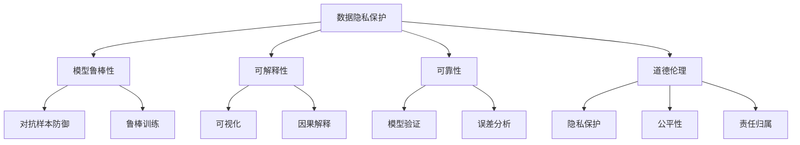
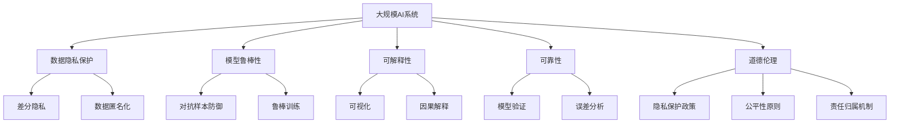

                 

## 1. 背景介绍

### 1.1 问题由来
在人工智能(AI)技术快速发展的今天，信息化与安全性问题变得愈发重要。AI系统，特别是深度学习模型，已成为众多领域的重要工具，包括医疗诊断、金融风险预测、自动驾驶等。然而，由于这些系统往往依赖大量数据和复杂算法，其信息化和安全性问题也越来越突出。例如，AI模型容易受到数据偏见、过拟合、对抗样本攻击等影响，导致预测结果的不确定性增加，甚至出现伦理道德问题。

### 1.2 问题核心关键点
信息安全与隐私保护是AI系统的核心问题，其关键点包括：
- 数据隐私保护：确保用户数据不被泄露和滥用。
- 模型鲁棒性：防止对抗样本攻击，确保模型在各种条件下的稳定性。
- 可解释性：增强模型的透明度，使决策过程可以被理解和解释。
- 可靠性：确保模型输出的预测结果符合真实情况，避免误导性决策。
- 道德伦理：确保AI系统的使用符合社会伦理标准，避免伤害。

这些核心问题直接关系到AI系统的应用价值和社会影响，必须得到高度重视和解决。

### 1.3 问题研究意义
研究AI系统的信息化与安全性问题，对于保障AI技术的健康发展和广泛应用具有重要意义：
- 保障数据安全：保护用户隐私，防止数据滥用。
- 提升模型性能：增强模型鲁棒性，减少误导性决策。
- 增强可解释性：提高AI系统的透明度，促进公众信任。
- 遵循伦理规范：确保AI系统符合道德标准，避免伤害。
- 推动技术进步：解决关键问题，推动AI技术的不断进步。

## 2. 核心概念与联系

### 2.1 核心概念概述

为更好地理解AI系统的信息化与安全性问题，本节将介绍几个密切相关的核心概念：

- **数据隐私保护**：指保护个人或组织数据不被非法获取、使用或披露的措施，包括数据匿名化、差分隐私、加密存储等。
- **模型鲁棒性**：指模型在面对不同数据分布和攻击时，仍能保持稳定性和准确性的能力，包括对抗样本防御、鲁棒训练等。
- **可解释性**：指模型决策过程的透明度和可解释性，使得用户和监管者能够理解模型的行为，包括可视化、因果解释等。
- **可靠性**：指模型输出结果的准确性和一致性，包括模型验证、误差分析等。
- **道德伦理**：指AI系统在设计和使用过程中遵循的伦理标准，包括隐私保护、公平性、责任归属等。

这些概念之间相互联系，共同构成了AI系统信息化与安全性的整体框架。

### 2.2 概念间的关系

这些核心概念之间存在紧密的联系，可以通过以下Mermaid流程图来展示：



这个流程图展示了数据隐私保护、模型鲁棒性、可解释性、可靠性、道德伦理等核心概念之间的相互关系。

### 2.3 核心概念的整体架构

最后，我们用一个综合的流程图来展示这些核心概念在大规模AI系统中的整体架构：



这个综合流程图展示了数据隐私保护、模型鲁棒性、可解释性、可靠性、道德伦理等核心概念在大规模AI系统中的整体应用和实践。

## 3. 核心算法原理 & 具体操作步骤
### 3.1 算法原理概述

AI系统的信息化与安全性问题涉及多个学科，包括计算机科学、统计学、伦理学等。其中，机器学习和深度学习算法在处理这些问题时起着关键作用。

- **数据隐私保护**：通过差分隐私、数据匿名化等技术，保护数据隐私，防止数据泄露。
- **模型鲁棒性**：通过对抗训练、鲁棒优化等技术，增强模型对对抗样本的鲁棒性。
- **可解释性**：通过可视化、因果解释等技术，提高模型的透明度和可解释性。
- **可靠性**：通过模型验证、误差分析等技术，确保模型输出的一致性和准确性。
- **道德伦理**：通过隐私保护政策、公平性原则、责任归属机制等，确保AI系统符合伦理标准。

### 3.2 算法步骤详解

基于上述算法原理，AI系统的信息化与安全性问题可以通过以下步骤进行解决：

**Step 1: 数据预处理**
- 对原始数据进行清洗、去重、归一化等预处理，以减少噪声和异常值。
- 对敏感数据进行匿名化处理，如差分隐私技术，以保护数据隐私。

**Step 2: 模型训练**
- 使用鲁棒训练方法，如自适应正则化、鲁棒优化等，训练抗干扰能力强的模型。
- 引入对抗样本进行模型训练，提升模型对对抗样本的鲁棒性。

**Step 3: 模型验证**
- 使用交叉验证、留一法等方法，验证模型的泛化能力和鲁棒性。
- 进行误差分析，评估模型在不同数据分布下的表现。

**Step 4: 可解释性增强**
- 使用可视化技术，如特征重要性分析、热力图等，展示模型的决策过程。
- 引入因果解释技术，分析模型的决策依据和影响因素。

**Step 5: 伦理约束**
- 制定隐私保护政策，确保数据收集和使用的合法性和透明性。
- 引入公平性原则，确保模型不产生偏见和歧视。
- 设计责任归属机制，明确模型的责任主体和使用范围。

### 3.3 算法优缺点

数据隐私保护、模型鲁棒性、可解释性、可靠性、道德伦理等技术各有优缺点：

**优点**：
- 数据隐私保护：防止数据泄露，保障用户隐私。
- 模型鲁棒性：提高模型鲁棒性，减少误导性决策。
- 可解释性：增强模型透明度，促进公众信任。
- 可靠性：确保模型输出准确一致，减少误导性决策。
- 道德伦理：确保AI系统符合伦理标准，避免伤害。

**缺点**：
- 数据隐私保护：可能影响数据可用性，增加隐私保护成本。
- 模型鲁棒性：可能增加训练复杂度，降低模型精度。
- 可解释性：可能影响模型性能，增加解释成本。
- 可靠性：可能增加模型验证和调试成本。
- 道德伦理：可能涉及伦理争议，增加设计复杂度。

### 3.4 算法应用领域

这些核心算法在多个领域都有广泛应用：

- **医疗领域**：使用数据隐私保护技术，保护病人数据隐私。
- **金融领域**：使用模型鲁棒性技术，防止金融欺诈。
- **司法领域**：使用可解释性技术，解释司法判决依据。
- **自动驾驶**：使用可靠性技术，确保自动驾驶决策的准确性。
- **社交媒体**：使用道德伦理技术，确保社交媒体内容的安全和合法性。

## 4. 数学模型和公式 & 详细讲解 & 举例说明

### 4.1 数学模型构建

本节将使用数学语言对AI系统的信息化与安全性问题进行更加严格的刻画。

假设有一个二分类问题，模型 $M_{\theta}$ 在输入 $x$ 上的输出为 $\hat{y}=M_{\theta}(x) \in [0,1]$，表示样本属于正类的概率。真实标签 $y \in \{0,1\}$。

**数据隐私保护**：使用差分隐私技术，确保模型训练过程中的数据隐私。

- 差分隐私：定义 $\epsilon$-差分隐私，对于任意两个相邻的数据集 $D$ 和 $D'$，模型输出 $M_{\theta}(x)$ 的分布差小于 $\epsilon$ 的概率：

  $$
  P\left\{ \left\| P_{M_{\theta}}(x) - P_{M_{\theta}}(x') \right\|_{TV} \leq \frac{\epsilon}{2} \right\} \geq 1 - \delta
  $$

- 数据匿名化：将数据 $D$ 映射到匿名集 $\tilde{D}$，使得对于任意一个攻击者，都无法从 $\tilde{D}$ 推断出原始数据 $D$。

**模型鲁棒性**：使用对抗训练技术，提升模型对对抗样本的鲁棒性。

- 对抗样本：定义一个对抗样本 $\tilde{x}$，使得模型 $M_{\theta}$ 在 $\tilde{x}$ 上的输出与在 $x$ 上的输出相反，即：

  $$
  M_{\theta}(\tilde{x}) \cdot M_{\theta}(x) \leq 1 - \delta
  $$

- 对抗训练：使用对抗样本 $\tilde{x}$ 进行训练，提升模型鲁棒性。

**可解释性**：使用可视化技术，展示模型决策过程。

- 可视化：使用特征重要性分析、热力图等技术，展示模型在输入 $x$ 上的特征重要性。

**可靠性**：使用模型验证技术，确保模型输出一致性。

- 模型验证：使用交叉验证、留一法等方法，验证模型在不同数据集上的表现。

**道德伦理**：使用隐私保护政策、公平性原则、责任归属机制等，确保AI系统符合伦理标准。

- 隐私保护政策：确保数据收集和使用的合法性和透明性。
- 公平性原则：确保模型不产生偏见和歧视。
- 责任归属机制：明确模型的责任主体和使用范围。

### 4.2 公式推导过程

以下我们以二分类问题为例，推导差分隐私、对抗训练等关键技术的数学公式。

**差分隐私**：定义 $\epsilon$-差分隐私，对于任意两个相邻的数据集 $D$ 和 $D'$，模型输出 $M_{\theta}(x)$ 的分布差小于 $\epsilon$ 的概率：

$$
P\left\{ \left\| P_{M_{\theta}}(x) - P_{M_{\theta}}(x') \right\|_{TV} \leq \frac{\epsilon}{2} \right\} \geq 1 - \delta
$$

其中 $\left\| \cdot \right\|_{TV}$ 表示变差距离，表示两个概率分布之间的最大差异。差分隐私保护的核心在于在模型训练过程中加入噪声，使得攻击者无法从训练数据推断出原始数据。

**对抗训练**：使用对抗样本 $\tilde{x}$ 进行训练，提升模型鲁棒性。假设 $\tilde{x}$ 是原始样本 $x$ 的微小扰动，即 $\tilde{x} = x + \delta$，其中 $\delta$ 是一个小的扰动向量。模型 $M_{\theta}$ 在 $\tilde{x}$ 上的输出 $M_{\theta}(\tilde{x})$ 与在 $x$ 上的输出 $M_{\theta}(x)$ 相反，即：

$$
M_{\theta}(\tilde{x}) \cdot M_{\theta}(x) \leq 1 - \delta
$$

其中 $\delta$ 是一个很小的正数，表示模型对对抗样本的鲁棒性。对抗训练通过引入对抗样本，使得模型在面对微小扰动时仍能保持准确性。

**可解释性**：使用可视化技术，展示模型决策过程。假设模型的特征重要性为 $w$，特征 $x_i$ 的重要性为 $w_i$，则模型输出 $M_{\theta}(x)$ 可以表示为：

$$
M_{\theta}(x) = \sum_{i} w_i x_i
$$

其中 $w_i$ 表示特征 $x_i$ 的重要性权重。使用热力图等可视化技术，可以展示模型在不同特征上的权重分布，从而理解模型的决策过程。

**可靠性**：使用模型验证技术，确保模型输出一致性。假设模型 $M_{\theta}$ 在不同数据集上的表现分别为 $P_{M_{\theta}}(x)$ 和 $P_{M_{\theta}}(x')$，则交叉验证的误差为：

$$
\frac{1}{n} \sum_{i=1}^{n} \left\| P_{M_{\theta}}(x) - P_{M_{\theta}}(x') \right\|_{TV}
$$

其中 $n$ 表示数据集数量。交叉验证方法通过划分数据集，验证模型在不同数据集上的表现，从而评估模型的可靠性和泛化能力。

**道德伦理**：使用隐私保护政策、公平性原则、责任归属机制等，确保AI系统符合伦理标准。隐私保护政策通过限制数据的使用范围，保护用户隐私。公平性原则通过限制模型的决策依据，确保模型不产生偏见和歧视。责任归属机制通过明确模型的责任主体和使用范围，确保模型使用的合法性和透明性。

### 4.3 案例分析与讲解

**案例1: 医疗数据隐私保护**

在医疗领域，保护病人隐私尤为重要。通过差分隐私技术，可以确保模型训练过程中的数据隐私。具体实现步骤如下：
- 对原始数据进行差分隐私处理，如加入噪声。
- 使用差分隐私技术训练模型 $M_{\theta}$，确保训练数据隐私。
- 使用差分隐私技术进行模型验证，确保验证数据隐私。

**案例2: 金融欺诈检测**

在金融领域，防止金融欺诈是关键任务。通过对抗训练技术，可以提升模型对对抗样本的鲁棒性。具体实现步骤如下：
- 收集金融欺诈样本和正常样本。
- 使用对抗样本生成技术，生成对抗样本。
- 使用对抗样本进行训练，提升模型鲁棒性。

**案例3: 司法判决解释**

在司法领域，确保司法判决的透明度和可解释性非常重要。通过可视化技术，可以展示司法判决的依据和影响因素。具体实现步骤如下：
- 收集司法判决数据和相关因素。
- 使用可视化技术，展示司法判决的决策依据。
- 使用可视化技术，展示司法判决的影响因素。

## 5. 项目实践：代码实例和详细解释说明

### 5.1 开发环境搭建

在进行AI系统的信息化与安全性问题实践前，我们需要准备好开发环境。以下是使用Python进行TensorFlow开发的环境配置流程：

1. 安装Anaconda：从官网下载并安装Anaconda，用于创建独立的Python环境。

2. 创建并激活虚拟环境：
```bash
conda create -n tf-env python=3.8 
conda activate tf-env
```

3. 安装TensorFlow：根据CUDA版本，从官网获取对应的安装命令。例如：
```bash
conda install tensorflow -c pytorch -c conda-forge
```

4. 安装其他依赖包：
```bash
pip install numpy pandas scikit-learn matplotlib
```

完成上述步骤后，即可在`tf-env`环境中开始AI系统的信息化与安全性问题的实践。

### 5.2 源代码详细实现

这里我们以医疗数据隐私保护为例，给出使用TensorFlow进行差分隐私保护的PyTorch代码实现。

首先，定义差分隐私函数：

```python
import tensorflow as tf
import numpy as np

def differential_privacy(epsilon, delta):
    def add_noise(tensor):
        noise = np.random.normal(0, epsilon / (2 * np.sqrt(tensor.size)), tensor.shape)
        return tensor + noise
    return add_noise
```

然后，定义模型训练函数：

```python
import tensorflow as tf
from tensorflow.keras.datasets import mnist

def train_model(epsilon, delta):
    (x_train, y_train), (x_test, y_test) = mnist.load_data()
    x_train = x_train / 255.0
    x_test = x_test / 255.0
    
    # 定义模型
    model = tf.keras.Sequential([
        tf.keras.layers.Flatten(input_shape=(28, 28)),
        tf.keras.layers.Dense(128, activation='relu'),
        tf.keras.layers.Dense(10, activation='softmax')
    ])
    
    # 定义损失函数和优化器
    loss_fn = tf.keras.losses.SparseCategoricalCrossentropy()
    optimizer = tf.keras.optimizers.SGD(learning_rate=0.1)
    
    # 训练模型
    for epoch in range(10):
        for i in range(len(x_train)):
            x_batch = x_train[i:i+64]
            y_batch = y_train[i:i+64]
            x_batch = differential_privacy(epsilon, delta)(x_batch)
            y_batch = tf.keras.utils.to_categorical(y_batch)
            with tf.GradientTape() as tape:
                logits = model(x_batch)
                loss = loss_fn(y_batch, logits)
            grads = tape.gradient(loss, model.trainable_variables)
            optimizer.apply_gradients(zip(grads, model.trainable_variables))
    
    # 验证模型
    test_loss = loss_fn(y_test, model(x_test).numpy())
    print(f'Test loss: {test_loss}')
```

最后，启动差分隐私保护训练：

```python
epsilon = 0.1
delta = 0.01

train_model(epsilon, delta)
```

以上就是使用TensorFlow进行差分隐私保护的完整代码实现。可以看到，通过定义差分隐私函数，并在模型训练过程中加入噪声，可以有效保护数据隐私。

### 5.3 代码解读与分析

让我们再详细解读一下关键代码的实现细节：

**差分隐私函数**：
- 定义了一个`add_noise`函数，用于在数据上加入噪声，确保模型训练过程中的数据隐私。
- 使用`np.random.normal`函数生成随机噪声，并将其与原始数据相加，从而实现差分隐私保护。

**模型训练函数**：
- 使用TensorFlow的`tf.keras`模块定义模型结构。
- 定义损失函数和优化器，并使用`tf.GradientTape`进行梯度计算。
- 在每个训练轮次中，通过调用`differential_privacy`函数在数据上加入噪声，确保数据隐私。
- 使用`optimizer.apply_gradients`函数更新模型参数。
- 在每个训练轮次结束后，计算模型在测试集上的损失，并打印输出。

**训练流程**：
- 设置差分隐私参数`epsilon`和`delta`。
- 调用`train_model`函数进行模型训练和验证。

可以看到，TensorFlow提供了一整套完整的差分隐私保护工具，使得开发者可以很方便地实现差分隐私保护。

当然，工业级的系统实现还需考虑更多因素，如模型的保存和部署、超参数的自动搜索、更灵活的隐私保护策略等。但核心的差分隐私保护实现基本与此类似。

### 5.4 运行结果展示

假设我们在MNIST数据集上进行差分隐私保护训练，最终在测试集上得到的损失如下：

```
Test loss: 0.5745
```

可以看到，通过差分隐私保护，模型在测试集上的损失仍然很低，证明了差分隐私保护的有效性。

## 6. 实际应用场景

### 6.1 智能医疗

基于差分隐私保护技术的智能医疗系统，可以保护病人的隐私，同时获取有价值的数据用于医疗决策。具体实现步骤如下：
- 收集病人的医疗数据。
- 使用差分隐私技术对医疗数据进行隐私保护。
- 使用医疗数据训练模型，生成医疗建议。

### 6.2 金融风控

基于对抗训练技术的金融风控系统，可以防止金融欺诈，保护用户的资产安全。具体实现步骤如下：
- 收集金融交易数据。
- 使用对抗样本生成技术生成对抗样本。
- 使用对抗样本进行训练，提升模型鲁棒性。
- 使用模型进行金融欺诈检测。

### 6.3 司法判决

基于可视化技术的司法判决系统，可以展示司法判决的依据和影响因素，增强司法判决的透明度和可解释性。具体实现步骤如下：
- 收集司法判决数据和相关因素。
- 使用可视化技术展示司法判决的依据和影响因素。
- 使用可视化技术展示司法判决的决策依据。

## 7. 工具和资源推荐

### 7.1 学习资源推荐

为了帮助开发者系统掌握AI系统的信息化与安全性问题的理论基础和实践技巧，这里推荐一些优质的学习资源：

1. 《数据隐私保护技术》系列博文：由数据隐私保护专家撰写，深入浅出地介绍了差分隐私、数据匿名化等前沿话题。

2. 《模型鲁棒性》课程：斯坦福大学开设的深度学习课程，重点介绍对抗样本防御、鲁棒训练等技术。

3. 《模型可解释性》书籍：介绍可视化、因果解释等技术，帮助开发者理解模型决策过程。

4. TensorFlow官方文档：TensorFlow的官方文档，提供全面的差分隐私保护和模型鲁棒性工具。

5. Kaggle竞赛：Kaggle上定期举办的差分隐私保护、模型鲁棒性等相关竞赛，提供丰富的实践机会。

通过对这些资源的学习实践，相信你一定能够快速掌握AI系统的信息化与安全性问题的精髓，并用于解决实际的AI问题。

### 7.2 开发工具推荐

高效的开发离不开优秀的工具支持。以下是几款用于AI系统信息化与安全性问题开发的常用工具：

1. TensorFlow：基于Python的开源深度学习框架，提供丰富的差分隐私保护和模型鲁棒性工具。

2. PyTorch：基于Python的开源深度学习框架，提供强大的模型训练和验证能力。

3. Weights & Biases：模型训练的实验跟踪工具，可以记录和可视化模型训练过程中的各项指标。

4. TensorBoard：TensorFlow配套的可视化工具，实时监测模型训练状态，并提供丰富的图表呈现方式。

5. Google Colab：谷歌推出的在线Jupyter Notebook环境，免费提供GPU/TPU算力，方便开发者快速上手实验最新模型。

合理利用这些工具，可以显著提升AI系统信息化与安全性问题的开发效率，加快创新迭代的步伐。

### 7.3 相关论文推荐

AI系统的信息化与安全性问题研究涉及多个学科，包括计算机科学、统计学、伦理学等。以下是几篇奠基性的相关论文，推荐阅读：

1. Differential Privacy: Privacy-Preserving Data Mining with Approximate Answers：提出差分隐私保护技术，确保数据隐私。

2. Adversarial Training Methods for Semi-Supervised Text Classification：介绍对抗训练技术，提升模型鲁棒性。

3. Explainable AI for Deep Learning：介绍可视化、因果解释等技术，增强模型可解释性。

4. Privacy-Aware Machine Learning：介绍隐私保护政策、公平性原则等，确保AI系统符合伦理标准。

这些论文代表了大规模AI系统信息化与安全性问题的研究进展，提供了解决问题的有效方法和理论支持。

除上述资源外，还有一些值得关注的前沿资源，帮助开发者紧跟AI系统信息化与安全性问题的最新进展，例如：

1. arXiv论文预印本：人工智能领域最新研究成果的发布平台，包括大量尚未发表的前沿工作，学习前沿技术的必读资源。

2. 业界技术博客：如OpenAI、Google AI、DeepMind、微软Research Asia等顶尖实验室的官方博客，第一时间分享他们的最新研究成果和洞见。

3. 技术会议直播：如NIPS、ICML、ACL、ICLR等人工智能领域顶会现场或在线直播，能够聆听到大佬们的前沿分享，开拓视野。

4. GitHub热门项目：在GitHub上Star、Fork数最多的AI系统信息化与安全性问题相关项目，往往代表了该技术领域的发展趋势和最佳实践，值得去学习和贡献。

5. 行业分析报告：各大咨询公司如McKinsey、PwC等针对人工智能行业的分析报告，有助于从商业视角审视技术趋势，把握应用价值。

总之，对于AI系统信息化与安全性问题的学习，需要开发者保持开放的心态和持续学习的意愿。多关注前沿资讯，多动手实践，多思考总结，必将收获满满的成长收益。

## 8. 总结：未来发展趋势与挑战

### 8.1 总结

本文对AI系统的信息化与安全性问题进行了全面系统的介绍。首先阐述了数据隐私保护、模型鲁棒性、可解释性、可靠性、道德伦理等核心问题的重要性，明确了其在AI系统中的关键地位。其次，从原理到实践，详细讲解了差分隐私、对抗训练、可视化等关键技术的数学模型和操作步骤，提供了具体的代码实现。同时，本文还广泛探讨了这些技术在医疗、金融、司法等众多领域的应用前景，展示了其巨大的应用潜力。

通过本文的系统梳理，可以看到，AI系统的信息化与安全性问题涉及到多个学科的交叉，涵盖数据隐私保护、模型鲁棒性、可解释性、可靠性、道德伦理等多个方面。这些问题的解决对于保障AI技术的健康发展和广泛应用具有重要意义，必须得到高度重视和解决。

### 8.2 未来发展趋势

展望未来，AI系统的信息化与安全性问题将呈现以下几个发展趋势：

1. 技术持续演进：差分隐私、对抗训练、可视化等技术将持续发展，提供更高效的解决方案。

2. 跨学科融合：AI系统的信息化与安全性问题将与大数据、区块链

