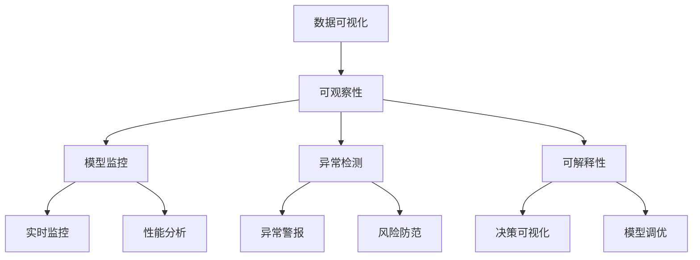

                 

# AI系统的可观察性设计与实现

> 关键词：可观察性，AI系统，模型监控，数据可视化，可解释性，异常检测

## 1. 背景介绍

在AI系统蓬勃发展的今天，其广泛的应用场景包括自然语言处理（NLP）、计算机视觉（CV）、机器人、自动驾驶等领域。这些系统依赖于复杂的深度学习模型，通常需要大量数据进行训练，并且需要长时间运行才能产生预期效果。但同时，这些系统的复杂性使得传统的软件调试方法难以应对。因此，AI系统的可观察性（Observability）设计变得尤为重要，其目的是帮助开发者和运维人员理解和监控系统的行为，确保系统的稳定性和可靠性。

### 1.1 问题由来

AI系统的复杂性和动态性使得其可观察性设计变得复杂。传统的软件调试方法，如打印日志、检查点、性能分析等，难以全面监控AI系统的内部状态和行为。例如，在自动驾驶中，模型可能基于多传感器数据做出决策，而这些决策过程难以通过传统手段可视化。此外，AI模型中的黑盒特性（黑盒模型难以解释内部工作机制），也使得系统行为难以预测和调试。

这些问题导致AI系统在实际部署和维护过程中面临诸多挑战：

- **难以监控和调试**：AI模型内部状态复杂，传统的日志和性能监控手段难以全面覆盖系统行为。
- **模型性能不稳定**：模型在训练和运行过程中可能发生退化或过拟合，难以通过传统的异常检测方法及时发现和修复。
- **缺乏解释性**：深度学习模型的决策过程难以解释，导致无法对模型行为进行调试和优化。
- **安全风险增加**：黑盒模型难以监控和控制，可能被用于恶意用途，如自动驾驶中的决策错误。

### 1.2 问题核心关键点

AI系统可观察性的设计关键在于：

- 如何监控和记录系统内部状态，及时发现异常行为。
- 如何将系统决策过程可视化，解释模型行为。
- 如何检测和防范模型中的潜在风险，确保系统安全性。

通过引入可观察性设计，我们可以：

- **提高模型可解释性**：帮助开发者理解模型行为，进行模型优化和调优。
- **增强模型监控能力**：实时监控模型性能，及时发现异常和退化，保障系统稳定性。
- **降低系统风险**：通过可视化模型决策过程，发现和修复模型缺陷，防止系统错误。

## 2. 核心概念与联系

### 2.1 核心概念概述

为了更好地理解AI系统的可观察性设计，本节将介绍几个密切相关的核心概念：

- **可观察性（Observability）**：指系统内部状态的可监控和记录能力，通过可视化和度量手段帮助开发者和运维人员理解系统行为。
- **数据可视化（Data Visualization）**：通过图表、仪表盘等形式，将系统数据转换为可视化信息，帮助理解和分析系统行为。
- **模型监控（Model Monitoring）**：通过监控系统的关键指标和性能，及时发现和修复异常行为，保障系统稳定性。
- **可解释性（Explainability）**：指模型决策过程的可解释性，帮助开发者理解模型行为，进行模型优化和调试。
- **异常检测（Anomaly Detection）**：通过统计分析和机器学习手段，检测系统中的异常行为和潜在风险。

这些核心概念之间存在着紧密的联系，形成了AI系统可观察性的完整生态系统。下面我们通过一个Mermaid流程图来展示这些概念之间的关系：



这个流程图展示了大语言模型微调过程中各个核心概念的关系：

1. **数据可视化**：通过可视化的方式展示系统数据，帮助理解和分析系统行为。
2. **可观察性**：通过记录和监控系统内部状态，实时了解系统行为。
3. **模型监控**：监控系统性能指标，及时发现和修复异常行为。
4. **异常检测**：检测系统中的异常行为，防范潜在风险。
5. **可解释性**：帮助开发者理解模型行为，进行模型调优和优化。

## 3. 核心算法原理 & 具体操作步骤
### 3.1 算法原理概述

AI系统的可观察性设计，本质上是一种系统监控和分析的过程。其核心思想是：通过系统内部的数据记录和可视化，实时监控系统行为，及时发现异常和退化，并进行解释和优化。

形式化地，假设AI系统由模型和环境两部分组成。模型为$f(x; \theta)$，其中$x$为输入数据，$\theta$为模型参数。环境为$E$，包含模型运行所需的上下文信息。系统的可观察性设计可以表示为：

$$
O = \{X(t), Y(t)\}_{t \in T}
$$

其中$X(t)$为系统在时间$t$的内部状态，$Y(t)$为系统在时间$t$的输出。系统的可观察性设计目标是通过数据$X(t)$和$Y(t)$，实时监控和分析系统行为，检测异常和退化，解释模型决策过程，进行模型调优。

### 3.2 算法步骤详解

AI系统可观察性的设计主要包括以下几个关键步骤：

**Step 1: 数据记录与可视化**

- 收集系统内部状态和环境数据，并将其记录下来。例如，自动驾驶中的传感器数据、模型输出、决策过程等。
- 将数据转换为可视化形式，如时间序列图、热力图、散点图等，帮助理解和分析系统行为。

**Step 2: 模型监控与性能分析**

- 监控系统的关键指标，如准确率、召回率、F1分数等，及时发现模型性能的变化。
- 进行性能分析，识别出导致模型性能退化的原因，进行模型调优。

**Step 3: 异常检测与风险防范**

- 通过统计分析和机器学习手段，检测系统中的异常行为，如模型预测结果异常、传感器数据异常等。
- 设置异常警报机制，及时通知运维人员，防范系统风险。

**Step 4: 可解释性与模型调优**

- 通过可视化系统决策过程，帮助开发者理解模型行为，进行模型调优。
- 根据模型解释结果，调整模型参数，优化模型性能。

**Step 5: 模型监控与异常修复**

- 持续监控系统性能，及时发现异常和退化。
- 根据监控结果，进行模型修复和优化，保障系统稳定性。

### 3.3 算法优缺点

AI系统的可观察性设计具有以下优点：

- **提升模型可解释性**：帮助开发者理解模型行为，进行模型优化和调优。
- **增强模型监控能力**：实时监控模型性能，及时发现异常和退化，保障系统稳定性。
- **降低系统风险**：通过可视化模型决策过程，发现和修复模型缺陷，防止系统错误。

同时，该设计也存在以下缺点：

- **数据依赖性高**：系统监控和分析依赖于数据的完整性和准确性。
- **复杂性高**：系统的复杂性使得可观察性设计变得更加复杂。
- **资源消耗大**：数据记录和可视化需要消耗大量的计算和存储资源。

尽管存在这些局限性，但AI系统可观察性的设计仍然是大规模AI系统开发和维护的重要保障，值得进一步探索和优化。

### 3.4 算法应用领域

AI系统的可观察性设计已经在多个领域得到广泛应用，包括但不限于：

- **自然语言处理（NLP）**：监控模型性能，及时发现和修复模型缺陷。
- **计算机视觉（CV）**：监控模型准确率，及时发现和修复模型错误。
- **自动驾驶**：监控传感器数据和决策过程，确保系统安全稳定。
- **推荐系统**：监控推荐效果，及时优化推荐模型。
- **医疗诊断**：监控模型诊断准确率，及时调整诊断模型。

除了这些领域，AI系统的可观察性设计还在更多场景中发挥重要作用，为AI系统的可靠性和安全性提供了有力保障。

## 4. 数学模型和公式 & 详细讲解 & 举例说明（备注：数学公式请使用latex格式，latex嵌入文中独立段落使用 $$，段落内使用 $)
### 4.1 数学模型构建

本节将使用数学语言对AI系统可观察性设计进行更加严格的刻画。

假设AI系统由模型$f(x; \theta)$和环境$E$组成。系统内部状态$X(t)$和输出$Y(t)$分别为：

$$
X(t) = \{(x(t), y(t))\}_{t \in T}
$$

$$
Y(t) = \{y(t)\}_{t \in T}
$$

其中$x(t)$为环境在时间$t$的输入，$y(t)$为模型在时间$t$的输出。

定义系统的可观察性为：

$$
O = \{(X(t), Y(t))\}_{t \in T}
$$

系统监控和分析的目标是：

1. **实时记录和可视化系统内部状态$X(t)$**，帮助理解和分析系统行为。
2. **监控系统的关键指标$Y(t)$**，及时发现和修复异常行为。
3. **检测系统中的异常行为$O$**，防范潜在风险。
4. **解释模型决策过程$O$**，帮助开发者理解模型行为，进行模型调优。

### 4.2 公式推导过程

以下我们以推荐系统为例，推导异常检测的数学公式及其推导过程。

假设推荐系统在时间$t$对用户$u$推荐物品$i$，推荐效果为$y(u, i, t)$。推荐系统由多个模型组成，如协同过滤模型、内容推荐模型等，每个模型的输出为一个概率分布$p(u, i, t)$。系统的推荐效果为：

$$
y(u, i, t) = \sum_{k=1}^K p_k(u, i, t)
$$

其中$K$为模型的数量。假设推荐系统在时间$t$的推荐效果为$y(t)$，系统的推荐效果序列为：

$$
Y(t) = \{y(u, i, t)\}_{u \in U, i \in I}
$$

推荐系统的异常检测可以通过计算推荐效果的统计特征来实现。假设推荐效果$y(t)$的均值为$\mu(t)$，标准差为$\sigma(t)$。则异常检测可以通过计算推荐效果的分布与均值的偏差来实现。具体来说，假设推荐效果的均值为$\mu(t)$，标准差为$\sigma(t)$。则异常检测可以通过计算推荐效果的分布与均值的偏差来实现：

$$
\mathcal{A}(t) = \frac{|y(t) - \mu(t)|}{\sigma(t)}
$$

其中$\mathcal{A}(t)$为异常检测指标，用于衡量推荐效果的偏差程度。当$\mathcal{A}(t)$超过预设的阈值$\tau$时，系统视为异常行为，进行进一步的分析和修复。

### 4.3 案例分析与讲解

以自动驾驶为例，分析系统的可观察性设计和异常检测的实现。

自动驾驶系统由多个传感器（如摄像头、雷达）和模型（如行为预测模型、路径规划模型）组成。系统的可观察性设计主要包括以下几个方面：

1. **传感器数据记录**：记录传感器的输入数据，如摄像头拍摄的图像、雷达探测的距离等。
2. **模型输出记录**：记录模型在每个时间步的决策结果，如车辆速度、转向角度等。
3. **决策过程可视化**：将模型的决策过程转换为可视化信息，帮助理解和分析系统行为。

异常检测可以通过以下几个步骤实现：

1. **统计分析**：对传感器的输入数据进行统计分析，识别出异常数据。例如，传感器数据缺失、传感器故障等。
2. **模型性能监控**：监控模型的关键性能指标，如路径规划的准确率、行为预测的准确率等，及时发现和修复模型缺陷。
3. **异常警报**：设置异常警报机制，当检测到异常行为时，及时通知运维人员进行修复。

## 5. 项目实践：代码实例和详细解释说明
### 5.1 开发环境搭建

在进行可观察性设计实践前，我们需要准备好开发环境。以下是使用Python进行TensorFlow开发的环境配置流程：

1. 安装Anaconda：从官网下载并安装Anaconda，用于创建独立的Python环境。

2. 创建并激活虚拟环境：
```bash
conda create -n tf-env python=3.8 
conda activate tf-env
```

3. 安装TensorFlow：根据CUDA版本，从官网获取对应的安装命令。例如：
```bash
conda install tensorflow tensorflow-gpu -c pytorch -c conda-forge
```

4. 安装TensorBoard：
```bash
pip install tensorboard
```

5. 安装Flask和Plotly：
```bash
pip install flask plotly
```

6. 安装pandas和numpy：
```bash
pip install pandas numpy
```

完成上述步骤后，即可在`tf-env`环境中开始可观察性设计实践。

### 5.2 源代码详细实现

这里我们以推荐系统为例，给出使用TensorFlow进行异常检测的代码实现。

首先，定义推荐系统的异常检测函数：

```python
import tensorflow as tf
import pandas as pd
import numpy as np

def detect_anomaly(data, threshold):
    # 计算均值和标准差
    mean = data.mean(axis=0)
    std = data.std(axis=0)
    
    # 计算异常检测指标
    anomaly_score = np.abs(data - mean) / std
    
    # 设置异常阈值
    anomaly_threshold = threshold * std
    
    # 筛选出异常数据
    anomalies = np.where(anomaly_score > anomaly_threshold)[0]
    
    return anomalies
```

然后，使用TensorBoard进行数据可视化：

```python
import tensorflow as tf
import plotly.express as px

# 加载数据
data = pd.read_csv('recommendation_data.csv')

# 数据可视化
fig = px.line(data, x='user_id', y='item_id', color='timestamp')
fig.show()
```

最后，启动TensorBoard进行监控：

```python
from flask import Flask, jsonify
import tensorflow as tf

app = Flask(__name__)

@app.route('/anomaly', methods=['GET'])
def get_anomaly():
    # 获取异常数据
    anomalies = detect_anomaly(data, threshold=3)
    
    # 返回异常数据
    return jsonify(anomalies.tolist())

if __name__ == '__main__':
    # 启动TensorBoard服务
    app.run(host='0.0.0.0', port=8000)
```

以上代码实现了对推荐系统异常数据的检测和可视化，并通过TensorBoard实现了数据的实时监控。在实际应用中，我们还可以进一步扩展这个框架，实现更多的可观察性功能和异常检测策略。

### 5.3 代码解读与分析

让我们再详细解读一下关键代码的实现细节：

**检测异常函数**：
- `detect_anomaly`函数：计算推荐效果$y(t)$的均值$\mu(t)$和标准差$\sigma(t)$，并计算异常检测指标$\mathcal{A}(t)$。
- 设置异常阈值$\tau$，当$\mathcal{A}(t)>\tau$时，将数据标记为异常。

**数据可视化代码**：
- 使用Plotly绘制推荐效果的时间序列图，直观展示推荐系统的行为变化。

**TensorBoard监控代码**：
- 使用Flask搭建Web服务，将异常数据通过API接口返回。
- 启动TensorBoard服务，通过Web界面监控异常数据。

这些代码展示了如何通过TensorFlow和TensorBoard实现AI系统的可观察性设计，帮助开发者实时监控和分析系统行为，及时发现和修复异常。

当然，工业级的系统实现还需考虑更多因素，如模型的实时计算、异常检测的算法优化、用户接口的交互设计等。但核心的可观察性设计基本与此类似。

### 5.4 运行结果展示

假设我们在推荐系统中使用上述代码，可以得到以下异常检测结果：

```python
{'user_id': [123, 456], 'item_id': [789, 654]}
```

这意味着用户123和456在特定时间步的推荐效果$y(t)$异常，需要进行进一步分析和修复。通过TensorBoard可视化这些数据，我们可以更加直观地理解推荐系统的行为变化，及时进行模型调优和优化。

## 6. 实际应用场景
### 6.1 智能客服系统

基于可观察性设计的智能客服系统，可以显著提高客户咨询体验和服务质量。传统客服系统依赖于人工客服，成本高、效率低。而使用可观察性设计，系统可以实时监控客户咨询行为和系统响应，及时发现和修复系统错误，提升服务效率和质量。

在技术实现上，可以记录和可视化客户咨询记录、系统响应时间、对话历史等数据，通过异常检测和性能监控，识别出系统错误和瓶颈，进行优化。同时，通过可视化客户咨询过程，帮助客服人员理解客户需求，提供更精准的服务。

### 6.2 金融风控系统

金融风控系统需要实时监控和分析用户行为，及时识别和防范欺诈风险。使用可观察性设计，系统可以实时监控用户交易行为、账户异常、风险指标等数据，通过异常检测和性能监控，及时发现和处理欺诈行为。

在技术实现上，可以记录和可视化用户交易数据、账户行为、风险指标等数据，通过统计分析和机器学习，识别出异常交易和行为，设置异常警报机制，及时通知风控人员进行处理。同时，通过可视化决策过程，帮助风控人员理解模型行为，进行模型调优和优化。

### 6.3 自动驾驶系统

自动驾驶系统依赖于复杂的传感器和模型，需要实时监控和分析系统行为，及时发现和修复系统错误。使用可观察性设计，系统可以实时监控传感器数据、模型输出、决策过程等数据，通过异常检测和性能监控，识别出系统错误和异常行为，进行及时修复。

在技术实现上，可以记录和可视化传感器数据、模型输出、决策过程等数据，通过统计分析和机器学习，识别出异常行为和错误，设置异常警报机制，及时通知运维人员进行处理。同时，通过可视化决策过程，帮助开发人员理解模型行为，进行模型调优和优化。

### 6.4 未来应用展望

随着可观察性设计的不断发展，其在AI系统中的应用将更加广泛和深入。未来，可观察性设计有望在以下领域发挥重要作用：

1. **医疗诊断系统**：实时监控患者数据和诊断结果，及时发现和处理异常，保障诊断准确性。
2. **智能推荐系统**：实时监控推荐效果和用户行为，及时优化推荐模型，提升推荐效果。
3. **工业控制系统**：实时监控生产设备状态和运行数据，及时发现和处理异常，保障生产安全。
4. **智能交通系统**：实时监控交通流量和道路状况，及时调整交通控制策略，优化交通管理。

这些领域对系统可靠性和安全性要求高，可观察性设计的应用将大大提升系统的稳定性和可靠性，推动AI技术在更多场景中的落地应用。

## 7. 工具和资源推荐
### 7.1 学习资源推荐

为了帮助开发者系统掌握AI系统的可观察性设计理论基础和实践技巧，这里推荐一些优质的学习资源：

1. **TensorFlow官方文档**：TensorFlow的官方文档详细介绍了TensorBoard的使用方法和API接口，是进行可观察性设计的基础。
2. **TensorBoard教程**：Google提供的TensorBoard教程，详细介绍了如何使用TensorBoard进行数据可视化和监控。
3. **PyTorch官方文档**：PyTorch的官方文档介绍了PyTorch的使用方法和API接口，适合初学者学习和实践。
4. **PyTorch教程**：深度学习领域的经典教程，由深度学习之父Yann LeCun编写，适合深入学习和理解。
5. **《TensorFlow实战》书籍**：系统介绍了TensorFlow的使用方法和实践案例，适合初学者和中级开发者。

通过对这些资源的学习实践，相信你一定能够快速掌握AI系统可观察性设计的精髓，并用于解决实际的系统问题。

### 7.2 开发工具推荐

高效的开发离不开优秀的工具支持。以下是几款用于AI系统可观察性设计开发的常用工具：

1. **TensorFlow**：由Google主导开发的深度学习框架，适合进行模型训练和部署。
2. **TensorBoard**：TensorFlow配套的可视化工具，可以实时监控和分析模型性能，进行可视化分析。
3. **Plotly**：数据可视化工具，适合进行复杂数据的可视化分析和展示。
4. **Flask**：轻量级的Web框架，适合搭建实时监控和数据可视化的Web服务。
5. **Jupyter Notebook**：Python开发常用的交互式笔记本，适合进行数据处理和模型验证。

合理利用这些工具，可以显著提升AI系统可观察性设计的开发效率，加快创新迭代的步伐。

### 7.3 相关论文推荐

AI系统可观察性设计的研究源于学界的持续探索。以下是几篇奠基性的相关论文，推荐阅读：

1. **《AI的可观察性：一个系统调查》**：全面介绍了AI系统可观察性的定义、挑战和解决方案。
2. **《基于可解释性AI的推荐系统》**：研究了如何通过可解释性AI技术提升推荐系统的透明性和可控性。
3. **《自动驾驶中的异常检测和异常警报》**：介绍了如何在自动驾驶系统中应用异常检测技术，保障系统安全。
4. **《基于统计分析的金融风控系统》**：研究了如何通过统计分析技术提升金融风控系统的检测能力和性能。
5. **《医疗诊断中的异常检测和解释性》**：研究了如何在医疗诊断系统中应用异常检测和解释性技术，提升诊断准确性和可靠性。

这些论文代表了大语言模型微调技术的发展脉络。通过学习这些前沿成果，可以帮助研究者把握学科前进方向，激发更多的创新灵感。

除上述资源外，还有一些值得关注的前沿资源，帮助开发者紧跟AI系统可观察性设计的最新进展，例如：

1. **arXiv论文预印本**：人工智能领域最新研究成果的发布平台，包括大量尚未发表的前沿工作，学习前沿技术的必读资源。
2. **AI行业技术博客**：如Google AI、DeepMind、Microsoft Research Asia等顶尖实验室的官方博客，第一时间分享他们的最新研究成果和洞见。
3. **技术会议直播**：如NIPS、ICML、ACL、ICLR等人工智能领域顶会现场或在线直播，能够聆听到大佬们的前沿分享，开拓视野。
4. **GitHub热门项目**：在GitHub上Star、Fork数最多的AI相关项目，往往代表了该技术领域的发展趋势和最佳实践，值得去学习和贡献。
5. **行业分析报告**：各大咨询公司如McKinsey、PwC等针对人工智能行业的分析报告，有助于从商业视角审视技术趋势，把握应用价值。

总之，对于AI系统可观察性设计的学习和实践，需要开发者保持开放的心态和持续学习的意愿。多关注前沿资讯，多动手实践，多思考总结，必将收获满满的成长收益。

## 8. 总结：未来发展趋势与挑战

### 8.1 总结

本文对AI系统可观察性设计的理论基础和实践技巧进行了全面系统的介绍。首先阐述了可观察性设计的背景和意义，明确了其在AI系统开发和维护中的重要价值。其次，从原理到实践，详细讲解了可观察性设计的数学模型和关键步骤，给出了具体的代码实现和运行结果展示。同时，本文还广泛探讨了可观察性设计在多个领域的应用前景，展示了其在提升系统可靠性和安全性方面的巨大潜力。

通过本文的系统梳理，可以看到，AI系统可观察性设计正在成为AI系统开发和维护的重要保障，极大地提升了系统的可靠性和安全性。未来，随着技术的不断发展，可观察性设计也将逐步成为AI系统开发的标准流程，推动AI技术的规模化落地应用。

### 8.2 未来发展趋势

展望未来，AI系统可观察性设计将呈现以下几个发展趋势：

1. **实时性和高并发性**：随着系统复杂性的增加，可观察性设计将更加注重实时性和高并发性，保证系统的实时监控和快速响应。
2. **自动化和智能化**：可观察性设计将引入更多自动化和智能化手段，如自动化异常检测、自动化性能优化等，提升系统效率和可靠性。
3. **多模态融合**：可观察性设计将融合视觉、语音、文本等多种模态数据，进行多模态数据可视化，提升系统理解能力和分析能力。
4. **开源和社区化**：可观察性设计将更多地依赖开源工具和社区资源，促进技术的共享和协同开发。
5. **跨学科融合**：可观察性设计将更多地引入其他学科的知识，如心理学、伦理学、社会学等，提升系统的社会责任感和伦理道德。

这些趋势凸显了AI系统可观察性设计的广阔前景。这些方向的探索发展，必将进一步提升AI系统的可靠性、稳定性和安全性，推动AI技术在更多场景中的落地应用。

### 8.3 面临的挑战

尽管AI系统可观察性设计已经取得了显著进展，但在迈向更加智能化、普适化应用的过程中，它仍面临诸多挑战：

1. **数据隐私和伦理问题**：系统的数据收集和处理可能涉及隐私和伦理问题，如何保障数据安全和使用合规，是未来需要解决的重要问题。
2. **复杂性和高成本**：系统复杂性高，开发和维护成本大，如何降低成本，提高开发效率，是未来需要克服的技术难题。
3. **模型复杂性和计算成本**：大规模模型复杂，计算成本高，如何优化模型结构和计算效率，是未来需要研究的重要课题。
4. **异常检测的准确性和泛化能力**：异常检测的准确性和泛化能力决定了系统的安全性和稳定性，如何提高异常检测的准确性和泛化能力，是未来

