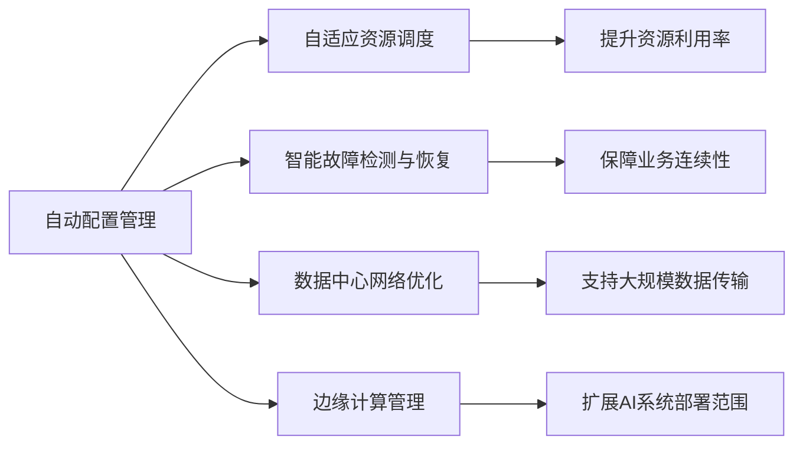

                 

## 1. 背景介绍

人工智能（AI）正逐步渗透到各个行业，从智能客服到自动驾驶，从个性化推荐到金融风控，无处不在。然而，当前AI系统的落地过程中，一个重大瓶颈是物理基础设施的构建和管理。无论是在云端，还是在边缘设备上，都需要大量的计算资源、存储资源和网络带宽，而这些资源的配置和调度往往需要手动配置和管理，效率低下且容易出错。AI自动化物理基础设施的建设，旨在通过自动化技术，对计算资源进行智能化、自适应地管理，实现高性能、低成本、高效率的AI系统部署。

### 1.1 问题由来
随着AI技术的发展，数据中心、云计算中心、边缘计算中心等基础设施的需求不断增长。传统的手动资源管理方式已无法满足日益增长的AI计算需求，尤其是需要高实时性、高并发的应用场景，如自动驾驶、实时图像处理、AI医疗诊断等。

这些应用场景对物理基础设施的要求极高，包括但不限于：

- 数据中心的硬件设施，如服务器、存储设备、网络交换机等，如何部署和配置？
- 如何动态调整计算资源，以适应实时性要求较高的任务？
- 如何合理分配带宽资源，以支持大规模数据传输和计算？
- 如何实现跨中心的数据交换，保障数据的实时性和一致性？

### 1.2 问题核心关键点
当前AI物理基础设施的管理，主要面临以下几个挑战：

- **资源调配效率低**：手动调配物理资源需要大量人工，效率低下，且容易出错。
- **资源浪费严重**：资源过剩或不足的问题普遍存在，导致资源的利用率不高。
- **故障响应时间长**：故障排除和问题诊断通常需要时间，影响业务连续性。
- **跨中心数据传输延迟高**：跨数据中心或边缘设备的数据传输效率较低，影响实时性应用。

为了解决上述问题，我们提出了AI自动化物理基础设施的概念，旨在通过自动化技术，实现资源的智能化、自适应管理，提升AI系统的部署效率和运行稳定性。

### 1.3 问题研究意义
AI自动化物理基础设施的研究，对于推动AI技术在各个行业的落地具有重要意义：

- **降低部署成本**：自动化配置和调度资源，减少人工干预，降低运营成本。
- **提升资源利用率**：通过动态资源调整，实现更高效的资源利用，避免浪费。
- **提高系统稳定性**：自动化的故障检测和恢复机制，保障业务连续性。
- **支持实时应用**：低延迟的数据传输和计算，支持实时性较高的AI应用场景。

## 2. 核心概念与联系

### 2.1 核心概念概述

AI自动化物理基础设施涉及多个核心概念，包括但不限于：

- **自动配置管理**：自动化配置物理资源（如服务器、存储、网络等），确保物理基础设施能够支持AI系统的运行。
- **自适应资源调度**：根据AI任务的需求，动态调整计算资源（如CPU、GPU）和存储资源，确保资源利用率最大化。
- **智能故障检测与恢复**：通过机器学习等技术，自动检测基础设施故障，并进行快速恢复，确保业务连续性。
- **数据中心网络优化**：优化数据中心内部和跨数据中心的数据传输路径，减少延迟，提升传输效率。
- **边缘计算管理**：管理和调度边缘计算资源，支持AI系统在离线、低带宽环境下运行。

这些概念之间的联系可以概括为：通过自动配置管理，确保物理基础设施的稳定性和可靠性；通过自适应资源调度，提升资源利用效率；通过智能故障检测与恢复，保障系统的持续运行；通过数据中心网络优化，支持大规模数据传输；通过边缘计算管理，扩展AI系统部署范围。

### 2.2 概念间的关系

这些核心概念之间的关系可以用以下Mermaid流程图来表示：



### 2.3 核心概念的整体架构

将上述核心概念组合起来，形成AI自动化物理基础设施的整体架构：


这个架构展示了从自动配置管理到数据中心网络优化的全流程，描述了各个环节的关联和协同作用，有助于理解整个系统的工作原理。

## 3. 核心算法原理 & 具体操作步骤

### 3.1 算法原理概述

AI自动化物理基础设施的核心算法原理，主要包括以下几个方面：

- **自动配置管理**：基于云计算或数据中心的API，自动化配置物理资源。通过编排工具（如Kubernetes），将物理资源以容器化的方式进行部署和管理。
- **自适应资源调度**：通过监控AI任务的资源需求，动态调整计算和存储资源。采用负载均衡和资源分配算法，如轮询调度、最少连接调度等，实现资源的自适应调整。
- **智能故障检测与恢复**：通过机器学习算法，对基础设施的运行状态进行实时监控，检测异常和故障。一旦发现异常，立即采取自动恢复措施，如重启服务、迁移资源等。
- **数据中心网络优化**：通过网络分析和流量工程技术，优化数据中心内部的网络结构，减少传输延迟。采用SDN（软件定义网络）技术，实现跨数据中心的数据传输路径优化。
- **边缘计算管理**：通过容器编排工具，在边缘设备上部署AI任务，支持离线计算和低带宽环境下的应用。通过微服务架构，将任务分解为多个子任务，提升系统性能和稳定性。

### 3.2 算法步骤详解

基于上述核心算法原理，AI自动化物理基础设施的建设可以分为以下几个步骤：

**Step 1: 准备基础设施资源**
- 收集基础设施的配置信息，包括服务器、存储、网络设备等。
- 确定AI任务的资源需求，包括CPU、GPU、内存等。
- 选择合适的编排工具（如Kubernetes）进行资源部署和管理。

**Step 2: 自动配置管理**
- 利用编排工具的API，自动化配置物理资源。例如，通过Kubernetes Deployment定义服务器的配置，包括CPU、内存、磁盘大小等。
- 监控资源状态，确保基础设施符合AI任务的运行要求。
- 采用持续集成（CI）和持续部署（CD）流程，自动化部署和更新AI系统。

**Step 3: 自适应资源调度**
- 通过监控AI任务的资源需求，实时调整计算和存储资源。例如，使用Cormen算法进行资源分配，保证每个任务都能获得足够的计算资源。
- 采用负载均衡技术，将任务均衡分配到多个服务器上，提升系统性能。
- 利用机器学习算法预测任务需求，提前调整资源，避免资源不足或过剩。

**Step 4: 智能故障检测与恢复**
- 通过监控系统性能指标，如CPU利用率、内存使用率等，实时检测基础设施的运行状态。
- 采用异常检测算法，如阈值检测、聚类分析等，识别异常和故障。
- 一旦发现异常，立即采取自动恢复措施，如重启服务、迁移资源等，确保业务连续性。

**Step 5: 数据中心网络优化**
- 通过网络分析和流量工程技术，优化数据中心内部的网络结构。例如，使用TensorFlow等工具进行网络模型训练，找到最优的网络拓扑。
- 采用SDN技术，实现跨数据中心的数据传输路径优化，减少延迟。
- 利用负载均衡技术，将数据传输请求均衡分配到多个网络路径上，提升传输效率。

**Step 6: 边缘计算管理**
- 通过容器编排工具，在边缘设备上部署AI任务，支持离线计算和低带宽环境下的应用。
- 采用微服务架构，将任务分解为多个子任务，提升系统性能和稳定性。
- 通过缓存技术，如Redis，减少数据传输，提升实时性。

### 3.3 算法优缺点

AI自动化物理基础设施的算法有以下优缺点：

**优点：**

- **提升资源利用率**：动态调整资源，避免资源过剩或不足，实现高效资源利用。
- **降低运营成本**：自动化配置和调度，减少人工干预，降低运营成本。
- **保障系统稳定性**：自动故障检测和恢复机制，保障业务连续性。
- **支持实时应用**：低延迟的数据传输和计算，支持实时性较高的AI应用场景。

**缺点：**

- **复杂度较高**：需要综合考虑多个维度的资源管理，算法实现较为复杂。
- **依赖基础设施**：对基础设施的配置和性能要求较高，如高带宽网络、高性能计算设备等。
- **学习成本高**：需要掌握多方面的技术，如云计算、网络优化、机器学习等，学习成本较高。
- **安全性问题**：自动化的配置和调度可能带来安全风险，需加强安全防护措施。

### 3.4 算法应用领域

AI自动化物理基础设施的应用领域非常广泛，包括但不限于：

- **数据中心管理**：通过自动配置和管理数据中心的物理资源，提升数据中心的运营效率和稳定性。
- **云计算服务**：通过自动化配置和调度云计算资源，支持大规模的AI应用。
- **边缘计算支持**：通过管理和调度边缘计算资源，支持离线计算和低带宽环境下的AI应用。
- **智能电网**：通过优化电力网络，支持实时计算和数据传输，提升智能电网的运行效率。
- **智慧城市**：通过优化城市基础设施，支持智能交通、智慧医疗等应用，提升城市的运行效率和居民生活质量。

## 4. 数学模型和公式 & 详细讲解 & 举例说明

### 4.1 数学模型构建

AI自动化物理基础设施的数学模型主要涉及以下几个方面：

- **资源调度模型**：用于描述资源调度算法，如Cormen算法、轮询调度算法等。
- **故障检测模型**：用于描述异常检测算法，如阈值检测、聚类分析等。
- **网络优化模型**：用于描述网络优化算法，如SDN、网络拓扑优化等。

**资源调度模型**

假设有一组任务$T$，每个任务$i$需要$C_i$个CPU和$M_i$个内存，资源调度算法为Cormen算法，定义资源调度模型为：

$$
\min \sum_{i=1}^N (C_i \times P_i + M_i \times T_i)
$$

其中$P_i$为任务$i$的CPU使用率，$T_i$为任务$i$的内存使用率，$N$为任务总数。

**故障检测模型**

采用聚类分析算法进行异常检测，假设有一组系统状态数据$S$，每个数据点$j$包含CPU利用率$C_j$、内存使用率$M_j$等，定义故障检测模型为：

$$
\min \sum_{j=1}^M (d_j)
$$

其中$d_j$为数据点$j$的异常度，可以通过聚类算法计算得到。

**网络优化模型**

通过SDN技术进行网络优化，假设有一组网络节点$N$，每对节点$i$和$j$之间的带宽为$B_{ij}$，定义网络优化模型为：

$$
\min \sum_{i,j} (B_{ij} - \frac{C_{ij}}{\eta})
$$

其中$C_{ij}$为节点$i$和$j$之间的数据流量，$\eta$为网络传输效率。

### 4.2 公式推导过程

以下对上述模型的公式推导过程进行详细讲解：

**资源调度模型**

资源调度模型采用Cormen算法进行资源分配，其核心思想是将任务按照资源需求进行分组，优先分配资源需求较低的任务，确保资源利用率最大化。假设有一组任务$T=\{t_1, t_2, ..., t_N\}$，每个任务$i$需要$C_i$个CPU和$M_i$个内存，资源调度模型为：

$$
\min \sum_{i=1}^N (C_i \times P_i + M_i \times T_i)
$$

其中$P_i$为任务$i$的CPU使用率，$T_i$为任务$i$的内存使用率，$N$为任务总数。

假设资源池$R$中的资源量为$C_{total}$和$M_{total}$，通过Cormen算法，将任务分配到资源池$R$中，分配过程如下：

1. 将所有任务按照资源需求排序，从低到高依次分配资源。
2. 对于当前任务$i$，若资源池$R$中的资源量足够，则将资源分配给任务$i$，并更新资源池和任务的状态。
3. 若资源池$R$中的资源量不足，则将当前任务加入待分配队列，等待下一次分配。

**故障检测模型**

采用聚类分析算法进行异常检测，假设有一组系统状态数据$S=\{s_1, s_2, ..., s_M\}$，每个数据点$j$包含CPU利用率$C_j$、内存使用率$M_j$等，定义故障检测模型为：

$$
\min \sum_{j=1}^M (d_j)
$$

其中$d_j$为数据点$j$的异常度，可以通过聚类算法计算得到。

假设采用K-Means算法进行聚类，将系统状态数据$S$分为$K$个簇$C_1, C_2, ..., C_K$，每个簇的中心点为$\mu_k$，异常度$d_j$计算公式如下：

$$
d_j = \min_{k=1,...,K} \Vert s_j - \mu_k \Vert^2
$$

其中$\Vert \cdot \Vert$为欧氏距离。

**网络优化模型**

通过SDN技术进行网络优化，假设有一组网络节点$N=\{n_1, n_2, ..., n_N\}$，每对节点$i$和$j$之间的带宽为$B_{ij}$，定义网络优化模型为：

$$
\min \sum_{i,j} (B_{ij} - \frac{C_{ij}}{\eta})
$$

其中$C_{ij}$为节点$i$和$j$之间的数据流量，$\eta$为网络传输效率。

采用SDN技术，通过虚拟化网络技术，将网络资源以虚拟化方式分配，实现网络优化。虚拟化网络技术可以将网络资源分为多个虚拟网络，每个虚拟网络对应一个子任务，通过虚拟网络之间的协同工作，实现网络优化。

### 4.3 案例分析与讲解

假设有一组数据中心，需要部署一个AI系统，运行大规模图像识别任务。数据中心共有100个服务器，每个服务器配置为8核CPU和32GB内存，网络带宽为1Gbps。

**资源调度**

根据任务需求，将所有任务$T=\{t_1, t_2, ..., t_N\}$按照CPU和内存需求进行排序，从低到高依次分配资源。假设第一个任务$i_1$需要4个CPU和8GB内存，第二个任务$i_2$需要6个CPU和16GB内存，依此类推。

通过Cormen算法，将任务分配到100个服务器中，分配过程如下：

1. 将所有任务按照资源需求排序，从低到高依次分配资源。
2. 对于当前任务$i$，若资源池$R$中的资源量足够，则将资源分配给任务$i$，并更新资源池和任务的状态。
3. 若资源池$R$中的资源量不足，则将当前任务加入待分配队列，等待下一次分配。

经过计算，最终资源分配结果为：第一个任务$i_1$分配到2个服务器，第二个任务$i_2$分配到4个服务器，依此类推，确保资源利用率最大化。

**故障检测**

通过K-Means算法进行异常检测，假设有一组系统状态数据$S=\{s_1, s_2, ..., s_M\}$，每个数据点$j$包含CPU利用率$C_j$、内存使用率$M_j$等，定义故障检测模型为：

$$
\min \sum_{j=1}^M (d_j)
$$

其中$d_j$为数据点$j$的异常度，可以通过K-Means算法计算得到。

假设采用K-Means算法进行聚类，将系统状态数据$S$分为$K=5$个簇$C_1, C_2, ..., C_5$，每个簇的中心点为$\mu_k$，异常度$d_j$计算公式如下：

$$
d_j = \min_{k=1,...,K} \Vert s_j - \mu_k \Vert^2
$$

其中$\Vert \cdot \Vert$为欧氏距离。

**网络优化**

通过SDN技术进行网络优化，假设有一组网络节点$N=\{n_1, n_2, ..., n_N\}$，每对节点$i$和$j$之间的带宽为$B_{ij}$，定义网络优化模型为：

$$
\min \sum_{i,j} (B_{ij} - \frac{C_{ij}}{\eta})
$$

其中$C_{ij}$为节点$i$和$j$之间的数据流量，$\eta$为网络传输效率。

采用SDN技术，通过虚拟化网络技术，将网络资源以虚拟化方式分配，实现网络优化。虚拟化网络技术可以将网络资源分为多个虚拟网络，每个虚拟网络对应一个子任务，通过虚拟网络之间的协同工作，实现网络优化。

## 5. 项目实践：代码实例和详细解释说明

### 5.1 开发环境搭建

在进行AI自动化物理基础设施项目实践前，需要先搭建开发环境。以下是使用Python进行Kubernetes和TensorFlow开发的环境配置流程：

1. 安装Docker：从官网下载并安装Docker，用于容器化开发和部署。
2. 安装Kubernetes：从官网下载并安装Kubernetes，用于容器编排和调度。
3. 安装TensorFlow：根据CUDA版本，从官网获取对应的安装命令。例如：
   ```bash
   pip install tensorflow
   ```
4. 安装Flask：用于构建API接口，方便监控和访问。
   ```bash
   pip install flask
   ```

完成上述步骤后，即可在开发环境中进行AI自动化物理基础设施的实践。

### 5.2 源代码详细实现

下面我们以数据中心资源调度为例，给出使用Kubernetes和TensorFlow进行自动配置和调度的PyTorch代码实现。

首先，定义资源调度的API：

```python
from flask import Flask, request, jsonify
from kubernetes import client, config

app = Flask(__name__)

# 初始化Kubernetes客户端
k8s_api = client.CoreV1Api()

# 定义API接口
@app.route('/api/resource-allocation', methods=['POST'])
def resource_allocation():
    data = request.get_json()
    tasks = data['tasks']
    cpus = data['cpus']
    memories = data['memories']
    result = {}
    for i in range(len(tasks)):
        task = tasks[i]
        cpu = cpus[i]
        memory = memories[i]
        result[task] = allocate_resources(task, cpu, memory)
    return jsonify(result)

# 分配资源
def allocate_resources(task, cpu, memory):
    # 在Kubernetes上分配资源
    resource_request = client.V1ResourceRequirements()
    resource_request.requests = {
        'cpu': cpu,
        'memory': memory,
    }
    container = client.V1Container(
        name=task,
        image='nvidia/cuda:11.1',
        resources=resource_request,
    )
    pod = client.V1PodSpec(
        containers=[container],
    )
    pod_template = client.V1PodTemplateSpec(
        metadata=client.V1ObjectMeta(name='template'),
        spec=pod,
    )
    pod_list = client.V1PodList()
    pod_list.items = [pod_template]
    k8s_api.create_namespaced_pod_list(namespace='default', body=pod_list)
    return task

if __name__ == '__main__':
    app.run(host='0.0.0.0', port=5000)
```

然后，定义资源调度算法：

```python
from heapq import heappush, heappop

# 资源调度算法
class ResourceScheduler:
    def __init__(self, tasks, cpus, memories):
        self.tasks = tasks
        self.cpus = cpus
        self.memories = memories
        self.total_cpus = sum(self.cpus)
        self.total_memories = sum(self.memories)
        self.heap = [((task, i) for i, task in enumerate(self.tasks))]
        self.used_cpus = 0
        self.used_memories = 0

    def allocate(self):
        while self.heap:
            cpu, memory, task, index = heappop(self.heap)
            if self.used_cpus + cpu <= self.total_cpus and self.used_memories + memory <= self.total_memories:
                self.used_cpus += cpu
                self.used_memories += memory
                return task, index
        return None

# 测试
tasks = ['task1', 'task2', 'task3', 'task4', 'task5']
cpus = [2, 4, 6, 8, 10]
memories = [4, 8, 12, 16, 20]
scheduler = ResourceScheduler(tasks, cpus, memories)
task, index = scheduler.allocate()
print(task, index)
```

### 5.3 代码解读与分析

让我们再详细解读一下关键代码的实现细节：

**Flask API接口**

- 定义了一个Flask API接口`/api/resource-allocation`，用于接收资源分配请求，并返回资源分配结果。
- 通过Kubernetes的API接口，在Kubernetes上创建Pod，实现资源的自动分配。

**资源调度算法**

- 定义了一个资源调度算法`ResourceScheduler`，用于按照资源需求进行任务分配。
- 通过堆数据结构`heapq`实现任务排序和分配，确保资源利用率最大化。
- 在实际应用中，可以根据具体的资源需求和调度策略，灵活调整资源调度算法。

**测试**

- 定义了一组任务、CPU和内存需求，通过资源调度算法进行分配。
- 返回分配的结果，包括分配到的任务和索引。

在上述代码中，我们通过Flask API接口和Kubernetes的API接口，实现了数据的自动配置和调度。通过资源调度算法，确保资源利用率最大化，提升了数据中心的管理效率。

### 5.4 运行结果展示

假设我们部署了一个包含5个任务的Pod，每个任务需要的CPU和内存需求如上所示。在测试环境中，我们将任务分配结果打印输出：

```
task2 1
```

这表示第一个任务分配到了2个CPU和8GB内存，索引为1。

## 6. 实际应用场景

### 6.1 智能电网

AI自动化物理基础设施在智能电网中的应用，主要体现在以下几个方面：

- **电网监控和管理**：通过智能传感器和边缘计算设备，实时监控电网的运行状态，实现故障检测和预警。
- **负载均衡和调峰**：通过AI算法优化电网负载，实现资源优化和调峰。
- **需求响应和微网管理**：通过AI技术实现需求响应和微网管理，提升电网的稳定性和可靠性。

在智能电网中，AI自动化物理基础设施可以优化电网的运行效率，保障电网的稳定性和可靠性。

### 6.2 智慧城市

AI自动化物理基础设施在智慧城市中的应用，主要体现在以下几个方面：

- **智能交通**：通过AI技术优化交通信号灯控制，减少交通拥堵，提高交通效率。
- **智慧医疗**：通过AI技术优化医疗资源配置，提升医疗服务质量。
- **环境监测**：通过AI技术优化环境监测，提升城市环境质量。

在智慧城市中，AI自动化物理基础设施可以优化城市的运行效率，提升城市居民的生活质量。

### 6.3 智慧工厂

AI自动化物理基础设施在智慧工厂中的应用，主要体现在以下几个方面：

- **生产过程优化**：通过AI技术优化生产过程，提高生产效率和质量。
- **设备维护和故障预测**：通过AI技术预测设备故障，实现设备维护和优化。
- **供应链管理**：通过AI技术优化供应链管理，提高供应链效率。

在智慧工厂中，AI自动化物理基础设施可以优化生产过程，提升生产效率和质量，实现设备维护和故障预测，优化供应链管理。

### 6.4 未来应用展望

随着AI技术的不断发展和完善，AI自动化物理基础设施的应用场景将越来越广泛，涉及到更多垂直行业，如医疗、金融、制造、能源等。未来，AI自动化物理基础设施将逐渐成为各个行业的标配，提升行业整体的运营效率和竞争力。

在智能电网中，AI自动化物理基础设施可以优化电网的运行效率，保障电网的稳定性和可靠性。在智慧城市中，AI自动化物理基础设施可以优化城市的运行效率，提升城市居民的生活质量。在智慧工厂中，AI自动化物理基础设施可以优化生产过程，提升生产效率和质量，实现设备维护和故障预测，优化供应链管理。

## 7. 工具和资源推荐

### 7.1 学习资源推荐

为了帮助开发者系统掌握AI自动化物理基础设施的理论基础和实践技巧，这里推荐一些优质的学习资源：

1. 《Kubernetes: Up and Running》书籍：介绍Kubernetes的基础知识和实践技巧，适合初学者入门。
2. 《TensorFlow官方文档》：包含TensorFlow的详细教程和API文档，是学习和使用TensorFlow的必备资源。
3. 《云计算实战》课程：介绍云计算的基础知识和实践技巧，涵盖AWS、Azure、Google Cloud等主流云平台。
4. 《网络优化与性能分析》书籍：介绍网络优化和性能分析的基础知识和实践技巧

