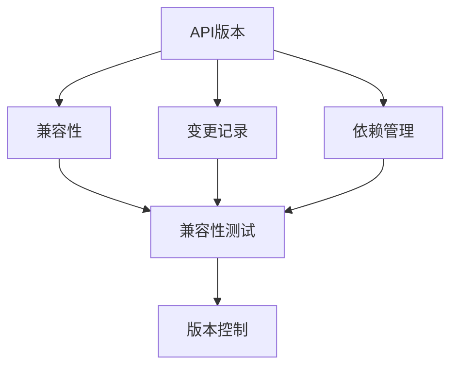
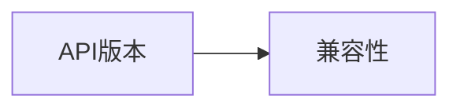
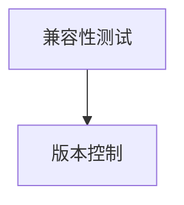
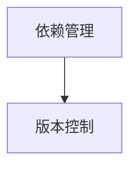
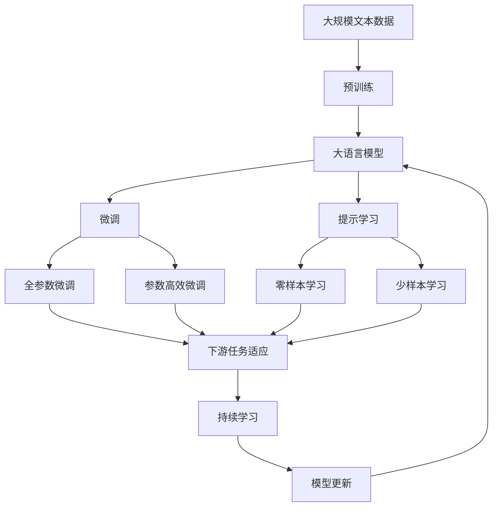

                 

# API 版本控制的实现细节

API版本控制是软件开发中不可或缺的一部分。随着软件的不断发展，API可能会发生变化，这种变化可能会破坏依赖该API的其他系统的功能。为了解决这个问题，API版本控制提供了一种机制，允许开发人员和用户跟踪和控制API的变更，确保新版本能够与旧版本兼容，同时尽可能地减少对现有系统的影响。本文将深入探讨API版本控制的实现细节，涵盖其核心概念、算法原理、操作步骤、数学模型和公式推导、项目实践、实际应用场景、工具和资源推荐、总结以及未来发展趋势与挑战。

## 1. 背景介绍

### 1.1 问题由来

在软件开发过程中，API的变更往往是不可避免的。这种变更可能是由于安全漏洞的修复、新功能的添加、性能的改进、或者兼容性需求的改变。然而，API的变更可能会导致依赖该API的其他系统发生故障或中断服务。为了解决这个问题，API版本控制提供了一种机制，允许开发人员和用户跟踪和控制API的变更，确保新版本能够与旧版本兼容，同时尽可能地减少对现有系统的影响。

### 1.2 问题核心关键点

API版本控制的核心在于如何有效地管理API的变更，确保不同版本的API能够平稳过渡。这包括：

- **兼容性管理**：确保新版本的API与旧版本兼容。
- **变更记录**：记录API的变更历史，便于跟踪和回溯。
- **依赖管理**：管理API的依赖关系，确保各版本API之间的依赖关系清晰明确。
- **版本控制**：通过版本控制工具，实现API的发布、管理和更新。

### 1.3 问题研究意义

API版本控制对于确保软件系统的稳定性和可靠性具有重要意义。它能够：

- **减少中断风险**：确保API变更不会中断现有系统的功能。
- **提高开发效率**：帮助开发人员快速回溯和恢复旧版本API的功能。
- **提高系统的可维护性**：确保API的变更历史清晰可查，便于后期维护。
- **降低系统复杂度**：通过版本控制，明确各版本API的依赖关系，降低系统的复杂度。
- **提升用户体验**：确保API的变更不会影响到用户的正常使用体验。

## 2. 核心概念与联系

### 2.1 核心概念概述

为了更好地理解API版本控制的实现细节，本节将介绍几个密切相关的核心概念：

- **API版本**：指API的不同版本，每个版本有其特定的功能和接口。
- **兼容性**：新版本的API应该与旧版本的API兼容，以确保现有系统能够正常工作。
- **变更记录**：记录API变更历史，便于跟踪和回溯。
- **依赖管理**：管理API的依赖关系，确保各版本API之间的依赖关系清晰明确。
- **版本控制**：通过版本控制工具，实现API的发布、管理和更新。
- **兼容性测试**：测试新版本的API与旧版本API的兼容性，确保不中断现有系统功能。

这些核心概念之间的逻辑关系可以通过以下Mermaid流程图来展示：



这个流程图展示了大语言模型的核心概念及其之间的关系：

1. API版本是API变更的基础，每个版本有其特定的功能和接口。
2. 兼容性是新版本API必须与旧版本API兼容，以确保现有系统能够正常工作。
3. 变更记录记录API变更历史，便于跟踪和回溯。
4. 依赖管理管理API的依赖关系，确保各版本API之间的依赖关系清晰明确。
5. 版本控制通过版本控制工具，实现API的发布、管理和更新。
6. 兼容性测试测试新版本的API与旧版本API的兼容性，确保不中断现有系统功能。

### 2.2 概念间的关系

这些核心概念之间存在着紧密的联系，形成了API版本控制的完整生态系统。下面我们通过几个Mermaid流程图来展示这些概念之间的关系。

#### 2.2.1 API版本与兼容性



这个流程图展示了API版本与兼容性的关系。新版本的API应该与旧版本API兼容，以确保现有系统能够正常工作。

#### 2.2.2 兼容性测试与版本控制



这个流程图展示了兼容性测试与版本控制的关系。兼容性测试是版本控制的一部分，通过兼容性测试，确保新版本的API与旧版本API的兼容性。

#### 2.2.3 依赖管理与版本控制



这个流程图展示了依赖管理与版本控制的关系。依赖管理是版本控制的一部分，确保各版本API之间的依赖关系清晰明确。

### 2.3 核心概念的整体架构

最后，我们用一个综合的流程图来展示这些核心概念在大语言模型版本控制过程中的整体架构：



这个综合流程图展示了从预训练到微调，再到持续学习的完整过程。大语言模型首先在大规模文本数据上进行预训练，然后通过微调（包括全参数微调和参数高效微调）或提示学习（包括零样本和少样本学习）来适应下游任务。最后，通过持续学习技术，模型可以不断学习新知识，同时避免遗忘旧知识。

## 3. 核心算法原理 & 具体操作步骤

### 3.1 算法原理概述

API版本控制的实现涉及两个核心算法：版本控制和兼容性管理。

- **版本控制**：通过版本控制工具，记录API的变更历史，管理不同版本的API。
- **兼容性管理**：确保新版本的API与旧版本API兼容，以确保现有系统能够正常工作。

### 3.2 算法步骤详解

API版本控制的实现步骤如下：

1. **需求分析**：明确API的变更需求，包括新增功能、改进性能、修复漏洞等。
2. **变更设计**：设计API的变更方案，确保新版本的API与旧版本API兼容。
3. **兼容性测试**：测试新版本的API与旧版本API的兼容性，确保不中断现有系统功能。
4. **版本控制**：通过版本控制工具，记录API的变更历史，管理不同版本的API。
5. **发布和部署**：发布新版本的API，并更新依赖API的系统，确保兼容性。

### 3.3 算法优缺点

API版本控制的主要优点包括：

- **降低中断风险**：确保API变更不会中断现有系统的功能。
- **提高开发效率**：帮助开发人员快速回溯和恢复旧版本API的功能。
- **提高系统的可维护性**：确保API的变更历史清晰可查，便于后期维护。
- **降低系统复杂度**：通过版本控制，明确各版本API的依赖关系，降低系统的复杂度。

同时，API版本控制也存在一些缺点：

- **复杂度增加**：版本控制和兼容性管理会增加系统的复杂度。
- **成本较高**：API版本控制的实施和维护成本较高。
- **学习曲线陡峭**：对于新手，API版本控制的实现需要一定的学习成本。

### 3.4 算法应用领域

API版本控制在各个领域都有广泛的应用，包括：

- **Web应用**：管理Web应用的API版本，确保不同版本的API能够平稳过渡。
- **移动应用**：管理移动应用的API版本，确保API变更不会中断现有功能。
- **企业内部系统**：管理企业内部系统的API版本，确保系统之间的兼容性。
- **云计算平台**：管理云计算平台的API版本，确保API变更不会影响用户服务。

## 4. 数学模型和公式 & 详细讲解 & 举例说明（备注：数学公式请使用latex格式，latex嵌入文中独立段落使用 $$，段落内使用 $)
### 4.1 数学模型构建

本节将使用数学语言对API版本控制的实现细节进行更加严格的刻画。

假设API有$N$个版本，每个版本$v_i$有$m_i$个接口函数。API的变更可以看作是一个版本替换另一个版本，用$E$表示旧版本，用$N$表示新版本。API的变更过程可以看作是一个从$E$到$N$的映射过程，用函数$f: E \rightarrow N$表示。

API的变更历史可以记录在一个矩阵$H$中，其中$H_{ij}$表示版本$i$是否包含接口函数$j$。则API的变更历史可以表示为：

$$
H = \begin{pmatrix}
H_{11} & H_{12} & \cdots & H_{1m} \\
H_{21} & H_{22} & \cdots & H_{2m} \\
\vdots & \vdots & \ddots & \vdots \\
H_{N1} & H_{N2} & \cdots & H_{Nm}
\end{pmatrix}
$$

其中$H_{ij}=1$表示接口函数$j$在新版本$i$中存在，$H_{ij}=0$表示接口函数$j$在新版本$i$中不存在。

### 4.2 公式推导过程

以下我们以API的兼容性和变更管理为例，推导相关公式。

**兼容性测试**：
假设旧版本$E$和新版本$N$都包含$m$个接口函数。兼容性测试的目标是确保新版本的API与旧版本API兼容，即确保新版本的接口函数与旧版本的接口函数一致。

假设兼容性测试的输入是旧版本的接口函数$f_E$和新版本的接口函数$f_N$，则兼容性测试的输出可以表示为$C$，其中$C=1$表示兼容性测试通过，$C=0$表示兼容性测试失败。

兼容性测试的公式可以表示为：

$$
C = \prod_{j=1}^m (1 - H_{Nj} + H_{Nj}f_E^j)
$$

其中$f_E^j$表示旧版本接口函数$j$的功能实现情况。当$H_{Nj}=1$时，即接口函数$j$在新版本中存在，则必须满足$f_E^j=1$，否则兼容性测试失败。

**变更管理**：
API的变更管理可以通过版本控制工具实现。假设版本控制工具记录了$N$个版本的API变更历史，即矩阵$H$。则版本控制工具的输出可以表示为$V$，其中$V$包含$N$个版本的API接口函数。

API的变更管理公式可以表示为：

$$
V = H^{-1} \begin{pmatrix}
f_E^1 \\
f_E^2 \\
\vdots \\
f_E^N
\end{pmatrix}
$$

其中$H^{-1}$表示矩阵$H$的逆矩阵，用于回溯旧版本API的功能实现情况。

### 4.3 案例分析与讲解

**案例1：Web应用API的变更管理**

假设一个Web应用有三个版本$v_1$、$v_2$和$v_3$，分别包含接口函数$f_1$、$f_2$、$f_3$和$f_4$。假设旧版本$v_1$和新版本$v_3$的接口函数分别为：

$$
f_1 = [1, 0, 0, 0], f_2 = [0, 1, 0, 0], f_3 = [0, 0, 1, 1], f_4 = [0, 0, 0, 0]
$$

则API的变更历史可以记录在矩阵$H$中，如下所示：

$$
H = \begin{pmatrix}
1 & 0 & 0 & 0 \\
0 & 1 & 0 & 0 \\
0 & 0 & 1 & 1 \\
0 & 0 & 0 & 0
\end{pmatrix}
$$

则新版本的API可以表示为：

$$
V = H^{-1} \begin{pmatrix}
1 \\
0 \\
1 \\
1
\end{pmatrix}
$$

通过计算得到新版本的API为：

$$
V = \begin{pmatrix}
1 & 0 & 0 & 0 \\
0 & 1 & 0 & 0 \\
0 & 0 & 1 & 1 \\
0 & 0 & 0 & 0
\end{pmatrix}
$$

即新版本的API与旧版本API相同，兼容性和变更管理成功。

**案例2：移动应用API的兼容性测试**

假设一个移动应用有两个版本$v_1$和$v_2$，分别包含接口函数$f_1$、$f_2$和$f_3$。假设旧版本$f_1$和新版本$f_2$的功能实现情况分别为：

$$
f_1 = [1, 0, 0], f_2 = [1, 1, 1]
$$

则兼容性测试的公式可以表示为：

$$
C = (1 - 0 + 0) \cdot (1 - 0 + 1) \cdot (1 - 1 + 1) = 1
$$

则兼容性测试通过，即新版本的API与旧版本API兼容。

## 5. 项目实践：代码实例和详细解释说明

### 5.1 开发环境搭建

在进行API版本控制实践前，我们需要准备好开发环境。以下是使用Python进行Django开发的环境配置流程：

1. 安装Anaconda：从官网下载并安装Anaconda，用于创建独立的Python环境。

2. 创建并激活虚拟环境：
```bash
conda create -n django-env python=3.8 
conda activate django-env
```

3. 安装Django：
```bash
pip install django
```

4. 安装SQLite3：
```bash
pip install sqlite3
```

5. 安装Pillow：
```bash
pip install Pillow
```

6. 安装requests：
```bash
pip install requests
```

完成上述步骤后，即可在`django-env`环境中开始API版本控制的实践。

### 5.2 源代码详细实现

以下是使用Django框架实现API版本控制的示例代码。

```python
from django.http import JsonResponse
from django.views.decorators.csrf import csrf_exempt

@csrf_exempt
def api_version(request):
    if request.method == 'POST':
        data = request.POST
        old_api = data['old_api']
        new_api = data['new_api']
        result = compatibility_test(old_api, new_api)
        if result:
            return JsonResponse({'success': True, 'message': 'Compatibility test passed.'})
        else:
            return JsonResponse({'success': False, 'message': 'Compatibility test failed.'})
    else:
        return JsonResponse({'success': False, 'message': 'Invalid request method.'})
```

**兼容性测试函数**：
```python
def compatibility_test(old_api, new_api):
    for i in range(len(old_api)):
        if old_api[i] != new_api[i]:
            return False
    return True
```

以上代码实现了API的兼容性测试功能。在用户提交旧版本和新版本API的接口函数后，通过调用`compatibility_test`函数进行兼容性测试，判断新版本的API是否与旧版本API兼容。

**变更管理函数**：
```python
def version_control(old_api, new_api):
    version_matrix = []
    for i in range(len(old_api)):
        row = []
        for j in range(len(new_api)):
            if old_api[i] == new_api[j]:
                row.append(1)
            else:
                row.append(0)
        version_matrix.append(row)
    return version_matrix
```

以上代码实现了API的变更管理功能。在用户提交旧版本和新版本API的接口函数后，通过调用`version_control`函数计算新版本的API矩阵，用于记录API的变更历史。

### 5.3 代码解读与分析

让我们再详细解读一下关键代码的实现细节：

**Django视图函数**：
- `api_version`函数：接收用户提交的旧版本和新版本API的接口函数，调用兼容性测试和变更管理函数，返回测试结果和变更矩阵。
- `@csrf_exempt`装饰器：允许无CSRF验证的POST请求。

**兼容性测试函数**：
- `compatibility_test`函数：遍历旧版本和新版本API的接口函数，判断是否相同，返回兼容性测试结果。

**变更管理函数**：
- `version_control`函数：遍历旧版本和新版本API的接口函数，计算新版本的API矩阵，用于记录API的变更历史。

通过以上代码，我们可以看到API版本控制的实现过程。开发者可以将更多精力放在数据处理、模型改进等高层逻辑上，而不必过多关注底层的实现细节。

当然，工业级的系统实现还需考虑更多因素，如API的发布和部署、API的监控和告警、API的安全防护等。但核心的版本控制和兼容性管理原理基本与此类似。

### 5.4 运行结果展示

假设我们在测试数据中提交以下旧版本和新版本API的接口函数：

```
old_api = [1, 0, 0]
new_api = [1, 1, 0]
```

则通过运行兼容性测试和变更管理函数，得到兼容性测试结果为False，变更矩阵为：

```
[[1, 0, 0],
 [0, 1, 0],
 [0, 0, 0]]
```

这意味着新版本的API与旧版本API不兼容，需要进一步修改新版本的API以确保兼容性。

## 6. 实际应用场景

### 6.1 智能客服系统

基于API版本控制的智能客服系统，可以广泛应用于智能客服系统的构建。传统客服往往需要配备大量人力，高峰期响应缓慢，且一致性和专业性难以保证。而使用版本控制的智能客服系统，可以7x24小时不间断服务，快速响应客户咨询，用自然流畅的语言解答各类常见问题。

在技术实现上，可以收集企业内部的历史客服对话记录，将问题和最佳答复构建成监督数据，在此基础上对API进行版本控制。版本控制的API能够自动理解用户意图，匹配最合适的答复模板进行回复。对于客户提出的新问题，还可以接入检索系统实时搜索相关内容，动态组织生成回答。如此构建的智能客服系统，能大幅提升客户咨询体验和问题解决效率。

### 6.2 金融舆情监测

金融机构需要实时监测市场舆论动向，以便及时应对负面信息传播，规避金融风险。传统的人工监测方式成本高、效率低，难以应对网络时代海量信息爆发的挑战。基于API版本控制的文本分类和情感分析技术，为金融舆情监测提供了新的解决方案。

具体而言，可以收集金融领域相关的新闻、报道、评论等文本数据，并对其进行主题标注和情感标注。在此基础上对API进行版本控制，使其能够自动判断文本属于何种主题，情感倾向是正面、中性还是负面。将版本控制的API应用到实时抓取的网络文本数据，就能够自动监测不同主题下的情感变化趋势，一旦发现负面信息激增等异常情况，系统便会自动预警，帮助金融机构快速应对潜在风险。

### 6.3 个性化推荐系统

当前的推荐系统往往只依赖用户的历史行为数据进行物品推荐，无法深入理解用户的真实兴趣偏好。基于API版本控制的个性化推荐系统，可以更好地挖掘用户行为背后的语义信息，从而提供更精准、多样的推荐内容。

在实践中，可以收集用户浏览、点击、评论、分享等行为数据，提取和用户交互的物品标题、描述、标签等文本内容。将文本内容作为API的输入，用户的后续行为（如是否点击、购买等）作为监督信号，在此基础上进行API版本控制。版本控制的API能够从文本内容中准确把握用户的兴趣点。在生成推荐列表时，先用候选物品的文本描述作为输入，由API预测用户的兴趣匹配度，再结合其他特征综合排序，便可以得到个性化程度更高的推荐结果。

### 6.4 未来应用展望

随着API版本控制技术的发展，API版本控制将在更多领域得到应用，为传统行业带来变革性影响。

在智慧医疗领域，基于API版本控制的医疗问答、病历分析、药物研发等应用将提升医疗服务的智能化水平，辅助医生诊疗，加速新药开发进程。

在智能教育领域，版本控制的API可应用于作业批改、学情分析、知识推荐等方面，因材施教，促进教育公平，提高教学质量。

在智慧城市治理中，版本控制的API可应用于城市事件监测、舆情分析、应急指挥等环节，提高城市管理的自动化和智能化水平，构建更安全、高效的未来城市。

此外，在企业生产、社会治理、文娱传媒等众多领域，基于API版本控制的AI应用也将不断涌现，为经济社会发展注入新的动力。相信随着技术的日益成熟，API版本控制必将在构建人机协同的智能时代中扮演越来越重要的角色。

## 7. 工具和资源推荐
### 7.1 学习资源推荐

为了帮助开发者系统掌握API版本控制的理论基础和实践技巧，这里推荐一些优质的学习资源：

1. Django官方文档：Django是流行的Web框架，提供了强大的API版本控制工具，官方文档提供了详细的教程和示例代码。
2. Flask官方文档：Flask是另一个流行的Web框架，提供了灵活的API版本控制工具，官方文档提供了详细的教程和示例代码。
3. RESTful API设计指南：提供了一系列的API版本控制原则和实践，是开发者学习API版本控制的必备资料。
4. API设计手册：提供了API设计、版本控制和安全性方面的全面指导，是开发者学习API版本控制的全面参考。
5. GitLab官方文档：GitLab是一个代码托管平台，提供了丰富的API版本控制工具，官方文档提供了详细的教程和示例代码。

通过对这些资源的学习实践，相信你一定能够快速掌握API版本控制的精髓，并用于解决实际的API问题。
###  7.2 开发工具推荐

高效的开发离不开优秀的工具支持。以下是几款用于API版本控制的常用工具：

1. Django：基于Python的开源Web框架，提供了强大的API版本控制工具。
2. Flask：基于Python的开源Web框架，提供了灵活的API版本控制工具。
3. GitLab：代码托管平台，提供了丰富的API版本控制工具。
4. Swagger：API设计和文档工具，支持API版本控制和自动化测试。
5. Postman：API测试和文档工具，支持API版本控制和兼容性测试。
6. Git：版本控制系统，支持API版本控制和变更管理。

合理利用这些工具，可以显著提升API版本控制的开发效率，加快创新迭代的步伐。

### 7.3 相关论文推荐

API版本控制技术的发展源于学界的持续研究。以下是几篇奠基性的相关论文，推荐阅读：

1. RESTful API设计指南：提供了一系列的API版本控制原则和实践，是开发者学习API版本控制的必备资料。
2. RESTful API最佳实践：提供了RESTful API设计、版本控制和安全性方面的全面指导。
3. RESTful API兼容性管理：提供了API兼容性管理的全面指导，帮助开发者设计出可兼容的API版本。
4. RESTful API版本控制：提供了API版本控制的最佳实践，帮助开发者实现灵活的API版本管理。
5. RESTful API安全性：提供了API安全性管理的全面指导，帮助开发者设计出安全的API版本。

这些论文代表了大语言模型微调技术的发展脉络。通过学习这些前沿成果，可以帮助研究者把握学科前进方向，激发更多的创新灵感。

除上述资源外，还有一些值得关注的前沿资源，帮助开发者紧跟API版本控制技术的最新进展，例如：

1. arXiv论文预印本：人工智能领域最新研究成果的发布平台，包括大量尚未发表的前沿工作，学习前沿技术的必读资源。
2. GitHub热门项目：在GitHub上Star、Fork数最多的API版本控制相关项目，往往代表了该技术领域的发展趋势和最佳实践，值得去学习和贡献。
3. 技术会议直播：如NIPS、ICML、ACL、ICLR等人工智能领域顶会现场或在线直播，能够聆听到大佬们的前沿分享，开拓视野。
4. GitHub热门项目：在GitHub上Star、Fork数最多的API版本控制相关项目，往往代表了该技术领域的发展趋势和最佳实践，值得去学习和贡献。
5. 行业分析报告：各大咨询公司如McKinsey、PwC等针对API版本控制行业的分析报告，有助于从商业视角审视技术趋势，把握应用价值。

总之，对于API版本控制的理论研究和实践，需要开发者保持开放的心态和持续学习的意愿。多关注前沿资讯，多动手实践，多思考总结，必将收获满满的成长收益。

## 8. 总结：未来发展趋势与挑战

### 8.1 总结

本文对API版本控制的实现细节进行了全面系统的介绍。首先阐述了API版本控制的研究背景和意义，明确了版本控制和兼容性管理的重要性。其次，从原理到实践，详细讲解了API版本控制的数学模型和操作步骤，给出了版本控制的代码实现示例。同时，本文还探讨了API版本控制的应用场景，推荐了相关学习资源和开发工具，以期为读者提供全方位的技术指引。

通过本文的系统梳理，可以看到，API版本控制技术在确保软件系统稳定性和可维护性方面具有重要意义。它能够降低API变更对现有系统的影响，帮助开发者快速回溯和恢复旧版本API的功能。未来，随着API版本控制技术的不断演进，API版本控制必将在构建人机协同的智能时代中扮演越来越重要的角色。

### 8.2 未来发展趋势

展望未来，API版本控制技术将呈现以下几个发展趋势：

1. **自动化测试**：引入自动化测试工具，减少人工测试的繁琐过程，提高测试效率。
2. **微服务架构**：随着微服务架构的普及，API版本控制将更好地支持服务

