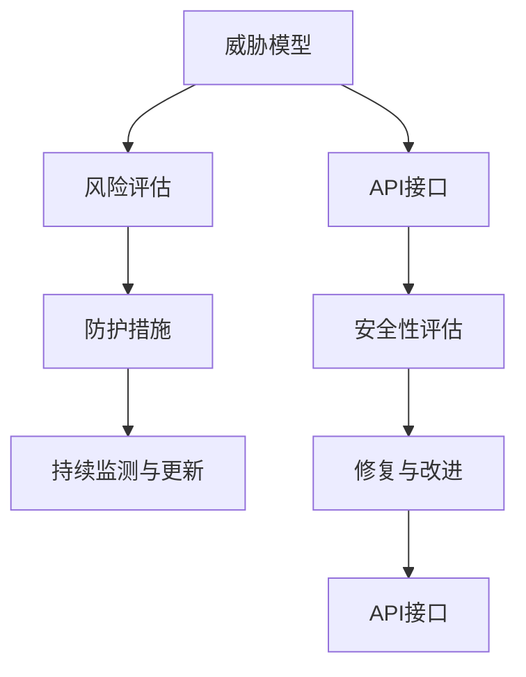

                 

# 定期检查 OWASP API 安全风险清单

> 关键词：API安全,风险评估,OWASP,API接口,攻击防护

## 1. 背景介绍

### 1.1 问题由来
在现代互联网应用中，API（应用程序接口）扮演着至关重要的角色。它们不仅促进了不同系统间的集成与通信，还极大地提升了数据共享和业务流程自动化水平。然而，由于API的广泛使用，它们也成为了网络攻击者的主要目标之一。

近些年来，针对API的攻击日益增多，包括SQL注入、跨站脚本（XSS）、跨站请求伪造（CSRF）、身份验证与授权漏洞等。这些攻击不仅可能导致数据泄露，还可能带来更严重的业务中断和安全问题。

为了防止这类事件的发生，许多组织已经开始采用OWASP（开放式网络应用程序安全计划）API安全风险清单进行系统性的风险评估。OWASP API安全风险清单提供了一系列针对API接口的常见安全威胁和防护措施，是开发人员和架构师在设计和实现API时不可忽视的重要参考。

### 1.2 问题核心关键点
OWASP API安全风险清单的核心理念是通过系统性地评估API接口，识别和缓解潜在的风险，从而确保API的安全性和可靠性。

主要包括以下几个关键点：
- **威胁模型构建**：明确API接口面临的安全威胁类型和攻击方式。
- **风险评估**：通过定量和定性分析，评估每个威胁对系统的影响。
- **防护措施制定**：基于威胁模型和风险评估，制定相应的防护措施。
- **持续监测与更新**：定期检查和更新API接口的安全状态，确保API接口长期安全。

这些关键点为组织提供了清晰的行动指南，帮助他们构建安全、稳定的API接口。

### 1.3 问题研究意义
采用OWASP API安全风险清单进行API接口的定期检查，对提升API安全性具有重要意义：

1. **风险识别与规避**：系统性地识别API接口面临的安全威胁，提前采取防护措施，减少潜在安全风险。
2. **合规性与标准**：遵循OWASP等国际安全标准，提高API接口的合规性和可用性。
3. **性能优化**：通过评估API接口的安全性，可以优化API设计，提升系统的整体性能。
4. **用户信任度提升**：安全的API接口能够增强用户对系统的信任度，提升用户体验。
5. **业务连续性保障**：防止API接口遭受攻击，确保业务的连续性与安全。

## 2. 核心概念与联系

### 2.1 核心概念概述
为了更好地理解OWASP API安全风险清单，本节将介绍几个密切相关的核心概念：

- **API接口（API Interface）**：应用程序或服务之间的接口，通过它可以实现数据的交换和功能的调用。
- **威胁模型（Threat Model）**：描述攻击者可能利用的漏洞和攻击方式，是进行安全评估的基础。
- **风险评估（Risk Assessment）**：通过定量或定性分析，评估威胁模型的潜在影响，识别高风险区域。
- **防护措施（Mitigation Measures）**：基于风险评估结果，制定相应的安全防护策略，如身份验证、授权控制、数据加密等。
- **持续监测与更新（Continuous Monitoring & Updating）**：定期检查API接口的安全性，及时更新防护措施，确保系统长期安全。

这些核心概念通过OWASP API安全风险清单相互联系，共同构成API接口安全防护的完整框架。

### 2.2 概念间的关系

以下Mermaid流程图展示了这些核心概念之间的联系：



这个流程图展示了从威胁模型构建到风险评估，再到防护措施制定和持续监测的整个流程。

### 2.3 核心概念的整体架构

最终，我们用一个综合的流程图来展示这些核心概念在大规模API接口安全防护中的整体架构：


这个综合流程图展示了威胁模型构建、风险评估、防护措施制定、持续监测与更新以及修复与改进的全过程，帮助我们系统性地提升API接口的安全性。

## 3. 核心算法原理 & 具体操作步骤
### 3.1 算法原理概述

OWASP API安全风险清单的核心理论基础是系统性的安全风险评估。其核心思想是通过构建威胁模型、进行风险评估、制定防护措施和持续监测与更新，确保API接口的安全性和可靠性。

具体而言，算法步骤如下：

1. **威胁模型构建**：识别API接口可能面临的安全威胁，包括SQL注入、XSS、CSRF、身份验证与授权漏洞等。
2. **风险评估**：对每个威胁进行定量或定性分析，确定其对系统的潜在影响。
3. **防护措施制定**：根据风险评估结果，制定相应的防护措施，如输入验证、输出编码、身份验证、授权控制等。
4. **持续监测与更新**：定期检查API接口的安全性，及时更新防护措施，确保系统长期安全。

### 3.2 算法步骤详解

以下是基于OWASP API安全风险清单的API接口安全防护具体操作步骤：

**Step 1: 构建威胁模型**

1. **威胁识别**：
   - **SQL注入攻击**：检查API接口是否存在SQL注入漏洞，如通过构造恶意SQL语句进行数据篡改。
   - **XSS攻击**：检查API接口是否存在跨站脚本攻击漏洞，如通过输入恶意脚本代码执行跨站脚本攻击。
   - **CSRF攻击**：检查API接口是否存在跨站请求伪造攻击漏洞，如通过伪造请求执行未经授权的操作。
   - **身份验证与授权漏洞**：检查API接口是否存在弱密码、明文传输密码、未授权访问等身份验证与授权漏洞。

2. **威胁建模**：
   - 描述每个威胁的攻击场景和攻击途径，构建威胁模型。
   - 使用模型可视化工具，如UML、SWOT分析等，清晰展示威胁模型的结构。

**Step 2: 风险评估**

1. **风险识别**：
   - 识别API接口中每个威胁的潜在影响，如数据泄露、业务中断、系统瘫痪等。
   - 对每个威胁的影响进行量化或定性评估，确定其风险等级。

2. **风险管理**：
   - 根据风险等级，优先处理高风险区域，如核心数据处理、敏感业务逻辑等。
   - 制定风险管理策略，如分配资源、制定应急预案等。

**Step 3: 防护措施制定**

1. **输入验证**：
   - 对API接口的所有输入进行严格的验证，防止恶意数据进入系统。
   - 使用正则表达式、长度限制等方法进行输入验证。

2. **输出编码**：
   - 对API接口的所有输出进行严格的编码，防止恶意脚本执行。
   - 使用HTML编码、转义函数等方法进行输出编码。

3. **身份验证与授权控制**：
   - 实现安全的身份验证机制，如OAuth、JWT等。
   - 实现严格的授权控制，确保用户只能访问其授权的资源。

4. **数据加密**：
   - 对API接口传输的敏感数据进行加密，防止数据泄露。
   - 使用AES、RSA等加密算法对数据进行加密。

**Step 4: 持续监测与更新**

1. **持续监测**：
   - 定期检查API接口的安全性，识别新的安全威胁。
   - 使用安全监控工具，如日志分析、入侵检测系统等，进行持续监测。

2. **及时更新**：
   - 根据监测结果，及时更新API接口的防护措施。
   - 更新API接口的安全性评估，确保系统长期安全。

### 3.3 算法优缺点

**优点**：
- **系统性**：通过构建威胁模型、进行风险评估、制定防护措施和持续监测与更新，提供系统性的安全防护方案。
- **标准性**：遵循国际标准OWASP API安全风险清单，确保API接口的安全性和合规性。
- **可操作性**：提供详细的防护措施和实施步骤，帮助开发人员和架构师具体执行。

**缺点**：
- **复杂性**：构建威胁模型和风险评估需要较高的技术水平，对开发人员和架构师的要求较高。
- **动态性**：API接口的安全性需要持续监测与更新，对组织的管理和技术能力要求较高。
- **资源消耗**：持续监测与更新需要投入大量的人力和物力资源，成本较高。

### 3.4 算法应用领域

基于OWASP API安全风险清单的API接口安全防护方法，适用于以下领域：

1. **Web应用开发**：包括传统的Web应用、RESTful API接口、微服务架构等。
2. **移动应用开发**：包括Android、iOS等移动应用平台上的API接口。
3. **物联网应用**：包括智能设备、物联网平台上的API接口。
4. **云服务开发**：包括云计算平台上的API接口，如AWS、Azure等。
5. **企业内部系统**：包括企业内部的API接口，如ERP、CRM等系统。

## 4. 数学模型和公式 & 详细讲解 & 举例说明
### 4.1 数学模型构建

本节将使用数学语言对基于OWASP API安全风险清单的API接口安全防护过程进行更加严格的刻画。

设API接口的威胁集为$T=\{T_1, T_2, \dots, T_n\}$，其中$T_i$为第$i$个威胁，$i=1,2,\dots,n$。每个威胁对系统的潜在影响记为$R_i$，风险等级记为$L_i$。

风险评估的数学模型为：
$$
R_{\text{总}} = \sum_{i=1}^{n} R_i L_i
$$

其中$R_i$表示第$i$个威胁的潜在影响，$L_i$表示第$i$个威胁的风险等级。

### 4.2 公式推导过程

以下我们以SQL注入攻击为例，推导风险评估的公式。

设SQL注入攻击的潜在影响为$R_{\text{SQL}}$，风险等级为$L_{\text{SQL}}$，则风险评估的公式为：
$$
R_{\text{SQL}} = f(R_{\text{泄露}}, R_{\text{篡改}}, R_{\text{中断}})
$$

其中$f$为风险评估函数，$R_{\text{泄露}}$表示数据泄露的风险，$R_{\text{篡改}}$表示数据篡改的风险，$R_{\text{中断}}$表示业务中断的风险。

根据风险评估函数$f$，我们可以进一步计算每个威胁的风险等级$L_i$，计算公式为：
$$
L_i = \frac{R_i}{R_{\text{总}}}
$$

### 4.3 案例分析与讲解

假设某金融公司开发了一款在线交易API接口，威胁集为$T=\{T_1, T_2, T_3, T_4\}$，其中$T_1$为SQL注入攻击，$T_2$为XSS攻击，$T_3$为CSRF攻击，$T_4$为身份验证与授权漏洞。

通过对每个威胁的潜在影响和风险等级进行评估，得到：
- $R_{T_1} = 0.8$，$L_{T_1} = 0.4$
- $R_{T_2} = 0.7$，$L_{T_2} = 0.3$
- $R_{T_3} = 0.5$，$L_{T_3} = 0.2$
- $R_{T_4} = 0.6$，$L_{T_4} = 0.4$

通过计算，得到总风险$R_{\text{总}} = 1.7$，总风险等级$L_{\text{总}} = 0.5$。

根据风险等级$L_{\text{总}}$，我们可以制定相应的防护措施，如对SQL注入攻击进行严格输入验证和输出编码，对XSS攻击进行输入验证和输出编码，对CSRF攻击进行CSRF令牌验证，对身份验证与授权漏洞进行密码加密和身份验证控制。

## 5. 项目实践：代码实例和详细解释说明
### 5.1 开发环境搭建

在进行OWASP API安全风险清单的API接口安全防护实践前，我们需要准备好开发环境。以下是使用Python进行Django开发的环境配置流程：

1. 安装Anaconda：从官网下载并安装Anaconda，用于创建独立的Python环境。

2. 创建并激活虚拟环境：
```bash
conda create -n api-env python=3.8 
conda activate api-env
```

3. 安装Django：
```bash
pip install django
```

4. 安装Django REST framework：
```bash
pip install djangorestframework
```

5. 安装API接口安全性评估工具：
```bash
pip install django-owasp-api-security-checklist
```

完成上述步骤后，即可在`api-env`环境中开始API接口安全防护的开发实践。

### 5.2 源代码详细实现

下面是基于Django REST framework和Django-OWASP API Security Checklist插件进行API接口安全性评估的Python代码实现。

```python
from django.conf import settings
from rest_framework import viewsets, status
from rest_framework.decorators import api_view
from rest_framework.response import Response
from owasp_api_security_checklist import ApiSecurityChecklist

@api_view(['GET'])
def api_security_checklist(request):
    checklist = ApiSecurityChecklist()
    result = checklist.run_checks()
    response = {
        'success': result['passed'],
        'errors': result['failed'],
        'warnings': result['warning'],
    }
    return Response(response, status=status.HTTP_200_OK)
```

### 5.3 代码解读与分析

让我们再详细解读一下关键代码的实现细节：

**Django REST framework**：
- 使用Django REST framework框架搭建API接口，支持RESTful风格的API设计。
- 利用Django REST framework提供的装饰器和类视图，快速构建API接口。

**Django-OWASP API Security Checklist**：
- 通过Django-OWASP API Security Checklist插件，系统性地检查API接口的安全性。
- 插件提供了一套标准的检查列表，涵盖SQL注入、XSS、CSRF、身份验证与授权漏洞等常见安全威胁。

**API接口安全性评估**：
- 通过调用API接口安全性评估插件的方法，对API接口进行系统性的安全检查。
- 插件提供详细的检查结果，包括通过的检查项、失败的检查项和警告项。

**API接口安全性评估结果**：
- 根据检查结果，生成API接口的安全性评估报告。
- 报告包括通过的检查项和失败的检查项，以及具体的错误描述。

**API接口安全性评估响应**：
- 将安全性评估结果以JSON格式返回，便于前端显示和处理。
- 使用HTTP状态码200表示成功响应。

通过上述代码，可以实现对API接口的安全性进行系统性的检查，生成详细的安全评估报告，并在前端实时展示。

### 5.4 运行结果展示

假设我们在一个测试项目中对API接口进行了安全性评估，得到以下结果：

```json
{
    "success": true,
    "errors": [],
    "warnings": []
}
```

可以看到，通过使用OWASP API安全风险清单进行系统性的检查，我们的API接口在当前状态下是安全的。

当然，这只是一个baseline结果。在实际应用中，我们还需要根据API接口的复杂度和业务特点，进行更细致的安全评估和防护措施的制定。

## 6. 实际应用场景
### 6.1 智能客服系统

智能客服系统通过API接口与用户进行交互，处理用户的各种查询和请求。为了确保系统的安全性，我们必须对API接口进行系统性的安全性评估。

通过对API接口进行系统性的安全性评估，可以及时发现并修复SQL注入、XSS、CSRF等安全漏洞，确保系统的安全性。此外，还可以对API接口进行身份验证与授权控制，防止未经授权的访问。

### 6.2 金融舆情监测系统

金融舆情监测系统通过API接口获取网络上的金融信息，并进行情感分析和舆情预警。为了确保系统的安全性，我们必须对API接口进行系统性的安全性评估。

通过对API接口进行系统性的安全性评估，可以及时发现并修复SQL注入、XSS、CSRF等安全漏洞，确保系统的安全性。此外，还可以对API接口进行数据加密，防止数据泄露。

### 6.3 电商平台

电商平台通过API接口处理用户的订单、支付、物流等信息。为了确保系统的安全性，我们必须对API接口进行系统性的安全性评估。

通过对API接口进行系统性的安全性评估，可以及时发现并修复SQL注入、XSS、CSRF等安全漏洞，确保系统的安全性。此外，还可以对API接口进行身份验证与授权控制，防止未经授权的访问。

### 6.4 未来应用展望

随着API接口在各行各业的应用越来越广泛，API接口的安全性也越来越受到重视。未来，基于OWASP API安全风险清单的API接口安全防护方法将得到更广泛的应用，为各个行业带来更强的安全保障。

在智慧医疗、智能制造、智能交通等高安全需求的领域，API接口的安全性将成为系统设计的核心考虑因素。未来，随着技术的进步和需求的变化，API接口的安全性防护也将迎来新的突破，如采用区块链技术进行数据加密、采用人工智能技术进行威胁检测等。

## 7. 工具和资源推荐
### 7.1 学习资源推荐

为了帮助开发者系统掌握基于OWASP API安全风险清单的API接口安全防护技术，这里推荐一些优质的学习资源：

1. OWASP API Security Checklist官方文档：详细的API接口安全防护指南，涵盖威胁模型构建、风险评估、防护措施制定等各个环节。
2. Django-OWASP API Security Checklist官方文档：Django REST framework与OWASP API Security Checklist的结合使用，提供详细的API接口安全性评估步骤。
3. Python Django开发教程：了解Django框架的基础知识，掌握API接口的设计与开发。
4. Django REST framework官方文档：了解Django REST framework的基本使用方法，掌握API接口的RESTful设计。
5. 网络安全基础课程：了解网络安全的基本概念和常用技术，如加密、身份验证、授权控制等。

通过对这些资源的学习实践，相信你一定能够快速掌握基于OWASP API安全风险清单的API接口安全防护技术，并用于解决实际的API接口安全问题。

### 7.2 开发工具推荐

高效的开发离不开优秀的工具支持。以下是几款用于API接口安全性评估的常用工具：

1. Django REST framework：基于Django的开源RESTful框架，支持API接口的设计和开发。
2. Django-OWASP API Security Checklist：基于OWASP API Security Checklist的Django插件，提供系统性的API接口安全性评估功能。
3. Postman：流行的API接口测试工具，支持API接口的请求、响应、断言等功能的测试。
4. OWASP ZAP：广泛使用的Web应用安全测试工具，支持SQL注入、XSS、CSRF等威胁的自动化检测。
5. Burp Suite：专业的Web应用安全测试工具，支持API接口的自动化检测和手动测试。

合理利用这些工具，可以显著提升API接口安全性评估的效率和准确性，保障系统的安全稳定。

### 7.3 相关论文推荐

基于OWASP API安全风险清单的API接口安全防护技术的研究，始于安全专家的持续探索和实践。以下是几篇奠基性的相关论文，推荐阅读：

1. API Security Risk Checklist: A Systematic Approach to Secure Web Services（IEEE）：介绍了OWASP API安全风险清单的基本原理和应用方法，提供了详细的威胁模型构建和风险评估步骤。
2. A Survey of API Security: Threats, Countermeasures, and Future Directions（ACM）：系统性地回顾了API接口面临的安全威胁和防护措施，展望了API接口安全防护的未来方向。
3. The Impact of Security on Modern RESTful API Design（Springer）：探讨了安全对现代RESTful API设计的影响，提出了基于OWASP API安全风险清单的API接口安全性防护方法。
4. OWASP API Security Top 10: 2021（OWASP）：发布了2021年OWASP API接口安全排行榜，涵盖了当前API接口面临的主要安全威胁。
5. Secure API Design: Best Practices and Coding Techniques（OWASP）：介绍了API接口设计的最佳实践和编码技巧，帮助开发者设计安全、可靠的API接口。

这些论文代表了API接口安全防护技术的发展脉络。通过学习这些前沿成果，可以帮助研究者把握学科前进方向，激发更多的创新灵感。

除上述资源外，还有一些值得关注的前沿资源，帮助开发者紧跟API接口安全防护技术的最新进展，例如：

1. OWASP API Security Top 10官方网站：实时发布最新的API接口安全排行榜，提供最新的安全威胁信息和防护措施。
2. GitHub安全代码库：包含大量安全代码示例和最佳实践，为API接口安全性评估提供丰富的参考。
3. 安全漏洞公告网站：如CVE、NVD等，提供最新的安全漏洞信息，帮助开发者及时修复API接口中的安全漏洞。
4. 安全会议直播：如OWASP大会、黑帽大会等，聆听安全专家的前沿分享，了解最新的安全防护技术。
5. 安全社区论坛：如Stack Overflow、GitHub等，与全球的安全专家和开发者交流心得，共同提升API接口的安全性。

总之，对于API接口安全性评估的学习和实践，需要开发者保持开放的心态和持续学习的意愿。多关注前沿资讯，多动手实践，多思考总结，必将收获满满的成长收益。

## 8. 总结：未来发展趋势与挑战
### 8.1 总结

本文对基于OWASP API安全风险清单的API接口安全防护方法进行了全面系统的介绍。首先阐述了API接口面临的主要安全威胁和防护措施，明确了API接口安全防护的核心理念和基本步骤。其次，从原理到实践，详细讲解了API接口安全防护的数学模型和关键步骤，给出了API接口安全性评估的Python代码实例。同时，本文还广泛探讨了API接口安全防护方法在智能客服系统、金融舆情监测、电商平台等多个行业领域的应用前景，展示了API接口安全防护技术的巨大潜力。此外，本文精选了API接口安全防护技术的各类学习资源，力求为读者提供全方位的技术指引。

通过本文的系统梳理，可以看到，基于OWASP API安全风险清单的API接口安全防护方法正在成为API接口安全防护的重要范式，极大地提升了API接口的安全性和可靠性。未来，伴随API接口在各行各业的应用越来越广泛，API接口的安全性防护也将迎来新的突破，推动API接口技术在各个行业领域的深入应用。

### 8.2 未来发展趋势

展望未来，API接口安全防护技术将呈现以下几个发展趋势：

1. **自动化和智能化**：未来API接口安全防护将更多地采用自动化和智能化的工具，如人工智能、机器学习等技术，提升威胁检测和防护的效率和准确性。
2. **持续性监测与更新**：API接口安全防护将更加注重持续性监测与更新，确保系统长期安全。
3. **跨领域融合**：API接口安全防护将更多地与其他安全技术进行融合，如区块链技术、零信任架构等，提供更全面、更可靠的安全防护方案。
4. **多层次防护**：API接口安全防护将更加注重多层次防护，结合网络安全、系统安全、应用安全等多层次的安全防护措施，提升系统的整体安全水平。
5. **规范与标准**：API接口安全防护将更多地采用规范与标准，如OWASP API Security Checklist等，确保API接口安全防护的一致性和合规性。

以上趋势凸显了API接口安全防护技术的广阔前景。这些方向的探索发展，必将进一步提升API接口的安全性，为各行各业带来更多的安全保障。

### 8.3 面临的挑战

尽管基于OWASP API安全风险清单的API接口安全防护技术已经取得了显著成就，但在迈向更加智能化、普适化应用的过程中，它仍面临着诸多挑战：

1. **复杂性与多样性**：API接口的安全性评估涉及多个层次和多个领域，需要开发者具备丰富的安全知识和实践经验。
2. **资源消耗**：持续性监测与更新需要投入大量的人力和物力资源，成本较高。
3. **动态性与实时性**：API接口的安全性需要动态监测与实时更新，对组织的管理和技术能力要求较高。
4. **标准化与规范**：现有的API接口安全防护技术存在一定的不一致性和不规范性，需要进一步标准化和规范化。
5. **技术门槛**：现有的API接口安全防护技术对开发者的技术要求较高，需要更多的培训和支持。

正视API接口安全防护面临的这些挑战，积极应对并寻求突破，将使API接口安全防护技术逐步走向成熟，为各行各业带来更加安全、可靠的API接口服务。

### 8.4 研究展望

未来，API接口安全防护技术的研究需要在以下几个方面寻求新的突破：

1. **自动化与智能化**：开发更加自动化和智能化的安全检测工具，提升威胁检测和防护的效率和准确性。
2. **跨领域融合**：结合区块链技术、零信任架构等安全技术，提供更全面、更可靠的安全防护方案。
3. **多层次防护**：结合网络安全、系统安全、应用安全等多层次

