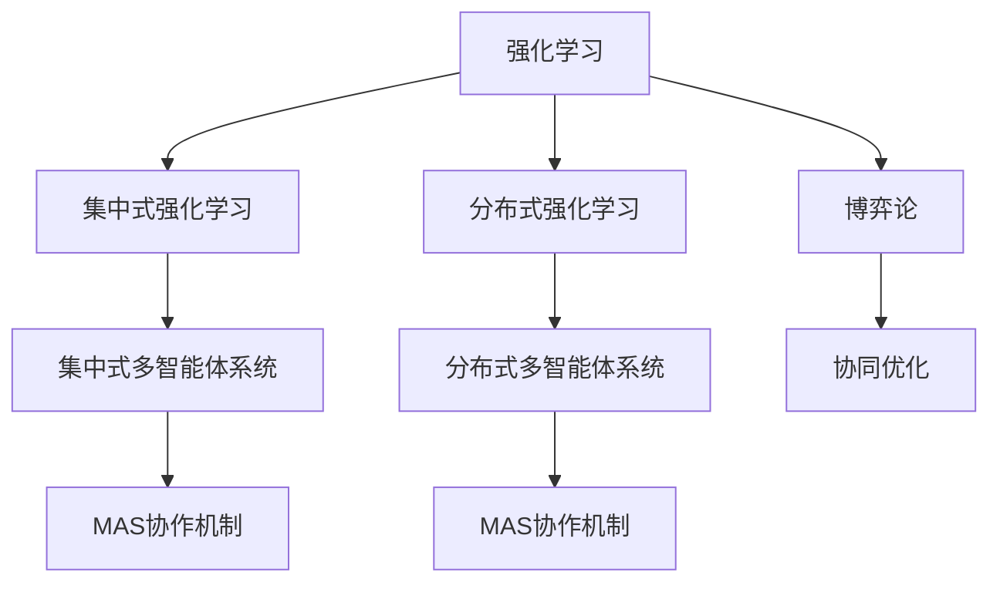
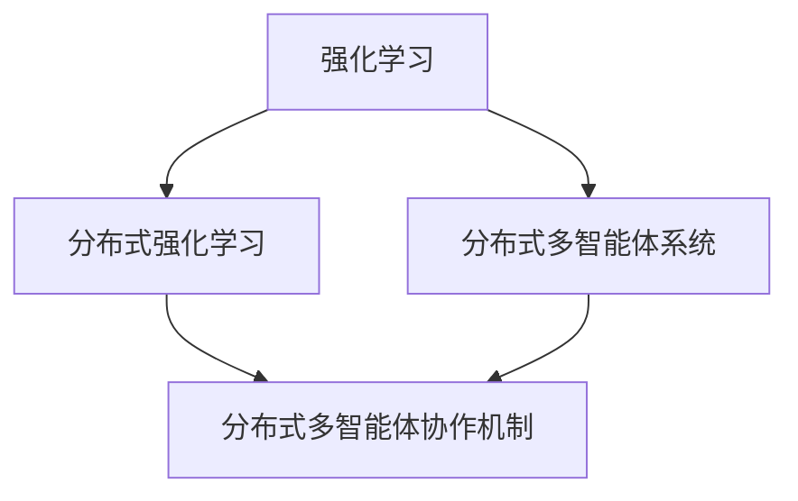
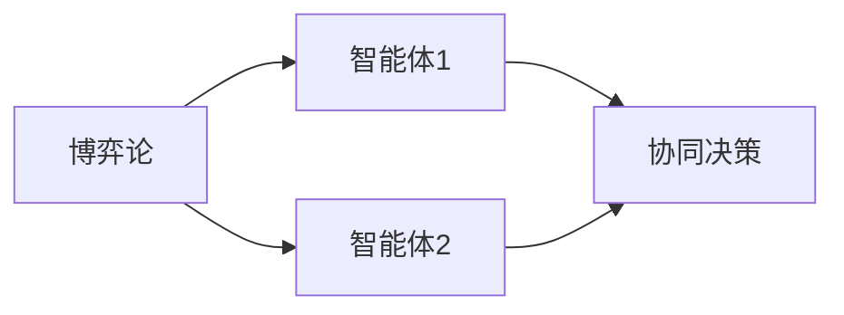
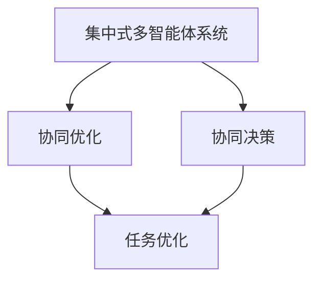
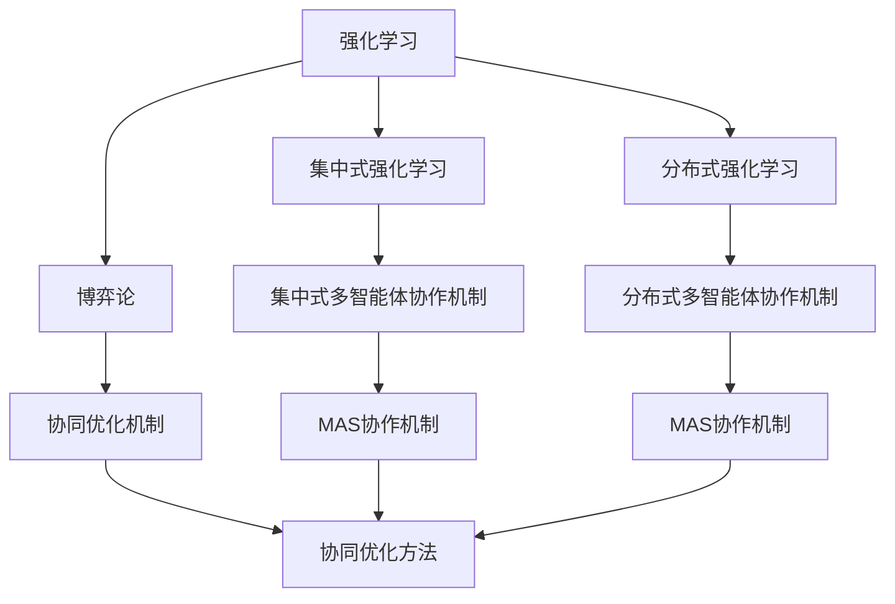

                 

## 1. 背景介绍

### 1.1 问题由来
近年来，强化学习（Reinforcement Learning, RL）在智能控制、机器人、自动驾驶、游戏AI等领域取得了重要进展，显著提升了系统的智能决策能力。然而，现实世界中的许多问题都涉及多个智能体（Agent）的协作与互动，如多机器人的协同作业、自动驾驶车辆之间的信息共享、智能交通信号的协同优化等。多智能体系统（Multi-Agent System, MAS）面临更为复杂的情境感知、协调决策和行动执行问题，使得单一的强化学习框架难以应对。

为此，研究者提出了多种多智能体协同机制，包括集中式与分布式强化学习、博弈论、协同优化等方法，尝试使多个智能体之间能够有效合作，共同完成目标任务。本文将系统地介绍多智能体系统的协作机制，特别是通过强化学习来实现多智能体系统协作的核心算法和具体实现。

### 1.2 问题核心关键点
多智能体系统协作机制的核心在于设计合理的智能体间信息共享、奖励分配、策略协调等机制，使得各智能体能够在复杂环境中协同工作，共同完成任务。主要挑战包括：

1. 智能体间的信息共享：如何有效地将各智能体观察到的状态信息传递给对方，以便实现同步决策。
2. 智能体的奖励分配：在多智能体系统中，如何公平合理地分配奖励给各个智能体。
3. 智能体的策略协调：如何在竞争与合作中找到智能体间的最佳策略组合，以实现协同优化。
4. 多智能体系统的一致性：如何保证所有智能体的决策与行为在全局上保持一致，避免异步或协作失败的情况。

### 1.3 问题研究意义
多智能体系统协作机制的研究对于提升复杂系统中智能体的决策能力和协同效率具有重要意义：

1. 降低系统复杂度：通过设计合适的协作机制，能够简化系统结构，减少交互环节，提高决策效率。
2. 提升系统鲁棒性：协同优化可增强系统对外部干扰和内部变化的适应能力，提高系统的鲁棒性和稳定性。
3. 促进资源共享：通过协作，各智能体可以共享资源，实现任务并行，提高系统的整体性能。
4. 加速任务完成：协作机制可使得多个智能体协同工作，加速任务的完成速度，缩短任务执行时间。
5. 推动智能技术应用：在多智能体系统中，协作机制可以更好地实现智能技术的落地应用，拓展其应用场景。

## 2. 核心概念与联系

### 2.1 核心概念概述

为更好地理解多智能体系统协作机制，本文将介绍几个核心概念：

1. 强化学习（Reinforcement Learning, RL）：一种基于奖励反馈的学习方式，智能体通过与环境的交互，不断优化策略以最大化期望累积奖励。
2. 多智能体系统（Multi-Agent System, MAS）：涉及多个智能体，这些智能体可以相互通信、共享信息，并在共同的环境中协作完成任务的系统。
3. 集中式与分布式强化学习：集中式指所有智能体的信息通过中央控制器集中处理，而分布式则指各智能体间直接进行信息交换。
4. 博弈论：用于描述智能体间的互动和决策过程，通过分析各智能体的策略组合，找出最优的决策方案。
5. 协同优化（Collaborative Optimization）：多智能体系统通过协同优化，共同优化系统性能，实现整体最优。

这些核心概念之间的逻辑关系可以通过以下Mermaid流程图来展示：



这个流程图展示了大语言模型的核心概念及其之间的关系：

1. 强化学习是整个系统的基础，通过与环境的交互学习最优策略。
2. 集中式与分布式强化学习，分别描述了信息集中处理和直接交互的两种方式。
3. 集中式和分布式多智能体系统，分别展示了信息集中和直接交互下协作机制的应用场景。
4. 博弈论用于分析各智能体间的互动策略，协同优化则是多智能体系统的共同目标。

### 2.2 概念间的关系

这些核心概念之间存在着紧密的联系，形成了多智能体系统协作的完整生态系统。下面我通过几个Mermaid流程图来展示这些概念之间的关系。

#### 2.2.1 强化学习的分布式范式



这个流程图展示了强化学习通过分布式范式实现多智能体协作的过程。强化学习框架中的智能体通过直接通信，共享信息，实现协同优化。

#### 2.2.2 博弈论在协作中的应用



这个流程图展示了博弈论在多智能体协作中的应用。通过分析各智能体的策略，博弈论可以优化决策过程，实现最优协作。

#### 2.2.3 协同优化机制



这个流程图展示了集中式多智能体系统通过协同优化机制实现任务优化的过程。集中式协作机制通过协调智能体的决策和行动，优化整体系统性能。

### 2.3 核心概念的整体架构

最后，我们用一个综合的流程图来展示这些核心概念在大语言模型协作过程中的整体架构：



这个综合流程图展示了从强化学习到协同优化的完整过程。强化学习通过集中式或分布式方式，在多智能体系统中实现协作，博弈论分析智能体间的策略，协同优化机制优化整体系统性能。

## 3. 核心算法原理 & 具体操作步骤
### 3.1 算法原理概述

多智能体系统协作的核心在于设计合适的协作机制，使得各智能体能够在复杂环境中协同工作，共同完成任务。常见的协作机制包括集中式与分布式强化学习、博弈论和协同优化等。

集中式与分布式强化学习的区别在于信息的传递方式，集中式将各智能体的状态信息集中处理，而分布式则是直接通过信息交换实现同步决策。博弈论则通过分析智能体间的互动策略，找出最优的决策方案。协同优化则是一种方法，通过多个智能体的协作，共同优化系统性能，实现整体最优。

### 3.2 算法步骤详解

多智能体系统协作机制的具体实现步骤包括：

1. **环境定义**：定义多智能体系统所处的复杂环境，包括环境的状态空间、动作空间、奖励函数等。
2. **智能体设计**：设计各智能体的感知、决策和行动过程，智能体需要能够通过感知模块接收环境信息，通过决策模块生成动作，并根据动作和环境反馈更新模型参数。
3. **信息共享**：设计合适的信息共享机制，使得智能体之间能够交换信息，共享状态和策略。
4. **奖励分配**：设计公平合理的奖励分配机制，使得各智能体能够获得与其贡献相匹配的奖励。
5. **协同优化**：通过协同优化算法，如分布式深度强化学习、群体智能算法等，使各智能体协同优化决策策略，实现整体最优。
6. **测试与评估**：在复杂环境中进行多智能体系统的测试，评估协作机制的性能，并根据评估结果进行优化。

### 3.3 算法优缺点

多智能体系统协作机制的优点在于：

1. 协同优化：多智能体系统能够协同工作，共同完成任务，提高系统整体性能。
2. 分布式计算：分布式强化学习能够充分利用多智能体的计算能力，加速任务执行。
3. 资源共享：各智能体可以共享资源，实现任务并行，提高系统的效率。
4. 鲁棒性增强：协同机制能够增强系统对外部干扰和内部变化的适应能力，提高系统的鲁棒性和稳定性。

然而，该机制也存在一些局限性：

1. 信息通信开销：集中式协作需要大量的通信开销，可能成为系统性能的瓶颈。
2. 策略一致性：分布式协作可能存在策略不一致的情况，导致协作失败。
3. 奖励分配困难：公平合理的奖励分配机制设计困难，可能造成不公正的竞争。
4. 系统复杂度：多智能体系统的设计和管理复杂，可能增加开发和维护难度。

### 3.4 算法应用领域

多智能体系统协作机制广泛应用于各种复杂系统的设计和管理中，以下是几个典型应用场景：

1. **自动驾驶**：自动驾驶车辆需要协同工作，避免碰撞，提高交通效率。
2. **机器人协作**：多机器人系统需要协同完成复杂的任务，如装配、搬运等。
3. **智能电网**：智能电网中的多个设备需要协同优化，提升供电效率和稳定性。
4. **智能交通**：交通信号灯需要协同优化，减少交通拥堵和事故率。
5. **协作机器人**：多个协作机器人需要在复杂的工业环境中协同工作，完成复杂任务。

这些场景中，多智能体系统协作机制都能够显著提升系统的性能和效率，实现协同优化。

## 4. 数学模型和公式 & 详细讲解 & 举例说明

### 4.1 数学模型构建

多智能体系统协作机制的数学模型构建，通常包括以下几个核心部分：

1. **环境模型**：定义环境的状态空间、动作空间和奖励函数，以支持强化学习算法的设计和实现。
2. **智能体模型**：设计智能体的感知、决策和行动过程，使用函数表示智能体的状态和动作更新。
3. **信息共享模型**：定义智能体间的通信协议，使用信号传递模型描述信息交换。
4. **奖励分配模型**：设计奖励分配策略，确保各智能体获得与其贡献相匹配的奖励。
5. **协同优化模型**：使用优化算法，如深度强化学习、群体智能算法等，优化各智能体的策略和行为。

### 4.2 公式推导过程

以下以分布式强化学习中的Q-learning算法为例，进行详细的公式推导：

在分布式强化学习中，每个智能体都具有自己的Q值表，用于存储状态-动作对的Q值。设智能体的状态空间为$S$，动作空间为$A$，智能体的状态-动作对的Q值为$Q(s,a)$，奖励函数为$r(s,a)$。则Q-learning算法更新公式如下：

$$
Q(s,a) \leftarrow Q(s,a) + \alpha \left[ r(s,a) + \gamma \max_{a'} Q(s',a') - Q(s,a) \right]
$$

其中$\alpha$为学习率，$\gamma$为折扣因子。智能体根据当前状态$s$和动作$a$，计算其Q值，并使用最优策略$Q(s,a)$进行更新。

在分布式强化学习中，智能体之间可以通过通信交换状态和动作信息，实现协同优化。假设智能体$i$和智能体$j$之间可以共享状态信息，则智能体$i$的Q值更新公式可以扩展为：

$$
Q(s,a) \leftarrow Q(s,a) + \alpha \left[ r(s,a) + \gamma \max_{a'} \max_j Q(s',a'|s',j) - Q(s,a) \right]
$$

其中，$\max_j Q(s',a'|s',j)$表示在智能体$j$共享状态信息的情况下，智能体$i$的最优策略。

### 4.3 案例分析与讲解

考虑一个简单的协作机器人系统，包含三个协作机器人，每个机器人都可以独立移动和搬运货物。设状态空间为$s=(pos_x, pos_y, num货物的数量)$，动作空间为$a=(向前, 向后, 向左, 向右)$。机器人需要协同搬运货物到指定位置，使得在完成搬运任务的同时，货物的数量和位置正确。

假设每个机器人都有一个独立的Q值表，用于存储状态-动作对的Q值。通过通信，机器人可以共享当前位置和货物数量，并根据共享信息更新各自的最优策略。具体步骤如下：

1. 每个机器人接收初始状态$s_0=(0, 0, 10)$，计算最优策略$a_0$。
2. 所有机器人共享当前状态和动作信息，计算新的状态$s'$。
3. 每个机器人更新自身的Q值表，计算最优策略$a'$。
4. 重复步骤2和3，直到任务完成或达到最大迭代次数。

以下是一个简化的Python代码实现：

```python
import numpy as np

class Robot:
    def __init__(self, num_goods):
        self.num_goods = num_goods
        self.pos_x = 0
        self.pos_y = 0
        self.Q = np.zeros((4, 4))  # 状态-动作对Q值表
    
    def update_Q(self, s, a, r, s_next, q_next):
        a_idx = np.argmax(q_next)
        self.Q[s, a] += self.alpha * (r + self.gamma * q_next[a_idx] - self.Q[s, a])
    
    def select_action(self, s):
        q = self.Q[s, :]
        a = np.argmax(q)
        return a
    
    def act(self, s, a, q_next):
        self.update_Q(s, a, 0, s, q_next)

# 定义环境状态和动作空间
num_goods = 10
num_robots = 3
num_states = (num_goods + 1) * (num_robots + 1)
num_actions = 4
state_space = np.arange(num_states)
action_space = np.arange(num_actions)

# 初始化所有智能体
robots = [Robot(num_goods) for _ in range(num_robots)]
q_values = np.zeros((num_states, num_actions))

# 定义通信协议
def send_state():
    state = [robot.pos_x for robot in robots]
    return state

def receive_state(state):
    state = np.hstack(state)
    for robot, pos in zip(robots, state):
        robot.pos_x = pos

# 执行分布式强化学习
alpha = 0.1
gamma = 0.9
num_iterations = 10000
for i in range(num_iterations):
    # 智能体i共享当前状态
    send_state()
    state = receive_state(state)
    
    # 智能体i根据当前状态选择动作
    a = [robot.select_action(state) for robot in robots]
    
    # 执行动作，更新状态
    for robot, a in zip(robots, a):
        robot.act(state, a, q_values[state])
    
    # 智能体i共享新状态
    send_state()
    state = receive_state(state)
```

在这个例子中，每个机器人都可以独立移动和搬运货物，但通过共享状态和动作信息，实现协同搬运任务。

## 5. 项目实践：代码实例和详细解释说明

### 5.1 开发环境搭建

在进行多智能体系统协作机制的开发前，我们需要准备好开发环境。以下是使用Python进行PyTorch开发的环境配置流程：

1. 安装Anaconda：从官网下载并安装Anaconda，用于创建独立的Python环境。

2. 创建并激活虚拟环境：
```bash
conda create -n pytorch-env python=3.8 
conda activate pytorch-env
```

3. 安装PyTorch：根据CUDA版本，从官网获取对应的安装命令。例如：
```bash
conda install pytorch torchvision torchaudio cudatoolkit=11.1 -c pytorch -c conda-forge
```

4. 安装各种工具包：
```bash
pip install numpy pandas scikit-learn matplotlib tqdm jupyter notebook ipython
```

完成上述步骤后，即可在`pytorch-env`环境中开始协作机制的开发实践。

### 5.2 源代码详细实现

下面我们以协作机器人系统为例，给出使用PyTorch对多智能体系统进行协作开发的Python代码实现。

```python
import numpy as np

class Robot:
    def __init__(self, num_goods):
        self.num_goods = num_goods
        self.pos_x = 0
        self.pos_y = 0
        self.Q = np.zeros((4, 4))  # 状态-动作对Q值表
    
    def update_Q(self, s, a, r, s_next, q_next):
        a_idx = np.argmax(q_next)
        self.Q[s, a] += self.alpha * (r + self.gamma * q_next[a_idx] - self.Q[s, a])
    
    def select_action(self, s):
        q = self.Q[s, :]
        a = np.argmax(q)
        return a
    
    def act(self, s, a, q_next):
        self.update_Q(s, a, 0, s, q_next)

# 定义环境状态和动作空间
num_goods = 10
num_robots = 3
num_states = (num_goods + 1) * (num_robots + 1)
num_actions = 4
state_space = np.arange(num_states)
action_space = np.arange(num_actions)

# 初始化所有智能体
robots = [Robot(num_goods) for _ in range(num_robots)]
q_values = np.zeros((num_states, num_actions))

# 定义通信协议
def send_state():
    state = [robot.pos_x for robot in robots]
    return state

def receive_state(state):
    state = np.hstack(state)
    for robot, pos in zip(robots, state):
        robot.pos_x = pos

# 执行分布式强化学习
alpha = 0.1
gamma = 0.9
num_iterations = 10000
for i in range(num_iterations):
    # 智能体i共享当前状态
    send_state()
    state = receive_state(state)
    
    # 智能体i根据当前状态选择动作
    a = [robot.select_action(state) for robot in robots]
    
    # 执行动作，更新状态
    for robot, a in zip(robots, a):
        robot.act(state, a, q_values[state])
    
    # 智能体i共享新状态
    send_state()
    state = receive_state(state)
```

在这个代码中，我们定义了一个简单的协作机器人系统，包含三个机器人，每个机器人可以独立移动和搬运货物。通过共享状态和动作信息，各机器人协同完成任务。

### 5.3 代码解读与分析

让我们再详细解读一下关键代码的实现细节：

**Robot类**：
- `__init__`方法：初始化机器人的状态和Q值表。
- `update_Q`方法：根据当前状态和动作，更新Q值表。
- `select_action`方法：根据当前状态选择最优动作。
- `act`方法：根据当前状态和动作，更新Q值表，并发送状态信息。

**状态和动作空间**：
- 定义了机器人的状态和动作空间，使用数值编码。

**通信协议**：
- 定义了发送和接收状态的函数，用于实现智能体间的信息交换。

**分布式强化学习**：
- 使用循环迭代，每个周期内，智能体共享当前状态，选择动作，更新状态和Q值表，共享新状态。

**运行结果展示**：
- 运行代码后，可以通过观察机器人的移动轨迹和货物搬运情况，验证协作机制的有效性。

在实际应用中，我们还可以进一步优化协作算法，如引入更多的通信协议、优化奖励分配机制、改进Q值更新方式等，以提高系统的协作效率和稳定性。

## 6. 实际应用场景
### 6.1 智能交通系统

多智能体协作机制在智能交通系统中具有重要应用价值。例如，智能交通信号灯系统可以通过协作机制，实现交通信号的优化和调整，减少交通拥堵和事故率。

具体而言，可以通过部署多个智能信号灯，每个信号灯都有一个独立的Q值表，用于存储状态-动作对的Q值。智能信号灯根据当前交通情况选择最优的信号控制策略，并通过通信协议共享状态信息，共同优化交通信号。通过这种方式，可以实现交通信号的动态调整，适应实时交通流量变化，提高交通效率。

### 6.2 自动驾驶

自动驾驶车辆需要协同工作，实现车队控制和路径规划，避免碰撞和拥堵。多智能体协作机制可以在自动驾驶系统中发挥重要作用。

通过部署多个自动驾驶车辆，每个车辆都有自己的传感器、决策模块和动作执行模块。车辆之间可以通过通信协议共享感知信息和决策结果，共同规划最优路径，实现车队协同控制。这种协作机制可以显著提高车辆的安全性和效率，实现自动驾驶技术的普及。

### 6.3 协作机器人

协作机器人系统需要多个机器人协同工作，完成复杂任务。例如，多机器人装配系统可以在汽车制造、电子产品组装等领域广泛应用。

通过部署多个协作机器人，每个机器人都有自己的感知和决策模块。机器人之间可以通过通信协议共享状态和动作信息，共同完成装配任务。这种协作机制可以显著提高生产效率和质量，降低生产成本。

### 6.4 未来应用展望

随着多智能体系统协作机制的不断发展和应用，未来将会有更多复杂系统的智能化和协同化。例如，智能电网中的多个设备可以通过协作机制，实现电力供应的优化和调整，提高供电效率和稳定性。智能物流系统中的多个无人机可以通过协作机制，实现货物的协同配送，提高物流效率和安全性。

多智能体系统协作机制将在各个领域中发挥越来越重要的作用，成为推动系统智能化和协同化的重要手段。

## 7. 工具和资源推荐
### 7.1 学习资源推荐

为了帮助开发者系统掌握多智能体系统协作机制的理论基础和实践技巧，这里推荐一些优质的学习资源：

1. 《强化学习》系列书籍：由大语言模型技术专家撰写，深入浅出地介绍了强化学习的原理、算法和应用。

2. 《分布式强化学习》课程：斯坦福大学开设的强化学习高级课程，涵盖了分布式强化学习的核心概念和算法。

3. 《多智能体系统》书籍：介绍了多智能体系统的设计和管理，包括协作机制、通信协议等。

4. 《群体智能》课程：麻省理工学院开设的群体智能课程，讲解了群体智能算法和多智能体系统的协同优化。

5. 《强化学习与智能体系统》书籍：介绍了强化学习和多智能体系统的结合，提供了丰富的案例和实践方法。

通过对这些资源的学习实践，相信你一定能够快速掌握多智能体系统协作机制的精髓，并用于解决实际的系统优化问题。
### 7.2 开发工具推荐

高效的开发离不开优秀的工具支持。以下是几款用于多智能体系统协作机制开发的常用工具：

1. PyTorch：基于Python的开源深度学习框架，灵活动态的计算图，适合快速迭代研究。

2. TensorFlow：由Google主导开发的开源深度学习框架，生产部署方便，适合大规模工程应用。

3. OpenAI Gym：提供了多种环境模型，用于模拟多智能体系统的训练和测试。

4. TensorFlow Agents：用于多智能体系统协作机制的库，提供了多种协作算法和优化方法。

5. PyBullet：用于机器人仿真和控制的库，支持复杂的机器人交互和协作。

6. ROS：机器人操作系统的框架，支持多智能体系统的协作和通信。

合理利用这些工具，可以显著提升多智能体系统协作机制的开发效率，加快创新迭代的步伐。

### 7.3 相关论文推荐

多智能体系统协作机制的研究源于学界的持续研究。以下是几篇奠基性的相关论文，推荐阅读：

1. Multi-Agent Systems: Intelligent Agents and Robots in Complex Environments：介绍多智能体系统及其协作机制的经典教材。

2. Multi-Agent Systems: A Tutorial：提供多智能体系统及其协作机制的入门教程。

3. Self-Organizing Systems: An Introduction to Multi-Agent Systems：介绍自组织系统及其协作机制的入门教材。

4. Multi-Agent Systems in Robotics: A Survey：总结多智能体系统在机器人领域的应用。

5. Distributed Deep Reinforcement Learning with Synthetic Environments：探讨分布式深度强化学习在多智能体系统中的应用。

6. Scaling Decentralized Multi-Agent Systems Using Deep Reinforcement Learning：讨论如何通过深度强化学习实现多智能体系统的协同优化。

这些论文代表了大语言模型协作机制的发展脉络。通过学习这些前沿成果，可以帮助研究者把握学科前进方向，激发更多的创新灵感。

除上述资源外，还有一些值得关注的前沿资源，帮助开发者紧跟多智能体系统协作机制的最新进展，例如：

1. arXiv论文预印本：人工智能领域最新研究成果的发布平台，包括大量尚未发表的前沿工作，学习前沿技术的必读资源。

2. 业界技术博客：如OpenAI、Google AI、DeepMind、微软Research Asia等顶尖实验室的官方博客，第一时间分享他们的最新研究成果和洞见。

3. 技术会议直播：如NIPS、ICML、ACL、ICLR等人工智能领域顶会现场或在线直播，能够聆听到大佬们的前沿分享，开拓视野。

4. GitHub热门项目：在GitHub上Star、Fork数最多的多智能体系统相关项目，往往代表了该技术领域的发展趋势和最佳实践，值得

