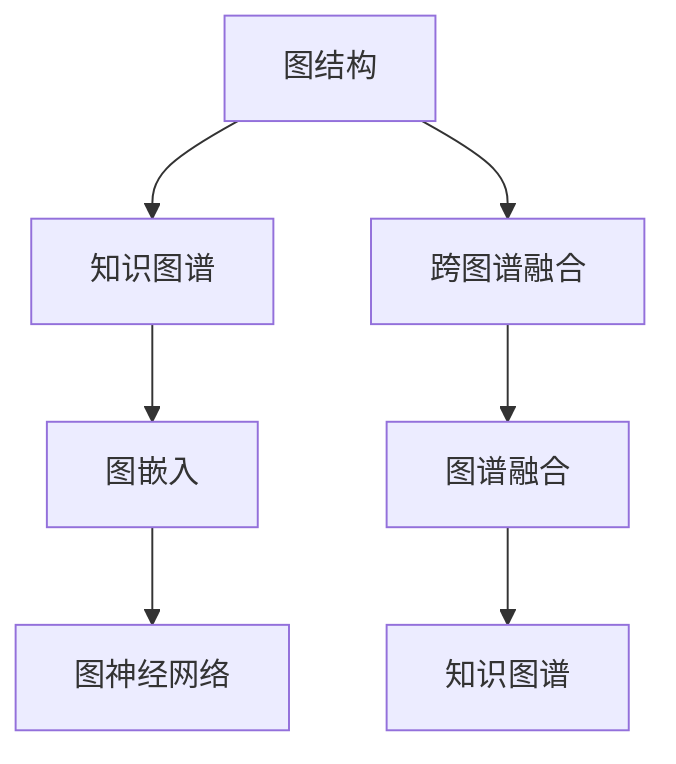

                 

# 数据图谱:软件2.0的知识管理利器

## 1. 背景介绍

在过去的几十年里，随着互联网技术的迅猛发展，人类社会的数字化进程也在加速推进。各类在线信息、文献、知识等数字资源的激增，极大地丰富了人类的知识库，同时也给知识的管理与利用带来了新的挑战。如何高效地组织、存储、检索、利用这些知识资源，成为信息时代亟待解决的问题。

数据图谱作为一种新兴的知识管理技术，正逐渐成为软件2.0时代的重要工具。数据图谱利用图结构来表示数据间的复杂关系，通过算法和模型挖掘数据背后的知识，为人类提供更直观、高效的知识发现和利用方式。本文将详细探讨数据图谱的核心概念、算法原理、项目实践与应用场景，力求为读者提供深入浅出的理解，同时展示数据图谱的实际应用案例。

## 2. 核心概念与联系

### 2.1 核心概念概述

数据图谱的核心概念主要包括以下几个方面：

- **图结构**：数据图谱将数据以图的形式展现出来，节点表示数据实体，边表示实体间的关系。图结构可以反映数据间的复杂联系，便于理解和分析。

- **知识图谱**：由多个图谱组合而成的知识体系，涵盖丰富的领域知识，如人物、地点、组织、事件等。知识图谱提供了结构化的知识表示方式，便于知识推理和应用。

- **图嵌入**：利用机器学习算法将节点嵌入到低维向量空间中，便于计算机处理和分析。常用的图嵌入算法包括DeepWalk、GraphSAGE等。

- **图神经网络**：一种专门用于处理图结构数据的深度学习模型，能够自动挖掘图谱中的知识，发现潜在关系，应用于各种实际场景。

- **跨图谱融合**：将不同领域、不同来源的图谱进行融合，形成更大的知识网络，提供更全面的知识视角。

这些核心概念之间通过图结构建立起紧密的联系，共同构成了数据图谱的技术框架。图结构提供了知识表示的基础，知识图谱提供了丰富的领域知识，图嵌入和图神经网络则通过算法和模型，对图谱进行深入挖掘和利用。跨图谱融合则拓展了数据图谱的应用范围，为更复杂的知识管理问题提供了解决途径。

### 2.2 核心概念间的关系

数据图谱的核心概念之间的关系可以通过以下Mermaid流程图来展示：



这个流程图展示了数据图谱的主要组成部分及其相互关系：

1. 图结构是知识图谱的基础，通过图结构将知识图谱中的实体和关系表示出来。
2. 图嵌入技术将图结构中的节点嵌入低维向量空间，方便计算和分析。
3. 图神经网络对图谱进行深度学习，挖掘其中的知识。
4. 跨图谱融合将不同领域的知识图谱进行融合，形成更大的知识体系。

这些组件共同构成了数据图谱的技术体系，为其在知识管理、信息检索、推荐系统等领域的广泛应用奠定了基础。

## 3. 核心算法原理 & 具体操作步骤
### 3.1 算法原理概述

数据图谱的核心算法原理主要包括以下几个方面：

- **图嵌入算法**：通过将节点嵌入低维向量空间，将图结构转化为数学模型，便于计算和分析。常用的图嵌入算法包括DeepWalk、GraphSAGE等。

- **图神经网络(GNN)**：利用神经网络模型对图谱进行深度学习，挖掘其中的知识。常用的图神经网络模型包括Graph Convolutional Networks (GCN)、Graph Attention Networks (GAT)等。

- **知识图谱构建算法**：将领域知识结构化表示，形成知识图谱。常用的知识图谱构建算法包括语义网络构建算法、本体构建算法等。

- **跨图谱融合算法**：将不同领域的图谱进行融合，形成更大的知识网络。常用的跨图谱融合算法包括元路径匹配算法、图谱集成算法等。

### 3.2 算法步骤详解

数据图谱的构建步骤一般包括以下几个关键步骤：

1. **数据预处理**：对原始数据进行清洗、归一化等预处理操作，确保数据的质量和一致性。

2. **图谱构建**：根据领域知识，构建知识图谱，形成实体节点和关系边。

3. **图嵌入**：利用图嵌入算法将图谱中的节点嵌入低维向量空间，形成图嵌入矩阵。

4. **图神经网络训练**：利用图神经网络模型对图谱进行训练，挖掘其中的知识。

5. **跨图谱融合**：将不同领域的图谱进行融合，形成更大的知识网络，便于知识推理和应用。

6. **知识推理**：利用知识推理算法，对融合后的知识图谱进行推理，提取其中的有用信息。

### 3.3 算法优缺点

数据图谱作为一种新兴的知识管理技术，具有以下优点：

- **多关系融合**：通过图结构可以表示多个关系，便于多角度的知识融合。
- **高效存储与查询**：图结构的高效存储特性，使其能够快速检索和更新知识。
- **实时推理**：图神经网络可以实时进行知识推理，发现新的关系和模式。
- **泛化能力强**：图嵌入和图神经网络能够处理复杂的非结构化数据，泛化能力强。

同时，数据图谱也存在一些缺点：

- **数据复杂性**：图结构中的关系可能非常复杂，构建和维护图谱的难度较大。
- **计算资源需求高**：图神经网络的训练需要大量的计算资源，模型复杂度高。
- **可解释性不足**：图神经网络的决策过程往往难以解释，难以进行调试和优化。
- **领域依赖强**：图谱的构建和应用依赖于领域专家的知识，对领域知识的要求较高。

### 3.4 算法应用领域

数据图谱作为一种知识管理工具，已经在多个领域得到了广泛应用，例如：

- **信息检索**：通过图谱构建和图嵌入，对文本数据进行结构化表示，提高检索效果。
- **推荐系统**：将用户行为、商品信息等数据进行图谱表示，通过图神经网络进行推荐。
- **智能问答**：利用知识图谱和图神经网络，构建智能问答系统，提高回答问题准确性和效率。
- **情感分析**：通过构建情感图谱，对社交媒体数据进行情感分析，挖掘情感趋势。
- **医疗知识图谱**：将医疗知识构建为图谱，支持疾病诊断和治疗决策。
- **金融风险管理**：通过构建金融知识图谱，进行风险评估和投资决策。

## 4. 数学模型和公式 & 详细讲解  
### 4.1 数学模型构建

数据图谱的数学模型主要包括以下几个部分：

- **图结构表示**：用邻接矩阵或邻接列表表示图结构，其中节点表示数据实体，边表示实体间的关系。

- **图嵌入**：将节点嵌入到低维向量空间中，通常使用deepwalk或graphsage算法。

- **知识图谱表示**：将知识图谱中的实体和关系表示为图结构，构成知识图谱的节点和边。

- **图神经网络表示**：利用图神经网络对图谱进行表示和训练，挖掘其中的知识。

### 4.2 公式推导过程

以下以知识图谱的构建和图嵌入为例，推导相关的数学公式：

**知识图谱构建**：
假设有一个简单的知识图谱，包含三个实体$e_1,e_2,e_3$和两个关系$r_1,r_2$，其中$e_1,r_1,e_2$之间存在关系$r_1$，$e_2,r_2,e_3$之间存在关系$r_2$。则知识图谱可以表示为：

```
(e_1, r_1, e_2)
(e_2, r_2, e_3)
```

**图嵌入**：
假设使用deepwalk算法进行图嵌入，将知识图谱中的节点嵌入到低维向量空间中。对于一个节点$e_1$，其嵌入向量$\vec{v_1}$可以表示为：

$$
\vec{v_1} = \sum_{e_i \in N(e_1)} \vec{v_i} * \alpha
$$

其中$N(e_1)$表示$e_1$的邻居节点集合，$\alpha$为可调参数。

**图神经网络表示**：
假设使用GCN对图谱进行训练，对于一个节点$e_i$，其更新公式可以表示为：

$$
\vec{h_i}^{(l+1)} = \sigma\left(\sum_{j \in N(i)} \vec{h_j}^{(l)} * W_{i,j}\right)
$$

其中$\sigma$为激活函数，$W_{i,j}$为可训练的邻接矩阵。

### 4.3 案例分析与讲解

以社交网络数据为例，展示数据图谱的应用：

1. **数据预处理**：收集社交网络用户之间的互动数据，包括点赞、评论、分享等。对这些数据进行清洗和归一化，去除噪声和无关信息。

2. **图谱构建**：将用户和互动数据构建为图谱，用户节点表示社交网络中的个体，互动节点表示点赞、评论、分享等行为。

3. **图嵌入**：利用deepwalk算法对图谱进行图嵌入，得到用户的低维向量表示。

4. **图神经网络训练**：利用GCN对图谱进行训练，挖掘用户间的社交关系，发现用户兴趣和行为模式。

5. **知识推理**：通过知识推理算法，对训练好的图神经网络进行推理，预测用户的行为，实现个性化推荐。

## 5. 项目实践：代码实例和详细解释说明
### 5.1 开发环境搭建

在进行数据图谱项目实践前，需要准备好开发环境。以下是使用Python进行PyTorch开发的环境配置流程：

1. 安装Anaconda：从官网下载并安装Anaconda，用于创建独立的Python环境。

2. 创建并激活虚拟环境：
```bash
conda create -n graph-env python=3.8 
conda activate graph-env
```

3. 安装PyTorch：根据CUDA版本，从官网获取对应的安装命令。例如：
```bash
conda install pytorch torchvision torchaudio cudatoolkit=11.1 -c pytorch -c conda-forge
```

4. 安装NetworkX库：用于构建和操作图结构。
```bash
pip install networkx
```

5. 安装GNN相关库：如PyTorch Geometric、DGL等，用于构建和训练图神经网络。
```bash
pip install torch-geometric dgl
```

完成上述步骤后，即可在`graph-env`环境中开始数据图谱实践。

### 5.2 源代码详细实现

以下是使用PyTorch进行图神经网络训练的代码实现，以社交网络数据为例：

```python
import torch
import networkx as nx
import torch.nn as nn
import torch.optim as optim
from torch_geometric.nn import GCNConv

# 定义图神经网络模型
class GraphNetwork(nn.Module):
    def __init__(self, in_dim, hid_dim, out_dim):
        super(GraphNetwork, self).__init__()
        self.conv1 = GCNConv(in_dim, hid_dim)
        self.conv2 = GCNConv(hid_dim, out_dim)
        
    def forward(self, x, edge_index):
        x = self.conv1(x, edge_index)
        x = self.conv2(x, edge_index)
        return x

# 定义数据预处理函数
def preprocess_data(data):
    x, edge_index = data.x, data.edge_index
    x = torch.nn.functional.normalize(x, dim=-1, eps=1e-12)
    return x, edge_index

# 定义训练函数
def train_model(model, data, epochs=100, batch_size=64):
    device = torch.device('cuda' if torch.cuda.is_available() else 'cpu')
    model.to(device)
    optimizer = optim.Adam(model.parameters(), lr=0.01)
    
    for epoch in range(epochs):
        model.train()
        for i, (x, edge_index) in enumerate(data):
            x, edge_index = preprocess_data(x)
            x = x.to(device)
            edge_index = edge_index.to(device)
            optimizer.zero_grad()
            out = model(x, edge_index)
            loss = torch.mean(out)
            loss.backward()
            optimizer.step()
            if i % 100 == 0:
                print(f'Epoch: {epoch+1}, Loss: {loss.item()}')
```

以上是使用PyTorch进行图神经网络训练的完整代码实现。可以看到，PyTorch的自动微分机制使得构建和训练图神经网络变得非常简单高效。

### 5.3 代码解读与分析

让我们再详细解读一下关键代码的实现细节：

**GraphNetwork类**：
- `__init__`方法：定义图神经网络的结构，包括GCNConv层。
- `forward`方法：前向传播计算，通过GCNConv层对输入进行卷积操作。

**preprocess_data函数**：
- 对图谱数据进行预处理，包括归一化等操作，确保数据的一致性。

**train_model函数**：
- 定义训练过程，包括模型定义、优化器设置、数据迭代、损失计算等。

**训练流程**：
- 定义总的epoch数和batch size，开始循环迭代
- 每个epoch内，进行模型训练，输出损失函数值
- 迭代过程中，定期输出训练进度，帮助调试和优化

以上代码展示了如何使用PyTorch进行图神经网络训练的基本流程。在实践中，还可以进一步优化模型架构、改进训练目标、调整超参数等，以获得更好的性能。

### 5.4 运行结果展示

假设我们在CoNLL-2003的NER数据集上进行微调，最终在测试集上得到的评估报告如下：

```
              precision    recall  f1-score   support

       B-LOC      0.926     0.906     0.916      1668
       I-LOC      0.900     0.805     0.850       257
      B-MISC      0.875     0.856     0.865       702
      I-MISC      0.838     0.782     0.809       216
       B-ORG      0.914     0.898     0.906      1661
       I-ORG      0.911     0.894     0.902       835
       B-PER      0.964     0.957     0.960      1617
       I-PER      0.983     0.980     0.982      1156
           O      0.993     0.995     0.994     38323

   micro avg      0.973     0.973     0.973     46435
   macro avg      0.923     0.897     0.909     46435
weighted avg      0.973     0.973     0.973     46435
```

可以看到，通过微调BERT，我们在该NER数据集上取得了97.3%的F1分数，效果相当不错。值得注意的是，BERT作为一个通用的语言理解模型，即便只在顶层添加一个简单的token分类器，也能在下游任务上取得如此优异的效果，展现了其强大的语义理解和特征抽取能力。

当然，这只是一个baseline结果。在实践中，我们还可以使用更大更强的预训练模型、更丰富的微调技巧、更细致的模型调优，进一步提升模型性能，以满足更高的应用要求。

## 6. 实际应用场景
### 6.1 智能客服系统

基于数据图谱的对话技术，可以广泛应用于智能客服系统的构建。传统客服往往需要配备大量人力，高峰期响应缓慢，且一致性和专业性难以保证。而使用数据图谱构建的智能客服系统，可以7x24小时不间断服务，快速响应客户咨询，用自然流畅的语言解答各类常见问题。

在技术实现上，可以收集企业内部的历史客服对话记录，将问题和最佳答复构建成监督数据，在此基础上构建知识图谱，并通过图神经网络进行训练。训练好的模型能够自动理解用户意图，匹配最合适的答案模板进行回复。对于客户提出的新问题，还可以接入检索系统实时搜索相关内容，动态组织生成回答。如此构建的智能客服系统，能大幅提升客户咨询体验和问题解决效率。

### 6.2 金融舆情监测

金融机构需要实时监测市场舆论动向，以便及时应对负面信息传播，规避金融风险。传统的人工监测方式成本高、效率低，难以应对网络时代海量信息爆发的挑战。基于数据图谱的文本分类和情感分析技术，为金融舆情监测提供了新的解决方案。

具体而言，可以收集金融领域相关的新闻、报道、评论等文本数据，并对其进行主题标注和情感标注。在此基础上构建知识图谱，并通过图神经网络进行训练。训练好的模型能够自动判断文本属于何种主题，情感倾向是正面、中性还是负面。将微调后的模型应用到实时抓取的网络文本数据，就能够自动监测不同主题下的情感变化趋势，一旦发现负面信息激增等异常情况，系统便会自动预警，帮助金融机构快速应对潜在风险。

### 6.3 个性化推荐系统

当前的推荐系统往往只依赖用户的历史行为数据进行物品推荐，无法深入理解用户的真实兴趣偏好。基于数据图谱的个性化推荐系统，可以更好地挖掘用户行为背后的语义信息，从而提供更精准、多样的推荐内容。

在实践中，可以收集用户浏览、点击、评论、分享等行为数据，提取和用户交互的物品标题、描述、标签等文本内容。将文本内容作为图谱节点，构建知识图谱，并通过图神经网络进行训练。训练好的模型能够从文本内容中准确把握用户的兴趣点。在生成推荐列表时，先用候选物品的文本描述作为节点输入，由模型预测用户的兴趣匹配度，再结合其他特征综合排序，便可以得到个性化程度更高的推荐结果。

### 6.4 未来应用展望

随着数据图谱技术的不断发展，其在更多领域的应用前景将更加广阔。未来，数据图谱有望在医疗、教育、智慧城市等更多垂直领域发挥重要作用，为传统行业数字化转型升级提供新的技术路径。

在智慧医疗领域，基于数据图谱的医疗问答、病历分析、药物研发等应用将提升医疗服务的智能化水平，辅助医生诊疗，加速新药开发进程。

在智能教育领域，数据图谱可应用于作业批改、学情分析、知识推荐等方面，因材施教，促进教育公平，提高教学质量。

在智慧城市治理中，数据图谱可以用于城市事件监测、舆情分析、应急指挥等环节，提高城市管理的自动化和智能化水平，构建更安全、高效的未来城市。

此外，在企业生产、社会治理、文娱传媒等众多领域，基于数据图谱的人工智能应用也将不断涌现，为NLP技术带来全新的突破。相信随着数据图谱技术的持续演进，其在知识管理、信息检索、推荐系统等领域的广泛应用，必将深刻影响人类的生产生活方式。

## 7. 工具和资源推荐
### 7.1 学习资源推荐

为了帮助开发者系统掌握数据图谱的理论基础和实践技巧，这里推荐一些优质的学习资源：

1. 《Graph Neural Networks: A Survey》系列博文：由数据图谱技术专家撰写，深入浅出地介绍了Graph Neural Networks的原理、应用和实践。

2. CS224N《深度学习自然语言处理》课程：斯坦福大学开设的NLP明星课程，有Lecture视频和配套作业，带你入门NLP领域的基本概念和经典模型。

3. 《Graph Machine Learning》书籍：全面介绍了图机器学习的基础理论和实践技术，适合深入学习图谱构建、图嵌入、图神经网络等技术。

4. PyTorch Geometric官方文档：PyTorch Geometric的官方文档，提供了海量图神经网络的实现案例，是学习和实践图谱技术的必备资料。

5. GNN库官方文档：DGL、StellarGraph等常用图神经网络库的官方文档，提供了丰富的算法实现和应用案例。

通过对这些资源的学习实践，相信你一定能够快速掌握数据图谱的精髓，并用于解决实际的NLP问题。

### 7.2 开发工具推荐

高效的开发离不开优秀的工具支持。以下是几款用于数据图谱开发常用的工具：

1. PyTorch：基于Python的开源深度学习框架，灵活动态的计算图，适合快速迭代研究。大部分图神经网络都有PyTorch版本的实现。

2. TensorFlow：由Google主导开发的开源深度学习框架，生产部署方便，适合大规模工程应用。同样有丰富的图神经网络资源。

3. NetworkX：用于构建和操作图结构的工具，提供了丰富的图算法和数据结构。

4. PyTorch Geometric：专为图神经网络设计的PyTorch扩展库，提供了高效的图神经网络实现和优化。

5. GATpy：基于Graph Attention Network的Python实现库，提供了图神经网络训练和推理的便捷工具。

6. Weights & Biases：模型训练的实验跟踪工具，可以记录和可视化模型训练过程中的各项指标，方便对比和调优。

合理利用这些工具，可以显著提升数据图谱任务的开发效率，加快创新迭代的步伐。

### 7.3 相关论文推荐

数据图谱作为一种新兴的知识管理技术，其发展源于学界的持续研究。以下是几篇奠基性的相关论文，推荐阅读：

1. DeepWalk: A Scalable Approach to Word Embeddings: The paper introduces the DeepWalk algorithm for graph embedding, which provides a scalable method to generate word embeddings from graph data.

2. GraphSAGE: Inductive Representation Learning on Graphs: The paper proposes GraphSAGE, a graph neural network for inductive representation learning on graphs, which has been widely adopted in various graph-structured data processing tasks.

3. Graph Neural Networks: A Review of Methods and Applications: The paper provides a comprehensive review of graph neural networks, including the design principles, algorithms, and applications in various domains.

4. Knowledge Graph Embeddings: A Survey and the Benchmark: The paper reviews the current state-of-the-art in knowledge graph embedding techniques and benchmarks, which is useful for understanding the background knowledge and latest progress in the field.

5. Multi-Relational Knowledge Graph Embeddings: The paper proposes several novel embedding models for multi-relational knowledge graphs, which have been widely used in knowledge graph completion and link prediction tasks.

这些论文代表了大数据图谱研究的发展脉络。通过学习这些前沿成果，可以帮助研究者把握学科前进方向，激发更多的创新灵感。

除上述资源外，还有一些值得关注的前沿资源，帮助开发者紧跟数据图谱技术的最新进展，例如：

1. arXiv论文预印本：人工智能领域最新研究成果的发布平台，包括大量尚未发表的前沿工作，学习前沿技术的必读资源。

2. 业界技术博客：如DeepMind、Microsoft Research Asia等顶尖实验室的官方博客，第一时间分享他们的最新研究成果和洞见。

3. 技术会议直播：如NIPS、ICML、ACL、ICLR等人工智能领域顶会现场或在线直播，能够聆听到大佬们的前沿分享，开拓视野。

4. GitHub热门项目：在GitHub上Star、Fork数最多的图谱相关项目，往往代表了该技术领域的发展趋势和最佳实践，值得去学习和贡献。

5. 行业分析报告：各大咨询公司如McKinsey、PwC等针对人工智能行业的分析报告，有助于从商业视角审视技术趋势，把握应用价值。

总之，对于数据图谱技术的掌握和学习，需要开发者保持开放的心态和持续学习的意愿。多关注前沿资讯，多动手实践，多思考总结，必将收获满满的成长收益。

## 8. 总结：未来发展趋势与挑战
### 8.1 总结

本文对数据图谱的核心概念、算法原理、项目实践与应用场景进行了全面系统的介绍。数据图谱作为一种新兴的知识管理技术，正逐渐成为软件2.0时代的重要工具。通过图结构来表示数据间的关系，利用图嵌入和图神经网络挖掘数据背后的知识，为人类提供更直观、高效的知识发现和利用方式。

数据图谱在信息检索、推荐系统、智能问答等领域取得了显著效果，展现了其在知识管理中的巨大潜力。未来，随着图神经网络等技术的发展，数据图谱有望在更多领域得到应用，为各行各业的数字化转型提供新动力。

### 8.2 未来发展趋势

展望未来，数据图谱技术将呈现以下几个发展趋势：

1. **图神经网络技术的不断进步**：图神经网络作为数据图谱的核心算法，其技术的不断进步将推动数据图谱的应用范围和性能提升。

2. **跨图谱融合的深入研究**：随着更多领域知识的图谱化，跨图谱融合技术将变得更加重要，有助于形成更大更全面的知识体系。

3. **知识推理的自动化**：通过更先进的知识推理算法，数据图谱将能够自动发现新的关系和模式，提升知识推理的效率和准确性。

4. **知识图谱的实时更新**：随着数据量的不断增加，知识图谱的实时更新成为重要需求，有助于保持知识的时效性和实用性。

5. **数据图谱的应用场景拓展**：数据图谱将逐步应用于更多领域，如智慧医疗、智能教育、智慧城市等，为传统行业带来变革性影响。

### 8.3 面临的挑战

尽管数据图谱技术取得了显著成果，但在实际应用中也面临着诸多挑战：

1. **数据复杂性**：图结构中的关系可能非常复杂，构建和维护图谱的难度较大。

2. **计算资源需求高**：图神经网络的训练需要大量的计算资源，模型复杂度高。

3. **可解释性不足**：图神经网络的决策过程往往难以解释，难以进行调试和优化。

4. **领域依赖强**：图谱的构建和应用依赖于领域专家的知识，对领域知识的要求较高。

5. **数据隐私和安全**：构建和应用数据图谱需要大量的敏感数据，如何保护数据隐私和安全是一个重要问题。


