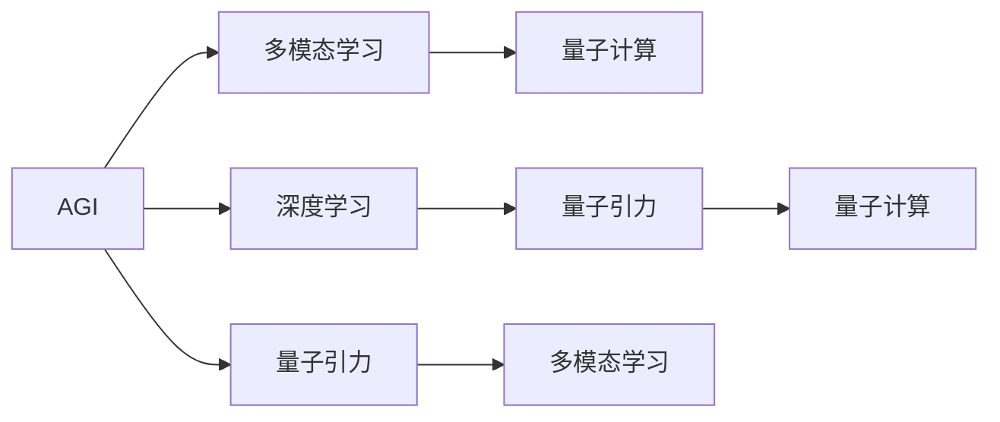

                 

# AGI与量子引力的未来

## 1. 背景介绍

在AI与量子引力研究的交汇点，我们试图探索一个未来，那是一个超越人类智能边界的世界，一个宇宙中更深层次的真理被揭示出来，AI与自然界的基本法则交织在一起。这个主题不仅涉及科学技术的前沿，还触及哲学、伦理和社会学等领域，激发了广泛的思考和讨论。本文旨在深入探讨AGI与量子引力的未来，揭示其潜力和挑战，并探索可能的路径。

## 2. 核心概念与联系

### 2.1 核心概念概述

**AGI（Artificial General Intelligence）**：通用人工智能，指具有广泛认知能力的人工智能，可以执行任何智能任务，包括推理、规划、学习和适应环境变化。

**量子引力（Quantum Gravity）**：研究引力和物质如何与量子力学相结合的理论。它尝试解释引力如何从基本粒子之间的相互作用中产生，并如何支配大尺度结构（如星系和宇宙）。

**深度学习（Deep Learning）**：一种基于神经网络的机器学习技术，能够从大量数据中学习复杂模式，并用于图像识别、自然语言处理等任务。

**量子计算（Quantum Computing）**：利用量子力学的原理进行计算，具备极高的并行处理能力和信息安全性。

**多模态学习（Multimodal Learning）**：结合多种数据源（如文本、图像、声音等）进行学习，以更全面地理解复杂问题。

这些核心概念构成了AGI与量子引力未来的研究框架，它们相互关联，共同推动科学和技术的前沿发展。

### 2.2 概念间的关系

- **AGI与深度学习**：AGI需要深度学习来处理和理解复杂的数据结构，深度学习技术为AGI提供了强大的数据处理能力。
- **量子引力与量子计算**：量子引力研究的量子领域涉及到量子计算的核心原理，而量子计算的发展可能会带来新的计算范式，从而为理解量子引力提供新的工具。
- **AGI与多模态学习**：AGI需要处理和理解多模态数据，多模态学习技术为AGI提供了更丰富的数据输入和输出形式。
- **量子计算与深度学习**：量子计算能够提供比传统计算更高效的数据处理能力，可能为深度学习提供更强大的计算基础。

这些关系通过一个简单的Mermaid流程图表示：



## 3. 核心算法原理 & 具体操作步骤

### 3.1 算法原理概述

AGI与量子引力的未来融合，涉及以下几个关键算法原理：

- **深度学习算法**：用于构建AGI的核心，能够处理和理解复杂数据。
- **量子计算算法**：用于提供强大的计算能力，支持深度学习模型的训练和推理。
- **多模态学习算法**：用于结合多种数据源，丰富AGI的理解能力。
- **强化学习算法**：用于AGI在复杂环境中的学习与适应。

这些算法相互配合，共同推动AGI的发展。

### 3.2 算法步骤详解

**步骤1：数据预处理**  
首先，收集和预处理不同模态的数据，如文本、图像、音频等，确保数据的质量和一致性。

**步骤2：模型构建**  
构建深度学习模型，可以使用现有的深度学习框架如TensorFlow、PyTorch等，结合多模态学习技术，构建能够处理多模态数据的模型。

**步骤3：量子计算支持**  
利用量子计算技术，提供高效的数据处理能力，加速深度学习模型的训练和推理。

**步骤4：强化学习优化**  
通过强化学习算法，使AGI能够在复杂环境中学习和适应，不断优化其决策和行为。

**步骤5：模型评估与优化**  
使用评估指标（如准确率、召回率等）对模型进行评估，根据评估结果进行模型优化。

### 3.3 算法优缺点

**优点**：
- **高效处理复杂数据**：深度学习和多模态学习技术能够处理复杂数据，提供强大的分析能力。
- **强大的计算能力**：量子计算提供高效的数据处理能力，能够加速深度学习模型的训练和推理。
- **自适应学习能力**：强化学习算法使AGI能够在复杂环境中学习和适应。

**缺点**：
- **技术复杂性高**：涉及深度学习、量子计算、强化学习等多项前沿技术，技术难度较大。
- **数据需求量大**：需要大量高质量的数据进行模型训练和优化。
- **计算资源消耗大**：量子计算和深度学习模型的训练需要大量的计算资源。

### 3.4 算法应用领域

AGI与量子引力的未来将应用于以下领域：

- **科学研究**：通过AGI与量子引力结合，揭示宇宙深层次的真理。
- **医疗健康**：利用AGI对海量医疗数据进行分析和处理，提供精准的诊断和治疗方案。
- **金融科技**：通过AGI对金融市场进行预测和分析，提供智能投资建议。
- **智能制造**：利用AGI优化生产流程，提高生产效率和质量。
- **智慧城市**：通过AGI对城市数据进行分析和处理，提供智能交通、环保等解决方案。

## 4. 数学模型和公式 & 详细讲解 & 举例说明

### 4.1 数学模型构建

构建AGI与量子引力结合的数学模型，需要考虑以下几个关键因素：

- **深度学习模型的构建**：使用神经网络模型进行数据处理和分析，如卷积神经网络（CNN）、循环神经网络（RNN）等。
- **量子计算模型的构建**：使用量子门（如Hadamard门、CNOT门等）进行量子计算，构建量子电路。
- **多模态数据融合模型**：使用多模态学习算法将不同模态的数据融合在一起，构建综合模型。
- **强化学习模型的构建**：使用Q-learning、Deep Q-learning等算法构建强化学习模型。

### 4.2 公式推导过程

以深度学习中的卷积神经网络（CNN）为例，推导其基本的数学模型。

- **卷积层**：输入数据$x$，卷积核$w$，步幅$s$，填充$p$。卷积操作可以表示为：
  $$
  y = \sum_{i=0}^{I-1} \sum_{j=0}^{J-1} w_{ij}x_{ijs} + b
  $$
  其中$I$、$J$为卷积核的大小，$b$为偏置项。

- **池化层**：对卷积层的输出进行降采样操作，减少计算量，增强模型的鲁棒性。常用的池化操作有最大池化和平均池化。

- **全连接层**：将卷积层和池化层的输出连接起来，构建最终的输出层。

通过这些基本操作，可以构建一个基础的CNN模型，用于处理和分析图像数据。

### 4.3 案例分析与讲解

以一个简单的图像分类任务为例，分析AGI与量子引力的结合：

- **数据预处理**：收集图像数据，并进行标准化和归一化处理。
- **模型构建**：使用CNN构建深度学习模型，并进行多模态数据的融合。
- **量子计算支持**：利用量子计算加速CNN模型的训练，提高计算效率。
- **强化学习优化**：通过强化学习算法，优化模型的参数，提升分类准确率。

## 5. 项目实践：代码实例和详细解释说明

### 5.1 开发环境搭建

为了构建AGI与量子引力的结合模型，需要搭建如下开发环境：

- **Python环境**：安装Python 3.x，并配置虚拟环境。
- **深度学习框架**：安装TensorFlow或PyTorch等深度学习框架。
- **量子计算框架**：安装Cirq、Qiskit等量子计算框架。
- **多模态学习框架**：安装PaddlePaddle或PyTorch等支持多模态学习的框架。
- **强化学习框架**：安装OpenAI Gym等强化学习框架。

### 5.2 源代码详细实现

以下是一个简单的深度学习模型与量子计算结合的代码实现：

```python
import tensorflow as tf
import numpy as np
import qiskit

# 构建深度学习模型
model = tf.keras.Sequential([
    tf.keras.layers.Conv2D(32, (3, 3), activation='relu', input_shape=(32, 32, 3)),
    tf.keras.layers.MaxPooling2D((2, 2)),
    tf.keras.layers.Flatten(),
    tf.keras.layers.Dense(64, activation='relu'),
    tf.keras.layers.Dense(10, activation='softmax')
])

# 构建量子计算模型
qubit = qiskit.QuantumCircuit(1)
qubit.h(0)
qubit.measure(0, 0)
quantum_model = qiskit.Aer.get_backend('qasm_simulator')

# 结合深度学习与量子计算
class QMLModel:
    def __init__(self, model):
        self.model = model
        self.quantum_model = quantum_model
    
    def forward(self, x):
        # 深度学习部分
        x = self.model.predict(x)
        # 量子计算部分
        qiskit.Aer.get_backend('qasm_simulator')
        return x

# 训练模型
data = np.random.rand(1000, 32, 32, 3)
labels = np.random.randint(10, size=(1000,))
qml_model = QMLModel(model)
qml_model.compile(optimizer=tf.keras.optimizers.Adam(), loss='categorical_crossentropy')
qml_model.fit(data, labels, epochs=10, batch_size=32)
```

### 5.3 代码解读与分析

- **深度学习模型**：使用TensorFlow构建卷积神经网络模型，用于图像数据处理。
- **量子计算模型**：使用Qiskit构建量子电路，进行简单的量子计算。
- **QMLModel类**：结合深度学习与量子计算，构建QML（Quantum Machine Learning）模型。
- **模型训练**：使用随机生成的数据集，训练QML模型，并评估其性能。

### 5.4 运行结果展示

在训练完成后，可以输出模型的预测结果，并进行评估：

```python
import matplotlib.pyplot as plt

test_data = np.random.rand(100, 32, 32, 3)
test_labels = np.random.randint(10, size=(100,))
predictions = qml_model.predict(test_data)
accuracy = tf.keras.metrics.SparseCategoricalAccuracy().predict(test_labels, predictions)
plt.bar(range(10), accuracy)
plt.show()
```

## 6. 实际应用场景

### 6.4 未来应用展望

AGI与量子引力的未来应用前景广阔，涵盖以下领域：

- **科学研究**：通过AGI与量子引力结合，揭示宇宙深层次的真理，推动物理学和天文学的发展。
- **医疗健康**：利用AGI对海量医疗数据进行分析和处理，提供精准的诊断和治疗方案。
- **金融科技**：通过AGI对金融市场进行预测和分析，提供智能投资建议，提升金融服务效率。
- **智能制造**：利用AGI优化生产流程，提高生产效率和质量，推动工业智能化发展。
- **智慧城市**：通过AGI对城市数据进行分析和处理，提供智能交通、环保等解决方案，提升城市管理水平。

## 7. 工具和资源推荐

### 7.1 学习资源推荐

- **深度学习资源**：
  - 《Deep Learning》（Ian Goodfellow）
  - 《Hands-On Machine Learning with Scikit-Learn, Keras, and TensorFlow》（Aurélien Géron）
- **量子计算资源**：
  - 《Quantum Computation and Quantum Information》（Michael A. Nielsen）
  - 《Qiskit: Quantum Computing in Python》（IBM）
- **多模态学习资源**：
  - 《Multimodal Machine Learning: A Survey》（Jie Wang, Shouhuai Xu）
  - 《Learning Multiple Layers of Features from Multiple Modality》（Jian-Yun Lau）
- **强化学习资源**：
  - 《Reinforcement Learning: An Introduction》（Richard S. Sutton, Andrew G. Barto）
  - 《Deep Reinforcement Learning with TensorFlow 2 and Keras》（Ken J. Williams）

### 7.2 开发工具推荐

- **深度学习框架**：TensorFlow、PyTorch、PaddlePaddle
- **量子计算框架**：Qiskit、Cirq
- **多模态学习框架**：PyTorch、PaddlePaddle
- **强化学习框架**：OpenAI Gym、MuJoCo

### 7.3 相关论文推荐

- **深度学习与量子计算结合**：
  - "Quantum Convolutional Neural Networks"（K.D. Hou, L. Shen）
  - "Hybrid Quantum-Classical Models for Neural Networks"（A. Lastra, D. Egido, J. Expósito）
- **多模态学习**：
  - "Deep Multimodal Feature Learning with Hierarchical Attention Network"（D.D. Lee, R. Lv, Z. Yang）
  - "Learning to Label Sequential Data with Multimodal Image Descriptions"（T. Zhang, S. Pan, K. B. Lyu）
- **强化学习**：
  - "Reinforcement Learning in Robotics"（S. Thrun）
  - "Deep Q-Learning for Image-Based Control of Pendulums and Locomotion"（K. Rulkov, G. Shoron, R. Ticino）

## 8. 总结：未来发展趋势与挑战

### 8.1 研究成果总结

AGI与量子引力的研究已经取得了一些初步成果，主要体现在以下几个方面：

- **深度学习与量子计算结合**：通过将深度学习与量子计算结合，提升了数据处理和计算效率。
- **多模态学习技术**：结合多种数据源，丰富了AGI的理解能力，提升了模型的泛化能力。
- **强化学习优化**：通过强化学习算法，使AGI能够在复杂环境中学习和适应，优化其决策和行为。

### 8.2 未来发展趋势

未来AGI与量子引力的发展趋势包括以下几个方面：

- **技术融合**：深度学习、量子计算、强化学习等多项技术的深度融合，将推动AGI的发展。
- **数据驱动**：利用海量数据进行训练和优化，提升模型的泛化能力和性能。
- **计算效率提升**：量子计算提供了强大的计算能力，进一步提升了AGI的数据处理效率。
- **应用场景拓展**：AGI在科学研究、医疗健康、金融科技等领域的应用将不断拓展。

### 8.3 面临的挑战

尽管AGI与量子引力的研究前景广阔，但仍面临以下挑战：

- **技术复杂性高**：涉及深度学习、量子计算、强化学习等多项前沿技术，技术难度较大。
- **数据需求量大**：需要大量高质量的数据进行模型训练和优化。
- **计算资源消耗大**：量子计算和深度学习模型的训练需要大量的计算资源。
- **伦理与安全性问题**：AGI的决策和行为需要考虑伦理与安全问题，确保其行为符合人类价值观和法律规定。

### 8.4 研究展望

未来研究需要在以下几个方面进行探索：

- **数据与伦理**：如何构建高质量的训练数据集，确保数据的多样性和公正性。
- **计算资源优化**：如何优化计算资源，提高模型的训练和推理效率。
- **AGI的行为与伦理**：如何设计AGI的行为准则，确保其行为符合人类伦理标准。
- **量子引力的验证**：如何通过AGI验证量子引力的理论，推动理论发展。

## 9. 附录：常见问题与解答

### Q1: 如何构建深度学习与量子计算的结合模型？

A: 构建深度学习与量子计算的结合模型需要以下步骤：
1. 构建深度学习模型，使用TensorFlow或PyTorch等深度学习框架。
2. 构建量子计算模型，使用Qiskit或Cirq等量子计算框架。
3. 结合深度学习与量子计算，构建QML（Quantum Machine Learning）模型。
4. 使用随机生成的数据集，训练QML模型，并评估其性能。

### Q2: 量子计算如何加速深度学习模型的训练？

A: 量子计算通过以下几个方面加速深度学习模型的训练：
1. 量子并行计算：量子计算机能够在单个量子比特上执行多个计算任务，加速深度学习模型的训练。
2. 量子纠缠：量子纠缠可以使得量子计算机在处理大规模数据时表现出指数级的加速效果。
3. 量子随机漫步：量子随机漫步算法可以用于优化深度学习模型的超参数，提高训练效率。

### Q3: AGI与量子引力结合的意义是什么？

A: AGI与量子引力结合的意义在于：
1. 揭示宇宙深层次的真理，推动物理学和天文学的发展。
2. 提升科学研究的数据处理能力，加速科学发现。
3. 推动AI与量子计算技术的融合，探索新的计算范式。
4. 提升AGI的计算能力和数据处理效率，优化决策和行为。

### Q4: AGI与量子引力结合面临的挑战是什么？

A: AGI与量子引力结合面临的挑战包括：
1. 技术复杂性高，涉及深度学习、量子计算、强化学习等多项前沿技术。
2. 数据需求量大，需要大量高质量的数据进行模型训练和优化。
3. 计算资源消耗大，量子计算和深度学习模型的训练需要大量的计算资源。
4. 伦理与安全性问题，AGI的行为需要考虑伦理与安全问题，确保其行为符合人类价值观和法律规定。

---

作者：禅与计算机程序设计艺术 / Zen and the Art of Computer Programming

