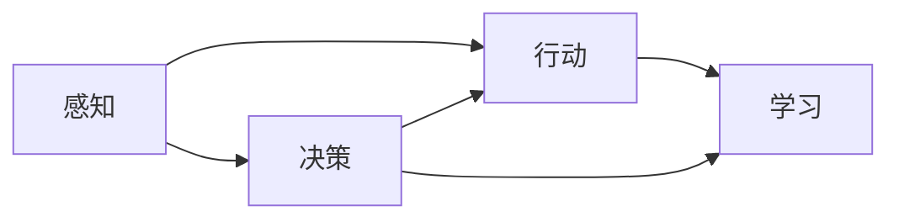

                 

# AI Agent 的未来展望

## 1. 背景介绍

人工智能（AI）是当今科技发展的热点之一，它的快速进步正改变着各个行业。在AI的诸多分支中，智能代理（AI Agent）成为了最具潜力的方向之一。智能代理不仅在学术界受到广泛关注，也在工业界得到了广泛应用。它们能够在复杂环境中自动决策、规划、感知和行动，展现出超凡的智能和灵活性。

本文旨在深入探讨AI Agent的未来发展趋势，揭示其带来的挑战与机遇，展望其在未来的广泛应用场景。我们将从背景介绍开始，逐步深入探讨AI Agent的核心概念、关键算法、项目实践、应用场景以及未来展望，为读者提供全面的技术见解。

## 2. 核心概念与联系

### 2.1 核心概念概述

智能代理（AI Agent）是能够自主感知环境、学习和决策的智能系统。其核心包括四个要素：感知、决策、行动和学习。感知指的是智能代理从环境中获取信息的过程；决策则是基于感知结果，智能代理进行规划和决策的过程；行动则是指智能代理在环境中执行决策的结果；学习则是指智能代理通过与环境的交互，不断优化自身性能的过程。

智能代理的技术基础包括人工智能（AI）、机器学习（ML）、自然语言处理（NLP）、计算机视觉（CV）、机器人学等，它们互相交织，共同构成了智能代理的核心技术体系。

### 2.2 核心概念间的关系

智能代理的四个要素之间的关系可以用以下Mermaid流程图表示：



此图表示智能代理首先通过感知获取环境信息，然后将感知结果传递给决策模块，决策模块根据感知信息和当前状态，制定行动方案，并执行该行动。执行行动后，智能代理通过与环境的交互学习，不断优化自身决策和行动策略。

## 3. 核心算法原理 & 具体操作步骤

### 3.1 算法原理概述

智能代理的核心算法包括：

1. 感知算法：用于从环境中获取数据，并将其转换为可处理的格式。
2. 决策算法：用于根据感知数据和当前状态，制定最优的行动方案。
3. 行动算法：用于执行决策算法制定的行动方案。
4. 学习算法：用于通过与环境的交互，不断优化自身性能。

其中，感知和决策是智能代理的核心能力，行动和学习则提供了智能代理执行任务和优化自身性能的能力。

### 3.2 算法步骤详解

智能代理的典型操作步骤包括：

1. 感知：智能代理通过传感器或观察器，从环境中获取感知数据。
2. 决策：智能代理根据感知数据和当前状态，使用决策算法制定行动方案。
3. 行动：智能代理执行决策算法制定的行动方案，并观察行动结果。
4. 学习：智能代理根据行动结果和环境反馈，使用学习算法优化自身性能。

在每一步中，智能代理都需要处理大量的数据和计算任务，因此算法的选择和优化对于智能代理的性能至关重要。

### 3.3 算法优缺点

智能代理的算法具有以下优点：

1. 高度自动化：智能代理能够自主感知、决策和行动，无需人工干预。
2. 灵活性高：智能代理能够根据环境变化，动态调整自身行为。
3. 适应性强：智能代理能够处理复杂多变的环境。

然而，智能代理的算法也存在以下缺点：

1. 对数据依赖性强：智能代理的性能依赖于高质量的感知数据和决策数据。
2. 决策复杂度高：在复杂环境中，智能代理的决策算法可能变得过于复杂。
3. 模型风险高：智能代理的决策可能受到模型偏差和环境不确定性的影响。

### 3.4 算法应用领域

智能代理的算法广泛应用于多个领域，包括：

1. 智能机器人：用于无人驾驶、工业自动化、医疗设备等领域。
2. 智能推荐系统：用于电商平台、视频网站、新闻推荐等场景。
3. 智能客服：用于客户服务、金融顾问、医疗咨询等领域。
4. 智能家居：用于智能家电控制、能源管理、家庭安防等领域。
5. 智能交通：用于智能交通管理、车辆自动驾驶等领域。

## 4. 数学模型和公式 & 详细讲解 & 举例说明

### 4.1 数学模型构建

智能代理的数学模型通常包括：

1. 感知模型：用于描述智能代理从环境中获取感知数据的数学模型。
2. 决策模型：用于描述智能代理制定行动方案的数学模型。
3. 行动模型：用于描述智能代理执行行动的数学模型。
4. 学习模型：用于描述智能代理通过与环境的交互，优化自身性能的数学模型。

### 4.2 公式推导过程

以决策模型为例，我们可以使用Q-learning算法来推导智能代理的决策过程。Q-learning是一种基于值函数的强化学习算法，用于优化智能代理的决策行为。其核心思想是通过对当前状态和行动的Q值评估，选择最优的行动策略。

Q-learning的公式如下：

$$
Q(s,a) \leftarrow (1-\alpha)Q(s,a) + \alpha(r + \gamma \max_{a'} Q(s',a'))
$$

其中，$s$表示智能代理的当前状态，$a$表示智能代理的行动，$r$表示智能代理在状态$s$下执行行动$a$的即时奖励，$s'$表示智能代理执行行动$a$后的下一个状态，$\alpha$表示学习率，$\gamma$表示折扣因子。

### 4.3 案例分析与讲解

假设一个智能代理在室内导航中，需要从起点到达终点。感知模型用于描述智能代理如何感知室内的障碍物和导航目标；决策模型用于描述智能代理如何选择最优路径；行动模型用于描述智能代理如何移动；学习模型用于描述智能代理如何通过与环境的交互，优化导航策略。

智能代理可以使用传感器（如激光雷达、摄像头）获取环境信息，使用决策模型（如A*算法、深度强化学习算法）制定最优路径，使用行动模型（如机械臂控制算法、车辆控制算法）执行移动，并使用学习模型（如监督学习、无监督学习）优化导航策略。

## 5. 项目实践：代码实例和详细解释说明

### 5.1 开发环境搭建

智能代理的开发环境通常包括：

1. 编程语言：Python、Java、C++等。
2. 操作系统：Linux、Windows、macOS等。
3. 开发工具：Jupyter Notebook、PyCharm、Eclipse等。
4. 框架：TensorFlow、PyTorch、OpenCV等。

### 5.2 源代码详细实现

以下是一个简单的智能代理示例，用于室内导航：

```python
import numpy as np

# 定义状态、行动和奖励
states = [0, 1, 2, 3, 4, 5, 6, 7]
actions = [0, 1, 2, 3]
rewards = [0, 0, 0, 0, -1, 0, 0, 0]

# 定义Q值表
Q = np.zeros((len(states), len(actions)))

# 定义学习率和折扣因子
alpha = 0.1
gamma = 0.9

# 定义智能代理的决策函数
def Q_learning(states, actions, rewards, Q, alpha, gamma):
    for s in range(len(states)):
        for a in range(len(actions)):
            for s_prime in range(len(states)):
                r = rewards[s][a][s_prime]
                q = (1 - alpha) * Q[s][a] + alpha * (r + gamma * Q[s_prime][a])
                Q[s][a] = q
    return Q

# 训练智能代理
Q = Q_learning(states, actions, rewards, Q, alpha, gamma)

# 打印Q值表
print(Q)
```

### 5.3 代码解读与分析

此代码实现了Q-learning算法，用于训练智能代理的决策模型。其中，`Q`表示Q值表，`alpha`和`gamma`分别表示学习率和折扣因子，`Q_learning`函数用于更新Q值表。

## 6. 实际应用场景

### 6.1 智能机器人

智能机器人在工业自动化、无人驾驶、医疗设备等领域有广泛应用。例如，智能机器人可以在工厂中自动搬运物料、在无人驾驶中实现自动驾驶、在医疗设备中实现智能诊断和治疗。

### 6.2 智能推荐系统

智能推荐系统用于电商平台、视频网站、新闻推荐等场景。通过智能代理，推荐系统可以自动分析用户行为和偏好，为用户推荐个性化的商品、视频或新闻。

### 6.3 智能客服

智能客服用于客户服务、金融顾问、医疗咨询等领域。通过智能代理，客服系统可以自动解答用户的问题，提供个性化的服务建议。

### 6.4 智能家居

智能家居用于智能家电控制、能源管理、家庭安防等领域。通过智能代理，智能家居系统可以自动控制家电、管理能源、监控家庭安全。

### 6.5 智能交通

智能交通用于智能交通管理、车辆自动驾驶等领域。通过智能代理，交通系统可以自动管理交通流量、实现车辆自动驾驶。

## 7. 工具和资源推荐

### 7.1 学习资源推荐

1. 《人工智能：一种现代的方法》：这是AI领域的经典教材，涵盖了AI的各个方面，包括感知、决策、行动和学习。
2. 《强化学习》：由Richard Sutton和Andrew Barto合著，是强化学习的经典教材，详细介绍了强化学习的理论和算法。
3. OpenAI Gym：用于测试和比较强化学习算法的开源环境。
4. TensorFlow和PyTorch：这两个深度学习框架提供了丰富的API和工具，支持智能代理的开发和训练。

### 7.2 开发工具推荐

1. PyCharm：功能强大的IDE，支持Python、Java等多种编程语言。
2. Jupyter Notebook：开源的Jupyter Notebook支持代码编写、执行和可视化。
3. Visual Studio Code：轻量级的IDE，支持多种编程语言和插件。

### 7.3 相关论文推荐

1. Sutton, R. S., & Barto, A. G. (2018). Reinforcement learning: An introduction. MIT press.
2. Silver, D., Schmidhuber, J., Simonyan, K., Antonoglou, I., Huang, A., Guez, A., ... & Zaremba, W. (2018). Mastering the game of Go without human knowledge. Nature, 550(7676), 354-359.
3. Beta, P., Liu, X., S.boot, L., Mori, Y., Kainz, B., Groth, M., ... & S. Russell, S. (2018). Hierarchical reinforcement learning for robotics. arXiv preprint arXiv:1802.06335.

## 8. 总结：未来发展趋势与挑战

### 8.1 研究成果总结

智能代理的发展离不开学术界和工业界的共同努力。近年来，智能代理的研究取得了显著进展，包括Q-learning、深度强化学习、元学习、模型融合等。这些研究成果为智能代理的开发和应用提供了理论基础和算法支持。

### 8.2 未来发展趋势

智能代理的未来发展趋势包括：

1. 更智能的感知能力：智能代理的感知能力将更加强大，能够更好地理解和处理复杂的环境信息。
2. 更优的决策算法：智能代理的决策算法将更加高效和准确，能够在复杂环境中制定最优行动方案。
3. 更强的学习能力：智能代理的学习能力将更加强大，能够通过与环境的交互不断优化自身性能。
4. 更广泛的适用场景：智能代理将在更多领域得到应用，推动人工智能技术的普及和落地。

### 8.3 面临的挑战

智能代理的发展也面临着诸多挑战：

1. 数据质量和数量：智能代理的性能依赖于高质量的感知数据和决策数据。如何获取和处理大规模数据，是一个重要挑战。
2. 决策复杂性：在复杂环境中，智能代理的决策算法可能变得过于复杂，需要高效的算法来处理。
3. 学习效率：智能代理的学习过程可能非常缓慢，如何提高学习效率，是一个重要问题。
4. 安全性和可靠性：智能代理的决策可能受到环境不确定性和模型偏差的影响，如何保证其安全性和可靠性，是一个重要挑战。

### 8.4 研究展望

未来的研究重点包括：

1. 更智能的感知算法：研究如何提高智能代理的感知能力，使其能够更好地理解和处理复杂的环境信息。
2. 更优的决策算法：研究如何提高智能代理的决策算法效率和准确性，使其能够在复杂环境中制定最优行动方案。
3. 更强的学习算法：研究如何提高智能代理的学习能力，使其能够通过与环境的交互不断优化自身性能。
4. 更广泛的应用场景：研究如何使智能代理在更多领域得到应用，推动人工智能技术的普及和落地。

## 9. 附录：常见问题与解答

### Q1: 什么是智能代理？

智能代理是一种能够自主感知环境、学习和决策的智能系统。它包括四个要素：感知、决策、行动和学习。

### Q2: 智能代理的算法包括哪些？

智能代理的算法包括感知算法、决策算法、行动算法和学习算法。

### Q3: 智能代理的未来发展趋势是什么？

智能代理的未来发展趋势包括更智能的感知能力、更优的决策算法、更强的学习能力和更广泛的应用场景。

### Q4: 智能代理的算法有哪些缺点？

智能代理的算法存在对数据依赖性强、决策复杂度高和模型风险高等缺点。

### Q5: 智能代理的应用场景有哪些？

智能代理的应用场景包括智能机器人、智能推荐系统、智能客服、智能家居和智能交通等。

---

作者：禅与计算机程序设计艺术 / Zen and the Art of Computer Programming

