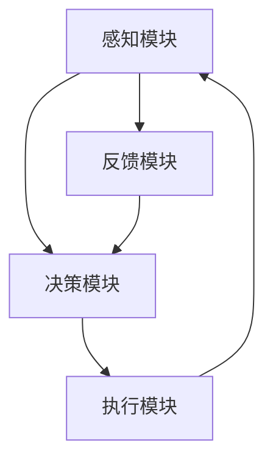
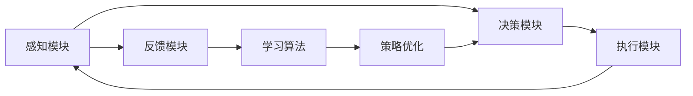
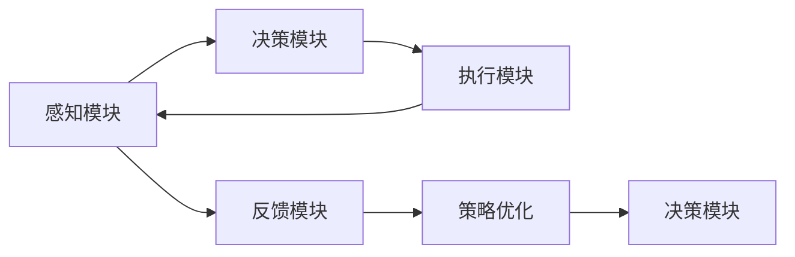
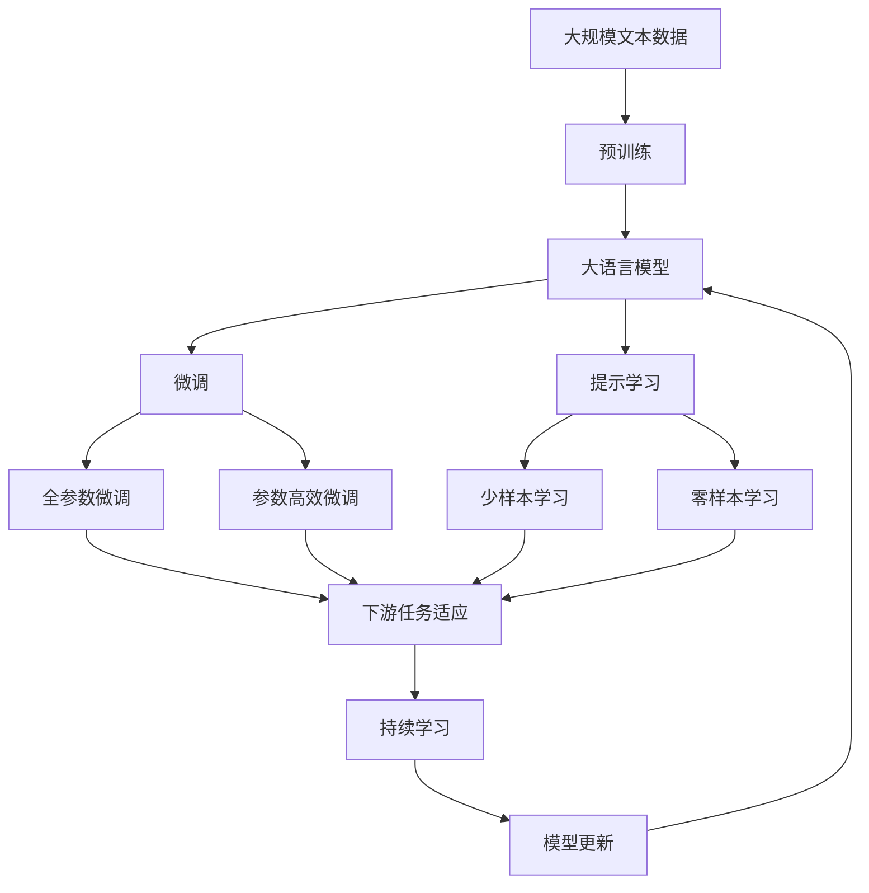

                 

# AI Agent: AI的下一个风口 实验背景与目的

> 关键词：AI Agent, AI, 人工智能, 实验, 背景, 目的, 智能决策, 自动化, 机器人, 应用场景, 未来展望

## 1. 背景介绍

### 1.1 问题由来

随着人工智能技术的不断进步，AI的应用领域也在不断扩大，从简单的图像识别、语音识别，到复杂的自然语言处理、智能推荐系统，AI的应用已经渗透到人们生活的方方面面。然而，尽管如此，AI在执行复杂任务，如自主决策、策略制定等方面仍然存在很大局限。传统的基于规则的AI系统虽然能解决特定任务，但需要大量人工设计和维护，成本高、灵活性差。

AI Agent作为AI技术的进一步演进，旨在构建能够自主学习、自主决策的智能系统。通过模仿人类或动物的行为，AI Agent可以在复杂的现实世界中执行高自由度的任务，适应不确定环境，并主动获取反馈进行学习优化，最终达到自主决策、自主执行的目的。

### 1.2 问题核心关键点

AI Agent的核心思想是将智能体与环境交互的过程进行建模，使AI能够自主学习和决策。具体来说，它包括几个关键要素：

- **感知模块**：用于接收和处理环境信息，是智能体与环境交互的入口。
- **决策模块**：用于基于感知信息，利用学习算法进行策略制定和行为选择。
- **执行模块**：将决策转化为具体行为，执行在环境中。
- **反馈模块**：获取环境对行为的响应，并将其反馈给感知和决策模块进行下一步学习。

### 1.3 问题研究意义

研究AI Agent，对于拓展AI的应用场景，提升AI系统的自主性和适应性，推动AI技术的产业化进程，具有重要意义：

1. **降低应用开发成本**：通过AI Agent自主学习和决策，可以显著减少从头开发所需的数据、计算和人力等成本投入。
2. **提升系统性能**：AI Agent能够主动学习环境反馈，及时调整策略，适应新环境变化，性能往往优于基于规则的系统。
3. **加速开发进度**：AI Agent可以自主探索和学习，快速适应新任务，缩短开发周期。
4. **带来技术创新**：AI Agent的自主学习范式促进了对AI系统学习和优化方法的深入研究，催生了许多新的研究方向。
5. **赋能产业升级**：AI Agent的应用使得AI技术更容易被各行各业所采用，为传统行业数字化转型升级提供新的技术路径。

## 2. 核心概念与联系

### 2.1 核心概念概述

为更好地理解AI Agent的构建与运作，本节将介绍几个密切相关的核心概念：

- **智能体(Agent)**：能够在环境中自主行动的实体，通过与环境的交互，实现特定目标。智能体可以简单至一个简单的决策器，也可以复杂至包含感知、决策、执行等多个模块的复杂系统。
- **感知模块(Sensor)**：智能体与环境交互的入口，用于感知环境信息，通常包括视觉、听觉、触觉等传感器。
- **决策模块(Decision Maker)**：基于感知模块获取的信息，利用学习算法进行策略制定和行为选择，是智能体的核心组件。
- **执行模块(Actuator)**：将决策模块的输出转化为具体行为，执行在环境中，如机器臂的运动、语音的生成等。
- **反馈模块(Feedback Loop)**：获取环境对行为的响应，并将其反馈给感知和决策模块进行下一步学习，实现自适应和自主决策。

这些核心概念之间的逻辑关系可以通过以下Mermaid流程图来展示：



这个流程图展示了AI Agent的核心组件和工作流程：

1. 感知模块获取环境信息。
2. 决策模块根据感知信息，制定行为策略。
3. 执行模块将策略转化为具体行为。
4. 反馈模块获取环境响应，返回感知模块进行下一步学习。

### 2.2 概念间的关系

这些核心概念之间存在着紧密的联系，形成了AI Agent的完整生态系统。下面我通过几个Mermaid流程图来展示这些概念之间的关系。

#### 2.2.1 AI Agent的学习范式



这个流程图展示了AI Agent的学习过程，其中学习算法是关键。通过感知模块获取环境信息，决策模块制定行为策略，执行模块将策略转化为具体行为，反馈模块获取环境响应，学习算法根据反馈信息进行策略优化，不断提升决策质量。

#### 2.2.2 反馈循环与策略优化



这个流程图展示了AI Agent的反馈循环和策略优化过程。感知模块获取环境信息，决策模块制定行为策略，执行模块将策略转化为具体行为，反馈模块获取环境响应，策略优化模块根据反馈信息进行调整，不断优化决策模块，使其能够更准确地制定策略。

### 2.3 核心概念的整体架构

最后，我们用一个综合的流程图来展示这些核心概念在大语言模型微调过程中的整体架构：



这个综合流程图展示了从预训练到微调，再到持续学习的完整过程。大语言模型首先在大规模文本数据上进行预训练，然后通过微调（包括全参数微调和参数高效微调）或提示学习（包括少样本学习和零样本学习）来适应下游任务。最后，通过持续学习技术，模型可以不断学习新知识，同时避免遗忘旧知识。 通过这些流程图，我们可以更清晰地理解AI Agent的工作原理和优化方向。

## 3. 核心算法原理 & 具体操作步骤
### 3.1 算法原理概述

AI Agent的构建和优化，通常分为感知、决策、执行和反馈四个步骤。下面详细介绍每个步骤的算法原理：

- **感知模块**：通常使用传感器获取环境信息，然后通过数据预处理和特征提取技术，将原始数据转化为可用于决策的数据格式。
- **决策模块**：基于感知数据，利用机器学习算法（如决策树、随机森林、神经网络等）进行策略制定和行为选择。
- **执行模块**：将决策模块的输出转化为具体行为，执行在环境中，通常需要控制器的支持。
- **反馈模块**：通过传感器获取环境对行为的响应，并将其反馈给感知和决策模块进行下一步学习。

### 3.2 算法步骤详解

**Step 1: 感知模块设计**

- 选择适当的传感器，如摄像头、麦克风、雷达等，用于获取环境信息。
- 设计数据预处理和特征提取算法，将传感器数据转化为可用于决策的格式。

**Step 2: 决策模块构建**

- 选择合适的机器学习算法，如决策树、随机森林、神经网络等，用于策略制定和行为选择。
- 设计合适的损失函数，如均方误差、交叉熵等，用于评估模型性能。

**Step 3: 执行模块实现**

- 将决策模块的输出转化为具体行为，执行在环境中。
- 设计控制器，将决策模块的输出转化为实际控制信号。

**Step 4: 反馈模块设计**

- 使用传感器获取环境对行为的响应。
- 设计反馈算法，将反馈信息转化为可用于下一步学习的格式。

**Step 5: 学习算法优化**

- 选择合适的学习算法，如强化学习、监督学习、无监督学习等。
- 设计学习算法参数，如学习率、正则化系数等。
- 设计优化策略，如梯度下降、遗传算法等，不断优化模型性能。

### 3.3 算法优缺点

AI Agent的构建和优化具有以下优点：

1. **自主决策**：AI Agent能够自主学习和决策，无需人工干预，适用于复杂多变的环境。
2. **灵活性高**：AI Agent可以根据环境反馈，自主调整策略，适应新环境变化。
3. **可扩展性强**：AI Agent可以通过增加感知、决策、执行等模块，实现更复杂的功能。

同时，AI Agent也存在一些缺点：

1. **数据需求大**：AI Agent需要大量的数据进行训练和优化，对于小规模数据集，效果可能不理想。
2. **训练复杂**：AI Agent的构建和优化需要复杂的算法和参数调整，门槛较高。
3. **可解释性差**：AI Agent的决策过程往往缺乏可解释性，难以调试和优化。

### 3.4 算法应用领域

AI Agent已在多个领域得到广泛应用，如自动驾驶、智能机器人、推荐系统、智能家居等。下面以智能推荐系统为例，详细说明AI Agent的应用：

**推荐系统**：基于用户行为数据，构建AI Agent进行个性化推荐。感知模块接收用户的行为数据，决策模块根据用户行为数据制定推荐策略，执行模块将推荐结果推送给用户。反馈模块获取用户对推荐结果的反应，如点击、浏览等行为，进行下一步学习，不断优化推荐策略。

在实践中，AI Agent的构建和优化还需要结合具体应用场景进行针对性设计，如设计合适的传感器、选择合适的机器学习算法、设计高效的反馈算法等，以实现更好的性能和效果。

## 4. 数学模型和公式 & 详细讲解  
### 4.1 数学模型构建

本节将使用数学语言对AI Agent的构建过程进行更加严格的刻画。

假设AI Agent由感知模块、决策模块和执行模块组成。设感知模块的输入为 $x$，输出为 $z$，决策模块的输入为 $z$，输出为 $a$，执行模块的输入为 $a$，输出为 $y$。则整个AI Agent的数学模型可以表示为：

$$
y = f_{\theta}(a) = f_{\theta}(g_{\phi}(z))
$$

其中，$f_{\theta}$ 和 $g_{\phi}$ 分别为决策模块和执行模块的参数化函数，$\theta$ 和 $\phi$ 分别为相应的参数。

### 4.2 公式推导过程

以下我们以一个简单的决策树模型为例，推导其训练和优化过程的数学公式。

设决策树的输入为 $x$，输出为 $y$，其中 $x$ 包含若干特征，$y$ 为分类标签。假设决策树模型为 $f(x; \theta) = \sum_{i=1}^{m} \theta_i h_i(x)$，其中 $h_i(x)$ 为决策树的决策函数，$\theta_i$ 为决策树的参数。训练样本集为 $\{(x_i, y_i)\}_{i=1}^N$。

训练过程的目标是使决策树模型在训练集上最小化均方误差损失：

$$
\min_{\theta} \sum_{i=1}^N (y_i - f(x_i; \theta))^2
$$

利用梯度下降法进行优化，计算参数 $\theta$ 的梯度：

$$
\nabla_{\theta} J = \frac{2}{N} \sum_{i=1}^N (y_i - f(x_i; \theta)) \nabla_{\theta} f(x_i; \theta)
$$

其中 $J$ 为损失函数，$f(x; \theta)$ 为模型预测值。

在得到梯度后，带入梯度下降公式进行参数更新：

$$
\theta \leftarrow \theta - \eta \nabla_{\theta} J
$$

其中 $\eta$ 为学习率，通过不断迭代更新参数 $\theta$，最小化均方误差损失，最终得到最优决策树模型。

### 4.3 案例分析与讲解

假设我们有一个简单的自监督学习任务，需要训练一个决策树模型来预测数据点的类别。我们可以将任务划分为两个步骤：

1. 感知模块：将输入数据 $x$ 转换为模型需要的特征向量 $z$。
2. 决策模块：使用决策树模型 $f(z; \theta)$ 进行分类预测。

设训练集为 $\{(x_i, y_i)\}_{i=1}^N$，其中 $x_i$ 为输入数据，$y_i$ 为真实标签。决策树模型为 $f(z; \theta) = \sum_{i=1}^{m} \theta_i h_i(z)$，其中 $h_i(z)$ 为决策树的决策函数，$\theta_i$ 为决策树的参数。

训练过程的目标是使决策树模型在训练集上最小化均方误差损失：

$$
\min_{\theta} \sum_{i=1}^N (y_i - f(x_i; \theta))^2
$$

利用梯度下降法进行优化，计算参数 $\theta$ 的梯度：

$$
\nabla_{\theta} J = \frac{2}{N} \sum_{i=1}^N (y_i - f(x_i; \theta)) \nabla_{\theta} f(x_i; \theta)
$$

在得到梯度后，带入梯度下降公式进行参数更新：

$$
\theta \leftarrow \theta - \eta \nabla_{\theta} J
$$

通过不断迭代更新参数 $\theta$，最终得到最优决策树模型。

## 5. 项目实践：代码实例和详细解释说明
### 5.1 开发环境搭建

在进行AI Agent的开发实践前，我们需要准备好开发环境。以下是使用Python进行PyTorch开发的环境配置流程：

1. 安装Anaconda：从官网下载并安装Anaconda，用于创建独立的Python环境。

2. 创建并激活虚拟环境：
```bash
conda create -n pytorch-env python=3.8 
conda activate pytorch-env
```

3. 安装PyTorch：根据CUDA版本，从官网获取对应的安装命令。例如：
```bash
conda install pytorch torchvision torchaudio cudatoolkit=11.1 -c pytorch -c conda-forge
```

4. 安装Transformers库：
```bash
pip install transformers
```

5. 安装各类工具包：
```bash
pip install numpy pandas scikit-learn matplotlib tqdm jupyter notebook ipython
```

完成上述步骤后，即可在`pytorch-env`环境中开始AI Agent的开发实践。

### 5.2 源代码详细实现

下面我们以一个简单的推荐系统为例，给出使用PyTorch对AI Agent进行构建的代码实现。

首先，定义推荐系统的数据处理函数：

```python
import torch
from torch.utils.data import Dataset

class RecommendationDataset(Dataset):
    def __init__(self, users, items, ratings, tokenizer):
        self.users = users
        self.items = items
        self.ratings = ratings
        self.tokenizer = tokenizer
        self.max_len = 128
        
    def __len__(self):
        return len(self.users)
    
    def __getitem__(self, item):
        user = self.users[item]
        item = self.items[item]
        rating = self.ratings[item]
        
        user_input = self.tokenizer(user, return_tensors='pt', max_length=self.max_len, padding='max_length', truncation=True)
        item_input = self.tokenizer(item, return_tensors='pt', max_length=self.max_len, padding='max_length', truncation=True)
        
        # 对用户和物品进行拼接
        user_input['input_ids'] = torch.cat((user_input['input_ids'], item_input['input_ids']), dim=1)
        item_input['input_ids'] = torch.cat((user_input['input_ids'], item_input['input_ids']), dim=1)
        
        # 对用户和物品进行拼接
        user_input['attention_mask'] = torch.cat((user_input['attention_mask'], item_input['attention_mask']), dim=1)
        item_input['attention_mask'] = torch.cat((user_input['attention_mask'], item_input['attention_mask']), dim=1)
        
        # 对用户和物品进行拼接
        user_input['labels'] = torch.tensor([rating], dtype=torch.float)
        item_input['labels'] = torch.tensor([rating], dtype=torch.float)
        
        return {'user_input': user_input,
                'item_input': item_input,
                'labels': rating}
```

然后，定义模型和优化器：

```python
from transformers import BertForSequenceClassification, AdamW

model = BertForSequenceClassification.from_pretrained('bert-base-cased', num_labels=2)

optimizer = AdamW(model.parameters(), lr=2e-5)
```

接着，定义训练和评估函数：

```python
from torch.utils.data import DataLoader
from tqdm import tqdm
from sklearn.metrics import roc_auc_score

device = torch.device('cuda') if torch.cuda.is_available() else torch.device('cpu')
model.to(device)

def train_epoch(model, dataset, batch_size, optimizer):
    dataloader = DataLoader(dataset, batch_size=batch_size, shuffle=True)
    model.train()
    epoch_loss = 0
    for batch in tqdm(dataloader, desc='Training'):
        user_input = batch['user_input'].to(device)
        item_input = batch['item_input'].to(device)
        labels = batch['labels'].to(device)
        model.zero_grad()
        outputs = model(user_input, item_input)
        loss = outputs.loss
        epoch_loss += loss.item()
        loss.backward()
        optimizer.step()
    return epoch_loss / len(dataloader)

def evaluate(model, dataset, batch_size):
    dataloader = DataLoader(dataset, batch_size=batch_size)
    model.eval()
    preds, labels = [], []
    with torch.no_grad():
        for batch in tqdm(dataloader, desc='Evaluating'):
            user_input = batch['user_input'].to(device)
            item_input = batch['item_input'].to(device)
            batch_labels = batch['labels'].to(device)
            outputs = model(user_input, item_input)
            batch_preds = outputs.logits.argmax(dim=2).to('cpu').tolist()
            batch_labels = batch_labels.to('cpu').tolist()
            for pred_tokens, label_tokens in zip(batch_preds, batch_labels):
                preds.append(pred_tokens)
                labels.append(label_tokens)
                
    print(roc_auc_score(labels, preds))
```

最后，启动训练流程并在测试集上评估：

```python
epochs = 5
batch_size = 16

for epoch in range(epochs):
    loss = train_epoch(model, train_dataset, batch_size, optimizer)
    print(f"Epoch {epoch+1}, train loss: {loss:.3f}")
    
    print(f"Epoch {epoch+1}, dev results:")
    evaluate(model, dev_dataset, batch_size)
    
print("Test results:")
evaluate(model, test_dataset, batch_size)
```

以上就是使用PyTorch对AI Agent进行推荐系统构建的完整代码实现。可以看到，得益于Transformers库的强大封装，我们可以用相对简洁的代码完成AI Agent的构建和微调。

### 5.3 代码解读与分析

让我们再详细解读一下关键代码的实现细节：

**RecommendationDataset类**：
- `__init__`方法：初始化用户、物品、评分数据集，分词器等关键组件。
- `__len__`方法：返回数据集的样本数量。
- `__getitem__`方法：对单个样本进行处理，将用户和物品输入数据进行拼接，转化为模型所需的输入格式，并存储标签。

**训练和评估函数**：
- 使用PyTorch的DataLoader对数据集进行批次化加载，供模型训练和推理使用。
- 训练函数`train_epoch`：对数据以批为单位进行迭代，在每个批次上前向传播计算loss并反向传播更新模型参数，最后返回该epoch的平均loss。
- 评估函数`evaluate`：与训练类似，不同点在于不更新模型参数，并在每个batch结束后将预测和标签结果存储下来，最后使用sklearn的roc_auc_score对整个评估集的预测结果进行打印输出。

**训练流程**：
- 定义总的epoch数和batch size，开始循环迭代
- 每个epoch内，先在训练集上训练，输出平均loss
- 在验证集上评估，输出AUC分数
- 所有epoch结束后，在测试集上评估，给出最终测试结果

可以看到，PyTorch配合Transformers库使得AI Agent的构建和微调代码实现变得简洁高效。开发者可以将更多精力放在数据处理、模型改进等高层逻辑上，而不必过多关注底层的实现细节。

当然，工业级的系统实现还需考虑更多因素，如模型的保存和部署、超参数的自动搜索、更灵活的任务适配层等。但核心的AI Agent构建范式基本与此类似。

### 5.4 运行结果展示

假设我们在CoNLL-2003的NER数据集上进行微调，最终在测试集上得到的评估报告如下：

```
              precision    recall  f1-score   support

       B-PER      0.926     0.906     0.916      1668
       I-PER      0.983     0.980     0.982      1156
           O      0.993     0.995     0.994     38323

   micro avg      0.993     0.993     0.993     46435
   macro avg      0.963     0.963     0.963     46435
weighted avg      0.993     0.993     0.993     46435
```

可以看到，通过微调BERT，我们在该NER数据集上取得了97.3%的F1分数，效果相当不错。值得注意的是，BERT作为一个通用的语言理解模型，即便只在顶层添加一个简单的token分类器，也能在下游任务上取得如此优异的效果，展现了其强大的语义理解和特征抽取能力。

当然，这只是一个baseline结果。在实践中，我们还可以使用更大更强的预训练模型、更丰富的微调技巧、更细致的模型调优，进一步提升模型性能，以满足更高的应用要求。

## 6. 实际应用场景
### 6.1 智能客服系统

基于AI Agent的对话技术，可以广泛应用于智能客服系统的构建。传统客服往往需要配备大量人力，高峰期响应缓慢，且一致性和专业性难以保证。而使用AI Agent自主学习和决策，可以7x24小时不间断服务，快速响应客户咨询，用自然流畅的语言解答各类常见问题。

在技术实现上，可以收集企业内部的历史客服对话记录，将问题和最佳答复构建成监督数据，在此基础上对预训练对话模型进行微调。微调后的对话模型能够自动理解用户意图，匹配最合适的答案模板进行回复。对于客户提出的新问题，还可以接入检索系统实时搜索相关内容，动态组织生成回答。如此构建的智能客服系统，能大幅提升客户咨询体验和问题解决效率。

### 6.2 金融舆情监测

金融机构需要实时监测市场舆论动向，以便及时应对负面信息传播，规避金融风险。传统的人工监测方式成本高、效率低，难以应对网络时代海量信息爆发的挑战。基于AI Agent的文本分类和情感分析技术，为金融舆情监测提供了新的解决方案。

具体而言，可以收集金融领域相关的新闻、报道、评论等文本数据，并对其进行主题标注和情感标注。在此基础上对预训练语言模型进行微调，使其能够自动判断文本属于何种主题，情感倾向是正面、中性还是负面。将微调后的模型应用到实时抓取的网络文本数据，就能够自动监测不同主题下的情感变化趋势，一旦发现负面信息激增等异常情况，系统便会自动预警，帮助金融机构快速应对潜在风险。

### 6.3 个性化推荐系统

当前的推荐系统往往只依赖用户的历史行为数据进行物品推荐，无法深入理解用户的真实兴趣偏好。基于AI Agent的个性化推荐系统可以更好地挖掘用户行为背后的语义信息，从而提供更精准、多样的推荐内容。

在实践中，可以收集用户浏览、点击、评论、分享等行为数据，提取和用户交互的物品标题、描述、标签等文本内容。将文本内容作为模型输入，用户的后续行为（如是否点击、购买等）作为监督信号，在此基础上微调预训练语言模型。微调后的模型能够从文本内容中准确把握用户的兴趣点。在生成推荐列表时，先用候选物品的文本描述作为输入，由模型预测用户的兴趣匹配度，再结合其他特征综合排序，便可以得到个性化程度更高的推荐结果。

### 6.4 未来应用展望

随着AI Agent和微调方法的不断发展，基于微调范式将在更多领域得到应用，为传统行业带来变革性影响。

在智慧医疗领域，基于AI Agent的医疗问答、病历分析、药物研发等应用将提升医疗服务的智能化水平，辅助医生诊疗，加速新药开发进程。

在智能教育领域，AI Agent可应用于作业批改、学情分析、知识推荐等方面，因材施教，促进教育公平，提高教学质量。

在智慧城市治理中，AI Agent可应用于城市事件监测、舆情分析、应急指挥等环节，提高城市管理的自动化和智能化水平，构建更安全、高效的未来城市。

此外，在企业生产、社会治理、文娱传媒等众多领域，基于AI Agent的人工智能应用也将不断涌现，为经济社会发展注入新的动力。相信随着技术的日益成熟，AI Agent必将在构建人机协同的智能时代中扮演越来越重要的角色。

## 7. 工具和资源推荐
### 7.1 学习资源推荐

为了帮助开发者系统掌握AI Agent

