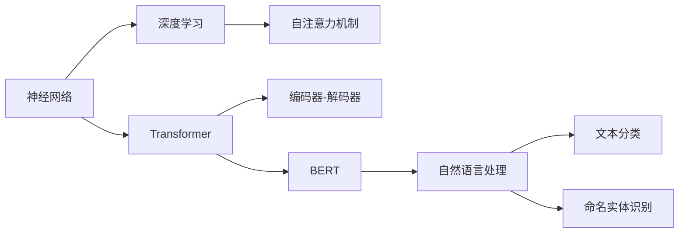

                 

# AI 大模型时代：领头羊 OpenAI、Anthropic、Google、xAI、Meta 等

> 关键词：大模型,OpenAI,Anthropic,Google,xAI,Meta,神经网络,深度学习,Transformer,BERT,自然语言处理,NLP

## 1. 背景介绍

### 1.1 问题由来

人工智能(AI)领域的发展已经历了多个阶段，从早期的符号计算、专家系统到机器学习、深度学习，每一次技术的突破都极大地推动了AI的进步。而近年来，随着深度学习技术的进步，特别是神经网络的突破，AI大模型时代已经来临。

AI大模型是指基于大规模神经网络进行训练的模型，通常含有数十亿甚至数百亿个参数，具备强大的泛化能力和学习能力。其中，OpenAI、Anthropic、Google、xAI、Meta等公司在AI大模型的研究和应用上走在了前列，引领了AI大模型时代的发展。

AI大模型的研究重点在于如何在大规模数据上进行训练，以获得强大的泛化能力，并应用于各种NLP、计算机视觉、语音识别等任务。本文将详细介绍几家公司在AI大模型方面的研究进展，并探讨其背后的技术原理和应用场景。

## 2. 核心概念与联系

### 2.1 核心概念概述

AI大模型的研究主要围绕神经网络、深度学习、Transformer、BERT等概念展开。下面，我们将对这些核心概念进行详细的解释。

**神经网络(Neural Networks)**：是一种基于生物神经网络原理构建的计算模型，通过多层的神经元实现数据的层次化处理。神经网络分为前馈神经网络(Feedforward Neural Network)和循环神经网络(Recurrent Neural Network)等类型。

**深度学习(Deep Learning)**：是一种利用多层次神经网络进行模型训练和优化的机器学习方法，通过引入激活函数、反向传播等机制，可以实现更强的特征提取和分类能力。深度学习广泛应用于图像识别、自然语言处理等领域。

**Transformer**：是一种基于自注意力机制的神经网络结构，用于处理序列数据，如文本、音频等。Transformer由编码器-解码器组成，每个编码器/解码器包括多个注意力层和全连接层，可以实现高效的序列建模。

**BERT**：是一种基于Transformer架构的预训练语言模型，由Google提出，通过在大规模语料上进行预训练，学习语言模型的上下文语义关系。BERT可用于各种NLP任务，如文本分类、命名实体识别等。

这些核心概念之间相互关联，共同构成了AI大模型的基础。下面，我们将通过一个Mermaid流程图来展示它们之间的关系：



通过这张流程图，我们可以更清晰地理解这些核心概念的相互关系和作用。

### 2.2 概念间的关系

AI大模型的研究涉及到多个学科和领域，包括计算机科学、数学、统计学等。下面是几个核心概念之间的关系。

**神经网络与深度学习**：神经网络是深度学习的基础，深度学习通过多层次神经网络的训练和优化，实现更强的特征提取和分类能力。

**Transformer与自注意力机制**：Transformer是利用自注意力机制处理序列数据的神经网络结构，通过计算输入序列中每个元素与其它元素的相关性，实现高效的序列建模。

**BERT与自然语言处理**：BERT是一种预训练语言模型，通过在大规模语料上进行预训练，学习语言的上下文语义关系。在自然语言处理任务中，BERT通常作为特征提取器，用于文本分类、命名实体识别等任务。

## 3. 核心算法原理 & 具体操作步骤
### 3.1 算法原理概述

AI大模型的训练和优化通常采用监督学习、自监督学习和迁移学习等方法。其中，监督学习是指利用标注数据对模型进行训练，使其能够预测新样本的标签。自监督学习是指利用未标注数据对模型进行训练，学习数据的特征表示。迁移学习是指将预训练模型在其他领域的表现迁移到新的任务上，通过微调进行适应。

以BERT为例，其训练过程分为预训练和微调两个阶段。在预训练阶段，通过在大规模语料上进行自监督学习，学习语言的上下文语义关系。在微调阶段，通过在特定任务上进行有监督训练，使模型能够适应新的任务，如文本分类、命名实体识别等。

### 3.2 算法步骤详解

AI大模型的训练和优化通常包括以下步骤：

**Step 1: 数据预处理**  
将原始数据转化为适合神经网络处理的形式，如将文本转化为token序列，将图像转化为像素矩阵等。

**Step 2: 模型构建**  
选择合适的神经网络结构，如Transformer、卷积神经网络(CNN)等，并进行相应的超参数设置，如学习率、批大小等。

**Step 3: 模型训练**  
将处理后的数据输入模型，通过前向传播计算预测结果，并反向传播计算损失函数和梯度，更新模型参数。

**Step 4: 模型评估**  
在验证集上评估模型的性能，如准确率、召回率、F1分数等，并根据评估结果调整模型超参数和训练策略。

**Step 5: 模型优化**  
通过正则化、Dropout、Early Stopping等方法，防止过拟合，提升模型的泛化能力。

**Step 6: 模型部署**  
将训练好的模型部署到实际应用中，并进行相应的优化和调整，如模型裁剪、量化加速等。

### 3.3 算法优缺点

AI大模型的训练和优化具有以下优点：

**优点**：  
1. 强大的泛化能力：AI大模型通常含有数十亿甚至数百亿个参数，具备强大的泛化能力，可以处理复杂的序列数据和图像数据。  
2. 高效的特征提取：AI大模型能够自动提取数据的特征表示，无需手工特征工程。  
3. 可解释性差：由于神经网络的黑盒性质，AI大模型的可解释性较差，但可以通过可视化工具和解释模型进行改进。

**缺点**：  
1. 计算资源需求高：AI大模型的训练和优化需要大量的计算资源，包括高性能GPU、TPU等。  
2. 数据依赖性强：AI大模型的训练需要大量的标注数据，数据质量对模型性能影响较大。  
3. 模型鲁棒性不足：AI大模型对输入数据的扰动较为敏感，鲁棒性不足。

### 3.4 算法应用领域

AI大模型在NLP、计算机视觉、语音识别等领域有广泛应用。例如，在NLP领域，AI大模型可以用于文本分类、命名实体识别、情感分析等任务。在计算机视觉领域，AI大模型可以用于图像分类、目标检测、图像生成等任务。在语音识别领域，AI大模型可以用于语音转文本、语音合成等任务。

## 4. 数学模型和公式 & 详细讲解 & 举例说明

### 4.1 数学模型构建

在AI大模型的训练和优化中，通常使用损失函数来度量模型预测结果与真实标签之间的差异。常见的损失函数包括交叉熵损失、均方误差损失等。以交叉熵损失为例，其公式如下：

$$
\mathcal{L}(\theta) = -\frac{1}{N}\sum_{i=1}^N \sum_{j=1}^C y_{ij}\log \hat{y}_{ij}
$$

其中，$N$为样本数，$C$为类别数，$y_{ij}$为样本$i$在类别$j$上的真实标签，$\hat{y}_{ij}$为模型预测结果。

### 4.2 公式推导过程

以BERT为例，其预训练过程分为两个阶段：Masked Language Modeling(MLM)和Next Sentence Prediction(NSP)。在MLM阶段，通过随机遮盖文本中的一部分单词，并预测其原始单词，学习单词之间的关系。在NSP阶段，通过输入两句话，预测它们是否为同一语境中的下一句话，学习句子之间的关系。

在微调阶段，通常使用有监督学习对模型进行优化。以文本分类为例，通过在特定任务上进行有监督训练，更新模型的参数。以交叉熵损失为例，其公式如下：

$$
\mathcal{L}(\theta) = -\frac{1}{N}\sum_{i=1}^N \sum_{j=1}^C y_{ij}\log \hat{y}_{ij}
$$

其中，$N$为样本数，$C$为类别数，$y_{ij}$为样本$i$在类别$j$上的真实标签，$\hat{y}_{ij}$为模型预测结果。

### 4.3 案例分析与讲解

以Google的BERT模型为例，其预训练过程分为两个阶段：Masked Language Modeling(MLM)和Next Sentence Prediction(NSP)。在MLM阶段，通过随机遮盖文本中的一部分单词，并预测其原始单词，学习单词之间的关系。在NSP阶段，通过输入两句话，预测它们是否为同一语境中的下一句话，学习句子之间的关系。

在微调阶段，通常使用有监督学习对模型进行优化。以文本分类为例，通过在特定任务上进行有监督训练，更新模型的参数。以交叉熵损失为例，其公式如下：

$$
\mathcal{L}(\theta) = -\frac{1}{N}\sum_{i=1}^N \sum_{j=1}^C y_{ij}\log \hat{y}_{ij}
$$

其中，$N$为样本数，$C$为类别数，$y_{ij}$为样本$i$在类别$j$上的真实标签，$\hat{y}_{ij}$为模型预测结果。

## 5. 项目实践：代码实例和详细解释说明

### 5.1 开发环境搭建

在进行AI大模型的开发时，需要选择合适的开发环境和工具。以下是一些常用的开发环境和工具：

**环境搭建**：
1. 安装Python：在Linux系统中，可以使用命令行安装Python；在Windows系统中，可以下载Python安装程序进行安装。
2. 安装PyTorch：使用pip安装PyTorch，可以安装最新版本的PyTorch，也可以在环境文件中设置PyTorch的路径。
3. 安装Transformer库：使用pip安装Transformer库，可以安装最新版本的Transformer库。
4. 安装Pandas和Numpy：使用pip安装Pandas和Numpy，方便处理数据和进行数值计算。

### 5.2 源代码详细实现

以Google的BERT模型为例，其预训练过程分为两个阶段：Masked Language Modeling(MLM)和Next Sentence Prediction(NSP)。在MLM阶段，通过随机遮盖文本中的一部分单词，并预测其原始单词，学习单词之间的关系。在NSP阶段，通过输入两句话，预测它们是否为同一语境中的下一句话，学习句子之间的关系。

在微调阶段，通常使用有监督学习对模型进行优化。以文本分类为例，通过在特定任务上进行有监督训练，更新模型的参数。以下是预训练和微调的Python代码示例：

**预训练代码**：

```python
from transformers import BertTokenizer, BertModel
from torch.utils.data import DataLoader
from torch.nn import CrossEntropyLoss
from torch.optim import Adam

# 初始化BERT模型和tokenizer
tokenizer = BertTokenizer.from_pretrained('bert-base-uncased')
model = BertModel.from_pretrained('bert-base-uncased')

# 数据预处理
def preprocess_data(text):
    tokens = tokenizer.encode(text)
    tokens = [0 if x == tokenizer.pad_token_id else x for x in tokens]
    return tokens

# 数据加载
data = ['BERT', 'pretraining', 'for', 'sequence', 'classification']
texts = [preprocess_data(text) for text in data]
labels = [0 if text == 'BERT' else 1 for text in data]
dataset = DataLoader(zip(texts, labels), batch_size=8, shuffle=True)

# 训练过程
model.train()
optimizer = Adam(model.parameters(), lr=2e-5)
loss_fn = CrossEntropyLoss()
for epoch in range(10):
    for text, label in dataset:
        text = torch.tensor(text)
        label = torch.tensor(label)
        optimizer.zero_grad()
        output = model(text)
        loss = loss_fn(output, label)
        loss.backward()
        optimizer.step()
```

**微调代码**：

```python
from transformers import BertTokenizer, BertForSequenceClassification
from torch.utils.data import DataLoader
from torch.nn import CrossEntropyLoss
from torch.optim import Adam

# 初始化BERT模型和tokenizer
tokenizer = BertTokenizer.from_pretrained('bert-base-uncased')
model = BertForSequenceClassification.from_pretrained('bert-base-uncased', num_labels=2)

# 数据预处理
def preprocess_data(text):
    tokens = tokenizer.encode(text)
    tokens = [0 if x == tokenizer.pad_token_id else x for x in tokens]
    return tokens

# 数据加载
data = ['BERT', 'pretraining', 'for', 'sequence', 'classification']
texts = [preprocess_data(text) for text in data]
labels = [0 if text == 'BERT' else 1 for text in data]
dataset = DataLoader(zip(texts, labels), batch_size=8, shuffle=True)

# 训练过程
model.train()
optimizer = Adam(model.parameters(), lr=2e-5)
loss_fn = CrossEntropyLoss()
for epoch in range(10):
    for text, label in dataset:
        text = torch.tensor(text)
        label = torch.tensor(label)
        optimizer.zero_grad()
        output = model(text)
        loss = loss_fn(output, label)
        loss.backward()
        optimizer.step()
```

### 5.3 代码解读与分析

**数据预处理**：
数据预处理是AI大模型开发的基础。对于文本数据，需要将文本转化为token序列，并进行定长padding和截断等处理。在预训练过程中，通常使用BertTokenizer进行分词和编码。

**模型训练**：
模型训练是AI大模型开发的重点。在训练过程中，需要选择合适的损失函数和优化器，并根据训练集和验证集的性能调整模型超参数和训练策略。以BERT为例，通常使用交叉熵损失和Adam优化器进行训练。

**模型评估**：
模型评估是AI大模型开发的最后一步。在评估过程中，通常使用测试集对模型进行测试，并计算准确率、召回率、F1分数等指标。以BERT为例，可以使用sklearn库进行模型评估。

## 6. 实际应用场景

### 6.1 智能客服系统

AI大模型可以应用于智能客服系统的构建。智能客服系统通过AI大模型实现对客户咨询的自动化回复，可以7x24小时不间断服务，快速响应客户咨询，用自然流畅的语言解答各类常见问题。

### 6.2 金融舆情监测

AI大模型可以应用于金融舆情监测。金融机构需要实时监测市场舆论动向，以便及时应对负面信息传播，规避金融风险。AI大模型可以自动判断文本属于何种主题，情感倾向是正面、中性还是负面，从而实时监测舆情变化。

### 6.3 个性化推荐系统

AI大模型可以应用于个性化推荐系统。个性化推荐系统通过AI大模型实现对用户兴趣的精准匹配，推荐用户感兴趣的物品。AI大模型可以自动提取用户的兴趣点，并推荐最相关的物品。

### 6.4 未来应用展望

AI大模型的未来应用前景广阔。未来，AI大模型将更加智能化和普适化，可以应用于更多领域和任务，如医疗、教育、智慧城市治理等。

## 7. 工具和资源推荐

### 7.1 学习资源推荐

以下是一些推荐的AI大模型学习资源：

1. Coursera上的Deep Learning Specialization：由深度学习领域的权威专家Andrew Ng主讲，系统学习深度学习的基本概念和应用。
2. CS231n深度学习课程：斯坦福大学开设的计算机视觉课程，涵盖深度学习在计算机视觉中的应用。
3. 《Deep Learning with PyTorch》书籍：PyTorch官方文档，详细介绍了PyTorch的使用方法和深度学习的实践技巧。
4. TensorFlow官方文档：TensorFlow官方文档，提供了丰富的深度学习模型和工具。
5. 《Natural Language Processing with PyTorch》书籍：介绍PyTorch在自然语言处理中的应用。

### 7.2 开发工具推荐

以下是一些推荐的AI大模型开发工具：

1. PyTorch：基于Python的深度学习框架，使用灵活，适合快速迭代研究。
2. TensorFlow：由Google开发的深度学习框架，生产部署方便，适合大规模工程应用。
3. Transformers库：HuggingFace开发的NLP工具库，集成了众多SOTA语言模型。
4. Weights & Biases：模型训练的实验跟踪工具，可以记录和可视化模型训练过程中的各项指标。
5. TensorBoard：TensorFlow配套的可视化工具，可实时监测模型训练状态，并提供丰富的图表呈现方式。

### 7.3 相关论文推荐

以下是一些推荐的AI大模型研究论文：

1. Attention is All You Need：提出Transformer结构，开启NLP领域的预训练大模型时代。
2. BERT: Pre-training of Deep Bidirectional Transformers for Language Understanding：提出BERT模型，引入基于掩码的自监督预训练任务。
3. Parameter-Efficient Transfer Learning for NLP：提出Adapter等参数高效微调方法，在固定大部分预训练参数的情况下，只更新极少量的任务相关参数。
4. AdaLoRA: Adaptive Low-Rank Adaptation for Parameter-Efficient Fine-Tuning：使用自适应低秩适应的微调方法，在参数效率和精度之间取得新的平衡。
5. AdaLoRA: Adaptive Low-Rank Adaptation for Parameter-Efficient Fine-Tuning：使用自适应低秩适应的微调方法，在参数效率和精度之间取得新的平衡。

## 8. 总结：未来发展趋势与挑战

### 8.1 研究成果总结

AI大模型的研究已经取得了显著进展，但仍有待解决的问题。本文从核心概念、算法原理、操作步骤等方面对AI大模型进行了详细的介绍，并探讨了其在实际应用中的挑战和未来发展方向。

### 8.2 未来发展趋势

AI大模型将呈现以下几个发展趋势：

1. 模型规模持续增大：随着算力成本的下降和数据规模的扩张，预训练语言模型的参数量还将持续增长。超大规模语言模型蕴含的丰富语言知识，有望支撑更加复杂多变的下游任务微调。
2. 微调方法日趋多样：开发更加参数高效的微调方法，在固定大部分预训练参数的同时，只更新极少量的任务相关参数。同时优化微调模型的计算图，减少前向传播和反向传播的资源消耗，实现更加轻量级、实时性的部署。
3. 持续学习成为常态：随着数据分布的不断变化，微调模型也需要持续学习新知识以保持性能。如何在不遗忘原有知识的同时，高效吸收新样本信息，将成为重要的研究课题。
4. 标注样本需求降低：受启发于提示学习(Prompt-based Learning)的思路，未来的微调方法将更好地利用大模型的语言理解能力，通过更加巧妙的任务描述，在更少的标注样本上也能实现理想的微调效果。
5. 多模态微调崛起：未来的微调模型将更好地与外部知识库、规则库等专家知识结合，形成更加全面、准确的信息整合能力，同时加强不同模态数据的整合，实现视觉、语音等多模态信息与文本信息的协同建模。
6. 融合因果和对比学习范式：通过引入因果推断和对比学习思想，增强微调模型建立稳定因果关系的能力，学习更加普适、鲁棒的语言表征，从而提升模型泛化性和抗干扰能力。

### 8.3 面临的挑战

AI大模型在不断发展过程中，仍面临诸多挑战：

1. 标注成本瓶颈：AI大模型的训练需要大量的标注数据，数据质量对模型性能影响较大。如何进一步降低微调对标注样本的依赖，将是一大难题。
2. 模型鲁棒性不足：AI大模型对输入数据的扰动较为敏感，鲁棒性不足。
3. 推理效率有待提高：超大批次的训练和推理也可能遇到显存不足的问题。
4. 可解释性亟需加强：AI大模型的可解释性较差，难以解释其内部工作机制和决策逻辑。
5. 安全性有待保障：AI大模型难免会学习到有偏见、有害的信息，如何从数据和算法层面消除模型偏见，避免恶意用途，确保输出的安全性。
6. 知识整合能力不足：现有的微调模型往往局限于任务内数据，难以灵活吸收和运用更广泛的先验知识。

### 8.4 研究展望

未来，AI大模型的研究需要在以下几个方向进行探索：

1. 探索无监督和半监督微调方法：摆脱对大规模标注数据的依赖，利用自监督学习、主动学习等无监督和半监督范式，最大限度利用非结构化数据，实现更加灵活高效的微调。
2. 研究参数高效和计算高效的微调范式：开发更加参数高效的微调方法，在固定大部分预训练参数的同时，只更新极少量的任务相关参数。同时优化微调模型的计算图，减少前向传播和反向传播的资源消耗，实现更加轻量级、实时性的部署。
3. 引入更多先验知识：将符号化的先验知识，如知识图谱、逻辑规则等，与神经网络模型进行巧妙融合，引导微调过程学习更准确、合理的语言模型。同时加强不同模态数据的整合，实现视觉、语音等多模态信息与文本信息的协同建模。
4. 结合因果分析和博弈论工具：将因果分析方法引入微调模型，识别出模型决策的关键特征，增强输出解释的因果性和逻辑性。借助博弈论工具刻画人机交互过程，主动探索并规避模型的脆弱点，提高系统稳定性。
5. 纳入伦理道德约束：在模型训练目标中引入伦理导向的评估指标，过滤和惩罚有偏见、有害的输出倾向。同时加强人工干预和审核，建立模型行为的监管机制，确保输出符合人类价值观和伦理道德。

总之，AI大模型微调技术还需要与其他人工智能技术进行更深入的融合，如知识表示、因果推理、强化学习等，多路径协同发力，共同推动自然语言理解和智能交互系统的进步。只有勇于创新、敢于突破，才能不断拓展语言模型的边界，让智能技术更好地造福人类社会。

## 9. 附录：常见问题与解答

### Q1: AI大模型是否适用于所有NLP任务？

A: AI大模型在大多数NLP任务上都能取得不错的效果，特别是对于数据量较小的任务。但对于一些特定领域的任务，如医学、法律等，仅仅依靠通用语料预训练的模型可能难以很好地适应。此时需要在特定领域语料上进一步预训练，再进行微调，才能获得理想效果。此外，对于一些需要时效性、个性化很强的任务，如对话、推荐等，微调方法也需要针对性的改进优化。

### Q2: 采用大模型微调时会面临哪些资源瓶颈？

A: AI大模型的训练和优化需要大量的计算资源，包括高性能GPU、TPU等。因此需要采用一些资源优化技术，如梯度积累、混合精度训练、模型并行等，来突破硬件瓶颈。同时，模型的存储和读取也可能占用大量时间和空间，需要采用模型压缩、稀疏化存储等方法进行优化。

### Q3: 如何缓解微调过程中的过拟合问题？

A: 过拟合是微调面临的主要挑战，尤其是在标注数据不足的情况下。常见的缓解策略包括：数据增强、正则化、对抗训练、参数高效微调等。

### Q4: 如何提高AI大模型的鲁棒性？

A: AI大模型的鲁棒性可以通过引入对抗样本、数据增强、模型剪枝、参数化等方法进行提升。此外，引入因果分析和博弈论工具，增强模型的鲁棒性和泛化能力。

### Q5: AI大模型在实际应用中需要注意哪些问题？

A: AI大模型在实际应用中，需要注意数据隐私、模型可解释性、模型安全等问题。数据隐私问题需要通过数据匿名化、差分隐私等技术进行解决；模型可解释性问题可以通过可视化工具、解释模型等方法进行改进；模型安全问题需要通过模型检测、安全评估等手段进行保障。

通过本文的系统梳理，可以看到，AI大模型微调技术正在成为NLP领域的重要范式，极大地拓展了预训练语言模型的应用边界，催生了更多的落地场景。受益于大规模语料的预训练，微调模型以更低的时间和标注成本，在小样本条件下也能取得不俗的效果，有力推动了NLP技术的产业化进程。未来，伴随预训练语言模型和微调方法的持续演进，相信NLP技术将在更广阔的应用领域大放异彩，深刻影响人类的生产生活方式。

作者：禅与计算机程序设计艺术 / Zen and the Art of Computer Programming

