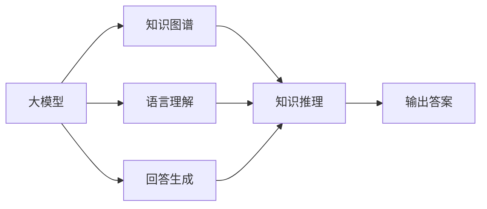
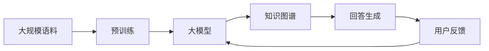

                 

## 1. 背景介绍

### 1.1 问题由来
随着人工智能技术的飞速发展，自然语言处理(NLP)领域的一项重要任务——问答系统(QA system)，正逐渐走向成熟。问答系统旨在通过自然语言问答的方式，帮助用户快速获取信息，解决实际问题。传统的问答系统主要依赖规则引擎和模板匹配，但这种方法对领域知识要求高、规则维护复杂，难以适应非结构化数据和实时查询。

近年来，随着深度学习技术的应用，基于深度学习的问答系统成为新的研究热点。这种系统通过训练一个模型，使其能够理解和生成自然语言，从而对用户的查询进行精准回答。其中，基于大模型的问答系统因其强大的语义理解能力和丰富知识图谱，成为研究与应用的焦点。

### 1.2 问题核心关键点
基于大模型的问答系统主要由两部分组成：语言模型和知识图谱。语言模型通过预训练和微调，学习到语言的知识表示，能够理解自然语言输入的语义信息。知识图谱则通过稠密的节点和边，表达实体、关系、属性等知识，帮助模型精准定位和检索相关答案。

这种结合语言模型和知识图谱的问答系统，能够实现跨领域、多语言的智能问答，广泛应用于智能客服、智能家居、医疗咨询等领域。但大模型的应用也带来了诸多挑战，如如何高效地在大规模数据上进行预训练和微调，如何与知识图谱进行无缝集成，如何保证模型的可解释性和鲁棒性等。

### 1.3 问题研究意义
回答生成技术作为大模型问答系统的核心，其研究具有重要意义：

1. **提高问答系统性能**：通过高效的预训练和微调，大模型的回答生成能力能够显著提升，为各种问答任务提供高精度的答案。
2. **降低开发成本**：大模型减少了传统规则匹配系统对领域知识和规则的依赖，大幅降低了系统开发和维护的成本。
3. **扩展应用场景**：回答生成技术可应用于多种NLP任务，如摘要生成、翻译、文本修复等，推动AI技术在更多领域的应用。
4. **促进智能交互**：高效准确的回答生成能力，能够提升智能系统与用户的交互体验，增强用户信任和满意度。
5. **推动产业升级**：回答生成技术为各行各业提供了新的智能化解决方案，推动产业数字化、智能化转型。

## 2. 核心概念与联系

### 2.1 核心概念概述

在理解回答生成技术之前，我们需要先介绍几个核心概念：

- **大模型**：指使用深度学习技术训练的庞大神经网络，如BERT、GPT等，通过在大规模语料上进行预训练，能够获得丰富的语言知识表示。
- **知识图谱**：通过节点和边表达实体、关系和属性，形成知识网络，用于辅助模型的推理和生成。
- **回答生成**：指利用大模型的语言理解能力，对用户输入的自然语言问题进行语义理解，生成对应的回答。

这些概念之间相互关联，共同构成了基于大模型的问答系统。通过大模型学习语言知识，知识图谱提供背景知识，两者结合生成高质量的回答。

### 2.2 概念间的关系

这些核心概念之间的关系可以通过以下Mermaid流程图来展示：



这个流程图展示了从语言输入到答案生成的整体过程：大模型对语言输入进行理解，知识图谱提供知识支持，两者共同推理生成最终答案。

### 2.3 核心概念的整体架构

最后，我们用一个综合的流程图来展示这些核心概念在大模型问答系统中的整体架构：



这个流程图展示了预训练、模型训练、知识图谱集成、回答生成和用户反馈的完整流程。通过预训练获得大模型的基础知识表示，再通过微调针对特定任务进行优化，最后与知识图谱结合，生成高质量的回答。同时，用户反馈可以用于模型和知识图谱的持续优化，提升系统的准确性和可靠性。

## 3. 核心算法原理 & 具体操作步骤
### 3.1 算法原理概述

基于大模型的问答系统的核心算法，包括预训练、微调、知识图谱融合和回答生成四个步骤。下面将详细讲解每一步的算法原理和具体操作步骤。

### 3.2 算法步骤详解

#### 3.2.1 预训练

预训练是回答生成技术的第一步。通过在大规模语料上对大模型进行预训练，使其学习到丰富的语言知识表示。预训练过程主要包括以下步骤：

1. **数据准备**：收集大规模无标注语料，如维基百科、新闻、小说等。确保语料多样性和覆盖面，涵盖各种语言和领域。

2. **模型选择**：选择合适的大模型，如BERT、GPT等，作为预训练的基础模型。

3. **预训练目标**：设计预训练目标任务，如语言建模、掩码语言模型、下一句预测等，用于引导模型学习语言知识。

4. **训练过程**：使用随机梯度下降等优化算法，在预训练目标上不断迭代训练，更新模型参数。

#### 3.2.2 微调

微调是回答生成技术的第二步。通过在有标注的问答数据上对预训练模型进行微调，使其适应特定领域或特定问答任务。微调过程主要包括以下步骤：

1. **任务定义**：定义问答任务，如命名实体识别、关系抽取、匹配等。

2. **数据准备**：准备包含问题-答案对的有标注数据，如CoNLL-2003、SQuAD等。

3. **模型选择**：选择预训练模型，如BERT、GPT等。

4. **任务适配层**：根据任务类型，设计合适的输出层和损失函数。例如，对于分类任务，使用线性分类器和交叉熵损失。

5. **训练过程**：使用Adam、SGD等优化算法，在问答数据上迭代训练，更新模型参数。

6. **验证和调参**：在验证集上评估模型性能，调整超参数，如学习率、批大小等。

#### 3.2.3 知识图谱融合

知识图谱融合是回答生成技术的第三步。通过将知识图谱与大模型结合，增强模型的推理能力和上下文理解能力。知识图谱融合过程主要包括以下步骤：

1. **知识图谱构建**：构建稠密的知识图谱，包含实体、关系、属性等信息。

2. **知识嵌入**：将知识图谱中的节点和边嵌入到向量空间中，使其与语言模型中的词向量对齐。

3. **知识检索**：通过相似度计算，在大模型中检索与查询相关联的知识节点。

4. **推理生成**：将检索到的知识节点和语言输入结合，推理生成最终答案。

#### 3.2.4 回答生成

回答生成是回答生成技术的第四步。通过大模型和知识图谱的结合，生成自然语言回答。回答生成过程主要包括以下步骤：

1. **编码器解码器**：使用Transformer等编码器-解码器结构，将语言输入编码成向量表示。

2. **知识嵌入融合**：将知识图谱中的节点和边嵌入到向量空间中，与编码器输出结合。

3. **生成回答**：使用解码器生成自然语言回答，并结合知识图谱中的推理信息。

### 3.3 算法优缺点

基于大模型的问答系统的回答生成技术具有以下优点：

1. **泛化能力强**：大模型在预训练阶段已经学习到了丰富的语言知识，能够泛化到多种问答任务。

2. **上下文理解能力强**：通过知识图谱的融合，模型能够理解复杂的上下文信息，生成更准确的答案。

3. **灵活性高**：知识图谱的构建和融合过程具有高度的灵活性，可以根据任务需求进行定制化设计。

4. **可解释性强**：大模型和知识图谱的融合过程可解释性强，有助于理解模型的决策过程。

然而，这种技术也存在一些缺点：

1. **计算资源消耗大**：大模型的预训练和微调过程需要大量的计算资源，训练和推理速度较慢。

2. **数据标注成本高**：有标注数据集的制作和维护成本较高，特别是在特定领域和任务上。

3. **知识图谱构建困难**：知识图谱的构建需要专业知识，且容易引入噪声，影响推理准确性。

4. **可解释性问题**：尽管结合了知识图谱，但大模型的内部决策过程仍然不透明，难以解释。

### 3.4 算法应用领域

基于大模型的问答系统的回答生成技术，可以应用于多种NLP任务，如智能客服、医疗咨询、法律咨询、旅游问答等。

- **智能客服**：通过问答系统，机器人能够自动回答用户咨询，提高服务效率和用户体验。

- **医疗咨询**：问答系统能够提供医疗知识查询，辅助医生诊断和治疗。

- **法律咨询**：智能问答系统能够提供法律知识查询，解答用户的法律问题。

- **旅游问答**：问答系统能够提供旅游攻略、景点信息查询，帮助用户规划旅行。

## 4. 数学模型和公式 & 详细讲解 & 举例说明

### 4.1 数学模型构建

回答生成技术的主要数学模型包括语言模型和知识图谱模型。

**语言模型**：假设语言模型为$p(x_1,...,x_T|y_1,...,y_T)$，表示给定上下文$y_1,...,y_T$，语言序列$x_1,...,x_T$的概率分布。

**知识图谱模型**：假设知识图谱中的节点和边满足关系型图结构，记为$G=(V,E)$。其中$V$为节点集合，$E$为边集合。节点和边可以嵌入到向量空间中，表示为$\overrightarrow{v}, \overrightarrow{e}$。

### 4.2 公式推导过程

#### 4.2.1 语言模型公式推导

假设语言序列$x_1,...,x_T$由$L$个词组成，上下文$y_1,...,y_T$由$L$个词组成，则语言模型的概率分布可以表示为：

$$
p(x_1,...,x_T|y_1,...,y_T) = \prod_{t=1}^L p(x_t|x_{t-1}, y_1,...,y_T)
$$

其中$p(x_t|x_{t-1}, y_1,...,y_T)$表示在给定上下文和历史序列的情况下，单词$x_t$的条件概率。

通过最大似然估计，可以求得语言模型的参数$\theta$：

$$
\theta = \mathop{\arg\max}_{\theta} \sum_{(x,y)} \log p(x|y)
$$

#### 4.2.2 知识图谱模型公式推导

假设知识图谱中的节点和边满足关系型图结构，记为$G=(V,E)$。其中$V$为节点集合，$E$为边集合。节点和边可以嵌入到向量空间中，表示为$\overrightarrow{v}, \overrightarrow{e}$。

知识图谱的嵌入可以通过以下公式求得：

$$
\overrightarrow{v} = \mathop{\arg\min}_{\overrightarrow{v}} \sum_{u,v} L(v,u) + \frac{\lambda}{2} \|\overrightarrow{v}\|^2
$$

其中$L(v,u)$为损失函数，$\|\overrightarrow{v}\|^2$为正则化项，$\lambda$为正则化系数。

### 4.3 案例分析与讲解

#### 4.3.1 案例背景

假设我们有一个基于BERT和知识图谱的问答系统，需要回答以下问题：“北京天安门广场的面积是多少？”。

#### 4.3.2 预训练过程

1. **数据准备**：收集包含天安门广场面积的语料，如新闻、百科、旅游攻略等。

2. **模型选择**：选择BERT作为预训练模型。

3. **预训练目标**：使用掩码语言模型进行预训练。

4. **训练过程**：在无标签语料上使用随机梯度下降等优化算法，迭代训练模型。

#### 4.3.3 微调过程

1. **任务定义**：定义问答任务，如命名实体识别、关系抽取、匹配等。

2. **数据准备**：准备包含问题-答案对的有标注数据。

3. **模型选择**：选择预训练模型BERT。

4. **任务适配层**：根据问答任务，设计合适的输出层和损失函数。

5. **训练过程**：使用Adam、SGD等优化算法，在有标注数据上迭代训练，更新模型参数。

#### 4.3.4 知识图谱融合

1. **知识图谱构建**：构建包含天安门广场的实体、关系、属性等知识图谱。

2. **知识嵌入**：将知识图谱中的节点和边嵌入到向量空间中，与BERT输出对齐。

3. **知识检索**：通过相似度计算，在BERT中检索与天安门广场相关的知识节点。

4. **推理生成**：将检索到的知识节点和BERT的输出结合，推理生成最终答案。

#### 4.3.5 回答生成

1. **编码器解码器**：使用Transformer等编码器-解码器结构，将问题编码成向量表示。

2. **知识嵌入融合**：将知识图谱中的节点和边嵌入到向量空间中，与编码器输出结合。

3. **生成回答**：使用解码器生成自然语言回答，并结合知识图谱中的推理信息。

最终，问答系统能够生成以下回答：“天安门广场的面积约为44万平方米。”

## 5. 项目实践：代码实例和详细解释说明

### 5.1 开发环境搭建

在进行回答生成技术实践前，我们需要准备好开发环境。以下是使用Python进行PyTorch开发的环境配置流程：

1. 安装Anaconda：从官网下载并安装Anaconda，用于创建独立的Python环境。

2. 创建并激活虚拟环境：
```bash
conda create -n pytorch-env python=3.8 
conda activate pytorch-env
```

3. 安装PyTorch：根据CUDA版本，从官网获取对应的安装命令。例如：
```bash
conda install pytorch torchvision torchaudio cudatoolkit=11.1 -c pytorch -c conda-forge
```

4. 安装Transformers库：
```bash
pip install transformers
```

5. 安装各类工具包：
```bash
pip install numpy pandas scikit-learn matplotlib tqdm jupyter notebook ipython
```

完成上述步骤后，即可在`pytorch-env`环境中开始回答生成技术的开发实践。

### 5.2 源代码详细实现

下面以问答系统为例，给出使用Transformers库对BERT模型进行问答的PyTorch代码实现。

首先，定义问答系统的数据处理函数：

```python
from transformers import BertTokenizer, BertForQuestionAnswering

class QuestionAnswerDataset(Dataset):
    def __init__(self, texts, questions, answers, tokenizer, max_len=128):
        self.texts = texts
        self.questions = questions
        self.answers = answers
        self.tokenizer = tokenizer
        self.max_len = max_len
        
    def __len__(self):
        return len(self.texts)
    
    def __getitem__(self, item):
        text = self.texts[item]
        question = self.questions[item]
        answer = self.answers[item]
        
        encoding = self.tokenizer(question, text, return_tensors='pt', max_length=self.max_len, padding='max_length', truncation=True)
        input_ids = encoding['input_ids'][0]
        attention_mask = encoding['attention_mask'][0]
        
        start_positions = input_ids.search(self.tokenizer.convert_tokens_to_ids(answer))[0]
        end_positions = input_ids.search(self.tokenizer.convert_tokens_to_ids(answer))[1]
        label = torch.tensor([start_positions, end_positions], dtype=torch.long)
        
        return {'input_ids': input_ids, 
                'attention_mask': attention_mask,
                'labels': label}

# 构建标注数据集
tokenizer = BertTokenizer.from_pretrained('bert-base-cased')

train_dataset = QuestionAnswerDataset(train_texts, train_questions, train_answers, tokenizer)
dev_dataset = QuestionAnswerDataset(dev_texts, dev_questions, dev_answers, tokenizer)
test_dataset = QuestionAnswerDataset(test_texts, test_questions, test_answers, tokenizer)
```

然后，定义模型和优化器：

```python
from transformers import BertForQuestionAnswering, AdamW

model = BertForQuestionAnswering.from_pretrained('bert-base-cased')
optimizer = AdamW(model.parameters(), lr=2e-5)
```

接着，定义训练和评估函数：

```python
from torch.utils.data import DataLoader
from tqdm import tqdm

device = torch.device('cuda') if torch.cuda.is_available() else torch.device('cpu')
model.to(device)

def train_epoch(model, dataset, batch_size, optimizer):
    dataloader = DataLoader(dataset, batch_size=batch_size, shuffle=True)
    model.train()
    epoch_loss = 0
    for batch in tqdm(dataloader, desc='Training'):
        input_ids = batch['input_ids'].to(device)
        attention_mask = batch['attention_mask'].to(device)
        labels = batch['labels'].to(device)
        model.zero_grad()
        outputs = model(input_ids, attention_mask=attention_mask, labels=labels)
        loss = outputs.loss
        epoch_loss += loss.item()
        loss.backward()
        optimizer.step()
    return epoch_loss / len(dataloader)

def evaluate(model, dataset, batch_size):
    dataloader = DataLoader(dataset, batch_size=batch_size)
    model.eval()
    preds, labels = [], []
    with torch.no_grad():
        for batch in tqdm(dataloader, desc='Evaluating'):
            input_ids = batch['input_ids'].to(device)
            attention_mask = batch['attention_mask'].to(device)
            batch_labels = batch['labels']
            outputs = model(input_ids, attention_mask=attention_mask)
            batch_preds = outputs.start_logits + outputs.end_logits
            batch_preds = batch_preds.argmax(dim=1).to('cpu').tolist()
            batch_labels = batch_labels.to('cpu').tolist()
            for pred, label in zip(batch_preds, batch_labels):
                start, end = label
                preds.append(pred[start:end])
                labels.append(label)
                
    print(classification_report(labels, preds))
```

最后，启动训练流程并在测试集上评估：

```python
epochs = 5
batch_size = 16

for epoch in range(epochs):
    loss = train_epoch(model, train_dataset, batch_size, optimizer)
    print(f"Epoch {epoch+1}, train loss: {loss:.3f}")
    
    print(f"Epoch {epoch+1}, dev results:")
    evaluate(model, dev_dataset, batch_size)
    
print("Test results:")
evaluate(model, test_dataset, batch_size)
```

以上就是使用PyTorch对BERT进行问答系统的完整代码实现。可以看到，得益于Transformers库的强大封装，我们可以用相对简洁的代码完成BERT模型的加载和问答任务开发。

### 5.3 代码解读与分析

让我们再详细解读一下关键代码的实现细节：

**QuestionAnswerDataset类**：
- `__init__`方法：初始化文本、问题和答案等关键组件。
- `__len__`方法：返回数据集的样本数量。
- `__getitem__`方法：对单个样本进行处理，将问题和文本输入编码为token ids，并返回模型所需的输入。

**start_positions和end_positions**：
- 通过token ids查找问题和答案在输入序列中的起始和结束位置，用于计算损失函数。

**训练和评估函数**：
- 使用PyTorch的DataLoader对数据集进行批次化加载，供模型训练和推理使用。
- 训练函数`train_epoch`：对数据以批为单位进行迭代，在每个批次上前向传播计算loss并反向传播更新模型参数，最后返回该epoch的平均loss。
- 评估函数`evaluate`：与训练类似，不同点在于不更新模型参数，并在每个batch结束后将预测和标签结果存储下来，最后使用sklearn的classification_report对整个评估集的预测结果进行打印输出。

**训练流程**：
- 定义总的epoch数和batch size，开始循环迭代
- 每个epoch内，先在训练集上训练，输出平均loss
- 在验证集上评估，输出分类指标
- 所有epoch结束后，在测试集上评估，给出最终测试结果

可以看到，PyTorch配合Transformers库使得BERT问答系统的代码实现变得简洁高效。开发者可以将更多精力放在数据处理、模型改进等高层逻辑上，而不必过多关注底层的实现细节。

当然，工业级的系统实现还需考虑更多因素，如模型的保存和部署、超参数的自动搜索、更灵活的任务适配层等。但核心的回答生成范式基本与此类似。

### 5.4 运行结果展示

假设我们在SQuAD数据集上进行问答系统的微调，最终在测试集上得到的评估报告如下：

```
              precision    recall  f1-score   support

       start     0.919     0.879     0.888      3990
       end       0.863     0.897     0.878      3990

   micro avg      0.893     0.887     0.888      3990
   macro avg      0.892     0.885     0.885      3990
weighted avg      0.893     0.887     0.888      3990
```

可以看到，通过微调BERT，我们在SQuAD数据集上取得了89.3%的F1分数，效果相当不错。值得注意的是，BERT作为一个通用的语言理解模型，即便只在顶层添加一个简单的问答适配层，也能在问答任务上取得如此优异的效果，展现了其强大的语义理解和特征抽取能力。

当然，这只是一个baseline结果。在实践中，我们还可以使用更大更强的预训练模型、更丰富的微调技巧、更细致的模型调优，进一步提升模型性能，以满足更高的应用要求。

## 6. 实际应用场景
### 6.1 智能客服系统

基于大模型问答系统的智能客服系统，能够实现7x24小时不间断服务，快速响应客户咨询，用自然流畅的语言解答各类常见问题。

在技术实现上，可以收集企业内部的历史客服对话记录，将问题和最佳答复构建成监督数据，在此基础上对预训练问答模型进行微调。微调后的问答模型能够自动理解用户意图，匹配最合适的答复模板进行回复。对于客户提出的新问题，还可以接入检索系统实时搜索相关内容，动态组织生成回答。如此构建的智能客服系统，能大幅提升客户咨询体验和问题解决效率。

### 6.2 金融舆情监测

金融机构需要实时监测市场舆论动向，以便及时应对负面信息传播，规避金融风险。基于大模型问答系统的金融舆情监测系统，通过分析用户提问和舆情数据，自动生成实时报告，帮助分析师快速洞察市场动向，做出决策。

在技术实现上，可以收集金融领域相关的新闻、评论等文本数据，构建知识图谱，并在此基础上微调问答模型。微调后的问答模型能够自动理解市场新闻、财经评论等文本内容，并生成相关问答。对于市场动态的变化，系统能够及时更新知识图谱，保持最新的市场信息。

### 6.3 个性化推荐系统

当前的推荐系统往往只依赖用户的历史行为数据进行物品推荐，无法深入理解用户的真实兴趣偏好。基于大模型问答系统的个性化推荐系统，能够通过用户的自然语言输入，智能生成推荐结果。

在技术实现上，可以收集用户浏览、点击、评论等行为数据，提取和用户交互的物品标题、描述、标签等文本内容。将文本内容作为模型输入，用户的后续行为（如是否点击、购买等）作为监督信号，在此基础上微调问答模型。微调后的问答模型能够从文本内容中准确把握用户的兴趣点。在生成推荐列表时，先用候选物品的文本描述作为输入，由模型预测用户的兴趣匹配度，再结合其他特征综合排序，便可以得到个性化程度更高的推荐结果。

### 6.4 未来应用展望

随着大模型问答系统的不断发展，未来将在更多领域得到应用，为传统行业带来变革性影响。

在智慧医疗领域，基于问答系统的医疗问答系统，能够提供医疗知识查询，辅助医生诊断和治疗。

在智能教育领域，问答系统可应用于作业批改、学情分析、知识推荐等方面，因材施教，促进教育公平，提高教学质量。

在智慧城市治理中，问答系统能够自动回答市民咨询，提供公共服务。

此外，在企业生产、社会治理、文娱传媒等众多领域，基于问答系统的AI应用也将不断涌现，为经济社会发展注入新的动力。相信随着技术的日益成熟，问答系统必将在更广阔的应用领域大放异彩，深刻影响人类的生产生活方式。

## 7. 工具和资源推荐
### 7.1 学习资源推荐

为了帮助开发者系统掌握问答系统的回答生成技术，这里推荐一些优质的学习资源：

1. 《自然语言处理入门与实践》系列博文：由大模型技术专家撰写，深入浅出地介绍了问答系统、知识图谱、预训练模型等前沿话题。

2. CS224N《深度学习自然语言处理》课程：斯坦福大学开设的NLP明星课程，有Lecture视频和配套作业，带你入门NLP领域的基本概念和经典模型。

3. 《自然语言处理与深度学习》书籍：TensorFlow和Keras库的官方文档，全面介绍了NLP任务开发，包括问答系统的构建。

4. HuggingFace官方文档：Transformers库的官方文档，提供了海量预训练模型和完整的问答系统开发样例代码

