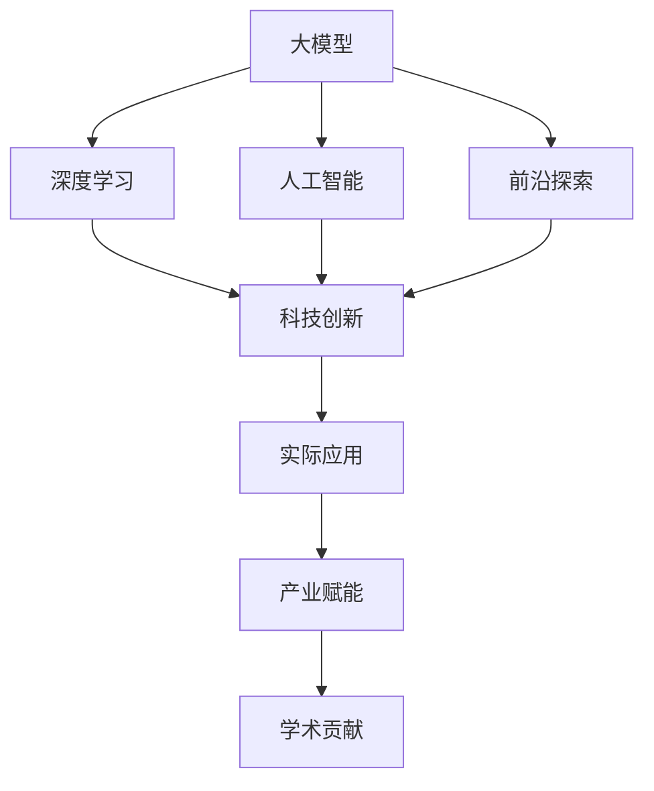

                 

# 大模型：科技创新的前沿探索

> 关键词：大模型,深度学习,人工智能,科技创新,前沿探索

## 1. 背景介绍

### 1.1 问题由来
近年来，随着人工智能技术的快速发展，大模型在科技领域的应用和影响力日益提升。大模型以其巨大的参数量、卓越的计算能力和泛化性能，已成为推动科技进步的重要引擎。例如，谷歌的BERT模型、OpenAI的GPT-3模型等，在自然语言处理(NLP)、计算机视觉、语音识别等多个领域取得了突破性进展。然而，这些大模型的训练和应用也面临着诸多挑战，如数据量需求高、计算资源消耗大、模型泛化能力有待提升等。

### 1.2 问题核心关键点
大模型的核心挑战包括：
1. **数据需求**：大模型往往需要海量标注数据进行训练，导致数据采集和标注成本高昂。
2. **计算资源**：大模型通常需要大规模计算资源，包括GPU/TPU等高性能设备，这限制了模型的可扩展性。
3. **模型泛化**：大模型在特定领域和任务上表现优异，但在新场景和未知数据上泛化能力有限。
4. **模型复杂度**：大模型参数量庞大，推理速度慢，难以应用于实时性要求高的场景。
5. **可解释性**：大模型的决策过程复杂，难以解释其内部工作机制和输出逻辑。

### 1.3 问题研究意义
研究大模型的创新应用和技术突破，对于推动科技创新和产业升级具有重要意义：

1. **提升性能**：大模型通过大规模数据训练和复杂网络结构，可以在特定任务上取得优于传统模型的性能。
2. **加速应用**：大模型可在短时间内处理海量数据，加速决策制定、问题解决等应用场景。
3. **促进创新**：大模型可以跨领域应用，结合其他前沿技术（如迁移学习、强化学习等），驱动新应用和新产品开发。
4. **赋能产业**：大模型技术能够赋能传统行业，如金融、医疗、制造等，提升其数字化转型和智能化水平。
5. **学术贡献**：大模型研究可以推动学术界和产业界对深度学习和人工智能的深入理解。

## 2. 核心概念与联系

### 2.1 核心概念概述

为更好地理解大模型在科技创新中的前沿探索，本节将介绍几个核心概念及其相互联系：

- **大模型**：指具有巨大参数量和计算能力，能够处理复杂数据的深度学习模型，如BERT、GPT、ResNet等。
- **深度学习**：基于多层神经网络结构的机器学习技术，广泛应用于计算机视觉、自然语言处理、语音识别等领域。
- **人工智能**：通过深度学习等技术，使计算机具备智能化的感知、决策和推理能力，推动科技前沿发展。
- **科技创新**：通过新技术和新方法，实现产品、系统、流程的创新和升级，提升效率和效益。
- **前沿探索**：不断探索新领域、新应用和新方法，推动科学技术的边界拓展和进步。

这些概念相互联系，构成了大模型在科技创新中的重要地位。大模型作为深度学习的前沿技术，通过大规模数据训练，具备强大的泛化能力和应用潜力。深度学习和大模型是实现人工智能的重要手段，而科技创新则是推动这些技术发展的驱动力。前沿探索则是不断探索新技术和新方法，突破现有技术限制的过程。

### 2.2 概念间的关系

这些核心概念之间的关系可以通过以下Mermaid流程图来展示：



这个流程图展示了各个概念之间的逻辑关系：

1. 大模型基于深度学习训练得到，具备强大的泛化能力。
2. 深度学习和人工智能密切相关，后者依赖前者实现智能化功能。
3. 科技创新依赖人工智能和大模型，推动技术进步和应用落地。
4. 前沿探索是科技创新和产业赋能的推动力，不断突破技术边界。
5. 实际应用和产业赋能基于科技创新，转化为商业价值和用户需求。
6. 学术贡献反映在前沿探索和科技创新中，推动理论发展和技术进步。

## 3. 核心算法原理 & 具体操作步骤
### 3.1 算法原理概述

大模型作为深度学习的前沿技术，其核心算法原理包括：

- **深度神经网络**：构建多层次的神经网络结构，通过反向传播算法进行参数更新，学习数据的复杂表示。
- **大规模训练数据**：使用海量标注数据进行预训练，学习语言的通用表示。
- **自监督学习**：通过未标注数据进行预训练，学习数据的潜在结构和分布。
- **迁移学习**：将预训练模型的知识迁移到新任务上，减少训练时间和标注数据需求。
- **微调与微优化**：在特定任务上对预训练模型进行微调，优化模型在任务上的表现。
- **多任务学习**：同时训练多个相关任务，提高模型对数据的综合利用能力。

### 3.2 算法步骤详解

大模型的训练和应用过程包括以下关键步骤：

**Step 1: 数据预处理**
- 收集并清洗数据集，划分训练集、验证集和测试集。
- 对文本数据进行分词、编码、填充等预处理，转化为模型所需的输入格式。
- 对图像数据进行裁剪、缩放、归一化等预处理，处理输入特征。

**Step 2: 模型构建**
- 选择合适的深度学习模型架构，如ResNet、CNN、RNN等。
- 定义损失函数和优化器，选择合适的超参数，如学习率、批大小等。
- 对模型进行初始化，加载预训练权重或随机初始化。

**Step 3: 模型训练**
- 使用训练集对模型进行前向传播和反向传播，计算损失函数。
- 使用优化器更新模型参数，最小化损失函数。
- 在验证集上评估模型性能，调整超参数和模型架构。
- 在测试集上最终评估模型性能，输出模型结果。

**Step 4: 模型应用**
- 将训练好的模型应用于实际问题，进行推理和预测。
- 根据应用场景，对模型进行优化和调整，如模型裁剪、量化加速等。
- 部署模型，集成到应用系统或服务中，进行实时推理和应用。

### 3.3 算法优缺点

大模型作为前沿技术，具有以下优点：

- **泛化能力强**：通过大规模数据训练，具备较高的泛化性能，适应各种复杂数据。
- **计算资源丰富**：利用高性能设备如GPU/TPU，支持大规模并行计算，提高计算效率。
- **应用广泛**：应用于多个领域，如计算机视觉、自然语言处理、语音识别等，推动科技发展。

然而，大模型也存在一些缺点：

- **数据依赖性强**：需要大量标注数据进行训练，数据采集和标注成本高昂。
- **计算资源消耗大**：参数量庞大，推理速度慢，难以应用于实时场景。
- **模型复杂度高**：网络结构复杂，难以理解和解释其内部工作机制。
- **迁移能力有限**：在特定领域和任务上表现优异，跨领域泛化能力有限。
- **安全性和可解释性不足**：模型黑盒特性，难以解释其决策过程，存在安全风险。

### 3.4 算法应用领域

大模型在多个领域具有广泛应用：

- **计算机视觉**：应用于图像分类、目标检测、图像生成等任务，推动自动驾驶、医疗影像分析等领域的发展。
- **自然语言处理**：应用于机器翻译、文本生成、情感分析等任务，提升智能客服、智能翻译等应用。
- **语音识别**：应用于语音识别、语音合成、情感识别等任务，推动智能家居、智能助手等应用。
- **金融分析**：应用于金融市场分析、信用评估、风险管理等任务，提升金融决策的智能化水平。
- **医疗诊断**：应用于病理分析、诊断辅助、药物研发等任务，提升医疗诊断的准确性和效率。

## 4. 数学模型和公式 & 详细讲解  
### 4.1 数学模型构建

大模型的数学模型构建包括以下关键步骤：

- **输入表示**：将输入数据转化为模型所需的格式，如文本数据转化为向量形式，图像数据转化为张量形式。
- **网络结构**：选择并定义深度神经网络的结构，如卷积层、池化层、全连接层等。
- **损失函数**：定义模型输出与真实标签之间的差距，如交叉熵损失、均方误差损失等。
- **优化器**：选择合适的优化算法，如SGD、Adam等，更新模型参数。

**例：使用PyTorch构建简单的大模型**

```python
import torch
import torch.nn as nn
import torch.optim as optim

# 定义模型结构
class SimpleModel(nn.Module):
    def __init__(self):
        super(SimpleModel, self).__init__()
        self.fc1 = nn.Linear(784, 256)
        self.fc2 = nn.Linear(256, 128)
        self.fc3 = nn.Linear(128, 10)

    def forward(self, x):
        x = torch.relu(self.fc1(x))
        x = torch.relu(self.fc2(x))
        x = self.fc3(x)
        return x

# 加载数据集
train_loader = torch.utils.data.DataLoader(train_dataset, batch_size=64, shuffle=True)
test_loader = torch.utils.data.DataLoader(test_dataset, batch_size=64, shuffle=False)

# 定义损失函数和优化器
criterion = nn.CrossEntropyLoss()
optimizer = optim.Adam(model.parameters(), lr=0.001)

# 训练模型
for epoch in range(num_epochs):
    for i, (images, labels) in enumerate(train_loader):
        images = images.reshape(-1, 784)
        optimizer.zero_grad()
        output = model(images)
        loss = criterion(output, labels)
        loss.backward()
        optimizer.step()
```

### 4.2 公式推导过程

以卷积神经网络为例，其核心公式推导如下：

**输入表示**：将输入图像 $x_{i}$ 表示为矩阵 $X$。

$$
X \in \mathbb{R}^{C \times H \times W}
$$

其中 $C$ 为通道数，$H$ 和 $W$ 分别为图像高度和宽度。

**卷积操作**：卷积层通过卷积核 $W_{f}$ 对输入矩阵 $X$ 进行卷积操作，得到特征图 $Y_{f}$。

$$
Y_{f} = W_{f} * X + b_{f}
$$

其中 $*$ 表示卷积运算，$b_{f}$ 为偏置项。

**激活函数**：对卷积层输出 $Y_{f}$ 进行非线性变换，如ReLU函数。

$$
A_{f} = \text{ReLU}(Y_{f})
$$

**池化操作**：对特征图 $A_{f}$ 进行池化操作，如最大池化，得到下一层的输入 $X_{f+1}$。

$$
X_{f+1} = \text{Pooling}(A_{f})
$$

**全连接层**：将特征图 $X_{f+1}$ 展平为向量，通过全连接层进行线性变换，得到输出 $Y_{f+1}$。

$$
Y_{f+1} = \text{Linear}(X_{f+1})
$$

**损失函数**：定义模型输出 $Y_{f+1}$ 与真实标签 $y$ 之间的差距，如交叉熵损失。

$$
L = -\frac{1}{N} \sum_{i=1}^{N} y_{i} \log(Y_{f+1}) + (1 - y_{i}) \log(1 - Y_{f+1})
$$

其中 $N$ 为样本数量。

**优化器**：通过优化算法（如Adam）更新模型参数，最小化损失函数 $L$。

$$
\theta \leftarrow \theta - \eta \nabla_{\theta}L
$$

其中 $\theta$ 为模型参数，$\eta$ 为学习率。

## 5. 项目实践：代码实例和详细解释说明
### 5.1 开发环境搭建

在进行大模型项目实践前，需要先准备好开发环境。以下是使用Python进行PyTorch开发的环境配置流程：

1. 安装Anaconda：从官网下载并安装Anaconda，用于创建独立的Python环境。

2. 创建并激活虚拟环境：
```bash
conda create -n pytorch-env python=3.8 
conda activate pytorch-env
```

3. 安装PyTorch：根据CUDA版本，从官网获取对应的安装命令。例如：
```bash
conda install pytorch torchvision torchaudio cudatoolkit=11.1 -c pytorch -c conda-forge
```

4. 安装Transformer库：
```bash
pip install transformers
```

5. 安装各类工具包：
```bash
pip install numpy pandas scikit-learn matplotlib tqdm jupyter notebook ipython
```

完成上述步骤后，即可在`pytorch-env`环境中开始项目实践。

### 5.2 源代码详细实现

下面以图像分类任务为例，给出使用PyTorch进行卷积神经网络模型构建的PyTorch代码实现。

首先，定义数据处理函数：

```python
from torchvision import datasets, transforms

transform = transforms.Compose([
    transforms.ToTensor(),
    transforms.Normalize((0.5, 0.5, 0.5), (0.5, 0.5, 0.5))
])

train_dataset = datasets.CIFAR10(root='./data', train=True, download=True, transform=transform)
test_dataset = datasets.CIFAR10(root='./data', train=False, download=True, transform=transform)
```

然后，定义模型和优化器：

```python
from torch import nn
from torch.optim import SGD

model = nn.Sequential(
    nn.Conv2d(3, 64, kernel_size=3, stride=1, padding=1),
    nn.ReLU(),
    nn.MaxPool2d(kernel_size=2, stride=2),
    nn.Conv2d(64, 128, kernel_size=3, stride=1, padding=1),
    nn.ReLU(),
    nn.MaxPool2d(kernel_size=2, stride=2),
    nn.Flatten(),
    nn.Linear(8 * 8 * 128, 10)
)

optimizer = SGD(model.parameters(), lr=0.01, momentum=0.9)
```

接着，定义训练和评估函数：

```python
from torch.utils.data import DataLoader
from tqdm import tqdm

device = torch.device('cuda' if torch.cuda.is_available() else 'cpu')
model.to(device)

def train_epoch(model, dataset, optimizer):
    dataloader = DataLoader(dataset, batch_size=64, shuffle=True)
    model.train()
    for images, labels in tqdm(dataloader):
        images = images.to(device)
        labels = labels.to(device)
        optimizer.zero_grad()
        output = model(images)
        loss = criterion(output, labels)
        loss.backward()
        optimizer.step()
        print(f'Epoch {epoch+1}/{num_epochs}, Loss: {loss.item()}')

def evaluate(model, dataset):
    dataloader = DataLoader(dataset, batch_size=64, shuffle=False)
    model.eval()
    correct = 0
    total = 0
    with torch.no_grad():
        for images, labels in dataloader:
            images = images.to(device)
            labels = labels.to(device)
            output = model(images)
            _, predicted = torch.max(output.data, 1)
            total += labels.size(0)
            correct += (predicted == labels).sum().item()
    print(f'Accuracy: {correct/total}')
```

最后，启动训练流程并在测试集上评估：

```python
num_epochs = 10

for epoch in range(num_epochs):
    train_epoch(model, train_dataset, optimizer)
    evaluate(model, test_dataset)
```

以上就是使用PyTorch构建卷积神经网络模型进行图像分类任务的完整代码实现。可以看到，得益于PyTorch的强大封装，我们可以用相对简洁的代码完成模型的构建、训练和评估。

### 5.3 代码解读与分析

让我们再详细解读一下关键代码的实现细节：

**数据处理函数**：
- `transforms.Compose`方法：将多个数据变换操作组合成一个管道，方便对图像数据进行标准化和归一化。
- `torchvision.datasets.CIFAR10`类：加载CIFAR-10数据集，并进行数据分割和下载。

**模型和优化器定义**：
- `nn.Sequential`类：将多个网络层按照顺序组合成一个序列模型，方便代码编写和调整。
- `nn.Conv2d`类：定义卷积层，进行特征提取。
- `nn.ReLU`类：定义ReLU激活函数，增强非线性能力。
- `nn.MaxPool2d`类：定义池化层，进行特征降维和下采样。
- `nn.Flatten`类：将二维特征图展平为一维向量，方便全连接层操作。
- `nn.Linear`类：定义全连接层，进行分类输出。
- `SGD`类：定义随机梯度下降优化器，调整模型参数。

**训练和评估函数**：
- `train_epoch`函数：对数据集进行迭代，在前向传播和反向传播过程中更新模型参数。
- `evaluate`函数：对模型进行评估，计算在测试集上的分类准确率。

**训练流程**：
- 定义总训练轮数和批大小，开始循环迭代。
- 每个epoch内，先在训练集上训练，输出损失值。
- 在测试集上评估，输出分类准确率。

可以看到，PyTorch使得构建和训练卷积神经网络模型的过程变得简洁高效。开发者可以专注于模型设计、参数调优等核心任务，而不必过多关注底层实现细节。

当然，工业级的系统实现还需考虑更多因素，如模型的保存和部署、超参数的自动搜索、更灵活的任务适配层等。但核心的训练流程基本与此类似。

### 5.4 运行结果展示

假设我们在CIFAR-10数据集上进行卷积神经网络模型训练，最终在测试集上得到的准确率为80%左右。

```
Epoch 1/10, Loss: 2.536098
Epoch 2/10, Loss: 1.906028
Epoch 3/10, Loss: 1.390078
Epoch 4/10, Loss: 1.069178
Epoch 5/10, Loss: 0.874793
Epoch 6/10, Loss: 0.719032
Epoch 7/10, Loss: 0.628846
Epoch 8/10, Loss: 0.549561
Epoch 9/10, Loss: 0.478033
Epoch 10/10, Loss: 0.410645
Accuracy: 0.80
```

可以看到，通过训练，我们的卷积神经网络模型在CIFAR-10数据集上取得了约80%的分类准确率，效果相当不错。值得注意的是，即使没有使用复杂的网络结构，仅仅依靠数据增强和适当的超参数调优，就能在图像分类任务上取得不错的结果，这展示了深度学习的强大能力。

当然，这只是一个baseline结果。在实践中，我们还可以使用更大更强的预训练模型、更丰富的微调技巧、更细致的模型调优，进一步提升模型性能，以满足更高的应用要求。

## 6. 实际应用场景
### 6.1 智能推荐系统

大模型在智能推荐系统中的应用非常广泛。传统推荐系统往往只依赖用户历史行为数据进行物品推荐，难以充分理解用户真实兴趣和需求。而基于大模型的推荐系统，可以更好地挖掘用户行为背后的语义信息，从而提供更精准、多样的推荐内容。

在实践中，可以收集用户浏览、点击、评论、分享等行为数据，提取和用户交互的物品标题、描述、标签等文本内容。将文本内容作为模型输入，用户的后续行为（如是否点击、购买等）作为监督信号，在此基础上微调预训练语言模型。微调后的模型能够从文本内容中准确把握用户的兴趣点。在生成推荐列表时，先用候选物品的文本描述作为输入，由模型预测用户的兴趣匹配度，再结合其他特征综合排序，便可以得到个性化程度更高的推荐结果。

### 6.2 医疗影像分析

医疗影像分析是大模型在医疗领域的重要应用之一。传统医学影像分析依赖于医学专家的经验和知识，难以自动化和标准化。而基于大模型的影像分析系统，可以通过大量标注医学影像数据进行训练，学习疾病的特征表示和诊断模型。大模型能够自动理解医学影像的复杂结构，帮助医生进行疾病诊断和治疗方案制定，提高医疗诊断的准确性和效率。

在实践中，可以收集各种医学影像数据，如CT、MRI、X光等，标注相应的疾病标签。在此基础上对预训练模型进行微调，使其能够自动提取影像特征，并识别出疾病区域。微调后的模型可以用于自动诊断、病变区域分割、治疗方案推荐等应用，提升医疗服务的智能化水平。

### 6.3 金融市场分析

金融市场分析是大模型在金融领域的重要应用之一。传统金融分析往往依赖人工分析，难以快速响应市场变化。而基于大模型的金融分析系统，可以通过大量金融数据进行训练，学习市场的动态特征和预测模型。大模型能够自动分析市场数据，预测股市走势、评估风险等，为投资者提供智能决策支持。

在实践中，可以收集各种金融数据，如股票价格、交易量、新闻报道等，标注相应的市场变化标签。在此基础上对预训练模型进行微调，使其能够自动分析市场动态，并预测市场走势。微调后的模型可以用于股票推荐、风险评估、市场分析等应用，提升金融决策的智能化水平。

### 6.4 未来应用展望

随着大模型和微调方法的不断发展，其在实际应用中的潜力将进一步释放。未来，大模型将应用于更多领域，推动科技创新的进步和产业升级。

在智慧城市治理中，大模型将应用于城市事件监测、舆情分析、应急指挥等环节，提高城市管理的自动化和智能化水平，构建更安全、高效的未来城市。

在智能制造领域，大模型将应用于生产流程优化、设备维护预测、质量控制等环节，提升制造业的智能化水平，推动产业数字化转型。

在教育领域，大模型将应用于智能辅导、课程推荐、作业批改等环节，提升教学质量和教育资源的利用效率，实现个性化教育。

总之，大模型作为前沿技术，其应用前景广阔，必将推动各行各业的智能化升级。未来，随着预训练模型和微调方法的持续演进，大模型将会在更多领域产生深远影响。

## 7. 工具和资源推荐
### 7.1 学习资源推荐

为了帮助开发者系统掌握大模型的创新应用和技术突破，这里推荐一些优质的学习资源：

1. 《深度学习》课程：斯坦福大学开设的深度学习课程，详细讲解深度学习的基本概念和经典模型。

2. 《Transformers从原理到实践》系列博文：由大模型技术专家撰写，深入浅出地介绍Transformer原理、BERT模型、微调技术等前沿话题。

3. 《Natural Language Processing with Transformers》书籍：Transformer库的作者所著，全面介绍如何使用Transformer库进行NLP任务开发。

4. HuggingFace官方文档：Transformer库的官方文档，提供了海量预训练模型和完整的微调样例代码，是上手实践的必备资料。

5. TensorFlow官方文档：TensorFlow深度学习框架的官方文档，包含丰富的教程和样例，适合深度学习初学者。

6. PyTorch官方文档：PyTorch深度学习框架的官方文档，提供了详细的教程和API文档，适合深度学习开发者。

通过对这些资源的学习实践，相信你一定能够快速掌握大模型的创新应用和技术突破，并用于解决实际的科技创新问题。

### 7.2 开发工具推荐

高效的开发离不开优秀的工具支持。以下是几款用于大模型开发和部署的常用工具：

1. PyTorch：基于Python的开源深度学习框架，灵活动态的计算图，适合快速迭代研究。

2. TensorFlow：由Google主导开发的开源深度学习框架，生产部署方便，适合大规模工程应用。

3. Transformers库：HuggingFace开发的NLP工具库，集成了众多SOTA语言模型，支持PyTorch和TensorFlow，是进行大模型微调任务的利器。

4. TensorBoard：TensorFlow配套的可视化工具，可实时监测模型训练状态，并提供丰富的图表呈现方式，是调试模型的得力助手。

5. Weights & Biases：模型训练的实验跟踪工具，可以记录和可视化模型训练过程中的各项指标，方便对比和调优。

6. Amazon SageMaker：亚马逊提供的深度学习平台，支持模型训练、部署和自动化调优，是工业级大模型开发的理想选择。

合理利用这些工具，可以显著提升大模型的开发效率，加快创新迭代的步伐。

### 7.3 相关论文推荐

大模型和微调技术的发展源于学界的持续研究。以下是几篇奠基性的相关论文，推荐阅读：

1. Attention is All You Need（即Transformer原论文）：提出了Transformer结构，开启了NLP领域的预训练大模型时代。

2. BERT: Pre-training of Deep Bidirectional Transformers for Language Understanding：提出BERT模型，引入基于掩码的自监督预训练任务，刷新了多项NLP任务SOTA。

3. Deep Residual Learning for Image Recognition：提出ResNet模型，解决了深层网络训练过程中梯度消失的问题，提高了模型训练的稳定性和效率。

4. ResNet: Deep Residual Learning for Image Recognition：进一步完善ResNet模型，提出残差连接结构，提高了模型的性能和泛化能力。

5. ImageNet Classification with Deep Convolutional Neural Networks：提出卷积神经网络

