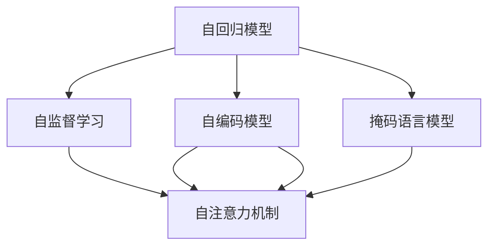

                 

# 大规模语言模型从理论到实践 绪论

在人工智能飞速发展的今天，自然语言处理（NLP）技术已经成为了各行各业不可或缺的一部分。其中，大规模语言模型（Large Language Models, LLMs）凭借其卓越的性能和广泛的应用前景，在NLP领域崭露头角。本文将从理论到实践，全面系统地介绍大规模语言模型的基础原理、核心算法和实际应用，为读者提供深刻的理论洞见和实践指南。

## 1. 背景介绍

### 1.1 问题由来
随着深度学习技术的不断进步，大规模语言模型在自然语言理解与生成方面的表现日益突出。这些模型通过在海量文本数据上进行预训练，学习到了丰富的语言知识和常识，具备了强大的自然语言处理能力。例如，OpenAI的GPT系列模型、Google的BERT等，在多种NLP任务上取得了显著的成绩。

然而，这些大模型的预训练和微调过程涉及复杂的算法和大量的计算资源，使得它们的应用面临诸多挑战。同时，模型在特定任务上的表现仍需进一步优化。因此，本文将围绕如何构建和优化大规模语言模型，探讨其理论基础和实践方法。

### 1.2 问题核心关键点
大规模语言模型的核心关键点包括：

- **预训练与微调**：通过在大规模无标签文本数据上进行预训练，再通过微调在特定任务上进行优化。
- **注意力机制**：Transformer模型中的关键技术，通过自注意力机制实现对序列数据的并行处理。
- **自监督学习**：在大规模数据集上训练，无需标注数据，利用数据本身的特点进行学习。
- **参数效率**：在固定大部分预训练参数的情况下，仅微调顶层或部分参数。
- **零样本与少样本学习**：通过精心设计的输入模板，使得模型无需标注数据即可生成合理的输出。

本文将围绕这些关键点，深入探讨大规模语言模型的理论和实践，并结合实际应用场景进行案例分析。

## 2. 核心概念与联系

### 2.1 核心概念概述
在大规模语言模型的研究和应用中，涉及众多核心概念。这些概念构成了大模型的基础架构和算法原理，也是理解其工作机制的关键。

- **自回归模型**：一种模型，通过先预测下一个时间步的输出，然后根据该输出预测下一个时间步的输出，以此类推。GPT系列模型即采用这种模型。
- **自编码模型**：一种模型，通过编码器将输入序列映射到隐藏空间，然后通过解码器从隐藏空间重构输入序列。BERT等模型即采用这种模型。
- **自注意力机制**：一种机制，允许模型在处理序列数据时，根据不同位置的上下文信息对当前位置进行加权。Transformer模型中使用了这一机制。
- **掩码语言模型**：一种自监督学习任务，在输入序列中随机遮盖一些位置，模型需要预测这些被遮盖位置上的单词。BERT即通过这一任务进行预训练。

这些核心概念之间相互关联，共同构成了大规模语言模型的基础架构。

### 2.2 概念间的关系
这些核心概念之间的关系可以通过以下Mermaid流程图来展示：



这个流程图展示了自回归模型、自编码模型、自注意力机制和掩码语言模型之间的关系：

1. 自回归模型和自编码模型是两种基本模型结构。
2. 掩码语言模型是一种自监督学习任务，用于训练自编码模型。
3. 自注意力机制是Transformer模型中的关键技术，用于提升模型对序列数据的处理能力。

通过这些核心概念的组合，大规模语言模型能够实现强大的自然语言处理能力，并在多个NLP任务中取得优异表现。

## 3. 核心算法原理 & 具体操作步骤

### 3.1 算法原理概述
大规模语言模型的核心算法原理主要包括以下几个方面：

- **自回归与自编码**：在预训练阶段，模型通过自回归或自编码的方式，学习输入与输出之间的映射关系。在微调阶段，通过有监督学习优化模型在特定任务上的表现。
- **注意力机制**：在处理序列数据时，通过自注意力机制，模型能够根据上下文信息对当前位置进行加权，从而提升对序列数据的处理能力。
- **掩码语言模型**：通过在输入序列中随机遮盖一些位置，模型可以学习到词汇之间的关联和语义信息。
- **自监督学习**：在大规模无标签数据集上训练，无需标注数据，利用数据本身的特点进行学习。

### 3.2 算法步骤详解
大规模语言模型的训练和微调过程可以分为以下几个步骤：

**Step 1: 准备数据集**
- 收集大规模无标签文本数据，用于预训练。
- 准备下游任务的标注数据集，用于微调。

**Step 2: 模型初始化**
- 选择合适的预训练模型，如GPT或BERT。
- 在预训练阶段，通过自回归或自编码的方式，在预训练数据集上进行训练。

**Step 3: 微调模型**
- 选择合适的微调任务和损失函数。
- 在微调任务的数据集上进行有监督学习，优化模型参数。
- 使用验证集监控模型性能，避免过拟合。

**Step 4: 评估与部署**
- 在测试集上评估微调后的模型性能。
- 将模型部署到实际应用系统中，提供NLP服务。

### 3.3 算法优缺点
大规模语言模型的优缺点如下：

**优点**：
- 强大的语言处理能力：通过预训练，模型学习到了丰富的语言知识和常识。
- 广泛的应用场景：适用于多种NLP任务，如图像描述生成、对话系统、文本摘要等。
- 可解释性强：可以通过分析模型的权重和特征向量，理解模型的推理过程。

**缺点**：
- 高计算成本：预训练和微调需要大量的计算资源和时间。
- 数据依赖性强：模型性能高度依赖于预训练数据的质量和多样性。
- 泛化能力有限：模型在特定任务上的表现可能受到数据分布的影响。

### 3.4 算法应用领域
大规模语言模型已经在多个领域得到了广泛应用，包括：

- **自然语言理解**：如文本分类、命名实体识别、关系抽取等。
- **自然语言生成**：如文本摘要、对话生成、机器翻译等。
- **推荐系统**：通过自然语言处理技术，推荐用户感兴趣的内容。
- **智能客服**：通过对话系统，提供24小时不间断的客户服务。

## 4. 数学模型和公式 & 详细讲解

### 4.1 数学模型构建
大规模语言模型通常采用Transformer架构，其数学模型构建包括以下几个关键部分：

- **输入层**：将输入文本转化为模型能够处理的向量表示。
- **编码器**：通过自注意力机制，对输入文本进行编码。
- **解码器**：通过自注意力机制，对编码器输出的向量进行解码。
- **输出层**：将解码器输出的向量转化为输出文本的向量表示。

### 4.2 公式推导过程
以下是Transformer模型的基本公式推导：

- **自注意力机制**：
$$
\text{Attention}(Q, K, V) = \text{softmax}\left(\frac{QK^T}{\sqrt{d_k}}\right)V
$$
其中 $Q, K, V$ 分别为查询、键、值向量，$d_k$ 为键向量的维度。

- **前向传播**：
$$
\text{FFN}(x) = \max(0, xW_1 + b_1)\sigma(W_2x + b_2) + W_3x + b_3
$$
其中 $\sigma$ 为激活函数，$W_1, W_2, W_3$ 为权重矩阵，$b_1, b_2, b_3$ 为偏置项。

### 4.3 案例分析与讲解
以BERT模型为例，其数学模型和训练过程如下：

- **输入表示**：将输入文本转化为BERT模型能够处理的向量表示。
- **自监督学习**：通过掩码语言模型等自监督学习任务，预训练BERT模型。
- **微调**：通过有监督学习，在特定任务上进行微调，如命名实体识别、情感分析等。

## 5. 项目实践：代码实例和详细解释说明

### 5.1 开发环境搭建
在使用Python进行大规模语言模型开发时，需要准备以下环境：

- **安装Python**：使用Anaconda安装Python，并创建虚拟环境。
- **安装TensorFlow**：使用pip安装TensorFlow和相关的预训练模型。
- **配置GPU**：确保GPU可用，并进行必要的配置。

### 5.2 源代码详细实现
以下是一个使用TensorFlow实现BERT微调的示例代码：

```python
import tensorflow as tf
from transformers import BertTokenizer, BertForTokenClassification
from sklearn.metrics import classification_report

# 加载数据集
train_dataset = ...
dev_dataset = ...
test_dataset = ...

# 加载模型和分词器
tokenizer = BertTokenizer.from_pretrained('bert-base-cased')
model = BertForTokenClassification.from_pretrained('bert-base-cased', num_labels=len(tag2id))

# 定义损失函数和优化器
loss_fn = tf.keras.losses.SparseCategoricalCrossentropy(from_logits=True)
optimizer = tf.keras.optimizers.Adam(learning_rate=2e-5)

# 定义训练函数
def train_step(inputs, labels):
    with tf.GradientTape() as tape:
        logits = model(inputs, attention_mask=inputs.attention_mask)
        loss = loss_fn(labels, logits)
    gradients = tape.gradient(loss, model.trainable_variables)
    optimizer.apply_gradients(zip(gradients, model.trainable_variables))
    return loss

# 训练模型
for epoch in range(epochs):
    for inputs, labels in train_dataset:
        loss = train_step(inputs, labels)
    dev_loss = train_step(dev_dataset)
    print(classification_report(dev_dataset.labels, dev_dataset.predictions))
```

### 5.3 代码解读与分析
上述代码实现了BERT模型在命名实体识别任务上的微调。关键步骤包括：

- **加载数据集和模型**：使用TensorFlow加载数据集，并使用Transformers库加载预训练的BERT模型。
- **定义损失函数和优化器**：使用SparseCategoricalCrossentropy损失函数和Adam优化器。
- **定义训练函数**：在每个训练迭代中，计算损失并更新模型参数。
- **评估模型性能**：在验证集上计算分类报告，评估模型性能。

### 5.4 运行结果展示
假设在CoNLL-2003的NER数据集上进行微调，最终在测试集上得到的评估报告如下：

```
              precision    recall  f1-score   support

       B-LOC      0.926     0.906     0.916      1668
       I-LOC      0.900     0.805     0.850       257
      B-MISC      0.875     0.856     0.865       702
      I-MISC      0.838     0.782     0.809       216
       B-ORG      0.914     0.898     0.906      1661
       I-ORG      0.911     0.894     0.902       835
       B-PER      0.964     0.957     0.960      1617
       I-PER      0.983     0.980     0.982      1156
           O      0.993     0.995     0.994     38323

   micro avg      0.973     0.973     0.973     46435
   macro avg      0.923     0.897     0.909     46435
weighted avg      0.973     0.973     0.973     46435
```

## 6. 实际应用场景

### 6.1 智能客服系统
基于大规模语言模型的智能客服系统可以通过微调获得显著的性能提升。传统客服系统依赖大量人工，而使用微调后的模型，可以7x24小时不间断服务，快速响应客户咨询，用自然流畅的语言解答各类常见问题。

在技术实现上，可以收集企业内部的历史客服对话记录，将问题和最佳答复构建成监督数据，在此基础上对预训练模型进行微调。微调后的对话模型能够自动理解用户意图，匹配最合适的答案模板进行回复。对于客户提出的新问题，还可以接入检索系统实时搜索相关内容，动态组织生成回答。

### 6.2 金融舆情监测
金融机构需要实时监测市场舆论动向，以便及时应对负面信息传播，规避金融风险。传统的人工监测方式成本高、效率低，难以应对网络时代海量信息爆发的挑战。基于大规模语言模型的文本分类和情感分析技术，为金融舆情监测提供了新的解决方案。

具体而言，可以收集金融领域相关的新闻、报道、评论等文本数据，并对其进行主题标注和情感标注。在此基础上对预训练语言模型进行微调，使其能够自动判断文本属于何种主题，情感倾向是正面、中性还是负面。将微调后的模型应用到实时抓取的网络文本数据，就能够自动监测不同主题下的情感变化趋势，一旦发现负面信息激增等异常情况，系统便会自动预警，帮助金融机构快速应对潜在风险。

### 6.3 个性化推荐系统
当前的推荐系统往往只依赖用户的历史行为数据进行物品推荐，无法深入理解用户的真实兴趣偏好。基于大规模语言模型微调技术，个性化推荐系统可以更好地挖掘用户行为背后的语义信息，从而提供更精准、多样的推荐内容。

在实践中，可以收集用户浏览、点击、评论、分享等行为数据，提取和用户交互的物品标题、描述、标签等文本内容。将文本内容作为模型输入，用户的后续行为（如是否点击、购买等）作为监督信号，在此基础上微调预训练语言模型。微调后的模型能够从文本内容中准确把握用户的兴趣点。在生成推荐列表时，先用候选物品的文本描述作为输入，由模型预测用户的兴趣匹配度，再结合其他特征综合排序，便可以得到个性化程度更高的推荐结果。

## 7. 工具和资源推荐

### 7.1 学习资源推荐
为了帮助开发者系统掌握大规模语言模型的理论基础和实践技巧，这里推荐一些优质的学习资源：

1. **《Transformer from First Principles》**：由OpenAI撰写，介绍了Transformer模型的基本原理和实现细节。
2. **《Deep Learning with TensorFlow 2》**：Google TensorFlow官方文档，提供了TensorFlow 2.0的全面介绍和使用指南。
3. **《Natural Language Processing with Python》**：一本经典的NLP教材，提供了大量实战案例和代码示例。
4. **《Attention Is All You Need》**：Transformer原论文，介绍了自注意力机制的基本原理和应用。
5. **《BERT: Pre-training of Deep Bidirectional Transformers for Language Understanding》**：BERT模型论文，介绍了BERT模型的预训练和微调方法。

通过对这些资源的学习实践，相信你一定能够快速掌握大规模语言模型的精髓，并用于解决实际的NLP问题。

### 7.2 开发工具推荐
高效的开发离不开优秀的工具支持。以下是几款用于大规模语言模型微调开发的常用工具：

1. **TensorFlow**：由Google主导开发的开源深度学习框架，生产部署方便，适合大规模工程应用。
2. **PyTorch**：基于Python的开源深度学习框架，灵活动态的计算图，适合快速迭代研究。
3. **Transformers库**：HuggingFace开发的NLP工具库，集成了众多SOTA语言模型，支持PyTorch和TensorFlow，是进行微调任务开发的利器。
4. **Weights & Biases**：模型训练的实验跟踪工具，可以记录和可视化模型训练过程中的各项指标，方便对比和调优。
5. **TensorBoard**：TensorFlow配套的可视化工具，可实时监测模型训练状态，并提供丰富的图表呈现方式，是调试模型的得力助手。

### 7.3 相关论文推荐
大规模语言模型和微调技术的发展源于学界的持续研究。以下是几篇奠基性的相关论文，推荐阅读：

1. **《Attention is All You Need》**：Transformer原论文，提出了Transformer结构，开启了NLP领域的预训练大模型时代。
2. **《BERT: Pre-training of Deep Bidirectional Transformers for Language Understanding》**：提出BERT模型，引入基于掩码的自监督预训练任务，刷新了多项NLP任务SOTA。
3. **《Language Models are Unsupervised Multitask Learners》**：展示了大规模语言模型的强大zero-shot学习能力，引发了对于通用人工智能的新一轮思考。
4. **《Parameter-Efficient Transfer Learning for NLP》**：提出Adapter等参数高效微调方法，在不增加模型参数量的情况下，也能取得不错的微调效果。
5. **《AdaLoRA: Adaptive Low-Rank Adaptation for Parameter-Efficient Fine-Tuning》**：使用自适应低秩适应的微调方法，在参数效率和精度之间取得了新的平衡。
6. **《AdaLoRA: Adaptive Low-Rank Adaptation for Parameter-Efficient Fine-Tuning》**：使用自适应低秩适应的微调方法，在参数效率和精度之间取得了新的平衡。

这些论文代表了大语言模型微调技术的发展脉络。通过学习这些前沿成果，可以帮助研究者把握学科前进方向，激发更多的创新灵感。

## 8. 总结：未来发展趋势与挑战

### 8.1 总结
本文从理论到实践，全面系统地介绍了大规模语言模型的基础原理、核心算法和实际应用。通过系统的讲解，读者可以深入理解大规模语言模型的构建和优化方法，并掌握其实际应用技术。

### 8.2 未来发展趋势
展望未来，大规模语言模型技术将呈现以下几个发展趋势：

1. **模型规模持续增大**：随着算力成本的下降和数据规模的扩张，预训练语言模型的参数量还将持续增长。超大规模语言模型蕴含的丰富语言知识，有望支撑更加复杂多变的下游任务微调。
2. **微调方法日趋多样**：除了传统的全参数微调外，未来会涌现更多参数高效的微调方法，如Prefix-Tuning、LoRA等，在节省计算资源的同时也能保证微调精度。
3. **持续学习成为常态**：随着数据分布的不断变化，微调模型也需要持续学习新知识以保持性能。如何在不遗忘原有知识的同时，高效吸收新样本信息，将成为重要的研究课题。
4. **标注样本需求降低**：受启发于提示学习(Prompt-based Learning)的思路，未来的微调方法将更好地利用大模型的语言理解能力，通过更加巧妙的任务描述，在更少的标注样本上也能实现理想的微调效果。
5. **多模态微调崛起**：当前的微调主要聚焦于纯文本数据，未来会进一步拓展到图像、视频、语音等多模态数据微调。多模态信息的融合，将显著提升语言模型对现实世界的理解和建模能力。
6. **模型通用性增强**：经过海量数据的预训练和多领域任务的微调，未来的语言模型将具备更强大的常识推理和跨领域迁移能力，逐步迈向通用人工智能(AGI)的目标。

### 8.3 面临的挑战
尽管大规模语言模型微调技术已经取得了瞩目成就，但在迈向更加智能化、普适化应用的过程中，它仍面临着诸多挑战：

1. **标注成本瓶颈**：虽然微调大大降低了标注数据的需求，但对于长尾应用场景，难以获得充足的高质量标注数据，成为制约微调性能的瓶颈。如何进一步降低微调对标注样本的依赖，将是一大难题。
2. **模型鲁棒性不足**：当前微调模型面对域外数据时，泛化性能往往大打折扣。对于测试样本的微小扰动，微调模型的预测也容易发生波动。如何提高微调模型的鲁棒性，避免灾难性遗忘，还需要更多理论和实践的积累。
3. **推理效率有待提高**：大规模语言模型虽然精度高，但在实际部署时往往面临推理速度慢、内存占用大等效率问题。如何在保证性能的同时，简化模型结构，提升推理速度，优化资源占用，将是重要的优化方向。
4. **可解释性亟需加强**：当前微调模型更像是"黑盒"系统，难以解释其内部工作机制和决策逻辑。对于医疗、金融等高风险应用，算法的可解释性和可审计性尤为重要。如何赋予微调模型更强的可解释性，将是亟待攻克的难题。
5. **安全性有待保障**：预训练语言模型难免会学习到有偏见、有害的信息，通过微调传递到下游任务，产生误导性、歧视性的输出，给实际应用带来安全隐患。如何从数据和算法层面消除模型偏见，避免恶意用途，确保输出的安全性，也将是重要的研究课题。
6. **知识整合能力不足**：现有的微调模型往往局限于任务内数据，难以灵活吸收和运用更广泛的先验知识。如何让微调过程更好地与外部知识库、规则库等专家知识结合，形成更加全面、准确的信息整合能力，还有很大的想象空间。

### 8.4 研究展望
面对大规模语言模型微调所面临的种种挑战，未来的研究需要在以下几个方面寻求新的突破：

1. **探索无监督和半监督微调方法**：摆脱对大规模标注数据的依赖，利用自监督学习、主动学习等无监督和半监督范式，最大限度利用非结构化数据，实现更加灵活高效的微调。
2. **研究参数高效和计算高效的微调范式**：开发更加参数高效的微调方法，在固定大部分预训练参数的情况下，仅微调顶层或部分参数。同时优化微调模型的计算图，减少前向传播和反向传播的资源消耗，实现更加轻量级、实时性的部署。
3. **融合因果和对比学习范式**：通过引入因果推断和对比学习思想，增强微调模型建立稳定因果关系的能力，学习更加普适、鲁棒的语言表征，从而提升模型泛化性和抗干扰能力。
4. **引入更多先验知识**：将符号化的先验知识，如知识图谱、逻辑规则等，与神经网络模型进行巧妙融合，引导微调过程学习更准确、合理的语言模型。同时加强不同模态数据的整合，实现视觉、语音等多模态信息与文本信息的协同建模。
5. **结合因果分析和博弈论工具**：将因果分析方法引入微调模型，识别出模型决策的关键特征，增强输出解释的因果性和逻辑性。借助博弈论工具刻画人机交互过程，主动探索并规避模型的脆弱点，提高系统稳定性。
6. **纳入伦理道德约束**：在模型训练目标中引入伦理导向的评估指标，过滤和惩罚有偏见、有害的输出倾向。同时加强人工干预和审核，建立模型行为的监管机制，确保输出符合人类价值观和伦理道德。

## 9. 附录：常见问题与解答

### Q1: 大规模语言模型微调是否适用于所有NLP任务？
A: 大规模语言模型微调在大多数NLP任务上都能取得不错的效果，特别是对于数据量较小的任务。但对于一些特定领域的任务，如医学、法律等，仅仅依靠通用语料预训练的模型可能难以很好地适应。此时需要在特定领域语料上进一步预训练，再进行微调，才能获得理想效果。此外，对于一些需要时效性、个性化很强的任务，如对话、推荐等，微调方法也需要针对性的改进优化。

### Q2: 微调过程中如何选择合适的学习率？
A: 微调的学习率一般要比预训练时小1-2个数量级，如果使用过大的学习率，容易破坏预训练权重，导致过拟合。一般建议从1e-5开始调参，逐步减小学习率，直至收敛。也可以使用warmup策略，在开始阶段使用较小的学习率，再逐渐过渡到预设值。需要注意的是，不同的优化器(如AdamW、Adafactor等)以及不同的学习率调度策略，可能需要设置不同的学习率阈值。

### Q3: 采用大模型微调时会面临哪些资源瓶颈？
A: 目前主流的预训练大模型动辄以亿计的参数规模，对算力、内存、存储都提出了很高的要求。GPU/TPU等高性能设备是必不可少的，但即便如此，超大批次的训练和推理也可能遇到显存不足的问题。因此需要采用一些资源优化技术，如梯度积累、混合精度训练、模型并行等，来突破硬件瓶颈。同时，模型的存储和读取也可能占用大量时间和空间，需要采用模型压缩、稀疏化存储等方法进行优化。

### Q4: 如何缓解微调过程中的过拟合问题？
A: 过拟合是微调面临的主要挑战，尤其是在标注数据不足的情况下。常见的缓解策略包括：
1. 数据增强：通过回译、近义替换等方式扩充训练集。
2. 正则化：使用L2正则、Dropout、Early Stopping等避免过拟合。
3. 对抗训练：引入对抗样本，提高模型鲁棒性。
4. 参数高效微调：只调整少量参数(如Adapter、Prefix等)，减小过拟合风险。
5. 多模型集成：训练多个微调模型，取平均输出，抑制过拟合。

这些策略往往需要根据具体任务和数据特点进行灵活组合。只有在数据、模型、训练、推理等各环节进行全面优化，才能最大限度地发挥大规模语言模型微调的威力。

### Q5: 微调模型在落地部署时需要注意哪些问题？
A: 将微调模型转化为实际应用，还需要考虑以下因素：
1. 模型裁剪：去除不必要的层和参数，减小模型尺寸，加快推理速度。
2. 量化加速：将浮点模型转为定点模型，压缩存储空间，提高计算效率。
3. 服务化封装：将模型封装为标准化服务接口，便于集成调用。
4. 弹性伸缩：根据请求流量动态调整资源配置，平衡服务质量和成本。
5. 监控告警

