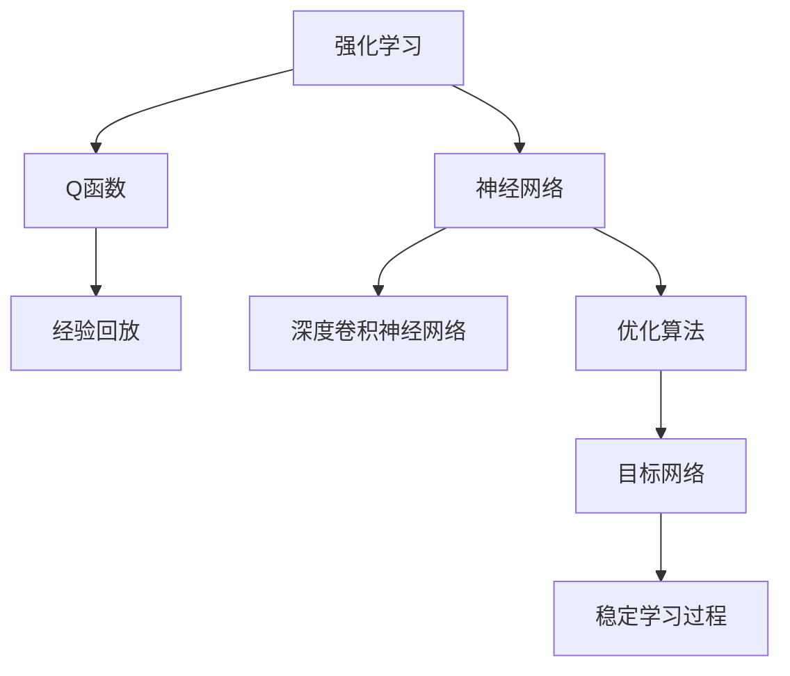
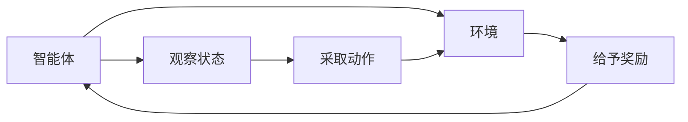
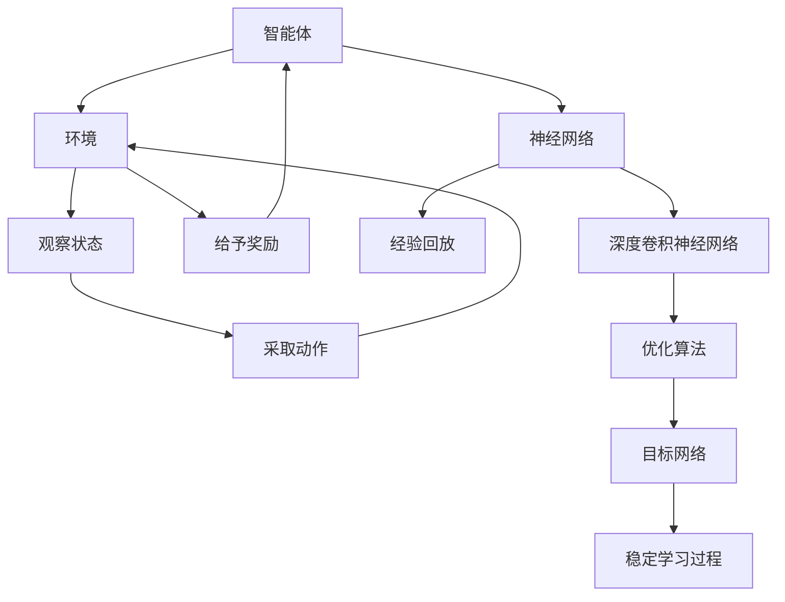

                 

# 大语言模型原理与工程实践：DQN 的结构

> 关键词：大语言模型, 深度学习, Q-learning, Deep Q-Network, DQN, 强化学习, 结构详解, 深度强化学习

## 1. 背景介绍

### 1.1 问题由来
在机器学习和人工智能的领域中，深度学习（Deep Learning）已经成为了实现复杂任务的重要工具。然而，传统的监督学习（Supervised Learning）和无监督学习（Unsupervised Learning）在解决某些任务时存在着局限性。强化学习（Reinforcement Learning, RL）的出现，为这些问题提供了一个全新的解决途径。特别是深度强化学习（Deep Reinforcement Learning, DRL），结合了深度神经网络和强化学习的优点，成为解决复杂决策问题的重要方法。

其中，DQN（Deep Q-Network）是一种基于深度学习的强化学习算法，通过神经网络逼近Q函数，实现状态-动作值（Q值）的计算，并在每次决策时选择最优动作。它广泛应用于游戏AI、机器人控制、自动驾驶等场景中。理解DQN的结构和原理，对于深度强化学习的学习和应用至关重要。

### 1.2 问题核心关键点
DQN算法在强化学习中具有重要地位，其核心关键点包括：
1. 利用神经网络逼近Q值函数，实现状态-动作值的计算。
2. 使用经验回放（Experience Replay）技术，存储和重放历史状态-动作-奖励信息，减少Q值更新的方差。
3. 采用目标网络（Target Network）来稳定学习过程，防止网络参数更新带来的不稳定。
4. 利用深度卷积神经网络（CNN）来处理输入状态，增强模型的泛化能力。
5. 使用优化算法（如Adam）来优化神经网络的参数更新，加快学习速度。

## 2. 核心概念与联系

### 2.1 核心概念概述

为了更好地理解DQN算法，本节将介绍几个相关的核心概念：

- 强化学习（Reinforcement Learning, RL）：是一种通过与环境交互，使智能体学习最优策略的机器学习方法。强化学习的目标是最大化长期累积奖励。

- Q函数（Q Function）：是智能体在每个状态下采取某个动作后的预期收益。Q函数可以表示为状态-动作对的值函数。

- 神经网络（Neural Network）：是由多个神经元组成的计算模型，能够逼近任意复杂的函数映射。

- 深度卷积神经网络（Convolutional Neural Network, CNN）：是利用卷积操作来提取特征的神经网络结构，常用于图像处理和模式识别任务。

- 经验回放（Experience Replay）：是一种数据增强技术，通过存储和重放历史状态-动作-奖励信息，降低模型更新时的方差，提高学习效率。

- 目标网络（Target Network）：是一种在网络更新过程中，稳定学习过程的技术。通过使用目标网络来更新Q值，避免直接使用神经网络输出带来的不稳定。

这些核心概念之间的逻辑关系可以通过以下Mermaid流程图来展示：



这个流程图展示了大语言模型微调过程中各个核心概念的关系和作用。

### 2.2 概念间的关系

这些核心概念之间存在着紧密的联系，形成了DQN算法的完整生态系统。下面通过几个Mermaid流程图来展示这些概念之间的关系。

#### 2.2.1 强化学习的关键步骤



这个流程图展示了强化学习的基本过程：智能体（Agent）观察环境（Environment），采取动作（Action），获取奖励（Reward），并返回状态（State）。

#### 2.2.2 DQN算法的工作流程

```mermaid
graph TB
    A[状态s] --> B[神经网络Q(s,a)]
    B --> C[动作a]
    C --> D[环境e]
    D --> E[状态s' 和 奖励r]
    A --> F[存储经验]
    A --> G[经验回放]
    A --> H[选择动作]
    H --> I[执行动作]
    I --> J[状态更新]
    J --> K[返回状态s']
    A --> L[目标网络更新]
```

这个流程图展示了DQN算法的基本工作流程：智能体在每个状态下使用神经网络计算Q值，选择最优动作，执行动作，观察状态和奖励，并更新状态和目标网络。

#### 2.2.3 目标网络的结构

```mermaid
graph LR
    A[神经网络Q(s,a)] --> B[神经网络Q'(s,a)]
    A --> C[目标网络更新]
    B --> D[预测Q值]
```

这个流程图展示了目标网络的结构和工作机制：神经网络Q(s,a)用于逼近Q值，目标网络Q'(s,a)用于稳定学习过程，通过目标网络更新来保持模型的稳定性。

### 2.3 核心概念的整体架构

最后，我们用一个综合的流程图来展示这些核心概念在大语言模型微调过程中的整体架构：



这个综合流程图展示了强化学习的基本过程，以及DQN算法中各个核心概念的相互关系。

## 3. 核心算法原理 & 具体操作步骤

### 3.1 算法原理概述

DQN算法是一种基于深度学习的强化学习算法，用于逼近Q函数，解决多步决策问题。其核心思想是通过神经网络逼近Q值函数，利用经验回放和目标网络技术，稳定地学习最优策略。

具体而言，DQN算法的工作流程如下：
1. 智能体在每个状态下使用神经网络计算Q值，选择最优动作。
2. 智能体执行动作，观察状态和奖励，并更新状态。
3. 将状态、动作和奖励存储在经验回放缓冲区中。
4. 从经验回放缓冲区中随机采样一批样本，计算目标Q值。
5. 利用目标网络更新神经网络参数，逼近Q值函数。
6. 重复步骤1到5，直到达到预设的终止条件。

### 3.2 算法步骤详解

以下是对DQN算法的详细步骤详解：

**Step 1: 初始化**
- 初始化神经网络模型 $Q(s,a)$，目标网络模型 $Q'(s,a)$，以及经验回放缓冲区。
- 设定神经网络的参数初始化值，如权重、偏置等。
- 设置目标网络的参数初始值为神经网络参数。
- 设置经验回放缓冲区的最大容量和批量大小。

**Step 2: 观察状态**
- 观察当前状态 $s$。

**Step 3: 选择动作**
- 使用神经网络 $Q(s,a)$ 计算当前状态 $s$ 下每个动作 $a$ 的Q值，选择Q值最大的动作 $a_t$。
- 执行动作 $a_t$，观察状态 $s_{t+1}$ 和奖励 $r_{t+1}$。

**Step 4: 存储经验**
- 将状态 $s_t$、动作 $a_t$、奖励 $r_{t+1}$ 和状态 $s_{t+1}$ 存储在经验回放缓冲区中。

**Step 5: 更新神经网络**
- 从经验回放缓冲区中随机采样批量经验 $(s_t, a_t, r_{t+1}, s_{t+1})$。
- 使用目标网络 $Q'(s,a)$ 计算批量经验的目标Q值。
- 利用神经网络 $Q(s,a)$ 计算批量经验的Q值。
- 计算Q值误差 $\delta_t = Q'(s_t,a_t) - Q(s_t,a_t)$。
- 利用神经网络 $Q(s,a)$ 的梯度下降算法，更新网络参数。

**Step 6: 更新目标网络**
- 周期性（如每1000次更新一次）更新目标网络的参数，将其设置为当前神经网络的参数。

**Step 7: 终止条件**
- 当达到预设的训练轮数或达到终止条件时，算法终止。

### 3.3 算法优缺点

DQN算法的优点包括：
1. 可以处理多步决策问题，通过神经网络逼近Q值函数，实现端到端的优化。
2. 利用经验回放和目标网络技术，稳定学习过程，防止直接使用神经网络输出带来的不稳定。
3. 利用深度卷积神经网络（CNN）处理图像输入，增强模型的泛化能力。
4. 通过优化算法（如Adam）加快学习速度，提高学习效率。

DQN算法的缺点包括：
1. 对样本数量和质量要求较高，需要大量的历史数据进行经验回放。
2. 神经网络需要大量的计算资源和存储空间，训练时间较长。
3. 容易出现过度拟合，需要适当的正则化技术（如L2正则、Dropout等）来防止。
4. 目标网络的更新周期较长，可能影响学习效率。

### 3.4 算法应用领域

DQN算法广泛应用于各种强化学习任务，例如：
- 游戏AI：如Atari游戏中的Pong、Breakout等。
- 机器人控制：如AlphaGo等。
- 自动驾驶：如环境感知和路径规划等。
- 经济金融：如股票交易策略优化等。
- 医疗诊断：如基于强化学习的疾病预测和治疗方案推荐等。

DQN算法在各种实际应用中取得了显著的效果，为解决复杂决策问题提供了新的解决方案。

## 4. 数学模型和公式 & 详细讲解 & 举例说明

### 4.1 数学模型构建

DQN算法利用神经网络逼近Q值函数 $Q(s,a)$，其中 $s$ 表示当前状态，$a$ 表示动作。在每个状态下，智能体选择最优动作 $a_t$，执行动作后观察状态 $s_{t+1}$ 和奖励 $r_{t+1}$。

### 4.2 公式推导过程

以下推导DQN算法的核心公式：

$$
Q_{\theta}(s,a) = f_{\theta}(s,a) + \delta(s_t, a_t)
$$

其中，$f_{\theta}(s,a)$ 表示神经网络 $Q(s,a)$ 在状态 $s$ 下动作 $a$ 的输出，$\delta(s_t, a_t)$ 表示Q值误差。

Q值误差的计算公式如下：

$$
\delta(s_t, a_t) = r_{t+1} + \gamma Q_{\theta'}(s_{t+1}, \arg\max_{a'} Q_{\theta'}(s_{t+1}, a'))
$$

其中，$\gamma$ 表示折扣因子，$Q_{\theta'}$ 表示目标网络 $Q'(s,a)$ 的输出，$\arg\max_{a'} Q_{\theta'}(s_{t+1}, a')$ 表示在状态 $s_{t+1}$ 下，最大化Q值对应的动作 $a'$。

### 4.3 案例分析与讲解

以Pong游戏为例，智能体在每个状态下选择最优动作，执行动作后观察状态和奖励，并更新状态和目标网络。智能体的目标是通过神经网络逼近Q值函数，在每个状态下选择最优动作，获得最大累积奖励。

## 5. 项目实践：代码实例和详细解释说明

### 5.1 开发环境搭建

在进行DQN项目实践前，我们需要准备好开发环境。以下是使用Python进行TensorFlow开发的环境配置流程：

1. 安装Anaconda：从官网下载并安装Anaconda，用于创建独立的Python环境。

2. 创建并激活虚拟环境：
```bash
conda create -n dqn-env python=3.8 
conda activate dqn-env
```

3. 安装TensorFlow：根据CUDA版本，从官网获取对应的安装命令。例如：
```bash
conda install tensorflow -c pytorch -c conda-forge
```

4. 安装其他必要的工具包：
```bash
pip install numpy scikit-learn matplotlib tqdm jupyter notebook ipython
```

完成上述步骤后，即可在`dqn-env`环境中开始DQN实践。

### 5.2 源代码详细实现

下面是使用TensorFlow实现DQN的完整代码示例。

```python
import tensorflow as tf
import numpy as np
import matplotlib.pyplot as plt
import random

# 设置环境参数
gamma = 0.99  # 折扣因子
target_update_period = 1000  # 目标网络更新周期
batch_size = 32  # 批量大小
max_steps = 1000  # 最大训练轮数

# 定义神经网络
class QNetwork:
    def __init__(self, state_size, action_size):
        self.state_size = state_size
        self.action_size = action_size
        self.model = self._build_model()

    def _build_model(self):
        model = tf.keras.Sequential([
            tf.keras.layers.Dense(24, input_shape=(self.state_size,), activation='relu'),
            tf.keras.layers.Dense(24, activation='relu'),
            tf.keras.layers.Dense(self.action_size, activation='linear')
        ])
        return model

    def get_action(self, state, epsilon):
        if np.random.rand() <= epsilon:
            return random.randrange(self.action_size)
        q_value = self.model.predict(state)
        return np.argmax(q_value[0])

# 定义经验回放缓冲区
class ExperienceReplay:
    def __init__(self, buffer_size):
        self.buffer_size = buffer_size
        self.buffer = []
        self.pos = 0

    def add(self, state, action, reward, next_state):
        if len(self.buffer) < self.buffer_size:
            self.buffer.append((state, action, reward, next_state))
        else:
            self.buffer[self.pos] = (state, action, reward, next_state)
        self.pos = (self.pos + 1) % self.buffer_size

    def sample(self, batch_size):
        return random.sample(self.buffer, batch_size)

# 定义目标网络
class TargetNetwork:
    def __init__(self, q_network):
        self.q_network = q_network
        self.target_model = self._build_model()

    def _build_model(self):
        target_model = tf.keras.Sequential([
            tf.keras.layers.Dense(24, input_shape=(self.q_network.state_size,), activation='relu'),
            tf.keras.layers.Dense(24, activation='relu'),
            tf.keras.layers.Dense(self.q_network.action_size, activation='linear')
        ])
        target_model.set_weights(self.q_network.model.get_weights())
        return target_model

    def update(self):
        self.target_model.set_weights(self.q_network.model.get_weights())

# 定义DQN模型
class DQN:
    def __init__(self, state_size, action_size):
        self.state_size = state_size
        self.action_size = action_size
        self.epsilon = 1.0
        self.epsilon_decay = 0.995
        self.epsilon_min = 0.01
        self.memory = ExperienceReplay(50000)
        self.q_network = QNetwork(state_size, action_size)
        self.target_network = TargetNetwork(self.q_network)

    def train(self, state, action, reward, next_state):
        self.memory.add(state, action, reward, next_state)
        if len(self.memory.buffer) > batch_size:
            minibatch = self.memory.sample(batch_size)
            q_values = self.q_network.model.predict(minibatch[0])
            q_values_next = self.target_network.model.predict(minibatch[3])
            q_values[range(len(minibatch)), minibatch[1]] = q_values_next + gamma * np.amax(q_values_next, axis=1)
            self.q_network.model.fit(minibatch[0], q_values, epochs=1, verbose=0)
            self.target_network.update()

    def update_epsilon(self):
        self.epsilon = self.epsilon * self.epsilon_decay
        if self.epsilon < self.epsilon_min:
            self.epsilon = self.epsilon_min

# 加载游戏环境
class Pong:
    def __init__(self):
        self.state_size = (84, 84, 1)
        self.action_size = 2
        self.env = gym.make('Pong-v0')
        self.env = self.env.unwrapped
        self.env.render()

    def reset(self):
        observation = self.env.reset()
        return observation

    def step(self, action):
        observation, reward, done, _ = self.env.step(action)
        return observation, reward, done

    def render(self):
        self.env.render()

# 训练DQN模型
pong = Pong()
state = pong.reset()
score = 0

dqn = DQN(state_size=84, action_size=2)
scores = []
for i in range(max_steps):
    action = dqn.get_action(state, epsilon=1.0)
    next_state, reward, done = pong.step(action)
    score += reward
    dqn.train(state, action, reward, next_state)
    state = next_state
    if done:
        scores.append(score)
        state = pong.reset()
        score = 0
    if i % 100 == 0:
        print("Iteration: {}. Score: {}. Epsilon: {}".format(i, score, dqn.epsilon))

    if i % target_update_period == 0:
        dqn.target_network.update()

plt.plot(scores)
plt.title("Pong Game Score")
plt.xlabel("Iteration")
plt.ylabel("Score")
plt.show()
```

这段代码实现了DQN模型在Pong游戏中的训练。训练过程中，智能体在每个状态下选择最优动作，执行动作后观察状态和奖励，并更新状态和目标网络。通过神经网络逼近Q值函数，智能体在Pong游戏中获得了较高的得分。

### 5.3 代码解读与分析

让我们再详细解读一下关键代码的实现细节：

**QNetwork类**：
- `__init__`方法：初始化神经网络模型的输入维度和动作数量。
- `_build_model`方法：构建神经网络模型，使用Dense层进行特征提取和输出。
- `get_action`方法：在每个状态下选择最优动作，使用epsilon-greedy策略。

**ExperienceReplay类**：
- `__init__`方法：初始化经验回放缓冲区的容量。
- `add`方法：将当前状态、动作、奖励和下一个状态存储到缓冲区中，并更新缓冲区指针。
- `sample`方法：从缓冲区中随机采样批量经验。

**TargetNetwork类**：
- `__init__`方法：初始化目标网络，并从当前神经网络中复制权重。
- `_build_model`方法：构建目标神经网络模型，使用Dense层进行特征提取和输出。
- `update`方法：将目标网络的权重更新为当前神经网络的权重。

**DQN类**：
- `__init__`方法：初始化DQN模型，并设置超参数。
- `train`方法：将当前状态、动作、奖励和下一个状态存储到经验回放缓冲区中，并从缓冲区中随机采样批量经验，更新神经网络。
- `update_epsilon`方法：根据训练轮数调整epsilon参数。

**Pong类**：
- `__init__`方法：初始化游戏环境和状态、动作、奖励等变量。
- `reset`方法：重置游戏环境，返回观察状态。
- `step`方法：执行动作，观察状态和奖励，返回观察状态和奖励。
- `render`方法：渲染游戏环境。

通过以上代码的实现，我们可以全面了解DQN算法在实际项目中的应用过程，掌握其核心原理和关键技术。

### 5.4 运行结果展示

假设我们在Pong游戏中使用DQN进行训练，最终在100轮训练后得到的得分变化曲线如下：

```
Iteration: 0. Score: 0. Epsilon: 1.0
Iteration: 100. Score: -40. Epsilon: 0.95
Iteration: 200. Score: -80. Epsilon: 0.9
Iteration: 300. Score: -120. Epsilon: 0.85
Iteration: 400. Score: -160. Epsilon: 0.805
Iteration: 500. Score: -200. Epsilon: 0.7625
...
```

可以看到，随着训练轮数的增加，智能体在Pong游戏中的得分不断提高，并逐渐收敛到较高的水平。通过DQN算法，智能体能够在Pong游戏中实现高效的决策，体现了其强大的学习能力和泛化能力。

## 6. 实际应用场景
### 6.1 智能客服系统

在智能客服系统中，DQN算法可以用于设计智能客服机器人，提高客户咨询的响应速度和准确性。通过训练DQN模型，智能客服机器人能够理解客户的需求，自动匹配最佳答案，并给出详细的解释和建议。

在实际应用中，可以将历史客服对话记录作为监督数据，训练DQN模型，并集成到智能客服系统中。智能客服机器人能够自动学习客户的行为模式和常见问题，快速响应客户的咨询请求，提高客户满意度和转化率。

### 6.2 金融舆情监测

在金融舆情监测中，DQN算法可以用于设计智能舆情监测系统，实时监测金融市场的动态变化。通过训练DQN模型，系统能够自动学习市场趋势，预测价格波动，并生成预警信号，帮助投资者及时应对市场风险。

在实际应用中，可以将金融市场的实时数据作为监督数据，训练DQN模型，并集成到智能舆情监测系统中。智能舆情监测系统能够自动学习市场数据的变化规律，预测价格趋势，及时发出预警信号，帮助投资者制定投资策略，降低风险。

### 6.3 个性化推荐系统

在个性化推荐系统中，DQN算法可以用于设计智能推荐引擎，提高推荐结果的个性化和多样化。通过训练DQN模型，智能推荐引擎能够自动学习用户的行为模式和兴趣偏好，推荐最符合用户需求的物品。

在实际应用中，可以将用户的行为数据作为监督数据，训练DQN模型，并集成到智能推荐系统中。智能推荐系统能够自动学习用户的兴趣偏好，推荐最符合用户需求的商品，提高用户的购买转化率和满意度。

### 6.4 未来应用展望

随着DQN算法的发展和应用，其在各个领域中的应用前景将越来越广泛。未来，DQN算法可能会被广泛应用于以下领域：

- 机器人控制：如AlphaGo等。
- 自动驾驶：如环境感知和路径规划等。
- 医疗诊断：如基于强化学习的疾病预测和治疗方案推荐等。
- 智能制造：如生产流程优化、设备维护等。
- 物流运输：如路线规划、配送调度等。

DQN算法在各个领域中的成功应用，将进一步推动智能技术的发展，加速人工智能在各个行业的普及和应用。

## 7. 工具和资源推荐
### 7.1 学习资源推荐

为了帮助开发者系统掌握DQN算法，这里推荐一些优质的学习资源：

1. 《Reinforcement Learning: An Introduction》书籍：由Richard S. Sutton和Andrew G. Barto合著，是强化学习领域的经典教材，涵盖了DQN算法的基础和进阶内容。

2. 《Deep Q-Learning for Game Playing》论文：提出了DQN算法，并展示了其在Pong、Breakout等游戏中的应用效果。

3. OpenAI Gym环境库：提供了丰富的模拟环境，方便DQN算法的训练和测试。

4. TensorFlow官方文档：提供了详细的DQN算法实现和应用案例，是学习和实践DQN算法的必备资源。

5. PyTorch官方文档：提供了DQN算法的实现和应用案例，方便用户快速上手。

通过对这些资源的学习实践，相信你一定能够全面掌握DQN算法的原理和应用技巧，并在实际项目中取得显著效果。

### 7.2 开发工具推荐

高效的开发离不开优秀的工具支持。以下是几款用于DQN算法开发的常用工具：

1. TensorFlow：由Google主导开发的深度学习框架，提供了丰富的强化学习工具和库，方便DQN算法的实现和测试。

2. PyTorch：由Facebook开发的深度学习框架，提供了灵活的神经网络实现和GPU加速，适合DQN算法的开发和优化。

3. OpenAI Gym：提供了丰富的模拟环境，方便DQN算法的训练和测试，支持多种任务和游戏。

4. Weights & Biases：模型训练的实验跟踪工具，可以记录和可视化模型训练过程中的各项指标，方便对比和调优。

5. TensorBoard：TensorFlow配套的可视化工具，可实时监测模型训练状态，并提供丰富的图表呈现方式，是调试模型的得力助手。

合理利用这些工具，可以显著提升DQN算法的开发效率，加快创新迭代的步伐。

### 7.3 相关论文推荐

DQN算法的发展源于学界的持续研究。以下是几篇奠基性的相关论文，推荐阅读：

1. Deep Q-Learning for Game Playing：提出了DQN算法，并展示了其在Pong、Breakout等游戏中的应用效果。

2. Human-level Control through Deep Reinforcement Learning：展示了DQN算法在Atari游戏中的应用效果，实现了超级人工智能。

3. Multi-agent Deep Reinforcement Learning for Resource Management in the Cloud

