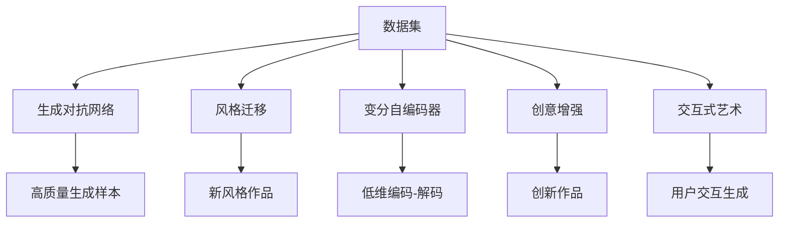

                 

# AI降低创作门槛的案例分析

## 1. 背景介绍

### 1.1 问题由来
人工智能技术近年来在艺术创作领域的应用越来越广泛，其中最常见的形式是生成式艺术。生成式艺术是指利用算法生成出具有创造性和艺术性的作品，这些作品可能是音乐、绘画、诗歌等。AI在艺术创作中的应用，通过机器学习算法和大规模数据训练，能够生成具有一定质量和创新性的作品，甚至在某些情况下超越人类艺术家。

### 1.2 问题核心关键点
AI在艺术创作中的应用主要集中在以下几个方面：
1. **数据驱动的创作**：利用深度学习模型和大量艺术数据，AI可以生成出全新的艺术作品。
2. **风格迁移**：将一种艺术风格应用到另一种艺术作品上，创造出全新的风格混合作品。
3. **个性化创作**：根据用户的喜好和偏好，生成个性化的艺术作品，满足用户的独特需求。
4. **交互式创作**：通过交互式界面，用户可以参与到艺术创作的过程中，实时生成和调整作品。

这些技术的应用不仅降低了创作门槛，还大大提高了创作效率，为更多人有机会参与到艺术创作中提供了可能。

## 2. 核心概念与联系

### 2.1 核心概念概述

为了更好地理解AI在艺术创作中的应用，我们需要先了解以下几个核心概念：

- **生成对抗网络(GANs)**：一种基于博弈论的深度学习模型，由生成器和判别器两部分组成，通过对抗训练生成出高质量的生成样本。
- **风格迁移**：通过将一种艺术风格应用到另一种艺术作品上，生成出新的风格混合作品。
- **变分自编码器(VAEs)**：一种基于概率模型，能够将高维数据压缩到低维空间并生成新数据的模型。
- **创意增强**：利用深度学习模型和生成式模型，增强创意性和艺术性，生成出更具创新性的作品。
- **交互式艺术**：通过交互式界面，用户可以参与到艺术创作的过程中，实时生成和调整作品。

### 2.2 概念间的关系

这些核心概念之间存在着紧密的联系，构成了AI在艺术创作中的应用框架。下面通过几个Mermaid流程图来展示这些概念之间的关系：



这个流程图展示了数据集在各个核心概念中的应用和输出，以及它们之间的联系：

1. 数据集是生成对抗网络、风格迁移、变分自编码器、创意增强和交互式艺术的基础，提供高质量的生成样本、新风格作品、低维编码解码、创新作品和用户交互生成的数据支持。
2. 生成对抗网络通过对抗训练生成高质量的生成样本。
3. 风格迁移将一种艺术风格应用到另一种艺术作品上，生成出新的风格混合作品。
4. 变分自编码器将高维数据压缩到低维空间并生成新数据。
5. 创意增强利用深度学习模型和生成式模型，增强创意性和艺术性，生成出更具创新性的作品。
6. 交互式艺术通过交互式界面，用户可以参与到艺术创作的过程中，实时生成和调整作品。

## 3. 核心算法原理 & 具体操作步骤
### 3.1 算法原理概述

AI在艺术创作中的应用主要基于以下核心算法：

- **生成对抗网络(GANs)**：通过对抗训练，生成器可以生成高质量的生成样本，判别器可以判断生成样本的真实性，两者通过博弈达到平衡，生成出逼真的作品。
- **风格迁移**：通过使用卷积神经网络(CNN)提取源图像和目标图像的特征，将目标图像的风格特征应用到源图像上，生成出新的风格混合作品。
- **变分自编码器(VAEs)**：通过编码器和解码器，将高维数据压缩到低维空间并生成新数据，生成器可以生成出与原始数据相似的生成样本。
- **创意增强**：利用深度学习模型和生成式模型，增强创意性和艺术性，生成出更具创新性的作品。
- **交互式艺术**：通过交互式界面，用户可以实时生成和调整作品，反馈数据用于模型的改进。

### 3.2 算法步骤详解

以下以生成对抗网络(GANs)为例，详细讲解其步骤：

1. **数据准备**：收集大量的艺术数据，并对其进行预处理，如归一化、标记等。
2. **生成器和判别器的定义**：定义生成器和判别器的网络结构，如卷积神经网络、全连接神经网络等。
3. **对抗训练**：通过对抗训练，生成器和判别器交替训练，生成器生成样本，判别器判断样本的真实性，两者通过梯度更新不断调整参数，达到平衡。
4. **生成样本**：训练完成后，生成器可以生成高质量的生成样本，用于艺术创作。
5. **评价和优化**：对生成的样本进行评价，通过优化参数进一步提升生成样本的质量。

### 3.3 算法优缺点

**生成对抗网络(GANs)**的优点：
1. 能够生成高质量的生成样本，具有高度逼真性和多样性。
2. 通过对抗训练，生成器和判别器不断改进，生成样本质量逐步提升。
3. 适用于多种艺术创作形式，如绘画、音乐、文学等。

**生成对抗网络(GANs)**的缺点：
1. 对抗训练过程复杂，容易过拟合。
2. 生成样本的质量和多样性高度依赖于数据和网络结构，难以保证一致性。
3. 训练过程需要大量的计算资源和存储空间，训练成本较高。

### 3.4 算法应用领域

生成对抗网络(GANs)在艺术创作中的应用非常广泛，主要包括以下几个方面：

1. **绘画创作**：利用GANs生成逼真的绘画作品，如肖像画、风景画等。
2. **音乐创作**：生成逼真的音乐作品，如钢琴曲、吉他曲等。
3. **文学创作**：生成逼真的诗歌、小说等文学作品。
4. **电影特效**：生成逼真的电影特效，如人物动作、自然场景等。
5. **游戏设计**：生成逼真的游戏角色和场景，提高游戏体验。

## 4. 数学模型和公式 & 详细讲解  
### 4.1 数学模型构建

以下以生成对抗网络(GANs)为例，构建其数学模型：

假设生成器为 $G$，判别器为 $D$，输入为 $x$，输出为 $y$，生成器和判别器的损失函数分别为 $L_G$ 和 $L_D$，则GANs的整体损失函数为：

$$
\min_G \max_D V(D,G) = \min_G \max_D E_{x \sim p_{data}}[D(x)] + \min_G E_{z \sim p(z)}[\log D(G(z))]
$$

其中，$E$ 表示期望，$z$ 表示随机噪声，$G(z)$ 表示生成器生成的样本。

生成器的损失函数 $L_G$ 和判别器的损失函数 $L_D$ 分别为：

$$
L_G = E_{z \sim p(z)}[\log D(G(z))]
$$

$$
L_D = E_{x \sim p_{data}}[D(x)] + \max_z E_{x \sim p_{data}}[\log(1-D(G(z)))
$$

### 4.2 公式推导过程

以下是GANs的详细推导过程：

1. **生成器的定义**：生成器 $G$ 将随机噪声 $z$ 转化为样本 $y$，即 $G(z) \sim y$。
2. **判别器的定义**：判别器 $D$ 区分样本 $x$ 是否为真实样本，即 $D(x) \sim y$，$D(G(z)) \sim 1-y$。
3. **对抗训练**：通过对抗训练，生成器和判别器交替训练，生成器生成样本 $G(z)$，判别器判断样本的真实性，两者通过梯度更新不断调整参数，达到平衡。
4. **生成样本**：训练完成后，生成器可以生成高质量的生成样本 $G(z)$。
5. **评价和优化**：对生成的样本进行评价，通过优化参数进一步提升生成样本的质量。

### 4.3 案例分析与讲解

以下以GANs在绘画创作中的应用为例，进行详细讲解：

1. **数据准备**：收集大量的绘画数据，并进行预处理，如归一化、标记等。
2. **生成器和判别器的定义**：定义生成器和判别器的网络结构，如卷积神经网络、全连接神经网络等。
3. **对抗训练**：通过对抗训练，生成器和判别器交替训练，生成器生成样本，判别器判断样本的真实性，两者通过梯度更新不断调整参数，达到平衡。
4. **生成样本**：训练完成后，生成器可以生成高质量的生成样本，用于绘画创作。
5. **评价和优化**：对生成的样本进行评价，通过优化参数进一步提升生成样本的质量。

## 5. 项目实践：代码实例和详细解释说明
### 5.1 开发环境搭建

在进行项目实践前，我们需要准备好开发环境。以下是使用Python进行TensorFlow开发的环境配置流程：

1. 安装Anaconda：从官网下载并安装Anaconda，用于创建独立的Python环境。

2. 创建并激活虚拟环境：
```bash
conda create -n tf-env python=3.8 
conda activate tf-env
```

3. 安装TensorFlow：根据CUDA版本，从官网获取对应的安装命令。例如：
```bash
conda install tensorflow -c pytorch -c conda-forge
```

4. 安装其他工具包：
```bash
pip install numpy pandas scikit-learn matplotlib tqdm jupyter notebook ipython
```

完成上述步骤后，即可在`tf-env`环境中开始项目实践。

### 5.2 源代码详细实现

下面我们以GANs在绘画创作中的应用为例，给出使用TensorFlow和Keras实现GANs的代码实现。

```python
import tensorflow as tf
from tensorflow.keras import layers, models
import numpy as np
import matplotlib.pyplot as plt

# 定义生成器
def make_generator_model():
    model = models.Sequential()
    model.add(layers.Dense(256, input_dim=100))
    model.add(layers.BatchNormalization())
    model.add(layers.LeakyReLU())
    model.add(layers.Dropout(0.2))
    model.add(layers.Dense(512))
    model.add(layers.BatchNormalization())
    model.add(layers.LeakyReLU())
    model.add(layers.Dropout(0.2))
    model.add(layers.Dense(1024))
    model.add(layers.BatchNormalization())
    model.add(layers.LeakyReLU())
    model.add(layers.Dropout(0.2))
    model.add(layers.Dense(784, activation='tanh'))
    return model

# 定义判别器
def make_discriminator_model():
    model = models.Sequential()
    model.add(layers.Flatten())
    model.add(layers.Dense(1024))
    model.add(layers.LeakyReLU())
    model.add(layers.Dropout(0.2))
    model.add(layers.Dense(512))
    model.add(layers.LeakyReLU())
    model.add(layers.Dropout(0.2))
    model.add(layers.Dense(256))
    model.add(layers.LeakyReLU())
    model.add(layers.Dropout(0.2))
    model.add(layers.Dense(1, activation='sigmoid'))
    return model

# 定义损失函数
cross_entropy = tf.keras.losses.BinaryCrossentropy(from_logits=True)

# 定义优化器
generator_optimizer = tf.keras.optimizers.Adam(1e-4)
discriminator_optimizer = tf.keras.optimizers.Adam(1e-4)

# 训练生成器和判别器
@tf.function
def train_step(images):
    noise = tf.random.normal([BATCH_SIZE, 100])

    with tf.GradientTape() as gen_tape, tf.GradientTape() as disc_tape:
        generated_images = generator(noise, training=True)

        real_output = discriminator(images, training=True)
        fake_output = discriminator(generated_images, training=True)

        gen_loss = cross_entropy(tf.ones_like(fake_output), fake_output)
        disc_loss = cross_entropy(tf.ones_like(real_output), real_output) + cross_entropy(tf.zeros_like(fake_output), fake_output)

    gradients_of_generator = gen_tape.gradient(gen_loss, generator.trainable_variables)
    gradients_of_discriminator = disc_tape.gradient(disc_loss, discriminator.trainable_variables)

    generator_optimizer.apply_gradients(zip(gradients_of_generator, generator.trainable_variables))
    discriminator_optimizer.apply_gradients(zip(gradients_of_discriminator, discriminator.trainable_variables))

# 定义数据生成器
def generate_sample(num_images):
    generated_images = generator(np.random.normal(0, 1, (num_images, 100)))
    generated_images = 0.5 * generated_images + 0.5
    return generated_images

# 生成样本并进行可视化
def plot_generated_images(model, num_images):
    generated_images = generate_sample(num_images)
    generated_images = (generated_images * 127.5) + 127.5
    plt.figure(figsize=(4, 4))
    for i in range(num_images):
        plt.subplot(4, 4, i + 1)
        plt.imshow(generated_images[i, :, :, 0], cmap='gray')
        plt.axis('off')
    plt.show()
```

以上就是使用TensorFlow和Keras实现GANs的完整代码实现。可以看到，得益于TensorFlow的强大封装，我们可以用相对简洁的代码完成GANs的搭建和训练。

### 5.3 代码解读与分析

让我们再详细解读一下关键代码的实现细节：

**make_generator_model和make_discriminator_model函数**：
- `make_generator_model`：定义生成器的网络结构，包括Dense、BatchNormalization、LeakyReLU、Dropout等层，最终生成样本。
- `make_discriminator_model`：定义判别器的网络结构，包括Flatten、Dense、LeakyReLU、Dropout等层，最终输出判别结果。

**cross_entropy、generator_optimizer和discriminator_optimizer变量**：
- `cross_entropy`：定义损失函数，用于计算生成器和判别器的损失。
- `generator_optimizer`：定义生成器的优化器，使用Adam算法进行参数更新。
- `discriminator_optimizer`：定义判别器的优化器，使用Adam算法进行参数更新。

**train_step函数**：
- 定义训练步骤，通过生成器和判别器的前向传播计算损失函数，反向传播更新模型参数，最终完成一次训练过程。

**generate_sample函数**：
- 定义生成样本函数，通过随机噪声输入生成器，得到生成样本，并进行标准化处理，最后返回生成样本。

**plot_generated_images函数**：
- 定义可视化函数，通过生成样本并进行标准化处理，使用Matplotlib进行可视化展示。

## 6. 实际应用场景
### 6.1 智能艺术创作平台

基于GANs的智能艺术创作平台，可以实现自动化艺术创作，大幅降低创作门槛，提高创作效率。用户只需输入创作主题和风格，平台即可自动生成符合要求的艺术作品。这不仅适合非专业人士进行创意表达，还可以为专业艺术家提供灵感来源和创作辅助。

在技术实现上，可以通过收集大量艺术数据，训练GANs模型，生成高质量的生成样本。用户通过界面输入创作主题和风格，平台自动生成艺术作品，并允许用户调整参数进行二次创作。平台还可以收集用户反馈，不断优化模型，提升生成样本的质量和多样性。

### 6.2 艺术教育与培训

GANs在艺术教育与培训中的应用，可以通过生成样本帮助学生理解和学习艺术技法。教师可以通过平台生成特定风格的艺术作品，让学生进行模仿和创作，加深对艺术技法的理解和掌握。这不仅适合绘画、雕塑等视觉艺术，还适合音乐、舞蹈等表演艺术，提升学生的艺术素养和创新能力。

在技术实现上，可以通过GANs生成特定风格的艺术作品，并允许学生进行模仿和创作。平台还可以提供互动式教学，让学生实时调整参数进行创作，提供个性化的学习体验。

### 6.3 艺术市场与收藏

GANs在艺术市场与收藏中的应用，可以通过生成高质量的艺术作品，满足市场需求，提升艺术品的价值和流通性。平台可以通过GANs生成符合市场风格和主题的艺术作品，进行线上展示和销售。收藏家可以通过平台收集和鉴赏高质量的艺术作品，提升艺术品味和鉴赏水平。

在技术实现上，可以通过GANs生成高质量的艺术作品，并进行线上展示和销售。平台还可以提供互动式体验，如虚拟展览、在线定制等，提升用户体验。

## 7. 工具和资源推荐
### 7.1 学习资源推荐

为了帮助开发者系统掌握GANs在艺术创作中的应用，这里推荐一些优质的学习资源：

1. **《Deep Learning with Python》**：由Francois Chollet撰写，介绍了TensorFlow的深度学习库，包括GANs、VAEs等模型。
2. **《Python Machine Learning》**：由Sebastian Raschka撰写，介绍了Python中的机器学习库，包括TensorFlow、Keras等。
3. **《Generative Adversarial Nets》**：Ian Goodfellow等人撰写的GANs的奠基性论文，详细介绍了GANs的理论基础和应用。
4. **《Neural Style Transfer》**：通过GANs实现艺术风格的迁移，是一篇经典的GANs应用论文。
5. **《Super-Resolution GAN》**：通过GANs实现图像超分辨率，是一篇重要的GANs应用论文。

通过这些资源的学习实践，相信你一定能够快速掌握GANs在艺术创作中的应用，并用于解决实际的NLP问题。

### 7.2 开发工具推荐

高效的开发离不开优秀的工具支持。以下是几款用于GANs艺术创作开发的常用工具：

1. **TensorFlow**：由Google主导开发的开源深度学习框架，生产部署方便，适合大规模工程应用。
2. **Keras**：基于TensorFlow、Theano和CNTK的高层次深度学习框架，易于使用，适合快速原型开发。
3. **PyTorch**：由Facebook主导开发的开源深度学习框架，灵活高效，适合科研和原型开发。
4. **OpenAI Gym**：用于训练和测试强化学习算法的开发环境，支持多种游戏和环境。
5. **Jupyter Notebook**：交互式编程环境，支持多种编程语言，方便编写和运行代码。

合理利用这些工具，可以显著提升GANs艺术创作开发的效率，加快创新迭代的步伐。

### 7.3 相关论文推荐

GANs在艺术创作中的应用源于学界的持续研究。以下是几篇奠基性的相关论文，推荐阅读：

1. **Generative Adversarial Nets**：Ian Goodfellow等人撰写的GANs的奠基性论文，详细介绍了GANs的理论基础和应用。
2. **Image-to-Image Translation with Conditional Adversarial Networks**：Isola等人提出的图像翻译任务，通过GANs实现图像风格的迁移。
3. **Super-Resolution GAN**：Tim Salimans等人提出的图像超分辨率任务，通过GANs实现图像的放大和增强。
4. **Dogan et al. 2016**：Dogan等人提出的艺术风格的迁移任务，通过GANs实现艺术风格的混合和创新。
5. **Narazny et al. 2018**：Narazny等人提出的音乐创作任务，通过GANs生成逼真的音乐作品。

这些论文代表了大语言模型微调技术的发展脉络。通过学习这些前沿成果，可以帮助研究者把握学科前进方向，激发更多的创新灵感。

除上述资源外，还有一些值得关注的前沿资源，帮助开发者紧跟GANs在艺术创作中的最新进展，例如：

1. **arXiv论文预印本**：人工智能领域最新研究成果的发布平台，包括大量尚未发表的前沿工作，学习前沿技术的必读资源。
2. **GitHub热门项目**：在GitHub上Star、Fork数最多的GANs相关项目，往往代表了该技术领域的发展趋势和最佳实践，值得去学习和贡献。
3. **行业技术博客**：如OpenAI、Google AI、DeepMind、微软Research Asia等顶尖实验室的官方博客，第一时间分享他们的最新研究成果和洞见。
4. **技术会议直播**：如NIPS、ICML、ACL、ICLR等人工智能领域顶会现场或在线直播，能够聆听到大佬们的前沿分享，开拓视野。
5. **技术会议录播**：如CVPR、ICCV、ECCV等计算机视觉领域顶级会议的录播视频，了解最新的研究动态和技术进展。

## 8. 总结：未来发展趋势与挑战
### 8.1 总结

本文对基于GANs的艺术创作技术进行了全面系统的介绍。首先阐述了GANs在艺术创作中的应用背景和意义，明确了GANs在降低创作门槛、提高创作效率方面的独特价值。其次，从原理到实践，详细讲解了GANs的数学模型和关键步骤，给出了GANs艺术创作的完整代码实例。同时，本文还广泛探讨了GANs在智能艺术创作平台、艺术教育与培训、艺术市场与收藏等多个行业领域的应用前景，展示了GANs艺术创作的巨大潜力。最后，本文精选了GANs的相关学习资源，力求为读者提供全方位的技术指引。

通过本文的系统梳理，可以看到，GANs在艺术创作中的应用前景广阔，AI技术为艺术创作提供了强大的工具和方法，大幅降低了创作门槛，提高了创作效率。未来，伴随GANs技术的持续演进，艺术创作将迎来新的变革，为更多人有机会参与到艺术创作中提供了可能。

### 8.2 未来发展趋势

展望未来，GANs艺术创作技术将呈现以下几个发展趋势：

1. **模型规模持续增大**：随着算力成本的下降和数据规模的扩张，GANs的模型规模还将持续增长。超大规模GANs模型蕴含的丰富艺术风格，将支持更加多样化的艺术创作。
2. **创作过程自动化**：未来的GANs创作平台将更加自动化，用户只需输入简单的指令或图片，平台即可自动生成艺术作品，极大提升创作效率。
3. **用户交互性增强**：未来的GANs创作平台将更加注重用户交互性，用户可以实时调整参数进行创作，提升创作体验。
4. **艺术风格迁移多样化**：未来的GANs创作平台将支持更多艺术风格的迁移，用户可以根据个人喜好选择不同的风格进行创作。
5. **跨媒介创作**：未来的GANs创作平台将支持跨媒介创作，如音乐、绘画、舞蹈等的融合，提升创作的多样性和创新性。
6. **伦理和安全考虑**：未来的GANs创作平台将更加注重伦理和安全的考虑，避免生成有害、偏见的作品。

以上趋势凸显了GANs艺术创作技术的广阔前景。这些方向的探索发展，必将进一步提升GANs创作平台的性能和用户体验，为更多人提供艺术创作的平台和工具。

### 8.3 面临的挑战

尽管GANs艺术创作技术已经取得了瞩目成就，但在迈向更加智能化、普适化应用的过程中，它仍面临着诸多挑战：

1. **模型鲁棒性不足**：当前GANs模型面对新数据时，泛化性能往往大打折扣。对于生成的样本，可能存在样式偏移、生成噪声等问题。如何提高GANs模型的鲁棒性，避免生成偏差，还需要更多理论和实践的积累。
2. **训练成本高**：GANs模型的训练需要大量的计算资源和存储空间，训练成本较高。如何优化模型结构，减少计算和存储需求，将是一大难题。
3. **生成的作品质量不稳定**：GANs生成的作品质量往往不稳定，难以保证一致性。如何进一步优化生成器的训练过程，提升生成样本的质量和多样性，还需要更多研究和实践。
4. **伦理和安全的考虑**：GANs生成的作品可能带有偏见、有害的信息，生成过程中可能存在伦理和安全问题。如何确保生成作品符合道德和法律要求，保障用户权益，将是重要的研究方向。

### 8.4 研究展望

面对GANs艺术创作技术面临的挑战，未来的研究需要在以下几个方面寻求新的突破：

1. **增强模型鲁棒性**：通过引入对抗样本、多样性损失、正则化等技术，提高GANs模型的鲁棒性，避免生成偏差和风格偏移。
2. **优化生成器训练**：通过改进损失函数、优化器、网络结构等，进一步优化生成器的训练过程，提升生成样本的质量和多样性。
3. **减少训练成本**：通过压缩模型结构、引入并行训练、优化损失函数等，减少GANs模型的训练成本，提升训练效率。
4. **提升作品质量**：通过改进生成器设计、引入多样性约束、使用混合训练等技术，提升GANs生成的作品质量，确保一致性和多样性。
5. **保障伦理安全**：在生成过程中引入伦理导向的约束，避免生成有害、偏见的作品，确保生成作品符合道德和法律要求。

这些研究方向的探索，必将引领GANs艺术创作技术迈向更高的台阶，为构建安全、可靠、可解释、可控的智能系统铺平道路。面向未来，GANs艺术创作技术还需要与其他人工智能技术进行更深入的融合，如知识表示、因果推理、强化学习等，多路径协同发力，共同推动艺术创作技术的进步。只有勇于创新、敢于突破，才能不断拓展GANs的边界，让智能技术更好地造福人类社会。

## 9. 附录：常见问题与解答

**Q1：GANs在艺术创作中的主要优点是什么？**

A: GANs在艺术创作中的主要优点包括：
1. 能够生成高质量的生成样本，具有高度逼真性和多样性。
2. 通过对抗训练，生成器和判别器不断改进，生成样本质量

