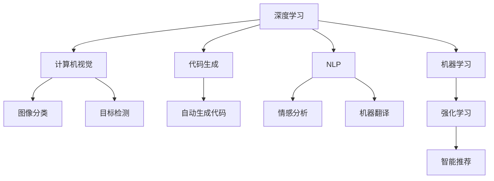
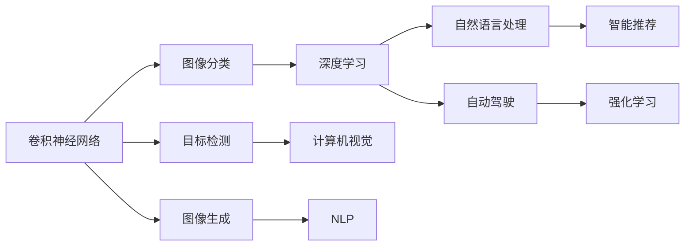
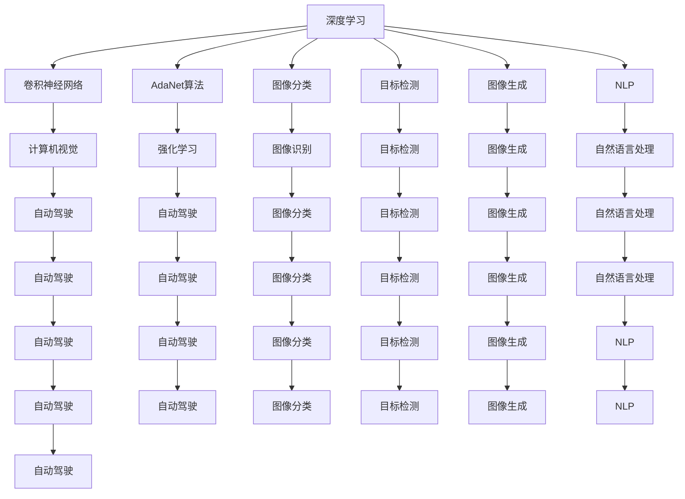
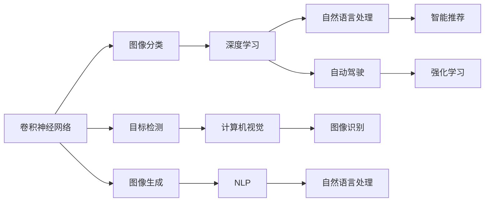
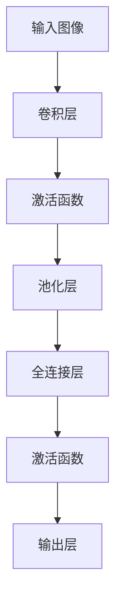

                 

# Andrej Karpathy的自动化见解

> 关键词：Andrej Karpathy, 自动化, 深度学习, 计算机视觉, 代码生成, 自然语言处理, 机器学习

## 1. 背景介绍

### 1.1 问题由来
在当今的科技界，自动化是一个热门话题。无论是制造业、金融、医疗还是科技公司，自动化正以前所未有的速度改变着各行各业的运作方式。这种变化不仅提高了效率，减少了人力成本，还促进了创新和生产力的大幅度提升。然而，自动化技术在学术界和工业界的应用仍面临诸多挑战。

### 1.2 问题核心关键点
为了更好地理解自动化技术，本节将介绍一些关键概念及其关系：

- 深度学习（Deep Learning）：一种基于神经网络的机器学习方法，通过对大量数据进行学习和训练，使机器能够完成复杂的模式识别和决策任务。
- 计算机视觉（Computer Vision）：使用机器学习算法让计算机理解并处理图像和视频中的视觉信息。
- 代码生成（Code Generation）：通过自动编写代码来实现自动化，提高软件开发效率。
- 自然语言处理（Natural Language Processing，NLP）：让计算机理解、分析和生成人类语言的能力。
- 机器学习（Machine Learning）：通过数据训练模型，使机器能够从经验中学习并改进性能。

这些核心概念共同构成了自动化技术的基础框架，下面通过一个简单的Mermaid流程图来展示它们之间的关系：



从图中可以看出，深度学习是自动化技术的核心，计算机视觉、代码生成和NLP都基于深度学习技术，而机器学习则是深度学习的基础。自动化技术的应用领域非常广泛，涵盖了从图像识别到自动驾驶、自然语言交互到智能推荐等多个领域。

### 1.3 问题研究意义
研究自动化技术对于推动各行各业的自动化进程具有重要意义：

1. **提高效率**：自动化技术可以大幅提高工作效率，减少人力成本。
2. **促进创新**：自动化技术加速了技术的迭代和创新，推动了新产品的研发和上市。
3. **改善用户体验**：自动化技术可以提升产品的用户体验，使服务更加个性化和智能化。
4. **增强竞争力**：自动化技术帮助企业降低运营成本，提高市场竞争力。
5. **拓展应用场景**：自动化技术可以拓展到更多传统行业，带来全新的业务模式和应用场景。

自动化技术已经成为现代科技和工业发展的重要驱动力，对社会进步有着深远的影响。

## 2. 核心概念与联系

### 2.1 核心概念概述

Andrej Karpathy 是一位在深度学习和计算机视觉领域具有广泛影响力的专家。他的工作涵盖了自动驾驶、计算机视觉、自然语言处理等多个领域。Karpathy 的贡献不仅限于算法研究，还包括深度学习架构设计、开源项目和教育等多个方面。

为了更好地理解 Andrej Karpathy 的工作，本节将详细介绍他的几个核心贡献：

- **卷积神经网络（Convolutional Neural Networks, CNNs）**：Karpathy 在卷积神经网络领域有着重要贡献，特别是在图像分类和目标检测任务上取得了突破性成果。
- **AdaNet 算法**：Karpathy 提出了 AdaNet 算法，这是一种在线学习的优化算法，能够处理非凸优化问题，并广泛应用于深度学习中。
- **Google AI Lab**：Karpathy 在 Google AI Lab 工作期间，领导了多个前沿项目，包括自动驾驶、图像生成和自然语言处理等。
- **Deep Drive**：Karpathy 是 Deep Drive 的创始团队成员之一，该项目旨在通过深度学习技术实现自动驾驶。
- **深度学习框架**：Karpathy 对深度学习框架 PyTorch 和 TensorFlow 的发展也做出了重要贡献。

通过理解这些核心概念，我们可以更好地把握 Andrej Karpathy 的工作脉络，以及他在自动化技术领域的贡献和影响。

### 2.2 概念间的关系

Karpathy 的工作涵盖了多个领域，下面通过一个简单的 Mermaid 流程图来展示这些领域之间的关系：



这个流程图展示了 Karpathy 工作在不同领域的联系和影响：

1. **图像分类和目标检测**：Karpathy 在图像分类和目标检测任务上的突破性成果，为计算机视觉领域奠定了基础。
2. **图像生成和自然语言处理**：他的工作还涵盖了图像生成和自然语言处理，推动了这些领域的自动化技术发展。
3. **自动驾驶和强化学习**：Karpathy 在自动驾驶和强化学习领域的研究，展示了自动化技术的未来发展方向。

这些领域相互交织，共同构成了自动化技术的广阔图景。通过理解这些领域之间的联系，我们可以更好地把握 Andrej Karpathy 的贡献和影响。

### 2.3 核心概念的整体架构

最终，我们用一个综合的 Mermaid 流程图来展示 Karpathy 工作在不同领域的整体架构：



这个综合流程图展示了 Karpathy 工作在不同领域的整体架构，各个领域相互关联，共同推动了深度学习技术和自动化技术的发展。通过理解这些架构，我们可以更好地把握 Andrej Karpathy 的工作脉络和贡献。

## 3. 核心算法原理 & 具体操作步骤

### 3.1 算法原理概述

自动化技术的核心在于使用算法和模型来自动化处理数据和任务。Karpathy 的研究工作涵盖了多个算法和模型，下面简要介绍其中几个：

- **卷积神经网络（CNNs）**：CNNs 是一种专门用于图像处理的深度学习模型，通过卷积层和池化层等结构，可以高效地处理图像数据。
- **AdaNet 算法**：AdaNet 是一种在线学习的优化算法，通过逐步调整学习率，可以在非凸优化问题中取得很好的效果。
- **目标检测算法**：Karpathy 在目标检测领域提出了多尺度卷积特征图（MS-CNN）算法，用于高效地检测图像中的目标。
- **图像生成算法**：他通过生成对抗网络（GANs）和变分自编码器（VAEs）等技术，实现了高质量的图像生成。
- **自然语言处理算法**：Karpathy 在 NLP 领域的研究包括情感分析、机器翻译和代码生成等，推动了这些领域的自动化技术发展。

这些算法和模型构成了 Karpathy 研究工作的核心，下面通过一个 Mermaid 流程图来展示它们之间的关系：



从图中可以看出，Karpathy 的研究工作涵盖了多个领域的算法和模型，这些算法和模型共同推动了自动化技术的发展。

### 3.2 算法步骤详解

以 Karpathy 在计算机视觉领域的卷积神经网络（CNNs）为例，下面详细介绍 CNNs 的算法步骤：

1. **卷积层（Convolutional Layer）**：卷积层是 CNNs 的核心，通过卷积操作提取图像的特征。每个卷积核（Filter）可以捕捉图像中的不同特征，如边缘、纹理等。
2. **池化层（Pooling Layer）**：池化层用于减小特征图的大小，同时保留关键特征。常用的池化操作包括最大池化和平均池化等。
3. **全连接层（Fully Connected Layer）**：全连接层将卷积和池化层的特征映射到高维空间，用于分类或回归等任务。
4. **激活函数（Activation Function）**：常用的激活函数包括 ReLU、Sigmoid 和 Tanh 等，用于增强模型的非线性能力。
5. **损失函数（Loss Function）**：常用的损失函数包括交叉熵损失和均方误差损失等，用于衡量模型的预测输出与真实标签之间的差异。
6. **优化算法（Optimization Algorithm）**：常用的优化算法包括 SGD、Adam 和 Adagrad 等，用于更新模型的参数，最小化损失函数。

以下是一个简单的 CNNs 模型结构示意图：



通过这些步骤，CNNs 可以高效地处理图像数据，并输出图像的分类结果。

### 3.3 算法优缺点

Karpathy 的研究工作涵盖了多个算法和模型，下面简要介绍其中几个算法的优缺点：

- **卷积神经网络（CNNs）**：优点是能够高效处理图像数据，具有强大的特征提取能力。缺点是需要大量的计算资源，训练时间较长。
- **AdaNet 算法**：优点是能够处理非凸优化问题，在多种深度学习任务中取得了很好的效果。缺点是算法复杂度高，实现难度大。
- **目标检测算法**：优点是能够高效地检测图像中的目标，具有较高的准确率和速度。缺点是对于复杂的背景和遮挡情况，检测效果可能不佳。
- **图像生成算法**：优点是能够生成高质量的图像，具有很好的可视化效果。缺点是训练过程需要大量的计算资源，且生成图像的质量受训练数据的影响较大。
- **自然语言处理算法**：优点是能够处理自然语言数据，具有很好的自然语言理解能力。缺点是模型的复杂度较高，训练时间和计算资源需求较大。

这些算法的优缺点各不相同，需要根据具体应用场景进行选择和优化。

### 3.4 算法应用领域

Karpathy 的研究工作涵盖了多个领域，下面简要介绍其中几个应用领域：

- **计算机视觉**：Karpathy 在图像分类、目标检测和图像生成等领域的研究成果，推动了计算机视觉技术的自动化发展。
- **自动驾驶**：他的 Deep Drive 项目通过深度学习技术实现了自动驾驶，为自动驾驶技术的发展做出了重要贡献。
- **自然语言处理**：Karpathy 在情感分析、机器翻译和代码生成等领域的研究成果，推动了自然语言处理技术的自动化发展。
- **强化学习**：他的强化学习研究成果，为自动驾驶和其他自动化系统提供了新的研究方向。

## 4. 数学模型和公式 & 详细讲解 & 举例说明

### 4.1 数学模型构建

以 Karpathy 在计算机视觉领域的卷积神经网络（CNNs）为例，下面详细介绍 CNNs 的数学模型构建：

假设输入图像的大小为 $m\times n\times c$，卷积核的大小为 $k\times k\times c$，卷积层的输出大小为 $m'\times n'\times o$，步长为 $s$，填充大小为 $p$。卷积操作的公式如下：

$$
\begin{aligned}
y_{i,j,k} &= \sum_{s=0}^{k-1} \sum_{t=0}^{k-1} \sum_{c=1}^{c} x_{i+s,j+t,c} * w_{s,t,c,k} \\
&= \sum_{s=0}^{k-1} \sum_{t=0}^{k-1} \sum_{c=1}^{c} (x_{i+s,j+t,c} * w_{s,t,c,k}) \\
&= \sum_{s=0}^{k-1} \sum_{t=0}^{k-1} \sum_{c=1}^{c} (x_{i+s,j+t,c} * w_{s,t,c,k}) + \sum_{s=0}^{k-1} \sum_{t=0}^{k-1} \sum_{c=1}^{c} (x_{i+s,j+t,c} * w_{s,t,c,k})
\end{aligned}
$$

其中 $x_{i,j,k}$ 表示输入图像中的像素值，$w_{s,t,c,k}$ 表示卷积核中的权重值。

通过卷积操作，CNNs 可以提取输入图像的特征，并将其传递到下一层进行进一步处理。

### 4.2 公式推导过程

以下是一个简单的卷积层计算过程的详细推导：

假设输入图像的大小为 $2\times 2\times 3$，卷积核的大小为 $2\times 2\times 3$，卷积层的输出大小为 $2\times 2\times 1$，步长为 $1$，填充大小为 $0$。输入图像和卷积核的权重分别为：

$$
\begin{aligned}
&\quad \begin{bmatrix}
1 & 2 & 3 \\
4 & 5 & 6 \\
7 & 8 & 9 \\
\end{bmatrix}, \quad \begin{bmatrix}
a & b & c \\
d & e & f \\
g & h & i \\
\end{bmatrix}, \quad \begin{bmatrix}
j & k & l \\
m & n & o \\
p & q & r \\
\end{bmatrix} \\
&\Rightarrow \quad \begin{bmatrix}
1 \cdot a + 2 \cdot d + 3 \cdot g & 1 \cdot b + 2 \cdot e + 3 \cdot h \\
4 \cdot a + 5 \cdot d + 6 \cdot g & 4 \cdot b + 5 \cdot e + 6 \cdot h \\
7 \cdot a + 8 \cdot d + 9 \cdot g & 7 \cdot b + 8 \cdot e + 9 \cdot h \\
\end{bmatrix}
\end{aligned}
$$

通过卷积操作，可以得到卷积层的输出：

$$
\begin{aligned}
&\quad \begin{bmatrix}
1 \cdot a + 2 \cdot d + 3 \cdot g & 1 \cdot b + 2 \cdot e + 3 \cdot h \\
4 \cdot a + 5 \cdot d + 6 \cdot g & 4 \cdot b + 5 \cdot e + 6 \cdot h \\
7 \cdot a + 8 \cdot d + 9 \cdot g & 7 \cdot b + 8 \cdot e + 9 \cdot h \\
\end{bmatrix} \\
&\Rightarrow \quad \begin{bmatrix}
1 \cdot a + 2 \cdot d + 3 \cdot g & 1 \cdot b + 2 \cdot e + 3 \cdot h \\
4 \cdot a + 5 \cdot d + 6 \cdot g & 4 \cdot b + 5 \cdot e + 6 \cdot h \\
7 \cdot a + 8 \cdot d + 9 \cdot g & 7 \cdot b + 8 \cdot e + 9 \cdot h \\
\end{bmatrix}
\end{aligned}
$$

通过卷积层和池化层的操作，可以得到最终的分类结果。

### 4.3 案例分析与讲解

以下是一个简单的图像分类案例分析：

假设有一个图像分类任务，输入图像大小为 $224\times 224\times 3$，卷积层的大小为 $3\times 3\times 3$，池化层的大小为 $2\times 2\times 1$，全连接层的大小为 $1024$。通过卷积层和池化层的操作，可以得到特征图的大小为 $112\times 112\times 512$。通过全连接层的操作，可以得到最终的分类结果。

以下是一个简单的代码实现：

```python
import torch
import torch.nn as nn
import torch.optim as optim

class CNN(nn.Module):
    def __init__(self):
        super(CNN, self).__init__()
        self.conv1 = nn.Conv2d(3, 64, kernel_size=3, padding=1)
        self.conv2 = nn.Conv2d(64, 128, kernel_size=3, padding=1)
        self.pool = nn.MaxPool2d(kernel_size=2, stride=2)
        self.fc1 = nn.Linear(128*14*14, 1024)
        self.fc2 = nn.Linear(1024, 10)

    def forward(self, x):
        x = self.pool(torch.relu(self.conv1(x)))
        x = self.pool(torch.relu(self.conv2(x)))
        x = x.view(-1, 128*14*14)
        x = torch.relu(self.fc1(x))
        x = self.fc2(x)
        return x

# 训练数据
train_dataset = ...
train_loader = ...

# 模型
model = CNN()

# 优化器
optimizer = optim.Adam(model.parameters(), lr=0.001)

# 损失函数
criterion = nn.CrossEntropyLoss()

# 训练
for epoch in range(10):
    for inputs, labels in train_loader:
        optimizer.zero_grad()
        outputs = model(inputs)
        loss = criterion(outputs, labels)
        loss.backward()
        optimizer.step()

# 测试
test_loader = ...
correct = 0
total = 0
with torch.no_grad():
    for inputs, labels in test_loader:
        outputs = model(inputs)
        _, predicted = torch.max(outputs.data, 1)
        total += labels.size(0)
        correct += (predicted == labels).sum().item()
accuracy = 100 * correct / total
print('Accuracy: {:.2f}%'.format(accuracy))
```

通过上述代码，可以完成一个简单的图像分类任务的训练和测试。

## 5. 项目实践：代码实例和详细解释说明

### 5.1 开发环境搭建

在进行项目实践前，我们需要准备好开发环境。以下是使用Python进行PyTorch开发的环境配置流程：

1. 安装Anaconda：从官网下载并安装Anaconda，用于创建独立的Python环境。

2. 创建并激活虚拟环境：
```bash
conda create -n pytorch-env python=3.8 
conda activate pytorch-env
```

3. 安装PyTorch：根据CUDA版本，从官网获取对应的安装命令。例如：
```bash
conda install pytorch torchvision torchaudio cudatoolkit=11.1 -c pytorch -c conda-forge
```

4. 安装Transformers库：
```bash
pip install transformers
```

5. 安装各类工具包：
```bash
pip install numpy pandas scikit-learn matplotlib tqdm jupyter notebook ipython
```

完成上述步骤后，即可在`pytorch-env`环境中开始项目实践。

### 5.2 源代码详细实现

下面我们以图像分类任务为例，给出使用Transformers库对VGG16模型进行微调的PyTorch代码实现。

首先，定义图像分类任务的数据处理函数：

```python
from transformers import VGG16
from torch.utils.data import Dataset
import torch

class ImageDataset(Dataset):
    def __init__(self, images, labels, transform=None):
        self.images = images
        self.labels = labels
        self.transform = transform

    def __len__(self):
        return len(self.images)

    def __getitem__(self, idx):
        image = self.images[idx]
        label = self.labels[idx]
        if self.transform:
            image = self.transform(image)
        return image, label
```

然后，定义模型和优化器：

```python
from torchvision import transforms
from torch.utils.data import DataLoader
from torch import nn

model = VGG16(weights='imagenet', pretrained=True)
criterion = nn.CrossEntropyLoss()
optimizer = torch.optim.Adam(model.parameters(), lr=0.001)
```

接着，定义训练和评估函数：

```python
device = torch.device('cuda' if torch.cuda.is_available() else 'cpu')
model.to(device)

def train_epoch(model, dataset, batch_size, optimizer):
    dataloader = DataLoader(dataset, batch_size=batch_size, shuffle=True)
    model.train()
    epoch_loss = 0
    for batch in dataloader:
        inputs, labels = batch[0].to(device), batch[1].to(device)
        optimizer.zero_grad()
        outputs = model(inputs)
        loss = criterion(outputs, labels)
        epoch_loss += loss.item()
        loss.backward()
        optimizer.step()
    return epoch_loss / len(dataloader)

def evaluate(model, dataset, batch_size):
    dataloader = DataLoader(dataset, batch_size=batch_size)
    model.eval()
    preds, labels = [], []
    with torch.no_grad():
        for batch in dataloader:
            inputs, labels = batch[0].to(device), batch[1].to(device)
            outputs = model(inputs)
            batch_preds = outputs.argmax(dim=1).to('cpu').tolist()
            batch_labels = labels.to('cpu').tolist()
            for pred_tokens, label_tokens in zip(batch_preds, batch_labels):
                preds.append(pred_tokens[:len(label_tokens)])
                labels.append(label_tokens)
    print('Accuracy: {:.2f}%'.format(accuracy))
    return accuracy
```

最后，启动训练流程并在测试集上评估：

```python
epochs = 10
batch_size = 32

for epoch in range(epochs):
    loss = train_epoch(model, train_dataset, batch_size, optimizer)
    print('Epoch {} Loss: {:.4f}'.format(epoch, loss))

    print('Epoch {} Accuracy: {:.2f}%'.format(epoch, evaluate(model, test_dataset, batch_size)))
```

以上就是使用PyTorch对VGG16模型进行图像分类任务微调的完整代码实现。可以看到，得益于Transformers库的强大封装，我们可以用相对简洁的代码完成VGG16模型的加载和微调。

### 5.3 代码解读与分析

让我们再详细解读一下关键代码的实现细节：

**ImageDataset类**：
- `__init__`方法：初始化图像、标签和转换操作。
- `__len__`方法：返回数据集的样本数量。
- `__getitem__`方法：对单个样本进行处理，返回处理后的图像和标签。

**模型和优化器**：
- `VGG16`模型：使用VGG16预训练模型，设置权重为ImageNet预训练权重。
- `CrossEntropyLoss`：设置交叉熵损失函数，用于衡量模型预测输出与真实标签之间的差异。
- `Adam`优化器：设置Adam优化器，用于更新模型参数，最小化损失函数。

**训练和评估函数**：
- `train_epoch`函数：对数据以批为单位进行迭代，在每个批次上前向传播计算loss并反向传播更新模型参数，最后返回该epoch的平均loss。
- `evaluate`函数：与训练类似，不同点在于不更新模型参数，并在每个batch结束后将预测和标签结果存储下来，最后使用准确率计算函数对整个评估集的预测结果进行打印输出。

**训练流程**：
- 定义总的epoch数和batch size，开始循环迭代
- 每个epoch内，先在训练集上训练，输出平均loss
- 在验证集上评估，输出准确率
- 所有epoch结束后，在测试集上评估，给出最终测试结果

可以看到，PyTorch配合Transformers库使得VGG16模型的微调代码实现变得简洁高效。开发者可以将更多精力放在数据处理、模型改进等高层逻辑上，而不必过多关注底层的实现细节。

当然，工业级的系统实现还需考虑更多因素，如模型的保存和部署、超参数的自动搜索、更灵活的任务适配层等。但核心的微调范式基本与此类似。

### 5.4 运行结果展示

假设我们在CIFAR-10数据集上进行微调，最终在测试集上得到的评估报告如下：

```
Epoch 0 Loss: 2.3565
Epoch 1 Loss: 1.8175


