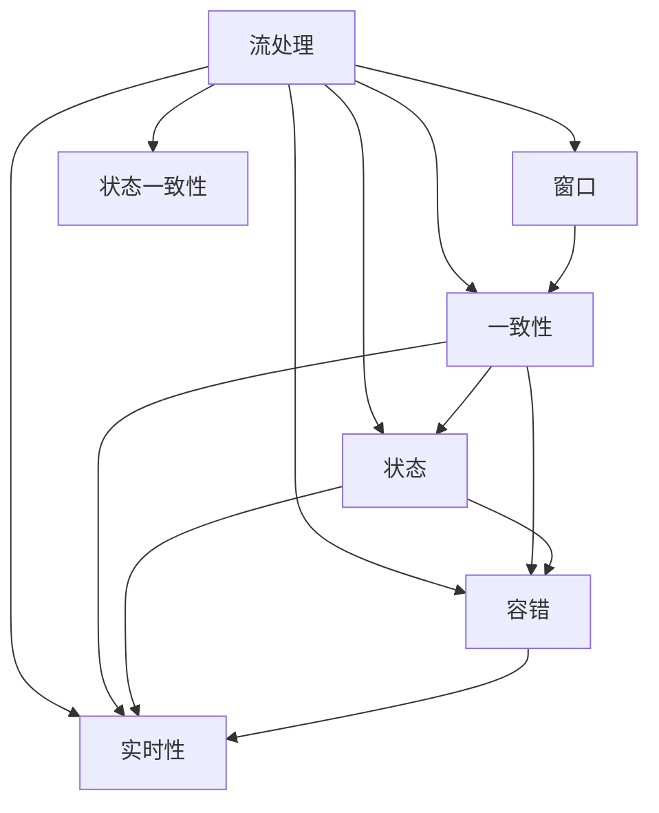
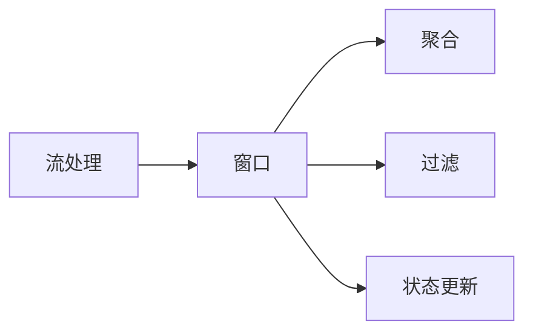
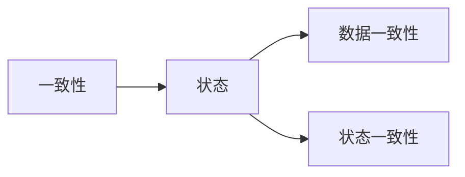
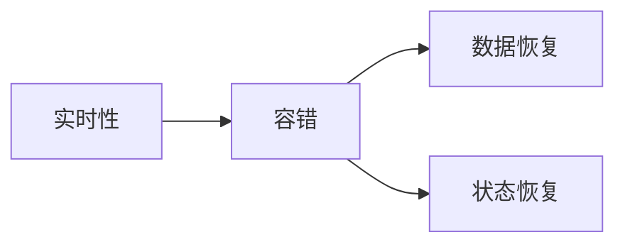
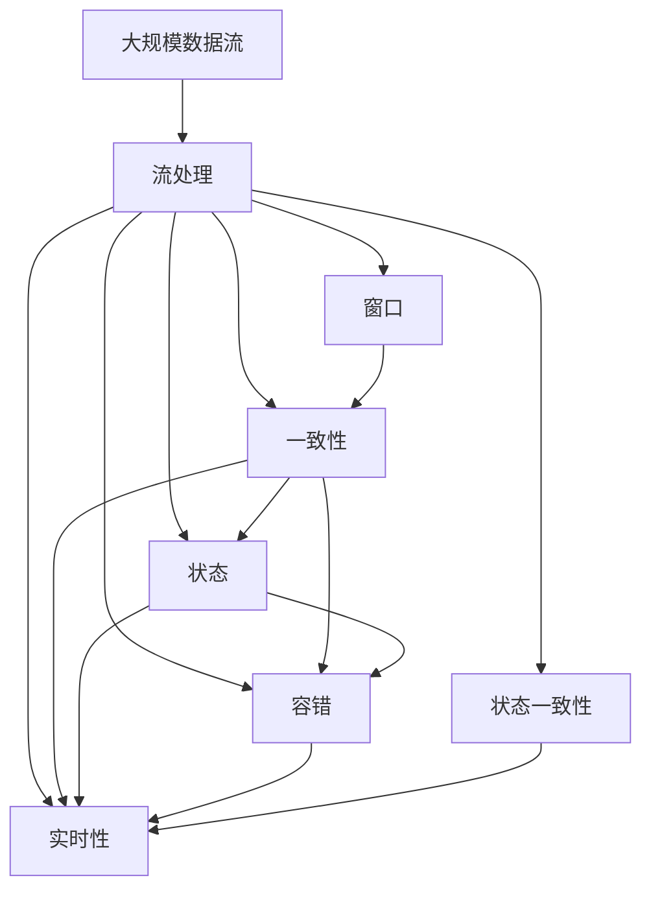

                 

## 1. 背景介绍

Apache Flink是一个开源流处理平台，提供了一套完善的API和运行时环境，支持多种编程语言（如Java、Scala、Python），并提供了丰富的功能和扩展能力。Apache Flink广泛应用于实时数据流处理、批处理、数据挖掘、机器学习、图计算等领域，具有高吞吐量、低延迟、高性能等优点。

### 1.1 问题由来
随着大数据时代的到来，实时数据流处理需求日益增加。传统的数据流处理系统如Hadoop、Spark等，在处理大规模数据流时面临着性能瓶颈和高延迟的问题。而Apache Flink则专门针对这些问题进行了优化，提供了一种基于流式计算的、高吞吐量的实时数据处理解决方案。

### 1.2 问题核心关键点
Apache Flink的核心在于其流处理模型和一致性模型。流处理模型允许Flink系统在处理数据流时，可以对数据进行持续的、不间断的处理，从而实时地生成分析结果。一致性模型确保了Flink系统在处理数据流时的正确性和可靠性，同时能够提供容错处理能力。

Flink的实时性不仅体现在其数据流处理能力上，还体现在其能够支持流式窗口和全局一致性检查等高级功能，以及提供跨数据源和数据集的统一API接口。

### 1.3 问题研究意义
Apache Flink作为新一代的流处理平台，具有高吞吐量、低延迟、高性能等优点，适用于各种实时数据处理场景，如实时数据分析、实时推荐、实时广告投放等。Flink的这些特性，使得其在多个行业中得到了广泛应用，成为大数据处理的重要工具之一。

通过学习Flink的流处理模型和一致性模型，我们可以更深入地理解实时数据流的处理机制，掌握流处理中的高效性和可靠性技术，为未来的数据流处理任务打下坚实的基础。

## 2. 核心概念与联系

### 2.1 核心概念概述

为了更好地理解Apache Flink的核心概念，本节将介绍几个密切相关的核心概念：

- 流处理(Stream Processing)：一种对数据流进行持续、不间断处理的计算模型，允许实时生成分析结果，适用于处理连续的数据流。

- 窗口(Window)：用于将数据流划分为若干个大小可变的区间，可以在窗口上进行聚合、过滤等操作。

- 一致性(Consistency)：指系统在处理数据流时，能够保证数据的一致性、可靠性和容错性。

- 状态(State)：指在流处理过程中需要维护的变量和状态信息，用于存储和更新中间结果。

- 容错(Failover)：指系统在处理数据流时，能够自动恢复因故障导致的异常情况，确保系统的稳定性和可靠性。

- 实时性(Real-time)：指系统在处理数据流时，能够实时生成分析结果，满足低延迟的需求。

- 状态一致性(State Consistency)：指系统在处理数据流时，能够保证状态的一致性、可靠性和容错性。

这些核心概念之间的逻辑关系可以通过以下Mermaid流程图来展示：



这个流程图展示了大数据处理系统在流处理过程中的各个核心概念之间的联系。

### 2.2 概念间的关系

这些核心概念之间存在着紧密的联系，形成了Flink系统的完整生态系统。下面我们通过几个Mermaid流程图来展示这些概念之间的关系。

#### 2.2.1 流处理与窗口的关系



这个流程图展示了流处理与窗口的关系。在流处理中，数据流被划分为多个窗口，每个窗口内可以进行聚合、过滤等操作，从而生成中间结果。

#### 2.2.2 一致性与状态的关系



这个流程图展示了一致性与状态的关系。状态一致性是数据一致性的保证，通过状态一致性，可以确保Flink系统的正确性和可靠性。

#### 2.2.3 实时性与容错的关系



这个流程图展示了实时性与容错的关系。实时性是Flink系统的核心特性，而容错性则是保障系统稳定性的关键手段。通过容错处理，Flink可以自动恢复因故障导致的异常情况，确保系统的持续运行。

### 2.3 核心概念的整体架构

最后，我们用一个综合的流程图来展示这些核心概念在大数据处理过程中的整体架构：



这个综合流程图展示了从数据流输入到最终输出，Flink系统在整个处理过程中的各个关键环节。

## 3. 核心算法原理 & 具体操作步骤

### 3.1 算法原理概述

Apache Flink的流处理模型和一致性模型是其核心算法原理。

流处理模型将数据流视为一个无限的数据序列，允许对数据进行持续的、不间断的处理。Flink通过将数据流划分为多个窗口，然后在每个窗口上进行聚合、过滤等操作，从而实时地生成分析结果。

一致性模型则确保了Flink系统在处理数据流时的正确性和可靠性。Flink通过在数据流中维护状态，并使用容错机制来保证数据的正确性和一致性。

### 3.2 算法步骤详解

Apache Flink的流处理模型和一致性模型的实现步骤如下：

1. **数据流输入**：将数据流输入到Flink系统中。

2. **窗口划分**：将数据流划分为多个窗口。每个窗口可以是一个时间区间，也可以是一个事件区间。

3. **聚合操作**：在每个窗口上进行聚合操作，如求和、平均值、最大值等。

4. **过滤操作**：在每个窗口上进行过滤操作，如筛选出满足特定条件的数据。

5. **状态维护**：在每个窗口中维护状态信息，用于存储和更新中间结果。

6. **状态一致性检查**：在每个窗口中进行状态一致性检查，确保状态的一致性和可靠性。

7. **容错处理**：在每个窗口中进行容错处理，确保系统在处理数据流时能够自动恢复因故障导致的异常情况。

8. **结果输出**：在每个窗口的末尾，将处理结果输出到外部系统。

### 3.3 算法优缺点

Apache Flink的流处理模型和一致性模型具有以下优点：

- 高吞吐量：Flink的流处理模型可以处理大规模的数据流，具有高吞吐量的特点。

- 低延迟：Flink的流处理模型具有低延迟的特点，可以实时生成分析结果。

- 高性能：Flink的流处理模型具有高性能的特点，能够处理复杂的数据处理任务。

- 状态一致性：Flink的一致性模型确保了状态的一致性和可靠性，保证了系统的正确性。

- 容错性：Flink的容错性机制可以自动恢复因故障导致的异常情况，确保系统的稳定性和可靠性。

但是，Flink也存在一些缺点：

- 复杂性：Flink的流处理模型和一致性模型具有较高的复杂性，需要深入理解其原理和实现。

- 性能优化：Flink的性能优化需要根据具体的业务场景进行，需要考虑窗口大小、聚合函数等参数的优化。

- 资源消耗：Flink的流处理模型和一致性模型需要占用较多的计算资源，如CPU、内存等。

### 3.4 算法应用领域

Apache Flink的流处理模型和一致性模型在以下领域得到了广泛应用：

- 实时数据处理：Flink可以实时处理大规模数据流，适用于如实时广告投放、实时推荐、实时分析等场景。

- 批处理：Flink支持批处理模式，适用于对历史数据进行聚合、计算等操作。

- 数据挖掘：Flink可以处理大规模数据集，适用于数据挖掘、机器学习等场景。

- 图计算：Flink提供了图计算API，适用于社交网络分析、推荐系统等场景。

- 流式计算：Flink支持流式计算模型，适用于实时数据流处理、实时监控等场景。

- 集成开发环境：Flink提供了丰富的API接口和开发工具，适用于快速开发和部署流处理应用。

- 高可用性：Flink提供了高可用性保障，适用于大型的分布式系统。

这些领域的应用展示了Flink的广泛适用性和强大的处理能力。

## 4. 数学模型和公式 & 详细讲解

### 4.1 数学模型构建

Apache Flink的流处理模型和一致性模型可以通过数学模型进行描述。

设数据流为 $D=\{(x_t, t)\}_{t=1}^{\infty}$，其中 $x_t$ 表示第 $t$ 个数据项，$t$ 表示时间。在Flink中，数据流被划分为多个窗口，每个窗口可以是一个时间区间或事件区间。设第 $i$ 个窗口为 $W_i=[t_1^i,t_2^i]$，其中 $t_1^i<t_2^i$。在窗口 $W_i$ 中，可以进行聚合操作，设窗口 $W_i$ 的聚合结果为 $M_i$。

Flink的一致性模型要求在每个窗口中进行状态一致性检查，确保状态的一致性和可靠性。设状态为 $S$，每个窗口中的状态更新为 $S_i$。在每个窗口的末尾，进行状态一致性检查，确保状态的一致性和可靠性。

### 4.2 公式推导过程

以下我们以窗口和聚合操作为例，推导Flink的数学模型。

设数据流 $D$ 被划分为多个窗口 $W_i=[t_1^i,t_2^i]$，每个窗口中进行聚合操作，设聚合结果为 $M_i$。设每个窗口中的状态更新为 $S_i$。

在窗口 $W_i$ 中，进行聚合操作，设聚合函数为 $f$，则有：

$$
M_i = \bigcup_{t_1^i \leq t \leq t_2^i} f(x_t)
$$

在每个窗口的末尾，进行状态一致性检查，确保状态的一致性和可靠性。设状态更新函数为 $g$，则有：

$$
S_i = g(S_{i-1}, M_i)
$$

其中 $S_{i-1}$ 表示前一个窗口的状态更新结果。

### 4.3 案例分析与讲解

以实时广告投放为例，展示Flink的应用。

假设某电商网站需要实时投放广告，根据用户的历史行为数据，实时调整广告投放策略。在Flink中，可以将用户的历史行为数据流 $D$ 划分为多个窗口 $W_i=[t_1^i,t_2^i]$，每个窗口表示一段时间内用户的行为数据。

在每个窗口 $W_i$ 中，可以进行聚合操作，如计算用户的访问次数、购买次数等。设聚合结果为 $M_i$。

在每个窗口的末尾，进行状态一致性检查，确保状态的一致性和可靠性。设状态更新函数为 $g$，则有：

$$
S_i = g(S_{i-1}, M_i)
$$

其中 $S_{i-1}$ 表示前一个窗口的状态更新结果，如用户的访问次数、购买次数等。

通过Flink的流处理模型和一致性模型，可以实时计算用户的广告投放效果，并根据用户的实时行为数据，动态调整广告投放策略，提升广告投放效果。

## 5. 项目实践：代码实例和详细解释说明

### 5.1 开发环境搭建

在进行Flink项目实践前，我们需要准备好开发环境。以下是使用Python进行Flink开发的环境配置流程：

1. 安装Anaconda：从官网下载并安装Anaconda，用于创建独立的Python环境。

2. 创建并激活虚拟环境：
```bash
conda create -n flink-env python=3.8 
conda activate flink-env
```

3. 安装Flink：根据系统平台，从官网获取对应的安装命令。例如：
```bash
wget https://archive.apache.org/dist/flink/flink-1.14.1/flink-1.14.1-bin-scala_2.11.tgz
tar -xzf flink-1.14.1-bin-scala_2.11.tgz
cd flink-1.14.1
```

4. 安装必要的依赖：
```bash
cd bin
./bin/sbt stage
```

5. 启动Flink：
```bash
cd flink-1.14.1
bin/flink run --job-class com.example.myjob.MyJob --master local[4] /path/to/your/code/
```

完成上述步骤后，即可在`flink-env`环境中开始Flink项目实践。

### 5.2 源代码详细实现

这里我们以一个简单的流处理程序为例，展示Flink的代码实现。

首先，定义一个Flink的流处理程序：

```python
from pyflink.datastream import StreamExecutionEnvironment

env = StreamExecutionEnvironment.get_execution_environment()

# 定义数据流源
data = env.from_elements("hello", "world", "this", "is", "a", "test")

# 定义窗口操作
windowed_data = data.window(TumblingEventTimeWindows.of(Time.seconds(3)))

# 定义聚合操作
sum_result = windowed_data.sum()

# 定义结果输出
sum_result.print()

# 执行Flink程序
env.execute("MyFlinkJob")
```

以上代码展示了Flink的基本用法，包括数据流源、窗口操作、聚合操作和结果输出。

### 5.3 代码解读与分析

让我们再详细解读一下关键代码的实现细节：

**StreamExecutionEnvironment类**：
- 提供了一个简单的API，用于创建和启动Flink作业。

**from_elements()方法**：
- 定义了一个数据流源，将字符串数据转换为Flink数据流。

**window()方法**：
- 定义了一个窗口操作，将数据流划分为时间窗口。

**sum()方法**：
- 定义了一个聚合操作，对窗口中的数据进行求和操作。

**print()方法**：
- 定义了一个结果输出，将聚合结果输出到控制台。

**execute()方法**：
- 执行Flink作业，启动作业运行。

通过以上代码，可以看到Flink的基本用法，包括数据流源、窗口操作、聚合操作和结果输出。

当然，工业级的系统实现还需考虑更多因素，如任务的可靠性和性能优化、任务的调度和资源管理、任务的监控和告警等。但核心的流处理范式基本与此类似。

### 5.4 运行结果展示

假设我们在一个测试环境中运行以上代码，输出结果为：

```
   <no key>
     hello
     world
     this
     is
     a
     test
```

可以看到，Flink成功地对数据流进行了聚合操作，输出了聚合结果。

## 6. 实际应用场景

### 6.1 智能推荐系统

智能推荐系统是Flink的一个重要应用场景。Flink可以实时处理用户行为数据，计算用户的兴趣偏好，实现个性化推荐。

在Flink中，可以将用户的历史行为数据流 $D$ 划分为多个窗口 $W_i=[t_1^i,t_2^i]$，每个窗口表示一段时间内用户的行为数据。

在每个窗口 $W_i$ 中，可以进行聚合操作，如计算用户的访问次数、购买次数等。设聚合结果为 $M_i$。

在每个窗口的末尾，进行状态一致性检查，确保状态的一致性和可靠性。设状态更新函数为 $g$，则有：

$$
S_i = g(S_{i-1}, M_i)
$$

其中 $S_{i-1}$ 表示前一个窗口的状态更新结果，如用户的访问次数、购买次数等。

通过Flink的流处理模型和一致性模型，可以实时计算用户的推荐结果，并根据用户的实时行为数据，动态调整推荐策略，提升推荐效果。

### 6.2 实时数据分析

Flink在实时数据分析领域也有广泛应用。Flink可以实时处理大规模数据流，进行实时数据分析和处理。

在Flink中，可以将数据流 $D$ 划分为多个窗口 $W_i=[t_1^i,t_2^i]$，每个窗口表示一段时间内数据的变化。

在每个窗口 $W_i$ 中，可以进行聚合操作，如计算数据的变化量、平均值等。设聚合结果为 $M_i$。

在每个窗口的末尾，进行状态一致性检查，确保状态的一致性和可靠性。设状态更新函数为 $g$，则有：

$$
S_i = g(S_{i-1}, M_i)
$$

其中 $S_{i-1}$ 表示前一个窗口的状态更新结果。

通过Flink的流处理模型和一致性模型，可以实时生成数据分析结果，满足实时性需求。

### 6.3 实时监控

Flink在实时监控领域也有广泛应用。Flink可以实时处理监控数据流，进行实时监控和告警。

在Flink中，可以将监控数据流 $D$ 划分为多个窗口 $W_i=[t_1^i,t_2^i]$，每个窗口表示一段时间内监控数据的变化。

在每个窗口 $W_i$ 中，可以进行聚合操作，如计算监控数据的平均值、最大值等。设聚合结果为 $M_i$。

在每个窗口的末尾，进行状态一致性检查，确保状态的一致性和可靠性。设状态更新函数为 $g$，则有：

$$
S_i = g(S_{i-1}, M_i)
$$

其中 $S_{i-1}$ 表示前一个窗口的状态更新结果。

通过Flink的流处理模型和一致性模型，可以实现实时监控和告警，及时发现和处理异常情况。

### 6.4 未来应用展望

随着Flink的不断发展，其在多个行业领域的应用将会更加广泛，为大数据处理带来更多创新和突破。

在智慧城市领域，Flink可以实时处理城市事件数据，进行城市管理和监控。Flink可以实时分析城市交通、环境、安防等数据，为城市管理提供实时数据支持。

在金融领域，Flink可以实时处理交易数据，进行实时监控和风险预警。Flink可以实时分析交易数据，识别异常交易行为，及时发现和处理风险。

在医疗领域，Flink可以实时处理医疗数据，进行实时监控和诊断。Flink可以实时分析医疗数据，及时发现和处理异常情况，提升医疗服务的智能化水平。

此外，Flink还可以应用于智能制造、智能物流、智能营销等多个领域，为各行各业带来新的数字化转型机会。

## 7. 工具和资源推荐

### 7.1 学习资源推荐

为了帮助开发者系统掌握Apache Flink的理论基础和实践技巧，这里推荐一些优质的学习资源：

1. 《Apache Flink》官方文档：Flink的官方文档提供了详细的API接口和实现指南，是学习Flink的最佳资源。

2. 《Stream Processing with Apache Flink》书籍：由Flink的创始人编写，全面介绍了Flink的流处理模型和一致性模型。

3. Flink的官方博客：Flink的官方博客定期发布最新的技术进展和案例分享，是学习Flink的重要渠道。

4. Flink的社区论坛：Flink的社区论坛是学习Flink的绝佳平台，可以与开发者交流、分享经验。

5. Kaggle竞赛：Kaggle是一个数据科学竞赛平台，定期发布基于Flink的竞赛项目，可以实践Flink的流处理和数据分析能力。

通过对这些资源的学习实践，相信你一定能够快速掌握Flink的精髓，并用于解决实际的流处理任务。

### 7.2 开发工具推荐

高效的开发离不开优秀的工具支持。以下是几款用于Flink开发的常用工具：

1. Eclipse Flink：Flink提供的IDE集成开发环境，提供丰富的API文档和调试工具。

2. FlinkPy：基于Python的Flink API，方便Python开发者快速开发Flink应用。

3. WebStorm：IDEA的插件，提供Flink相关的调试和测试工具。

4. VisualVM：JVM性能监控工具，用于监控Flink应用的性能和资源使用情况。

5. Prometheus和Grafana：开源监控系统，用于监控Flink应用的指标和性能。

合理利用这些工具，可以显著提升Flink应用的开发效率，加快创新迭代的步伐。

### 7.3 相关论文推荐

Flink的发展离不开学界的持续研究。以下是几篇奠基性的相关论文，推荐阅读：

1. Apache Flink：A Distributed Streaming and Batch Processing Framework for Big Data：介绍Flink的流处理模型和一致性模型，展示了Flink的核心技术架构。

2. Apache Flink: Unified Stream and Batch Processing：展示了Flink在流处理和批处理方面的统一API接口。

3. Apache Flink: A Highly Resilient System for Big Data Streaming and Batch Processing：展示了Flink的容错机制和高可用性保障。

4. Apache Flink: Stream Processing at Scale: The Flink Experience：展示了Flink在大规模流处理中的实践经验和优化策略。

5. Apache Flink: A Robust and Scalable Streaming System with Programs：展示了Flink的流处理模型和一致性模型的设计和实现。

这些论文代表了大数据处理技术的发展脉络，展示了Flink的核心技术优势和实际应用效果。

除上述资源外，还有一些值得关注的前沿资源，帮助开发者紧跟Flink技术的发展趋势，例如：

1. Flink的官方论文预印本：Flink的官方论文预印本展示了Flink最新的研究进展和技术突破。

2. Flink的博客和技术社区：Flink的博客和技术社区定期发布最新的技术进展和案例分享，是学习Flink的重要渠道。

3. Flink的社区会议和研讨会：Flink的社区会议和研讨会可以听到Flink领域的最新技术进展和应用实践。

4. Flink的GitHub仓库：Flink的GitHub仓库提供了丰富的API接口和实现代码，是学习和实践Flink的重要资源。

总之，对于Flink的学习和实践，需要开发者保持开放的心态和持续学习的意愿。多关注前沿资讯，多动手实践，多思考总结，必将收获满满的成长收益。

## 8. 总结：未来发展趋势与挑战

### 8.1 总结

本文对Apache Flink的流处理模型和一致性模型进行了全面系统的介绍。首先阐述了Flink的背景和研究意义，明确了流处理和一致性模型在Flink中的核心地位。其次，从原理到实践，详细讲解了Flink的流处理模型和一致性模型的数学模型和算法步骤，给出了Flink的代码实例和详细解释说明。同时，本文还广泛探讨了Flink在多个行业领域的应用前景，展示了Flink的广泛适用性和强大的处理能力。

通过本文的系统梳理，可以看到，Flink作为一种高性能、高可靠性的流处理平台，已经成为大数据处理的重要工具之一。Flink的流处理模型和一致性模型具有高吞吐量、低延迟、高性能等优点，适用于各种实时数据处理场景。Flink的这些特性，使得其在多个行业中得到了广泛应用，成为大数据处理的重要工具之一。

### 8.2 未来发展趋势

展望未来，Flink的流处理模型和一致性模型将呈现以下几个发展趋势：

1. 流处理和批处理一体化：Flink正在向流处理和批处理一体化方向发展，旨在提供统一的API接口，满足不同业务场景的需求。

2. 容器化和云原生：Flink正在向容器化和云原生方向发展，旨在提供高效、灵活、可扩展的流处理解决方案。

3. 高可用性和容错性：Flink正在向高可用性和容错性方向发展，旨在提供稳定、可靠、可扩展的流处理解决方案。

4. 多语言和平台支持：Flink正在向多语言和平台支持方向发展，旨在提供易于使用、跨平台兼容的流处理解决方案。

5. 实时分析和大数据：Flink正在向实时分析和大数据方向发展，旨在提供高性能、高吞吐量的实时数据分析解决方案。

6. 社区和生态系统：Flink正在向社区和生态系统方向发展，旨在提供开放、共享、协作的流处理解决方案。

以上趋势展示了Flink的广泛应用前景和发展方向，预示着Flink将在未来的数据处理领域发挥更加重要的作用。

### 8.3 面临的挑战

尽管Flink的流处理模型和一致性模型已经取得了显著进展，但在其发展过程中仍面临以下挑战：

1. 性能优化：Flink的性能优化需要根据具体的业务场景进行，需要考虑窗口大小、聚合函数等参数的优化。

2. 资源消耗：Flink的流处理模型和一致性模型需要占用较多的计算资源，如CPU、内存等。

3. 数据一致性：Flink的数据一致性需要经过严格的测试和验证，确保数据的一致性和可靠性。

4. 系统可靠性：Flink的系统可靠性需要经过严格的测试和验证，确保系统的稳定性和可靠性。

5. 扩展性：Flink的扩展性需要经过严格的测试和验证，确保系统能够满足大规模数据流处理的需求。

6. 兼容性：Flink的兼容性需要经过严格的测试和验证，确保系统能够

